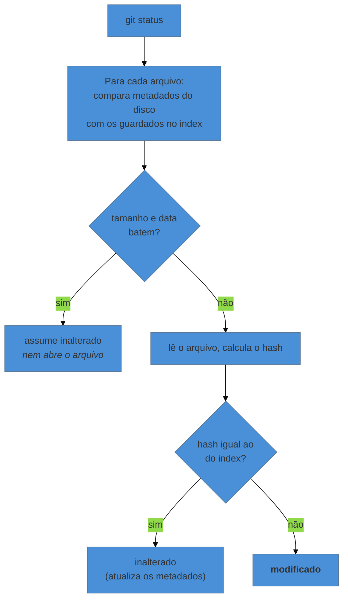

# O index por dentro

> [!abstract] TL;DR
> A "área de preparação" é um arquivo binário — `.git/index` — com a lista completa de todos os arquivos do projeto: caminho, hash do blob e metadados do sistema de arquivos. Ele tem **dois papéis**: é o rascunho do próximo commit (por isso "staging") e é um **cache** que permite ao `git status` responder rápido sem ler o conteúdo de nada. `git add` já escreve o blob no banco de objetos; `git commit` monta os trees a partir do index e cria o commit. E, durante um conflito, é o index que guarda as três versões em disputa.

---

## Por que ele tem dois nomes

Você já viu esse lugar chamado de *staging area*, *cache* e *index* — inclusive dentro do próprio Git, cujas flags oscilam entre `--cached` e `--staged` para a mesma coisa. Não é inconsistência gratuita: **são dois papéis diferentes do mesmo arquivo**.

- Como **staging area**, ele guarda o que vai no próximo commit. É o papel que a nota 03 apresentou com a analogia da caixa de mudança.
- Como **index**, ele é um índice de todos os arquivos rastreados, com metadados que tornam a comparação barata.

O segundo papel é o que quase ninguém conhece, e é o que explica uma coisa que deveria surpreender mais: **por que `git status` é instantâneo** num projeto com cem mil arquivos.

---

## O que tem lá dentro

```bash
git ls-files -s
```

```text
100644 f8b0e1d5e2b8471f0c6d9a3e7b52814f6d0e9c2a 0	capitulo-1.tex
100644 7c3d9012a4f5e6b8c9d0e1f2a3b4c5d6e7f8a9b0 0	referencias.bib
100644 5e1a77b3c4d5e6f7a8b9c0d1e2f3a4b5c6d7e8f9 0	figuras/grafico.png
```

Quatro colunas: **modo** (permissão), **hash do blob**, **estágio** (o `0` significa "sem conflito") e **caminho**.

Repare no que **não** está ali: nenhuma estrutura de pastas. O index é uma lista plana de caminhos completos, ordenada. As pastas (os trees da nota 17) só passam a existir no momento do commit — é o `git commit` que converte essa lista plana na hierarquia de trees.

E há uma parte invisível no `ls-files`: para cada entrada, o index guarda também metadados do sistema de arquivos — tamanho, data de modificação, inode, identificador do dispositivo.

---

## Por que o `status` é rápido

Sem o index, descobrir o que mudou exigiria ler e hashear cada arquivo do projeto a cada `git status`. Num repositório grande, isso seria insuportável.

Com o index, o Git faz uma coisa muito mais barata:



A maioria esmagadora dos arquivos não passa da primeira comparação. É por isso que `git status` responde em milissegundos onde uma varredura completa levaria dezenas de segundos.

> [!question]- Isso explica aquele momento em que o Git "acha" que tudo mudou?
> Sim. Se algo altera a data de modificação de todos os arquivos sem alterar o conteúdo — restaurar um backup, extrair um zip, uma ferramenta que reescreve arquivos, um `touch` em massa —, o cache do index deixa de bater. O Git então lê cada arquivo, descobre que o hash é o mesmo, conclui "inalterado" e atualiza os metadados. Resultado: um `git status` lento naquela primeira vez, e rápido depois. É também o motivo de um sintoma clássico: mudar de sistema de arquivos ou de máquina e ver um primeiro `status` demorado sem nada realmente modificado.

---

## O que cada comando faz com o index

Agora dá para reler o ciclo básico em termos precisos:

| Comando | O que acontece |
|---|---|
| `git add arq` | **escreve o blob no banco de objetos** e atualiza a entrada de `arq` no index (hash novo + metadados novos) |
| `git status` | compara três coisas: `HEAD` × index (o que está preparado) e index × disco (o que não está) |
| `git commit` | monta os trees a partir do index, cria o commit apontando para o tree raiz, e move a ref (nota 19) |
| `git restore --staged arq` | copia a entrada de `arq` do `HEAD` para o index — **sem tocar no disco** |
| `git restore arq` | copia o conteúdo do index para o disco — **por isso o trabalho não commitado se perde** |
| `git reset --soft <c>` | move só a ref |
| `git reset --mixed <c>` | move a ref **e** reescreve o index |
| `git reset --hard <c>` | move a ref, reescreve o index **e** o disco |

Duas coisas ficam claras aqui e resolvem confusões antigas.

**Primeira: `git add` já grava o conteúdo no repositório.** O blob passa a existir em `.git/objects` no momento do `add`, antes de qualquer commit. Isso significa que trabalho que passou por `git add` **não se perde facilmente**, mesmo sem commit — ele está no banco, e o `git fsck --lost-found` consegue encontrá-lo. Já o que nunca foi adicionado não existe para o Git, e é por isso que a nota 04 marcou `git restore` como o único comando genuinamente perigoso.

**Segunda: a tabela do `reset`** deixa de ser uma lista para decorar. As três formas são a mesma operação em três níveis de profundidade — ref, ref + index, ref + index + disco. Essa é a espinha da árvore de decisão da nota 22.

---

## Aquele terceiro campo: os estágios de conflito

O `0` do `ls-files -s` é o número do estágio. Fora de um conflito, tudo é `0`. Durante um conflito (nota 09), o mesmo caminho aparece **três vezes**:

```text
100644 <hash> 1	introducao.tex     ← ancestral comum (base)
100644 <hash> 2	introducao.tex     ← a sua versão (ours)
100644 <hash> 3	introducao.tex     ← a versão que chega (theirs)
```

É aqui que o merge guarda as três pontas enquanto espera você decidir — e é por isso que `git diff --ours` e `git diff --theirs` funcionam durante o conflito: eles comparam contra os estágios 2 e 3.

O `git add` no arquivo resolvido colapsa os três estágios num único estágio `0`, e é literalmente isso que "marcar como resolvido" significa. Não há flag mágica: **adicionar ao index é a resolução**.

E, se o Git recusa uma operação dizendo que há entradas não mescladas, agora você sabe exatamente o que ele está vendo.

---

## `git add -p`: o index como ferramenta de composição

A nota 14 recomendou `git add -p` para fazer commits atômicos. Com o modelo na mão, dá para entender o que ele faz: o Git te mostra pedaço por pedaço do diff entre index e disco, e para cada um que você aceita, ele **constrói um blob novo** contendo só as partes escolhidas — e coloca esse blob no index.

Consequência que confunde na primeira vez: depois de um `add -p` parcial, o mesmo arquivo aparece **ao mesmo tempo** como "preparado" e "modificado" no `git status`. Não é bug. São três versões diferentes coexistindo: a do `HEAD`, a do index (com o pedaço escolhido) e a do disco (com tudo).

Sem a área de preparação, isso seria impossível — e é o melhor argumento a favor de ela existir, respondendo à pergunta que a nota 03 levantou.

---

## Armadilhas comuns

> [!warning] `git rm --cached` não é `git rm`
> **O que acontece:** a pessoa quer parar de versionar um arquivo e roda `git rm`, apagando-o do disco. **Por quê:** `rm` remove do index **e** do disco; `rm --cached` remove só do index. **Como lembrar:** `--cached` significa "só no index" — é o mesmo sentido em `git diff --cached`. Foi exatamente o comando da nota 06 para o PDF já versionado.

> [!warning] Preparar, editar de novo, e commitar sem reparar
> **O que acontece:** você faz `add`, continua editando, commita — e o commit contém a versão de quando você deu `add`, não a que está na tela. **Por quê:** o commit é feito **a partir do index**, e o index congelou o conteúdo no momento do `add`. **Como evitar:** `git diff` (index × disco) antes de commitar mostra exatamente o que ficou de fora. É o hábito que a nota 04 recomendou, agora com o motivo.

> [!warning] Apagar `.git/index` achando que é grave
> **O que acontece:** o arquivo some ou corrompe, e o repositório parece quebrado. **Por quê:** o index é **derivado** — pode ser reconstruído a partir do `HEAD`. **Como resolver:** `git reset` (sem argumento) o reconstrói a partir do `HEAD`. Você perde apenas o que estava preparado e ainda não commitado, não o histórico. É o arquivo mais descartável de `.git/`.

---

## Resumo em uma frase

**O index é uma lista plana de caminho + hash + metadados que serve de rascunho do próximo commit e de cache do `status` — e é por ele que passa toda diferença entre "editado", "preparado" e "registrado".**

> [!tip] Vídeo — o index a fundo
> [**Git Index (Staging area)**](https://www.youtube.com/watch?v=b-G92QVXGeY) (Absolute Code, 27 min) tratamento longo e detalhado do arquivo `.git/index`, incluindo os metadados que fazem o `status` ser rápido.

> [!tip] Pratique
> Veja as três versões coexistirem, que é o experimento que fixa o conceito:
> ```bash
> echo "linha A" >> arq.txt && git add arq.txt
> echo "linha B" >> arq.txt          # edita DEPOIS do add
> git status                          # arq.txt aparece nos dois grupos
> git diff                            # index × disco → mostra só "linha B"
> git diff --staged                   # HEAD × index → mostra só "linha A"
> git ls-files -s arq.txt             # o hash congelado no index
> ```
> Depois, provoque um conflito (como na nota 09) e rode `git ls-files -s` no arquivo em disputa: ver as três linhas com estágios 1, 2 e 3 é o que transforma "conflito" de evento em estrutura de dados.

---

## O que vem a seguir

Falta a última peça do nível, e é a que quita mais dívida acumulada: o que o Git faz quando junta duas linhas de trabalho. Você já sabe que existe um ancestral comum e que o index guarda três versões — agora entra o algoritmo que usa isso, e a explicação de por que rebase reescreve a história em vez de juntá-la.

- **21 — Merge e rebase por dentro** — three-way merge, fast-forward e replay.
- [[03-Dominios/Tecnologia/Controle de Versão/N0 - Sobrevivência/03 - Seu primeiro repositório|03 — Seu primeiro repositório]] — os três lugares, agora com nome e formato.

## Fontes

- **Scott Chacon & Ben Straub** — [*Pro Git*, cap. 7 — "Reset Explicado"](https://git-scm.com/book/pt-br/v2/Ferramentas-do-Git-Reset-Explicado) — a apresentação das três árvores (HEAD, index, diretório de trabalho) e o efeito de cada modo de `reset`.
- **Git** — [*gitformat-index*](https://git-scm.com/docs/gitformat-index) — o formato binário do arquivo, incluindo os campos de metadados e o número de estágio.
- **Git** — [*git-ls-files*](https://git-scm.com/docs/git-ls-files) — a inspeção usada nesta nota, com a explicação dos estágios 1/2/3.
- **Git** — [*git-add*, seção "Interactive mode"](https://git-scm.com/docs/git-add#_interactive_mode) — o funcionamento do `add -p`.
