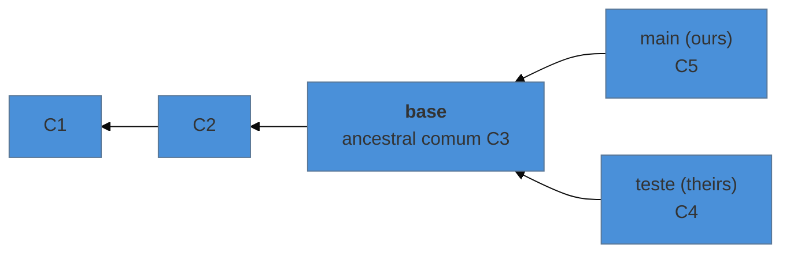
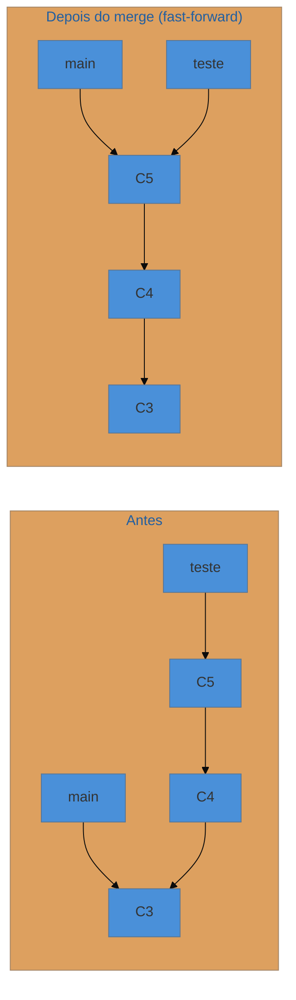
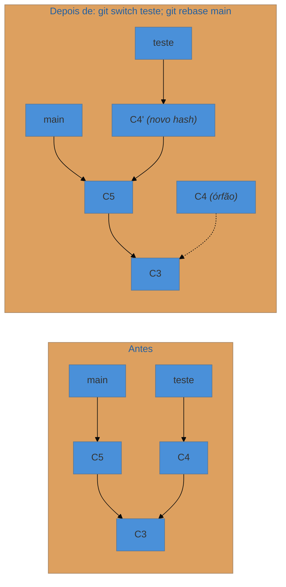

# Merge e rebase por dentro

> [!abstract] TL;DR
> O merge é uma comparação de **três** pontos: o ancestral comum (a base), o seu lado e o outro. Para cada trecho, o Git pergunta "mudou de um lado só?" — se sim, aceita; se mudou dos dois, é conflito. Quando a base é igual ao seu lado, não há o que combinar e ele apenas avança o ponteiro (*fast-forward*). O rebase é outra coisa: ele **reconstrói** os seus commits, um a um, sobre outra base — criando objetos novos com hashes novos. Daí a regra de ouro: rebase de história já publicada quebra a de todo mundo.

---

## Por que três, e não dois

Suponha que dois lados mudaram a mesma linha. Comparando só as duas versões finais, o Git veria "linha A" contra "linha B" — e não teria como saber quem mudou o quê. Seria conflito sempre, em toda diferença.

A informação que falta é o **ponto de partida**. Se a base dizia "linha A" e um lado mudou para "linha B" enquanto o outro não tocou, a resposta é óbvia: fica "linha B". Só há dúvida real quando os dois lados mudaram a mesma coisa **em relação à base**.

Por isso a operação se chama *three-way merge*. Os três pontos:



A base é encontrada por travessia do grafo (nota 18):

```bash
git merge-base main teste
```

E a decisão, trecho a trecho:

| Base | Ours | Theirs | Resultado |
|---|---|---|---|
| A | A | A | A — ninguém mexeu |
| A | **B** | A | **B** — só você mexeu |
| A | A | **B** | **B** — só eles mexeram |
| A | **B** | **B** | **B** — os dois fizeram a mesma coisa |
| A | **B** | **C** | ⚠ **conflito** |

A última linha é a única que precisa de gente. Todas as outras o Git resolve sozinho — e é por isso que a maioria dos merges passa sem drama, mesmo quando os dois lados mexeram bastante no mesmo arquivo.

Durante o conflito, as três colunas dessa tabela viram os estágios 1, 2 e 3 do index (nota 20), e os marcadores `<<<<<<<`/`=======`/`>>>>>>>` são a apresentação em texto de *ours* e *theirs*.

> [!info] Ver a base junto dos dois lados
> Por padrão o conflito mostra só os dois lados, o que às vezes torna impossível decidir. Peça o estilo com três partes:
> ```bash
> git config --global merge.conflictStyle zdiff3
> ```
> Aí o marcador inclui um bloco `|||||||` com **o que a base dizia** — e frequentemente a decisão fica evidente. É a configuração mais subestimada do Git.

---

## Fast-forward: quando não há merge nenhum

Se o ancestral comum **é** o seu commit atual, o seu lado não avançou desde a separação. Não há duas histórias para combinar: a do outro lado já contém a sua inteira.

Nesse caso o Git não cria commit algum — ele apenas **move a ref** (nota 19) para frente. Nada é reescrito, nada é combinado, nenhum objeto novo é criado.



É o mesmo mecanismo do `git pull` que "não faz nada além de trazer": se você não commitou nada local, o pull é um fast-forward.

Duas formas de controlar:

```bash
git merge --no-ff teste     # força um commit de merge, preservando o registro do ramo
git merge --ff-only teste   # recusa se não puder ser fast-forward
```

O `--no-ff` é comum em equipes que querem que cada funcionalidade apareça como um ponto identificável na história. O `--ff-only` é a garantia de "não quero commit de merge nenhum aqui" — e é o que muitos configuram para o `pull`.

---

## Rebase: reconstrução, não junção

O rebase resolve o mesmo problema com uma filosofia oposta. Em vez de criar um commit que junta as duas linhas, ele **refaz os seus commits como se você tivesse partido do ponto atual do outro lado**.

Para cada commit seu, na ordem:

1. calcula a diferença que aquele commit introduziu;
2. aplica essa diferença sobre a nova base;
3. **cria um commit novo** com o resultado — mensagem e autoria preservadas, mas **hash diferente**, porque o pai mudou (e, pela nota 17, mudar qualquer campo muda o hash).



Repare no `C4'`: **não é** o commit `C4` movido. É um objeto novo, com o mesmo conteúdo lógico e outro identificador. O `C4` original continua no banco de objetos, agora órfão — inalcançável por qualquer ref, e recuperável apenas pelo `reflog` (nota 23) até a coleta de lixo.

Essa é a explicação mecânica da **regra de ouro**:

> **Não faça rebase de commits que outras pessoas já têm.**

Se alguém baixou `C4` e você o substitui por `C4'`, existem agora dois commits com o mesmo conteúdo e identidades diferentes. Quando essa pessoa sincronizar, o Git vai tentar reconciliar as duas versões e produzir duplicatas — e o `push --force` necessário para publicar o rebase apaga do servidor o que ela tinha. É o mecanismo por trás do aviso da nota 11.

E a versão útil da regra: **antes de publicar, a história é sua** — porque ninguém mais tem aqueles objetos, e substituí-los não afeta ninguém.

---

## Escolhendo entre os dois

| | Merge | Rebase |
|---|---|---|
| O que faz | cria um commit com dois pais | recria seus commits sobre outra base |
| Hashes existentes | preservados | **substituídos** |
| História | registra que houve duas linhas | linear, como se nunca tivesse havido |
| Conflito | resolvido **uma vez** | pode reaparecer **a cada commit** reaplicado |
| Seguro em ramo público | sim | **não** |
| Rastreabilidade | preserva o contexto real | perde a informação de que houve paralelismo |

O critério prático que resolve a discussão na maioria das equipes: **rebase para arrumar o seu ramo local antes de propor; merge para integrar o que já foi revisado.** É a combinação que produz um histórico legível sem reescrever nada que já era de outra pessoa.

> [!question]- Por que o conflito pode voltar várias vezes no rebase?
> Porque cada commit é reaplicado separadamente. Se cinco commits seus tocam a mesma região que mudou na nova base, você pode resolver o mesmo conflito cinco vezes, uma a cada passo. Existe remédio: `git config --global rerere.enabled true` liga o *reuse recorded resolution* — o Git grava como você resolveu um conflito e reaplica sozinho quando o mesmo aparecer de novo. Para quem rebaseia com frequência, é a configuração que mais economiza tempo.

---

## O algoritmo por trás

Quando o Git precisa combinar dois lados, ele usa uma **estratégia de merge**. A padrão hoje chama-se **ort** (desde a versão 2.34, substituindo a antiga `recursive`), e ela lida com casos que a tabela de três colunas não cobre:

- **Renomeações** — se um lado renomeou o arquivo e o outro o editou, o ort detecta e aplica a edição no arquivo renomeado.
- **Múltiplas bases** — quando as duas linhas têm mais de um ancestral comum (acontece com merges cruzados), a estratégia mescla as próprias bases recursivamente para produzir uma base virtual. É daí que vinha o nome `recursive`.
- **Conflitos de diretório e arquivo** — um lado transformou `config` em pasta, o outro editou como arquivo.

Existem outras estratégias, usadas em casos específicos: `ours` (fica com o seu lado, ignorando o conteúdo do outro mas registrando o merge), `octopus` (mais de dois ramos de uma vez), `subtree` (para árvores em prefixos diferentes).

---

## Armadilhas comuns

> [!warning] Rebase de um ramo com merges dentro
> **O que acontece:** o ramo tinha commits de merge, e depois do rebase eles sumiram — a história ficou achatada numa linha. **Por quê:** por padrão o rebase reaplica apenas commits comuns e descarta os de merge. **Como evitar:** `git rebase --rebase-merges` preserva a estrutura. Ou, mais simples: não rebaseie ramos com topologia interna que você quer manter — use merge.

> [!warning] `git pull --rebase` num ramo compartilhado
> **O que acontece:** dois colegas trabalham no mesmo ramo remoto; o `pull --rebase` reescreve os commits locais de um deles que já haviam sido enviados. **Por quê:** o rebase não distingue "meus commits não publicados" de "meus commits já publicados" — ele reaplica tudo o que não está na base. **Como evitar:** `--rebase` é seguro no fluxo normal (ramo pessoal, commits ainda não enviados), que é o caso recomendado na nota 11. Em ramo compartilhado ativamente por duas pessoas, prefira merge.

> [!warning] Resolver o conflito escolhendo o lado errado no rebase
> **O que acontece:** durante um rebase, `--ours` e `--theirs` aparecem **invertidos** em relação à intuição: *ours* é a nova base (o ramo sobre o qual você está reaplicando) e *theirs* são os **seus** commits sendo reaplicados. **Por quê:** o rebase troca temporariamente de posição para reaplicar cada commit sobre a base. **Como evitar:** durante rebase, não confie nos nomes — leia o conteúdo. E `git status` durante o rebase diz explicitamente qual commit está sendo aplicado.

---

## Resumo em uma frase

**Merge compara três pontos e cria um commit que reconhece as duas histórias; rebase reconstrói os seus commits sobre outra base, produzindo objetos novos — e é por isso que um é seguro em ramo público e o outro não.**

> [!tip] Vídeo — fast-forward × three-way
> [**Git Branch and Merge: Fast Forward vs Three Way Merge**](https://www.youtube.com/watch?v=W5ek8Y3UUs4) (Cloud With Raj, 9 min) separa os dois casos com diagramas, que é a distinção que esta nota faz no meio do caminho.

> [!tip] Pratique
> Prove que o rebase cria objetos novos, o que é a afirmação central desta nota:
> ```bash
> git switch -c teste && echo x >> a.txt && git commit -am "teste"
> git rev-parse HEAD          # anote este hash
> git switch main && echo y >> b.txt && git commit -am "main"
> git switch teste && git rebase main
> git rev-parse HEAD          # hash DIFERENTE, mesmo conteúdo
> git reflog                  # o hash antigo ainda está aqui
> ```
> Depois faça os níveis **"Rampando"** (rebase) e **"Um monte de rebase"** do [Learn Git Branching em português](https://learngitbranching.js.org/?locale=pt_BR) — o simulador desenha os commits antigos ficando para trás enquanto as cópias aparecem na nova base, que é exatamente o diagrama desta nota, animado.

---

## O que vem a seguir

Você fecha aqui o **nível 3**, e com ele o modelo mental completo: objetos endereçados por conteúdo, um grafo de fotografias, refs de 41 bytes, um index que é rascunho e cache, e as duas formas de juntar linhas de trabalho.

O nível 4 usa isso para a parte que separa quem sabe Git de quem sobrevive a ele: desfazer com precisão, recuperar o que parecia perdido, reescrever a história com segurança, lidar com segredo vazado, e configurar a ferramenta a seu favor. Nada ali é decorável — tudo decorre do que você acabou de ver.

- **22 — A árvore de decisão do desfazer** — a primeira nota do N4.
- [[03-Dominios/Tecnologia/Controle de Versão/N3 - O modelo por baixo/index|N3 — O modelo por baixo]] — o índice do nível.
- [[03-Dominios/Tecnologia/Controle de Versão/N1 - O fluxo diário/09 - Conflito - por que acontece e como resolver|09 — Conflito]] — a prática que esta nota acaba de explicar por dentro.

## Fontes

- **Scott Chacon & Ben Straub** — [*Pro Git*, cap. 3 — "Rebase"](https://git-scm.com/book/pt-br/v2/Ramifica%C3%A7%C3%A3o-Git-Rebase) — o mecanismo de reaplicação e a formulação clássica da regra de ouro.
- **Git** — [*git-merge*, seção "Merge Strategies"](https://git-scm.com/docs/git-merge#_merge_strategies) — `ort`, `ours`, `octopus`, `subtree` e o tratamento de múltiplas bases.
- **Git** — [*git-rebase*](https://git-scm.com/docs/git-rebase) — `--rebase-merges`, `--onto` e o comportamento com commits de merge.
- **Git** — [*git-rerere*](https://git-scm.com/docs/git-rerere) — gravação e reaplicação automática de resoluções de conflito.
- **Junio C. Hamano e col.** — [*Notas de release do Git 2.34*](https://github.com/git/git/blob/master/Documentation/RelNotes/2.34.0.adoc) — a adoção do `ort` como estratégia padrão em lugar do `recursive`.
- **Josenaldo Matos** — [*workshop-git*](https://github.com/josenaldo/workshop-git) (2016), Tomo 8 — "Merge e rebase", cujos diagramas esta nota redesenha com o mecanismo por trás.
