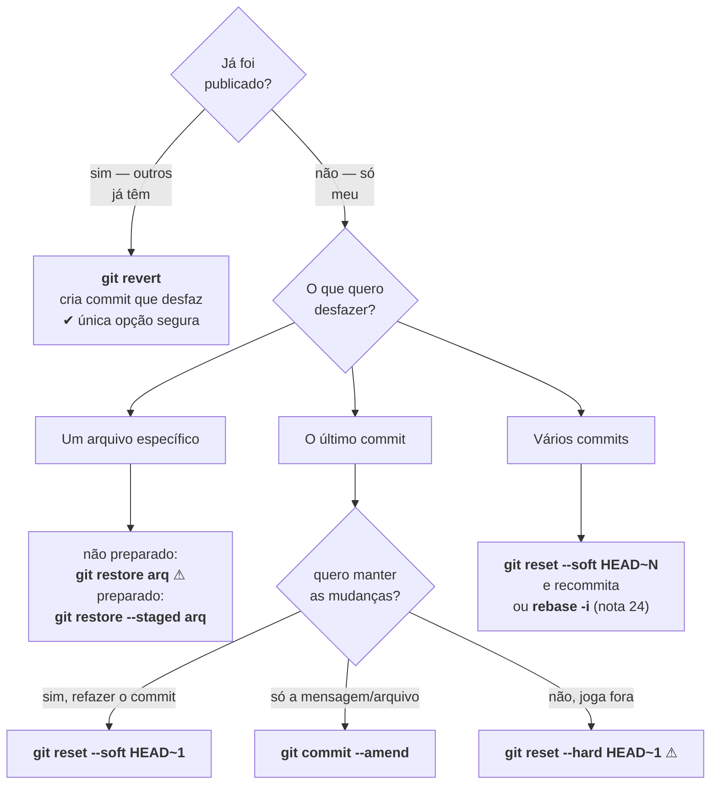
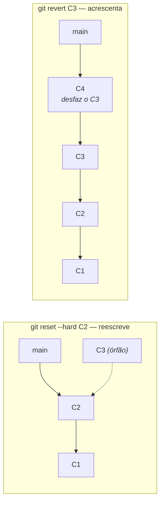

# A árvore de decisão do desfazer

> [!abstract] TL;DR
> Duas perguntas resolvem qualquer "quero desfazer": **o que exatamente eu quero mover** (só a ref? a ref e o index? também os arquivos?) e **isso já foi publicado?**. A primeira escolhe entre `reset --soft`, `--mixed` e `--hard`; a segunda decide entre reescrever (`reset`, `amend`) e acrescentar (`revert`). O `restore` cobre o caso de arquivo isolado. Com o modelo do nível 3 na mão, isso deixa de ser uma lista de comandos e vira uma tabela de duas entradas.

---

## As três árvores

O nível 3 mostrou que existem três lugares: o `HEAD` (via ref), o index e o diretório de trabalho. Todo comando de desfazer é uma combinação de "qual destes eu mexo".


| Comando | ref | index | disco | Perde trabalho? |
|---|:---:|:---:|:---:|---|
| `git reset --soft <c>` | ✅ | — | — | não |
| `git reset --mixed <c>` *(padrão)* | ✅ | ✅ | — | não |
| `git reset --hard <c>` | ✅ | ✅ | ✅ | **sim**, o não commitado |
| `git restore --staged <arq>` | — | ✅ | — | não |
| `git restore <arq>` | — | — | ✅ | **sim**, o não commitado |
| `git revert <c>` | ✅ *(commit novo)* | ✅ | ✅ | não |
| `git commit --amend` | ✅ *(substitui)* | — | — | não |

Duas leituras dessa tabela valem mais que decorar comandos:

**Os `reset` são a mesma operação em três profundidades.** `--soft` move só o ponteiro (seus arquivos e o preparado ficam intactos — é o que você quer para "juntar os três últimos commits num só"). `--mixed` acrescenta a limpeza do index. `--hard` acrescenta a sobrescrita do disco, e por isso é o único perigoso.

**Só duas linhas perdem trabalho**, e ambas pela mesma razão: elas sobrescrevem o diretório com conteúdo que veio de outro lugar. O que nunca foi commitado (nem adicionado) não existe no banco de objetos, então não há de onde trazer de volta.

---

## A árvore



---

## Os casos, um a um

**"A mensagem do último commit está errada."**
```bash
git commit --amend -m "Mensagem certa"
```

**"Esqueci um arquivo no último commit."**
```bash
git add esquecido.py
git commit --amend --no-edit
```

**"Fiz três commits que deveriam ser um."**
```bash
git reset --soft HEAD~3     # desfaz os três, MANTÉM tudo preparado
git commit -m "A mudança inteira, numa mensagem só"
```
Este é o uso clássico do `--soft`, e o que mais economiza tempo: ele desmonta commits sem tocar em uma linha do seu trabalho.

**"Quero desfazer o último commit e continuar editando."**
```bash
git reset HEAD~1            # --mixed é o padrão; as mudanças voltam a ser "não preparadas"
```

**"Quero jogar fora tudo desde o commit X."**
```bash
git reset --hard <hash-de-X>    # ⚠ o não commitado se perde
```

**"O commit já está no servidor e outras pessoas já baixaram."**
```bash
git revert <hash>
```
O `revert` **não apaga nada**: ele cria um commit novo cujo conteúdo é o inverso do commit indicado. A história ganha um capítulo em vez de perder um — que é exatamente o que se quer quando ela é compartilhada.

Para reverter um merge, é preciso dizer qual lado manter (nota 18):
```bash
git revert -m 1 <hash-do-merge>
```

---

## `reset` × `revert`: a diferença que importa



O `reset` move o ponteiro para trás e deixa commits órfãos — que continuam no banco, alcançáveis só pelo `reflog` (nota 23). Quem já tinha `C3` continua com ele, e o seu repositório passa a divergir do de todo mundo.

O `revert` mantém tudo e acrescenta. É mais "sujo" na aparência do histórico e é a única forma correta quando a história saiu da sua máquina.

> [!info] Por que reverter é melhor que apagar, mesmo quando dá para apagar
> Um `revert` deixa registro de que aquilo existiu e foi desfeito — e o motivo fica na mensagem. Meses depois, quando alguém perguntar "por que não usamos a abordagem X?", a resposta está no histórico. O `reset` apaga a pergunta junto com a resposta.

---

## O caso do arquivo isolado

O nível 0 já cobriu, mas agora com mecanismo:

```bash
git restore arq.txt                    # index → disco  ⚠ perde a edição
git restore --staged arq.txt           # HEAD → index   (edição preservada)
git restore --source=HEAD~3 arq.txt    # commit antigo → disco
```

A terceira forma é a mais subestimada: ela traz **um arquivo** de um ponto qualquer do passado, sem mexer em mais nada. É o que resolve "aquela versão do script de abril funcionava" sem precisar reverter nada.

---

## Armadilhas comuns

> [!warning] `git reset --hard` com trabalho não commitado
> **O que acontece:** o comando resolve o que você queria e leva junto duas horas de edição que ainda não tinham virado commit. **Por quê:** `--hard` sobrescreve o diretório de trabalho, e o que nunca entrou no banco de objetos não tem de onde voltar. **Como evitar:** rode `git status` antes. Se houver qualquer coisa pendente que importe, commite (mesmo que como `wip`) ou `git stash` primeiro. **Exceção importante:** se o trabalho tinha passado por `git add`, o blob existe no banco — veja a nota 23 sobre `fsck --lost-found`.

> [!warning] Reverter um merge e depois querer mergear de novo
> **O que acontece:** o ramo é revertido, depois corrigido, e o novo merge "não traz nada". **Por quê:** para o Git, aquele ramo já está integrado — o merge original continua no grafo. O revert desfez o *conteúdo*, não a *topologia*. **Como resolver:** reverta o revert (`git revert <hash-do-revert>`) antes de integrar de novo, ou refaça o trabalho num ramo novo. É uma das situações mais confusas do Git, e a documentação oficial do `git revert` a discute explicitamente.

> [!warning] Usar `reset` num ramo compartilhado "porque foi rápido"
> **O que acontece:** você reseta, dá `push --force`, e quebra o repositório de todo mundo — incluindo commits alheios que estavam à frente. **Por quê:** você reescreveu a ref do servidor (nota 19). **Como evitar:** a primeira pergunta da árvore existe justamente para isso. Se saiu da sua máquina, `revert`.

---

## Resumo em uma frase

**Pergunte "já publiquei?" para escolher entre reescrever e acrescentar, e "quais das três árvores eu quero mexer?" para escolher a profundidade — o resto é consequência.**

> [!tip] Vídeo — os três resets, visualizados
> [**Git Reset Mixed, Soft and Hard Explained - Visualized in Realtime**](https://www.youtube.com/watch?v=WqIo4dz1JcM) (A shot of code, 11 min) mostra em tempo real o efeito de cada modo sobre ref, index e diretório — a tabela desta nota, animada.

> [!tip] Pratique
> Monte um repositório de brinquedo com cinco commits e execute a árvore inteira, conferindo com `git log --oneline` e `git status` depois de cada passo: `--soft HEAD~2` e recommitar · `--mixed HEAD~1` · `--hard HEAD~1` (com algo não commitado, de propósito, para ver a perda) · `revert` do commit do meio · `restore --source`.
>
> Os **[git-katas](https://github.com/eficode-academy/git-katas)** têm exercícios prontos para isso (`reset--hard`, `revert`, `basic-commits`), com o cenário já montado.

---

## O que vem a seguir

Você acabou de ver comandos que deixam commits órfãos e um que perde trabalho de vez. A próxima nota é o antídoto: o registro que o Git mantém de todo lugar onde o `HEAD` esteve, e que recupera quase tudo que parecia perdido.

- **23 — `reflog`: nada se perde de fato** — recuperar commit órfão, branch apagada e `reset --hard` arrependido.
- [[03-Dominios/Tecnologia/Controle de Versão/N3 - O modelo por baixo/20 - O index por dentro|20 — O index por dentro]] — as três árvores que esta nota manipula.

## Fontes

- **Scott Chacon & Ben Straub** — [*Pro Git*, cap. 7 — "Reset Explicado"](https://git-scm.com/book/pt-br/v2/Ferramentas-do-Git-Reset-Explicado) — a apresentação das três árvores e o efeito de cada modo, base desta nota.
- **Git** — [*git-reset*](https://git-scm.com/docs/git-reset) · [*git-restore*](https://git-scm.com/docs/git-restore) — os modos e a separação de responsabilidades introduzida em 2019.
- **Git** — [*git-revert*](https://git-scm.com/docs/git-revert) — incluindo `-m` para merges.
- **Linus Torvalds** — [*Reverting a faulty merge*](https://github.com/git/git/blob/master/Documentation/howto/revert-a-faulty-merge.txt) — o documento oficial sobre por que reverter um merge complica a reintegração posterior.
