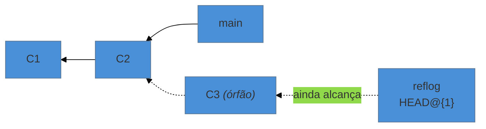

# `reflog` — nada se perde de fato

> [!abstract] TL;DR
> O Git mantém um diário de **todo lugar onde suas refs já estiveram** — cada commit, checkout, merge, rebase e reset. É o `reflog`, e ele é local, privado e não vai junto no clone. Com ele se recupera commit órfão, ramo apagado, `reset --hard` arrependido e rebase que deu errado. O limite é claro: ele registra **movimentos de ref**, então só alcança o que um dia virou commit. O que nunca foi commitado nem adicionado, ele não salva.

---

## O comando que você vai querer ter memorizado

```bash
git reflog
```

```text
a3f1c9d HEAD@{0}: reset: moving to HEAD~2
9d2f1ae HEAD@{1}: commit: Adiciona seção de limitações
c4d2e1a HEAD@{2}: commit: Reescreve a metodologia
7b3e991 HEAD@{3}: checkout: moving from teste to main
2f8a445 HEAD@{4}: rebase (finish): returning to refs/heads/teste
```

Cada linha é **um lugar onde o `HEAD` esteve**, do mais recente para o mais antigo, com o motivo. O commit `9d2f1ae` da linha 1 é aquele que o `reset` acabou de tornar órfão — invisível no `git log`, mas aqui, à mão.

Recuperar é apontar uma ref de volta para ele (nota 19):

```bash
git switch -c recuperado 9d2f1ae      # o mais seguro: cria um ramo novo
git reset --hard HEAD@{1}             # ou volta o ramo atual pra onde estava
```

Prefira a primeira forma quando estiver em pânico: ela **não destrói nada**, só acrescenta um ponteiro. Você olha, confere, e decide depois.

---

## Por que isso funciona

Duas propriedades do nível 3 se combinam aqui.

**Objetos são imutáveis e nada os apaga imediatamente** (nota 17). Um `reset`, um `amend` ou um rebase criam objetos novos; os antigos continuam no banco.

**"Existir" é "ser alcançável"** (nota 18). O que esses comandos fazem é tornar commits inalcançáveis — nenhuma ref aponta mais para eles, então o `git log` não os vê.

O `reflog` é a terceira peça: um registro paralelo que guarda os hashes por onde as refs passaram. Ele **mantém alcançáveis** commits que nenhuma ref alcança mais.



Existe um reflog do `HEAD` e um por ramo:

```bash
git reflog                      # o do HEAD
git reflog show main            # só os movimentos da main
git reflog show --date=iso      # com datas legíveis
```

---

## Os quatro resgates clássicos

**1. `reset --hard` do qual você se arrependeu**
```bash
git reflog                      # ache o hash de antes do reset
git reset --hard HEAD@{1}
```

**2. Ramo apagado com `-D`**
```bash
git reflog                      # procure a última posição daquele ramo
git switch -c ramo-recuperado <hash>
```
Funciona porque o reflog do `HEAD` registrou os checkouts e commits feitos naquele ramo, mesmo depois de a ref sumir.

**3. Rebase que estragou tudo**
```bash
git reflog                      # procure "rebase (start)"; a linha ANTERIOR é o estado original
git reset --hard HEAD@{5}
```
Existe um atalho para isso: `ORIG_HEAD` guarda a posição antes da última operação grande (merge, rebase, reset). `git reset --hard ORIG_HEAD` costuma resolver de primeira.

**4. Commits feitos em `detached HEAD` e "perdidos" ao trocar de ramo**
```bash
git reflog                      # os commits estão lá, com o motivo "commit"
git switch -c salvos <hash>
```

---

## O que o `reflog` **não** salva

Este é o limite, e vale entender com precisão porque ele desenha a linha entre "recuperável" e "perdido":

| Situação | Recuperável? | Por quê |
|---|---|---|
| commit descartado por reset/rebase/amend | ✅ reflog | virou objeto, ref passou por ele |
| ramo apagado | ✅ reflog | idem |
| arquivo que passou por `git add` mas nunca foi commitado | ⚠️ `fsck` | o **blob existe** no banco, mas nenhuma ref o alcança |
| edição nunca adicionada, descartada por `restore` ou `--hard` | ❌ | nunca existiu para o Git |
| repositório clonado em outra máquina | ❌ ali | reflog é **local**; o clone começa vazio |

O caso do meio tem solução, e é pouco conhecida:

```bash
git fsck --lost-found
```

Ele varre o banco procurando objetos inalcançáveis e escreve o que encontra em `.git/lost-found/`. Commits órfãos viram arquivos com o hash; blobs soltos também. Aí é `git cat-file -p <hash>` para ler o conteúdo e recuperar manualmente.

Não é bonito, mas já salvou muita gente que fez `git add` e depois um `reset --hard`.

> [!warning] O `reflog` é local e privado
> **O que acontece:** a pessoa espera recuperar, num clone novo, um commit que existia na máquina antiga.
> **Por quê:** o reflog vive em `.git/logs/` e **não é transferido** por `clone`, `fetch` ou `push`. Cada cópia tem o seu, refletindo apenas o que aconteceu ali.
> **Consequência prática:** se o único lugar onde um commit existia era uma máquina que você formatou, ele acabou. E, do outro lado, isso é uma boa notícia: seus experimentos e resets não vazam para o repositório de ninguém.

---

## Quanto tempo isso dura

O reflog não é eterno. Os padrões do Git:

| Configuração | Padrão | O que controla |
|---|---|---|
| `gc.reflogExpire` | 90 dias | entradas que ainda são alcançáveis |
| `gc.reflogExpireUnreachable` | **30 dias** | entradas de commits inalcançáveis |
| `gc.pruneExpire` | 2 semanas | objetos soltos sem referência |

A linha do meio é a que importa num resgate: **um commit descartado tem cerca de 30 dias de janela** antes que a coleta de lixo possa removê-lo de vez. Na prática, a limpeza só acontece quando o `git gc` roda (automaticamente, quando há objetos soltos demais), então frequentemente sobra mais tempo — mas não conte com isso.

Se você tem um repositório onde quer uma rede de segurança maior:

```bash
git config gc.reflogExpireUnreachable 180.days
```

E o inverso: **nunca rode `git gc --prune=now` ou `git reflog expire --expire=now --all` "para limpar"** sem entender que isso apaga a rede de segurança imediatamente. É a única forma de transformar "recuperável" em "perdido" por conta própria.

---

## Armadilhas comuns

> [!warning] Procurar no `git log` o que só o `reflog` vê
> **O que acontece:** a pessoa conclui que perdeu o trabalho porque `git log --all` não mostra nada.
> **Por quê:** o `log`, mesmo com `--all`, percorre o que é alcançável **por refs**. Órfão não aparece.
> **Como evitar:** o reflog é o primeiro lugar a olhar, não o último. Antes de qualquer conclusão dramática: `git reflog`.

> [!warning] Rodar `reset --hard` de novo no meio do resgate
> **O que acontece:** durante a recuperação, a pessoa dá mais um `--hard` e perde o que tinha acabado de achar.
> **Por quê:** pânico + comando destrutivo.
> **Como evitar:** no resgate, use **só** comandos que acrescentam: `git switch -c salvamento <hash>`, `git branch backup <hash>`, `git tag socorro <hash>`. Criar ponteiros é grátis e nunca destrói nada. Só depois de conferir é que se move o ramo real.

> [!warning] Confiar no reflog para história compartilhada
> **O que acontece:** alguém dá `push --force`, apaga trabalho no servidor, e assume que "o reflog resolve".
> **Por quê:** o reflog que importa seria o **do servidor**, ao qual você não tem acesso. Plataformas mantêm algo equivalente internamente, mas recuperar depende de suporte.
> **Como evitar:** quem tinha o trabalho localmente ainda o tem — peça a essa pessoa que empurre de volta. É quase sempre a via mais rápida, e é a razão de a nota 11 tratar `--force` como interdição.

---

## Resumo em uma frase

**O `reflog` é o diário local de onde suas refs estiveram — e enquanto um commit estiver nele, ele existe, mesmo que o `git log` jure que não.**

> [!tip] Vídeo — o resgate acontecendo na tela
> [**How to Recover Lost Commits with Git Reflog**](https://www.youtube.com/watch?v=fyhYSl-ACPc) (CodeLucky, 4 min) mostra o ciclo inteiro — perder o commit, achá-lo no `reflog`, trazê-lo de volta — em tempo real. Vale ver o resgate uma vez com os olhos antes de fazê-lo com as mãos, porque na hora real você vai estar com pressa.

> [!tip] Pratique
> Faça o resgate uma vez, com calma, antes de precisar dele com pressa:
> ```bash
> echo teste > x.txt && git add x.txt && git commit -m "commit que vou perder"
> git rev-parse HEAD          # anote
> git reset --hard HEAD~1     # "perdeu"
> git log --oneline           # não está mais lá
> git reflog                  # está aqui
> git switch -c resgate HEAD@{1}
> ```
> Depois teste o limite: crie um arquivo, `git add`, `git reset --hard`, e recupere com `git fsck --lost-found`. Ver o blob aparecer em `.git/lost-found/` é o que fixa a diferença entre "adicionado" e "nunca visto pelo Git".
>
> Os **[git-katas](https://github.com/eficode-academy/git-katas)** têm o kata `reflog` com cenário pronto.

---

## O que vem a seguir

Com a rede de segurança entendida, dá para fazer com tranquilidade o que antes assustava: reescrever a própria história — juntar commits, corrigir mensagens antigas, reordenar, remover um commit do meio. É o assunto da próxima nota, e o reflog é o que torna isso reversível.

- **24 — Reescrever história com segurança** — `rebase -i`, `--fixup`, `cherry-pick` e `--force-with-lease`.
- [[03-Dominios/Tecnologia/Controle de Versão/N4 - Quando dá errado/22 - A árvore de decisão do desfazer|22 — A árvore de decisão do desfazer]] — os comandos que criam os órfãos que esta nota recupera.

## Fontes

- **Scott Chacon & Ben Straub** — [*Pro Git*, cap. 7 — "Ferramentas do Git: Reescrevendo o Histórico"](https://git-scm.com/book/pt-br/v2/Ferramentas-do-Git-Reescrevendo-o-Hist%C3%B3rico) — o uso do reflog como rede de segurança.
- **Git** — [*git-reflog*](https://git-scm.com/docs/git-reflog) — sintaxe `HEAD@{n}`, reflog por ref e as opções de expiração.
- **Git** — [*git-fsck*](https://git-scm.com/docs/git-fsck) — `--lost-found`, `--unreachable` e `--dangling`.
- **Git** — [*git-gc*](https://git-scm.com/docs/git-gc) — os padrões `gc.reflogExpire` (90 dias), `gc.reflogExpireUnreachable` (30 dias) e `gc.pruneExpire` (2 semanas).
- **Josenaldo Matos** — [*curso-git-github*](https://github.com/josenaldo/curso-git-github) (2017), Tomo 6 — *"Após o commit, tudo é registrado e é muito difícil perder algo"*, cuja promessa esta nota cumpre com o mecanismo.
