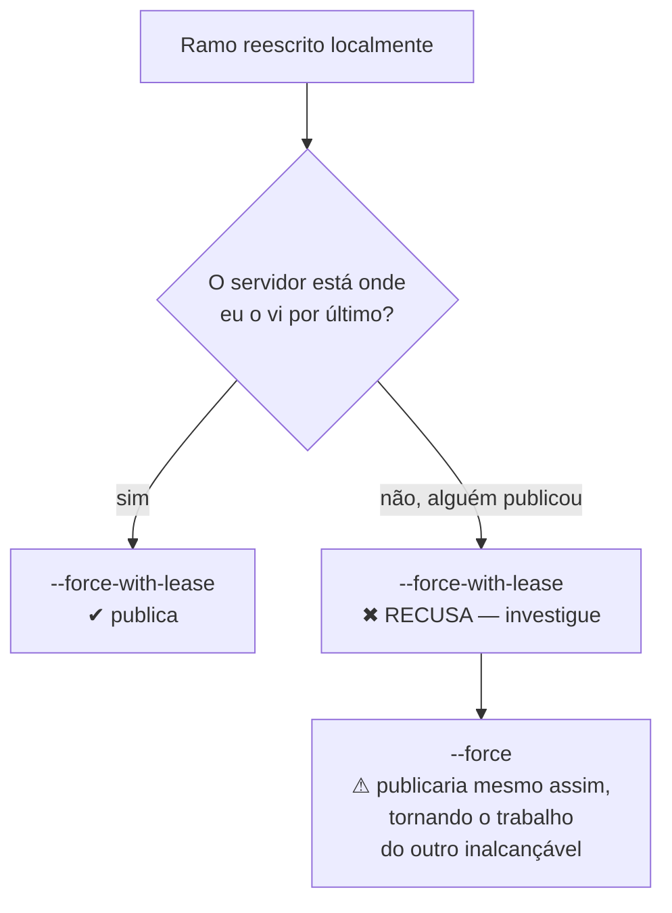

# Reescrever história com segurança

> [!abstract] TL;DR
> `git rebase -i` abre a lista dos seus commits e deixa você reordenar, juntar, dividir, renomear e remover — cada linha é uma instrução. `git commit --fixup` mais `--autosquash` automatiza o caso mais comum (corrigir um commit antigo do próprio ramo) sem edição manual. `cherry-pick` copia um commit para outro lugar. E quando o ramo já estava publicado, `--force-with-lease` é o que substitui o `--force`: ele recusa o envio se alguém tiver publicado algo desde a sua última sincronização.

---

## O que "reescrever" significa aqui

Pelo nível 3: reescrever história é **criar objetos novos** e apontar a ref para eles, deixando os antigos órfãos (nota 21). Não existe edição no lugar.

Isso tem duas consequências que organizam a nota inteira:

- **É seguro no seu ramo não publicado**, porque ninguém mais tem aqueles objetos.
- **É reversível**, sempre, pelo `reflog` (nota 23) — o que torna razoável experimentar.

O objetivo legítimo: **o ramo que você propõe para revisão deve contar a história de como a mudança deveria ter sido feita, não a de como ela foi feita.** Ninguém precisa ver "agora vai", "corrige typo do commit anterior" e "wip".

---

## `rebase -i`: a lista de instruções

```bash
git rebase -i HEAD~5        # os 5 últimos commits
git rebase -i main          # tudo o que este ramo tem além da main
```

O editor abre com algo assim — **do mais antigo para o mais novo**, o inverso do `git log`:

```text
pick a1b2c3d Implementa busca por especialidade
pick d4e5f6a corrige typo
pick 7g8h9i0 Adiciona testes da busca
pick j1k2l3m wip
pick n4o5p6q agora vai
```

Você edita as palavras da esquerda:

| Instrução | O que faz |
|---|---|
| `pick` | mantém o commit como está |
| `reword` | mantém as mudanças, abre o editor para trocar a mensagem |
| `edit` | pausa naquele commit para você alterar o conteúdo |
| `squash` | funde no commit anterior, **combinando** as mensagens |
| `fixup` | funde no anterior, **descartando** a mensagem deste |
| `drop` | remove o commit |
| `exec` | roda um comando após aquele ponto |
| `break` | pausa ali sem alterar nada |

Reordenar é reordenar as linhas. O resultado, para o exemplo acima:

```text
pick a1b2c3d Implementa busca por especialidade
fixup d4e5f6a corrige typo
pick 7g8h9i0 Adiciona testes da busca
fixup j1k2l3m wip
fixup n4o5p6q agora vai
```

Cinco commits viram dois, limpos. Salve, feche, e o Git reaplica.

> [!info] `exec` para bisecar antes da hora
> `exec` roda um comando depois de cada commit reaplicado. Combinado com `-x`, ele verifica todo o ramo:
> ```bash
> git rebase -i --exec "npm test" main
> ```
> Isso reaplica cada commit e roda os testes em cada um — descobrindo qual deles quebra o build **antes** de alguém precisar do `bisect` (nota 32) para achar isso meses depois. É a diferença entre "o ramo funciona no fim" e "todo commit do ramo funciona".

---

## O caminho mais rápido: `--fixup` e `--autosquash`

Editar a lista à mão funciona, mas há um jeito melhor para o caso mais comum: você percebe agora que o commit de três atrás tinha um problema.

```bash
# corrige o que precisa
git add arquivo.py
git commit --fixup=a1b2c3d          # marca: "isto pertence àquele commit"

# quando quiser consolidar
git rebase -i --autosquash main     # já vem com as linhas na ordem e marcadas como fixup
```

O `--fixup` cria um commit com mensagem `fixup! <mensagem do alvo>`, e o `--autosquash` reconhece esse prefixo, reposiciona e marca automaticamente. Você só confirma.

Vale ligar de vez:

```bash
git config --global rebase.autoSquash true
git config --global rebase.autoStash true   # guarda e devolve o não commitado sozinho
```

O `autoStash` resolve o incômodo de o rebase recusar começar por causa de trabalho pendente.

---

## `cherry-pick`: copiar um commit

```bash
git cherry-pick <hash>
git cherry-pick <hash1>..<hash2>    # um intervalo
git cherry-pick -x <hash>           # anota a origem na mensagem
```

Ele calcula a diferença que aquele commit introduziu e a aplica onde você está, criando um **commit novo** — mesmo conteúdo, hash diferente.

Usos legítimos: levar uma correção urgente da `main` para um ramo de release (nota 13), ou resgatar um commit de um ramo que será abandonado.

O `-x` acrescenta à mensagem a linha `(cherry picked from commit ...)`, e vale sempre em contexto de manutenção de versões — sem ele, meses depois ninguém sabe que aqueles dois commits em ramos diferentes são a mesma correção.

> [!warning] Cherry-pick sistemático é sintoma
> **O que acontece:** o time copia dezenas de commits entre ramos toda semana. **Por quê:** normalmente é a estratégia de ramificação que está errada — ramos de longa duração divergindo (nota 13). **Como evitar:** cherry-pick é bom como exceção pontual. Como rotina, ele duplica história, esconde o que está em qual ramo, e cria conflitos quando os ramos finalmente se encontram.

---

## Publicando o que foi reescrito

Se o ramo nunca foi enviado, `git push` normal resolve. Se já foi, o servidor vai recusar (nota 11) — e a resposta certa **não** é `--force`:

```bash
git push --force-with-lease
```

A diferença é o que cada um verifica:

- **`--force`** — "sobrescreva a ref do servidor com a minha, aconteça o que acontecer". Se alguém publicou algo nesse meio-tempo, esse trabalho fica inalcançável.
- **`--force-with-lease`** — "sobrescreva **somente se** o servidor ainda estiver onde eu vi pela última vez". Se alguém publicou, o envio é recusado e você descobre antes de destruir.



> [!warning] O `--force-with-lease` tem um furo conhecido
> **O que acontece:** você roda `git fetch` (ou uma ferramenta o faz por você, como a busca automática de alguns editores e IDEs) sem integrar nada. O `origin/main` local é atualizado, o "lease" passa a refletir o estado novo — e a proteção deixa de proteger. **Por quê:** a garantia compara sua referência remota local com o servidor; um `fetch` sincroniza as duas mesmo sem você ter visto o conteúdo. **Como evitar:** desde o Git 2.30 existe `--force-if-includes`, que exige adicionalmente que o que você está sobrescrevendo esteja **incluído** no seu ramo — e ele é aplicado automaticamente quando se usa `--force-with-lease` sem especificar o valor esperado. Na prática: use `--force-with-lease` sem argumentos, em Git atual, e não confie em `fetch` automático de IDE.

E, mesmo dando tudo certo: se o ramo é compartilhado, **avise as pessoas**. Quem já tinha o ramo antigo precisa de `git fetch` e `git reset --hard origin/<ramo>`, porque o `pull` normal vai tentar mesclar as duas versões e criar duplicatas.

---

## Quando **não** reescrever

| Situação | Faça |
|---|---|
| ramo pessoal, ainda não enviado | reescreva à vontade |
| PR aberto, revisão em andamento | **evite** — reescrever invalida os comentários já feitos, que perdem a âncora. Acrescente commits e deixe o squash para o merge (nota 12) |
| ramo compartilhado com outra pessoa agora | não. Combine antes |
| `main`/`develop` | nunca |
| commit assinado por outra pessoa | não — reescrever quebra a assinatura |

A linha do PR merece ênfase: é comum a pessoa "limpar o histórico" no meio da revisão e o revisor perder o fio, porque os comentários ficam órfãos e o "ver o que mudou desde a última revisão" para de funcionar.

---

## Resumo em uma frase

**Reescrever é criar commits novos e mover a ref — legítimo e reversível enquanto for só seu, e uma conversa com o time a partir do momento em que não é.**

> [!tip] Vídeo — fixup na prática
> [**Git rebase using fixup**](https://www.youtube.com/watch?v=z8Gmolj666o) (Kasper Finne Nielsen, 5 min) demonstra o fluxo `--fixup` + `--autosquash` que esta nota recomenda no lugar da edição manual da lista.

> [!tip] Pratique
> Monte um ramo sujo de propósito — cinco commits, com dois "wip" e um "corrige typo" — e limpe-o com `git rebase -i main`, usando `reword`, `fixup` e uma reordenação. Depois desfaça tudo com `git reset --hard ORIG_HEAD` e refaça pelo caminho do `--fixup` + `--autosquash`. Comparar os dois caminhos é o que mostra por que o segundo virou padrão.
>
> No simulador, os níveis de **"Rampando"** e **"Movendo o trabalho por aí"** do [Learn Git Branching em português](https://learngitbranching.js.org/?locale=pt_BR) cobrem `rebase -i` e `cherry-pick` com o grafo desenhado.

---

## O que vem a seguir

Existe um caso em que reescrever a história deixa de ser conveniência e vira obrigação: quando algo que não podia estar no repositório entrou nele. A próxima nota trata disso — e da parte que a maioria das pessoas erra, que é achar que reescrever é a ação mais urgente.

- **25 — Segredos no histórico: quando vaza** — `filter-repo`, rotação e o que a plataforma ainda guarda.
- [[03-Dominios/Tecnologia/Controle de Versão/N3 - O modelo por baixo/21 - Merge e rebase por dentro|21 — Merge e rebase por dentro]] — o mecanismo de reaplicação que esta nota opera.

## Fontes

- **Scott Chacon & Ben Straub** — [*Pro Git*, cap. 7 — "Reescrevendo o Histórico"](https://git-scm.com/book/pt-br/v2/Ferramentas-do-Git-Reescrevendo-o-Hist%C3%B3rico) — `rebase -i`, squash, split e as advertências sobre história publicada.
- **Git** — [*git-rebase*, seção "Interactive Mode"](https://git-scm.com/docs/git-rebase#_interactive_mode) — a lista completa de instruções, incluindo `exec` e `break`.
- **Git** — [*git-push*](https://git-scm.com/docs/git-push) — `--force-with-lease`, `--force-if-includes` e a descrição explícita do furo causado por `fetch` em segundo plano.
- **Git** — [*git-cherry-pick*](https://git-scm.com/docs/git-cherry-pick) — intervalos, `-x` e o comportamento com merges.
- **Git** — [*Notas de release do Git 2.30*](https://github.com/git/git/blob/master/Documentation/RelNotes/2.30.0.adoc) — a introdução de `--force-if-includes`.
