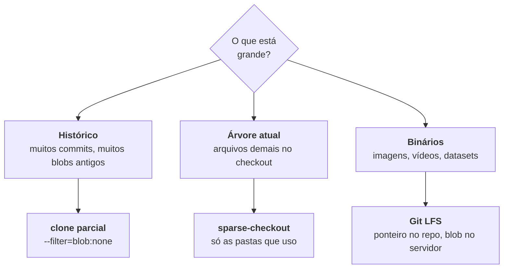

# Monorepo e polyrepo

> [!abstract] TL;DR
> A escolha entre um repositório grande e vários pequenos não é sobre gosto: é sobre **onde você quer o atrito**. Monorepo torna trivial mudar duas coisas juntas e torna difícil escalar ferramenta e permissão; polyrepo faz o inverso. Quando o repositório fica grande demais para o clone completo, o Git tem respostas: **clone parcial** (`--filter=blob:none`) baixa só o histórico que você usa, **sparse-checkout** materializa só as pastas que interessam, e **Git LFS** tira binários pesados do repositório. Clone raso (`--depth`) é a resposta errada para quase tudo, exceto CI.

---

## O que realmente muda entre os dois

| | Monorepo | Polyrepo |
|---|---|---|
| Mudança que atravessa componentes | um commit, um PR | N PRs coordenados, ordem importa |
| Ver o estado de tudo num ponto do tempo | trivial — um hash descreve o mundo | precisa de manifesto/versões |
| Refatoração ampla (renomear uma API) | um commit | migração versionada, período de convivência |
| Permissão por área | difícil (CODEOWNERS ajuda, não isola) | natural |
| CI | precisa de detecção de impacto | simples, um pipeline por repositório |
| Versionamento independente | precisa de ferramenta (changesets, release-please) | natural |
| Tamanho do clone | **problema real** | não |
| Descoberta de código | tudo à mão | precisa saber onde procurar |

A linha mais importante é a primeira. **Monorepo torna barata a mudança atômica entre componentes** — e essa é a razão pela qual empresas com muitas dependências internas o adotam. O preço é que tudo o mais (ferramenta, CI, permissão, tamanho) precisa ser construído.

> [!info] O erro de fazer a pergunta errada
> "Monorepo ou polyrepo?" costuma esconder a pergunta que importa: **quantas mudanças atravessam fronteira de componente por semana?** Se a resposta for "quase nenhuma", polyrepo funciona sem esforço. Se for "toda semana alguém precisa mudar o serviço e o cliente juntos", você já está pagando o custo do polyrepo — em PRs coordenados, versões intermediárias e quebras — e só não chamou isso pelo nome.

---

## Quando o repositório não cabe mais

Repositório grande dói em três dimensões diferentes, e cada uma tem remédio próprio:



### Clone parcial — baixe o histórico sob demanda

```bash
git clone --filter=blob:none <url>     # sem conteúdo de arquivo antigo
git clone --filter=tree:0 <url>        # ainda mais agressivo: sem trees antigas
```

O repositório vem com **toda a estrutura de commits**, mas sem o conteúdo dos arquivos das versões antigas. Quando você pedir algo que falta (um `git show` de dois anos atrás, um `blame`), o Git busca no servidor sob demanda.

Isso preserva o que importa: `log`, `bisect`, `blame` e checkout de qualquer commit continuam funcionando — com uma pausa para buscar o que faltar. É a diferença crucial em relação ao clone raso.

### Clone raso — a resposta errada, exceto em CI

```bash
git clone --depth=1 <url>
```

Ele traz **só os commits mais recentes**. Rápido, e quebra tudo o que depende de história: `blame` não vê além do corte, `bisect` não funciona, `describe` não acha tags, ferramentas de versionamento por commits falham.

Uso legítimo: pipeline que só precisa compilar o código atual. Fora disso, prefira o clone parcial — ele resolve o mesmo problema de tempo sem amputar a história.

> [!warning] O clone raso do seu pipeline vai te morder
> **O que acontece:** o build funciona, mas o `git describe` não acha a tag, o changelog automático sai vazio, ou o `blame` numa etapa de análise não enxerga nada. **Por quê:** a maioria dos serviços de CI faz clone raso por padrão — o GitHub Actions, por exemplo, usa profundidade 1. **Como evitar:** peça a história completa quando a etapa precisar dela (`fetch-depth: 0` no `actions/checkout`). Assunto retomado na nota 30.

### Sparse-checkout — materialize só o que você usa

```bash
git sparse-checkout init --cone
git sparse-checkout set apps/web libs/ui
git sparse-checkout disable        # volta ao normal
```

O repositório continua completo; o que muda é **quais arquivos existem no seu diretório de trabalho**. Num monorepo com quarenta projetos, você materializa dois.

Combinado com clone parcial, é o arranjo padrão para monorepos grandes:

```bash
git clone --filter=blob:none --sparse <url>
```

Há também o **Scalar**, distribuído junto com o Git desde a versão 2.38, que aplica esse conjunto de otimizações (clone parcial, sparse, `fsmonitor`, manutenção em segundo plano) com um comando só: `scalar clone <url>`.

### Git LFS — binários fora do repositório

```bash
git lfs install
git lfs track "*.psd" "*.mp4" "dados/*.parquet"
git add .gitattributes
```

O que vai para o repositório é um **ponteiro de texto**; o conteúdo vai para um servidor de LFS. O clone traz os ponteiros e baixa os blobs só das versões que você materializar.

Resolve o problema real da nota 17 — binário não comprime bem entre versões, e cada alteração adiciona um blob completo ao repositório para sempre.

E os custos, que precisam ser sabidos antes:

- **Depende do servidor.** Cada plataforma tem cota e preço próprios; migrar de hospedagem fica mais complicado.
- **Todo mundo precisa ter o LFS instalado.** Quem clonar sem ele recebe arquivos de texto com ponteiros, e o erro é confuso.
- **Migrar arquivos já commitados para LFS é reescrita de histórico** (`git lfs migrate import`), com todas as consequências da nota 25.
- **Não é solução para dataset de pesquisa.** Aí o lugar é um repositório de dados (Zenodo, OSF), como a nota 05 recomendou.

---

## Se você vai de monorepo, isto vira obrigatório

- **CI com detecção de impacto** — rodar a suíte inteira a cada commit deixa de ser viável. Filtros por caminho, ou ferramentas de grafo de dependências (Nx, Turborepo, Bazel) que descobrem o que foi afetado.
- **CODEOWNERS** (nota 15) — sem ele, ninguém sabe quem revisa o quê.
- **Versionamento por pacote** — changesets ou release-please, porque uma tag `v1.2.3` no repositório inteiro deixa de significar algo.
- **Convenção de commit com escopo** (nota 14) — `feat(web):` em vez de `feat:`, senão o changelog vira ruído.

Sem essas quatro coisas, um monorepo em crescimento vira exatamente o que as pessoas temem quando ouvem a palavra.

---

## Armadilhas comuns

> [!warning] Migrar para monorepo esperando resolver problema de organização
> **O que acontece:** juntam-se dez repositórios bagunçados e obtém-se um repositório bagunçado dez vezes maior, agora com CI lenta. **Por quê:** o layout do repositório não muda acoplamento de código nem clareza de fronteira. **Como evitar:** monorepo resolve **coordenação de mudança**, não arquitetura. Se o problema é acoplamento, ele é de design — assunto de [[03-Dominios/Engenharia/Design de Software/index|Design de Software]].

> [!warning] `sparse-checkout` sem o modo `cone`
> **O que acontece:** o desempenho piora em vez de melhorar em repositórios grandes. **Por quê:** o modo antigo, baseado em padrões arbitrários, exige avaliar cada caminho contra cada padrão. O modo `cone` (padrão desde o Git 2.25) restringe a diretórios e é muito mais rápido. **Como evitar:** sempre `--cone`.

> [!warning] Achar que apagar arquivo grande resolve o tamanho
> **O que acontece:** o repositório continua com gigabytes depois da remoção. **Por quê:** o blob continua alcançável pelos commits antigos (nota 17). **Como resolver:** `git filter-repo --strip-blobs-bigger-than 10M`, com todo o custo da nota 25 — ou LFS daqui em diante, aceitando o passado como está.

---

## Resumo em uma frase

**Monorepo troca facilidade de mudança atômica por custo de ferramenta; e quando o tamanho aperta, clone parcial e sparse-checkout resolvem sem amputar a história — o que o clone raso faz.**

> [!tip] Vídeo — clone parcial e sparse-checkout na prática
> [**Optimize checkout and clone time for GitHub monorepos using sparse-checkout and filter**](https://www.youtube.com/watch?v=jOVWHIDvpe8) (Bryant Son, 10 min) é a demonstração ao vivo do que esta nota descreve: um monorepo de verdade sendo clonado com `--filter` e materializado por pasta. Ver os números do "antes e depois" ajuda a calibrar quando o custo de configurar isso se paga.

> [!tip] Pratique
> Clone um repositório grande e conhecido das duas formas, cronometrando:
> ```bash
> git clone --filter=blob:none https://github.com/git/git.git git-parcial
> cd git-parcial && git log --oneline | wc -l     # a história TODA está aqui
> git blame README.md | head                       # busca os blobs sob demanda
> ```
> Depois compare com `--depth=1` e rode o mesmo `blame`: a diferença entre "busca o que falta" e "não tem" é o argumento inteiro desta nota.

---

## O que vem a seguir

Se você decidiu por vários repositórios, aparece a pergunta seguinte: como um repositório usa outro? O Git tem duas respostas nativas, e as duas têm fama ruim merecida em graus diferentes.

- **28 — Submódulos e subtrees** — por que submódulo dói, e quando ainda assim é a resposta.
- [[03-Dominios/Tecnologia/Controle de Versão/N3 - O modelo por baixo/17 - Tudo tem hash - o modelo de objetos|17 — Tudo tem hash]] — por que binário incha o repositório.

## Fontes

- **Git** — [*partial-clone*](https://git-scm.com/docs/partial-clone) — o desenho do clone parcial e os filtros `blob:none` e `tree:0`.
- **Git** — [*git-sparse-checkout*](https://git-scm.com/docs/git-sparse-checkout) — modo `cone` e sua justificativa de desempenho.
- **Git** — [*scalar*](https://git-scm.com/docs/scalar) — o conjunto de otimizações distribuído com o Git desde a 2.38.
- **Git LFS** — [*documentação oficial*](https://git-lfs.com/) — ponteiros, `track` e `lfs migrate`.
- **Martin Fowler** — [*Monorepo vs Polyrepo*](https://martinfowler.com/bliki/MonorepoVsPolyrepo.html) — os trade-offs de coordenação que estruturam a tabela desta nota.
