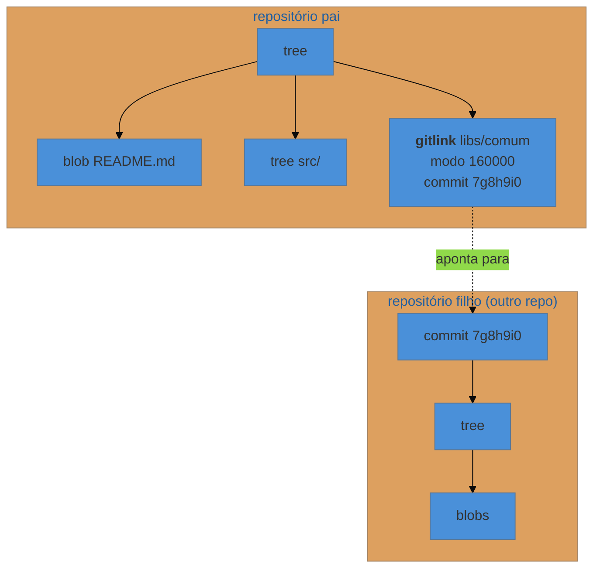

# Submódulos e subtrees

> [!abstract] TL;DR
> Um **submódulo** é uma entrada especial na árvore que guarda o **hash de um commit de outro repositório** — o repositório pai não contém o código, só um endereço fixo. Isso dá controle preciso de versão e cobra caro em ergonomia: quem clona precisa de passos extras, o submódulo vive em `detached HEAD`, e esquecer de publicar o filho quebra todo mundo. O **subtree** faz o oposto: copia o conteúdo do outro repositório para dentro do seu, então quem clona não precisa saber de nada. Antes de qualquer um dos dois, considere a terceira opção: **publicar um pacote versionado**.

---

## O que um submódulo é, de verdade

Pelo modelo do nível 3: um tree normalmente aponta para blobs e outros trees. Um submódulo é uma entrada com **modo `160000`**, cujo valor é o hash de um commit — e esse commit vive em **outro repositório**.

```bash
$ git ls-tree HEAD
100644 blob a1b2c3d...	README.md
040000 tree d4e5f6a...	src
160000 commit 7g8h9i0...	libs/comum
```

Duas consequências que explicam tudo o que vem depois:

1. **O código do submódulo não está no repositório pai.** Só o endereço (no `.gitmodules`) e o hash exato.
2. **O ponteiro é fixo.** O pai não diz "use a versão mais recente de `comum`" — ele diz "use exatamente o commit `7g8h9i0`". Isso é uma vantagem real: você tem reprodutibilidade perfeita.



---

## Operando submódulos

```bash
# adicionar
git submodule add https://github.com/org/comum.git libs/comum

# clonar um projeto que os tem
git clone --recurse-submodules <url>
# ou, se já clonou sem:
git submodule update --init --recursive

# atualizar para o que há de novo no filho
git submodule update --remote libs/comum
git add libs/comum && git commit -m "Atualiza libs/comum"

# rodar um comando em todos
git submodule foreach 'git status'
```

E a configuração que evita metade do sofrimento:

```bash
git config --global submodule.recurse true      # push/pull/checkout recursivos
git config --global status.submoduleSummary true # status mostra o que mudou no filho
git config --global diff.submodule log           # diff mostra os commits, não só o hash
```

---

## Por que doem

> [!warning] Clonar sem `--recurse-submodules`
> **O que acontece:** o projeto clona, as pastas dos submódulos existem e estão **vazias**, e a build falha com erros que não fazem sentido. **Por quê:** o pai só guardou o endereço e o hash; buscar o conteúdo é um passo separado. **Como evitar:** documente `--recurse-submodules` no README, e configure `submodule.recurse`. É a causa número um de "não consigo rodar o projeto" em times que usam submódulos.

> [!warning] Commitar no submódulo e esquecer de publicá-lo
> **O que acontece:** você altera o filho, commita nos dois repositórios, e empurra só o pai. Para todo mundo, o pai aponta para um commit **que não existe em lugar nenhum** — e o `submodule update` falha. **Por quê:** são repositórios independentes; publicar um não publica o outro. **Como evitar:** `git push --recurse-submodules=on-demand`, que publica os filhos necessários antes do pai. E, na revisão, desconfiar sempre que o diff mostrar só uma mudança de hash de submódulo.

> [!warning] O submódulo vive em `detached HEAD`
> **O que acontece:** você edita o submódulo, commita, e depois de um `submodule update` o commit some. **Por quê:** o `update` posiciona o filho **no commit exato** que o pai pede — sem ramo (nota 19). Commits feitos ali não pertencem a ramo nenhum. **Como evitar:** antes de trabalhar dentro de um submódulo, entre nele e faça `git switch main`. E, se já perdeu: `reflog` (nota 23).

Some a isso conflitos de merge que apontam para hashes (ilegíveis sem `diff.submodule log`), e a razão da fama fica clara. Submódulo não é ruim — é **preciso e pouco perdoante**.

---

## Subtree: o oposto

```bash
# adicionar
git subtree add --prefix=libs/comum https://github.com/org/comum.git main --squash

# atualizar
git subtree pull --prefix=libs/comum <url> main --squash

# devolver mudanças suas para o repositório de origem
git subtree push --prefix=libs/comum <url> minha-branch
```

Aqui o conteúdo **é copiado para dentro** do seu repositório. Para quem clona, não existe submódulo nenhum — é só uma pasta. Nenhum comando extra, nenhum passo de inicialização, nenhum `detached HEAD`.

O preço muda de lugar:

- **O repositório engorda** com o conteúdo (e, sem `--squash`, com a história inteira do filho).
- **A complexidade migra para quem mantém.** Os comandos de `subtree` são chatos e é fácil errar o `--prefix`.
- **Fica menos óbvio que aquele código vem de fora**, o que convida a modificações locais que depois complicam a atualização.

| | Submódulo | Subtree |
|---|---|---|
| Conteúdo no repositório pai | ❌ só o ponteiro | ✅ copiado |
| Quem clona precisa saber | **sim** | não |
| Versão fixada | ✅ hash exato | ✅ pelo que foi copiado |
| Facilidade de atualizar | comando simples | comando chato |
| Contribuir de volta | natural | possível, com esforço |
| Tamanho do repositório | pequeno | maior |
| Onde está o atrito | **em quem consome** | **em quem mantém** |

---

## A terceira opção, quase sempre melhor

Antes de escolher entre os dois, pergunte: **isso precisa mesmo ser um repositório dentro de outro?**

Na maioria dos casos, a resposta certa é **publicar um pacote versionado** no registro da sua linguagem (npm, PyPI, Maven, Go modules, Cargo) — inclusive num registro privado. Você ganha resolução de dependências, versionamento semântico (nota 14), atualização por ferramenta, e nenhuma das dores acima.

Use submódulo ou subtree quando o pacote **não** resolve:

- o conteúdo não é código de uma linguagem com registro (temas, documentação, configuração, assets, esquemas);
- você precisa editar o filho junto com o pai, com frequência, e a volta pelo registro é lenta demais;
- é um projeto de terceiros que você precisa fixar num commit específico, com patch local;
- restrição de ambiente impede usar registro.

E, se as duas primeiras condições valem o tempo todo, o que você quer provavelmente é um **monorepo** (nota 27).

---

## Resumo em uma frase

**Submódulo guarda o endereço e cobra de quem clona; subtree copia o conteúdo e cobra de quem mantém — e um pacote versionado resolve melhor que os dois quando é possível.**

> [!tip] Vídeo — por que a comunidade inteira reclama
> [**Why everyone hates git submodules**](https://www.youtube.com/watch?v=JESI498HSMA) (Philomatics, 8 min) percorre as dores desta nota uma a uma, mas com um ângulo que o texto não dá: quais delas o Git já resolveu com configuração (`submodule.recurse`, `push --recurse-submodules`) e quais são inerentes ao modelo. Bom antídoto contra descartar submódulo por fama, não por análise.

> [!tip] Pratique
> Monte um pai e um filho de brinquedo e provoque a armadilha clássica de propósito: adicione o submódulo, commite no filho **sem publicar**, commite o ponteiro no pai, publique só o pai, e então clone o pai numa pasta nova com `--recurse-submodules`. Ver o erro acontecer, e entender que ele decorre do `gitlink` apontar para um commit inexistente, vale mais que qualquer aviso.
>
> Depois refaça a mesma composição com `git subtree add --squash` e clone: nenhum passo extra é necessário. A comparação lado a lado é o argumento inteiro da nota.

---

## O que vem a seguir

Você já sabe compor repositórios. Falta operá-los de forma mais radical: trazer um projeto de outro sistema de versionamento, dividir um repositório em dois preservando história, ou fundir dois em um.

- **29 — Cirurgia de repositório** — migração, divisão e fusão.
- [[03-Dominios/Tecnologia/Controle de Versão/N5 - Repositórios reais/27 - Monorepo e polyrepo|27 — Monorepo e polyrepo]] — a decisão que antecede esta.

## Fontes

- **Scott Chacon & Ben Straub** — [*Pro Git*, cap. 7 — "Submódulos"](https://git-scm.com/book/pt-br/v2/Ferramentas-do-Git-Subm%C3%B3dulos) — o mecanismo, os fluxos e as armadilhas clássicas.
- **Git** — [*git-submodule*](https://git-scm.com/docs/git-submodule) · [*gitsubmodules*](https://git-scm.com/docs/gitsubmodules) — o modo `160000` e a semântica do gitlink.
- **Git** — [*git-subtree*](https://git-scm.com/docs/git-subtree) — `add`, `pull`, `push` e o efeito do `--squash`.
- **Atlassian** — [*Git subtree: the alternative to Git submodule*](https://www.atlassian.com/git/tutorials/git-subtree) — a comparação prática entre as duas abordagens.
