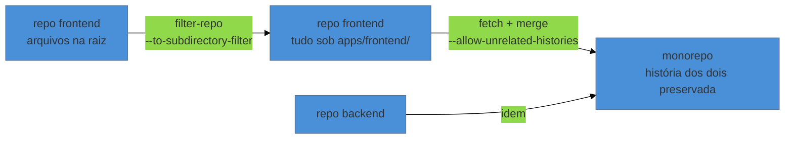

# Cirurgia de repositório

> [!abstract] TL;DR
> Três operações grandes, todas irreversíveis na prática e todas com a mesma regra de ouro: **trabalhe sobre uma cópia e mantenha o original intacto até o fim**. Migrar de SVN preserva história com `git svn clone` e um arquivo de autores. Dividir um repositório em dois preservando o histórico de um subdiretório é `git filter-repo --subdirectory-filter`. Fundir dois repositórios é `merge --allow-unrelated-histories`. Em todas, o custo maior não é técnico: é de coordenação — todo mundo precisa reclonar, e as referências antigas quebram.

---

## A regra que vale para as três

Antes de qualquer coisa nesta nota:

```bash
git clone --mirror <origem> backup.git    # cópia completa: refs, tags, tudo
```

O `--mirror` copia todas as refs, não só os ramos — é o que garante que você possa voltar. Guarde isso em outro lugar e só o apague semanas depois de a operação estar validada em produção.

E planeje a coordenação antes de executar: **anuncie a data, congele merges, e prepare as instruções de reclone.** Cirurgia bem-sucedida com time despreparado ainda é um dia perdido.

---

## Migrar de SVN para Git

Ainda acontece, e mais do que se imagina — sistemas corporativos iniciados nos anos 2000 seguem em Subversion.

**Passo 1: mapear autores.** O SVN guarda logins; o Git quer nome e e-mail.

```bash
# lista os autores existentes no repositório SVN
svn log --quiet | grep -E "^r[0-9]+ \|" | awk '{print $3}' | sort -u
```

Monte um `autores.txt`:

```text
jsilva = João Silva <joao.silva@empresa.com>
mferreira = Maria Ferreira <maria@empresa.com>
```

**Passo 2: clonar com a história.**

```bash
git svn clone https://svn.empresa.com/projeto \
  --authors-file=autores.txt \
  --stdlayout \
  --prefix=svn/ \
  projeto-git
```

O `--stdlayout` assume a convenção `trunk/`, `branches/`, `tags/`. Se o repositório não a segue — e projetos antigos frequentemente não seguem —, é preciso indicar os caminhos manualmente com `--trunk`, `--branches` e `--tags`.

**Passo 3: converter tags e ramos.** O `git svn` traz tags do SVN como ramos remotos; é preciso convertê-las em tags Git de verdade. Ferramentas como o `svn2git` automatizam esse pós-processamento.

**Passo 4: limpar e publicar.** Revise o resultado (`git log`, contagem de commits, ramos), remova os metadados `git-svn-id` das mensagens se quiser (`filter-repo --message-callback`), e publique.

> [!warning] O clone pode levar dias
> **O que acontece:** repositórios SVN grandes, com muitas revisões, levam horas ou dias para converter — o `git svn` busca revisão por revisão.
> **Por quê:** o protocolo do SVN é centralizado e cada revisão é uma consulta.
> **Como conviver:** rode num servidor, em sessão que sobreviva à desconexão, e valide numa amostra (`-r HEAD~1000:HEAD`) antes de rodar tudo. Para repositórios realmente grandes ou com história bagunçada, ferramentas dedicadas de conversão (como o `reposurgeon`) existem justamente para isso.

---

## Dividir: extrair um subdiretório com sua história

Cenário clássico: um monólito onde `servicos/faturamento/` vai virar repositório próprio, e você quer levar o histórico daquela pasta junto.

```bash
git clone <origem> faturamento && cd faturamento
git filter-repo --subdirectory-filter servicos/faturamento
```

O resultado: um repositório onde o conteúdo daquela pasta está na raiz, e o histórico contém **só os commits que a tocaram**, reescritos. Commits que não mexeram ali desaparecem.

Variação, quando você quer manter o caminho ou renomear:

```bash
git filter-repo --path servicos/faturamento --path-rename servicos/faturamento:src
```

Depois: criar o repositório novo, `git remote add origin ...`, publicar. E, no repositório de origem, remover a pasta num commit normal — **não** reescreva o original a menos que haja motivo forte (nota 25).

> [!info] O que se perde na divisão
> Os hashes mudam (nota 17), então referências a commits em issues, PRs e documentação antigos deixam de resolver no repositório novo. E mudanças que atravessavam a fronteira — um commit que alterava `faturamento/` e `comum/` juntos — passam a aparecer pela metade. É útil registrar num `README` do repositório novo o hash de origem da divisão e a data.

---

## Fundir: trazer um repositório para dentro de outro

O inverso: `frontend` e `backend` viram um monorepo (nota 27).

```bash
cd monorepo
git remote add frontend ../frontend
git fetch frontend
git merge --allow-unrelated-histories frontend/main
```

O `--allow-unrelated-histories` é necessário porque as duas histórias não têm ancestral comum (nota 18) — sem essa flag, o Git recusa por segurança.

O problema é que isso despeja os arquivos do outro repositório **na raiz**. Para colocá-los numa subpasta preservando a história, reescreva **antes** de fundir:

```bash
cd ../frontend
git filter-repo --to-subdirectory-filter apps/frontend
```

Aí todos os commits daquele repositório passam a mexer em `apps/frontend/...`, e o merge encaixa no lugar certo, sem conflito e sem commit de movimentação.



---

## Depois da cirurgia: a lista de verificação

| Item | Por quê |
|---|---|
| Todos reclonaram | `pull` sobre história reescrita cria monstros (nota 25) |
| PRs abertos migrados ou refeitos | as referências apontam para commits inexistentes |
| Tags recriadas e publicadas | `--follow-tags` não recria o que se perdeu |
| CI/CD apontando para o lugar certo | URLs, segredos, permissões |
| Proteções de branch reconfiguradas | rulesets não migram com o repositório (nota 15) |
| Links em documentação e issues | os hashes mudaram |
| Backup `--mirror` guardado | por semanas, não por dias |
| Registro do que foi feito | um `MIGRACAO.md` com data, comando e hash de origem |

O último item é o que separa uma cirurgia de uma bagunça: **quem herdar esse repositório daqui a três anos vai encontrar uma história que começa do nada, e merece saber por quê**. É exatamente o tipo de artefato que a [[03-Dominios/Engenharia/Arqueologia e Restauração de Software/index|arqueologia de software]] procura e quase nunca encontra.

---

## Armadilhas comuns

> [!warning] Fazer cirurgia sem congelar o trabalho
> **O que acontece:** enquanto você converte, alguém commita no original. O resultado da migração já nasce desatualizado, e reconciliar é pior que refazer.
> **Por quê:** a operação leva tempo e produz uma história incompatível.
> **Como evitar:** janela combinada, repositório em modo somente leitura durante a operação, e um ensaio completo antes — inclusive da parte de coordenação.

> [!warning] Migrar tudo "porque dá"
> **O que acontece:** trazem-se vinte anos de história de um SVN que ninguém vai consultar, com meses de trabalho de limpeza.
> **Por quê:** parece perda descartar história.
> **Como decidir:** pergunte quem vai consultar e para quê. Uma alternativa honesta e muito usada: importar apenas os últimos anos, e **manter o SVN em modo leitura** como arquivo consultável. Registre a decisão no `MIGRACAO.md`.

> [!warning] Esquecer que forks e clones antigos continuam existindo
> **O que acontece:** meses depois, alguém empurra a partir de um clone pré-cirurgia e reintroduz a história antiga.
> **Por quê:** cópias são autônomas (nota 01).
> **Como evitar:** proteções de branch impedindo push não-fast-forward (nota 15), e comunicação explícita de que clones antigos devem ser apagados.

---

## Resumo em uma frase

**Cirurgia de repositório é sempre "copie, opere na cópia, valide, coordene a troca" — o comando é a parte fácil, a coordenação é a parte que dá errado.**

> [!tip] Vídeo — a divisão feita sem cortes
> [**splitting a monorepo with git filter-branch / filter-repo**](https://www.youtube.com/watch?v=kBMTLIWkYVQ) (anthonywritescode, 17 min) é uma sessão sem edição: o autor divide um repositório real, erra, volta e explica cada decisão. É exatamente a parte que um tutorial limpo esconde — e o que essa cirurgia parece quando não sai perfeita na primeira tentativa.

> [!tip] Pratique
> Faça a divisão e a fusão num par de repositórios de brinquedo, que é o exercício que ensina mais rápido:
> ```bash
> # divisão
> git clone repo-grande extraido && cd extraido
> git filter-repo --subdirectory-filter modulo-x
> git log --oneline     # só os commits daquele módulo, na raiz
>
> # fusão
> cd ../outro && git filter-repo --to-subdirectory-filter libs/outro
> cd ../destino && git remote add o ../outro && git fetch o
> git merge --allow-unrelated-histories o/main
> ```
> Rodar `git log --oneline --graph` no resultado da fusão, e ver duas linhagens independentes se encontrando num commit, é a melhor demonstração possível do que "história sem ancestral comum" significa.

---

## O que vem a seguir

Falta a última nota do nível, e ela fecha a fronteira com a disciplina vizinha: o que a automação espera do repositório, e por que o pipeline se comporta diferente da sua máquina.

- **30 — Git no CI/CD e GitOps** — o contrato entre repositório e pipeline.
- [[03-Dominios/Tecnologia/Controle de Versão/N4 - Quando dá errado/25 - Segredos no histórico|25 — Segredos no histórico]] — a mesma ferramenta, usada aqui para outro fim.

## Fontes

- **Scott Chacon & Ben Straub** — [*Pro Git*, cap. 9 — "Git e Sistemas de Migração"](https://git-scm.com/book/pt-br/v2/Git-e-Outros-Sistemas-Migrando-para-o-Git) — `git svn clone`, arquivo de autores e pós-processamento de tags.
- **Elijah Newren** — [*git-filter-repo*](https://github.com/newren/git-filter-repo) — `--subdirectory-filter`, `--to-subdirectory-filter`, `--path-rename`.
- **Git** — [*git-merge*](https://git-scm.com/docs/git-merge) — `--allow-unrelated-histories` e por que ele é exigido.
- **Git** — [*git-clone*](https://git-scm.com/docs/git-clone) — a semântica de `--mirror` frente a `--bare`.
