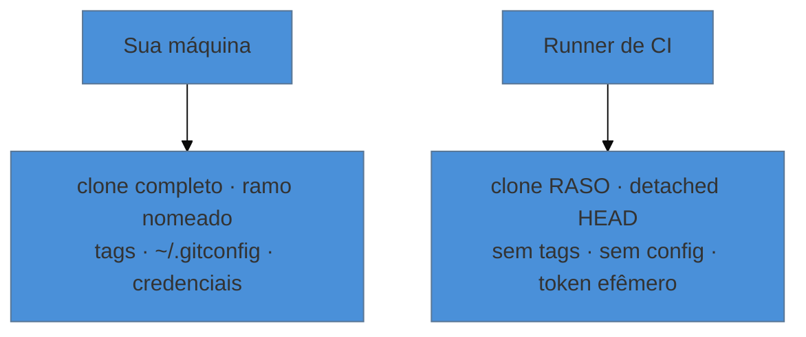
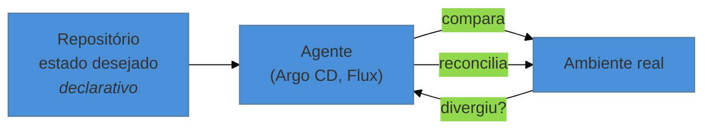

# Git no CI/CD e GitOps

> [!abstract] TL;DR
> O pipeline vê um repositório diferente do seu: clone **raso**, `detached HEAD`, sem tags, sem configuração, sem credenciais. Quase todo "funciona na minha máquina e falha na CI" relacionado a Git vem de uma dessas quatro diferenças. **GitOps** leva a ideia adiante: o repositório passa a ser a fonte declarativa da verdade sobre o ambiente, e um agente reconcilia continuamente o que está no ar com o que está commitado. Esta nota cobre **o lado do repositório**; o pipeline como disciplina mora em [[03-Dominios/Engenharia/Operação/index|Engenharia/Operação]].

---

## O repositório que a CI enxerga



Quatro diferenças, quatro classes de falha:

**1. Clone raso.** A maioria dos serviços clona com profundidade 1 (nota 27). Quebra: `git describe`, contagem de commits para número de build, geração de changelog, `blame` em etapas de análise, e `bisect`. A correção é pedir a história quando a etapa precisa dela — no GitHub Actions, `fetch-depth: 0` no `actions/checkout`.

**2. `detached HEAD`.** O runner posiciona o repositório no commit exato do evento, sem criar ramo (nota 19). Por isso `git rev-parse --abbrev-ref HEAD` devolve `HEAD` em vez do nome do ramo — e scripts que dependem disso falham silenciosamente. Use as variáveis fornecidas pelo ambiente (`GITHUB_REF_NAME`, `CI_COMMIT_REF_NAME`) em vez de perguntar ao Git.

**3. Em pull request, o commit não é o seu.** Muitos serviços constroem um **merge de teste** entre o seu ramo e o destino, e é esse commit efêmero que a CI examina. É o comportamento certo (testa o resultado da integração, não o ramo isolado), mas surpreende: o hash da CI não existe em lugar nenhum depois.

**4. Sem configuração nem identidade.** Se uma etapa precisa commitar (atualizar changelog, marcar versão), é preciso configurar `user.name` e `user.email` explicitamente — e ter permissão de escrita, que por padrão o token não tem para tudo (nota 15).

> [!warning] O pipeline que se dispara a si mesmo
> **O que acontece:** uma etapa commita e empurra; esse push dispara o pipeline de novo; que commita de novo. Laço infinito consumindo minutos pagos.
> **Por quê:** o evento de push não distingue quem empurrou.
> **Como evitar:** o token padrão do fluxo de trabalho normalmente **não** dispara novos fluxos, justamente para evitar isso — mas um token pessoal dispara. Se precisar de um, adicione a convenção `[skip ci]` na mensagem do commit automático, ou filtre por autor.

---

## O que o repositório contrata

Vale enxergar o repositório como fornecedor de quatro coisas para a automação:

| O repositório fornece | Como |
|---|---|
| **Gatilhos** | eventos: push num ramo, PR aberto, tag criada, agendamento |
| **Escopo** | filtros por caminho — essenciais em monorepo (nota 27) |
| **Versão** | tag anotada (nota 14), ou commits desde a última tag |
| **Configuração** | o próprio pipeline versionado junto com o código |

A terceira linha é a que mais depende do que este domínio ensinou: `git describe --tags` produz algo como `v1.2.0-14-ga3f1c9d` — a última tag, quantos commits depois, e o hash. É o identificador de build ideal: legível, ordenável e rastreável até o commit exato. E ele **só funciona com história e tags disponíveis**, o que fecha o círculo com o clone raso.

A quarta linha é uma ideia poderosa: o pipeline é código no mesmo repositório, então ele é revisado, versionado e revertível como qualquer outra mudança. Mudar o processo de build vira um PR.

---

## GitOps: o repositório como fonte da verdade

GitOps estende esse princípio para a infraestrutura. Em vez de o pipeline **empurrar** mudanças para o ambiente, um agente rodando no ambiente **puxa** do repositório e reconcilia continuamente.



Os quatro princípios, e o que cada um significa **do ponto de vista do repositório**:

1. **Declarativo** — o repositório descreve o estado desejado, não os passos.
2. **Versionado e imutável** — o Git é a fonte da verdade; todo estado que já existiu tem um hash.
3. **Puxado automaticamente** — o agente busca; ninguém precisa de credencial de produção na CI.
4. **Reconciliado continuamente** — se alguém mexer no ambiente à mão, o agente detecta a divergência (*drift*) e corrige.

As consequências para quem cuida do repositório:

- **O histórico vira log de auditoria de produção.** "O que estava no ar em 3 de março?" é `git show` naquela data. Esse é o mesmo argumento das quatro perguntas da nota 01, agora aplicado a infraestrutura.
- **Reverter um deploy é `git revert`** (nota 22) — não um procedimento paralelo.
- **A separação entre repositório de aplicação e de configuração** vira uma decisão de arquitetura, e é a mais debatida da prática. Juntos: mudança atômica de código e config. Separados: o repositório de config pode ser atualizado por automação sem disparar builds de aplicação.
- **Segredos não podem estar em texto no repositório** (nota 25). GitOps exige uma resposta explícita para isso — segredos selados (`Sealed Secrets`), operadores que buscam de um cofre externo, ou criptografia versionada (`SOPS`, `age`).

> [!info] Onde este domínio para
> Desenhar o pipeline, escolher estratégia de deploy, definir ambientes e promoção entre eles, operar Argo CD ou Flux, gerir segredos em produção — tudo isso é **disciplina de entrega**, e mora em [[03-Dominios/Engenharia/Operação/index|Engenharia/Operação]] (sub-galho "Entrega e release", nota 05 sobre GitOps e IaC).
> Aqui o escopo é o **contrato do lado do repositório**: o que a automação precisa que o repositório forneça, e por que ele parece diferente dentro do runner.

---

## Armadilhas comuns

> [!warning] Versionamento automático quebrado pelo clone raso
> **O que acontece:** a ferramenta de release gera sempre `0.0.1`, ou o changelog sai vazio.
> **Por quê:** ela conta commits desde a última tag, e o clone raso não trouxe nem tags nem história.
> **Como evitar:** `fetch-depth: 0` (ou equivalente) na etapa de release. É o sintoma mais comum desta nota inteira.

> [!warning] Confiar em `git diff HEAD~1` para detectar mudanças
> **O que acontece:** o filtro de caminho não detecta arquivos alterados, e etapas necessárias são puladas.
> **Por quê:** com clone raso, `HEAD~1` pode não existir. E em merge de PR, `HEAD~1` não é o que você imagina.
> **Como evitar:** use os filtros de caminho do próprio serviço de CI, ou compare explicitamente contra a base do PR (`git diff origin/main...HEAD`) com a história disponível.

> [!warning] Etiquetar a imagem com o nome do ramo
> **O que acontece:** duas builds do mesmo ramo produzem a mesma etiqueta, e é impossível saber o que está rodando.
> **Por quê:** ramo é um ponteiro móvel (nota 19); ele não identifica um estado.
> **Como evitar:** etiquete com o **hash do commit** (imutável) e adicione nomes legíveis como apelido adicional. É a aplicação direta de "commit identifica um estado, ramo identifica uma posição".

---

## Resumo em uma frase

**A CI vê um repositório amputado — raso, sem ramo, sem tags, sem config —, e o GitOps devolve o repositório ao centro, fazendo do histórico o registro auditável do que esteve no ar.**

> [!tip] Pratique
> No seu projeto, adicione uma etapa que imprima o que a CI está vendo, e compare com a sua máquina:
> ```bash
> git rev-parse --abbrev-ref HEAD    # provavelmente "HEAD" no runner
> git describe --tags || echo "sem tags"
> git log --oneline | wc -l          # 1 no clone raso
> git rev-parse HEAD                 # em PR, um merge que não existe fora dali
> ```
> Depois mude para história completa e rode de novo. Ver os quatro valores mudarem é o diagnóstico que resolve, de uma vez, uma classe inteira de bugs de pipeline.

---

## O que vem a seguir

Você fecha aqui o **nível 5**. E, com ele, todo o instrumental está posto — o que vem agora é o uso que justifica o domínio existir.

O **nível 6** vira a ferramenta para o passado: usar o repositório não para guardar trabalho, mas para **investigar** um sistema que você não escreveu. É a lente do consultor de legado, e a ponte com a arqueologia de software.

- **31 — Ler história de verdade** — `blame`, pickaxe e as perguntas que o histórico responde.
- [[03-Dominios/Tecnologia/Controle de Versão/N5 - Repositórios reais/index|N5 — Repositórios reais]] — o índice do nível.

## Fontes

- **GitHub Docs** — [*actions/checkout*](https://github.com/actions/checkout) — o padrão de profundidade 1, `fetch-depth: 0` e o merge efêmero de pull request.
- **Git** — [*git-describe*](https://git-scm.com/docs/git-describe) — a geração de identificadores de build a partir de tags.
- **OpenGitOps** — [*GitOps Principles v1.0*](https://opengitops.dev/) — os quatro princípios citados, na formulação da CNCF.
- **Weaveworks** — [*Guide to GitOps*](https://www.weave.works/technologies/gitops/) — a formulação original de reconciliação contínua a partir do repositório.
- **Nota interna** — [[03-Dominios/Engenharia/Operação/index|Engenharia/Operação]] — a casa canônica de pipeline, deploy, ambientes e operação de GitOps.
