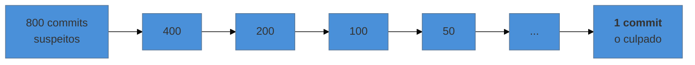

# `bisect` — achar o commit que quebrou

> [!abstract] TL;DR
> Você sabe que funcionava na versão 1.4 e não funciona hoje, e há 800 commits entre as duas. O `bisect` faz **busca binária no grafo**: você marca um commit bom e um ruim, ele te leva ao meio, você testa e responde "bom" ou "ruim", e em ~10 passos ele isola o commit exato. Com `git bisect run <script>`, você nem precisa estar na frente do computador — ele roda o teste sozinho. É a ferramenta de depuração mais subestimada que existe, e a única que transforma "não faço ideia de onde está o problema" em "é este commit".

---

## Por que ~10 passos e não 800

Busca binária: cada teste elimina metade do intervalo. Para 800 commits, são cerca de 10 testes (log₂ 800 ≈ 9,6).



O ganho não é só de tempo: é de **precisão**. No fim você não tem uma hipótese sobre a causa — você tem o commit, com o diff, o autor e a mensagem. Muitas vezes o diff é de três linhas e a causa fica óbvia na hora.

---

## O fluxo manual

```bash
git bisect start
git bisect bad                 # o commit atual está quebrado
git bisect good v1.4.0         # aqui funcionava (tag, hash ou data)
```

O Git te leva ao meio do intervalo. Teste e responda:

```bash
git bisect good      # ou
git bisect bad
```

Repita. Ao fim, ele anuncia:

```text
a3f1c9d5e2b8471f0c6d9a3e7b52814f6d0e9c2a is the first bad commit
```

E, sempre, para terminar:

```bash
git bisect reset      # volta para onde você estava
```

> [!info] Por que o repositório fica em `detached HEAD` durante o bisect
> Porque o Git está te posicionando em commits arbitrários do grafo para teste, e não faz sentido criar um ramo em cada parada (nota 19). O `bisect reset` devolve o `HEAD` ao lugar de origem. Se você commitar algo durante um bisect, use `switch -c` antes — ou recorra ao `reflog` depois (nota 23).

---

## O modo que muda tudo: `bisect run`

Se você consegue escrever um comando que devolve **0 quando está bom** e **diferente de 0 quando está ruim**, o Git faz a busca inteira sozinho:

```bash
git bisect start HEAD v1.4.0        # ruim e bom, de uma vez
git bisect run npm test -- t/relatorio
```

Ou com um script, quando o teste é mais complexo:

```bash
#!/bin/bash
# testa.sh
npm ci --silent || exit 125          # 125 = "não dá para testar este commit, pule"
npm run build --silent || exit 125
node -e "require('./dist').gerarRelatorio()" | grep -q "TOTAL: 4200" || exit 1
exit 0
```

```bash
git bisect run ./testa.sh
```

Você sai para almoçar e volta com o commit culpado. O código de saída **125** é a peça especial: ele significa "este commit não pode ser avaliado" — build quebrada por motivo alheio, dependência indisponível — e faz o Git pular aquele ponto em vez de contaminar o resultado.

> [!warning] O script precisa estar fora do repositório
> **O que acontece:** você escreve `testa.sh`, commita, e durante o bisect o script desaparece — porque nos commits antigos ele não existe. **Por quê:** o bisect faz checkout de cada commit, substituindo a árvore de trabalho. **Como evitar:** guarde o script **fora** do repositório (`/tmp/testa.sh`) e chame pelo caminho absoluto. Mesmo cuidado para dados de teste.

---

## Quando o commit não pode ser testado

```bash
git bisect skip                  # este commit não dá para avaliar
git bisect skip v1.4.1..v1.4.3   # pule um intervalo inteiro
```

Se houver muitos commits impossíveis de testar, o Git avisa que o resultado é um **intervalo** de suspeitos em vez de um commit único — o que ainda é infinitamente melhor que 800.

E, para acompanhar ou retomar:

```bash
git bisect log                   # o que já foi respondido
git bisect log > sessao.txt      # salvar
git bisect replay sessao.txt     # retomar depois (ou refazer sem os erros)
git bisect visualize             # ver o intervalo restante no grafo
```

O `replay` salva quem errou uma resposta no meio: corrija o arquivo de log e refaça a sessão sem repetir os testes corretos.

---

## Não é só para bugs

O `bisect` procura **a transição de um estado para outro**, e "bom/ruim" são só rótulos. Para outros tipos de investigação, renomeie os termos:

```bash
git bisect start --term-old=rapido --term-new=lento
git bisect lento HEAD
git bisect rapido v1.4.0
git bisect run ./mede-performance.sh
```

Assim ele acha o commit em que uma operação passou a ser lenta, em que o binário passou a ser maior, em que o consumo de memória subiu — qualquer propriedade que você consiga medir e classificar.

Para dependências que não vêm do seu repositório, vale saber que há uma variante do mesmo raciocínio com `--first-parent`, que segue só a linha principal e ignora o interior dos ramos mesclados — útil quando você quer saber **qual PR** introduziu o problema, e não qual commit dentro dele.

---

## O que faz o bisect funcionar (e o que o inviabiliza)

O sucesso depende de propriedades que se constroem **antes** de precisar dele:

| Requisito | Por quê | Onde isso foi construído |
|---|---|---|
| História completa | busca binária precisa dos commits | notas 27 e 30 (nada de clone raso) |
| Commits pequenos e atômicos | achar o commit só ajuda se ele for legível | nota 14 |
| Cada commit compila e roda | commits quebrados viram `skip` e degradam a busca | nota 24 (`rebase --exec`) |
| Reprodução confiável do problema | resposta errada envenena o resultado | — |

A terceira linha é o argumento mais forte a favor da disciplina de manter todo commit funcional: **não é estética, é a diferença entre poder e não poder bisecar.** Um histórico onde metade dos commits não compila torna a busca binária inútil justamente no dia em que ela seria mais valiosa.

---

## Armadilhas comuns

> [!warning] Responder errado no meio da sessão
> **O que acontece:** um teste instável (*flaky*) devolve o resultado errado, e o bisect converge para um commit inocente. **Por quê:** a busca binária confia em cada resposta; um erro elimina a metade errada. **Como evitar:** confirme a reprodução antes de começar — teste o commit "ruim" e o "bom" manualmente. Se o problema é intermitente, rode o teste várias vezes por commit no script. E, na dúvida, salve `git bisect log` para poder replicar.

> [!warning] Esquecer o `git bisect reset`
> **O que acontece:** você sai da sessão e continua trabalhando em `detached HEAD`, num commit antigo. Commits feitos ali ficam órfãos. **Por quê:** o bisect deixa o repositório num estado especial até ser encerrado. **Como evitar:** `git status` avisa que há um bisect em andamento. Encerre sempre. E se já commitou por engano: `reflog` (nota 23).

> [!warning] Bisecar mudança de comportamento causada por dados ou ambiente
> **O que acontece:** a busca converge para um commit que não tem nada a ver. **Por quê:** a causa não estava no código — era uma migração de banco, uma versão de dependência resolvida na hora da instalação, uma configuração de ambiente. **Como evitar:** fixe o ambiente no script (versões travadas, banco recriado do zero a cada passo). Se não for possível, aceite que o bisect vai indicar "quando", não "o quê" — o que já orienta a investigação.

---

## Resumo em uma frase

**`bisect` transforma "quebrou em algum lugar dos últimos oito meses" em "foi este commit" com uma dezena de testes — e `bisect run` faz isso sem você.**

> [!tip] Vídeo — do manual ao automático
> [**Using git bisect to Help Find Which Commit Broke Something**](https://www.youtube.com/watch?v=3cwWssglZuQ) (Nick Janetakis, 14 min) faz a busca primeiro à mão e depois com `bisect run`, no mesmo bug. A comparação direta é o argumento desta nota em imagem: o ganho não está em achar o commit, está em não precisar ficar respondendo "bom"/"ruim".

> [!tip] Pratique
> Faça o exercício completo com um bug plantado, que é a única forma de sentir a velocidade:
> ```bash
> # num repo de teste com ~50 commits, quebre algo no commit 20
> git bisect start HEAD HEAD~50
> git bisect run ./verifica.sh     # script fora do repositório, saída 0/1
> ```
> Conte os passos. São seis. Depois imagine fazer isso lendo 50 diffs.
>
> Os **[git-katas](https://github.com/eficode-academy/git-katas)** têm o kata `bisect` com o cenário pronto — bug plantado e script de verificação incluídos.

---

## O que vem a seguir

`blame` e `bisect` respondem sobre **um ponto específico** — uma linha, um bug. A última nota do nível olha o repositório inteiro de uma vez, procurando padrões: onde o código dói mais, o que sempre muda junto, e quem é a única pessoa que entende cada área.

- **33 — Forense de repositório** — hotspots, acoplamento temporal e ilhas de conhecimento.
- [[03-Dominios/Tecnologia/Controle de Versão/N3 - O modelo por baixo/18 - Commit é snapshot não diff - o DAG|18 — o DAG]] — a estrutura sobre a qual a busca binária opera.

## Fontes

- **Git** — [*git-bisect*](https://git-scm.com/docs/git-bisect) — `run`, o código de saída 125, `skip`, `--term-old`/`--term-new`, `log` e `replay`.
- **Scott Chacon & Ben Straub** — [*Pro Git*, cap. 7 — "Depurando com Git"](https://git-scm.com/book/pt-br/v2/Ferramentas-do-Git-Depurando-com-Git) — o fluxo manual e o automatizado.
- **Git** — [*git-bisect-lk2009*](https://git-scm.com/docs/git-bisect-lk2009) — o documento longo sobre a implementação e as estratégias de escolha de ponto médio no grafo.
