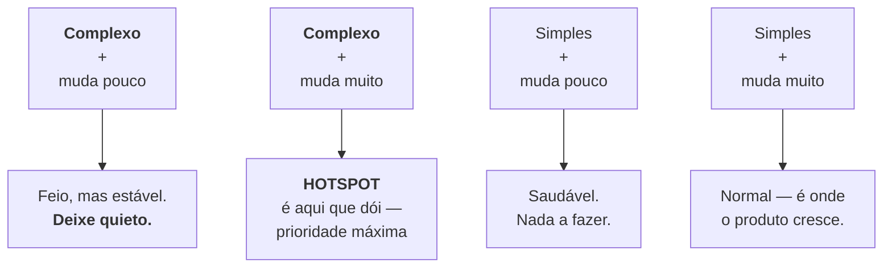

# Forense de repositório

> [!abstract] TL;DR
> Olhando o repositório inteiro em vez de um arquivo, três padrões aparecem e nenhum deles é visível no código. **Hotspots**: arquivos que mudam muito — e quando um deles também é complexo, é ali que o design dói. **Acoplamento temporal**: arquivos que mudam sempre juntos, mesmo sem dependência declarada — a evidência mais honesta de acoplamento real. **Ilhas de conhecimento**: áreas com um único autor, que são risco organizacional, não técnico. Tudo isso sai de `git log` com um pouco de contagem, e existe ferramenta pronta quando o volume cresce.

---

## O que a frequência de mudança revela

Todo sistema tem partes estáveis e partes que mudam toda semana. Essa distribuição não é aleatória, e ela carrega informação que o código sozinho não dá:

- Um arquivo que **quase nunca muda** está resolvido — mesmo que seja feio. Refatorá-lo tem retorno baixo.
- Um arquivo que **muda toda semana** é onde o trabalho acontece. Se ele também for complicado, cada mudança custa caro, e esse custo se repete.

O cruzamento dessas duas dimensões — **frequência de mudança × complexidade** — é o conceito de **hotspot**, popularizado por Adam Tornhill. É o que responde a pergunta que todo consultor de legado precisa responder na primeira semana: *"com orçamento para refatorar 5% deste sistema, qual 5%?"*.



O primeiro caso é a armadilha da intuição: **código feio que ninguém toca não é problema.** Refatorá-lo é gastar orçamento onde não há retorno — e é exatamente o que times fazem quando escolhem alvo por percepção estética em vez de dados.

---

## Medindo com o Git puro

Não é preciso ferramenta para começar. Estes comandos rodam em qualquer repositório:

**Arquivos que mais mudaram no último ano:**
```bash
git log --since="1 year ago" --name-only --pretty=format: \
  | grep -v '^$' | sort | uniq -c | sort -rn | head -20
```

**Quantos autores distintos por arquivo** (mais autores = mais conhecimento distribuído, mas também mais chance de inconsistência):
```bash
git log --since="1 year ago" --pretty=format:"%an" --name-only \
  | awk '/^[A-Za-z]/ {autor=$0; next} NF {print $0" "autor}' \
  | sort -u | cut -d' ' -f1 | uniq -c | sort -rn | head -20
```

**Autoria concentrada em uma área** (ilhas de conhecimento):
```bash
git shortlog -sn --no-merges -- src/pagamentos/
```

**Ritmo do projeto ao longo do tempo:**
```bash
git log --pretty=format:"%ad" --date=format:"%Y-%m" | sort | uniq -c
```

**Quem ainda está no time** — cruzar autores recentes com autores históricos revela quanto do sistema foi escrito por gente que saiu:
```bash
git shortlog -sn --no-merges --since="1 year ago"
git shortlog -sn --no-merges --until="1 year ago"
```

Essa última é a análise que mais muda uma conversa com gestão. "70% deste módulo foi escrito por três pessoas que não estão mais aqui" é um fato verificável, não uma opinião — e justifica investimento em documentação ou em rotação de responsabilidade de um jeito que nenhum argumento técnico consegue.

---

## Acoplamento temporal

Este é o achado mais interessante da forense, porque ele revela algo que **o código esconde**.

Dois arquivos que aparecem juntos na maioria dos commits estão acoplados — mesmo que não haja um `import` entre eles. Casos típicos:

- uma classe e sua configuração em outro formato;
- backend e frontend que compartilham um contrato implícito;
- uma implementação e um teste que precisa ser reescrito a cada mudança (sinal de teste acoplado a detalhe de implementação);
- duas cópias de uma regra de negócio duplicada.

O último é o achado clássico: **duplicação que a ferramenta de análise estática não detecta**, porque o código foi escrito de formas diferentes — mas que muda sempre junto, porque expressa a mesma regra.

Medir com Git puro dá trabalho, mas o princípio é simples: para cada par de arquivos, conte em quantos commits ambos aparecem, divida pelo número de commits de cada um, e ordene. É o momento em que uma ferramenta compensa.

---

## Ferramentas quando o volume cresce

| Ferramenta | O que faz |
|---|---|
| **[code-maat](https://github.com/adamtornhill/code-maat)** | análise de acoplamento temporal, hotspots, autoria — a partir de um log exportado do Git |
| **[git-of-theseus](https://github.com/erikbern/git-of-theseus)** | gráficos de sobrevivência de código: quanto do código de cada ano ainda está vivo |
| **[hercules](https://github.com/src-d/hercules)** | análises avançadas de histórico, incluindo "burndown" de linhas |
| **[git-quick-stats](https://github.com/arzzen/git-quick-stats)** | painel de estatísticas prontas, sem configuração |
| **CodeScene** | produto comercial que implementa e amplia as análises de Tornhill |

O fluxo típico do `code-maat` é exportar o log num formato específico e rodar as análises sobre ele — o que significa que a fonte de dados continua sendo o mesmo `git log` que você já sabe usar.

---

## O que esses dados **não** dizem

Esta seção importa tanto quanto as anteriores, porque métricas de repositório são fáceis de usar mal.

> [!warning] Contagem de commits não mede produtividade
> **O que acontece:** `git shortlog -sn` vira ranking de esforço em conversa de avaliação. **Por quê:** commits têm tamanhos e naturezas incomparáveis. Quem faz revisão, mentoria, investigação e design aparece pouco — e frequentemente é quem mais contribui. **Como usar direito:** os números respondem "onde está o conhecimento" e "onde está a atividade". Nunca "quem trabalha mais". Usar assim, além de injusto, corrompe os dados: as pessoas passam a otimizar a métrica.

> [!warning] Hotspot não é sinônimo de código ruim
> **O que acontece:** o arquivo mais alterado é marcado para refatoração imediata. **Por quê:** alguns arquivos mudam muito por razão legítima — um arquivo de rotas cresce quando o produto cresce; um catálogo de configuração muda a cada funcionalidade. **Como interpretar:** hotspot é **onde olhar primeiro**, não um veredito. A leitura do código continua sendo necessária; os dados apenas dizem por onde começar.

> [!warning] A história pode mentir sobre autoria
> **O que acontece:** um commit de migração (nota 29) ou uma reformatação em massa (nota 31) distorce todas as contagens. **Por quê:** eles tocam milhares de arquivos de uma vez. **Como evitar:** identifique e exclua esses commits das análises — pelo mesmo raciocínio do `.git-blame-ignore-revs`. Antes de tirar conclusão, olhe os commits maiores: `git log --shortstat --oneline | sort -k5 -rn | head`.

---

## A ponte com o ofício

Tudo nesta nota é **instrumento**. O que fazer com o resultado — como priorizar, como negociar orçamento de refatoração, como decidir entre reescrever e restaurar, como conduzir a conversa com quem paga a conta — é o **método**, e mora em [[03-Dominios/Engenharia/Arqueologia e Restauração de Software/index|Engenharia/Arqueologia e Restauração de Software]].

A ligação prática entre os dois: uma análise de hotspots feita na primeira semana de um projeto herdado transforma uma conversa de opiniões ("acho que o módulo de pagamentos é o pior") numa conversa de evidências ("estes quatro arquivos concentram 40% das mudanças do último ano e têm a maior complexidade; três deles mudam sempre juntos, o que sugere que a fronteira entre eles está errada").

---

## Resumo em uma frase

**A frequência de mudança revela onde o design dói, quais arquivos estão acoplados de verdade e quem sabe o quê — informação que o código não tem e que nenhuma documentação registra.**

> [!tip] Vídeo — a palestra que originou o método
> [**Treat Your Code as a Crime Scene**](https://www.youtube.com/watch?v=7FApEq8wum4) (Adam Tornhill, GOTO 2016, 49 min) é a fonte desta nota apresentada pelo próprio autor, com os mapas de hotspot e acoplamento temporal de sistemas reais na tela. O que a palestra acrescenta ao texto é a dimensão social: Tornhill mostra como o mesmo dado revela a estrutura do time por trás do código.

> [!tip] Pratique
> Rode a análise de hotspots num projeto que você conhece bem e confira a intuição:
> ```bash
> git log --since="1 year ago" --name-only --pretty=format: \
>   | grep -v '^$' | sort | uniq -c | sort -rn | head -20
> ```
> Os cinco primeiros são os arquivos que você esperava? Costuma haver pelo menos uma surpresa — e a surpresa é o achado.
>
> Depois rode o par de `shortlog` (recente × histórico) e calcule quanto do sistema veio de gente que não está mais no time. É o número mais útil que você pode levar para uma conversa sobre risco.

---

## O que vem a seguir

Você fecha aqui o **nível 6** e todo o instrumental do domínio. Falta juntar tudo num exercício único: as primeiras quatro horas dentro de um repositório que você nunca viu, com o objetivo de sair sabendo onde está o risco, onde está o conhecimento e por onde começar.

- **34 — Capstone: assumir um repositório desconhecido** — o exercício que costura os sete níveis.
- [[03-Dominios/Engenharia/Arqueologia e Restauração de Software/index|Engenharia/Arqueologia e Restauração de Software]] — o método que consome este instrumental.

## Fontes

- **Adam Tornhill** — *Your Code as a Crime Scene* (Pragmatic Bookshelf) — a origem da análise de hotspots (frequência × complexidade), acoplamento temporal e ilhas de conhecimento.
- **Adam Tornhill** — [*code-maat*](https://github.com/adamtornhill/code-maat) — a implementação de referência das análises do livro, sobre log do Git.
- **Git** — [*git-shortlog*](https://git-scm.com/docs/git-shortlog) · [*git-log*](https://git-scm.com/docs/git-log) — `--name-only`, `--shortstat` e os formatos de saída usados nos comandos desta nota.
- **Erik Bernhardsson** — [*git-of-theseus*](https://github.com/erikbern/git-of-theseus) — sobrevivência de código ao longo do tempo.
