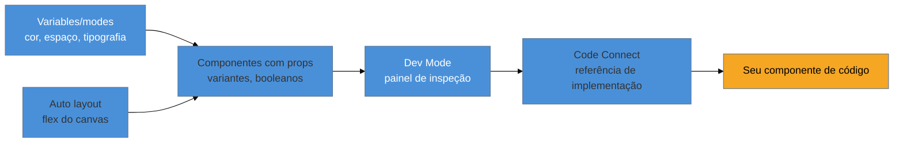

# Figma para o engenheiro

> [!warning] Nota perecível — escrita em 2026-07-29
> Este galho é a parte mais volátil do domínio de UX: nomes de produto, atalhos de menu e posicionamento de feature mudam em meses. Revalide contra a doc oficial do Figma antes de confiar em qualquer detalhe de interface abaixo — em especial nomes exatos de botão e passos de menu, que são os primeiros a mudar num redesign de produto.

> [!abstract] TL;DR
> Um engenheiro *full-cycle* não precisa aprender Figma como um product designer aprende — precisa aprender **a fatia que toca o código**: ler o Dev Mode, entender variables/modes o suficiente para mapear em design tokens, e não quebrar o design system ao editar. Autoria avançada de auto layout, prototipagem interativa e gestão de biblioteca multi-time são trabalho de design system owner dedicado — pode ficar de fora sem culpa. O critério de corte desta nota: se a tarefa é "entender e não estragar", ela entra; se é "produzir e manter", ela fica para quem tem esse cargo.

Você recebe um link de Figma do cliente com a mensagem "já tá tudo pronto, só implementar". Você abre o arquivo, vê um retângulo azul com texto branco em cima — parece um botão. Você clica nele com o painel de propriedades aberto e lê `#3B82F6` no campo de cor de preenchimento. Você copia esse hex literal para o CSS do componente. Duas semanas depois, o design system muda a cor de ação primária — um ajuste de acessibilidade, contraste insuficiente no dark mode — e o botão que você implementou não muda, porque não está ligado a nada: é um hex solto no meio do CSS, desconectado da variável que todo o resto do produto usa. Ninguém errou a leitura do Figma. Errou-se a pergunta: "esse valor tem nome, ou é só um número?"

Esse é o problema que esta nota resolve. Não é "como desenhar no Figma" — é "como ler um arquivo Figma sem estragar a coisa mais importante que ele carrega: a relação entre os valores e o que eles significam".

## Praticável sozinho vs. exige mais estrutura

### O que vale aprender, e por quê

Um arquivo Figma moderno tem, no mínimo, quatro peças que interessam a quem implementa. Cada uma resolve um problema específico de comunicação entre design e código.

**Dev Mode** é o modo de inspeção — uma visão do arquivo otimizada para quem vai construir, não para quem vai desenhar. Em vez do canvas livre onde o designer arrasta formas, o Dev Mode mostra um painel de propriedades: espaçamento em pixels, cor com o nome da variável (quando existe uma), a árvore de camadas do componente selecionado, e — quando configurado — um trecho de código de referência via **Code Connect** (a nota 02 deste galho cobre isso a fundo). A mecânica central: o Dev Mode não é outro arquivo, é outra lente sobre o mesmo arquivo. Selecionar um elemento no Dev Mode e ver `color-action-primary` em vez de `#3B82F6` é o sinal de que o design system está bem estruturado — se você só vê hex, ou a variável não foi criada, ou o designer esqueceu de aplicá-la, e vale perguntar antes de implementar.

**Variables e modes** são os design tokens nativos do Figma — cor, espaçamento, tipografia, número, string e booleano, cada um com um nome e podendo ter **múltiplos valores por modo**. Um `modes` típico é `light`/`dark`, ou `compact`/`comfortable` (densidade). A variável `color-surface` pode valer branco no modo light e cinza-escuro no modo dark; o componente que a usa não muda nada na própria definição — só troca de modo. Essa é a mesma ideia de indireção que a [[03-Dominios/Engenharia/UX/Linguagem Visual e Design System/29 - Design tokens como sistema|nota 29 do SG5]] trata como arquitetura de sistema (primitivo → semântico → componente); aqui é a implementação concreta dessa arquitetura dentro da ferramenta de design. Ler variables e modes bem o suficiente para mapeá-los em tokens de código é o item de maior alavancagem desta nota — é a ponte direta entre o Dev Mode e o [[03-Dominios/Tecnologia/Ferramentas de Design/08 - Pipeline de tokens|pipeline de tokens]] (nota 08 adiante).

**Auto layout** é o equivalente do Figma a `display: flex` — em vez de posicionar elementos por coordenada absoluta, o frame organiza filhos em linha ou coluna, com gap, padding e regras de crescimento/encolhimento. Entender que um frame tem auto layout (e qual direção, gap e padding) é o que permite prever como aquele layout vai se comportar em código — mas *desenhar* um auto layout complexo, com regras de wrap e alinhamento avançadas, é trabalho de quem vive no Figma o dia inteiro.

**Componentes com props** são o equivalente a um componente React parametrizado: um botão-componente no Figma pode ter variantes (`primary`/`secondary`/`ghost`), booleanos (`disabled`, `com ícone`) e texto editável — exatamente como props de um componente de código. Reconhecer que dois botões visualmente parecidos são *instâncias do mesmo componente com props diferentes*, versus dois componentes-Frankenstein desconectados, é o que decide se a implementação em código vira um componente reutilizável ou uma duplicação de CSS.

> [!question]- Preciso saber desenhar no Figma para fazer esse trabalho?
> Não. O critério desta nota separa **ler e não quebrar** de **produzir e manter**. Você precisa reconhecer uma variable de um hex solto, um componente com props de um grupo de formas soltas, e um auto layout bem configurado de um mal configurado — o suficiente para tomar decisões de implementação corretas e para *não editar* algo no arquivo de um jeito que quebre o sistema para quem usa depois de você (por exemplo: desconectar acidentalmente uma instância do componente-mãe ao arrastar um filho para fora do auto layout). Desenhar do zero, criar bibliotecas, definir a árvore de variantes de um design system — isso é trabalho de quem tem esse cargo.

### O que dá pra ignorar com segurança

Três áreas do Figma são território de design system owner dedicado, e um engenheiro full-cycle pode conscientemente não investir tempo nelas:

- **Autoria avançada de auto layout** — regras de `wrap`, alinhamento condicional, `hug`/`fill` combinados em layouts aninhados profundos. Ler o resultado, sim; desenhar do zero com essas nuances, não é o seu trabalho.
- **Prototipagem interativa do Figma** — fluxos clicáveis, transições animadas entre telas dentro do próprio Figma (smart animate, overlays). Isso serve para apresentar um fluxo a um stakeholder antes de qualquer linha de código existir; uma vez que você está implementando, o protótipo interativo já cumpriu seu papel.
- **Gestão de bibliotecas multi-time** — publicar, versionar e governar uma biblioteca compartilhada entre múltiplos arquivos e múltiplos times de design. Isso é a "governança mínima" que a [[03-Dominios/Engenharia/UX/Linguagem Visual e Design System/32 - Adotar vs construir, e governança mínima|nota 32 do SG5]] discute como decisão de escala — para um engenheiro solo, geralmente nem existe: há um arquivo, um dono, sem necessidade de processo de publicação formal.

**O que vale aprender, em uma frase:** ler Dev Mode, variables/modes e componentes com props o suficiente para não quebrar o sistema e para mapear valores em tokens de código; o resto é ofício de quem tem "Design System" no cargo.

## Casos práticos

### Cenário 1: o hex solto que virou dívida técnica silenciosa
Um engenheiro implementa uma tela inteira lendo cores diretamente do painel de propriedades do Figma — não do Dev Mode, do modo de design normal, onde o campo de cor mostra sempre o valor resolvido (`#3B82F6`), nunca o nome da variable por trás dele. Três semanas depois, o time de design ajusta a paleta de ação primária por um motivo de contraste em dark mode. O ajuste se propaga automaticamente em toda tela que usa a variable — exceto a que esse engenheiro implementou, porque ele copiou o valor resolvido, não a referência. **O que deu errado:** ler o Figma pelo modo errado — o modo de design mostra o resultado, não a relação. **Correção específica:** trocar para o Dev Mode antes de copiar qualquer valor; lá, o mesmo campo mostra `color-action-primary` em vez do hex, e copiar esse nome (não o valor) é o que preserva a atualização automática quando o token mudar no [[03-Dominios/Tecnologia/Ferramentas de Design/08 - Pipeline de tokens|pipeline de tokens]].

### Cenário 2: o componente "parecido" que devia ser instância, e virou duplicata
Um engenheiro vê dois cards no Figma — um na tela de listagem, outro na tela de detalhe — visualmente quase idênticos, e implementa dois componentes de código separados, um para cada tela, porque "são telas diferentes". Meses depois, um ajuste de espaçamento interno do card precisa ser replicado manualmente nos dois lugares, e um deles é esquecido — bug visual sutil que só aparece em produção. **O que deu errado:** os dois cards no Figma eram, na verdade, a mesma instância de componente com uma prop diferente (`variant: compact` vs `variant: full`) — mas o engenheiro não checou isso no painel do Dev Mode antes de implementar, então tratou visualmente parecido como coincidência em vez de comunicação intencional. **Correção específica:** antes de implementar dois elementos parecidos como componentes separados, selecionar cada um no Dev Mode e checar o nome do componente-mãe na base do painel — mesmo nome de componente-mãe é sinal forte de que deveria ser um componente de código único, parametrizado.

### Cenário 3: o auto layout ignorado que gerou CSS frágil
Um frame no Figma tem auto layout configurado com `gap: 16px` e `padding: 24px`, mas o engenheiro, sem checar isso no Dev Mode, mede visualmente as distâncias no canvas com a régua e escreve margens fixas em pixels em cada filho individualmente, tentando reproduzir o espaçamento "no olho". O resultado funciona na tela atual, mas quebra assim que um item da lista tem texto mais longo e o layout precisa se ajustar dinamicamente — porque margens fixas por filho não respondem a conteúdo variável do jeito que `gap` de um container flex responde. **O que deu errado:** o engenheiro reconstruiu manualmente, com medição visual, algo que já estava especificado estruturalmente no arquivo. **Correção específica:** checar, no Dev Mode, se o frame tem auto layout ativo e copiar `gap`/`padding` diretamente do painel — e, ao implementar, usar `display: flex` com `gap` em vez de margens individuais, replicando a estrutura, não só o resultado visual medido.

## Armadilhas comuns

> [!warning] Confundir "parece bonito" com "está ligado ao sistema"
> **O que acontece:** o engenheiro julga a fidelidade da implementação só pela comparação visual lado a lado com o Figma, sem checar se os valores usados são tokens ou números soltos. **Por quê:** visualmente, um hex copiado e uma variable resolvida produzem exatamente o mesmo pixel no momento da implementação — a diferença só aparece quando o token muda depois, e nesse ponto o dano (dessincronia) já está feito. **Como evitar:** sempre inspecionar no Dev Mode, nunca no modo de design; o Dev Mode é o único lugar que expõe se um valor é nomeado ou solto.

> [!warning] Editar o arquivo do designer sem entender a estrutura por baixo
> **O que acontece:** o engenheiro, tentando "ajudar", arrasta um elemento para fora de um auto layout frame ou desconecta a instância de um componente para "ajustar rapidinho" — e isso quebra a estrutura que o design system depende para funcionar em outros lugares do arquivo. **Por quê:** o Figma permite edições locais que rompem silenciosamente o vínculo com o componente-mãe (`detach instance`); depois de desconectada, essa instância para de receber atualizações da biblioteca, e ninguém percebe até o próximo ajuste de design não se propagar. **Como evitar:** tratar o arquivo do designer como território alheio — questionar em vez de editar; se um ajuste é necessário, pedir para quem é dono do arquivo, ou fazer a mudança no lado do código sem tocar no Figma.

> [!warning] Tratar toda semelhança visual como coincidência
> **O que acontece:** dois elementos parecidos no Figma viram duas implementações de código não relacionadas, como no Cenário 2. **Por quê:** sem checar o nome do componente-mãe no Dev Mode, não há como distinguir "semelhança por acaso" de "mesma peça, prop diferente" — e a segunda é, de longe, mais comum num design system maduro. **Como evitar:** antes de implementar dois elementos parecidos separadamente, confirmar no painel do Dev Mode se compartilham o mesmo componente-base.

> [!tip] Assista: Figma tutorial — Collaboration and handoff in Dev Mode
> **Canal:** Figma (oficial) | **Duração:** ~6min32s | **Idioma:** EN (legenda automática) O vídeo segue uma designer e um desenvolvedor colaborando através de uma mudança real de handoff — e captura exatamente o erro do Cenário 1 desta nota: o desenvolvedor abre o painel de propriedades e vê um valor hex onde esperava uma variable nomeada, reconhece que é "incomum" e sinaliza para a designer corrigir antes de implementar. É o comportamento correto em ação, não só descrito. Trecho de destaque [3:38]: *"it's showing me a hex value for the background color — that's unusual, usually I see things like color-dark-gray and color-warm-gray."*
>
> 🎬 [Assistir no YouTube](https://www.youtube.com/watch?v=xCJsRuH7v9w)

## Como explicar em inglês

> "I don't design in Figma — I read it well enough not to break the system. I check Dev Mode for named variables instead of resolved hex values, I recognize when two similar elements are actually the same parameterized component instead of two accidental duplicates, and I copy auto layout structure (gap, padding, direction) instead of eyeballing pixel distances. Authoring complex auto layout, interactive prototypes, and multi-team library governance stay with the dedicated design system owner — that's not where my time should go."

| PT | EN |
|----|----|
| Dev Mode | Dev Mode |
| variables e modes | variables and modes |
| auto layout | auto layout |
| componente com props | component with properties |
| instância de componente | component instance |
| desconectar (instância) | detach (instance) |
| painel de propriedades | properties panel |
| biblioteca (Figma) | library |

## O que vem a seguir

Ler o Dev Mode manualmente, tela por tela, não escala — e é exatamente o gargalo que motivou o Figma a expor esse mesmo contexto estruturado para agentes de IA. A próxima nota mostra como o Dev Mode MCP Server entrega ao Claude Code o que esta nota ensinou você a ler à mão: a árvore de componentes, as variables e os constraints de layout, como dado estruturado, não como imagem para "OCRar".

- [[03-Dominios/Tecnologia/Ferramentas de Design/02 - Figma MCP Server e Code Connect|02 — Figma MCP Server e Code Connect]] — o mesmo contexto do Dev Mode, exposto a um agente.
- [[03-Dominios/Engenharia/UX/Linguagem Visual e Design System/29 - Design tokens como sistema|SG5, nota 29 — Design tokens como sistema]] — a arquitetura primitivo→semântico→componente que as variables do Figma implementam na prática.

## Fontes

- **Figma Help Center** — [*Dev Mode*](https://help.figma.com/hc/en-us/sections/24034982240151-Dev-Mode) — documentação oficial de Dev Mode, inspeção de propriedades e handoff.
- **Figma Help Center** — [*Guide to variables in Figma*](https://help.figma.com/hc/en-us/articles/15339657135383-Guide-to-variables-in-Figma) — variables, modes e como aplicá-las a cor, espaçamento e tipografia.
- **Figma (YouTube, canal oficial)** — [*Figma tutorial: Collaboration and handoff in Dev Mode*](https://www.youtube.com/watch?v=xCJsRuH7v9w) — fluxo real de handoff via Dev Mode, usado como mídia desta nota.
- [[03-Dominios/Engenharia/UX/Linguagem Visual e Design System/29 - Design tokens como sistema|SG5, nota 29]] — hierarquia primitivo→semântico→componente que fundamenta a leitura de variables desta nota.
