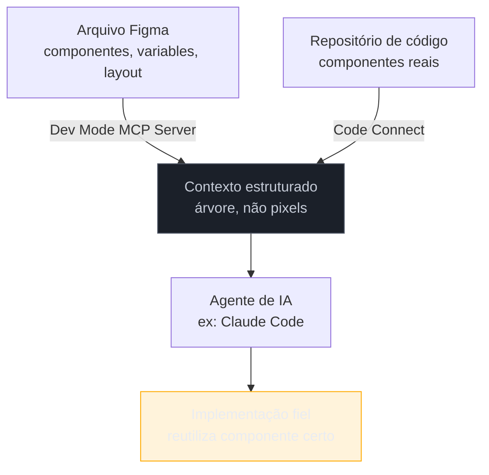

# Figma MCP Server e Code Connect

> [!warning] Nota perecível — escrita em 2026-07-29
> MCP servers de design mudam de superfície rápido: comandos, escopo de permissão e o que é "beta" vira GA em poucos meses. A data exata de lançamento do recurso de escrita no canvas (write-to-canvas) descrito nesta nota **não pôde ser confirmada com precisão** — ver a seção dedicada abaixo. Revalide contra `help.figma.com` antes de confiar em qualquer passo de setup.

> [!abstract] TL;DR
> O **Dev Mode MCP Server** do Figma expõe um arquivo de design como **contexto estruturado** para um agente de IA — componentes, variables, layout e (com **Code Connect** configurado) referências reais de implementação em código. A tese central: um agente que recebe essa árvore de dados trabalha melhor do que um agente que recebe um screenshot e precisa "OCRar" onde fica cada botão. Em 2026 o servidor deixou de ser só leitura: também escreve de volta no canvas do Figma, criando ou atualizando componentes nativos a partir do próprio agente — mas a data exata desse salto e o quanto isso muda o fluxo de trabalho ainda merece ceticismo até você testar no seu próprio projeto.

Imagine dois jeitos de pedir para um agente de IA implementar uma tela a partir de um design pronto. No primeiro, você tira um screenshot do Figma e cola no chat: "implementa essa tela". O agente enxerga pixels — precisa inferir onde termina um card e começa outro, adivinhar se aquele texto cinza-claro é `text-secondary` ou só uma opacidade aplicada à mão, e não tem como saber se o botão "Salvar" já existe como componente em algum lugar do seu código. No segundo, o agente tem acesso ao **Dev Mode MCP Server**: ele recebe a árvore real do arquivo — nomes de camada, variables aplicadas, constraints de auto layout, e (se **Code Connect** estiver configurado) o caminho exato do componente de código que já implementa aquele padrão. A diferença não é sutil: no primeiro caso o agente adivinha uma estrutura a partir de uma imagem; no segundo, ele lê a estrutura que já existe.

Essa diferença — dado estruturado versus pixel para adivinhar — é a tese inteira desta nota, e ela repete a mesma lógica que vai aparecer de novo na [[03-Dominios/Tecnologia/Ferramentas de Design/09 - Loop visual com Playwright MCP e visual regression|nota 09]], só que do lado oposto do ciclo: lá é o agente *lendo* uma página renderizada via accessibility tree; aqui é o agente *lendo* um design antes de qualquer código existir.

## O que o Dev Mode MCP Server expõe

Segundo a documentação oficial do Figma (Help Center, artigo "Guide to the Dev Mode MCP Server"), o servidor permite a um cliente MCP — Claude Code entre eles — **extrair contexto de design** de um arquivo Figma: variables, componentes e dados de layout, e **gerar código a partir de frames selecionados**. Na prática, isso significa que quando você aponta o Claude Code para uma seleção do Figma, o agente recebe algo estruturalmente parecido com o que você mesmo veria no painel do Dev Mode — a mesma leitura que a [[03-Dominios/Tecnologia/Ferramentas de Design/01 - Figma para o engenheiro|nota 01]] ensinou a fazer manualmente, só que automatizada e entregue como dado, não como imagem.

Existem dois modos de instalação, ambos confirmados na documentação oficial:

- **Remoto** — instalado como plugin do Claude Code (`claude plugin install figma@claude-plugins-official`), autenticado via marketplace de plugins. É a opção com o conjunto mais completo de recursos, segundo o Help Center do Figma.
- **Desktop (local)** — habilitado dentro do próprio Figma em modo Dev Mode e configurado localmente via transporte HTTP; reservado a cenários específicos de organização/enterprise.

O guia de setup oficial cobre editores como Claude Code e VS Code separadamente — os passos exatos de cada um mudam com frequência o suficiente para não valer a pena reproduzi-los aqui; a fonte de verdade é sempre o próprio Help Center do Figma, linkado em Fontes.

## Code Connect: dando ao MCP uma referência real de implementação

O MCP Server sozinho já entrega estrutura — mas ainda não sabe **como aquele componente já foi implementado** no seu código. É aí que entra o **Code Connect**: uma ponte que liga um componente real do seu repositório a um componente do arquivo Figma, para que o Dev Mode (e, por extensão, o MCP Server) mostre não só "isto é um botão primário" mas "isto é um botão primário, e o componente que já implementa isso no código é `src/components/Button.tsx`".

Segundo o Help Center do Figma, existem dois jeitos de configurar essa ligação:

- **Code Connect UI** — ferramenta visual, sem setup local, pensada para times de design-engineering: conecta repositórios do GitHub ou aceita caminhos de componente colados manualmente.
- **Code Connect CLI** — roda localmente no seu próprio codebase, com mapeamento de props e exemplos de código dinâmicos, com suporte a React, HTML, SwiftUI e Jetpack Compose.

Ambos alimentam o MCP Server com o mesmo resultado final: em vez de o agente **gerar uma aproximação** do componente a partir do design, ele recebe o **exemplo de código real conectado** ao componente do design system — a documentação oficial chama isso de "MCP codegen aprimorado", que mostra prévias de código baseadas nos arquivos-fonte conectados de fato, em vez de sugestões genéricas.

> [!question]- Sem Code Connect, o MCP Server ainda serve pra alguma coisa?
> Sim — ele já entrega variables, layout e árvore de componentes mesmo sem Code Connect configurado, o que sozinho já resolve o problema de "adivinhar pixel". O que falta sem Code Connect é a referência de **implementação real**: o agente sabe que existe um componente chamado "Button/Primary" no Figma, mas não sabe automaticamente que ele já existe como `src/components/Button.tsx` no seu código — nesse caso, ele pode reimplementar do zero algo que já existia, gerando duplicação. Code Connect é o que fecha esse último elo.

## O ponto não confirmado: escrita no canvas e a data exata

A pesquisa que precedeu esta nota levantou uma integração "bidirecional" Figma ↔ Claude Code — Design→Code e Code→Canvas — com lançamento apontado por uma fonte secundária para fevereiro de 2026. Ao verificar diretamente:

- O **Help Center do Figma** confirma, sem citar data, que o Dev Mode MCP Server hoje **escreve de volta no canvas**: "write directly to the canvas to create or update native Figma content, and send live web interfaces to Figma as editable layers" — ou seja, o agente não só lê o arquivo, também cria e atualiza frames, componentes, variables e auto layout diretamente no Figma. Esse recurso está descrito como estando em **período de beta** (gratuito durante o beta, segundo a mesma página).
- Não encontrei, nas páginas oficiais checadas (`help.figma.com`, `figma.com/blog`, `anthropic.com`), uma data específica de fevereiro de 2026 para esse lançamento.
- Um vídeo de terceiro (canal QuantBrasil, em português) cita um post do blog do Figma datado de **24 de março de 2026** anunciando que agentes de IA passam a poder criar diretamente no canvas — uma data diferente da apontada pela pesquisa original, e ainda assim uma fonte secundária, não o post em si verificado diretamente por esta nota.

**Tratamento adotado aqui:** afirmo que a escrita no canvas existe e está em beta (fonte primária, Help Center do Figma), mas **não afirmo uma data de lançamento específica** — nem fevereiro nem março de 2026 — porque nenhuma das duas está confirmada em fonte primária consultada. Se a data importar para o seu contexto (ex: comparar maturidade de feature em decisão de adoção), confira o changelog oficial do Figma antes de citar um mês.

## Praticável sozinho vs. exige mais estrutura

O que isso muda no dia a dia de quem trabalha sozinho: na prática de segunda-feira, o ganho do MCP Server + Code Connect não é "o agente desenha por você" — é reduzir o número de decisões erradas que o agente toma por falta de contexto. Sem esse contexto estruturado, um agente que implementa a partir de screenshot tende a: inventar espaçamento aproximado em vez de usar o valor real, criar um componente novo em vez de reutilizar um existente, e perder a relação entre um valor visual e o token que ele deveria representar — os três erros exatamente descritos nos Casos práticos da [[03-Dominios/Tecnologia/Ferramentas de Design/01 - Figma para o engenheiro|nota 01]]. Configurar o MCP Server e, quando fizer sentido, o Code Connect, é investimento de configuração único (uma tarde) que paga esse mesmo dividendo em toda tela implementada depois.

## Casos práticos

### Cenário 1: o componente duplicado que o Code Connect evitaria
Um engenheiro pede ao Claude Code, com o Figma MCP Server ativo mas **sem Code Connect configurado**, para implementar um card de produto a partir de uma seleção no Figma. O agente lê a estrutura corretamente — variables de cor, espaçamento, auto layout — mas não sabe que um componente `ProductCard.tsx` quase idêntico já existe no repositório, porque não há ligação entre o componente do Figma e o do código. Resultado: um segundo componente, `ProductCardV2.tsx`, nasce com pequenas diferenças de nomenclatura de prop. **O que deu errado:** contexto de design sem contexto de código-existente ainda deixa a decisão de reutilização inteiramente com o agente, que não tem como saber o que já existe sem ser informado. **Correção específica:** configurar Code Connect para os componentes centrais do design system (mesmo que não para todos) é o que fecha esse gap — a referência ao componente real vira parte do contexto que o MCP entrega, e o agente para de reinventar o que já existe.

### Cenário 2: o setup remoto vs. desktop escolhido errado
Um engenheiro solo, fora de um contexto enterprise, tenta configurar a versão desktop do MCP Server porque leu num tutorial antigo que era "a opção mais completa" — e trava em passos de configuração pensados para cenários de organização com controle de acesso centralizado. **O que deu errado:** seguir um guia desatualizado sem checar se ele ainda reflete a opção recomendada atual — o Help Center do Figma, na versão consultada para esta nota, posiciona a opção **remota** como a de recursos mais amplos para o caso comum, reservando a desktop para cenários enterprise específicos. **Correção específica:** para uso individual ou de time pequeno, começar pela instalação remota via plugin do Claude Code é o caminho de menor atrito — e é o primeiro passo que o próprio Help Center recomenda hoje.

### Cenário 3: confiar demais na escrita no canvas sem revisão
Um engenheiro usa a capacidade de escrita no canvas (ainda em beta) para pedir ao agente que "ajuste o design system no Figma para bater com o código atual" sem revisar o resultado antes de compartilhar o arquivo com o time de design. O agente cria variables e componentes automaticamente, mas com nomenclatura ligeiramente diferente da convenção que o time de design já usava, gerando confusão sobre qual é a fonte de verdade. **O que deu errado:** tratar um recurso em beta, que escreve diretamente num artefato compartilhado (o arquivo Figma), como se já fosse maduro o suficiente para rodar sem revisão humana. **Correção específica:** usar a escrita no canvas em um arquivo de rascunho ou branch de design isolado primeiro, revisar a nomenclatura gerada contra a convenção existente, e só então mesclar — o mesmo cuidado que se teria com qualquer geração automática de código em produção.

## Armadilhas comuns

> [!warning] Tratar o MCP Server como leitor perfeito de intenção de design
> **O que acontece:** o engenheiro assume que, por ter contexto estruturado, o agente vai sempre escolher o componente certo e a variable certa sem revisão. **Por quê:** contexto estruturado reduz adivinhação, mas não elimina ambiguidade — um design pode ter dois componentes visualmente parecidos sem Code Connect ligando nenhum deles à implementação certa, como no Cenário 1. **Como evitar:** revisar o output do agente contra o Dev Mode manualmente (ver [[03-Dominios/Tecnologia/Ferramentas de Design/01 - Figma para o engenheiro|nota 01]]) até ter confiança repetida de que o setup de Code Connect cobre os componentes centrais do seu design system.

> [!warning] Configurar Code Connect uma vez e nunca revisar
> **O que acontece:** o design system evolui — componentes são renomeados, props mudam — mas o mapeamento do Code Connect não é atualizado, e o MCP passa a sugerir referências de código desatualizadas. **Por quê:** Code Connect é uma ligação declarada manualmente (ou semi-automaticamente); ela não se autocorrige quando o código-fonte muda de estrutura. **Como evitar:** tratar a manutenção do Code Connect como parte do checklist de qualquer refactor que renomeie ou mova componentes centrais do design system.

> [!warning] Citar a data de um recurso em beta como se fosse definitiva
> **O que acontece:** alguém descreve a escrita no canvas do Figma como "lançada em fevereiro de 2026" (ou março) numa conversa técnica ou entrevista, sem checar a fonte oficial. **Por quê:** a informação circulou por fontes secundárias com datas divergentes — o próprio esforço de checagem desta nota encontrou duas datas diferentes sem confirmar nenhuma em fonte primária. **Como evitar:** para features em beta, cite o estado ("em beta, hoje") em vez da data de lançamento, a menos que você tenha confirmado a data diretamente no changelog oficial.

> [!tip] Assista: Claude Code e Codex com Figma MCP — o fim da UI genérica?
> **Canal:** Rafael Quintanilha — QuantBrasil | **Duração:** ~31min | **Idioma:** PT-BR (legenda automática) O vídeo demonstra, em português, o setup prático do Figma MCP com Claude Code e discute o mesmo ponto central desta nota — contexto estruturado versus geração "cega" — a partir da experiência de quem tentou extrair um design system existente e reutilizá-lo com IA em vez de deixar o agente reinventar componentes. Trecho de destaque [3:00]: *"o autor diz que a partir de agora você consegue utilizar os agentes de IA para fazer o design diretamente no canvas do Figma"* — citando o anúncio do blog oficial do Figma, que o autor do vídeo data de 24 de março de 2026 (data não verificada diretamente por esta nota — ver seção acima).
>
> 🎬 [Assistir no YouTube](https://www.youtube.com/watch?v=VHESZ4GsoQk)

## Como explicar em inglês

> "The Figma Dev Mode MCP Server gives an AI agent structured design context — components, variables, layout constraints — instead of a screenshot it has to reverse-engineer. Code Connect closes the last gap: it links a real code component to its Figma counterpart, so the agent gets an actual implementation reference instead of generating an approximation from scratch. As of mid-2026 the server also writes back to the canvas — creating or updating native Figma content from the agent side — but I couldn't confirm an exact launch date for that feature from a primary source, so I treat it as 'currently in beta' rather than citing a month."

| PT | EN |
|----|----|
| contexto estruturado | structured context |
| Dev Mode MCP Server | Dev Mode MCP Server |
| Code Connect | Code Connect |
| escrita no canvas | write-to-canvas |
| referência de implementação | implementation reference |
| período de beta | beta period |

## O que vem a seguir

O MCP Server resolve a leitura do design existente — mas e quando o design ainda não existe em lugar nenhum, e nasce dentro de uma conversa com um agente? A próxima nota cobre exatamente esse caso: o Claude Design, o produto de research preview/beta da Anthropic que cria o design e empacota o handoff para o Claude Code continuar de onde parou.

- [[03-Dominios/Tecnologia/Ferramentas de Design/03 - Claude Design e o handoff bundle|03 — Claude Design e o handoff bundle]] — quando o próprio agente cria o design, não só o lê.

## Fontes

- **Figma Help Center** — [*Guide to the Dev Mode MCP Server*](https://help.figma.com/hc/en-us/articles/32132100833559-Guide-to-the-Dev-Mode-MCP-Server) — capacidades, escrita no canvas, setup remoto vs. desktop.
- **Figma Help Center** — [*Claude Code and Figma: Set up the MCP server*](https://help.figma.com/hc/en-us/articles/39888612464151-Claude-Code-and-Figma-Set-up-the-MCP-server) — setup específico para Claude Code.
- **Figma Help Center** — [*Code Connect*](https://help.figma.com/hc/en-us/articles/23920389749655-Code-Connect) — ligação entre componentes de código e componentes de design, UI vs CLI.
- **Rafael Quintanilha (QuantBrasil, YouTube)** — [*Claude Code e Codex com Figma MCP: o fim da UI genérica?*](https://www.youtube.com/watch?v=VHESZ4GsoQk) — demonstração prática em PT-BR, usada como mídia desta nota; cita (não verificado por esta nota) post do blog do Figma de 24/mar/2026.
