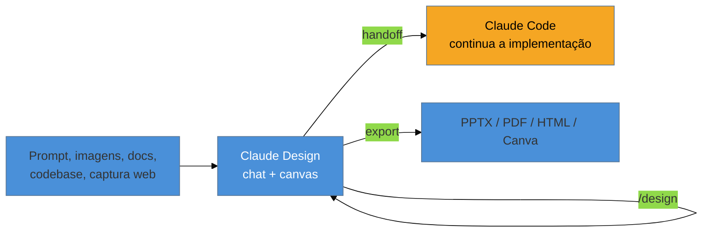

# Claude Design e o handoff bundle

> [!warning] Nota perecível — escrita em 2026-07-29
> Claude Design é um produto **beta** que muda de nome de status, limite de uso e feature entre um mês e outro — a própria página oficial já mudou de "research preview" para "beta" entre o lançamento (17/abr/2026) e a escrita desta nota. Revalide contra `claude.com/product/claude-design` antes de confiar em qualquer detalhe abaixo, especialmente limites de uso e disponibilidade por plano.

> [!abstract] TL;DR
> **Claude Design** é o produto de design/protótipo da Anthropic — chat à esquerda, canvas à direita — que lê o codebase e os arquivos de design do time para aplicar o design system automaticamente, e empacota o resultado num **handoff** que o Claude Code recebe e continua, em vez de recomeçar do zero a partir de um screenshot. Ele roda sobre o modelo de visão mais capaz da Anthropic no momento do lançamento (Claude Opus 4.7). O comando `/design-sync` — que a pesquisa original desta nota marcou como "não confirmado, só em blog de terceiro" — **está, de fato, documentado na página oficial do produto**: "Pull in your design system from Claude Code using `/design-sync` or work directly in Claude Code with `/design`". Trate Claude Design como ferramenta de **visual e protótipo**, não como gerador de app funcional completo com lógica de estado real — a documentação oficial não detalha limites técnicos de complexidade, e até prova em contrário essa é a leitura mais segura.

Você termina de desenhar uma tela inteira de onboarding com um agente de IA — layout, hierarquia, estados de erro, cópia revisada — e agora precisa que ela vire código de produção. O caminho mais comum até pouco tempo atrás era: tirar screenshot de cada estado, colar numa conversa separada com um agente de codificação, e escrever de próprio punho um README descrevendo cada detalhe que o screenshot não capturava — espaçamento exato, comportamento de hover, regra de responsividade. Metade do trabalho de design perfeitamente capturado numa ferramenta se perde na tradução para a próxima. É exatamente esse ponto de perda que o **handoff bundle** do Claude Design existe para eliminar: o produto que desenhou a tela empacota, ele mesmo, tudo que o Claude Code precisa para continuar — sem passar por screenshot.

## O que é, confirmado em fonte primária

Segundo a página oficial do produto (`claude.com/product/claude-design`), Claude Design é um produto **beta** da Anthropic, incluído na assinatura de planos **Pro, Max, Team e Enterprise** — em Enterprise, **desligado por padrão**, habilitado por um admin em configurações da organização. A interface é de dois painéis: chat à esquerda para instruir e refinar, canvas à direita mostrando o resultado visual — designs, protótipos, slides e one-pagers.

**Entrada de contexto:** no onboarding, o produto lê o **codebase** e/ou **arquivos de design** do time para construir automaticamente o design system que vai aplicar — cores, tipografia, componentes — com suporte a múltiplos design systems importados de repositório GitHub, arquivos de design ou uploads brutos. Além do onboarding, aceita prompt de texto, imagens, documentos (DOCX/PPTX/XLSX) e uma ferramenta de captura web.

**Refinamento:** comentário inline em qualquer elemento, edição direta de texto, e "knobs" — sliders de ajuste ao vivo para espaçamento e cor — em vez de reescrever o prompt inteiro para uma mudança pequena.

**Exportação:** URL interna (link com escopo de organização), pasta, Canva, PDF, PPTX, HTML standalone, ou **handoff para o Claude Code**.

## O comando `/design-sync`: o não-confirmado que se confirmou

A pesquisa que precedeu esta nota marcou explicitamente o comando `/design-sync` como **não verificado** — apareceria só em blog de terceiro, não na documentação oficial da Anthropic. Ao verificar diretamente a página oficial do produto hoje, o comando **está documentado**: "Pull in your design system from Claude Code using `/design-sync` or work directly in Claude Code with `/design`." Ou seja, existem dois comandos complementares — `/design` para abrir Claude Design a partir do Claude Code, e `/design-sync` para puxar de volta o design system que o Claude Code já conhece do repositório. Isso fecha o loop: o design system pode nascer no código e ser importado para o Claude Design, ou nascer no Claude Design e ser exportado via handoff — nos dois sentidos.

**Correção sobre a pesquisa original:** o fato de esta nota ter encontrado a confirmação onde a pesquisa não encontrou ilustra bem por que este galho tem callout de caducidade — o intervalo entre a pesquisa (28/07) e a escrita desta nota (29/07) foi de um dia, e mesmo assim a documentação oficial mudou o suficiente para confirmar algo que estava marcado como incerto. Não presuma que o inverso não pode acontecer: revalide sempre.

## O handoff bundle, e a fronteira com a skill `handoff-design`

O ambiente deste vault já tem acesso a uma skill global do usuário, `handoff-design` (vive em `~/.claude/skills/`, fora deste repositório), que gera o **prompt de instrução** para o Claude Design produzir um `README.md` de handoff completo e autocontido — cobrindo contexto e stack, design tokens, screenshots, layout e responsividade, componentes com contrato de props, interação e navegação, casos de borda, assets, acessibilidade WCAG AA, o que não fazer, critérios de aceitação e definição de pronto. Esta nota **não duplica** esse prompt — ele já está versionado na skill (`~/.claude/skills/handoff-design/SKILL.md`, versão 3.1.0 no momento desta nota) e é o artefato certo para gerar o pedido de handoff a colar no `claude.ai/design`.

O que vale checar, e que pode ter mudado desde que a skill foi escrita: se o **formato do bundle que o Claude Design efetivamente gera hoje** ainda bate com a estrutura de 12 seções que a skill pede. A página oficial confirma que o handoff empacota "arquivos de design (HTML/CSS/JS)", screenshots de cada estado, e um README de especificação — estrutura compatível com o que a skill já assume, mas vale uma checagem manual (gerar um handoff pequeno de teste) antes de confiar cegamente na correspondência, dado que o produto está em beta e muda de mês em mês.

> [!question]- Por que não pedir para o próprio Claude Design gerar o handoff sem usar a skill?
> Dá para pedir diretamente — mas a skill existe porque o prompt de instrução completo (12 seções, com defaults de stack, alias de import, camadas de arquitetura e inventário de componentes já preenchidos para os repositórios do usuário) é longo e repetitivo de escrever à mão toda vez. A skill não substitui o Claude Design gerando o bundle — ela só garante que o **pedido** feito ao Claude Design seja sempre completo e consistente, sem esquecer uma seção (ex: acessibilidade, ou o que não fazer) só porque ninguém lembrou de pedir daquela vez.

## O que a documentação oficial não diz — e como tratar isso

A doc oficial não detalha **limites técnicos**: complexidade máxima de protótipo, se o resultado gera lógica de estado real ou só a aparência de interatividade, quantos componentes um design system importado suporta antes de degradar. Diante dessa lacuna, o tratamento adotado nesta nota — e recomendado a quem usa a ferramenta — é: **trate Claude Design como ferramenta de visual e protótipo, não como gerador de app funcional completo**, até você mesmo testar os limites no seu projeto. Um protótipo visualmente convincente não é prova de que a lógica por trás dele é real; a mesma cautela da [[03-Dominios/Tecnologia/Ferramentas de Design/04 - Geradores de UI por IA|nota 04]] sobre geradores de UI se aplica aqui.

Também vale registrar com precisão o que a página oficial diz sobre **limites de uso**: "Claude Design shares usage limits with chat, Claude Cowork, and Claude Code" — ou seja, no momento desta nota, os limites são **compartilhados**, não separados. Isso pode já ter mudado de novo entre a checagem desta nota e a sua leitura — é exatamente o tipo de detalhe que este galho pede para revalidar, não citar de memória.

## Praticável sozinho vs. exige revisão

Usar Claude Design para gerar um primeiro protótipo visual de uma tela nova, a partir de um design system já importado do seu codebase, é inteiramente praticável por uma pessoa — é o caso de uso central do produto, e o "knob" de ajuste ao vivo torna a iteração rápida sem depender de ninguém além de você. Gerar o handoff bundle e entregá-lo ao Claude Code via a skill `handoff-design` também é fluxo de uma pessoa só, ponta a ponta.

O que pede mais cautela — não porque exija um time, mas porque exige **ceticismo ativo do próprio usuário solo**: aceitar sem revisão que o design system importado do codebase capturou corretamente as convenções reais do projeto, ou que um protótipo com aparência de app funcional realmente implementa a lógica de estado que parece ter. Nos dois casos, o risco não é "preciso de mais gente" — é "preciso verificar antes de confiar", exatamente o tipo de limite que se nomeia, não se ignora, seguindo o mesmo princípio do [[03-Dominios/Engenharia/UX/Fundamentos e Modelo Mental/01 - UX não é tela - o ofício e seus limites|SG1 de Engenharia/UX]].

## Casos práticos

### Cenário 1: o handoff que "parecia" completo e faltava um estado
Um engenheiro solo gera um handoff bundle do Claude Design para uma tela de checkout com três estados visíveis no protótipo — padrão, carregando, sucesso — e entrega ao Claude Code via skill `handoff-design`. A implementação sai correta para os três estados, mas o Claude Code não sabe o que fazer quando a chamada de pagamento falha, porque o protótipo original nunca desenhou esse estado. **O que deu errado:** o handoff bundle documenta fielmente o que existe no protótipo — não pode inventar um estado que o design nunca cobriu. **Correção específica:** antes de gerar o handoff, revisar contra a seção "Casos de borda e conteúdo variável" do próprio template da skill `handoff-design` — que já pede explicitamente por texto longo, listas vazias, e (por extensão) estados de erro — e voltar ao Claude Design para desenhar o que falta, em vez de deixar o Claude Code improvisar um estado de erro sem referência visual.

### Cenário 2: confundir protótipo bonito com app funcional
Um engenheiro apresenta a um cliente um protótipo gerado no Claude Design com um fluxo de múltiplos passos que parece navegável — clicar em "Próximo" avança visualmente para a tela seguinte — e o cliente entende que a lógica de validação entre passos já está implementada. Na reunião de handoff real, fica claro que o protótipo simula a navegação sem nenhuma validação de dado real por trás. **O que deu errado:** a documentação oficial não garante que a interatividade visual implica lógica funcional — e a ausência dessa garantia é justamente o ponto que esta nota marca como "trate como protótipo, não como app". **Correção específica:** ao apresentar um protótipo do Claude Design a um cliente não-técnico, nomear explicitamente o que é "aparência de comportamento" versus "comportamento real implementado" antes que a ambiguidade vire expectativa errada — o mesmo cuidado de comunicação que a [[03-Dominios/Engenharia/UX/Fundamentos e Modelo Mental/01 - UX não é tela - o ofício e seus limites|nota 01 do SG1]] descreve para nomear limites ao cliente.

### Cenário 3: `/design-sync` puxando um design system desatualizado
Um engenheiro roda `/design-sync` no Claude Code para puxar o design system que o Claude Design já tinha construído, mas o repositório de código tinha, entretanto, passado por um refactor de componentes que renomeou tokens de cor — o Claude Design nunca foi informado dessa mudança. O sync traz referências antigas, e o próximo protótipo gerado usa nomes de token que não existem mais no código. **O que deu errado:** sincronização entre dois lados só funciona se os dois lados foram atualizados — `/design-sync` resolve a transferência, não a atualização do conteúdo em si. **Correção específica:** depois de qualquer refactor que renomeie tokens ou componentes centrais, reimportar o design system no Claude Design (o mesmo fluxo de onboarding inicial) antes de confiar num sync automático — tratando o design system importado como algo que também precisa de manutenção, igual ao mapeamento do Code Connect discutido na [[03-Dominios/Tecnologia/Ferramentas de Design/02 - Figma MCP Server e Code Connect|nota 02]].

## Armadilhas comuns

> [!warning] Citar feature ou comando sem checar a doc oficial no dia
> **O que acontece:** alguém afirma que um comando ou recurso do Claude Design "não existe" (ou existe) baseado numa fonte de um mês atrás. **Por quê:** esta própria nota encontrou uma mudança de status (`/design-sync` de "não confirmado" para "documentado oficialmente") num intervalo de um dia entre a pesquisa e a escrita — o produto está em beta ativo, e a doc muda mais rápido que o hábito de checar de novo. **Como evitar:** antes de afirmar algo sobre Claude Design numa conversa técnica ou entrevista, checar `claude.com/product/claude-design` no momento, não confiar em memória de leitura anterior.

> [!warning] Tratar protótipo interativo como prova de lógica funcional
> **O que acontece:** a navegação visual entre telas de um protótipo é confundida com validação, persistência ou regra de negócio real implementada, como no Cenário 2. **Por quê:** a documentação oficial não garante nem desmente isso — a lacuna de informação é preenchida, por padrão, com otimismo, quando deveria ser preenchida com cautela. **Como evitar:** nomear explicitamente, para qualquer stakeholder que veja o protótipo, que "isto mostra a aparência do fluxo, não a lógica por trás dele" até você mesmo confirmar o contrário testando.

> [!warning] Deixar o handoff bundle ser a única fonte de verdade permanente
> **O que acontece:** o time trata o README de handoff gerado uma vez como documentação viva, sem atualizá-lo depois que o Claude Code começa a divergir da especificação original durante a implementação. **Por quê:** o handoff bundle captura a intenção de design **no momento da geração** — não é um contrato vivo sincronizado automaticamente com o código depois que a implementação começa a evoluir por conta própria. **Como evitar:** tratar o handoff como ponto de partida documentado, não como fonte de verdade contínua; se o código evolui de um jeito que diverge do design original, essa divergência precisa ser decidida conscientemente, não silenciosamente ignorada.

> [!tip] Assista: Anthropic ACABOU DE LANÇAR o Claude Design (testei TUDO)
> **Canal:** Matheus Battisti — Hora de Codar | **Duração:** ~13min50s | **Idioma:** PT-BR (legenda automática) Publicado no mesmo dia do lançamento oficial (17/abr/2026 — mesma data do vídeo oficial "Introducing Claude Design by Anthropic Labs" no canal Claude), o vídeo demonstra o fluxo real de handoff para o Claude Code, incluindo o comando copiável de handoff e a seleção do modelo (Opus 4.7) usado por baixo — corroborando, de fonte independente, os dois pontos que a pesquisa original desta nota já tratava como verificados. Trecho de destaque [8:40]: *"aí agora se a gente quisesse continuar no Claude Code, dá um handoff — vou copiar o comando aqui"* — demonstração ao vivo do fluxo de handoff descrito nesta nota.
>
> 🎬 [Assistir no YouTube](https://www.youtube.com/watch?v=ZGJ26VZKYBY)

## Como explicar em inglês

> "Claude Design is Anthropic's chat-plus-canvas design product — it reads your codebase or design files to apply your real design system, and it hands off the result to Claude Code as a self-contained bundle instead of a screenshot. It runs on Anthropic's most capable vision model at launch (Opus 4.7). I treat it as a visual/prototyping tool, not a full functional-app generator, because the official docs don't document technical limits on complexity or whether interactions carry real state logic — until I've tested that myself on a given prototype, I don't assume it does."

| PT | EN |
|----|----|
| pacote de handoff | handoff bundle |
| research preview / beta | research preview / beta |
| design system importado | imported design system |
| protótipo vs. app funcional | prototype vs. functional app |
| sincronizar (design system) | sync |
| ajuste ao vivo (slider) | live knob / live adjustment |

## O que vem a seguir

Claude Design é um produto fechado, com fluxo próprio de handoff — mas ele é só uma família dentro de um universo maior de geradores de UI por IA, cada um com trade-offs diferentes de flexibilidade de stack, integração de backend e fidelidade de saída. A próxima nota mapeia esse universo e como avaliar a saída de qualquer um deles.

- [[03-Dominios/Tecnologia/Ferramentas de Design/04 - Geradores de UI por IA|04 — Geradores de UI por IA]] — v0, Bolt, Lovable, Subframe: onde ajudam e onde produzem lixo.
- [[03-Dominios/Tecnologia/IA/Claude Code/index|Tecnologia/IA/Claude Code]] — o lado que recebe o handoff bundle e continua a implementação.

## Fontes

- **Anthropic (Claude, produto oficial)** — [*Claude Design*](https://claude.com/product/claude-design) — descrição oficial do produto, comando `/design-sync`, disponibilidade por plano, limites de uso compartilhados; consultado em 2026-07-29.
- **Anthropic (canal oficial "Claude", YouTube)** — [*Introducing Claude Design by Anthropic Labs*](https://www.youtube.com/watch?v=t_LBECIQQqs) — vídeo de lançamento, publicado em 17/04/2026, confirma a data.
- **Matheus Battisti — Hora de Codar (YouTube)** — [*Anthropic ACABOU DE LANÇAR o Claude Design (testei TUDO)*](https://www.youtube.com/watch?v=ZGJ26VZKYBY) — demonstração prática em PT-BR no dia do lançamento, usada como mídia desta nota.
- Skill global do usuário `handoff-design` (`~/.claude/skills/handoff-design/SKILL.md`, v3.1.0, fora deste repositório) — gera o prompt de handoff completo; linkada, não duplicada, por esta nota.
