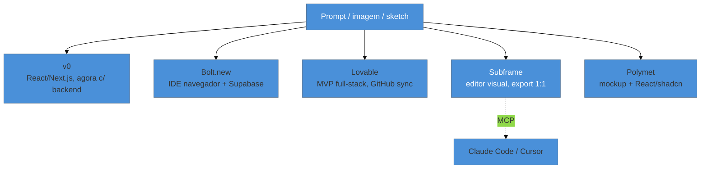

# Geradores de UI por IA

> [!warning] Nota perecível — escrita em 2026-07-29
> Esta é a categoria de produto que mais muda de posicionamento em 2026 — o próprio v0, que a pesquisa original desta nota descrevia como "gera só frontend", já se anuncia hoje como gerador de aplicação completa com backend. Revalide o escopo real de cada ferramenta na página oficial antes de recomendar uma para um caso específico — não confie na categorização abaixo além do que ela é: um retrato de 2026-07-29.

> [!abstract] TL;DR
> **v0, Bolt.new, Lovable, Subframe e Polymet** competem no mesmo espaço — gerar interface (e, cada vez mais, aplicação inteira) a partir de linguagem natural — mas com perfis diferentes: v0 nasceu focado em componentes React/Next.js e hoje reivindica gerar app completo com banco de dados; Bolt.new é IDE completa no navegador com infraestrutura embutida; Lovable mira MVP full-stack rápido com sync GitHub; Subframe é o único com editor visual drag-and-drop que exporta código 1:1 e tem integração MCP nativa com Claude Code/Cursor; Polymet gera mockup + código React (shadcn), com trás de si o peso institucional de ser **backed by Y Combinator**, com clientes citados como Cisco e SAP. Onde ajudam de verdade: prototipagem rápida, MVP descartável, iteração de "vibe" visual. Onde produzem lixo: app com lógica de negócio complexa, design system consistente em escala, e acessibilidade real — que tende a ser *bolt-on*, não nativa.

Um freelancer recebe um pedido de MVP para validar uma ideia de negócio antes de levantar investimento — três telas, sem lógica de negócio complexa, só para mostrar a um investidor em uma semana. Ele passa dois dias configurando um projeto React do zero, escrevendo componentes, ajustando CSS. No terceiro dia, descobre que um gerador de UI por IA teria feito as mesmas três telas em 20 minutos, com deploy incluído. Na semana seguinte, outro cliente pede um dashboard interno com regras de permissão por papel de usuário, integração com um ERP legado e workflow de aprovação em múltiplas etapas — e o mesmo freelancer, animado com o resultado anterior, tenta fazer tudo dentro do gerador de UI, sem sair dele. Duas semanas depois, está reescrevendo à mão a metade da lógica que o gerador "inventou" errado, porque nunca foi feito para aquele tipo de complexidade. O erro não foi usar a ferramenta — foi não ter perguntado, nos dois casos, "isso está dentro do que essa categoria de ferramenta faz bem?"

Essa pergunta é o eixo desta nota: mapear onde cada ferramenta principal dessa categoria ajuda de verdade, e onde ela sistematicamente produz lixo — para que a escolha de usar (ou não usar) uma delas seja uma decisão informada, não um "vamos ver no que dá".

## O mapa das cinco ferramentas

**v0 (Vercel)** — nasceu gerando componentes React isolados, otimizado para o ecossistema Next.js/Vercel. Checando a página oficial hoje, o produto já se descreve como "agentic by default" — "plans, creates tasks, and connects to databases as it builds" — reivindicando gerar aplicações completas, não só componentes soltos, com integração direta a GitHub. Isso é uma mudança de escopo real desde que a categorização "só frontend, sem backend" foi cunhada — trate essa caracterização como desatualizada e verifique o estado atual antes de recomendar v0 só para prototipagem visual.

**Bolt.new** — IDE completa dentro do navegador, com chat de IA, integração Supabase, edição direta de código e preview ao vivo. Perfil mais próximo de "ambiente de desenvolvimento completo" do que "gerador de tela": permite importar designs do Figma e código do GitHub, e é mais flexível quanto a stack do que v0, que fica mais preso ao ecossistema Vercel/Next.js.

**Lovable** (ex-GPT Engineer) — mira MVP full-stack rápido (React + Supabase via "Lovable Cloud"), com sync de GitHub e deploy rápido. O material de marketing do produto não afirma explicitamente, na versão consultada, um compromisso declarado contra a "cara de app feito por IA" — mas usuários que comparam múltiplas ferramentas na prática relatam resultado visual "menos genérico" que concorrentes diretos, mesmo com ressalvas de acabamento (ver mídia desta nota). Trate esse diferencial como observação de uso, não como claim confirmado pelo próprio produto.

**Subframe** — o outlier da lista: um editor visual drag-and-drop "code-grade" que gera componentes React/Tailwind exportáveis 1:1 — a promessa explícita é "cada camada mapeia diretamente para código", sem geração por IA no código em si (a IA entra na etapa de design, não na etapa de exportação). Tem integração MCP confirmada com Claude Code e Cursor: sincroniza componentes, exporta código de página e permite pedir novos designs diretamente do editor, com contexto completo do codebase.

**Polymet** — gera mockups de alta fidelidade e código React (shadcn) a partir de texto, sketch ou imagem, com importação/exportação de arquivos Figma. Diferente do que a pesquisa original sinalizava (fontes de baixa autoridade, perfil de diretório SEO), a página oficial do produto hoje se posiciona com peso institucional real — **backed by Y Combinator**, com clientes citados nominalmente (Cisco, SAP, ByteDance) e postura "enterprise-ready". Isso não é prova de maturidade técnica da geração de código em si, mas eleva a confiança de que não é um produto abandonado ou fantasma.

## Onde ajudam de verdade, e onde produzem lixo

O ponto de corte não é "essas ferramentas são boas ou ruins" — é o tipo de problema para o qual elas foram otimizadas.

**Ajudam de verdade:**
- **Prototipagem rápida de tela isolada** — validar uma ideia visual, sem compromisso de manter o código depois.
- **MVP descartável** — como no cenário de abertura: mostrar algo funcional a um investidor ou stakeholder antes de qualquer decisão de arquitetura séria ter sido tomada.
- **Iteração de "vibe" visual** — testar rapidamente três direções de estilo antes de comprometer com uma, sem o custo de implementar cada uma à mão.

**Produzem lixo:**
- **App com estado e lógica de negócio complexos** — regras de permissão, workflows multi-etapa, integrações com sistemas legados. O gerador tende a inventar uma versão plausível, mas não necessariamente correta, da lógica que você pediu — exatamente o erro do segundo cenário de abertura.
- **Design system consistente em escala** — cada geração nova tende a reinventar decisões de espaçamento e cor a partir do zero, a menos que a ferramenta tenha mecanismo explícito de reutilização de tokens (Subframe, com seu export 1:1, é a exceção mais forte da lista).
- **Acessibilidade real** — tende a ser *bolt-on* (adicionada depois, superficialmente: um `aria-label` aqui, um `alt` ali), não nativa ao processo de geração. Um componente pode "parecer" acessível e falhar num teste real de leitor de tela.

## Como avaliar a saída, sem confiar no "parece bonito à primeira vista"

Duas checagens, em sequência, para qualquer saída de gerador de UI antes de aceitar como pronta:

1. **Checklist anti-slop** — a mesma lente da [[03-Dominios/Tecnologia/Ferramentas de Design/05 - Estética genérica de IA e como escapar|nota 05]] deste galho: a saída tem o fingerprint reconhecível de "nenhuma decisão tomada" (gradiente roxo-azul genérico, três cards com ícone+título+descrição, dark mode que ninguém pediu)? Se sim, é sinal de que o modelo convergiu para o padrão estatisticamente seguro, não para uma decisão de design real.
2. **Teste de acessibilidade real** — navegação por teclado, leitor de tela, contraste real medido (não estimado a olho). Esse domínio tem material dedicado inteiro sobre isso: [[03-Dominios/Tecnologia/Acessibilidade/index|Tecnologia/Acessibilidade]]. "Parece acessível" e "é acessível" são coisas diferentes, e a distância entre as duas é onde geradores de UI mais decepcionam.

Nenhuma das duas checagens exige uma equipe — as duas são praticáveis por quem gerou a UI, sozinho, antes de considerar a tarefa concluída.

## Praticável sozinho vs. exige mais estrutura

Usar um gerador de UI para prototipagem descartável e MVP de validação é inteiramente praticável sozinho — é o caso de uso central desses produtos, e a velocidade que eles entregam é real. Avaliar a saída com o checklist anti-slop e um teste de acessibilidade básico (navegação por teclado, contraste) também é trabalho de uma pessoa, com ferramentas gratuitas.

O que exige mais estrutura — não necessariamente um time, mas **disciplina de revisão que uma pessoa sozinha tende a pular sob pressão de prazo** — é resistir à tentação de "continuar dentro do gerador" quando o projeto cresce além do que ele foi desenhado para fazer, como no segundo cenário de abertura. Reconhecer esse limite a tempo — antes de duas semanas de retrabalho — é a habilidade real que esta nota tenta ensinar, mais do que qualquer feature específica de cada produto.

## Casos práticos

### Cenário 1: o MVP de uma semana que era o caso de uso certo
Um freelancer usa Bolt.new para construir três telas de validação de um produto de assinatura — landing page, formulário de cadastro, dashboard simplificado com dados mockados — sem nenhuma lógica de negócio real além de exibir dados de exemplo. Em quatro horas, tem algo publicável para mostrar a um investidor. **Por que funcionou:** o escopo (três telas, sem lógica complexa, descartável se o produto não avançar) está exatamente dentro do que a ferramenta foi otimizada para fazer bem. **Não há correção a fazer aqui** — é o retrato do caso de uso certo, incluído para contraste com o Cenário 2.

### Cenário 2: a lógica de permissão que o gerador "inventou" errado
Um engenheiro tenta construir, inteiramente dentro de um gerador de UI, um dashboard com três papéis de usuário (admin, gestor, operador) e regras de visibilidade de dados diferentes por papel. O gerador produz uma interface que parece implementar isso — há um seletor de papel, e telas mudam de aparência — mas a lógica de autorização real, no backend gerado, não impede um operador de acessar dados de gestor via chamada direta à API, só esconde o botão na interface. **O que deu errado:** o gerador otimizou para a aparência da regra de negócio, não para a garantia de segurança por trás dela — um erro clássico de "segurança por obscuridade de UI" em vez de autorização real no servidor. **Correção específica:** para qualquer lógica de autorização, tratar a saída do gerador como rascunho de interface, e implementar (ou revisar manualmente) a checagem de permissão no backend como se tivesse sido escrita à mão — nunca confiar que "a tela esconde o botão" equivale a "o dado está protegido".

### Cenário 3: o design system que se perdeu entre telas geradas em sessões diferentes
Um engenheiro gera cinco telas de um mesmo produto em sessões separadas de um gerador de UI, cada sessão com um prompt levemente diferente. O resultado tem cinco variações sutis de raio de borda, três tons de cinza distintos para texto secundário, e dois estilos de botão "primário" competindo pela mesma função. **O que deu errado:** a maioria dos geradores de UI não mantém, por padrão, memória de design system entre sessões — cada geração reinventa decisões visuais do zero, mesmo quando o pedido é "no mesmo estilo da tela anterior". **Correção específica:** usar a ferramenta que oferece exportação 1:1 com reuso de componente declarado (Subframe é o caso mais forte da lista) quando o projeto vai crescer além de uma tela única — ou, na falta disso, consolidar manualmente um arquivo de tokens depois da primeira geração e referenciá-lo explicitamente em todo prompt seguinte, tratando o gerador como se estivesse conectado ao [[03-Dominios/Tecnologia/Ferramentas de Design/08 - Pipeline de tokens|pipeline de tokens]] mesmo quando ele não está nativamente.

## Armadilhas comuns

> [!warning] Continuar dentro do gerador quando a complexidade já ultrapassou o caso de uso
> **O que acontece:** um projeto que começou como MVP descartável cresce em requisitos de negócio, e o engenheiro continua construindo tudo dentro do gerador de UI em vez de migrar para código escrito à mão na hora certa. **Por quê:** o custo de continuar "dentro" da ferramenta parece menor do que migrar, sessão a sessão — até o momento em que o retrabalho acumulado (como no Cenário 2) supera de longe o que teria custado migrar duas semanas antes. **Como evitar:** definir, antes de começar, um critério explícito de "quando isso deixa de ser prototipagem e vira produto real" — presença de lógica de autorização, dado sensível, ou integração com sistema legado são bons gatilhos para migrar.

> [!warning] Tratar "esconder na interface" como "proteger o dado"
> **O que acontece:** uma regra de negócio de visibilidade condicional é implementada só como lógica de exibição no frontend gerado, sem checagem correspondente no backend, como no Cenário 2. **Por quê:** geradores de UI otimizam pela experiência visível — a interface parece correta, e é fácil confundir isso com a garantia de segurança que só existe se o backend também recusar a requisição. **Como evitar:** tratar toda regra de autorização gerada como rascunho de UX, nunca como controle de acesso — revisar (ou reescrever) a checagem correspondente no servidor manualmente.

> [!warning] Julgar a saída só pela primeira impressão visual
> **O que acontece:** uma tela gerada parece pronta — cores harmônicas, espaçamento razoável — e é aceita sem checagem de acessibilidade ou de consistência de design system. **Por quê:** "parece bonito" é o critério mais fácil de aplicar e o menos confiável — é justamente o padrão estatisticamente seguro que o modelo converge para produzir, sem necessariamente ser acessível ou consistente com o resto do produto. **Como evitar:** aplicar as duas checagens da seção "Como avaliar a saída" desta nota — checklist anti-slop e teste real de acessibilidade — antes de considerar qualquer tela gerada como pronta para uso.

> [!tip] Assista: I Built the SAME App in Lovable vs Base44 vs Bolt
> **Canal:** Christian Peverelli — WeAreNoCode | **Duração:** ~28min57s | **Idioma:** EN (legenda automática) O criador constrói o mesmo produto em paralelo em três geradores de UI diferentes, com o mesmo prompt inicial e o mesmo limite de tempo por ferramenta — a metodologia mais próxima de um teste controlado que esta nota encontrou para comparar qualidade de saída visual e funcional lado a lado. Serve como evidência de que a qualidade varia por ferramenta mesmo com input idêntico, reforçando por que esta nota recomenda checklist de avaliação em vez de confiar na reputação de marca. Trecho de destaque [19:20]: *"design isn't too, too bad, but a little clunky, I would say"* — avaliação honesta de saída de um dos geradores, exatamente o tipo de julgamento qualificado que substitui o "parece bonito à primeira vista".
>
> 🎬 [Assistir no YouTube](https://www.youtube.com/watch?v=GfnkxLb41ZM)

## Como explicar em inglês

> "AI UI generators — v0, Bolt, Lovable, Subframe, Polymet — are great for disposable prototypes and MVP validation, and bad for anything with real business logic, a consistent design system at scale, or real accessibility. The failure mode I actually watch for isn't 'the output looks ugly' — it's authorization logic that only hides a button in the UI without a matching server-side check, and a design system that resets with every new generated screen because the tool has no memory of prior decisions."

| PT | EN |
|----|----|
| gerador de UI | UI generator |
| prototipagem descartável | disposable prototyping |
| MVP descartável | throwaway MVP |
| lógica de negócio | business logic |
| segurança por obscuridade de UI | security through UI obscurity |
| checklist anti-slop | anti-slop checklist |
| bolt-on (acessibilidade) | bolt-on (accessibility) |

## O que vem a seguir

O problema mais citado contra geradores de UI — a "cara de app feito por IA" — merece nota própria, porque a causa raiz não é específica de nenhuma ferramenta: é o jeito como qualquer LLM converge para o padrão estatisticamente seguro do treino.

- [[03-Dominios/Tecnologia/Ferramentas de Design/05 - Estética genérica de IA e como escapar|05 — Estética genérica de IA e como escapar]] — o fingerprint reconhecível e como escapar dele.
- [[03-Dominios/Tecnologia/Acessibilidade/index|Tecnologia/Acessibilidade]] — a camada técnica que decide se "parece acessível" vira "é acessível" de verdade.

## Fontes

- **Vercel** — [*v0*](https://v0.app) — descrição oficial do produto, incluindo a reivindicação atual de geração agentic com conexão a banco de dados.
- **StackBlitz** — [*Bolt.new*](https://bolt.new) — descrição oficial de IDE no navegador com infraestrutura embutida.
- **Lovable** — [*Lovable*](https://lovable.dev) — descrição oficial de MVP full-stack com Lovable Cloud e sync GitHub.
- **Subframe** — [*Subframe*](https://www.subframe.com) — editor visual com export 1:1 e integração MCP com Claude Code/Cursor.
- **Polymet** — [*Polymet*](https://www.polymet.ai) — mockup + código React/shadcn; posicionamento institucional (Y Combinator, clientes citados).
- **Christian Peverelli — WeAreNoCode (YouTube)** — [*I Built the SAME App in Lovable vs Base44 vs Bolt*](https://www.youtube.com/watch?v=GfnkxLb41ZM) — comparação prática de saída, usada como mídia desta nota.
