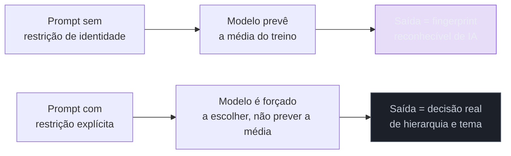

# Estética genérica de IA e como escapar

> [!warning] Nota perecível — escrita em 2026-07-29
> O "fingerprint" descrito aqui é uma foto de 2026 — o padrão estatisticamente seguro do treino muda conforme os modelos são retreinados e o próprio mercado reage ao slop. Revalide se a descrição visual abaixo ainda bate com o que você está vendo antes de citar como atual; e revalide o estado da skill Hallmark (estrelas, manutenção) antes de citar o número abaixo.

> [!abstract] TL;DR
> Um LLM que gera UI converge para o padrão estatisticamente "seguro" do treino — o que é reconhecível como **fingerprint de IA**: fonte Inter, gradiente roxo→azul no hero, três cards arredondados em linha (ícone + título + descrição), dark mode que ninguém pediu. A causa raiz não é falta de capacidade técnica do modelo — é que "clean e moderno" é o resultado de **nenhuma decisão de design ter sido tomada**, e nenhuma decisão é exatamente o que a média estatística do treino produz por padrão. A saída: forçar decisão explícita de hierarquia, tema e restrição — seja via prompt manual, seja via ferramenta que já embute essa disciplina, como a skill open-source **Hallmark** (MIT, ~19,6 mil estrelas no GitHub no momento desta nota) ou a skill nativa `frontend-design` do ambiente Claude Code do usuário.

Peça a três LLMs diferentes, em três sessões separadas, para "criar a landing page de um SaaS de produtividade". As três saídas, com alta probabilidade, vão compartilhar: um hero com gradiente roxo para azul, título em fonte Inter com peso bold, um botão CTA arredondado na cor de destaque, e logo abaixo três cards com ícone, título e uma frase — "Rápido", "Seguro", "Fácil de usar" ou variações disso. Nenhuma dessas telas é tecnicamente quebrada. O contraste passa, o layout responde, o código roda. E ainda assim, qualquer pessoa que já navegou a internet em 2026 reconhece a tela instantaneamente como "gerada por IA" — não porque tenha um defeito visível, mas porque é **exatamente igual a mil outras telas geradas pelo mesmo processo**. Esse reconhecimento instantâneo tem nome no jargão do vibe coding: **AI slop**.

## A causa raiz: "clean e moderno" é o default de nenhuma decisão

Um modelo de linguagem generativo, ao gerar código de interface, está fazendo uma previsão estatística do que "uma boa landing page" parece, baseada em tudo que ele viu no treino. O problema é que a maior parte do treino de UI moderna converge para um subconjunto pequeno de padrões — porque esses padrões são os mais replicados, os mais fáceis de copiar, os mais "seguros" no sentido de nunca serem obviamente errados. Quando você não dá ao modelo nenhuma restrição de identidade visual específica, ele não está "sendo preguiçoso" — está fazendo exatamente o que foi otimizado para fazer: prever a média do que "parece profissional" no seu conjunto de treino. **"Clean e moderno" não é uma decisão de design — é o resultado de nenhuma decisão ter sido tomada**, e essa é a tese central desta nota.

A mesma dinâmica acontece do lado da geração de imagem — o modelo converge para o composicionalmente seguro (rosto centralizado, iluminação uniforme, paleta neutra) na ausência de instrução específica — e por isso a [[03-Dominios/Tecnologia/IA/Image Prompting/index|disciplina de Image Prompting]] deste vault trata exatamente do mesmo problema, só que no domínio visual de imagem em vez de UI: a [[03-Dominios/Tecnologia/IA/Image Prompting/01 - Image prompting como engenharia|nota 01 daquele galho]] já nomeia que tratar geração como "arte" (sem especificação, sem critério de aceite) é o que produz esse tipo de saída difusa. Esta nota é a mesma raiz aplicada à interface: o antídoto não é "pedir de novo" — é dar ao modelo uma restrição que substitua o vácuo de decisão que ele preenche com o padrão médio.

## O fingerprint reconhecível, em 2026

Os sinais mais citados do fingerprint de IA generativa em UI, no momento desta nota: fonte **Inter** (ou equivalentes visualmente indistinguíveis) como default quase universal; **gradiente roxo→azul** no hero — tão comum que já virou piada recorrente entre quem constrói com essas ferramentas; **três cards arredondados em linha**, cada um com ícone + título + descrição curta, quase sempre em número exato de três; e **dark mode implementado sem ninguém ter pedido**, porque "produto moderno tem dark mode" é outro padrão estatisticamente seguro do treino.

Nenhum desses elementos é errado isoladamente — um gradiente roxo pode ser a escolha certa para uma marca específica. O problema é a **ausência de intencionalidade**: o sinal de slop não é "usa gradiente", é "usa gradiente porque é o default estatístico, não porque uma decisão de marca escolheu aquela cor especificamente". A [[03-Dominios/Engenharia/UX/Linguagem Visual e Design System/26 - Hierarquia visual|nota 26 do SG5]] já trata do sintoma gêmeo desse problema do lado da hierarquia: quando nenhuma decisão de "qual elemento importa mais" é tomada, o resultado visual é telas onde tudo grita com o mesmo volume — a UI genérica de IA costuma falhar exatamente por essa razão, não só pela paleta repetida. Os três cards uniformes, todos do mesmo tamanho, mesma cor, mesmo peso, são um sintoma direto de hierarquia zero: literalmente nenhuma decisão sobre qual dos três importa mais foi tomada, porque nenhuma foi pedida.

## Como escapar: forçar decisão, não pedir "mais criatividade"

Pedir para o modelo "ser mais criativo" ou "menos genérico" raramente funciona — porque a saída genérica não é falta de criatividade, é falta de **restrição**. O antídoto real tem três formas, da mais manual à mais automatizada:

1. **Restrição de identidade explícita no prompt** — nomear uma paleta específica com valores reais (não "azul moderno", mas os hex/OKLCH exatos), uma fonte específica que não seja a default óbvia, e uma decisão de hierarquia explícita ("este é o único elemento com cor de destaque nesta tela"). Isso é trabalho manual, mas funciona porque preenche o vácuo de decisão que o modelo preenche sozinho.
2. **Skill dedicada — Hallmark** — um projeto open-source (MIT, GitHub, por Nutlope) que existe especificamente para resolver esse problema em agentes de codificação (Claude Code, Cursor, Codex). Segundo a descrição do próprio repositório, a skill escolhe uma macroestrutura para o briefing, aplica um de vinte temas predefinidos, roda uma bateria de "cinquenta e sete testes anti-slop" mais uma autocrítica antes de entregar o resultado, e "recusa os defaults on-distribution nos quais todo LLM foi treinado" — uma forma direta de dizer, em código, exatamente a tese desta nota. No momento desta nota, o repositório tem **cerca de 19,6 mil estrelas** no GitHub — número bem acima do que a pesquisa preliminar desta nota havia estimado (~1,8 mil), o que por si só é um bom lembrete de como esse tipo de dado muda rápido; **revalide antes de citar**.
3. **Skill nativa `frontend-design`** — já presente no ambiente Claude Code do usuário deste vault, com o objetivo explícito de produzir interface distintiva e de qualidade de produção, evitando a estética genérica de IA. Serve o mesmo propósito da Hallmark, sem depender de instalação externa.

> [!question]- Se a skill já resolve isso automaticamente, por que aprender a causa raiz?
> Porque a skill aplica a correção — ela não te ensina a reconhecer quando a correção falhou. Um tema predefinido de vinte opções ainda pode ser aplicado de um jeito genérico se o briefing original não tiver nenhuma restrição de identidade real por trás. Entender que o problema é "ausência de decisão", não "ferramenta ruim", é o que permite auditar a saída de qualquer skill — inclusive a Hallmark — e perceber quando ela também caiu no padrão médio, em vez de aceitar cegamente porque "usei a ferramenta certa".

## Praticável sozinho vs. exige mais estrutura

Aplicar restrição explícita de identidade visual — paleta com valores reais, fonte fora do default, uma decisão clara de hierarquia — é inteiramente praticável por uma pessoa, em minutos, antes de qualquer geração. Instalar e usar uma skill como Hallmark ou `frontend-design` também é fluxo de uma pessoa só, sem depender de ninguém.

O que exige mais estrutura — de novo, não um time, mas **disciplina de revisão que sozinho é fácil de pular** — é auditar sistematicamente a saída contra um checklist anti-slop antes de aceitar como final, em vez de aprovar visualmente "porque já usei a skill certa". A skill reduz a probabilidade de slop; não elimina a necessidade de revisão humana do resultado.

## Casos práticos

### Cenário 1: o SaaS que "parecia bom" até ser comparado com o concorrente
Um engenheiro solo gera a landing page do próprio produto com um prompt genérico ("crie uma landing page moderna para um SaaS de gestão de projetos"), sem nenhuma restrição de identidade. O resultado parece profissional isoladamente — até o cliente mandar o link junto com o de um concorrente, e ambos terem exatamente o mesmo hero com gradiente roxo-azul e os mesmos três cards. **O que deu errado:** o prompt não deu ao modelo nenhuma âncora de identidade de marca — o modelo preencheu o vácuo com o padrão médio do treino, que é o mesmo padrão médio que o concorrente também recebeu ao fazer um pedido parecido. **Correção específica:** reescrever o prompt com paleta de marca real (valores hex/OKLCH específicos), uma fonte que não seja a default, e uma frase explícita de hierarquia ("o CTA de assinatura é o único elemento com cor de destaque na dobra inicial") — a mesma disciplina que a [[03-Dominios/Tecnologia/IA/Image Prompting/01 - Image prompting como engenharia|nota 01 de Image Prompting]] aplica à geração de imagem.

### Cenário 2: a skill instalada, mas o briefing continuou vazio
Um engenheiro instala a skill Hallmark, mas continua pedindo "crie uma página de produto legal" sem preencher o briefing com informação real de marca ou público. A skill escolhe um dos vinte temas predefinidos e passa nos 57 testes anti-slop — mas o tema escolhido, sem contexto de marca real, ainda parece genérico, só que um "genérico diferente" do fingerprint padrão de IA. **O que deu errado:** a skill resolve o problema de "cair no fingerprint mais óbvio", não o problema de "briefing vazio não tem decisão real por trás". **Correção específica:** tratar o briefing de entrada da skill com o mesmo cuidado de uma especificação de produto real — paleta, tom de voz, público, o que a marca quer comunicar — em vez de um pedido genérico de uma frase.

### Cenário 3: aceitar a saída sem checar hierarquia
Um engenheiro usa a skill `frontend-design` para gerar um dashboard, e a paleta sai visivelmente diferente do padrão de IA — cores de marca aplicadas, sem gradiente roxo. Ele aprova o resultado sem checar mais nada. Mas a tela ainda tem três botões de ação com o mesmo peso visual competindo pela atenção do usuário — o mesmo erro estrutural da [[03-Dominios/Engenharia/UX/Linguagem Visual e Design System/26 - Hierarquia visual|nota 26 do SG5]], só que sem o sintoma de cor que faria alguém desconfiar. **O que deu errado:** evitar o fingerprint de cor não é o mesmo que ter hierarquia — os dois problemas são independentes, e resolver um não resolve o outro automaticamente. **Correção específica:** aplicar a checagem de hierarquia da nota 26 (uma ação primária dominante por tela, nunca dois botões preenchidos competindo) como item separado de revisão, mesmo depois que a paleta já não parece mais "de IA".

## Armadilhas comuns

> [!warning] Confundir "não parece genérico" com "tem decisão de verdade"
> **O que acontece:** uma tela evita os sinais mais óbvios do fingerprint (sem gradiente roxo, sem Inter) e é aprovada como "boa", mesmo tendo hierarquia zero por baixo, como no Cenário 3. **Por quê:** os sinais visuais mais citados de slop (cor, fonte) são os mais fáceis de checar a olho — e por isso o problema estrutural mais profundo (hierarquia, decisão de importância) passa despercebido quando a checagem para na superfície. **Como evitar:** tratar "evitar o fingerprint de cor" e "ter hierarquia visual real" como dois itens separados de revisão, nunca um substituindo o outro.

> [!warning] Pedir "mais criatividade" em vez de dar restrição
> **O que acontece:** o engenheiro, insatisfeito com uma saída genérica, reformula o prompt pedindo "seja mais criativo" ou "menos genérico" — e recebe uma variação igualmente genérica, só que com cores diferentes. **Por quê:** "criatividade" não é uma instrução operacional para um modelo que prevê a média estatística — é vago o suficiente para ser preenchido, de novo, com o padrão seguro do treino, só que amostrado de um jeito ligeiramente diferente. **Como evitar:** substituir pedidos vagos por restrições concretas — paleta com valores reais, fonte nomeada, regra explícita de hierarquia — seguindo a Seção "Como escapar" desta nota.

> [!warning] Citar número de estrelas ou métrica de projeto open-source sem revalidar
> **O que acontece:** alguém cita "a Hallmark tem X mil estrelas" numa conversa técnica meses depois de ter checado, sem revalidar. **Por quê:** projetos open-source populares em categorias quentes (como anti-AI-slop, em 2026) crescem rápido — esta própria nota encontrou um número dez vezes maior do que a estimativa da pesquisa que a precedeu, um dia antes. **Como evitar:** tratar métricas de projeto open-source como dado perecível, igual a preço — cheque a fonte (a própria página do repositório) no momento de citar, não confie em memória de leitura anterior.

> [!tip] Assista: How to Avoid AI Slop in Vibe-Coded Landing Pages
> **Canal:** DesignCode | **Duração:** ~22min | **Idioma:** EN (legenda automática) O vídeo compara saídas de diferentes modelos para o mesmo prompt de landing page, apontando ao vivo os sinais de slop — incluindo o gradiente roxo, citado literalmente como "muito 2025" — e demonstra a técnica de gerar imagens customizadas como uma das formas de quebrar o padrão default, reforçando a tese de que a saída melhora quando alguma restrição real é introduzida. Trecho de destaque [1:03]: *"we all know the purple gradient — this is very 2025"* — reconhecimento explícito do fingerprint que esta nota descreve.
>
> 🎬 [Assistir no YouTube](https://www.youtube.com/watch?v=M4DNgmI7MIM)

## Como explicar em inglês

> "AI-generated UI converges on a recognizable fingerprint — Inter font, purple-to-blue gradient hero, three rounded feature cards, unsolicited dark mode — because 'clean and modern' is what a language model produces by default when no real design decision has been made. The fix isn't asking for 'more creativity,' it's giving the model an explicit constraint — a real brand palette, a non-default font, an explicit hierarchy call — that forces it to choose instead of predicting the training average. Tools like the open-source Hallmark skill or my own `frontend-design` skill encode that discipline, but they don't replace reviewing the output against a real checklist."

| PT | EN |
|----|----|
| estética genérica de IA / AI slop | AI slop |
| fingerprint reconhecível | recognizable fingerprint |
| padrão estatisticamente seguro | statistically safe default |
| restrição de identidade | identity constraint |
| checklist anti-slop | anti-slop checklist |
| decisão de hierarquia | hierarchy decision |

## O que vem a seguir

Evitar o fingerprint genérico de IA é a metade "estética" do problema — mas nem toda tela precisa nascer numa ferramenta de geração. A próxima nota trata do caso em que o próprio código, escrito ou orquestrado por você, já é o protótipo mais barato — e por que, para um fullstack sênior, às vezes vale pular a ferramenta de design inteiramente.

- [[03-Dominios/Tecnologia/Ferramentas de Design/06 - Protótipo em código|06 — Protótipo em código]] — quando o componente real é mais barato do que qualquer ferramenta de design.
- [[03-Dominios/Tecnologia/IA/Image Prompting/index|Tecnologia/IA/Image Prompting]] — a mesma causa raiz (convergência para o seguro), aplicada à geração de imagem.

## Fontes

- **Nutlope (GitHub)** — [*hallmark*](https://github.com/Nutlope/hallmark) — skill open-source MIT, ~19,6 mil estrelas no momento desta nota, "anti-AI-slop design skill for Claude Code, Cursor, and Codex".
- **DesignCode (YouTube)** — [*How to Avoid AI Slop in Vibe-Coded Landing Pages*](https://www.youtube.com/watch?v=M4DNgmI7MIM) — comparação de saídas e sinais de slop, usada como mídia desta nota.
- [[03-Dominios/Tecnologia/IA/Image Prompting/01 - Image prompting como engenharia|Tecnologia/IA/Image Prompting, nota 01]] — a mesma causa raiz de convergência estatística, aplicada à geração de imagem.
- [[03-Dominios/Engenharia/UX/Linguagem Visual e Design System/26 - Hierarquia visual|Engenharia/UX SG5, nota 26]] — hierarquia visual como decisão explícita; o sintoma gêmeo do slop do lado da estrutura, não só da cor.
