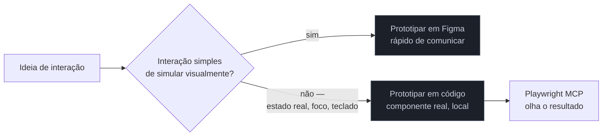

# Protótipo em código

> [!warning] Nota perecível — escrita em 2026-07-29
> O argumento central desta nota (código como protótipo mais barato que ferramenta de design, para certo perfil de engenheiro) é conceitual e envelhece devagar — mas as ferramentas específicas citadas (Playwright MCP, CodePen) mudam de posicionamento com o tempo. Revalide os exemplos, não a tese.

> [!abstract] TL;DR
> Para um fullstack sênior trabalhando sozinho, o protótipo mais barato às vezes **não é uma tela no Figma** — é o próprio componente React rodando local, com um agente olhando o resultado renderizado via [[03-Dominios/Tecnologia/Ferramentas de Design/09 - Loop visual com Playwright MCP e visual regression|Playwright MCP]]. Essa nota é a que mais diverge do fluxo do designer profissional dentro deste galho, e existe justamente por isso: para este leitor, "abrir o Figma" às vezes é o caminho *mais longo*, não o mais curto. O trade-off é honesto, não escondido: protótipo em código custa mais caro de **jogar fora** — e código descartável que ninguém descarta vira dívida técnica disfarçada de decisão de produto.

Um engenheiro precisa decidir como deveria se comportar um componente de busca com autocomplete — dropdown aparece ao digitar, itens filtram em tempo real, seta para cima/baixo navega, Enter seleciona. É o tipo de interação que a [[03-Dominios/Tecnologia/Ferramentas de Design/01 - Figma para o engenheiro|nota 01]] deste galho já sinalizou como território frágil para simular em ferramenta de design: Figma desenha formas e vetores, não estados reais de foco de teclado. Simular esse comportamento inteiro no Figma — cada estado do dropdown, cada transição de foco — levaria mais tempo do que escrever o componente de verdade, testando a interação real no navegador real. Para esse engenheiro específico, que já sabe programar e já tem o ambiente de desenvolvimento pronto, a pergunta "devo prototipar isso no Figma antes de codificar?" tem uma resposta honesta: não necessariamente — às vezes o componente em código *é* o protótipo.

## Por que o código às vezes é o protótipo mais barato

A razão técnica é estrutural, não de gosto: ferramentas de design trabalham com formas e vetores; a web trabalha com elementos estruturados (`div`s, semântica, estado de foco real). Simular fielmente um comportamento interativo complexo — um combobox com navegação por teclado, um formulário com validação condicional, um drag-and-drop — dentro de uma ferramenta que desenha vetores exige recriar, artificialmente, uma aproximação do que o navegador já faz nativamente. Um designer profissional que domina profundamente essas técnicas de simulação consegue chegar perto; mas o *tempo investido* nessa simulação, para um engenheiro que já sabe escrever o componente real, raramente compensa.

O ganho de prototipar em código, especificamente para esse perfil de leitor:

- **A interação é real, não simulada.** Foco de teclado, estados de hover reais, comportamento de scroll, tudo funciona porque é o navegador de verdade rodando, não uma aproximação desenhada.
- **O feedback loop pode ser automatizado.** Um agente com [[03-Dominios/Tecnologia/Ferramentas de Design/09 - Loop visual com Playwright MCP e visual regression|Playwright MCP]] pode navegar o componente renderizado, capturar o estado via accessibility tree, e iterar — o mesmo ciclo "mudar código → navegar → capturar → avaliar → iterar" que a nota 09 deste galho descreve em profundidade.
- **Não há tradução perdida entre design e implementação.** Não existe handoff, porque não existem dois artefatos — o protótipo já é o código que vai (ou não) para produção.

## O trade-off que não pode ser escondido: código é mais caro de jogar fora

A vantagem de baixa fidelidade em ferramentas de design tradicionais — um wireframe rabiscado, um protótipo de papel — é que ela existe **para ser descartada sem culpa**. Ninguém sente pena de jogar fora dez minutos de rabisco. Um componente React funcional, com estado, hooks, e talvez uma chamada de API mockada, não tem essa mesma leveza psicológica: levou mais tempo para escrever, então cria **pressão real para "aproveitar"** o que já existe, mesmo quando a decisão de produto que motivou o protótipo mudou de direção.

Esse é o ponto que separa "prototipar em código bem feito" de "prototipar em código de um jeito que gera dívida técnica disfarçada de decisão de produto": se o componente escrito como protótipo nunca é revisado com o mesmo rigor de um componente de produção — sem teste, sem revisão de acessibilidade, sem consideração de edge case — e ainda assim acaba indo para produção só porque "já estava funcionando", o protótipo deixou de cumprir seu papel. Baixa fidelidade existe precisamente para ser descartável; código que ninguém descarta porque custou caro demais para jogar fora não é mais baixa fidelidade — é dívida técnica com aparência de atalho.

> [!question]- Isso significa que eu nunca deveria prototipar em código?
> Não — significa que prototipar em código exige uma disciplina extra que prototipar em papel ou Figma não exige: **decidir explicitamente, antes de começar, se aquele código vai ser descartado ou promovido**, e tratar cada caminho de acordo. Se a decisão é "isto pode virar produção", trate como código de produção desde o início — teste, revisão, acessibilidade. Se a decisão é "isto é só para validar a interação", trate como descartável de verdade: sem se apegar à implementação, disposto a reescrever do zero quando a decisão de produto mudar. O erro caro é deixar essa decisão implícita.

## Praticável sozinho vs. exige mais estrutura

Prototipar interações complexas diretamente em código, para um engenheiro que já domina a stack, é totalmente praticável sozinho — de fato, é frequentemente **mais rápido** do que a alternativa de ferramenta de design, exatamente o argumento central desta nota. O mesmo vale para configurar um loop de feedback visual automatizado com Playwright MCP em torno desse protótipo: configuração de uma tarde, sem depender de mais ninguém.

O que exige mais disciplina — de novo, não estrutura de time, mas **rigor que é fácil de negligenciar sob pressão de prazo** — é a decisão consciente de descartar ou promover o protótipo depois. Sem esse rigor, o protótipo em código vira exatamente o problema descrito na seção anterior: dívida técnica que ninguém decidiu ter, só aconteceu porque era mais fácil manter do que apagar.

## Casos práticos

### Cenário 1: o combobox que o Figma nunca teria simulado bem
Um engenheiro precisa decidir o comportamento de navegação por teclado de um combobox de busca com resultados assíncronos. Em vez de tentar simular isso no Figma — o que exigiria construir manualmente um "estado de foco em cada item" como frames separados — ele escreve o componente React real em quinze minutos, com um mock de dados local, e testa a navegação por teclado de verdade no navegador. **Por que funcionou:** a interação depende de comportamento nativo do navegador (foco, teclas de seta, `aria-activedescendant`) que nenhuma ferramenta de design reproduz fielmente sem esforço desproporcional. **Não há correção a fazer aqui** — é o caso de uso central desta nota, incluído para contraste com o Cenário 2.

### Cenário 2: o protótipo "descartável" que virou produção sem revisão
Um engenheiro constrói, em código, um protótipo rápido de um formulário multi-etapa para validar a sequência de perguntas com o cliente. O protótipo funciona, o cliente aprova o fluxo na reunião, e — sob pressão de prazo — o mesmo código do protótipo é promovido direto para produção, sem revisão de acessibilidade nem tratamento de erro de rede. Semanas depois, um usuário reporta que o formulário perde os dados preenchidos se a conexão cai no meio do preenchimento — um caso de borda que o protótipo nunca precisou tratar, porque nunca foi escrito pensando em produção. **O que deu errado:** a decisão implícita de "isso é só para mostrar ao cliente" nunca foi revisitada quando a pressão de prazo tornou tentador reaproveitar o código pronto. **Correção específica:** ao promover qualquer protótipo de código para produção, tratar essa promoção como uma decisão explícita, com o mesmo checklist de revisão que qualquer outro código novo receberia — teste de edge case, acessibilidade, tratamento de erro — em vez de herdar automaticamente a confiança de "já está funcionando".

### Cenário 3: o loop de feedback automatizado que substituiu horas de comparação manual
Um engenheiro está ajustando o espaçamento e o comportamento responsivo de um componente de card em três breakpoints diferentes. Em vez de alternar manualmente entre DevTools, redimensionar a janela e comparar visualmente a cada mudança, ele configura um agente com Playwright MCP para navegar o componente renderizado em cada breakpoint, capturar o estado via accessibility tree, e reportar inconsistências de espaçamento automaticamente a cada iteração de código. **Por que funcionou:** o ciclo "mudar código → navegar → capturar → avaliar → iterar" — detalhado na [[03-Dominios/Tecnologia/Ferramentas de Design/09 - Loop visual com Playwright MCP e visual regression|nota 09]] deste galho — reduziu dezenas de checagens manuais repetitivas a um comando. **Não há correção a fazer aqui** — mas vale registrar o limite: esse loop funciona bem para ajuste fino de um componente já estruturalmente correto; não substitui a decisão inicial de qual interação faz sentido, que ainda é humana.

## Armadilhas comuns

> [!warning] Deixar a decisão "descartar ou promover" implícita
> **O que acontece:** um protótipo em código nasce como experimento e vira produção sem que ninguém tenha decidido conscientemente que isso aconteceria, como no Cenário 2. **Por quê:** código funcional gera apego psicológico — parece "desperdício" jogar fora algo que já roda, mesmo quando esse código nunca foi escrito com o rigor que produção exige. **Como evitar:** decidir explicitamente, no momento de escrever o protótipo, se ele é descartável ou promovível — e documentar essa decisão (mesmo que só num comentário ou na descrição do PR) para que a promoção, se acontecer, seja consciente.

> [!warning] Tentar simular em código interação que seria mais rápida de comunicar em Figma
> **O que acontece:** o engenheiro escreve componentes reais para validar uma decisão puramente visual — paleta, disposição de elementos, hierarquia — que não depende de nenhum comportamento de navegador real. **Por quê:** o argumento desta nota é específico para interação complexa dependente de comportamento nativo (foco, teclado, estado real); para decisão puramente visual, uma ferramenta de design (ou até a [[03-Dominios/Tecnologia/Ferramentas de Design/07 - Excalidraw e tldraw|nota 07]] sobre baixa fidelidade) ainda é mais rápida de iterar e mais barata de descartar. **Como evitar:** aplicar o critério de decisão do diagrama Mermaid desta nota antes de escolher a ferramenta — a pergunta certa é "esta interação depende de comportamento real de navegador?", não "eu sei programar isso rápido?".

> [!warning] Achar que "protótipo em código" dispensa qualquer critério de qualidade
> **O que acontece:** o engenheiro trata todo código de protótipo como isento de qualquer padrão, mesmo sabendo, no fundo, que a chance de ele virar produção é alta. **Por quê:** a pressão de prazo cria um incentivo real para reaproveitar código pronto, e "é só um protótipo" vira desculpa retroativa em vez de decisão prévia. **Como evitar:** se a probabilidade de promoção é alta desde o início, escrever com o rigor de produção desde a primeira linha — a etiqueta "protótipo" só deveria abrir mão de rigor quando o descarte é genuinamente o plano.

> [!tip] Assista: Why I Don't Prototype Interactions in Figma
> **Canal:** James Stone | **Duração:** ~6min07s | **Idioma:** EN (legenda automática) O autor, um designer que também programa, argumenta exatamente o ponto central desta nota a partir do lado oposto do espectro — não como engenheiro fugindo do Figma, mas como designer que reconhece o limite da própria ferramenta para simular interações reais, preferindo prototipar em ambientes de código como CodePen quando o comportamento depende de estado real do navegador. Trecho de destaque [3:21]: *"even if you could [simulate perfectly in Figma], it's diminishing returns — it's not going to provide a lot of value"* — o mesmo argumento de custo-benefício desta nota, vindo de quem defende o Figma na maior parte do tempo.
>
> 🎬 [Assistir no YouTube](https://www.youtube.com/watch?v=eqJNks8ogkQ)

## Como explicar em inglês

> "For interactions that depend on real browser behavior — keyboard focus, real hover states, async data — the code component itself is often the cheapest prototype, faster than trying to simulate that fidelity in a design tool. The honest trade-off: code prototypes are more expensive to throw away than a Figma sketch, so the discipline that matters isn't 'can I build this fast,' it's deciding upfront whether this code is disposable or promotable — and treating each path accordingly, instead of letting deadline pressure quietly promote unreviewed throwaway code into production."

| PT | EN |
|----|----|
| protótipo em código | code prototype |
| baixa fidelidade | low fidelity |
| descartável / promovível | disposable / promotable |
| dívida técnica disfarçada | disguised technical debt |
| comportamento nativo do navegador | native browser behavior |
| loop de feedback | feedback loop |

## O que vem a seguir

Nem toda decisão de interface exige a fidelidade de um componente real rodando — muita coisa se resolve com um rabisco rápido, descartável de verdade. A próxima nota cobre as duas ferramentas mais citadas de baixa fidelidade em 2026, e a diferença entre "desenhar" e "construir com canvas".

- [[03-Dominios/Tecnologia/Ferramentas de Design/07 - Excalidraw e tldraw|07 — Excalidraw e tldraw]] — baixa fidelidade de verdade, e quando ela ainda é a ferramenta certa.
- [[03-Dominios/Tecnologia/Ferramentas de Design/09 - Loop visual com Playwright MCP e visual regression|09 — Loop visual com Playwright MCP e visual regression]] — o ciclo de feedback automatizado que torna o protótipo em código ainda mais barato de iterar.

## Fontes

- **James Stone (YouTube)** — [*Why I Don't Prototype Interactions in Figma*](https://www.youtube.com/watch?v=eqJNks8ogkQ) — argumento de um designer sobre o limite de ferramentas de design para simular interação real; usada como mídia desta nota.
- [[03-Dominios/Tecnologia/Ferramentas de Design/01 - Figma para o engenheiro|Ferramentas de Design, nota 01]] — o limite da simulação visual que motiva esta nota.
- [[03-Dominios/Tecnologia/Ferramentas de Design/09 - Loop visual com Playwright MCP e visual regression|Ferramentas de Design, nota 09]] — o ciclo de feedback que torna o protótipo em código iterável sem esforço manual repetitivo.
