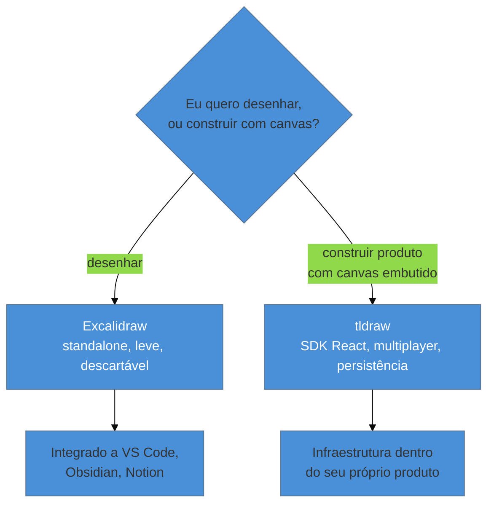

# Excalidraw e tldraw

> [!warning] Nota perecível — escrita em 2026-07-29
> O status de um projeto satélite citado nesta nota — o repositório "Make Real" do tldraw — mudou entre a pesquisa original e a escrita: foi **arquivado em 20/fev/2026**. Revalide qualquer claim sobre features experimentais de IA desses dois produtos antes de repetir.

> [!abstract] TL;DR
> **Excalidraw** e **tldraw** resolvem problemas diferentes, apesar de nascerem visualmente parecidos (estética mão-desenhada, canvas infinito). Excalidraw é uma ferramenta de desenho **standalone** — abra e desenhe, leve, open-source, integrada a VS Code, Obsidian e Notion. tldraw é um **SDK React embutível** — infraestrutura de canvas para você **construir dentro** da sua própria aplicação, com multiplayer sync, persistência e componentes prontos, usado por empresas como Google e Shopify. A pergunta que decide qual usar não é "qual desenha melhor" — é "eu quero desenhar, ou quero construir um produto que tem um canvas dentro dele?".

Um product engineer solo precisa fazer duas coisas em semanas diferentes do mesmo projeto: na primeira, esboçar rapidamente um fluxo de tela para discutir com o cliente numa call — três retângulos, uma seta, dez minutos, descartável assim que a call terminar. Na segunda, seu produto (uma ferramenta de brainstorming colaborativo) precisa de um canvas *dentro* dele — algo que os próprios usuários finais vão desenhar, com sincronização em tempo real entre várias pessoas, persistindo no banco de dados do produto. Usar a mesma ferramenta para as duas tarefas seria um erro categórico: a primeira pede uma folha em branco que se abre em segundos e se descarta sem custo; a segunda pede uma peça de infraestrutura que vai viver dentro do seu código, com estado gerenciado por você, para sempre.

## Excalidraw: a folha de papel digital

Segundo o próprio repositório oficial (GitHub, licença **MIT**), Excalidraw é um "whiteboard virtual open-source", disponível tanto como aplicação web standalone (`excalidraw.com`) quanto como pacote npm (`@excalidraw/excalidraw`) para quem quer embutir a funcionalidade em outra aplicação. A estética mão-desenhada — traços levemente imperfeitos, como se tivessem sido feitos com caneta — não é só decoração: comunica visualmente "isto é um rascunho", o que reduz a chance de alguém confundir um wireframe de baixa fidelidade com um mockup final, um problema comum quando o desenho tem acabamento "digital demais".

O caso de uso central: abrir, desenhar, comunicar, descartar (ou salvar como `.excalidraw`, formato leve baseado em JSON). O produto tem adoção real dentro de outras ferramentas — extensão de VS Code para diagramas de arquitetura direto no editor, integração nativa em Obsidian e Notion para notas e documentação técnica, e clientes institucionais citados no próprio README como Google Cloud, Meta, Notion e CodeSandbox usando o pacote embutido nos próprios produtos.

## tldraw: infraestrutura de canvas para o seu produto

tldraw se descreve, na própria documentação (`tldraw.dev`), como um "Infinite Canvas SDK for React" — não uma aplicação para usar, mas uma **peça de infraestrutura** para construir aplicações que têm canvas dentro delas. A diferença central em relação a Excalidraw: tldraw entrega sincronização multiplayer de nível produção, persistência e otimizações de performance como parte do próprio SDK — "enterprise-grade multiplayer sync, persistence, and performance optimizations" — junto com uma biblioteca de formas, ferramentas e componentes de interface prontos que podem ser customizados ou substituídos. Segundo a própria documentação, o projeto é usado por empresas como Google, Shopify, Autodesk e ClickUp, com **49,4 mil estrelas** no GitHub e média de **341 mil downloads semanais** no npm — números que sinalizam adoção de infraestrutura real, não só curiosidade de projeto pessoal (revalide antes de citar, como qualquer métrica deste galho).

Historicamente, o projeto ficou conhecido fora do nicho de devs de canvas pelo demo **"Make Real"** — um projeto que transformava um sketch desenhado no canvas em uma página web funcional via LLM, usando a própria chave de API do usuário. **Atenção de caducidade:** ao verificar o repositório oficial (`github.com/tldraw/make-real`) para esta nota, ele aparece **arquivado desde 20 de fevereiro de 2026**, e não encontrei confirmação de um sucessor oficial ativo dentro da documentação atual do SDK. Trate "Make Real" como o marco histórico que popularizou a ideia — sketch → LLM → UI funcional — não como uma feature atualmente mantida; se você precisar dessa capacidade hoje, confirme o estado atual antes de depender dela.

> [!question]- Dá pra usar tldraw só para desenhar, como o Excalidraw?
> Tecnicamente sim — tldraw tem uma aplicação de demonstração navegável (`tldraw.com`) que funciona como whiteboard standalone. Mas isso não é o caso de uso para o qual o produto é otimizado nem vendido — a proposta de valor real do tldraw está em ser *embutido*, com controle programático total sobre forma, comportamento e persistência. Se o seu único objetivo é desenhar um diagrama avulso, Excalidraw resolve com menos fricção e sem a complexidade de configuração de um SDK.

## Praticável sozinho vs. exige mais estrutura

Usar Excalidraw para qualquer necessidade de desenho rápido e descartável — esboço de fluxo, diagrama de arquitetura, wireframe de baixa fidelidade para discutir com um cliente — é totalmente praticável sozinho, sem nenhuma configuração além de abrir o site ou instalar a extensão do editor. É, de fato, a ferramenta certa exatamente pela ausência de fricção: se abrir a ferramenta demora mais do que o rabisco em si, ela já falhou no propósito.

Embutir tldraw como peça de infraestrutura dentro de um produto próprio — com sincronização multiplayer, persistência em banco de dados, customização de formas — é trabalho de engenharia real, mas ainda praticável por uma pessoa: a documentação do SDK é pensada para adoção incremental (começar com os defaults, customizar depois), e o exemplo de sync multiplayer roda com poucas linhas de configuração, como mostra a mídia desta nota. O que **de fato** exige mais estrutura é operar essa infraestrutura em escala de produção real — self-hosting do serviço de sync, monitoramento de uptime multiplayer para muitos usuários simultâneos, suporte a múltiplos clientes enterprise — mas isso é o mesmo tipo de decisão de infraestrutura que qualquer feature de produto real enfrentaria em escala, não algo específico de canvas.

## Casos práticos

### Cenário 1: o wireframe de dez minutos que resolveu a call com o cliente
Um engenheiro solo está numa call com um cliente discutindo o fluxo de um formulário de três etapas. Em vez de abrir o Figma — que exigiria configurar frames, componentes, e mais tempo do que a conversa merece — ele abre `excalidraw.com` direto no navegador e desenha três retângulos com setas entre eles enquanto fala, compartilhando a tela. O cliente entende o fluxo imediatamente, o desenho é descartado depois da call. **Por que funcionou:** a decisão certa não foi "qual ferramenta é mais poderosa", foi "qual ferramenta tem menos fricção para o tempo que essa tarefa merece". **Não há correção a fazer** — é o caso de uso central de Excalidraw, incluído para contraste com o Cenário 2.

### Cenário 2: tentar prototipar um canvas colaborativo dentro do Excalidraw
Um engenheiro está construindo um produto de brainstorming em equipe que precisa de um canvas onde múltiplos usuários desenham simultaneamente, com o estado persistindo no banco de dados do produto. Ele tenta usar o pacote npm do Excalidraw como base, mas descobre que precisaria construir do zero toda a camada de sincronização multiplayer e persistência — funcionalidade que o Excalidraw, como ferramenta de desenho, não foi desenhado para fornecer nativamente. **O que deu errado:** confundir "tem pacote npm embutível" com "é infraestrutura de produto pronta para multiplayer" — os dois produtos deste galho têm pacotes npm, mas resolvem categorias de problema diferentes. **Correção específica:** migrar para tldraw, cujo SDK já entrega sincronização multiplayer, persistência e otimização de performance como parte do produto — exatamente a categoria de problema que o Cenário 2 precisa resolver, e que o tldraw foi desenhado para resolver desde a raiz, não como extensão posterior.

### Cenário 3: confiar num recurso experimental já sem manutenção
Um engenheiro planeja construir uma feature de "sketch para código" usando o repositório "Make Real" como base, baseado num tutorial de um ano atrás. Ao clonar o repositório, descobre que ele está arquivado — sem atualização de dependências, sem manutenção ativa, com risco real de vulnerabilidades não corrigidas se usado como está. **O que deu errado:** confiar num tutorial desatualizado sem checar o estado atual do repositório referenciado — o mesmo tipo de erro contra o qual este galho inteiro alerta com o callout de caducidade. **Correção específica:** antes de adotar qualquer projeto satélite de código aberto citado em tutorial, checar a data do último commit e o estado do repositório (arquivado? mantido?) diretamente no GitHub — e, se arquivado, decidir conscientemente entre fazer fork e manter você mesmo, ou reimplementar a ideia com as ferramentas atuais do SDK principal.

## Armadilhas comuns

> [!warning] Escolher pela estética, não pelo caso de uso
> **O que acontece:** alguém escolhe entre Excalidraw e tldraw baseado em qual "parece mais bonito" ou é mais familiar, sem considerar se o objetivo é desenhar avulso ou construir infraestrutura de produto. **Por quê:** os dois têm estética visual próxima o suficiente (canvas infinito, formas simples) para a diferença de propósito passar despercebida até o momento em que a funcionalidade que falta (multiplayer, por exemplo) já é necessária e cara de adicionar depois. **Como evitar:** aplicar a pergunta do diagrama Mermaid desta nota antes de escolher — "eu quero desenhar, ou construir um produto que tem canvas dentro dele" — e tratar a resposta como decisão arquitetural, não estética.

> [!warning] Tratar um SDK de infraestrutura como ferramenta descartável
> **O que acontece:** o engenheiro usa tldraw para um rascunho rápido e descartável, pagando o custo de configuração de um SDK completo para uma tarefa que Excalidraw resolveria em segundos. **Por quê:** a familiaridade com uma ferramenta ("já uso tldraw no meu produto") tenta virar hábito de usar a mesma ferramenta para tudo, mesmo quando o caso de uso não pede a complexidade extra. **Como evitar:** manter as duas ferramentas disponíveis conscientemente, e escolher pela tarefa, não pelo hábito — o custo de abrir uma segunda ferramenta é sempre menor do que o custo de over-engineering um rabisco de dez minutos.

> [!warning] Assumir que um projeto satélite popular continua mantido
> **O que acontece:** um projeto de destaque (como o Make Real) é referenciado meses ou anos depois de sua última atualização, como se ainda estivesse ativo, como no Cenário 3. **Por quê:** popularidade passada não garante manutenção contínua — projetos demonstrativos de recursos experimentais são frequentemente arquivados assim que cumprem o propósito de gerar atenção para o SDK principal. **Como evitar:** checar a data do último commit e o status do repositório (`archived: true` no GitHub é visível no topo da página) antes de basear qualquer decisão de produção nele.

> [!tip] Assista: Excalidraw, my favorite whiteboard / tech diagram app
> **Canal:** Christian Lempa | **Duração:** ~14min25s | **Idioma:** EN (legenda automática) Demonstração prática do Excalidraw como ferramenta standalone, cobrindo as integrações com VS Code, Obsidian e Notion citadas nesta nota — relevante especificamente para quem trabalha dentro de um vault Obsidian, como é o caso deste próprio documento. Trecho de destaque [0:39]: *"it is also integrated in many other tools... you can also use it in note-taking and project management tools like Obsidian and Notion"* — confirma a integração relevante para este vault.
>
> 🎬 [Assistir no YouTube](https://www.youtube.com/watch?v=Gv9MezPAchI)

> [!tip] Assista: tldraw sync — multiplayer whiteboards in React
> **Canal:** tldraw (oficial) | **Duração:** ~2min38s | **Idioma:** EN (legenda automática) Demonstração oficial, feita por um engenheiro de produto do próprio tldraw, mostrando a diferença central desta nota na prática: poucas linhas de código para ir de "canvas isolado" a "canvas multiplayer sincronizado entre dispositivos" — exatamente a capacidade de infraestrutura que separa tldraw de Excalidraw. Trecho de destaque [1:59]: *"now you can see that we actually have a collaborative experience working here — we've got cursors, the contents of the document is synchronized between the two windows"*.
>
> 🎬 [Assistir no YouTube](https://www.youtube.com/watch?v=COw7Wm9HS-g)

## Como explicar em inglês

> "Excalidraw and tldraw look similar — infinite canvas, hand-drawn aesthetic — but solve different problems. Excalidraw is a standalone drawing tool: open it, sketch, done, with solid integrations into VS Code, Obsidian, and Notion. tldraw is an embeddable React SDK — infrastructure for building a product that has a canvas inside it, with production-grade multiplayer sync and persistence baked in. The decision isn't about which one draws better; it's whether I'm drawing something disposable or building canvas infrastructure into my own product."

| PT | EN |
|----|----|
| ferramenta standalone | standalone tool |
| SDK embutível | embeddable SDK |
| sincronização multiplayer | multiplayer sync |
| baixa fidelidade | low fidelity |
| infraestrutura de produto | product infrastructure |
| repositório arquivado | archived repository |

## O que vem a seguir

Desenhar rápido e prototipar em código, como as duas últimas notas mostraram, resolvem a metade "criar a interface" do trabalho. A próxima nota entra na outra metade menos visível, mas igualmente concreta: como organizar os valores de design — cor, espaçamento, tipografia — para que o sistema não vire uma bagunça de números soltos conforme o produto cresce.

- [[03-Dominios/Tecnologia/Ferramentas de Design/08 - Pipeline de tokens|08 — Pipeline de tokens]] — de Figma Variables a CSS custom properties, com Git como fonte de verdade.

## Fontes

- **Excalidraw (GitHub)** — [*excalidraw/excalidraw*](https://github.com/excalidraw/excalidraw) — README oficial: licença MIT, distribuição dupla (app + npm), clientes institucionais citados.
- **tldraw** — [*tldraw.dev*](https://tldraw.dev) — documentação oficial do SDK, métricas de adoção (estrelas, downloads npm), clientes citados.
- **tldraw (GitHub)** — [*tldraw/make-real*](https://github.com/tldraw/make-real) — repositório arquivado em 20/02/2026, consultado para confirmar o estado atual.
- **Christian Lempa (YouTube)** — [*Excalidraw, my favorite whiteboard / tech diagram app*](https://www.youtube.com/watch?v=Gv9MezPAchI) — demonstração prática, usada como mídia desta nota.
- **tldraw (canal oficial, YouTube)** — [*tldraw sync — multiplayer whiteboards in React*](https://www.youtube.com/watch?v=COw7Wm9HS-g) — demonstração oficial de sync multiplayer, usada como mídia desta nota.
