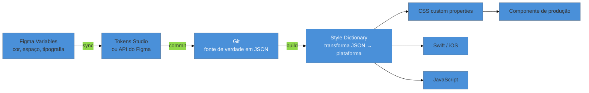

# Pipeline de tokens

> [!warning] Nota perecível — escrita em 2026-07-29
> Ferramentas de sincronização de tokens (Tokens Studio, APIs de plugin do Figma) mudam de superfície de configuração com frequência. Revalide os passos de setup antes de segui-los ao pé da letra — a arquitetura conceitual desta nota envelhece bem mais devagar que os detalhes de UI de cada ferramenta.

> [!abstract] TL;DR
> O pipeline concreto que leva um valor de design do Figma até o CSS em produção tem uma forma típica: **Figma Variables → sincronização (via plugin como Tokens Studio, ou a API de Enterprise do Figma) → Git como fonte de verdade → Style Dictionary transformando o JSON em saída de plataforma (CSS custom properties, Sass, Swift, etc.) → consumido no código do componente**. O formato JSON que atravessa esse pipeline segue a especificação do **W3C Design Tokens Community Group (DTCG)** — que é **Community Group Report, não padrão W3C** — a mesma precisão que a [[03-Dominios/Engenharia/UX/Linguagem Visual e Design System/29 - Design tokens como sistema|nota 29 do SG5]] já exige, e que esta nota mantém consistente. Figma, Sketch e Penpot implementam o mesmo formato, o que permite mover tokens entre ferramentas sem script de transformação customizado.

Um time (ou um engenheiro solo cuidando de várias telas) muda a cor de "sucesso" no Figma — um ajuste pontual de contraste, dez segundos de trabalho no painel de variables. Duas semanas depois, um QA reporta que a cor de sucesso na tela de checkout continua diferente da cor de sucesso na tela de cadastro, mesmo depois do ajuste. A causa: o valor mudou no Figma, mas nada conectava esse arquivo ao CSS que o produto realmente usa — alguém tinha, meses atrás, copiado o hex à mão para uma variável CSS, e esse valor nunca soube que a fonte original mudou. O problema não é falta de disciplina de nomenclatura (a [[03-Dominios/Engenharia/UX/Linguagem Visual e Design System/29 - Design tokens como sistema|nota 29 do SG5]] já cobre a arquitetura de camadas que evita token soup) — é a ausência de um **pipeline** que propague a mudança automaticamente de onde ela nasce até onde ela é consumida. Esta nota é sobre esse pipeline: a peça de infraestrutura concreta que falta no cenário acima.

## O pipeline, passo a passo

**1. Figma Variables** — a origem do valor, definida pelo designer no arquivo de design, exatamente como a [[03-Dominios/Tecnologia/Ferramentas de Design/01 - Figma para o engenheiro|nota 01]] deste galho ensinou a ler.

**2. Sincronização** — o passo que move o valor de dentro do Figma para fora dele, em formato de arquivo (tipicamente JSON). Duas rotas comuns: o plugin **Tokens Studio** (leitura e escrita bidirecional entre o Figma e um repositório Git), ou, para contas Enterprise do Figma, a **Variables REST API** oficial, consumida por uma automação própria (ex: uma GitHub Action que extrai o arquivo e grava no repositório).

**3. Git como fonte de verdade** — uma vez fora do Figma, o JSON de tokens vive versionado como qualquer outro artefato de código: histórico de mudança, revisão por pull request, possibilidade de reverter. Esse é o ponto que transforma "um designer mudou uma cor" de um evento invisível em um commit rastreável.

**4. Style Dictionary** — a ferramenta de build mais citada do ecossistema, que lê o JSON de tokens e gera saída específica de cada plataforma: CSS custom properties, Sass, Swift/iOS, Android, ou qualquer formato customizado que o time precise. Segundo a documentação oficial do projeto, ele permite "exportar seus design tokens para qualquer plataforma — iOS, Android, CSS, JS, HTML, arquivos Sketch, documentação de estilo, ou o que você conseguir imaginar" — e mantém compatibilidade com a especificação do Design Tokens Community Group.

**5. Consumo no componente** — o CSS gerado (ou o equivalente de outra plataforma) entra no pipeline de build normal do produto, e o componente de produção consome a custom property gerada, nunca um valor hardcoded. A mecânica de como uma custom property funciona em CSS puro — herança, escopo, leitura via JavaScript — já está coberta em [[03-Dominios/Tecnologia/CSS/07 - Custom properties e design tokens|CSS/07]]; esta nota não repete essa mecânica, só mostra de onde o valor que acaba numa custom property realmente vem.

## O formato que atravessa o pipeline: DTCG, com a mesma precisão da nota 29

O JSON que trafega por esse pipeline inteiro segue, tipicamente, a especificação do **Design Tokens Community Group (DTCG)**, hospedada no W3C — sintaxe `$value`/`$type`, com referências entre chaves (`{color.brand.500}`) para expressar a hierarquia primitivo → semântico. A [[03-Dominios/Engenharia/UX/Linguagem Visual e Design System/29 - Design tokens como sistema|nota 29 do SG5]] já trata esse formato com um callout de precisão que esta nota mantém integralmente: a especificação **atingiu primeira versão estável em outubro de 2025**, mas é um **Community Group Report — não um padrão formal do W3C Standards Track**. Chamar de "padrão W3C" sem essa qualificação é o mesmo tipo de imprecisão que a nota 29 já sinaliza como erro técnico audível numa conversa sênior.

O ganho prático de um formato compartilhado, independente de padronização formal: **Figma, Sketch e Penpot implementam o mesmo formato de token**, o que significa que mover um arquivo de tokens entre essas ferramentas — por exemplo, numa migração de design system — não exige um script de transformação customizado para cada par de ferramentas. É a mesma motivação original que levou aos design tokens em primeiro lugar (fonte única, múltiplas plataformas), aplicada agora também entre ferramentas de design, não só entre plataformas de código.

> [!question]- Por que não pular direto de Figma para CSS, sem o passo intermediário do Git?
> Porque sem o Git como parada intermediária, você perde exatamente o que resolve o cenário de abertura desta nota: rastreabilidade e revisão. Uma automação que vai direto de Figma para CSS em produção, sem passar por um commit revisável, propaga qualquer mudança — incluindo uma acidental — direto para produção sem checkpoint. O Git no meio do pipeline não é burocracia; é o mesmo motivo pelo qual código não vai direto do editor para produção sem passar por revisão.

## Praticável sozinho vs. exige mais estrutura

Configurar esse pipeline do zero, para um design system pequeno a médio — algumas dezenas a poucas centenas de tokens, uma única plataforma de saída (CSS) — é trabalho de configuração que uma pessoa consegue fazer numa tarde: instalar o Tokens Studio, configurar a sincronização com um repositório Git, escrever uma configuração básica de Style Dictionary apontando para saída CSS. É, inclusive, o tipo de investimento que se paga rápido — a primeira vez que um ajuste de cor se propaga automaticamente para produção sem edição manual, o pipeline já justificou o tempo de setup.

O que exige mais estrutura de verdade é operar esse pipeline **em múltiplas plataformas simultâneas em produção** — gerar saída para CSS, iOS nativo e Android nativo ao mesmo tempo, com testes de regressão garantindo que uma mudança de token não quebra nenhuma plataforma silenciosamente, e um processo formal de revisão para quem pode propor mudanças de token. Isso só se justifica quando o produto realmente tem múltiplas plataformas nativas consumindo o mesmo design system — para um produto web único, formalizar todo esse aparato de build multi-plataforma é complexidade adiantada demais, o mesmo alerta que a [[03-Dominios/Engenharia/UX/Linguagem Visual e Design System/29 - Design tokens como sistema|nota 29 do SG5]] já registra. Style Dictionary como ferramenta de build, em si, tem espaço para uma nota mais profunda de configuração e customização em [[03-Dominios/Tecnologia/Tooling e Build/index|Tecnologia/Tooling e Build]] — aqui, o interesse é o pipeline concreto que a conecta ao Figma de um lado e ao CSS do outro, não a ferramenta isoladamente.

## Casos práticos

### Cenário 1: a cor que mudou no Figma e nunca chegou ao CSS
Exatamente o cenário de abertura desta nota: um ajuste de cor de sucesso no Figma nunca se propaga para o CSS de produção, porque o valor tinha sido copiado à mão meses antes, sem nenhuma conexão automatizada entre os dois lados. **O que deu errado:** ausência total de pipeline — o valor de design e o valor de código eram dois artefatos independentes que só coincidiam por acaso, na origem. **Correção específica:** configurar Tokens Studio (ou a API de Variables, em contas Enterprise) para sincronizar automaticamente o arquivo de tokens do Figma para um repositório Git, e rodar Style Dictionary como parte do build — de forma que qualquer mudança futura no Figma vire, no máximo, um pull request automatizado a revisar, nunca um valor esquecido.

### Cenário 2: o pipeline que quebrou silenciosamente numa migração de ferramenta
Um time migra de Figma para Penpot num projeto de redução de custo de licenciamento, e assume que o pipeline de tokens continuaria funcionando sem mudanças, porque "os dois usam o mesmo formato de token". A automação que sincronizava especificamente com a API de Variables do Figma para de funcionar, porque foi escrita contra uma API específica do Figma, não contra o formato JSON em si. **O que deu errado:** o formato compartilhado (DTCG) garante que o *conteúdo* do arquivo de tokens seja portável — não garante que a *automação de sincronização*, escrita contra uma API proprietária específica, também seja. **Correção específica:** ao planejar uma migração de ferramenta de design, separar explicitamente "o formato de token é portável" (verdade) de "minha automação de sync é portável" (falso, na maioria dos casos) — e orçar tempo para reescrever a camada de sincronização, não só para exportar o JSON.

### Cenário 3: o token novo criado sem passar pelo pipeline
Um designer, sob pressão de prazo, cria um valor de cor direto no CSS de produção para resolver um problema visual urgente, sem passar pelo Figma nem pelo pipeline — "depois eu formalizo isso como token". Seis meses depois, ninguém lembra que esse valor específico não tem origem rastreável no design system, e uma auditoria de tokens (como a do Cenário 1 da nota 29 do SG5) encontra esse valor como mais um candidato a "token soup" sem hierarquia declarada. **O que deu errado:** o atalho de emergência nunca foi revisitado — "depois eu formalizo" raramente acontece sem um lembrete estruturado. **Correção específica:** tratar qualquer valor de design adicionado fora do pipeline como dívida técnica explicitamente rastreada (um item de backlog, não só uma boa intenção), e revisar esses valores na próxima vez que o design system passar por manutenção — a mesma disciplina de "resolver a sangria primeiro" que a nota 29 do SG5 recomenda para token soup em geral.

## Armadilhas comuns

> [!warning] Confundir "mesmo formato" com "mesma automação"
> **O que acontece:** um time assume que trocar de ferramenta de design (Figma para Sketch ou Penpot) não vai quebrar o pipeline de tokens, porque as três implementam o mesmo formato DTCG, como no Cenário 2.
> **Por quê:** o formato compartilhado garante portabilidade do *conteúdo* — não da *automação de sincronização* específica que foi escrita contra a API de uma ferramenta em particular.
> **Como evitar:** ao migrar de ferramenta de design, tratar a camada de sincronização como algo a reescrever, não a herdar automaticamente.

> [!warning] Chamar DTCG de "padrão W3C" sem qualificação
> **O que acontece:** alguém descreve o formato de tokens que atravessa o pipeline como "padrão oficial do W3C" numa conversa técnica.
> **Por quê:** a especificação é mantida por um Community Group, não por um Working Group no Standards Track — a distinção formal é real, e a [[03-Dominios/Engenharia/UX/Linguagem Visual e Design System/29 - Design tokens como sistema|nota 29 do SG5]] já trata isso como erro audível em entrevista técnica sênior.
> **Como evitar:** usar a formulação precisa — "formato consolidado pelo Design Tokens Community Group, hospedado no W3C, primeira versão estável em outubro de 2025" — sempre que o assunto surgir, mantendo consistência com o resto do domínio.

> [!warning] Criar token fora do pipeline "temporariamente"
> **O que acontece:** um valor de design entra em produção direto no código, sem passar pelo Figma nem pelo pipeline de sincronização, como atalho de emergência, e nunca é formalizado depois, como no Cenário 3.
> **Por quê:** "depois eu formalizo" é uma promessa fácil de fazer sob pressão e fácil de esquecer sem nenhum lembrete estruturado — o token fica invisível para qualquer auditoria futura do design system.
> **Como evitar:** registrar imediatamente qualquer token criado fora do pipeline como item de dívida técnica rastreável, não como nota mental.

> [!tip] Assista: Figma Tip — Syncing variables to code
> **Canal:** Figma (oficial) | **Duração:** ~2min | **Idioma:** EN (legenda automática)
> Demonstração oficial e direta dos três passos que esta nota descreve como pipeline: mudança de variable no Figma, sincronização via Variables API + Style Dictionary, e propagação para o ambiente de desenvolvimento local — com exemplo real gerando saída simultânea em CSS, iOS e JavaScript a partir da mesma fonte.
> Trecho de destaque [1:25]: *"I'm able to see all of my primitives but also my semantic layer, which is pointing at the primitives"* — confirmação visual, em código gerado real, da hierarquia primitivo→semântico que a nota 29 do SG5 descreve conceitualmente.
>
> 🎬 [Assistir no YouTube](https://www.youtube.com/watch?v=7gMOTX4f4rc)

## Como explicar em inglês

> "The concrete pipeline that takes a design value from Figma to production CSS looks like this: Figma Variables sync to a JSON file via Tokens Studio or the Variables API, that JSON lives in Git as the source of truth, Style Dictionary transforms it into platform output — CSS custom properties, Swift, whatever — and the component consumes the generated output, never a hardcoded value. The token format itself follows the W3C Design Tokens Community Group spec, which is a Community Group Report, not a ratified W3C standard — a distinction worth getting right in a senior conversation."

| PT | EN |
|----|----|
| pipeline de tokens | token pipeline |
| fonte de verdade | source of truth |
| ferramenta de build | build tool |
| sincronização bidirecional | two-way sync |
| Community Group Report | Community Group Report |
| dívida técnica rastreada | tracked technical debt |

## O que vem a seguir

Com valores de design fluindo de forma confiável do Figma até o CSS, a última peça deste galho fecha o ciclo do lado oposto: como um agente de IA verifica, visualmente, se a implementação bateu com a intenção — usando o navegador como olho, não como suposição.

- [[03-Dominios/Tecnologia/Ferramentas de Design/09 - Loop visual com Playwright MCP e visual regression|09 — Loop visual com Playwright MCP e visual regression]] — o agente checando visualmente o que este pipeline entregou.

## Fontes

- **Style Dictionary** — [*styledictionary.com*](https://styledictionary.com) — descrição oficial da ferramenta de build e compatibilidade com o formato DTCG.
- **Figma (canal oficial, YouTube)** — [*Figma Tip: Syncing variables to code*](https://www.youtube.com/watch?v=7gMOTX4f4rc) — demonstração oficial do pipeline Figma Variables → API → Style Dictionary → código; usada como mídia desta nota.
- [[03-Dominios/Engenharia/UX/Linguagem Visual e Design System/29 - Design tokens como sistema|Engenharia/UX SG5, nota 29]] — a arquitetura de camadas (primitivo/semântico/componente) e a precisão sobre o status do DTCG, mantida consistente por esta nota.
- [[03-Dominios/Tecnologia/CSS/07 - Custom properties e design tokens|Tecnologia/CSS, nota 07]] — a mecânica de custom properties em CSS puro, ponto de chegada deste pipeline.
