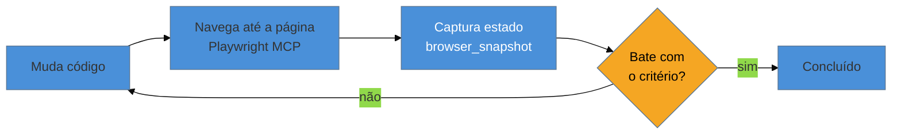

# Loop visual com Playwright MCP e visual regression

> [!warning] Nota perecível — escrita em 2026-07-29
> Números de marketing de plataformas de visual regression (redução de tempo de review, taxa de falso positivo) mudam de campanha para campanha e são alegações de fornecedor — esta nota deliberadamente não os cita como fato. Revalide qualquer claim de performance de ferramenta antes de repetir em contexto técnico sério.

> [!abstract] TL;DR
> Em 2026, o padrão "screenshot-driven iteration" se consolidou: um agente muda código, navega até a página, captura o estado, avalia contra um critério, e itera — fechando um loop que antes exigia um humano alternando entre editor e navegador. O ponto técnico que dá densidade a esta nota: usar a **accessibility tree** via `browser_snapshot` do Playwright MCP é estruturalmente melhor do que screenshot de pixels — o agente recebe a página como **dado estruturado** (DOM/árvore semântica), sem precisar "OCRar" onde fica um botão a partir de uma imagem. Para visual regression formal, existem duas famílias: **plataformas cloud com AI-diffing** (Percy, Applitools, Chromatic) e **bibliotecas dev-owned** (Playwright, Cypress, BackstopJS). Para quem trabalha sozinho e já usa Playwright, a rota de menor atrito é ficar no snapshot nativo em vez de adotar uma plataforma cloud paga.

Um engenheiro pede a um agente de IA para ajustar o espaçamento de um card até que ele "pareça certo" comparado a um mockup de referência. Sem nenhuma ferramenta de visão, o agente muda o CSS, mas não tem como saber se o resultado bateu com a intenção — ele está trabalhando às cegas, apostando que a mudança de `padding: 12px` para `padding: 16px` foi suficiente. Com um agente capaz de navegar até a página renderizada e capturar o estado real, o mesmo pedido vira um loop fechado: mudar, navegar, observar, comparar, ajustar de novo — o mesmo ciclo que um desenvolvedor humano faz manualmente, olhando o DevTools a cada mudança, só que automatizado. Essa nota é sobre como esse loop funciona tecnicamente bem, e por que a forma como o agente "olha" a página importa tanto quanto o fato de ele conseguir olhar.

## O ciclo: mudar, navegar, capturar, avaliar, iterar

O padrão que consolidou em 2026 para agentes de codificação trabalhando com interface visual segue uma sequência simples, repetida até o critério de aceite ser satisfeito:

Esse ciclo é a fatia deste galho que diverge mais do que a [[03-Dominios/Tecnologia/Testes JS/14 - Playwright além do básico|nota 14 de Testes JS]] cobre: lá, Playwright é ferramenta de **teste** — `toHaveScreenshot()` compara pixel a pixel para pegar regressão, `storageState` reutiliza autenticação, componentes rodam em browser real em vez de jsdom. Aqui, Playwright vira **olho do agente de design** durante o desenvolvimento ativo, antes de qualquer suíte de teste formal existir — o mesmo motor, usado num momento diferente do ciclo de vida do código, com um propósito diferente (guiar iteração, não certificar regressão).

## O ponto técnico central: accessibility tree, não pixel

A diferença que dá densidade real a esta nota, e não só repete "agente vê a tela": o **Playwright MCP** oferece a ferramenta `browser_snapshot`, que captura a **árvore de acessibilidade** da página, não uma imagem de pixels. Segundo o próprio repositório oficial do projeto (`microsoft/playwright-mcp`), essa ferramenta é explicitamente descrita como "melhor do que screenshot" — usa "a árvore de acessibilidade do Playwright, não input baseado em pixels", é "amigável para LLM: nenhum modelo de visão necessário, opera puramente sobre dado estruturado", e essa abordagem "evita a ambiguidade comum em abordagens baseadas em screenshot".

Três consequências práticas dessa escolha de design:

- **Nenhum modelo de visão é necessário** — o agente não precisa "olhar" uma imagem e inferir o que é um botão versus um texto; ele recebe a estrutura semântica diretamente, o mesmo tipo de árvore que um leitor de tela consumiria.
- **Interação determinística** — clicar "no botão Salvar" via accessibility tree é preciso (o agente sabe exatamente qual nó é o botão); clicar via coordenadas de pixel inferidas de uma screenshot é uma aposta, sujeita a erro se o layout mudar um pixel entre a captura e a ação.
- **Eficiência de tokens** — uma árvore de acessibilidade em texto consome muito menos tokens do que uma imagem, permitindo que o agente trabalhe com um contexto mais enxuto por iteração — relevante quando o loop da seção anterior roda várias vezes em sequência.

> [!question]- Se accessibility tree é melhor, screenshot nunca serve para nada nesse fluxo?
> Serve, mas para um propósito diferente: a accessibility tree resolve **interação e verificação estrutural** ("este elemento existe, tem este papel, este texto"), mas não captura **aparência visual pura** — um problema de contraste de cor, uma sombra mal aplicada, ou um alinhamento visual sutil não aparecem na árvore semântica, porque não são propriedades de acessibilidade. Para esses casos, uma captura de pixel (screenshot) ainda é necessária — é exatamente o papel que a `toHaveScreenshot()` da [[03-Dominios/Tecnologia/Testes JS/14 - Playwright além do básico|nota 14 de Testes JS]] cumpre. O ponto desta nota não é "pixel nunca serve" — é que, para o loop de **iteração ativa** de um agente mudando código, a árvore estruturada é o canal mais rápido e mais confiável na maior parte das checagens, reservando pixel para o que só pixel resolve.

## Visual regression: duas famílias, e qual escolher sozinho

Visual regression — detectar automaticamente quando uma mudança de código altera a aparência renderizada de forma não intencional — tem duas famílias de ferramentas em 2026:

**Plataformas cloud com AI-diffing**: **Percy** (BrowserStack), **Applitools** (usa aprendizado de máquina para ignorar diferenças de renderização insignificantes, como antialiasing), **Chromatic** (referência para times orientados a Storybook — cada story vira automaticamente um teste visual, com um mecanismo próprio, TurboSnap, para cortar custo de execução comparando só o que mudou). Essas plataformas trazem infraestrutura gerenciada, revisão colaborativa de diffs visuais, e algoritmos de comparação mais sofisticados que ignoram ruído de renderização.

**Bibliotecas dev-owned**: **Playwright** (comparação de screenshot full-page ou de elemento, com suporte nativo cross-browser), **Cypress**, **BackstopJS**. Rodam localmente ou no seu próprio CI, sem depender de um serviço externo, com controle total sobre onde e como os baselines são armazenados.

⚠️ **Sobre números de marketing:** alegações como "redução de X% no tempo de review" ou "Y% menos falsos positivos", comuns em material promocional dessas plataformas cloud, são **alegações de fornecedor** — esta nota deliberadamente não cita nenhuma, porque nenhuma foi verificada de forma independente. Se você encontrar esse tipo de número num material de vendas, trate como ponto de partida para investigação, não como fato a repetir.

**Recomendação para quem trabalha sozinho:** se você já usa Playwright para testes E2E — como a [[03-Dominios/Tecnologia/Testes JS/14 - Playwright além do básico|nota 14]] já ensina — a rota de menor atrito é ficar no snapshot nativo (`toHaveScreenshot()`) em vez de adotar uma plataforma cloud paga. O ganho de uma plataforma com AI-diffing (ignorar ruído de renderização automaticamente, colaboração de revisão) só se paga quando existe um time revisando diffs em volume — para uma pessoa só, mantendo os próprios baselines localmente, a ferramenta que você já tem instalada resolve o problema sem introduzir uma dependência nova.

## Praticável sozinho vs. exige mais estrutura

Configurar o loop de mudar-navegar-capturar-avaliar-iterar com Playwright MCP é inteiramente praticável por uma pessoa: a ferramenta já vem pronta, a configuração é local, e o ganho aparece imediatamente na primeira sessão de ajuste fino de CSS guiado por agente. Manter baselines de visual regression com a biblioteca Playwright nativa, revisando diffs manualmente antes de aceitar uma mudança intencional, também é fluxo de uma pessoa só — exige disciplina de revisão, não infraestrutura extra.

O que exige mais estrutura de verdade — não porque a tecnologia seja complexa, mas porque o **valor** de uma plataforma cloud de visual regression depende de escala — é operar Percy, Applitools ou Chromatic em produção: esses produtos entregam retorno real quando há volume de mudanças visuais revisadas por múltiplas pessoas simultaneamente, com histórico colaborativo de aprovação. Para um engenheiro solo, pagar por essa infraestrutura antes de ter esse volume é complexidade adiantada — o mesmo padrão de alerta que aparece repetidamente neste galho (nota 08, sobre pipeline de build multi-plataforma; nota 03, sobre limites técnicos não documentados).

## Casos práticos

### Cenário 1: o ajuste de espaçamento guiado inteiramente pelo loop
Um engenheiro pede a um agente com Playwright MCP configurado para "ajustar o espaçamento do card até bater com o mockup de referência anexado". O agente muda o CSS, navega até a página local, captura a accessibility tree para confirmar que a estrutura de elementos não quebrou, e usa uma captura de tela pontual (não o snapshot de acessibilidade, que não mede distância visual) para comparar espaçamento com o mockup — repetindo o ciclo três vezes até convergir. **Por que funcionou:** o agente usou a ferramenta certa para cada pergunta — accessibility tree para "a estrutura ainda está correta?", screenshot para "o espaçamento visual bate?" — em vez de depender de um único canal para as duas perguntas. **Não há correção a fazer aqui** — é o caso de uso central desta nota, incluído para contraste com o Cenário 2.

### Cenário 2: o agente que "se perdeu" navegando por coordenada
Um engenheiro, usando uma configuração mais antiga baseada em screenshot puro (sem accessibility tree), pede para o agente preencher um formulário de várias etapas. No meio do processo, o layout muda ligeiramente (um banner de notificação aparece), e o agente — que estava clicando por coordenada de pixel inferida da última screenshot — clica no lugar errado, porque a posição do botão mudou depois que o layout se ajustou. **O que deu errado:** interação por coordenada de pixel é frágil a qualquer mudança de layout entre a captura e a ação — exatamente o problema que a accessibility tree resolve, porque referencia o elemento pela sua identidade semântica, não pela posição na tela. **Correção específica:** migrar a interação do agente de coordenada de pixel para seleção via accessibility tree (`browser_snapshot` + ação sobre o nó identificado, não sobre `x,y`) — o mesmo argumento estrutural que esta nota já desenvolveu na seção central.

### Cenário 3: adotar plataforma cloud de visual regression cedo demais
Um engenheiro solo, animado com uma demonstração de Chromatic numa conferência, assina o plano pago e configura visual regression via plataforma cloud para um projeto pessoal com baixo volume de mudanças visuais. Meses depois, percebe que está pagando por uma infraestrutura de revisão colaborativa que nunca usa — porque não há segunda pessoa revisando diffs, e o volume de mudanças visuais no projeto é baixo o suficiente para revisar manualmente em minutos. **O que deu errado:** o valor da plataforma cloud está na colaboração e no volume, nenhum dos dois presentes no contexto do projeto. **Correção específica:** migrar para `toHaveScreenshot()` do Playwright, mantendo baselines localmente no próprio repositório — resolvendo o mesmo problema técnico (detectar regressão visual) sem o custo recorrente que só se justifica em escala de time.

## Armadilhas comuns

> [!warning] Interagir por coordenada de pixel em vez de por elemento semântico
> **O que acontece:** um agente clica ou navega usando posição `x,y` inferida de uma screenshot, e a ação falha ou acerta o elemento errado quando o layout muda entre a captura e a ação, como no Cenário 2. **Por quê:** coordenada de pixel não tem identidade — é só uma posição num instante específico; a página real é dinâmica, e qualquer mudança de layout invalida a suposição. **Como evitar:** configurar a interação do agente via `browser_snapshot` e seleção de elemento pela árvore de acessibilidade, não por coordenada — a mesma recomendação central desta nota.

> [!warning] Usar accessibility tree para checar o que só pixel resolve
> **O que acontece:** o engenheiro tenta validar um problema puramente visual — contraste de cor, sombra, alinhamento fino — usando só a árvore de acessibilidade, e não encontra o problema porque ele nunca aparece ali. **Por quê:** a accessibility tree captura estrutura e semântica, não aparência de pixel — as duas checagens resolvem perguntas diferentes, como a seção "O ponto técnico central" desta nota já detalha. **Como evitar:** manter as duas ferramentas disponíveis no loop — accessibility tree para estrutura e interação, screenshot para aparência visual pura — e escolher pela pergunta que está sendo respondida, não por hábito.

> [!warning] Pagar por infraestrutura de colaboração que ninguém usa
> **O que acontece:** um engenheiro solo adota uma plataforma cloud de visual regression pensada para revisão colaborativa em time, e nunca usa a parte que justifica o custo, como no Cenário 3. **Por quê:** demos de conferência e material de marketing mostram o caso de uso de time, não o de uma pessoa só revisando os próprios diffs — é fácil confundir "ferramenta impressionante" com "ferramenta certa para o meu contexto". **Como evitar:** perguntar explicitamente, antes de adotar qualquer plataforma cloud, "existe mais de uma pessoa revisando isso comigo?" — se a resposta é não, a biblioteca dev-owned que você já usa provavelmente resolve o mesmo problema sem custo recorrente.

> [!tip] Assista: Claude Code Can Now Control Your Browser (Setup Guide)
> **Canal:** Alex McFarland | **Duração:** ~15min36s | **Idioma:** EN (legenda automática) O vídeo mostra a transição de um fluxo manual (tirar screenshot, colar no chat, repetir) para um fluxo automatizado via Playwright MCP integrado ao Claude Code — exatamente a mudança de workflow que esta nota descreve na abertura, e ilustra ao vivo os riscos de interação por coordenada quando o agente "se perde" se o layout se move durante a navegação. Trecho de destaque [1:06]: *"what I would often do is I would have to screenshot things on my browser, drop it into Claude Code and work with it that way — but now we don't really need to do that"* — a mudança de paradigma central desta nota, descrita por quem vivenciou os dois modos de trabalho.
>
> 🎬 [Assistir no YouTube](https://www.youtube.com/watch?v=ZewsZZ3_iQs)

## Como explicar em inglês

> "The 2026 pattern for agents working on visual code is a closed loop: change code, navigate, capture state, evaluate against a criterion, iterate. The technical detail that matters: Playwright MCP's `browser_snapshot` returns the accessibility tree, not pixels — the agent gets structured semantic data instead of having to infer button positions from an image, which makes interaction deterministic instead of coordinate-based guessing. For visual regression specifically, cloud AI-diffing platforms like Percy or Chromatic earn their cost at team scale with real review volume; a solo engineer already using Playwright usually gets the same detection value by staying on native screenshot comparison, no recurring cost."

| PT | EN |
|----|----|
| árvore de acessibilidade | accessibility tree |
| baseado em pixel | pixel-based |
| interação determinística | deterministic interaction |
| visual regression | visual regression |
| plataforma cloud com AI-diffing | cloud AI-diffing platform |
| biblioteca dev-owned | dev-owned library |
| alegação de fornecedor | vendor claim |

## O que vem a seguir

Esta é a última nota deste galho. Ela fecha o ciclo que a nota 06 abriu — protótipo em código, verificado visualmente por um agente — e amarra o fio condutor de todo o galho: contexto estruturado (nota 02, MCP do Figma; nota 09, accessibility tree) supera consistentemente input baseado em pixel ou suposição para qualquer agente de IA trabalhando com interface. Revisite o [[03-Dominios/Tecnologia/Ferramentas de Design/index|índice do galho]] para o mapa completo das nove notas, e o [[03-Dominios/Engenharia/UX/index|domínio-irmão Engenharia/UX]] para o ofício durável que essas ferramentas servem.

- [[03-Dominios/Tecnologia/Testes JS/14 - Playwright além do básico|Testes JS, nota 14]] — o mesmo motor, no papel de teste formal em vez de loop de iteração ativa.
- [[03-Dominios/Tecnologia/Ferramentas de Design/06 - Protótipo em código|06 — Protótipo em código]] — o componente que este loop verifica.

## Fontes

- **Microsoft (GitHub)** — [*playwright-mcp*](https://github.com/microsoft/playwright-mcp) — descrição oficial de `browser_snapshot`, accessibility tree versus input baseado em pixel.
- **Alex McFarland (YouTube)** — [*Claude Code Can Now Control Your Browser (Setup Guide)*](https://www.youtube.com/watch?v=ZewsZZ3_iQs) — demonstração prática do fluxo antes/depois do MCP, usada como mídia desta nota.
- [[03-Dominios/Tecnologia/Testes JS/14 - Playwright além do básico|Tecnologia/Testes JS, nota 14]] — a mecânica de `toHaveScreenshot()` e outras capacidades avançadas de Playwright, não repetidas aqui.
