# O que é Go e o modelo de compilação

> [!abstract] TL;DR
> Go é uma linguagem **compilada e estaticamente tipada**, criada no Google em 2007-2009 por Robert Griesemer, Rob Pike e Ken Thompson para resolver um problema concreto: builds de C++ que levavam dezenas de minutos numa base de código gigante, e uma complexidade de linguagem que tornava times grandes lentos. O compilador do Go (`go build`) transforma o código-fonte diretamente em **código de máquina nativo**, empacotado num **binário único e autocontido** — sem bytecode intermediário, sem máquina virtual separada rodando por cima, sem interpretador instalado no servidor de produção. Isso é uma diferença estrutural em relação à JVM do Java (bytecode + VM) e ao CPython (bytecode + VM interpretando linha a linha): o binário do Go já sai pronto para rodar, e você pode copiá-lo para uma máquina vazia — ou um container `FROM scratch` — que ele executa sem instalar nada além do próprio binário.

## O problema que o Go veio resolver

Imagine três engenheiros do Google, em 2007, esperando um build de C++ terminar. Não um build de "olha só, vou pegar um café" — um build de **quarenta e cinco minutos**, numa base de código com milhões de linhas, onde uma mudança pequena num header podia forçar a recompilação de metade do monorepo. Enquanto o build rodava, um deles brincava que dava tempo de jogar uma partida de xadrez inteira. A piada tinha um fundo sério: aquele tempo de espera era, literalmente, produtividade jogada fora, todos os dias, por milhares de engenheiros.

Esse trio — **Robert Griesemer**, **Rob Pike** e **Ken Thompson** — não era gente qualquer. Pike e Thompson vieram dos Bell Labs, onde ajudaram a criar o **Unix** e a linguagem **C**; Thompson também co-criou o **UTF-8**. Eles conheciam de perto o problema que estavam tentando resolver, porque tinham ajudado a construir as ferramentas que geraram esse problema em primeiro lugar. Em setembro de 2007, os três começaram a desenhar uma linguagem nova, com um objetivo nada modesto: uma linguagem tão rápida para compilar quanto uma linguagem dinâmica é rápida para escrever, mas com a segurança e a performance de uma linguagem estaticamente tipada e compilada.

O Go foi anunciado publicamente em **novembro de 2009**, como projeto open source, e chegou à versão **1.0** em **março de 2012** — marco que trouxe a promessa de **compatibilidade retroativa**, mantida rigorosamente desde então: código Go 1.0 ainda compila em versões atuais do compilador. Desde 2013, o projeto adotou um ciclo de release previsível de **seis meses** (tipicamente fevereiro e agosto), o que significa que, ao longo desta trilha, você vai ver referências a versões como 1.23, 1.24 e adiante — todas compatíveis entre si na prática, com adições incrementais (generics chegou na 1.18, em 2022; melhorias de performance de GC e de iteradores continuam saindo a cada ciclo).

Um detalhe curioso de nomenclatura, comum o suficiente para render confusão em buscas: a linguagem se chama oficialmente **Go**, não "Golang". O apelido surgiu porque `go.org` já pertencia a outro projeto quando a linguagem foi lançada, então o site oficial (e boa parte da comunidade nas redes) adotou `golang.org` como identificador — hoje redirecionado para `go.dev`. "Golang" pegou como hashtag e nome de busca, mas o nome correto da linguagem, usado na especificação e na documentação oficial, é simplesmente **Go**. O mascote não-oficial da linguagem, o **gopher** (uma espécie de roedor azul desenhado por Renée French), também vale mencionar — ele aparece por toda a cultura da comunidade Go, de adesivos de conferência a nomes de ferramentas (`gopls`, o servidor de linguagem oficial, por exemplo).

> [!question]- Por que não simplesmente otimizar o build de C++, em vez de criar uma linguagem nova?
> Porque boa parte do custo de compilação do C++ não é acidental — é **estrutural**, embutida em decisões antigas de design da linguagem (o modelo de `#include` que reprocessa headers inteiros em cada arquivo que os inclui, um sistema de tipos com resolução de sobrecarga notoriamente cara, templates que explodem em código gerado). Dava para mitigar com ferramentas (precompiled headers, build distribuído), mas o problema de fundo — uma gramática e um modelo de dependências que tornam a compilação inerentemente lenta — só se resolve reprojetando a linguagem do zero, com compilação rápida como requisito de design desde o primeiro dia. Foi exatamente essa a aposta do Go: um sistema de imports explícito e sem ciclos, uma gramática simples de parsear, e nenhuma feature "cara" de compilar (sem templates, sem herança de classes, sem sobrecarga de operadores) — tudo isso *em função* do objetivo de compilar rápido.

O segundo problema que o Go atacou foi **complexidade de linguagem em times grandes**. C++ tem dezenas de formas diferentes de fazer a mesma coisa — herança múltipla, sobrecarga de operadores, templates genéricos com metaprogramação, gerenciamento manual de memória com armadilhas conhecidas (dangling pointers, double free). Numa engenharia com milhares de desenvolvedores de níveis de experiência muito diferentes, isso vira um problema de manutenção: código que só o autor original entende, revisões de código lentas, bugs de memória difíceis de rastrear. Go respondeu com uma aposta deliberadamente **minimalista**: poucas palavras-chave (25, contra dezenas em C++), sintaxe uniforme, sem herança de classes (composição em vez disso), e um coletor de lixo (garbage collector) que elimina a classe inteira de bugs de gerenciamento manual de memória — sem abrir mão de compilar para código de máquina nativo.

### A resposta minimalista: o que o Go deliberadamente não tem

Vale nomear, com exemplos concretos, o que "minimalista" significa em termos de decisões de design — porque cada ausência abaixo foi uma escolha ativa, não uma limitação por falta de tempo:

| Feature comum em outras linguagens | Existe em Go? | O que o Go usa no lugar |
|---|---|---|
| Herança de classes | Não | Composição de `struct`s + `interface`s implícitas |
| Sobrecarga de operadores/funções | Não | Um nome, uma assinatura; variação por tipo genérico (desde Go 1.18) |
| Exceções (`try`/`catch`) | Não | Valores de erro retornados explicitamente (`error` como segundo valor de retorno) |
| Templates/generics complexos | Parcialmente (generics simples desde Go 1.18) | Sintaxe deliberadamente mais restrita que C++ templates |
| Gerenciamento manual de memória | Não | Garbage collector concorrente embutido no runtime |

Cada linha dessa tabela é, em essência, uma aposta de que **menos formas de fazer a mesma coisa** produz código mais uniforme entre equipes grandes — um time inteiro lendo código de outro time reconhece os padrões imediatamente, porque há poucos padrões possíveis. Essa filosofia rendeu ao Go um apelido comum (às vezes elogioso, às vezes crítico) de "linguagem chata de propósito" — chata no bom sentido: sem surpresas, sem "estilo pessoal" de cada desenvolvedor divergindo tanto a ponto de dificultar revisão de código.

## Por que isso importa para quem já programa

Se você já é sênior em Java, Node ou Python, talvez esteja se perguntando: "por que aprender mais uma linguagem, se eu já resolvo os mesmos problemas nas que conheço?" A resposta curta é que Go não compete no mesmo território — ele resolve bem uma classe de problema que as outras três resolvem de forma mais desconfortável:

- **Deploy sem dependência de runtime.** Publicar uma ferramenta de linha de comando em Python significa lidar com versões de interpretador, `virtualenv`, dependências transitivas — ou empacotar tudo num executável gigante com PyInstaller. Em Go, o artefato *é* o binário; distribuir uma CLI é copiar um arquivo.
- **Concorrência como cidadão de primeira classe.** Java tem threads e, mais recentemente, virtual threads (Project Loom); Node tem o event loop de thread única com callbacks/promises; Python tem o GIL limitando paralelismo real de CPU. Go nasceu com **goroutines** — unidades de concorrência leves, geridas pelo próprio runtime do Go, muito mais baratas que threads de sistema operacional — como parte central da linguagem desde o dia 1. Esse é um galho inteiro à frente nesta trilha; aqui fica só o gancho.
- **Startup instantâneo e footprint pequeno.** Como vimos na tabela de tempos de start acima, isso importa de verdade em serverless, em CLIs invocadas em massa, e em ambientes com recursos restritos (containers minúsculos, edge computing).

Nenhum desses pontos torna Java, Node ou Python "piores" — eles otimizam para outras coisas (ecossistema maduro de dados e ML no caso do Python, DX de frontend/fullstack no caso do Node, robustez corporativa e ecossistema enterprise no caso do Java). O que estas notas vão construir, ao longo da trilha, é o vocabulário e os hábitos para reconhecer **quando** Go é a ferramenta certa — e para transferir, de forma consciente, o que você já sabe de tipagem, testes e arquitetura de outras linguagens para os idiomas específicos do Go.

## Go é compilado e estaticamente tipado

Duas propriedades definem boa parte do que você vai experimentar escrevendo Go, e vale separar bem os dois conceitos, porque eles às vezes se confundem:

- **Estaticamente tipado**: o tipo de cada variável é conhecido e verificado **em tempo de compilação**, não em tempo de execução. Se você tenta somar uma `string` com um `int`, o compilador recusa o programa antes mesmo dele rodar — não existe um `TypeError` estourando em produção às três da manhã porque um caminho de código raramente exercitado passou um tipo errado. Isso contrasta com Python (dinamicamente tipado: o tipo só é checado quando a linha efetivamente executa) e coloca o Go ao lado de Java.
- **Compilado**: o código-fonte é traduzido, por um programa separado (o compilador), para uma forma que a CPU executa diretamente — sem uma etapa de interpretação linha a linha em tempo de execução. É esse segundo ponto que a próxima seção detalha, porque "compilado" no Go significa algo mais radical do que em Java.

> [!question]- "Estaticamente tipado" é a mesma coisa que "fortemente tipado"?
> Não, e essa confusão é comum. **Tipagem estática vs. dinâmica** é sobre *quando* o tipo é checado (compilação vs. execução). **Tipagem forte vs. fraca** é sobre *quão rígidas* são as conversões implícitas entre tipos. Go é as duas coisas — estático **e** forte: além de checar tipos em tempo de compilação, o Go também não permite conversões implícitas entre tipos numéricos diferentes (somar um `int32` com um `int64` diretamente é erro de compilação; é preciso converter explicitamente). Essa combinação (estático + forte) é uma das razões pelas quais bugs de tipo praticamente não existem em produção Go — mas a fundo, tipos e zero values são assunto da próxima nota do galho.

## O modelo de compilação: binário nativo, sem VM por cima

Aqui está o núcleo desta nota, e o ponto que mais surpreende quem vem de Java, Python ou Node: **o Go não tem máquina virtual em tempo de execução, nem bytecode intermediário que precise de um interpretador rodando junto.**

Compare os quatro modelos lado a lado:

```mermaid
flowchart TD
    classDef neutro fill:#1B2029,stroke:#4E5666,color:#C6CCD8
    classDef destaque fill:#FFAA0024,stroke:#FFAA00,color:#E9ECF2
    subgraph Go["Go"]
        G1["código-fonte<br/>.go"] -->|"compilador (go build)"| G2["binário nativo<br/>autocontido"]
        G2 -->|"executa direto na CPU"| G3["processo rodando"]
    end

    subgraph Java["Java"]
        J1["código-fonte<br/>.java"] -->|"javac"| J2["bytecode<br/>.class"]
        J2 -->|"JVM interpreta / JIT"| J3["processo rodando"]
    end

    subgraph Python["Python (CPython)"]
        P1["código-fonte<br/>.py"] -->|"compilador interno"| P2["bytecode<br/>(memória / .pyc)"]
        P2 -->|"CPython VM interpreta"| P3["processo rodando"]
    end

    subgraph Node["Node.js (V8)"]
        N1["código-fonte<br/>.js"] -->|"parser + JIT do V8"| N2["código de máquina<br/>gerado em runtime"]
        N2 -->|"executa (com engine V8 presente)"| N3["processo rodando"]
    end

    class G2 neutro
    class J2 destaque
    class P2 destaque
    class N2 destaque
```



Repare na diferença estrutural: em Java, Python e Node, existe uma caixa intermediária (bytecode, ou código gerado em tempo de execução) que **depende de um motor de execução presente na máquina de destino** — a JVM instalada, o interpretador CPython instalado, o runtime Node/V8 instalado. Em Go, o compilador produz diretamente um **binário de código de máquina nativo** para a arquitetura e sistema operacional alvo (Linux/amd64, macOS/arm64, Windows/amd64, o que for). Não existe "motor de execução do Go" separado para instalar no servidor — o binário *é* o programa completo.

Isso não significa que o Go abre mão de tudo que uma VM oferece. O **garbage collector**, o **scheduler de goroutines** (o runtime de concorrência do Go, assunto de galhos futuros) e outras rotinas de suporte também existem — mas eles são **compilados junto**, dentro do próprio binário, como parte do runtime do Go estaticamente vinculado. Não é um processo separado nem um programa externo que precisa estar instalado; é código que já vai embutido no executável final.

> [!question]- Se o Go compila para código de máquina, ele é tão rápido quanto C?
> Chega perto, mas não é idêntico, e a diferença mais relevante é o **garbage collector**: C não tem um (gerenciamento de memória é manual, com `malloc`/`free`), enquanto Go tem um GC concorrente rodando em paralelo com o programa, que consome uma fração de CPU e pode introduzir pausas curtas (hoje tipicamente sub-milissegundo, graças a otimizações contínuas do GC do Go). Em compensação, esse GC elimina uma categoria inteira de bugs (use-after-free, memory leaks por ponteiro solto, buffer overflows) que são comuns em C. Na prática, Go fica numa faixa de performance próxima de Java bem otimizado — bem acima de Python/Node interpretados/JIT-em-runtime para código CPU-bound — mas normalmente um pouco atrás de C/C++/Rust por causa do custo do GC e de algumas escolhas de simplicidade sobre otimização agressiva do compilador.

### Binário estático autocontido: por que isso importa

Uma consequência prática direta do modelo de compilação do Go é que o binário gerado é, por padrão, **estaticamente vinculado** (*statically linked*) — ele já carrega dentro de si todo o código necessário para rodar, incluindo o runtime do Go, sem depender de bibliotecas dinâmicas (`.so`, `.dll`) instaladas separadamente no sistema operacional de destino (com a ressalva de que, se o código usa `cgo` para chamar bibliotecas C, aí sim entra uma dependência dinâmica — mas isso é exceção, não regra).

Na prática, isso significa: você compila o binário numa máquina, copia esse **único arquivo** para outra máquina — mesmo uma completamente vazia, sem Go instalado, sem runtime nenhum — e ele roda. Nenhuma instalação de dependência, nenhum "funciona na minha máquina" por causa de versão de runtime divergente.

Esse detalhe é parte do motivo pelo qual Go se tornou tão popular para ferramentas de infraestrutura — Docker, Kubernetes, Terraform e boa parte do ecossistema de DevOps são escritos em Go — e por que containers Go conseguem usar imagens **distroless** ou até `FROM scratch`, sem sistema operacional nenhum dentro da imagem além do próprio binário. Esse tópico de empacotamento e deploy é aprofundado mais à frente na trilha; por ora, o que importa reter é a causa raiz: o binário não precisa de nada além de si mesmo porque o modelo de compilação do Go não deixa nenhuma dependência de runtime solta para trás.

Uma consequência secundária, também só mencionada aqui de passagem, é a **compilação cruzada** (*cross-compilation*): como o compilador do Go não depende de bibliotecas do sistema operacional de destino para gerar o binário, é possível compilar num Mac um binário que roda em Linux, só ajustando duas variáveis de ambiente:

```bash
$ GOOS=linux GOARCH=amd64 go build -o ola-linux ola.go
$ file ola-linux
ola-linux: ELF 64-bit LSB executable, x86-64, statically linked
```

Rodado num macOS, esse comando produz um binário Linux que **não roda localmente** (é para outra plataforma), mas que já sai pronto para ser copiado para um servidor Linux ou para dentro de uma imagem de container — sem precisar de uma VM Linux, de Docker, nem de nenhuma outra ferramenta intermediária só para compilar. Times que empacotam para containers Linux a partir de máquinas de desenvolvimento macOS ou Windows usam isso o tempo todo.

### Comparando o "custo de start" na prática

A ausência de VM também aparece num número concreto que costuma surpreender quem vem de Java: o tempo entre "executar o binário" e "o programa começar de fato a rodar". Um binário Go típico começa a executar em milissegundos de único dígito — não há bytecode para carregar, não há classes para verificar e vincular (*class loading/verification*), não há JIT "aquecendo". A tabela abaixo resume a ordem de grandeza (não são benchmarks formais, são a faixa observada em relatos consistentes da comunidade e documentação dos próprios projetos):

| Runtime | Precisa de VM/engine instalada em produção? | Ordem de grandeza do tempo de start a frio |
|---|---|---|
| Go (binário nativo) | Não | Milissegundos de único dígito |
| Node.js (V8) | Sim (o binário `node`) | Dezenas de milissegundos |
| Python (CPython) | Sim (o binário `python`) | Dezenas de milissegundos |
| Java (JVM, sem otimizações como CDS/AOT) | Sim (a JVM) | Centenas de milissegundos a poucos segundos |

Esse número importa em cenários como funções serverless (cold start) e ferramentas de linha de comando invocadas milhares de vezes num pipeline de CI — dois contextos onde Go se tornou popular justamente por essa característica.

## `go run` vs. `go build`: dois comandos, propósitos diferentes

O toolchain do Go oferece dois comandos que parecem fazer a mesma coisa, mas resolvem problemas diferentes:

| Comando | O que faz | Quando usar |
|---|---|---|
| `go run arquivo.go` | Compila **para um binário temporário**, executa esse binário, e depois **descarta** o binário | Desenvolvimento rápido, testar um trecho de código, scripts descartáveis |
| `go build` | Compila e **grava o binário no disco**, no diretório atual (ou destino de `-o`), sem executar nada | Gerar o artefato de deploy — o que efetivamente vai para produção |

`go run` existe para dar a sensação de "roda igual um script", útil em desenvolvimento — mas é importante não confundir essa conveniência com "o Go interpreta código". Por baixo do capô, `go run` **ainda compila** o binário completo antes de rodar; ele só automatiza dois passos (compilar + executar + limpar o binário temporário) num único comando. Não existe um modo "sem compilar" no Go — só existe compilar-e-descartar (`go run`) versus compilar-e-guardar (`go build`).

## Anatomia do primeiro programa

Todo programa Go executável (não uma biblioteca) segue uma estrutura mínima obrigatória. Vamos abrir cada peça:

```go
package main

import "fmt"

func main() {
	fmt.Println("Olá, Go!")
}
```

- **`package main`**: toda unidade de compilação em Go pertence a um **pacote** (*package*) — o mecanismo de organização de código do Go (aprofundado na nota 06, sobre módulos). O nome `main` é especial: é o pacote que sinaliza ao compilador "isto é um programa executável, não uma biblioteca". Um pacote com qualquer outro nome produz uma biblioteca (código reutilizável por outros pacotes), não um binário rodável.
- **`import "fmt"`**: traz o pacote `fmt` (*format*) da biblioteca padrão, responsável por formatação e impressão de texto — o equivalente ao `System.out.println` do Java, ao `print()` do Python, ao `console.log` do Node. Go exige que todo import declarado seja **efetivamente usado** — um import não utilizado é erro de compilação, não apenas um aviso de linter.
- **`func main()`**: o **ponto de entrada** do programa. Assim como em C, C# ou Java, a execução começa aqui — mas em Go a assinatura é fixa e simples: sem parâmetros, sem valor de retorno, sem precisar estar dentro de uma classe (Go não tem classes). Cada programa executável tem exatamente uma função `main` dentro do pacote `main`.

Para quem vem de outra linguagem, vale comparar a cara do ponto de entrada lado a lado:

| Linguagem | Ponto de entrada |
|---|---|
| Go | `func main() { }` dentro de `package main` |
| Java | `public static void main(String[] args) { }` dentro de uma classe |
| Python | Nenhum obrigatório — convenção é `if __name__ == "__main__":` |
| Node.js | Nenhum obrigatório — o próprio arquivo executado é o ponto de entrada |

Repare que o Go fica numa posição intermediária: mais explícito e obrigatório que Python/Node (que não exigem função nenhuma — o script simplesmente roda de cima para baixo), mas mais simples que Java (sem precisar de uma classe envolvendo tudo, sem `String[] args` obrigatório na assinatura — argumentos de linha de comando em Go são lidos via o pacote `os`, especificamente `os.Args`, quando necessário).

> [!question]- Por que a chave `{` fica na mesma linha, e não numa linha própria?
> Porque a gramática do Go exige isso — não é convenção de estilo, é regra sintática. O compilador do Go insere **ponto-e-vírgula automaticamente** no fim de certas linhas (regra formal na especificação da linguagem), e uma chave de abertura numa linha separada da declaração da função quebraria essa inserção automática, gerando erro de compilação. Esse é só um dos motivos pelos quais existe `go fmt` — a ferramenta oficial de formatação, que aprofundamos na nota 06 sobre o toolchain, mas que vale mencionar aqui: ela formata todo código Go da mesma forma, eliminando debates de estilo (tabs vs. espaços, posição de chave) que consomem tempo de revisão de código em outras linguagens.

## Na prática: rodando o primeiro programa dos dois jeitos

Suponha o arquivo `ola.go` com o conteúdo mostrado acima. Dois caminhos possíveis:

**Caminho 1 — `go run`, para iterar rápido:**

```bash
$ go run ola.go
Olá, Go!
```

Nenhum arquivo novo aparece no diretório. O Go compilou para um binário temporário (num diretório de cache, fora da sua pasta de trabalho), executou, imprimiu a saída, e descartou o binário. Ótimo para testar uma ideia — péssimo para distribuir, porque não sobra nenhum artefato.

**Caminho 2 — `go build`, para gerar o artefato real:**

```bash
$ go build ola.go
$ ls
ola    ola.go
$ ./ola
Olá, Go!
```

Agora existe um arquivo `ola` (no Linux/macOS; `ola.exe` no Windows) — o **binário compilado**, pronto para ser copiado, versionado como artefato de release, ou colocado dentro de uma imagem de container. Rodar `./ola` não invoca o Go, não invoca nenhum interpretador: o sistema operacional carrega o binário e o executa diretamente, como faria com qualquer executável nativo (`ls`, `curl`, um binário C compilado).

> [!question]- Preciso rodar `go build` toda vez que mudar o código, mesmo em desenvolvimento?
> Não necessariamente — para o ciclo rápido de "editei, quero ver o resultado", `go run` já compila e executa numa única chamada, então não há necessidade de um passo `build` manual seguido de execução manual durante o desenvolvimento do dia a dia. `go build` entra em cena quando você quer o **artefato** em si: para rodar testes de carga contra o binário real, empacotar num Dockerfile, ou publicar um release. Times Go tipicamente usam `go run` (ou uma ferramenta de live-reload como `air`) durante o desenvolvimento, e reservam `go build` para CI/CD e geração de artefatos de deploy.

Um detalhe útil de `go build`: por padrão, o nome do binário gerado segue o nome do diretório (ou do arquivo, se você compilar um único `.go`). Para escolher o nome explicitamente, existe a flag `-o`:

```bash
$ go build -o meu-programa ola.go
$ ./meu-programa
Olá, Go!
```

Esse padrão — `go build -o <nome-do-binário>` — é o que você vai ver repetidamente em `Dockerfile`s e scripts de CI de projetos Go reais, exatamente porque dá controle explícito sobre o nome e o destino do artefato final.

## O toolchain em uma frase

Além de `run` e `build`, o comando `go` embute um conjunto de ferramentas oficiais que resolvem, de fábrica, problemas que em outras linguagens exigem instalar pacotes de terceiros:

```bash
$ go fmt ./...   # reformata todo o código do módulo na convenção oficial
$ go vet ./...   # analisa estaticamente em busca de erros comuns
$ go test ./...  # roda a suíte de testes, sem framework externo
```

`go fmt` formata o código automaticamente numa convenção única (a mesma em qualquer projeto Go do planeta — sem debate de estilo em revisão de código), `go vet` analisa estaticamente o código em busca de erros comuns que compilam mas provavelmente estão errados (ex.: formatação de `Printf` incompatível com os argumentos passados), e `go test` executa a suíte de testes sem precisar de um framework externo (nada de JUnit, pytest ou Jest — o próprio comando `go` já sabe descobrir e rodar arquivos `_test.go`). Essas três ferramentas — e o restante do toolchain — são aprofundadas na nota 06 desta trilha; por ora, o que importa é saber que elas **vêm junto com a instalação do Go**, sem configuração adicional.

## Armadilhas comuns

> [!warning] Esquecer `package main` (ou usar um nome de pacote errado)
> Se o arquivo não começa com `package main`, o `go build` não gera um binário executável — ele compila uma **biblioteca**, e tentar rodá-la (`./nome` ou `go run`) falha com um erro dizendo que não há função `main` para executar. Esse é um erro comum de quem está copiando exemplos de trechos de código de bibliotecas (que legitimamente usam outros nomes de pacote) e tenta rodá-los como programa standalone.

> [!warning] Achar que `go run` "só interpreta", sem compilar de verdade
> Como vimos, `go run` compila um binário completo — só que temporário e descartado ao final. A prova está no tempo: a primeira execução de `go run` num pacote grande demora sensivelmente mais que execuções seguintes (o Go cacheia resultados intermediários de compilação), exatamente porque há uma compilação real acontecendo, não uma leitura linha a linha. Tratar `go run` como "modo script sem compilação" leva a suposições erradas sobre performance e sobre o que o compilador consegue pegar antes da execução (erros de tipo, por exemplo, aparecem mesmo em `go run`, porque a checagem de tipos acontece na compilação, antes de qualquer linha rodar).

> [!warning] Achar que o servidor de produção precisa ter Go instalado
> Vindo de Java (que exige a JVM em produção) ou de Node (que exige o runtime Node instalado), é natural presumir que rodar um programa Go em produção também exige instalar "o Go" no servidor. Não exige. O artefato de `go build` é um binário nativo autocontido — o que vai para o servidor é **esse arquivo único**, não o compilador nem o SDK do Go. Confundir os dois leva a Dockerfiles desnecessariamente pesados, com uma imagem base cheia de ferramentas de desenvolvimento que o binário final nunca usa em tempo de execução.

## Em entrevista

A pergunta "Go é compilado ou interpretado, e o que isso significa na prática?" aparece com frequência em entrevistas técnicas para vagas de infraestrutura, backend de alta performance ou plataforma — justamente porque o modelo de execução do Go é uma das razões concretas pelas quais a linguagem foi escolhida para esses domínios. A resposta de nível sênior não para em "é compilado": ela nomeia a consequência prática — binário nativo autocontido, sem VM, sem bytecode, deploy de artefato único — e idealmente conecta isso a um caso real (por que Docker e Kubernetes são escritos em Go; por que Go é comum em CLIs distribuídas como binário único).

Outra pergunta recorrente: **"por que o Google criou uma linguagem nova em vez de usar C++, Java ou Python?"** — a resposta forte cita os dois problemas concretos que abrimos esta nota (tempo de build em escala de monorepo, complexidade de linguagem em times grandes), evita a resposta vaga de "para ser mais moderna", e opcionalmente cita os autores (Pike, Thompson, Griesemer) como sinal de que você pesquisou a origem, não só decorou marketing.

> [!question]- O entrevistador pergunta: "Go tem garbage collector — então ele não é 'de verdade' tão rápido quanto C, certo?"
> É uma meia-verdade que vale desmontar com precisão, não com defensiva. Sim, o GC do Go consome um pouco de CPU e pode introduzir pausas curtas, então em benchmarks de latência extrema (sistemas de trading de altíssima frequência, por exemplo) C, C++ ou Rust ainda levam vantagem. Mas para a esmagadora maioria de cargas de backend, ferramentas de CLI e infraestrutura, o ganho de produtividade e segurança de memória do GC compensa amplamente uma diferença de performance que, na prática, costuma ser de baixo percentual — não de ordem de grandeza. O aprofundamento do GC do Go (como ele funciona, tuning, trade-offs) é assunto de galho futuro nesta trilha; a resposta certa aqui é reconhecer o trade-off sem exagerar nenhum dos lados.

## Como explicar em inglês

> "Go is a statically typed, compiled language created at Google to solve two concrete problems: painfully slow build times in large C++ codebases, and language complexity that slowed down big engineering teams. Unlike Java or Python, Go's compiler produces a self-contained native binary directly — there's no separate virtual machine and no bytecode format that a runtime has to interpret. You compile once with `go build`, and the resulting binary runs on the target machine with zero external dependencies, which is a big part of why Go became the default choice for infrastructure tooling like Docker and Kubernetes."

| PT-BR | English |
|---|---|
| compilado | compiled |
| estaticamente tipado | statically typed |
| binário estático autocontido | self-contained static binary |
| ponto de entrada | entry point |
| máquina virtual | virtual machine |
| tempo de compilação | compile time |
| tempo de execução | runtime |
| coletor de lixo (garbage collector) | garbage collector |
| vinculação estática | static linking |
| cadeia de ferramentas (toolchain) | toolchain |
| compilação cruzada | cross-compilation |
| unidade de concorrência leve (goroutine) | lightweight concurrency unit (goroutine) |
| tempo de início a frio | cold start time |
| pacote | package |

## O que vem a seguir

Esta nota deu o alicerce de "por que o Go existe" e "o que acontece quando você compila": o problema histórico de build lento e complexidade em C++, a resposta minimalista de Griesemer/Pike/Thompson, e o modelo de compilação para binário nativo autocontido — sem VM, sem bytecode, sem runtime externo instalado em produção. Mas ainda não tocamos no que efetivamente vai *dentro* desse `main()`: como declarar uma variável, o que é um **zero value** (o valor padrão que toda variável Go recebe automaticamente, mesmo sem inicialização explícita — um comportamento que não tem equivalente direto em Java ou Python), e como o sistema de tipos básicos do Go se organiza. É exatamente esse o assunto da próxima nota, [[02 - Variáveis, tipos básicos e zero values|02 — Variáveis, tipos básicos e zero values]], que assume tudo que vimos aqui como dado e constrói a partir daí.

## Fontes

- Documentação oficial — *The Go Programming Language Specification*: https://go.dev/ref/spec
- Documentação oficial — *A Tour of Go* (fundamentos interativos, incluindo `package main` e `func main`): https://go.dev/tour/welcome/1
- Documentação oficial — *Getting Started* (instalação e primeiro programa): https://go.dev/doc/tutorial/getting-started
- Documentação oficial — *Effective Go*: https://go.dev/doc/effective_go
- Documentação oficial — comando `go` (`go build`, `go run`, `go vet`, `go fmt`): https://pkg.go.dev/cmd/go
- Go Blog — *Go turns 10* (retrospectiva de Rob Pike sobre a origem e os objetivos de design): https://go.dev/blog/10years
- Go Blog — *The Go Programming Language turns two*: https://go.dev/blog/2years
- Go FAQ oficial — *Origins* (por que o Go foi criado, quem criou, timeline): https://go.dev/doc/faq
- Go.dev — *Go Case Studies* (uso em produção, incluindo Docker e Kubernetes): https://go.dev/solutions/
- Wikipedia — *Go (programming language)* (timeline de versões e histórico, cross-checado com fontes oficiais): https://en.wikipedia.org/wiki/Go_(programming_language)

Consultado em 2026-07-16.
