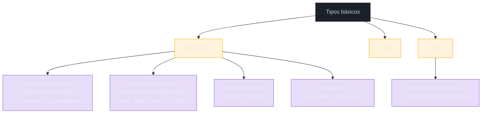

# Variáveis, tipos básicos e zero values

> [!abstract] TL;DR
> Em Go, toda variável nasce **inicializada** com um "zero value" previsível (`0`, `""`, `false`, `nil`) no instante em que é declarada — não existe `undefined`, `NaN` de variável não atribuída, nem `NullPointerException` por esquecer de inicializar um `int`. Go também é **estaticamente tipado** e **não faz coerção implícita**: somar um `int` com um `float64` é erro de compilação, e toda conversão entre tipos numéricos precisa ser escrita à mão com `T(valor)`. Some a isso um compilador que rejeita variável declarada e não usada, e o resultado é uma classe inteira de bugs — de "esqueci de inicializar" a "misturei tipo errado numa conta" — que em Go simplesmente não compila.

## O bug que não existe em Go

Se você já escreveu Java, provavelmente já foi mordido por isto:

```java
int total;
if (algumaCondicaoRara()) {
    total = calcular();
}
System.out.println(total);  // erro de compilação: variable total might not have been initialized
```

O compilador do Java pelo menos avisa. Em JavaScript, o mesmo tipo de descuido é ainda mais traiçoeiro, porque roda:

```javascript
let total;
if (algumaCondicaoRara()) {
  total = calcular();
}
console.log(total * 2);  // NaN — silencioso, sem stack trace, sem aviso
```

`total` existe, mas vale `undefined`. `undefined * 2` vira `NaN`, e `NaN` se propaga silenciosamente por todo o resto do cálculo até aparecer, várias linhas depois (ou em produção, dias depois), como um número impossível numa tela de relatório. Em Python o mesmo esquecimento nem chega a rodar — `UnboundLocalError: local variable 'total' referenced before assignment` — mas só estoura em tempo de execução, não em tempo de compilação, e só se o caminho de código que usa a variável for de fato exercitado por um teste ou por um usuário.

Agora o mesmo cenário em Go:

```go
var total int
if algumaCondicaoRara() {
    total = calcular()
}
fmt.Println(total * 2)  // 0 — sempre um int válido, nunca "buraco"
```

Não há ramo de execução em que `total` esteja "indefinido". No instante em que `var total int` roda, a variável já vale `0` — o **zero value** do tipo `int`. Se `algumaCondicaoRara()` for falsa, o cálculo final é `0`, um número perfeitamente válido, e não um sinalizador silencioso de "algo não rodou". Essa garantia — toda variável sempre tem um valor válido do seu tipo, desde a declaração — é o fio condutor desta nota, e é uma das decisões de design que mais surpreendem quem chega em Go vindo de linguagens dinâmicas.

> [!info] O que esta nota assume
> Você já leu a nota 01 e sabe como compilar/rodar um programa Go mínimo (`func main`, `package main`, `go run`). Aqui tratamos `string` só como "tipo básico que guarda texto" — unicode, runas e iteração byte-a-byte ficam para a nota 05. Controle de fluxo (`if`, `for`, `switch`) é a nota 03. Ponteiros são a nota 07. `struct` e tipos compostos são o galho 2.

## Declarando variáveis: três jeitos, um significado

Go tem três formas de declarar uma variável, e a primeira coisa a entender é que **elas fazem exatamente a mesma coisa por baixo** — só mudam a sintaxe e o contexto em que podem aparecer.

### `var` com tipo explícito

```go
var idade int
var nome string
var ativo bool
```

Isso declara a variável e a inicializa com o zero value do tipo — sem valor à direita, sem `=`. É a forma mais explícita, e é a única que funciona fora de uma função (no nível de pacote).

### `var` com valor inicial (tipo inferido)

```go
var idade = 30          // Go infere: int
var nome = "Ana"        // Go infere: string
var pi = 3.14159        // Go infere: float64
```

Aqui o tipo não aparece porque o compilador o deduz do valor à direita. Repare: isso **não** é o mesmo que "tipagem dinâmica". A inferência acontece uma única vez, em tempo de compilação — depois disso, `idade` é um `int` para sempre, do mesmo jeito que seria se você tivesse escrito `var idade int = 30`. Compare com Python, onde `idade = 30` deixa a porta aberta para `idade = "trinta"` na linha seguinte (válido em Python, erro de compilação em Go).

### `:=` — declaração curta

```go
idade := 30
nome := "Ana"
pi := 3.14159
```

`:=` é açúcar sintático para "declarar com `var` e inferir o tipo", mas só existe **dentro de funções** (nunca no nível de pacote, onde só `var` é permitido). Na prática, `:=` é a forma que você vai escrever na esmagadora maioria do código Go idiomático — `var` fica reservado para os casos em que você quer o zero value explicitamente, ou está no escopo de pacote.

### Declaração múltipla

```go
var a, b, c int              // três int, todos zero value (0)
var x, y = 10, "dez"         // tipos inferidos independentemente: int e string
nome, idade := "Bia", 25     // forma curta, múltiplos valores
```

E o bloco `var (...)`, usado sobretudo no nível de pacote para agrupar declarações relacionadas:

```go
var (
    host     = "localhost"
    porta    = 8080
    debug    = false
    maxConns int
)
```

> [!tip] Vindo de Java/Node/Python: qual usar quando?
>
> | Situação | Java/Kotlin | JavaScript/TypeScript | Python | Go idiomático |
> |---|---|---|---|---|
> | Variável local com valor inicial | `var x = 10` (Java 10+) / `int x = 10` | `let x = 10` / `const x = 10` | `x = 10` | `x := 10` |
> | Variável local sem valor ainda | `int x;` | `let x;` (via `undefined`) | não existe (`NameError` até atribuir) | `var x int` |
> | Constante | `final int X = 10` | `const X = 10` | `X = 10` (convenção, não imposta) | `const X = 10` |
> | Variável de pacote/módulo | `static int x` | export a nível de módulo | módulo a nível de arquivo | `var x = 10` fora de função |

## O mapa dos tipos básicos



Os tipos que você vai usar 90% do tempo são só quatro: `int`, `float64`, `bool`, `string`. O resto da árvore acima existe para quando o tamanho exato em bits importa de verdade — protocolos binários, hardware, interoperabilidade com C, otimização de memória em struct grande. Fora desses casos, usar `int32` "porque parece mais preciso" é, na cultura Go, visto como ruído — `int` é o padrão e o idiomático.

### `int` e suas variantes

`int` não tem tamanho fixo na especificação da linguagem — ele é `int32` em plataformas de 32 bits e `int64` em plataformas de 64 bits (praticamente todo hardware relevante hoje). Isso é diferente de Java, onde `int` é sempre 32 bits em qualquer JVM, em qualquer máquina. Quando o tamanho exato importa (serialização binária, compatibilidade de protocolo), use os tipos explícitos: `int8`, `int16`, `int32`, `int64`.

Para inteiros sem sinal (só valores ≥ 0), a família espelhada existe: `uint8`, `uint16`, `uint32`, `uint64`, e `uint` (tamanho da plataforma, como `int`). `byte` é literalmente um **alias** de `uint8` — não é um tipo novo, é outro nome para o mesmo tipo, usado por convenção quando o valor representa um byte cru (leitura de arquivo, rede) em vez de um número pequeno.

### `float32` e `float64`

Ponto flutuante IEEE 754, igual à maioria das linguagens. `float64` é o padrão recomendado (mais precisão, e é o que `var x = 3.14` infere automaticamente); `float32` só compensa quando memória é escassa de verdade (arrays gigantes, GPU, embedded).

### `bool`

`true` e `false`, sem surpresas — mas, diferente de C, JavaScript ou Python, **não existe truthiness** em Go. Não dá para escrever `if x { ... }` esperando que um `int` diferente de zero, ou uma string não-vazia, sejam tratados como verdadeiros. A condição de um `if` em Go só aceita uma expressão do tipo `bool`, ponto final — outro reflexo da mesma filosofia de "nada de conversão implícita" que vamos ver a seguir.

### `string`

Uma sequência imutável de bytes, tipicamente UTF-8. Para esta nota, trate `string` só como "o tipo que guarda texto" — a mecânica interna (por que `len("café")` não dá o que parece, como iterar por runas) é o assunto inteiro da nota 05.

### `byte` e `rune`: aliases, não tipos novos

```go
var b byte = 'A'   // byte é alias de uint8 → b vale 65
var r rune = 'A'   // rune é alias de int32 → r vale 65
```

`byte` (= `uint8`) representa um byte cru; `rune` (= `int32`) representa um ponto de código Unicode, que pode ocupar de 1 a 4 bytes em UTF-8. A distinção importa porque `string` em Go é uma sequência de bytes, não de runas — mas isso, de novo, é aprofundado na nota 05.

## `const` e `iota`

`const` declara um valor que o compilador resolve em tempo de compilação — não pode vir de uma chamada de função, só de uma expressão constante:

```go
const Pi = 3.14159
const MaxConexoes = 100

const (
    StatusAtivo   = "ativo"
    StatusInativo = "inativo"
)
```

`iota` é um contador especial, disponível só dentro de um bloco `const`, que começa em `0` e incrementa uma unidade a cada linha — o mecanismo idiomático de Go para gerar enums sem uma palavra-chave `enum` dedicada:

```go
type DiaDaSemana int

const (
    Domingo DiaDaSemana = iota // 0
    Segunda                    // 1 — repete a expressão da linha anterior
    Terca                      // 2
    Quarta                     // 3
    Quinta                     // 4
    Sexta                      // 5
    Sabado                     // 6
)
```

Quem vem de Java estranha a ausência de `enum Dia { DOMINGO, SEGUNDA, ... }` como construção de linguagem — em Go, "enum" é convenção (um tipo nomeado + `const` + `iota`), não uma feature própria. Funciona bem, mas exige entender o padrão em vez de decorar uma sintaxe dedicada.

## Zero values: o conceito central desta nota

Aqui está a tabela que resume por que o bug do início desta nota não existe em Go — toda variável declarada sem valor inicial recebe automaticamente o zero value do seu tipo:

| Tipo | Zero value | Equivalente "vazio" em outras linguagens |
|---|---|---|
| `int`, `int8`...`int64`, `uint`... | `0` | Java: precisa inicializar / JS: `undefined` |
| `float32`, `float64` | `0.0` | idem |
| `bool` | `false` | Java: precisa inicializar / Python: `NameError` |
| `string` | `""` (string vazia) | Java: `null` / JS: `undefined` |
| ponteiros, slices, maps, channels, funcs, interfaces | `nil` | Java: `null` / Python: `None` |
| `struct` | cada campo recebe seu próprio zero value, recursivamente | — |

A regra é simples e sem exceção: **declarar sem atribuir nunca deixa a variável num estado indefinido**. Isso não é conveniência cosmética — é uma decisão de design que elimina, de saída, toda uma categoria de bug de "esqueci de inicializar" que aflige linguagens onde uma variável pode existir sem valor.

```go
package main

import "fmt"

func main() {
    var contador int
    var preco float64
    var nome string
    var disponivel bool

    fmt.Println(contador)    // 0
    fmt.Println(preco)       // 0
    fmt.Println(nome)        // "" (imprime linha vazia)
    fmt.Println(disponivel)  // false
}
```

> [!question]- "Isso não é só `0`/`false`/`""` disfarçado de feature? Todo mundo faz isso na prática."
> A diferença não é o valor em si — é a **garantia da linguagem**. Em Java, um `int` local não inicializado é erro de compilação (o compilador te protege ali), mas um campo de instância `int` não inicializado silenciosamente vira `0` — e um objeto `String` não inicializado vira `null`, reintroduzindo o problema. Em JavaScript, `let x;` existe e vale `undefined`, um valor que se propaga por operações aritméticas como `NaN` sem lançar exceção. Em Go, a regra é uniforme e sem exceção: **todo** tipo tem exatamente um zero value, aplicado em **toda** declaração sem inicializador, sem depender de ser variável local, campo de struct, elemento de slice ou de map. Não existe "esqueci nesse caso específico" porque não existe caso não coberto.

## Conversão explícita de tipos

Go é estaticamente tipado e, tão importante quanto isso, **não converte tipos automaticamente** — nem entre tipos numéricos compatíveis, como `int` e `float64`:

```go
var inteiro int = 10
var flutuante float64 = 3.5

// resultado := inteiro + flutuante  // ERRO DE COMPILAÇÃO:
// invalid operation: inteiro + flutuante (mismatched types int and float64)

resultado := float64(inteiro) + flutuante  // 13.5 — conversão explícita
fmt.Println(resultado)
```

A sintaxe de conversão é `TipoDestino(valor)` — parece uma chamada de função, mas é uma operação de conversão embutida na linguagem. Funciona nos dois sentidos, mas converter de um tipo "maior" para um "menor" pode truncar dados silenciosamente (sem erro em tempo de compilação nem de execução):

```go
var n int = 300
var b byte = byte(n)   // 44, não 300! byte só guarda 0-255, houve overflow silencioso
fmt.Println(b)          // 44

var pi float64 = 3.99
var piInt int = int(pi) // 3 — trunca, não arredonda
fmt.Println(piInt)      // 3
```

Compare com JavaScript, onde a "conversão" acontece sozinha e sem aviso:

```javascript
let inteiro = 10;
let texto = "5";
console.log(inteiro + texto);   // "105" — concatenação, não soma; JS decidiu por você
```

E com Python, mais rígido que JS mas ainda flexível o bastante para deixar `1 + 2.5` funcionar sem qualquer conversão escrita (promoção automática dentro da família numérica):

```python
resultado = 1 + 2.5   # 3.5 — Python promove int → float sozinho
```

Em Go, mesmo `int` + `float64` — dois tipos numéricos, conceitualmente "compatíveis" — exige conversão explícita. Não existe promoção automática nem entre tipos numéricos da mesma família. A regra de ouro: **se os dois lados de uma operação não são exatamente do mesmo tipo, o compilador recusa compilar até você decidir, por escrito, qual conversão quer.**

### Tipagem estática vs dinâmica, revisitada

| | Tipagem estática (Go, Java) | Tipagem dinâmica (Python, JS) |
|---|---|---|
| Quando o tipo é checado | Em tempo de compilação | Em tempo de execução |
| Uma variável pode trocar de tipo? | Não — `x := 10` faz `x` ser `int` para sempre | Sim — `x = 10; x = "dez"` é válido |
| Erro de tipo aparece quando? | Antes do programa rodar (`go build` falha) | Quando a linha errada de fato executa |
| Custo de performance | Nenhum — tipos resolvidos em compile time | Checagem de tipo em runtime, a cada operação |

Go escolhe checar tudo antes de rodar. O preço é escrever `float64(x)` em vez de deixar o interpretador adivinhar; o ganho é que uma classe inteira de bugs de tipo — inclusive os dois exemplos do início desta nota — vira erro de compilação, detectado antes de qualquer usuário ver a tela.

## Na prática: `var` vs `:=`, zero values e conversão pegando erro

Um programa único que amarra os três fios desta nota — declaração, zero value e conversão explícita:

```go
package main

import "fmt"

func calcularMedia(notas []float64) float64 {
    var soma float64          // zero value 0.0 — ponto de partida seguro pro acumulador
    for _, nota := range notas {
        soma += nota
    }

    var total int = len(notas) // len devolve int
    if total == 0 {
        return 0 // zero value de float64 também serve como "sem dados" aqui
    }

    // soma é float64, total é int — divisão exige conversão explícita
    media := soma / float64(total)
    return media
}

func main() {
    notas := []float64{7.5, 8.0, 9.2, 6.8}
    fmt.Println("Média:", calcularMedia(notas)) // Média: 7.875

    var vazio []float64 // slice não inicializado: zero value é nil, não erro
    fmt.Println("Média (vazio):", calcularMedia(vazio)) // Média (vazio): 0
}
```

Repare em duas coisas que só fazem sentido por causa do que vimos acima: `var soma float64` começa em `0.0` sem precisar de `= 0.0` explícito, e `float64(total)` é obrigatório — trocar por `soma / total` (misturando `float64` com `int` direto) não compila.

## Armadilhas comuns

> [!warning] `:=` dentro de um `if`/`for` cria uma variável NOVA, não reatribui a de fora
> ```go
> x := 10
> if true {
>     x := 20        // isso é uma variável x NOVA, com escopo só do bloco if
>     fmt.Println(x) // 20
> }
> fmt.Println(x)     // 10 — a de fora nunca mudou!
> ```
> Quem espera que `:=` sempre "atualize" a variável mais próxima leva um susto: dentro de um novo escopo (`{ }`), `:=` **declara** um nome novo, mesmo que já exista um `x` no escopo pai — ele só "esconde" (shadow) o de fora durante o bloco. Se a intenção é reatribuir a variável existente, use `=` (sem dois-pontos): `x = 20`.

> [!warning] Esperar coerção implícita entre tipos numéricos
> Vindo de Python ou JavaScript, é natural tentar `resultado := contadorInt + precoFloat` e ficar surpreso com o erro de compilação `mismatched types`. Go não promove `int` para `float64` automaticamente, mesmo sendo os dois tipos numéricos — a conversão precisa ser escrita: `float64(contadorInt) + precoFloat`. Isso vale também entre variantes do mesmo grupo: somar `int32` com `int64` direto também é erro de compilação.

> [!warning] Variável declarada e não usada é erro de compilação
> ```go
> func main() {
>     x := 10
>     fmt.Println("oi")
> }
> // ./main.go:3:2: declared and not used: x
> ```
> Isso não é aviso de linter — é erro que impede o `go build`/`go run` de sequer gerar um binário. A justificativa do time de Go é que variável não usada quase sempre denuncia um bug (esqueceu de usar o resultado de um cálculo, deixou código morto de um refactor). Se você precisa declarar mas descartar de propósito (por exemplo, ao chamar uma função que retorna múltiplos valores), use o identificador em branco: `_, err := algumaFuncao()`.

## Como explicar em inglês

> In Go, every variable is initialized with a **zero value** the moment it's declared — `0` for numeric types, `false` for `bool`, `""` for `string`, `nil` for pointers, slices, maps, and interfaces. There's no `undefined`, no uninitialized state to worry about. Go is also statically typed with **no implicit coercion**: adding an `int` and a `float64` directly is a compile error, so every type conversion has to be explicit, using the `T(value)` syntax — like `float64(x)`. And the compiler refuses to build if a declared variable is never used, which catches a lot of copy-paste and leftover-code bugs before the program even runs.

| Termo PT | Termo EN |
|---|---|
| valor zero | zero value |
| coerção implícita | implicit coercion |
| conversão explícita de tipo | explicit type conversion |
| atribuição curta (`:=`) | short variable declaration |
| tipagem estática | static typing |
| variável não usada | unused variable |
| sombreamento de variável | variable shadowing |
| estouro silencioso (truncamento) | silent overflow (truncation) |
| identificador em branco (`_`) | blank identifier |

## O que vem a seguir

Com variáveis, tipos básicos e zero values estabelecidos, o próximo passo é ensinar o programa a **tomar decisões e repetir trabalho** — a [[03 - Controle de fluxo|nota 03]] cobre `if`/`else`, o único laço de Go (`for`, que também faz o papel de `while`) e `switch`, incluindo como cada um deles se apoia diretamente no `bool` sem truthiness que vimos aqui (nada de `if x { }` para um `int` ou `string`).

## Fontes

- The Go Programming Language Specification — "Variables": https://go.dev/ref/spec#Variables (acessado 2026-07-16)
- The Go Programming Language Specification — "Types": https://go.dev/ref/spec#Types (acessado 2026-07-16)
- The Go Programming Language Specification — "Constant declarations", "Iota": https://go.dev/ref/spec#Iota (acessado 2026-07-16)
- A Tour of Go — "Variables", "Basic types", "Zero values": https://go.dev/tour/basics/8 (acessado 2026-07-16)
- A Tour of Go — "Type conversions": https://go.dev/tour/basics/13 (acessado 2026-07-16)
- Effective Go — "Constants": https://go.dev/doc/effective_go#constants (acessado 2026-07-16)
- Go by Example — "Variables": https://gobyexample.com/variables (acessado 2026-07-16)
