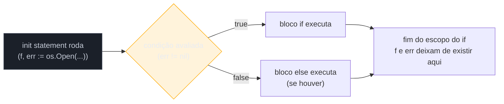
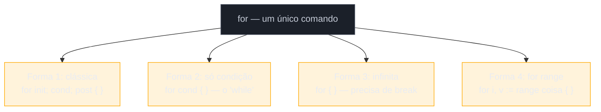

# Controle de fluxo

> [!abstract] TL;DR
> Go tem só **um** comando de laço — `for` — que assume quatro formas (clássico, estilo `while`, infinito, `for range`); não existe `while`, `do-while` nem `foreach` separados. O `if` ganha um recurso que vira idioma central da linguagem: o **init statement** (`if err := f(); err != nil { ... }`), que escopa uma variável só para a checagem. O `switch` não cai de um `case` para o outro por padrão — o oposto de C/Java, sem precisar de `break`. E `defer` adia a execução de uma chamada até o fim da função corrente, empilhando em ordem LIFO — o jeito idiomático de garantir que um recurso feche, não importa por onde a função saia.

## O cenário que abre esta nota

Você acabou de escrever a [[02 - Variáveis, tipos básicos e zero values|nota 02]] sobre variáveis e tipos, e resolve portar uma função Java bem comum: abrir um arquivo, ler seu conteúdo, e devolver um erro se algo falhar. Em Java isso seria um `try`/`catch` com `while` para ler linha a linha. Você abre a documentação de Go procurando `while` — e não encontra. Procura `do-while` — também não existe. Existe só `for`.

Aí você olha um exemplo de código Go real e vê isto:

```go
f, err := os.Open("dados.txt")
if err != nil {
    return err
}
defer f.Close()
```

Duas coisas estranham quem vem de Java/Node/Python. Primeiro: o `if` tem *duas* declarações separadas por `;` antes da condição — `f, err := os.Open(...)` não é uma linha isolada acima do `if`, é parte dele em outros exemplos que você vai ver logo mais (`if err := f(); err != nil`). Segundo: `defer f.Close()` aparece logo depois de abrir o arquivo, não no fim da função — e ainda assim o arquivo só fecha quando a função termina. Nada disso é sintaxe decorativa. É o idioma de Go para controle de fluxo, e esta nota desmonta as quatro peças: `if` (com o init statement), o `for` único, o `switch` sem fallthrough, e a introdução ao `defer`.

## `if`/`else`: igual por fora, um recurso a mais por dentro

A forma básica de `if` em Go é reconhecível para qualquer pessoa vinda de C, Java, JavaScript ou Python — com duas diferenças sintáticas que a [[02 - Variáveis, tipos básicos e zero values|nota 02]] já deixou implícitas: chaves `{}` são **obrigatórias** (mesmo para um corpo de uma linha) e a condição **não** leva parênteses.

```go
idade := 20

if idade < 13 {
    fmt.Println("criança")
} else if idade < 18 {
    fmt.Println("adolescente")
} else {
    fmt.Println("adulto")
}
```

Tentar escrever `if (idade < 13)` compila — parênteses ao redor de uma expressão são só parênteses — mas `gofmt` (a formatação automática de Go, que você vai usar em toda linha de código a partir de agora) os remove. A convenção da comunidade é não escrevê-los.

A condição de um `if` em Go também precisa ser, obrigatoriamente, uma expressão `bool` — ao contrário de Python (truthiness: `if lista:`) ou de JavaScript (`if (0)`, `if ("")`). Não existe conversão implícita de `int`, `string` ou ponteiro para booleano em Go. `if contador {` é erro de compilação; a intenção precisa vir explícita: `if contador != 0 {`.

### O init statement: a peça que muda tudo

A forma completa de um `if` em Go aceita uma **instrução de inicialização** antes da condição, separada por `;`:

```go
if <init statement>; <condição> {
    ...
}
```

O `init statement` executa **antes** da condição ser avaliada, e qualquer variável que ele declarar (com `:=`) só existe dentro do escopo do `if`/`else if`/`else` inteiro — não vaza para o resto da função. É esse mecanismo que sustenta o idioma mais repetido em todo código Go:

```go
if err := fazerAlgo(); err != nil {
    return err
}
// aqui embaixo, `err` já não existe mais — seu escopo acabou com o if
```

`fazerAlgo()` roda, o resultado é atribuído a `err` (declarada ali mesmo, com `:=`), e só então `err != nil` é avaliado. Como Go não tem exceções para erros esperados (isso é assunto do Galho 4 — Erros como valor), toda chamada que pode falhar devolve um erro como valor de retorno, e o padrão `if err := f(); err != nil { return err }` é o jeito idiomático de checar essa falha no ponto exato em que ela pode acontecer, sem poluir o resto da função com uma variável `err` que sobrevive além do necessário.

> [!tip] Por que isso importa mais do que parece
> Em Java, você declara `Result result = fazerAlgo();` numa linha e usa `result` várias linhas depois — o escopo da variável é o método inteiro. Em Go, o init statement empurra você a **escopar a variável de erro no menor bloco possível**. Isso evita um erro comum: reutilizar sem querer uma variável `err` de uma chamada anterior que já foi checada, mas cujo valor ficou "pendurado" no escopo esperando a próxima leitura.



## `for`: o único laço de Go, em quatro formas

Go tem uma decisão de design deliberada: **um único** comando de repetição, `for`, que substitui o `for`, `while`, `do-while` e `foreach` que você conhece de outras linguagens. A justificativa dos criadores da linguagem (Rob Pike e equipe, documentada na FAQ oficial) é a mesma que orienta o resto de Go: menos formas de fazer a mesma coisa, menos decisão de estilo, mais uniformidade entre times.

### Forma 1 — clássica, com três cláusulas

A mais parecida com C/Java/JavaScript:

```go
for i := 0; i < 5; i++ {
    fmt.Println(i)
}
```

`i := 0` é o init statement (roda uma vez), `i < 5` é a condição (checada antes de cada iteração), `i++` é o post statement (roda depois de cada iteração). Assim como no `if`, `i` só existe dentro do escopo do `for`.

### Forma 2 — só a condição (o "while" de Go)

Se você omitir o init e o post statement — e os `;` que os separariam — sobra só a condição. É assim que Go escreve o que outras linguagens chamam de `while`:

```go
contador := 0
for contador < 5 {
    fmt.Println(contador)
    contador++
}
```

Não existe a palavra-chave `while` em Go. Este `for` com uma condição só *é* o `while`.

### Forma 3 — infinito

Omitir tudo — condição incluída — produz um laço infinito, que só termina com `break`, `return` ou `os.Exit`:

```go
for {
    fmt.Println("rodando até alguém mandar parar")
    if condicaoDeParada() {
        break
    }
}
```

É o equivalente direto ao `while (true)` de Java ou `while True:` de Python — mas em Go essa forma é tão comum (em servidores, workers, loops de eventos) que ganhou sintaxe própria em vez de precisar de um literal booleano.

### Forma 4 — `for range`

Itera sobre uma coleção — slice, array, string, map, channel — devolvendo índice/chave e valor a cada passo:

```go
nomes := []string{"Ana", "Bruno", "Carla"}

for indice, nome := range nomes {
    fmt.Println(indice, nome)
}
```

Esta é a forma que substitui o `foreach`/`for...of` de Java/JavaScript e o `for item in lista:` de Python. A nota 05 aprofunda `for range` sobre slices e maps — inclusive uma armadilha real sobre cópia de valor, mencionada logo abaixo. Aqui, o que importa reter é que ela é a **quarta forma do mesmo `for`**, não um comando à parte.



> [!info] Cross-stack: de onde vem cada forma
>
> | Vindo de... | Vira, em Go |
> |---|---|
> | Java/JS `for (int i=0; i<n; i++)` | Forma 1 — clássica |
> | Java/JS `while (cond)` | Forma 2 — `for cond { }` |
> | Java/JS `while (true)` / Python `while True:` | Forma 3 — `for { }` |
> | Java `for (String s : lista)` | Forma 4 — `for _, s := range lista` |
> | Python `for item in lista:` | Forma 4 — `for _, item := range lista` |
> | Python `for i, item in enumerate(lista):` | Forma 4 — `for i, item := range lista` (já vem com índice, sem precisar de `enumerate`) |

## `switch`: sem fallthrough, e mais flexível do que parece

A primeira surpresa de quem vem de C, Java ou JavaScript: em Go, **cada `case` já tem um `break` implícito**. Depois de executar o bloco do `case` que casou, o `switch` termina — não "cai" para o próximo `case` a menos que você peça isso explicitamente com a palavra-chave `fallthrough`.

```go
dia := 3

switch dia {
case 1:
    fmt.Println("segunda")
case 2:
    fmt.Println("terça")
case 3:
    fmt.Println("quarta")
default:
    fmt.Println("outro dia")
}
// imprime só "quarta" — não precisa de break, e não "vaza" para default
```

> [!warning] Não escreva `break` esperando fallthrough automático de C/Java
> Se você vier de C ou Java e escrever `break` dentro de cada `case` "por hábito", não é erro — só é redundante (`gofmt`/`go vet` não reclamam, mas revisores vão notar). O erro real e mais perigoso é o oposto: **esperar** que a execução caia de um `case` para o próximo sem `break`, como em C. Em Go isso nunca acontece por padrão. Se você genuinamente precisa desse comportamento — por exemplo, dois `case` que devem compartilhar o mesmo bloco de código subsequente — use a palavra-chave `fallthrough` explicitamente como última linha do `case`:
> ```go
> switch nota {
> case "A":
>     fmt.Println("excelente")
>     fallthrough
> case "B":
>     fmt.Println("aprovado")
> default:
>     fmt.Println("reprovado")
> }
> ```

Um `case` também aceita múltiplos valores separados por vírgula — o equivalente a agrupar vários `case` de C/Java num só:

```go
switch dia {
case 6, 7:
    fmt.Println("fim de semana")
default:
    fmt.Println("dia útil")
}
```

### `switch` sem expressão: substituindo cadeias de `if`/`else if`

Se você omitir a expressão logo depois de `switch`, cada `case` vira uma condição booleana independente — a primeira que for `true` executa. É o jeito idiomático de Go de escrever o que, em outras linguagens, seria uma cadeia longa de `if`/`else if`/`else`:

```go
nota := 87

switch {
case nota >= 90:
    fmt.Println("A")
case nota >= 80:
    fmt.Println("B")
case nota >= 70:
    fmt.Println("C")
default:
    fmt.Println("D")
}
```

Isso é literalmente equivalente a `switch true { case nota >= 90: ... }` — `switch` sem expressão implícita compara contra `true`. Muitos guias de estilo Go (incluindo *Effective Go*) recomendam esta forma no lugar de uma cadeia `if`/`else if` longa quando há três ou mais faixas de condição, porque a indentação plana fica mais legível do que o aninhamento crescente do `else if`.

O `switch` também aceita um init statement, exatamente como o `if`:

```go
switch dia := time.Now().Weekday(); dia {
case time.Saturday, time.Sunday:
    fmt.Println("fim de semana")
default:
    fmt.Println("dia útil")
}
```

> [!info]- Type switch: um parente que aprofunda mais à frente
> Existe uma variante de `switch` — o **type switch** — que compara o *tipo dinâmico* de um valor guardado numa interface, em vez de comparar valores: `switch v := x.(type) { case int: ... case string: ... }`. É uma ferramenta central de Go para trabalhar com `interface{}`/`any`, mas depende de entender interfaces primeiro — o [[03-Dominios/Tecnologia/Go/03 - Interfaces e composição/index|Galho 3]] aprofunda o type switch. Por ora, basta saber que a palavra `switch` reaparece lá com um papel diferente.

## `defer`: introdução — adiando uma chamada até o fim da função

`defer` agenda a execução de uma chamada de função para **o momento em que a função corrente retorna** — não importa se o retorno acontece na última linha, num `return` no meio do corpo, ou por causa de um `panic`. O caso de uso mais comum, de longe, é garantir que um recurso (arquivo, conexão, lock) seja liberado, escrevendo a liberação logo depois da abertura — no mesmo lugar em que ela é mais fácil de lembrar e mais difícil de esquecer:

```go
func lerConteudo(caminho string) (string, error) {
    f, err := os.Open(caminho)
    if err != nil {
        return "", err
    }
    defer f.Close() // roda quando lerConteudo() retornar, seja qual for o return

    dados, err := io.ReadAll(f)
    if err != nil {
        return "", err
    }
    return string(dados), nil
}
```

Repare que `defer f.Close()` aparece logo após `os.Open`, não no fim da função — mas `f.Close()` só executa de fato quando `lerConteudo` está prestes a devolver o controle para quem a chamou, seja no `return "", err` do meio ou no `return string(dados), nil` do fim. Isso resolve exatamente o problema clássico de "código de limpeza espalhado" — em Java, um `try`/`finally` (ou `try-with-resources`) cumpre esse papel; em Go, `defer` é a ferramenta idiomática e não exige um bloco extra de indentação.

Quando uma função tem múltiplos `defer`, eles executam em ordem **LIFO** (last in, first out) — o último `defer` registrado é o primeiro a rodar:

```go
func exemplo() {
    defer fmt.Println("1")
    defer fmt.Println("2")
    defer fmt.Println("3")
}
// saída ao chamar exemplo():
// 3
// 2
// 1
```

Pense em `defer` como empilhar chamadas numa pilha: cada `defer` empurra uma chamada para o topo; quando a função termina, a pilha é desempilhada do topo para a base — o que é exatamente o comportamento certo para fechar recursos abertos em ordem: se você abre A e depois B, faz sentido fechar B antes de A.

> [!info] Isto é só a porta de entrada
> `defer` tem mais regras importantes — quando os argumentos são avaliados (na hora do `defer`, não na hora da execução), como interage com `panic`/`recover`, e por que `defer` dentro de um loop é quase sempre um erro de performance. Essa profundidade fica para o Galho 4 (Erros como valor), que trata `defer`/`panic`/`recover` como um conjunto. Aqui, o que fica é o essencial: `defer` adia uma chamada até o fim da função, em ordem LIFO, e o uso mais comum é liberar um recurso perto de onde ele foi adquirido.

## Na prática: os quatro idiomas juntos

Um exemplo que reúne o init statement, as formas de `for`, `switch` sem expressão e `defer` — o tipo de função que aparece o tempo todo em código Go de produção, processando um arquivo linha a linha e classificando cada uma:

```go
package main

import (
    "bufio"
    "fmt"
    "os"
)

func classificarLinhas(caminho string) error {
    f, err := os.Open(caminho)
    if err != nil {
        return err
    }
    defer f.Close()

    scanner := bufio.NewScanner(f)
    numeroLinha := 0

    for scanner.Scan() { // forma 2: só condição, o "while" de Go
        numeroLinha++
        linha := scanner.Text()
        tamanho := len(linha)

        switch { // switch sem expressão, substitui if/else if encadeado
        case tamanho == 0:
            fmt.Printf("linha %d: vazia\n", numeroLinha)
        case tamanho < 10:
            fmt.Printf("linha %d: curta\n", numeroLinha)
        case tamanho < 80:
            fmt.Printf("linha %d: normal\n", numeroLinha)
        default:
            fmt.Printf("linha %d: longa\n", numeroLinha)
        }
    }

    if err := scanner.Err(); err != nil { // init statement de novo
        return err
    }
    return nil
}

func main() {
    if err := classificarLinhas("dados.txt"); err != nil {
        fmt.Println("erro:", err)
        os.Exit(1)
    }
}
```

Note os dois usos do idioma `if err := ...; err != nil` — um checando a abertura do arquivo, outro checando se o `scanner` acumulou algum erro de leitura — e o único `defer f.Close()`, escrito uma vez, perto da abertura, garantindo que o arquivo feche em qualquer caminho de saída da função.

## Armadilhas comuns

> [!warning] Esperar fallthrough automático como em C
> Já coberto acima, mas vale reforçar como armadilha de hábito: se seu reflexo em C/Java é pensar "preciso de `break` para não cair no próximo `case`", em Go essa preocupação **não existe** — o comportamento padrão já é parar. O erro típico de quem porta código C/Java para Go é justamente o oposto: esquecer que um `switch` que dependia de fallthrough em C precisa da palavra-chave `fallthrough` explícita em Go, ou os `case` não vão se comunicar.

> [!warning] `defer` dentro de um loop acumula, não libera na hora
> Um erro de performance real e comum:
> ```go
> func processarArquivos(caminhos []string) error {
>     for _, caminho := range caminhos {
>         f, err := os.Open(caminho)
>         if err != nil {
>             return err
>         }
>         defer f.Close() // NÃO fecha ao fim de cada iteração — só ao fim de processarArquivos inteira
>         // ... processar f ...
>     }
>     return nil
> }
> ```
> `defer` sempre adia para o fim da **função corrente**, nunca para o fim de um bloco `for`. Se `caminhos` tem 10 mil itens, este código mantém 10 mil arquivos abertos simultaneamente até `processarArquivos` retornar — o que pode estourar o limite de file descriptors do sistema operacional. O conserto idiomático é extrair o corpo do loop para uma função própria, de forma que cada chamada tenha seu próprio "fim de função" e feche o recurso a cada iteração:
> ```go
> func processarArquivos(caminhos []string) error {
>     for _, caminho := range caminhos {
>         if err := processarUm(caminho); err != nil {
>             return err
>         }
>     }
>     return nil
> }
>
> func processarUm(caminho string) error {
>     f, err := os.Open(caminho)
>     if err != nil {
>         return err
>     }
>     defer f.Close() // agora fecha ao fim de CADA chamada de processarUm
>     // ... processar f ...
>     return nil
> }
> ```

> [!warning] `for range` copia o valor a cada iteração
> ```go
> pessoas := []struct{ Nome string }{{"Ana"}, {"Bruno"}}
>
> for _, p := range pessoas {
>     p.Nome = "Alterado" // altera a CÓPIA local, não o elemento original no slice
> }
> // pessoas ainda tem "Ana" e "Bruno" — nada mudou
> ```
> A variável `p` de um `for range` é uma cópia do elemento, recriada a cada iteração — não uma referência ao elemento dentro do slice original. Se você precisa alterar o elemento de fato, indexe o slice diretamente (`pessoas[i].Nome = "Alterado"`) ou itere sobre ponteiros. A nota 05 aprofunda esse comportamento, inclusive a mudança de semântica da variável de loop introduzida no Go 1.22.

## Como explicar em inglês

> Go has exactly one looping construct, `for`, that covers what other languages split across `for`, `while`, `do-while`, and `foreach` — there's no separate `while` keyword. `if` supports an init statement before the condition, which is where Go's most common idiom comes from: `if err := doSomething(); err != nil { return err }`, scoping the error variable to just that check. `switch` doesn't fall through by default — each case breaks implicitly, the opposite of C or Java — so you only get fallthrough behavior if you write the `fallthrough` keyword explicitly. And `defer` schedules a call to run when the enclosing function returns, in LIFO order, which is the idiomatic way to release a resource right next to where you acquired it — instead of a `try/finally` block.

| PT | EN |
|---|---|
| instrução de inicialização | init statement |
| adiar (uma chamada) | defer |
| cair através (de um case pro outro) | fallthrough |
| laço / comando de repetição | loop |
| a condição do laço | loop condition |
| pilha (ordem LIFO) | stack (LIFO order) |
| liberar um recurso | release a resource |
| escopo (de uma variável) | scope |
| cláusula/bloco de caso | case clause |
| laço infinito | infinite loop |

## O que vem a seguir

Com `if`, `for`, `switch` e a introdução a `defer` no repertório, a peça que falta para escrever qualquer programa Go não trivial é a unidade que organiza esse controle de fluxo: a função. A [[04 - Funções|nota 04]] cobre múltiplos valores de retorno (o mecanismo que sustenta o `(valor, err)` que você já viu aparecer aqui várias vezes), named returns, funções variádicas, funções como valores de primeira classe, closures — e aprofunda `defer` até o fim, incluindo a ordem exata de avaliação dos argumentos e sua relação com `panic`/`recover`.

## Fontes

- The Go Programming Language Specification — "If statements": https://go.dev/ref/spec#If_statements (acessado 2026-07-16)
- The Go Programming Language Specification — "For statements": https://go.dev/ref/spec#For_statements (acessado 2026-07-16)
- The Go Programming Language Specification — "Switch statements": https://go.dev/ref/spec#Switch_statements (acessado 2026-07-16)
- The Go Programming Language Specification — "Defer statements": https://go.dev/ref/spec#Defer_statements (acessado 2026-07-16)
- A Tour of Go — "Flow control statements: for, if, else, switch and defer": https://go.dev/tour/flowcontrol/1 (acessado 2026-07-16)
- Effective Go — "Control structures": https://go.dev/doc/effective_go#control-structures (acessado 2026-07-16)
- Go by Example — "For": https://gobyexample.com/for (acessado 2026-07-16)
- Go by Example — "Switch": https://gobyexample.com/switch (acessado 2026-07-16)
- Go by Example — "Defer": https://gobyexample.com/defer (acessado 2026-07-16)
- Go FAQ — "Why does Go not have a while or do-while looping construct?": https://go.dev/doc/faq#for_while (acessado 2026-07-16)

## Veja também

- [[02 - Variáveis, tipos básicos e zero values|Variáveis, tipos básicos e zero values]] — nota anterior deste galho, pré-requisito para `:=` no init statement
- [[04 - Funções|Funções]] — próxima nota, aprofunda `defer` e os múltiplos retornos usados no idioma `if err := ...`
- for range sobre slices e maps — aprofunda a quarta forma do `for` e a armadilha de cópia de valor
- [[03-Dominios/Tecnologia/Go/03 - Interfaces e composição/index|Interfaces e composição]] — Galho 3, aprofunda o type switch
- [[03-Dominios/Tecnologia/Go/04 - Erros como valor/index|Erros como valor]] — Galho 4, aprofunda `defer`/`panic`/`recover`
- [[03-Dominios/Tecnologia/Go/index|Trilha Go]] (MOC central)
