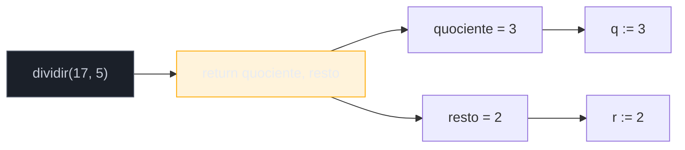
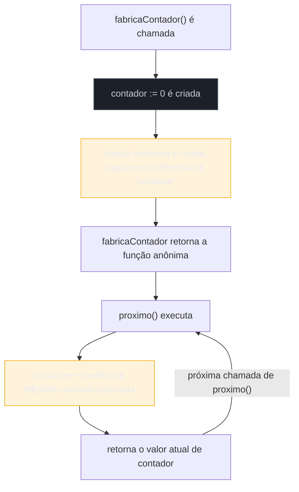
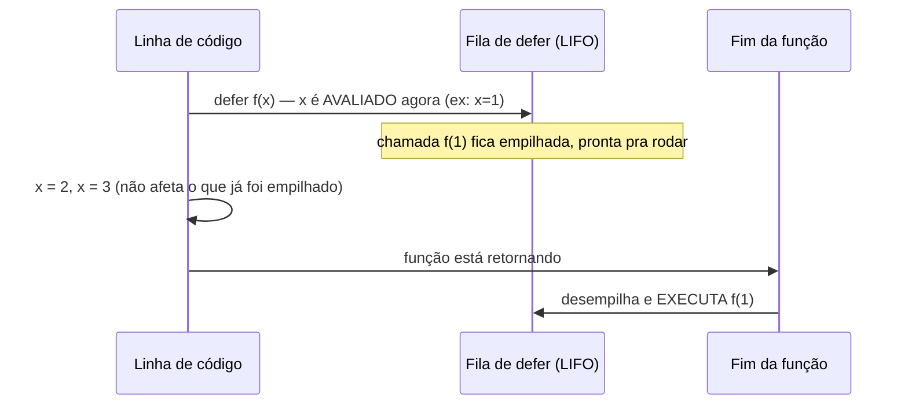

# Funções

> [!abstract] TL;DR
> Em Go, uma função pode devolver **mais de um valor** direto na assinatura — `func abrir(caminho string) (*os.File, error)` — sem precisar de um objeto-wrapper nem de exceção; é o mecanismo que sustenta o idioma `if err := f(); err != nil` que você já viu duas vezes na nota anterior. Parâmetros de retorno podem ser **nomeados** (`(resultado int, err error)`), o que documenta a intenção e habilita um `return` vazio, mas custa clareza se abusado. Funções aceitam aridade variável com `...T` (variádicas), são **valores de primeira classe** (guardáveis em variável, passáveis como argumento, retornáveis de outra função), e uma função anônima que referencia uma variável do escopo em que foi criada é uma **closure** — a mesma variável, não uma cópia, o que abre espaço para o bug clássico de capturar a variável de um loop. E `defer`, introduzido na nota anterior, tem uma regra de ouro que muda como você lê qualquer código real: os **argumentos** de uma chamada adiada são avaliados **na hora do `defer`**, não na hora em que a chamada de fato executa.

## O cenário que abre esta nota

Você está portando para Go uma função Java que busca um usuário num mapa de cache. Em Java, ela devolveria o usuário ou lançaria uma exceção — ou, num design mais defensivo, devolveria um `Optional<Usuario>` para sinalizar "pode não existir" sem lançar nada:

```java
// Java: Optional como wrapper de "valor ou ausência"
public Optional<Usuario> buscarUsuario(String id) {
    Usuario u = cache.get(id);
    return Optional.ofNullable(u);
}

// no chamador:
Optional<Usuario> resultado = buscarUsuario("42");
if (resultado.isPresent()) {
    processar(resultado.get());
}
```

Node resolveria de um jeito parecido devolvendo `undefined` ou lançando; Python devolveria `None` ou levantaria uma exceção. Em qualquer um dos três casos, a *forma* do retorno é sempre um valor só — o "e se não encontrar" fica implícito no tipo (`Optional`, `None`, `undefined`) ou sai de banda pela pilha de exceções.

Você tenta a tradução direta para Go e esbarra num muro: Go não tem `Optional<T>` embutido, nem `null` para ponteiros de valor (structs), nem exceções para fluxo de erro esperado. O jeito idiomático é outro — a função devolve **dois valores**, lado a lado, na própria assinatura:

```go
func buscarUsuario(cache map[string]Usuario, id string) (Usuario, bool) {
    u, existe := cache[id]
    return u, existe
}

usuario, existe := buscarUsuario(cache, "42")
if existe {
    processar(usuario)
}
```

Não há wrapper, não há `null` disfarçado, não há exceção — a função literalmente devolve dois valores numa única instrução `return`, e o chamador recebe os dois numa única atribuição múltipla. Essa nota parte desse mecanismo — múltiplos valores de retorno — e percorre o resto do vocabulário de funções em Go: named returns, variádicas, funções como valor, closures, e o `defer` levado até o fim.

> [!info] Fronteiras desta nota
> Funções com **receiver** (o que em outras linguagens seria "método de uma classe") ficam para o [[03-Dominios/Tecnologia/Go/02 - Tipos, structs e métodos/index|Galho 2]]. O tipo `error` como valor e o par `panic`/`recover` são o [[03-Dominios/Tecnologia/Go/04 - Erros como valor/index|Galho 4]] inteiro — aqui você vai ver a *forma* `(T, error)` repetidamente, sem entrar em como tratar o erro de verdade. `go func()` (goroutines) é bloco 2 da trilha. Generics em funções (`func Map[T, U any](...)`) ficam para o [[03-Dominios/Tecnologia/Go/06 - Generics/index|Galho 6]].

## Declaração de função e parâmetros

A sintaxe básica já apareceu de relance nas notas anteriores. Formalizando:

```go
func nome(parametro1 Tipo1, parametro2 Tipo2) TipoDeRetorno {
    // corpo
}
```

Dois detalhes que diferem de Java/Node/Python: **o tipo vem depois do nome do parâmetro** (`nome string`, não `string nome`), e **parâmetros consecutivos do mesmo tipo compartilham a anotação**:

```go
func apresentar(nome, cidade string, idade int) string {
    return fmt.Sprintf("%s, %d anos, mora em %s", nome, idade, cidade)
}
```

`nome, cidade string` significa que ambos são `string` — não é um erro de digitação nem um recurso especial, é só açúcar sintático para não repetir o tipo. Diferente de Python, **Go não tem argumentos nomeados na chamada** (`apresentar(nome: "Ana", ...)` não existe) nem valores default de parâmetro — toda chamada passa todos os argumentos, na ordem, sempre. Quando uma função precisa de "parâmetros opcionais", o idioma comum é receber uma `struct` de configuração ou usar o padrão functional options (fora do escopo desta nota introdutória).

## Múltiplos valores de retorno

Uma função em Go pode declarar mais de um tipo de retorno entre parênteses, e um `return` devolve todos de uma vez:

```go
func dividir(a, b int) (int, int) {
    quociente := a / b
    resto := a % b
    return quociente, resto
}

q, r := dividir(17, 5)
fmt.Println(q, r) // 3 2
```

Isso **não é** açúcar sintático sobre uma tupla, como em Python (onde `return a, b` empacota uma `tuple` de verdade que existe como objeto). Em Go, múltiplos valores de retorno são um recurso de linguagem próprio — não existe um tipo "tupla de dois `int`s" que você possa guardar numa variável só. `q, r := dividir(17, 5)` funciona porque a atribuição múltipla do lado esquerdo casa, posição a posição, com os valores devolvidos; tentar `resultado := dividir(17, 5)` (uma variável só recebendo dois valores) é erro de compilação.



### O idioma central: `(resultado, error)`

A aplicação mais comum de múltiplo retorno em Go — de longe — é o par **valor + status de erro**, o mesmo padrão que abriu esta nota, agora com o tipo real que a stdlib usa:

```go
func converterParaInt(texto string) (int, error) {
    n, err := strconv.Atoi(texto)
    return n, err
}
```

Repare na forma: o **último** valor de retorno é convencionalmente um `error` (mais sobre esse tipo no Galho 4 — aqui o que importa é a forma da assinatura, não como tratar o valor). O chamador recebe os dois e decide o que fazer:

```go
n, err := converterParaInt("42")
if err != nil {
    // tratamento fica para o Galho 4 — aqui só a forma
}
fmt.Println(n)
```

Essa convenção — "última posição de retorno é `error`, `nil` quando deu certo" — é tão universal na stdlib e no ecossistema Go que qualquer função que quebre esse padrão (por exemplo, um `error` no meio, não no fim) é considerada não-idiomática. É por isso que o compilador não *impõe* essa ordem — é convenção de comunidade, não regra de sintaxe — mas segui-la é o que faz sua função "parecer Go" para quem lê depois.

> [!question]- Por que não um tipo genérico `Result<T, E>` como em Rust?
> Porque múltiplo retorno já resolve o problema sem precisar de um tipo container novo, e Go historicamente prioriza simplicidade de mecanismo sobre expressividade de tipo. Antes de generics (Go 1.18), um `Result<T, E>` genérico nem seria possível de escrever de forma reutilizável; depois de generics, a comunidade debateu a ideia, mas o padrão `(T, error)` já está tão entranhado na stdlib inteira que mudar teria um custo de compatibilidade e de hábito enorme. Vale saber que a decisão é filosófica, não técnica.

## Named return values (valores de retorno nomeados)

Os tipos de retorno podem receber **nomes**, exatamente como parâmetros de entrada. Esses nomes se comportam como variáveis locais já declaradas (com o zero value do tipo) no início da função:

```go
func dividir(a, b int) (quociente, resto int) {
    quociente = a / b
    resto = a % b
    return // "naked return" — devolve quociente e resto automaticamente
}
```

O `return` sem argumentos (chamado de *naked return*) devolve o valor atual de cada variável nomeada, na ordem declarada. Isso é útil sobretudo em duas situações:

1. **Documentação embutida na assinatura.** `func dividir(a, b int) (quociente, resto int)` diz, só de olhar a assinatura, o que cada valor de retorno *significa* — diferente de `(int, int)`, que não diz nada sobre qual é qual.
2. **`defer` que precisa ler ou modificar o retorno** — o caso de uso mais importante, coberto a fundo na seção de `defer` mais abaixo.

```go
func dividirComRecuperacao(a, b int) (resultado int, err error) {
    defer func() {
        if r := recover(); r != nil {
            err = fmt.Errorf("recuperado de: %v", r)
        }
    }()
    resultado = a / b // panic se b == 0 — recover() acima captura
    return
}
```

Aqui, `err` nomeado é o que permite ao `defer` **modificar o valor de retorno** depois que o `return` já "aconteceu" — algo impossível com retorno anônimo. (`panic`/`recover` propriamente ditos são assunto do Galho 4; o exemplo mostra só a mecânica do named return interagindo com `defer`.)

> [!warning] Named returns não são "retorno automático" — e abusar deles esconde bugs
> Um erro comum de quem vem de linguagens com saída implícita (Ruby, por exemplo, onde a última expressão é o retorno): achar que declarar `(resultado int)` significa que Go "adivinha" o que devolver. Não significa — você ainda precisa atribuir a variável nomeada e, no caso de `return` explícito com valores (`return resultado, nil`), esses valores sobrescrevem o que estava na variável nomeada. Pior: em funções longas com vários `return` espalhados, misturar `return valor, nil` explícito com um `return` nu no final é uma receita para bugs de "esqueci de atualizar essa variável antes desse `return` específico". Regra prática, endossada pelo próprio *Effective Go*: use named returns quando eles **documentam** algo (assinaturas com múltiplos retornos do mesmo tipo, tipo `(min, max int)`) ou quando um `defer` precisa mexer no retorno — não como hábito para "economizar" escrever `return quociente, resto` por extenso.

## Funções variádicas: `...T`

Uma função aceita um número arbitrário de argumentos do mesmo tipo prefixando o tipo do último parâmetro com `...`:

```go
func somar(numeros ...int) int {
    total := 0
    for _, n := range numeros {
        total += n
    }
    return total
}

somar(1, 2)          // 3
somar(1, 2, 3, 4, 5)  // 15
somar()               // 0
```

Dentro do corpo da função, `numeros` é um `[]int` normal — um slice — não um tipo especial. É por isso que a mesma sintaxe `for _, n := range numeros` da nota anterior funciona sem novidade nenhuma. O parâmetro variádico precisa ser o **último** da assinatura, e só pode existir um por função — diferente de Python, que permite `*args` em qualquer posição intermediária desde que seguido de keyword-only.

Se você já tem um slice pronto e quer espalhá-lo como argumentos individuais, o operador `...` reaparece do **lado da chamada**, com papel simétrico ao de `*` em Python:

```go
valores := []int{10, 20, 30}
total := somar(valores...) // espalha o slice — equivalente a somar(10, 20, 30)
```

```go
// Combinando parâmetros fixos com variádico
func registrarEvento(nome string, tags ...string) {
    fmt.Printf("evento=%s tags=%v\n", nome, tags)
}

registrarEvento("login")                       // tags = []
registrarEvento("login", "sucesso")             // tags = [sucesso]
registrarEvento("login", "sucesso", "mobile")   // tags = [sucesso mobile]
```

> [!info] Cross-stack: variádica em Go vs. equivalentes
>
> | Vindo de... | Vira, em Go |
> |---|---|
> | Java `int soma(int... numeros)` | `func soma(numeros ...int) int` — sintaxe quase idêntica |
> | Python `def soma(*numeros):` | `func soma(numeros ...int) int` — `numeros` já chega como slice, não precisa de conversão |
> | JS `function soma(...numeros)` | mesmíssima ideia, tipo estático em vez de dinâmico |
> | Espalhar array/slice na chamada (`f(*lista)` em Python, `f(...array)` em JS) | `f(slice...)` em Go — mesmo operador `...`, papel de "desempacotar" |

## Funções como valores de primeira classe

Em Go, uma função é um valor com tipo próprio — `func(int, int) int`, por exemplo, é um tipo válido, do mesmo jeito que `int` ou `string` é. Isso habilita quatro usos que, juntos, formam a base de boa parte do código Go idiomático (incluindo `http.HandlerFunc`, funções de callback em `sort.Slice`, e o padrão functional options mencionado antes):

```go
func dobrar(n int) int {
    return n * 2
}

// 1. Atribuir a uma variável
operacao := dobrar
fmt.Println(operacao(5)) // 10

// 2. Guardar numa estrutura de dados (aqui, um map de nome → função)
operacoes := map[string]func(int) int{
    "dobrar":   dobrar,
    "quadrado": func(n int) int { return n * n },
}
fmt.Println(operacoes["quadrado"](4)) // 16

// 3. Passar como argumento para outra função
func aplicar(f func(int) int, valor int) int {
    return f(valor)
}
fmt.Println(aplicar(dobrar, 7)) // 14

// 4. Retornar de dentro de outra função
func fabricaDeOperacao(tipo string) func(int) int {
    if tipo == "dobrar" {
        return dobrar
    }
    return func(n int) int { return n * n }
}
operacaoFabricada := fabricaDeOperacao("dobrar")
fmt.Println(operacaoFabricada(9)) // 18
```

A anotação `func(int) int` que aparece em `aplicar` e em `fabricaDeOperacao` é o **tipo da função** — um `func` que recebe um `int` e devolve um `int`. Assinaturas mais elaboradas seguem o mesmo molde: `func(string, error) bool`, `func() (int, error)`, etc. Quando esse tipo de assinatura se repete bastante num pacote, é comum declará-lo como um tipo nomeado (`type Operacao func(int) int`) para deixar o código mais legível — mas isso é refinamento de estilo, não obrigação da linguagem.

## Closures: funções anônimas que capturam o escopo

Uma **closure** é uma função (geralmente anônima, criada com `func(...) {...}` sem nome) que referencia uma variável declarada *fora* do seu próprio corpo. A diferença crucial em relação a "só uma função aninhada" é que a closure não recebe uma cópia daquela variável — ela mantém uma **referência viva** a ela, mesmo depois que a função que a criou já retornou.

O exemplo clássico — um contador que mantém estado entre chamadas sem usar uma variável global nem uma struct:

```go
func fabricaContador() func() int {
    contador := 0
    return func() int {
        contador++
        return contador
    }
}

proximo := fabricaContador()
fmt.Println(proximo()) // 1
fmt.Println(proximo()) // 2
fmt.Println(proximo()) // 3

outroContador := fabricaContador()
fmt.Println(outroContador()) // 1 — instância independente, própria variável contador
```

`fabricaContador` executa, cria `contador := 0`, e devolve uma função anônima que referencia `contador`. Em qualquer linguagem sem closures de verdade, `contador` deveria "morrer" junto com o retorno de `fabricaContador` — mas como a função anônima devolvida ainda referencia `contador`, o compilador de Go detecta essa captura e mantém `contador` viva no heap enquanto a closure existir. Cada chamada a `fabricaContador()` cria uma **nova** variável `contador`, independente — por isso `outroContador` começa do zero de novo.



> [!question]- Isso é diferente de uma closure em JavaScript ou Python?
> A ideia é a mesma — captura por referência do escopo léxico — mas o mecanismo de baixo nível difere. Em JavaScript, toda closure captura por referência naturalmente (é o comportamento padrão de `function`/arrow function). Em Python, capturar para **leitura** funciona direto, mas capturar para **reatribuição** exige a palavra-chave `nonlocal` explícita dentro da função interna — sem ela, uma atribuição cria uma variável local nova, sombreando a externa (é o mesmo mecanismo do `UnboundLocalError` da regra LEGB). Em Go não existe esse obstáculo: qualquer atribuição dentro da closure (`contador++`, que é açúcar para `contador = contador + 1`) modifica a variável capturada diretamente, sem precisar de uma palavra-chave equivalente a `nonlocal`. É uma das poucas áreas em que Go é *menos* cerimonioso que Python.

## `defer` a fundo

A nota anterior introduziu `defer` como "adia a chamada até o fim da função, em ordem LIFO." Isso é verdadeiro, mas incompleto de um jeito que gera bugs sutis se não for entendido direito. A regra que falta: **os argumentos de uma chamada `defer` são avaliados no momento em que o `defer` é executado — não no momento em que a chamada de fato roda.**

```go
func exemplo() {
    x := 1
    defer fmt.Println("valor de x no defer:", x) // x é avaliado AGORA → 1

    x = 2
    x = 3
    fmt.Println("valor de x no fim da função:", x) // imprime 3
}
// saída:
// valor de x no fim da função: 3
// valor de x no defer: 1
```

`defer fmt.Println(..., x)` congela o valor de `x` (que era `1`) no exato instante em que a linha `defer` executa — as mudanças subsequentes de `x` (`x = 2`, `x = 3`) não afetam mais o que já foi "fotografado" para a chamada adiada. Isso surpreende porque a intuição — sobretudo vinda de `try/finally` de Java, onde o bloco `finally` executa e lê o estado *atual* das variáveis — é que `defer` deveria ler o valor mais recente. Não lê: só a **chamada em si** é adiada; a **avaliação dos argumentos** acontece imediatamente, como em qualquer chamada de função normal.



O detalhe que evita confusão: se o argumento adiado for um **ponteiro** ou uma closure que lê a variável por referência (em vez de passar o valor diretamente), o comportamento muda — porque aí não é o valor de `x` que foi avaliado no `defer`, é o *endereço* de `x`, e o que acontece depois com o conteúdo daquele endereço já é outra história:

```go
func exemplo2() {
    x := 1
    defer func() {
        fmt.Println("valor de x lido dentro da closure:", x) // lê x no momento da EXECUÇÃO
    }()

    x = 2
    x = 3
}
// saída: valor de x lido dentro da closure: 3
```

Aqui não há contradição com a regra: o argumento de `defer func() {...}()` é a **função anônima em si** (o valor congelado é a função, avaliada uma vez), não `x`. O *corpo* dela só executa no fim, e nesse momento lê o valor atual de `x` por captura de closure — exatamente o mecanismo da seção anterior. A regra "argumentos avaliados na hora do `defer`" se aplica ao que está entre parênteses da chamada adiada; uma closure sem parênteses de argumento simplesmente adia a leitura junto com a execução.

### `defer` + named return: o combo que faz sentido dos dois juntos

Voltando ao exemplo de named return visto antes, agora com a mecânica completa: um `defer` **pode modificar** o valor de retorno nomeado, porque named returns já são variáveis vivas no escopo da função, e o `defer` roda **depois** que o `return` atribui os valores a elas, mas **antes** que a função de fato devolva o controle ao chamador:

```go
func abrirEValidar(caminho string) (conteudo string, err error) {
    f, err := os.Open(caminho)
    if err != nil {
        return "", err
    }
    defer func() {
        if erroFechamento := f.Close(); erroFechamento != nil && err == nil {
            err = erroFechamento // sobrescreve o retorno nomeado 'err' DEPOIS do return
        }
    }()

    dados, err := io.ReadAll(f)
    if err != nil {
        return "", err
    }
    return string(dados), nil
}
```

Sem named return, não haveria como o `defer` "avisar" o chamador de um erro que só aconteceu no fechamento do arquivo — o `return string(dados), nil` já teria "decidido" o valor de retorno, e não haveria variável para o `defer` sobrescrever depois. É exatamente esse encaixe — `defer` rodando após o `return` atribuir, mas antes da função sair de fato — que torna named returns mais do que documentação: viram um ponto de intervenção de última hora.

## Na prática

Um exemplo que junta múltiplo retorno, variádica, closure e `defer` com named return — uma função que processa vários números, valida cada um, e usa `defer` para logar quantos foram processados no fim, não importa por qual caminho a função saia:

```go
package main

import (
    "errors"
    "fmt"
)

func processarNumeros(numeros ...int) (soma int, processados int, err error) {
    defer func() {
        fmt.Printf("processarNumeros: %d de %d números processados\n", processados, len(numeros))
    }()

    for _, n := range numeros {
        if n < 0 {
            err = errors.New("número negativo não permitido")
            return // named return: soma e processados ficam com o que já tinham
        }
        soma += n
        processados++
    }
    return
}

func main() {
    soma, processados, err := processarNumeros(1, 2, 3, 4, 5)
    fmt.Println(soma, processados, err) // 15 5 <nil>

    soma2, processados2, err2 := processarNumeros(1, 2, -3, 4)
    fmt.Println(soma2, processados2, err2) // 3 2 número negativo não permitido
}
```

Repare que `defer` roda nas **duas** execuções — a que termina bem e a que aborta no meio — porque ele foi registrado antes do `for`, e `defer` dispara sempre que a função retorna, seja qual for o caminho. É a mesma garantia de cleanup vista na nota anterior com `f.Close()`, aqui aplicada a instrumentação/logging em vez de fechamento de recurso.

## Armadilhas comuns

> [!warning] Capturar a variável de loop numa closure (o bug clássico pré-Go 1.22)
> Até o Go 1.21, a variável de um `for` clássico ou `for range` era **uma única variável reaproveitada** a cada iteração — não uma nova a cada volta. Se você criasse uma closure dentro do loop capturando essa variável, todas as closures acabavam compartilhando a mesma variável, e todas liam o valor **final** dela, não o valor da iteração em que foram criadas:
> ```go
> // comportamento em Go 1.21 e anteriores — bug clássico
> var funcoes []func()
> for i := 0; i < 3; i++ {
>     funcoes = append(funcoes, func() {
>         fmt.Println(i) // capturava a MESMA variável i em todas as iterações
>     })
> }
> for _, f := range funcoes {
>     f()
> }
> // Go ≤1.21: imprime 3, 3, 3 (todas leem o valor final de i)
> // Go ≥1.22: imprime 0, 1, 2 (cada iteração tem sua própria i)
> ```
> O [Go 1.22 (lançado em fevereiro de 2024)](https://go.dev/blog/loopvar-preview) mudou a semântica da linguagem: cada iteração de um `for` passou a ter sua **própria** cópia da variável de controle, eliminando essa classe de bug na maioria dos casos. Se você trabalha num módulo com `go.mod` declarando uma versão anterior a 1.22, o comportamento antigo ainda se aplica — e mesmo em versões novas, vale saber a história, porque é uma das perguntas mais previsíveis sobre Go em entrevista técnica, e porque código legado ainda carrega o workaround manual (`i := i` dentro do loop, para forçar uma cópia local antes da captura).

> [!warning] Assumir que os argumentos do `defer` são avaliados na hora da execução
> Já demonstrado a fundo acima, mas é o erro mais comum de quem lê `defer` pela primeira vez: achar que `defer registrarLog("processando item", contador)` vai imprimir o valor de `contador` que existir *quando a função terminar*. Não vai — `contador` é avaliado *ali*, na linha do `defer`. Se a intenção é capturar o estado final, a chamada precisa estar dentro de uma função anônima sem argumentos (`defer func() { registrarLog("processando item", contador) }()`), que só lê `contador` quando de fato executa.

> [!warning] Abusar de named returns em funções longas ou com múltiplos `return`
> Já mencionado na seção de named returns, mas vale como armadilha isolada: named returns em uma função com 5+ `return`s espalhados, alguns explícitos (`return valor, nil`) e algum outro nu (`return`), tornam difícil rastrear qual valor está sendo devolvido em cada ponto sem ler a função inteira. O uso saudável é a exceção documentada (retorno com significado ambíguo tipo `(min, max int)`) ou a necessidade real de um `defer` mexer no retorno — não um hábito aplicado a toda função só porque "economiza digitação".

## Como explicar em inglês

> Go functions can return more than one value directly in the signature — `func open(path string) (*os.File, error)` — which is why Go doesn't need an `Optional<T>` wrapper or exceptions for expected-failure flows: a function just returns the value and an error side by side, and the caller checks both. Return values can be **named**, turning them into pre-declared local variables that a `return` with no arguments (a "naked return") sends back automatically — useful mainly as documentation, or when a deferred function needs to modify the return value after the fact. Functions accept variable arity through `...T` (variadic parameters), which arrive inside the function body as an ordinary slice. Functions are first-class values — assignable, passable, returnable — and an anonymous function that references a variable from its enclosing scope is a **closure**: it holds a live reference to that variable, not a copy, which is exactly what powers the classic counter-factory pattern and exactly what caused Go's best-known closure bug before Go 1.22 changed loop-variable semantics. And `defer` has one rule that trips up almost everyone the first time: the **arguments** of a deferred call are evaluated **when the `defer` statement runs**, not when the deferred call actually executes — only the call itself is postponed.

| Termo PT | Termo EN |
|---|---|
| valor de retorno nomeado | named return value |
| retorno nu / sem argumentos | naked return |
| função variádica | variadic function |
| função de primeira classe | first-class function |
| fechamento (de escopo) | closure |
| capturar (uma variável) | to capture |
| adiar (uma chamada) | defer |
| avaliar (um argumento) | to evaluate |
| ordem LIFO | LIFO order |
| variável de controle de loop | loop variable |
| assinatura de função | function signature |

## O que vem a seguir

Com funções — múltiplo retorno, named returns, variádicas, first-class functions, closures e `defer` até o fundo — o vocabulário de fundamentos e sintaxe de Go está quase completo. O que falta é entender como esse código se organiza em unidades maiores que uma função solta: pacotes. A [[05 - Pacotes, imports e visibilidade|nota 05]] cobre como `package` declara a unidade de compilação, como `import` traz outros pacotes, e a regra de visibilidade mais simples (e mais estranha para quem vem de Java) que existe numa linguagem mainstream: **maiúscula inicial exporta, minúscula inicial não exporta** — sem `public`, `private` ou `protected` algum.

## Veja também

- [[03-Dominios/Tecnologia/Go/01 - Fundamentos e sintaxe/03 - Controle de fluxo|03 — Controle de fluxo]] — nota anterior, introduz `defer` e o idioma `if err := f(); err != nil`
- [[05 - Pacotes, imports e visibilidade|05 — Pacotes, imports e visibilidade]] — próxima nota
- [[03-Dominios/Tecnologia/Go/02 - Tipos, structs e métodos/index|Structs e métodos]] — Galho 2, funções com receiver
- [[03-Dominios/Tecnologia/Go/04 - Erros como valor/index|Erros como valor]] — Galho 4, `error`, `panic`, `recover`
- [[03-Dominios/Tecnologia/Go/06 - Generics/index|Generics]] — Galho 6, funções genéricas
- [[03-Dominios/Tecnologia/Go/index|Trilha Go]] (MOC central)

## Fontes

- The Go Programming Language Specification — "Function declarations": https://go.dev/ref/spec#Function_declarations (acessado 2026-07-16)
- The Go Programming Language Specification — "Defer statements": https://go.dev/ref/spec#Defer_statements (acessado 2026-07-16)
- A Tour of Go — "Functions": https://go.dev/tour/basics/4 (acessado 2026-07-16)
- A Tour of Go — "Multiple results" e "Named return values": https://go.dev/tour/basics/6 e https://go.dev/tour/basics/7 (acessado 2026-07-16)
- A Tour of Go — "Function values" e "Function closures": https://go.dev/tour/moretypes/24 e https://go.dev/tour/moretypes/25 (acessado 2026-07-16)
- Effective Go — "Functions" (multiple return values, named result parameters, defer): https://go.dev/doc/effective_go#functions (acessado 2026-07-16)
- Go by Example — "Variadic Functions": https://gobyexample.com/variadic-functions (acessado 2026-07-16)
- Go by Example — "Closures": https://gobyexample.com/closures (acessado 2026-07-16)
- Go by Example — "Defer": https://gobyexample.com/defer (acessado 2026-07-16)
- The Go Blog — "Fixing For Loops in Go 1.22": https://go.dev/blog/loopvar-preview (acessado 2026-07-16)
