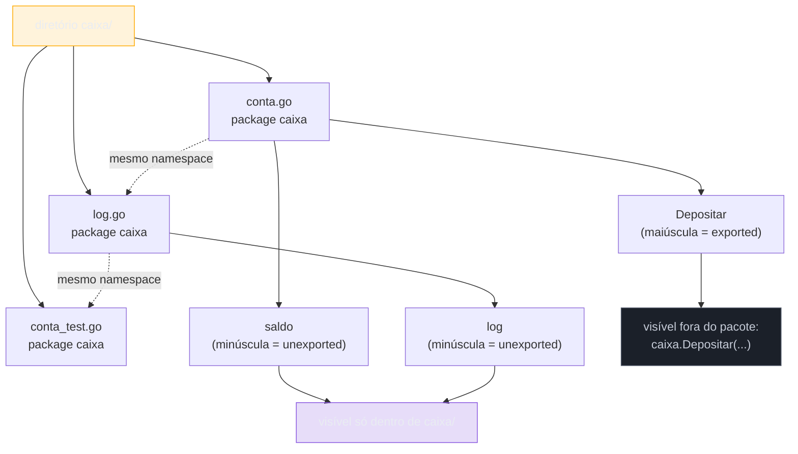
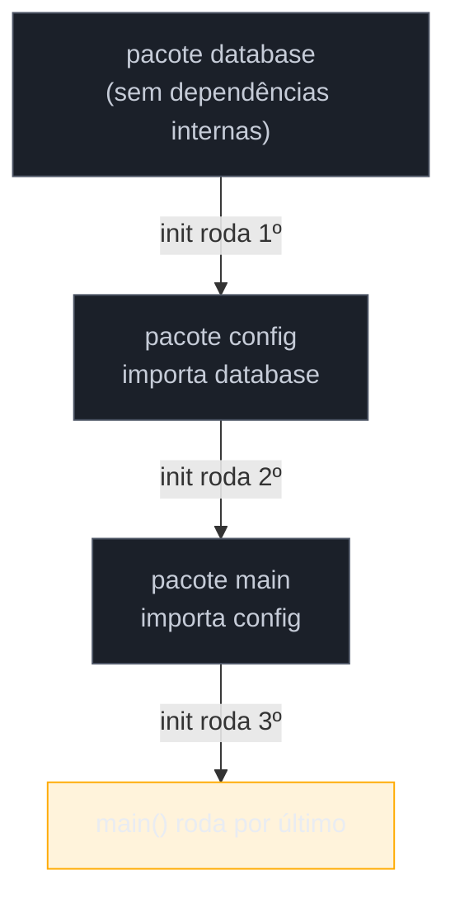

# Pacotes, imports e visibilidade

> [!abstract] TL;DR
> Em Go, **visibilidade não é uma palavra-chave** — é a **primeira letra do identificador**. `Func` maiúscula é *exported* (visível fora do pacote); `func` minúscula é *unexported* (só visível dentro do próprio pacote). Não existe `public`, `private` nem `protected`. Um **pacote** é uma pasta: todo arquivo `.go` de um mesmo diretório declara o mesmo `package nome` no topo, e essa é a unidade real de encapsulamento em Go — não a classe, não o arquivo. `import` traz pacotes inteiros para uso via prefixo (`fmt.Println`), com variantes para alias, import em bloco, e o `_` (*blank import*) que só dispara o `init()` de um pacote sem usar nada dele diretamente. Falando em `init()`: é uma função especial, sem argumentos nem retorno, que roda automaticamente antes de `main()` — mecanismo poderoso e fácil de abusar.

## O cenário que abre esta nota

Você vem de Java, e o primeiro reflexo ao ler um pacote Go é procurar a palavra `public`. Alguém te passa este trecho:

```go
package caixa

func Depositar(valor float64) {
    saldo += valor
    log(valor)
}

func log(valor float64) {
    fmt.Printf("depósito de %.2f registrado\n", valor)
}

var saldo float64
```

`Depositar` você consegue chamar de fora — `caixa.Depositar(100)` funciona em outro arquivo, outro pacote. Já `log` e `saldo`, não: tentar `caixa.log(...)` ou `caixa.saldo` a partir de outro pacote nem compila. `Depositar` e `log` são funções normais, declaradas do mesmo jeito, com a mesma sintaxe `func`. A única diferença entre uma acessível de fora e outra travada dentro do pacote é: **a primeira letra do nome**.

Não tem anotação, não tem palavra reservada, não tem seção separada do arquivo. `D` maiúsculo abre a porta; `l` minúsculo tranca. Isso surpreende quem vem de Java, C# ou Python — linguagens onde visibilidade é decidida por uma palavra-chave (`public`/`private`/`protected`) ou por convenção suave (o `_` de Python, que é só um sinal para humanos, nunca imposto pelo interpretador). Em Go, a regra é sintática e **imposta pelo compilador**: usar um identificador minúsculo fora do pacote onde ele foi declarado é erro de compilação, não *lint*.

Esta nota cobre exatamente esse eixo — visibilidade por capitalização — e tudo que gira em torno dele: o que é um pacote, as formas de `import`, e a função `init()`, que se apoia na mesma ideia de "tudo que existe no pacote é compartilhado entre seus arquivos, goste você ou não".

## Pacote: a unidade real de organização em Go

Em Go, a regra é simples de enunciar e absoluta na prática: **um diretório é um pacote**. Todo arquivo `.go` dentro de uma pasta declara, na primeira linha não-comentário, a que pacote pertence:

```go
// caixa/conta.go
package caixa

// caixa/log.go
package caixa
```

Os dois arquivos vivem na mesma pasta `caixa/` e declaram `package caixa` — por isso, para efeitos do compilador, **eles são o mesmo pacote**. Uma função ou variável declarada em `conta.go` está diretamente visível em `log.go`, sem `import` nenhum, exatamente como se as duas fossem um único arquivo grande que o autor optou por dividir em dois por organização. Essa regra tem uma consequência que não tem equivalente direto em Java (onde cada `.java` é uma unidade de compilação relativamente isolada, mesmo dentro do mesmo pacote) nem em Python (onde cada `.py` é um módulo com namespace próprio, mesmo dentro da mesma pasta): em Go, **o pacote inteiro compartilha um único namespace**.



> [!question]- O nome do diretório precisa ser igual ao nome do pacote?
> Não é exigido pelo compilador, mas é convenção forte o suficiente para ser tratada como regra na prática. O `import` referencia o pacote pelo **caminho do diretório** (`import "meuprojeto/caixa"`), mas o código que usa esse pacote se refere a ele pelo **nome declarado em `package`** — normalmente o mesmo nome do diretório. Se você declarar `package contas` dentro de uma pasta chamada `caixa/`, o import continua sendo pelo caminho (`"meuprojeto/caixa"`), mas o prefixo de uso vira `contas.Depositar(...)`, não `caixa.Depositar(...)` — o que confunde qualquer pessoa lendo o projeto depois. A [documentação de Effective Go sobre nomes de pacote](https://go.dev/doc/effective_go#package-names) recomenda manter os dois sincronizados; a única exceção comum e aceita é `package main`, tratada na seção seguinte.

> [!question]- Pacote e módulo são a mesma coisa?
> Não. **Pacote** é a unidade de organização e compilação — uma pasta com arquivos `.go` compartilhando namespace, o assunto desta nota. **Módulo** é a unidade de versionamento e distribuição — um conjunto de pacotes com um `go.mod` na raiz, publicável e importável por outros projetos. Um módulo normalmente contém muitos pacotes; um projeto pequeno pode ter só um. A [[06 - Módulos e o toolchain|nota 06]] cobre `go.mod`, `go get` e versionamento em profundidade — aqui, pacote é sempre "a pasta", nunca "o projeto inteiro".

Um caso especial de nome de pacote merece menção: `package main`. Todo programa Go executável (não uma biblioteca) precisa de exatamente um pacote chamado `main`, contendo uma função `func main()` sem parâmetros nem retorno — é o ponto de entrada que o comando `go run`/`go build` procura. Fora esse caso, o nome do pacote é livre, mas a convenção da comunidade — reforçada pelo [post oficial do blog do Go sobre nomes de pacote](https://go.dev/blog/package-names) — é: **nomes curtos, minúsculos, sem underscore nem camelCase**, evitando nomes genéricos como `util` ou `common` que não dizem nada sobre o conteúdo.

## As formas de `import`

### Import individual e em bloco

A forma mais simples traz um pacote por linha:

```go
import "fmt"
import "os"
```

Mas o formato idiomático — o que `gofmt` produz e todo código Go real usa — agrupa múltiplos imports num único bloco entre parênteses:

```go
import (
    "fmt"
    "os"
    "strings"
)
```

Os dois formatos são funcionalmente idênticos; a diferença é só de organização visual. `gofmt` (a ferramenta de formatação oficial, coberta na [[01 - O que é Go e o modelo de compilação|nota 01]]) reescreve automaticamente uma sequência de `import` individuais soltos para o formato em bloco, e ordena as linhas alfabeticamente dentro dele — por isso praticamente nenhum código Go em produção usa a forma de uma linha por `import` fora de arquivos com um único import.

### Alias

Um `import` pode receber um nome diferente do nome do pacote, útil para desambiguar dois pacotes com o mesmo nome final de caminho, ou para encurtar um nome longo:

```go
import (
    "fmt"
    mrand "math/rand"
    crand "crypto/rand"
)

func exemplo() {
    fmt.Println(mrand.Intn(100))  // gerador pseudoaleatório, não seguro
    b := make([]byte, 16)
    crand.Read(b)                  // gerador criptograficamente seguro
}
```

Sem alias, os dois pacotes se chamariam `rand` e colidiriam — o compilador recusaria o segundo `import "crypto/rand"` porque `rand` já estaria vinculado ao `math/rand`. O alias resolve isso explicitamente, deixando claro no ponto de uso qual `rand` é qual (padrão bem mais legível do que precisar abrir os imports pra descobrir).

### Blank import (`_`)

Existe uma forma de `import` que não vincula nome nenhum — o pacote é importado só pelo **efeito colateral da sua inicialização**, sem que nenhum símbolo dele seja usado diretamente no arquivo:

```go
import (
    "database/sql"

    _ "github.com/lib/pq" // driver Postgres — registra-se via init(), nunca é chamado por nome
)

func conectar() (*sql.DB, error) {
    return sql.Open("postgres", "postgres://localhost/meubanco")
}
```

Isso é o exemplo canônico: pacotes de driver de banco de dados em Go seguem o padrão `database/sql`, onde o driver concreto (`lib/pq` para Postgres, `go-sql-driver/mysql` para MySQL) se registra num registro interno do pacote `sql` chamando `sql.Register(...)` dentro do próprio `init()` do driver — nunca é chamado diretamente por nome no seu código, que só interage com o tipo genérico `sql.DB`. Sem o blank import, o compilador rejeitaria o `import` normal (`"github.com/lib/pq"` sem uso de nenhum símbolo dele é erro de compilação — Go não tolera import não utilizado), e sem o `import` de jeito nenhum, o driver nunca rodaria seu `init()` e `sql.Open("postgres", ...)` falharia em tempo de execução por driver desconhecido.

O `_` aqui é o mesmo identificador especial usado em atribuições descartáveis (`_, err := f()`), reaproveitado no contexto de import com o mesmo sentido: "eu sei que isso normalmente vincularia um nome, mas deliberadamente não quero esse nome, só o efeito."

### Dot import — existe, evite

Uma última forma injeta todos os identificadores exported de um pacote diretamente no namespace do arquivo atual, sem prefixo:

```go
import . "fmt"

func exemplo() {
    Println("sem prefixo fmt.") // Println em vez de fmt.Println
}
```

> [!warning] Dot import polui namespace e mata legibilidade
> Ler `Println(...)` sem saber de onde ele veio é exatamente o problema que o `from math import *` do Python causa — só que em Go a comunidade tolera ainda menos: a convenção quase universal é `import "fmt"` seguido de `fmt.Println`, e o prefixo do pacote em cada chamada é considerado parte da documentação do código, não ruído. O [`go vet`](https://pkg.go.dev/cmd/vet) e revisores de código costumam sinalizar dot import fora de um contexto muito específico: **testes que usam um framework de assertions estilo Ginkgo/Gomega**, onde o dot import de `github.com/onsi/gomega` é aceito porque o objetivo explícito é ler como prosa (`Expect(x).To(Equal(y))`). Fora desse nicho, evite.

## Visibilidade por capitalização: o eixo central

Aqui está a regra completa, e ela cabe numa frase: **um identificador — função, tipo, variável, constante, método, campo de struct — cuja primeira letra é maiúscula é *exported*: visível e utilizável por qualquer código que importe o pacote. Cuja primeira letra é minúscula é *unexported*: visível só dentro do próprio pacote**, mesmo entre arquivos diferentes da mesma pasta.

```go
package inventario

// TotalItens é exported — outros pacotes podem chamar inventario.TotalItens()
func TotalItens() int {
    return contarLinhas()
}

// contarLinhas é unexported — só existe dentro do pacote inventario
func contarLinhas() int {
    return len(itens)
}

// Item é exported — o tipo em si pode ser usado de fora
type Item struct {
    Nome  string // exported — acessível como item.Nome de fora do pacote
    preco float64 // unexported — só código dentro de inventario lê/escreve preco
}

var itens []Item // unexported — a slice em si não é acessível de fora
```

Repare que a regra se aplica **por identificador**, não por arquivo nem por bloco: dentro do mesmo `type Item struct`, um campo pode ser exported (`Nome`) e outro unexported (`preco`) na mesma declaração. É o mesmo mecanismo, aplicado item a item — sem sintaxe extra, sem seção `private:` como em C++, sem modificador por membro como em Java.

O compilador impõe isso de verdade — não é *lint*, é erro de compilação tentar acessar `inventario.contarLinhas()` ou `item.preco` de outro pacote:

```
./main.go:12:10: contarLinhas undefined (cannot refer to unexported name inventario.contarLinhas)
```

### Contraste com Java e Python

| Aspecto | Go | Java | Python |
|---|---|---|---|
| Como se marca | Primeira letra maiúscula/minúscula | Palavra-chave (`public`, `private`, `protected`, *package-private* implícito) | Convenção: `_prefixo` (uma barra), `__prefixo` (*name mangling*) |
| Quem impõe | Compilador | Compilador/JVM | Ninguém — é só sinal para humanos |
| Granularidade | Por identificador (função, tipo, campo, método, constante) | Por membro, com 4 níveis (`public`/`protected`/*package*/`private`) | Por identificador, mas sempre contornável |
| Nível intermediário | Não existe — só pacote inteiro vê o unexported | `protected` (subclasses) e *package-private* (mesmo pacote) | Não existe formalmente |
| Pode "furar" a regra? | Não, exceto via `reflect` com restrições | Não, exceto via reflection | Sim — `objeto._atributo` sempre acessível |

A diferença mais estranha pra quem vem de Java é a ausência de um nível intermediário. Java tem quatro graus de visibilidade (`private` < *package-private* < `protected` < `public`); Go tem só dois, e o "meio-termo" mais próximo — visível dentro do pacote, invisível fora — é exatamente o que Java chama de *package-private* (o padrão quando você **não** escreve modificador nenhum). Só que em Go, esse nível intermediário não é uma opção entre outras: é **o padrão automático de qualquer identificador minúsculo**, e o único jeito de escapar dele é capitalizar.

Já a diferença com Python é de natureza, não de grau: `_privado` em Python é uma bandeira educada — o interpretador nunca impede `objeto._privado`, é só uma promessa social entre desenvolvedores ("não mexa nisso, mas se mexer o problema é seu"). Em Go, tentar usar um identificador minúsculo de outro pacote **não compila**. Não existe *workaround* de sintaxe — é a diferença entre convenção e regra de linguagem.

> [!question]- Existe alguma forma de "furar" a visibilidade em Go, tipo reflection em Java?
> O pacote `reflect` da biblioteca padrão consegue *inspecionar* campos unexported de uma struct (por exemplo, para bibliotecas de serialização genéricas), mas não consegue **chamá-los ou modificá-los livremente** como a reflection do Java às vezes permite via `setAccessible(true)`. `reflect.Value.Field(i)` sobre um campo unexported retorna um valor marcado como "não endereçável para escrita" — tentar `.Set(...)` nele lança *panic* em tempo de execução (`reflect: reflect.Value.Set using unaddressable value` ou `using value obtained using unexported field`). Isso é intencional: o design de Go trata visibilidade como parte do contrato do pacote, não como uma cortesia contornável.

## `init()`: a função que roda antes de `main`

Qualquer arquivo `.go` pode declarar uma função especial chamada `init`, sem parâmetros e sem retorno:

```go
package configuracao

var Timeout int

func init() {
    Timeout = 30
    fmt.Println("configuração inicializada")
}
```

`init()` roda **automaticamente**, sem ser chamada por ninguém — o runtime de Go a executa sozinha, antes de qualquer código do pacote ser usado por quem o importa, e antes de `main()` rodar (se o pacote em questão fizer parte da cadeia de imports até `package main`). Não existe forma de chamar `init()` manualmente, e não existe forma de referenciá-la por nome — `configuracao.init()` nem compila.

A ordem de execução, quando há múltiplos `init()` envolvidos, segue uma regra em camadas:

1. Dentro de um mesmo arquivo, `init()` roda depois que todas as variáveis de nível de pacote **daquele arquivo** já foram inicializadas.
2. Um pacote pode ter **vários** `init()` — um por arquivo, ou até mais de um no mesmo arquivo. Todos rodam; a ordem entre arquivos do mesmo pacote segue a ordem em que o compilador processa os arquivos (tipicamente ordem alfabética de nome de arquivo, mas a especificação não garante isso como contrato — só garante que todos rodam antes de `main`).
3. Pacotes importados têm seus `init()` executados **antes** do pacote que os importa — a inicialização segue a ordem topológica do grafo de dependências, de baixo para cima.
4. `main()` só começa depois que **todo** `init()` de **todo** pacote na árvore de dependências já rodou.



O caso de uso mais legítimo de `init()` é justamente o do blank import visto acima: um pacote de driver de banco usa `init()` para se registrar num registro global (`sql.Register(...)`) antes que qualquer código de aplicação tenha chance de chamar `sql.Open(...)`. Outros usos aceitos: validar invariantes de configuração no arranque (falhar cedo se uma variável de ambiente obrigatória estiver ausente), inicializar tabelas de lookup calculadas uma única vez, ou registrar tipos num serializador.

> [!warning] `init()` com lógica pesada é abuso, não idioma
> Como `init()` roda de forma implícita — ninguém "vê" a chamada no código de quem usa o pacote — colocar lógica não trivial ali (fazer uma chamada de rede, ler um arquivo grande, abrir uma conexão de banco que pode falhar) cria comportamento invisível e difícil de testar: qualquer teste que só queira importar o pacote para usar um tipo dele já dispara esse efeito colateral, sem controle. A recomendação da comunidade Go, reforçada em discussões de design como o [Go blog sobre inicialização de pacote](https://go.dev/doc/effective_go#init), é reservar `init()` para configuração determinística e barata — e preferir uma função construtora explícita (`func NovoServidor(cfg Config) *Servidor`) para qualquer inicialização que possa falhar ou que dependa de I/O.

## Organizando múltiplos arquivos no mesmo pacote

Nada obriga um pacote a ter um único arquivo. Na prática, qualquer pacote além do trivial é dividido por responsabilidade, com todos os arquivos compartilhando o mesmo `package`:

```
caixa/
├── conta.go       // package caixa — tipo Conta, Depositar, Sacar
├── validacao.go   // package caixa — funções unexported de validação
├── erros.go       // package caixa — tipos de erro do pacote
└── conta_test.go  // package caixa — testes (ou package caixa_test)
```

```go
// caixa/conta.go
package caixa

type Conta struct {
    Titular string
    saldo   float64
}

func (c *Conta) Depositar(valor float64) error {
    if !valorValido(valor) { // definida em validacao.go — mesmo pacote, sem import
        return ErroValorInvalido // definido em erros.go — idem
    }
    c.saldo += valor
    return nil
}
```

```go
// caixa/validacao.go
package caixa

func valorValido(v float64) bool {
    return v > 0
}
```

```go
// caixa/erros.go
package caixa

import "errors"

var ErroValorInvalido = errors.New("valor de depósito deve ser positivo")
```

`Depositar` chama `valorValido` e usa `ErroValorInvalido` sem nenhum `import` — porque, de novo, os três arquivos são o mesmo pacote. A divisão em arquivos aqui é puramente organizacional: `go build` compila os três juntos como se fossem um único arquivo concatenado (na prática o compilador processa cada um separadamente, mas o efeito de namespace é esse). Convém dividir por responsabilidade coesa (tipo principal, validação, erros, um arquivo por tipo em pacotes maiores) — não existe regra da linguagem sobre isso, só convenção de legibilidade.

## Na prática: juntando tudo num pacote pequeno

Um exemplo fechado, reunindo import em bloco, visibilidade por capitalização, um helper unexported e um `init()` legítimo — um pacote `metrica` que conta eventos em memória e expõe um total:

```
metrica/
├── contador.go
└── inicializacao.go
```

```go
// metrica/contador.go
package metrica

import (
    "fmt"
    "sync"
)

// Contador é exported — o tipo em si é o que os outros pacotes usam.
type Contador struct {
    mu     sync.Mutex
    nome   string
    total  int
}

// NovoContador é exported — construtor, o jeito idiomático de criar o tipo.
func NovoContador(nome string) *Contador {
    return &Contador{nome: nome}
}

// Incrementar é exported — API pública do pacote.
func (c *Contador) Incrementar() {
    c.mu.Lock()
    defer c.mu.Unlock()
    c.total++
    registrarEvento(c.nome, c.total) // helper unexported, mesmo pacote
}

// Total é exported.
func (c *Contador) Total() int {
    c.mu.Lock()
    defer c.mu.Unlock()
    return c.total
}

// registrarEvento é unexported — detalhe de implementação, nunca
// chamado fora de metrica/.
func registrarEvento(nome string, total int) {
    fmt.Printf("[metrica] %s agora em %d\n", nome, total)
}
```

```go
// metrica/inicializacao.go
package metrica

import "time"

var inicioProcesso time.Time

// init roda uma única vez, antes de qualquer código de metrica/ ser
// usado por quem importa o pacote — trabalho barato e determinístico,
// exatamente o tipo de uso recomendado.
func init() {
    inicioProcesso = time.Now()
}

// Uptime é exported — usa o valor calculado no init.
func Uptime() time.Duration {
    return time.Since(inicioProcesso)
}
```

```go
// main.go
package main

import (
    "fmt"

    "meuprojeto/metrica"
)

func main() {
    c := metrica.NovoContador("requisicoes")
    c.Incrementar()
    c.Incrementar()

    fmt.Println("total:", c.Total())         // total: 2
    fmt.Println("uptime:", metrica.Uptime()) // uptime: 42.318µs (ou similar)
}
```

`main.go` só consegue chamar `NovoContador`, `Incrementar`, `Total` e `Uptime` — todos exported. `registrarEvento`, `inicioProcesso` e os campos internos de `Contador` (`mu`, `nome`, `total`) são invisíveis fora de `metrica/`, mesmo que `main.go` tentasse acessá-los diretamente (`c.total` nem compila). E o `init()` de `inicialização.go` já rodou, sem ninguém chamá-lo, no instante em que `metrica.NovoContador` foi resolvido — é por isso que `Uptime()` já retorna um valor sensato na primeira chamada, mesmo sem nenhuma inicialização explícita no `main`.

## Armadilhas comuns

> [!warning] Nome de diretório ≠ nome do pacote é fonte de confusão silenciosa
> O compilador não exige que `package X` bata com o nome da pasta que o contém — mas quando os dois divergem, qualquer pessoa lendo o `import "projeto/caixa"` espera usar `caixa.Algo`, e se o arquivo dentro dessa pasta declarar `package cofre`, o uso correto vira `cofre.Algo`. Isso não gera erro nenhum — só confusão. É comum acontecer por acidente ao renomear uma pasta sem atualizar o `package` de dentro, ou vice-versa.

> [!warning] Import cycle é proibido — e Go recusa compilar, não só avisa
> Se o pacote `A` importa `B`, e `B` importa `A` (direta ou indiretamente, através de uma cadeia), o `go build` recusa compilar com `import cycle not allowed`. Diferente do circular import de Python — que às vezes "funciona" dependendo da ordem de execução dos imports, e só quebra em certos casos — em Go **não existe cenário em que um ciclo de import compile**, porque a resolução de dependências entre pacotes acontece inteiramente em tempo de compilação, antes de qualquer código rodar. A correção é a mesma receita de qualquer linguagem: extrair o que os dois pacotes precisam para um terceiro pacote comum, do qual ambos dependem, sem depender um do outro.

> [!warning] Abusar de `init()` esconde ordem de inicialização real
> Um projeto com vários pacotes, cada um com seu próprio `init()` fazendo trabalho não óbvio (registrar rotas HTTP, abrir conexões, popular caches), fica com uma ordem de inicialização que só existe implicitamente no grafo de imports — ninguém escreveu essa sequência deliberadamente, ela é uma consequência colateral de quem importa quem. Depurar "por que isso já está inicializado quando eu não chamei nada" nesse tipo de projeto é notoriamente difícil. Preferir construtores explícitos, chamados a partir de `main()` numa ordem visível, é o antídoto — reservando `init()` para os casos de registro leve e determinístico cobertos acima.

## Como explicar em inglês

> A package in Go is a directory: every `.go` file in that folder declares the same `package name` and shares a single namespace — that's the real unit of encapsulation, not the file and not the class. Visibility isn't a keyword; it's the first letter of the identifier. A capitalized name (`Func`, `Type`, `Field`) is **exported** — usable by any package that imports this one. A lowercase name is **unexported** — visible only inside the declaring package, even across its own files — and the compiler enforces this at compile time, not as a lint warning. `import` brings a whole package in, referenced by a dotted prefix; a blank import (`_ "driver/package"`) runs only that package's `init()` side effect without binding any name, the canonical pattern for database drivers registering themselves. `init()` is a special, argument-less function that every package can declare — possibly several per package — and the runtime calls it automatically before `main()`, after that file's package-level variables are initialized, in dependency order across imported packages. It's powerful for cheap, deterministic setup, and an anti-pattern when it hides network calls or fallible work behind an invisible call site.

| Termo PT | Termo EN |
|---|---|
| exportado | exported |
| privado ao pacote / não exportado | package-private / unexported |
| pacote | package |
| importação | import |
| importação em branco | blank import |
| ciclo de import | import cycle |
| visibilidade | visibility |
| encapsulamento | encapsulation |
| namespace compartilhado | shared namespace |
| ponto de entrada | entry point |
| efeito colateral de inicialização | initialization side effect |

## O que vem a seguir

Com pacote, `import` e a regra de visibilidade por capitalização no repertório, falta um degrau: como Go versiona e distribui **conjuntos** de pacotes — o `go.mod`, `go get`, e a diferença entre módulo e pacote só esboçada aqui. A [[06 - Módulos e o toolchain|nota 06]] cobre isso: como um projeto declara suas dependências externas, como o toolchain resolve versões, e como um pacote seu vira algo instalável por outro projeto via `go get`.

## Veja também

- [[01 - O que é Go e o modelo de compilação|01 — O que é Go e o modelo de compilação]] — `go build`/`go run` e o papel do `package main` como ponto de entrada
- [[03 - Controle de fluxo|03 — Controle de fluxo]] — `defer`, usado no exemplo de `Incrementar` acima para liberar o mutex
- [[06 - Módulos e o toolchain|06 — Módulos e o toolchain]] — `go.mod`, versionamento e a diferença completa entre pacote e módulo
- [[03-Dominios/Tecnologia/Go/index|Trilha Go]]
- [[03-Dominios/Tecnologia/Java/index|Java]] — trilha irmã, ver o galho de encapsulamento/modificadores de acesso para o contraste com `public`/`private`/`protected`

## Fontes

- The Go Programming Language Specification — "Declarations and scope": https://go.dev/ref/spec#Declarations_and_scope (acessado 2026-07-16)
- The Go Programming Language Specification — "Exported identifiers": https://go.dev/ref/spec#Exported_identifiers (acessado 2026-07-16)
- The Go Programming Language Specification — "Package initialization": https://go.dev/ref/spec#Package_initialization (acessado 2026-07-16)
- Effective Go — "Names" (seção sobre nomes exported/unexported e convenções de pacote): https://go.dev/doc/effective_go#names (acessado 2026-07-16)
- Effective Go — "Package names": https://go.dev/doc/effective_go#package-names (acessado 2026-07-16)
- A Tour of Go — "Packages, variables, and functions": https://go.dev/tour/basics/1 (acessado 2026-07-16)
- A Tour of Go — "Exported names": https://go.dev/tour/basics/3 (acessado 2026-07-16)
- Go Blog — "Package names": https://go.dev/blog/package-names (acessado 2026-07-16)
- Go by Example — "Variadic Functions" e "Errors" (contexto de convenção de pacotes da stdlib): https://gobyexample.com (acessado 2026-07-16)
