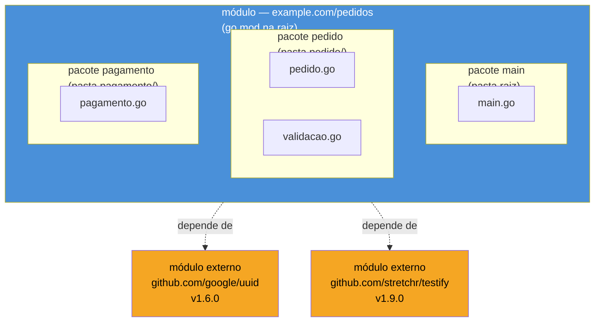
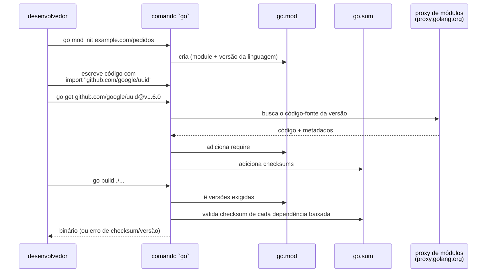

# Módulos e o toolchain

> [!abstract] TL;DR
> Um **módulo Go** é uma coleção de pacotes versionada como unidade, declarada num único arquivo — `go.mod` — que registra o *module path* (o nome canônico, geralmente uma URL) e as dependências externas com suas versões exatas. Não existe `package.json` cheio de metadados nem um `pom.xml` de centenas de linhas: `go mod init` cria o arquivo em uma linha, `go get` adiciona dependências, `go mod tidy` mantém tudo em sincronia com o código, e um segundo arquivo, `go.sum`, trava os checksums criptográficos de cada dependência para builds reprodutíveis. Esse desenho substituiu, a partir do Go 1.11 (2018), um sistema anterior — o **GOPATH** — que forçava todo código Go do mundo a viver dentro de uma única árvore de diretórios fixa. E módulos são só metade da história: o comando `go` embute, sem instalar nada de terceiros, um formatador (`go fmt`), um analisador estático (`go vet`), um executor de testes (`go test`) e um servidor de documentação (`go doc`) — a filosofia "baterias inclusas" que torna Go incomumente autossuficiente pra rodar num time novo sem debate de tooling.

## De onde vem esse `go.mod` tão enxuto

Imagine alguém que acabou de sair de um projeto Node.js, onde todo repositório abre com um `package.json` — nome, versão, scripts, dependências com faixas de versão em `^1.2.3`, um `package-lock.json` de milhares de linhas gerado por baixo dos panos, e um `node_modules/` que só cresce. Ou alguém vindo de Python, onde `requirements.txt` é uma lista solta de nomes e versões que ninguém garante estar sincronizada com o que o código realmente importa, e ferramentas como Poetry ou uv existem justamente para tapar esse buraco. Ou de Java, onde um `pom.xml` do Maven — ou um `build.gradle` do Gradle — descreve coordenadas de artefato (`groupId:artifactId:version`), plugins de build, e um ciclo de vida inteiro de fases.

Essa pessoa abre o primeiro projeto Go de verdade e encontra isto:

```go title="go.mod"
module example.com/pedidos

go 1.23

require (
    github.com/google/uuid v1.6.0
    github.com/stretchr/testify v1.9.0
)
```

Sete linhas. Sem seção de scripts, sem *devDependencies* separadas de *dependencies*, sem plugin de build. A pergunta natural é: como um arquivo tão pequeno resolve o mesmo problema — declarar dependências, travar versões, garantir reprodutibilidade — que em outros ecossistemas exige um arquivo de configuração denso mais uma ferramenta de terceiros por cima? A resposta tem duas partes: primeiro, o próprio comando `go` já é o gerenciador de dependências (não existe um "npm do Go" separado do compilador); segundo, Go correu atrás desse problema tarde — mais de oito anos depois do primeiro release — e aprendeu com as dores de quem veio antes. Entender essa história é o que explica por que `go.mod` parece "enxuto demais" para quem vem de outro ecossistema: ele não é enxuto por acidente, é o resultado de uma segunda tentativa.

## Antes de módulos: o mundo do GOPATH

Da primeira versão pública de Go (2009) até o Go 1.11 (agosto de 2018), não existia o conceito de módulo. Todo código Go — o seu, o de qualquer dependência, a biblioteca padrão — precisava viver dentro de uma única árvore de diretórios apontada pela variável de ambiente `GOPATH`, tipicamente algo como `~/go`. Dentro dela, uma estrutura rígida:

```
$GOPATH/
├── src/
│   └── github.com/
│       └── seu-usuario/
│           └── seu-projeto/
│               └── main.go
├── pkg/        # pacotes compilados (cache de build)
└── bin/        # binários instalados via `go install`
```

O *import path* de um pacote era, literalmente, o caminho relativo dentro de `GOPATH/src` — não havia distinção entre "onde o código mora no disco" e "como ele é importado". Isso trazia um problema estrutural sério: **não havia versionamento de dependências**. Se o seu projeto e uma biblioteca de terceiros dependessem de duas versões diferentes de uma terceira biblioteca, azar — só existia um clone daquele repositório em `GOPATH/src`, e ele estava numa única revisão do Git. Ferramentas de terceiros como `godep`, `glide` e `dep` surgiram justamente para tapar esse buraco (vendoring manual, arquivos de lock não-oficiais), numa fragmentação que lembra o período pré-npm-lockfile do JavaScript ou o Python pré-`pip freeze`. Além disso, todo projeto Go do seu computador — não importa de qual cliente ou empresa — precisava conviver dentro da mesma árvore `$GOPATH/src`, o que soava estranho pra quem vinha de qualquer outra linguagem, onde cada projeto tem sua própria pasta e suas próprias dependências isoladas (um `node_modules/` local, um `venv/` do Python, um `.m2` compartilhado mas versionado por coordenada).

> [!question]- Por que demorou tanto pra Go resolver isso?
> A equipe do Go priorizou deliberadamente simplicidade e velocidade de build no design inicial, e gerenciamento de dependências é um problema genuinamente difícil de acertar (resolução de versões conflitantes, garantir builds reprodutíveis, não travar em SAT-solving). O RFC que virou Go Modules — a proposta de Russ Cox, "vgo" — foi construído sobre anos de experiência observando o que deu certo e errado em `dep` (a ferramenta "oficial mas experimental" que antecedeu Modules) e em gerenciadores de outras linguagens. Foi lançado como experimental no Go 1.11 (2018), amadurecido no 1.12 e 1.13, e só se tornou o padrão obrigatório — com `GOPATH` deprecado como mecanismo de projeto — no **Go 1.16** (fevereiro de 2021). Ou seja: da criação da linguagem até o modelo atual estabilizar, se passaram quase 12 anos.

**Go Modules** resolveu os dois problemas de uma vez: (1) cada projeto declara suas próprias dependências, com versões exatas, num arquivo dentro do próprio repositório — não numa árvore global compartilhada; e (2) um projeto Go pode viver em **qualquer diretório do disco**, sem relação nenhuma com `GOPATH`. Desde o Go 1.16, o comportamento padrão é `GO111MODULE=on` sempre — a variável de ambiente que ligava/desligava o modo módulos deixou de ter efeito prático, porque não existe mais "modo GOPATH" para se voltar.

## O que é um módulo (e como difere de um pacote)

A [[05 - Pacotes, imports e visibilidade|nota anterior]] cobriu **pacote**: uma pasta de arquivos `.go` que compartilham o mesmo `package nome` no topo, a unidade de organização e de controle de visibilidade (maiúscula exportado, minúscula privado). Um **módulo** é a camada acima disso — segundo a [referência oficial](https://go.dev/ref/mod#glos-module), *"a collection of packages that are released, versioned, and distributed together"*. Na prática: um repositório Git normalmente é um módulo; um módulo contém um ou mais pacotes (cada subpasta com `.go` dentro é, potencialmente, outro pacote); e o módulo inteiro é identificado por um único **module path** — geralmente a URL de onde ele pode ser baixado (`github.com/usuario/projeto`), mas tecnicamente qualquer string única.



Ou seja: **pacote** organiza código dentro de um repositório; **módulo** organiza *o repositório inteiro* como uma unidade versionada e distribuível, com suas dependências declaradas. Todo módulo tem exatamente um `go.mod` na raiz; um repositório pode, em casos avançados (não cobertos aqui), conter mais de um módulo — mas o caso comum, e o recomendado, é um repositório = um módulo.

| Cross-stack | Equivalente aproximado |
|---|---|
| `go.mod` | `package.json` (Node) · `pyproject.toml`/`requirements.txt` (Python) · `pom.xml`/`build.gradle` (Java) |
| `go.sum` | `package-lock.json`/`yarn.lock` (Node) · `poetry.lock`/`uv.lock` (Python) · hash de dependência no `.m2` (Java, menos explícito) |
| module path | `name` do `package.json` · `groupId:artifactId` do Maven |
| `go get` | `npm install` · `pip install` · adicionar dependência no `pom.xml` |
| `GOPATH` (histórico) | mais próximo do antigo `$CLASSPATH` global do Java pré-Maven do que de qualquer coisa em Node/Python |

## `go mod init` e o nascimento de um módulo

Todo módulo começa com um comando, rodado na raiz do que vai ser o repositório:

```bash
mkdir pedidos && cd pedidos
go mod init example.com/pedidos
```

Isso cria um `go.mod` de duas linhas:

```go title="go.mod"
module example.com/pedidos

go 1.23
```

A primeira linha declara o **module path** — o nome canônico usado por qualquer import dentro (ou fora) desse módulo. A segunda declara a versão mínima da linguagem que esse módulo requer (não a versão instalada no seu computador — a versão de sintaxe/comportamento que o código assume; builds em toolchains mais antigas falham com uma mensagem clara).

> [!question]- O module path precisa ser uma URL real?
> Não é obrigatório tecnicamente — `go mod init meuprojeto` funciona e cria um módulo válido para uso local. Mas a convenção forte, e o que se torna necessário no momento em que o módulo precisa ser importado por *outro* projeto, é usar um caminho que resolve para onde o código pode ser baixado: `github.com/usuario/repo`, `gitlab.com/empresa/projeto`, ou um domínio próprio como `example.com/pedidos` (mesmo domínios fictícios como `example.com` são aceitos pelo compilador — só falham se alguém realmente tentar buscar o código pela rede). Times que só publicam serviços internos, nunca importados por terceiros, costumam usar o path do repositório interno (`github.com/minhaempresa/servico-pedidos`) por consistência, não por necessidade técnica estrita.

## Adicionando dependências: `go get`

Com o módulo criado, adicionar uma dependência externa é um comando:

```bash
go get github.com/google/uuid@v1.6.0
```

Isso faz três coisas: baixa o código-fonte daquela versão exata (para o cache local do módulo, geralmente `$GOPATH/pkg/mod` — sim, `GOPATH` ainda existe como *cache*, só não como raiz de projeto), adiciona uma linha `require` ao `go.mod`, e registra os checksums correspondentes no `go.sum`. Omitir `@versão` pega a última tag estável disponível.

```go title="go.mod (após go get)"
module example.com/pedidos

go 1.23

require github.com/google/uuid v1.6.0
```

Usar a dependência no código é só um import comum, exatamente como qualquer pacote da biblioteca padrão:

```go
package main

import (
    "fmt"

    "github.com/google/uuid"
)

func main() {
    id := uuid.New()
    fmt.Println("Novo pedido:", id)
}
```



## `go mod tidy`: mantendo o `go.mod` honesto

Código muda com frequência bem maior que a disciplina de quem lembra de atualizar um arquivo de manifesto à mão. `go mod tidy` resolve isso automaticamente, varrendo todo o código-fonte do módulo e comparando com o que está declarado:

```bash
go mod tidy
```

Ele faz duas coisas, na mesma passada: **adiciona** ao `go.mod` qualquer dependência que o código importa mas que ainda não estava declarada (útil se alguém colou um trecho de código com um novo `import` sem rodar `go get` primeiro); e **remove** do `go.mod` qualquer dependência que estava declarada mas que nenhum arquivo `.go` do módulo importa mais — o cenário clássico de "eu apaguei a função que usava essa lib, mas esqueci de tirar do manifesto". É o comando mais rodado no dia a dia de um projeto Go, e o hábito recomendado é rodá-lo antes de cada commit que mexe em imports.

```
antes:  go.mod declara 5 dependências, código só usa 3
        ↓ go mod tidy
depois: go.mod declara exatamente as 3 usadas
        (as 2 órfãs são removidas; go.sum é recalculado)
```

## `go.sum`: integridade, não versão

Enquanto `go.mod` diz **quais versões** o projeto requer, `go.sum` guarda os **checksums criptográficos** (hashes SHA-256) do conteúdo exato de cada versão de cada dependência baixada — incluindo dependências transitivas (as dependências das suas dependências). Um trecho típico:

```title="go.sum (trecho)"
github.com/google/uuid v1.6.0 h1:NIvaJDMOsjHA8n1jAhLSgzrAzy1Hgr+hNrb59iEiEmM=
github.com/google/uuid v1.6.0/go.mod h1:TIyPZe4MgqvfeYDBFedMoGGpEw/LqOeaOT+nhxU+yHo=
```

Cada linha trava o hash do **código-fonte** daquela versão (`h1:...`) e, separadamente, o hash do **próprio `go.mod`** dessa dependência (`/go.mod h1:...`). Na hora do build, o `go` recalcula esses hashes a partir do que foi baixado e compara com o que está gravado — se não baterem, o build **falha**, não continua com um aviso. Esse mecanismo é o que dá a Go builds reprodutíveis e resistentes a um ataque de *supply chain* onde alguém sub-repuça o conteúdo de uma versão já publicada (reescrever uma tag no GitHub, por exemplo): mesmo que o nome e a versão pareçam idênticos, o conteúdo alterado gera um hash diferente e o build recusa seguir.

> [!question]- `go.sum` precisa ser commitado no Git?
> Sim — sempre. Ele é parte do contrato de reprodutibilidade do build, exatamente como um `package-lock.json` ou `poetry.lock` são commitados. Ignorá-lo no `.gitignore` (um erro comum de quem vem de ecossistemas onde o lockfile é opcional) quebra a garantia central de que "todo mundo que builda este módulo baixa exatamente o mesmo código" — dois desenvolvedores rodando `go build` em datas diferentes, sem `go.sum` fixo, poderiam acabar validando (ou não recusando) conteúdo diferente para a "mesma" versão declarada.

## Semantic import versioning: versões e o caso do `/v2`

Go segue [versionamento semântico](https://semver.org/) (`MAJOR.MINOR.PATCH`) para módulos, com uma regra que surpreende quem vem de outros ecossistemas: **a partir da versão major 2, o número da major entra no próprio module path**. Um módulo na v1 (implícita) e o mesmo módulo na v2 são, para efeitos de import, dois módulos com nomes diferentes:

```go
// v0 ou v1 — sem sufixo no path
import "github.com/usuario/biblioteca"

// v2 — o path inclui /v2
import "github.com/usuario/biblioteca/v2"

// v3 — /v3, e assim por diante
import "github.com/usuario/biblioteca/v3"
```

E o `go.mod` **daquela dependência**, na v2+, precisa declarar o mesmo sufixo no próprio module path:

```go title="go.mod da biblioteca, na v2"
module github.com/usuario/biblioteca/v2

go 1.23
```

A razão de design, segundo a [referência oficial de versionamento](https://go.dev/ref/mod#versions), é permitir que **duas major versions incompatíveis da mesma biblioteca coexistam no grafo de dependências** de um mesmo projeto — algo impossível no modelo antigo do GOPATH (onde só existia uma cópia de cada import path), e que em outros ecossistemas costuma exigir renomear o pacote manualmente (`import numpyv2 as np2`) ou aceitar conflito. Em Go, como o path muda, o compilador enxerga `biblioteca` e `biblioteca/v2` como dois módulos genuinamente distintos — podem ser importados lado a lado sem colisão, o que facilita migrações incrementais.

| Versão | Sufixo no path | Exemplo |
|---|---|---|
| v0.x.x, v1.x.x | nenhum | `github.com/usuario/lib` |
| v2.x.x | `/v2` | `github.com/usuario/lib/v2` |
| v3.x.x | `/v3` | `github.com/usuario/lib/v3` |

> [!warning] Esquecer o `/v2` no path é o erro clássico de quem publica uma major version nova
> Quem mantém uma biblioteca e faz um *breaking change* justificando uma v2.0.0 no Git (tag `v2.0.0`), mas esquece de atualizar a linha `module` no próprio `go.mod` para incluir `/v2`, produz um módulo que o `go get` recusa resolver corretamente — a ferramenta detecta a incompatibilidade entre a tag semver e o path declarado. A regra do *semantic import versioning* não é uma sugestão de estilo: é aplicada mecanicamente pelo comando `go`.

## O toolchain embutido: baterias inclusas

Aqui está a segunda metade da filosofia de Go: o mesmo binário `go` que compila seu código também formata, analisa estaticamente, testa e documenta — sem precisar instalar um formatador de terceiros (como Prettier), um linter à parte (ESLint, Pylint) ou um gerador de docs separado (Sphinx, JSDoc) só para ter esse mínimo funcionando. Um resumo dos comandos mais usados no dia a dia:

### `go build` — compila, não executa

```bash
go build ./...
```

Compila todos os pacotes do módulo (o `./...` significa "este diretório e todos os subdiretórios") e produz um binário — mas só se o pacote raiz for `package main`; pacotes de biblioteca compilam só para validar que o código está correto, sem gerar executável solto. Por padrão, o binário nasce no diretório atual com o nome do módulo. Cross-compilation, flags de otimização (`-ldflags`), embutir versão no binário e outras técnicas de build de produção ficam para o Galho 18 — aqui, `go build` é só "compila o que existe agora, do jeito mais simples".

### `go run` — compila e executa, sem deixar binário

```bash
go run main.go
go run .
```

Combina `go build` num diretório temporário com a execução imediata do binário resultante, descartando-o ao final. É o comando do dia a dia durante desenvolvimento — o equivalente a `python script.py` ou `node script.js` em termos de fricção, mesmo Go sendo compilado.

### `go test` — existe, e é robusto (aprofundado no Galho 15)

```bash
go test ./...
```

Roda qualquer arquivo terminado em `_test.go` como suíte de testes, sem framework externo — `testing` é pacote da biblioteca padrão. Esta nota só registra que o comando existe e é a porta de entrada; tabelas de teste, *benchmarks*, `testify`, mocks e fuzzing têm nota dedicada mais adiante na trilha.

### `go fmt` / `gofmt` — um único estilo, sem debate

```bash
go fmt ./...
```

Reformata o código para o estilo canônico de Go — indentação, espaçamento, alinhamento de campos em structs — de forma **determinística e não configurável**. Não existe `.prettierrc` nem arquivo de regras: todo código Go formatado por `gofmt` (o binário que `go fmt` invoca por baixo) fica visualmente idêntico, não importa quem escreveu. Esse é um dos traços mais citados da cultura Go: elimina de vez a discussão de estilo (tabs vs. espaços, onde a chave abre) que consome tempo real em outros ecossistemas.

### `go vet` — análise estática embutida

```bash
go vet ./...
```

Examina o código em busca de erros que compilam mas quase certamente estão errados em tempo de execução: um `Printf` com o número errado de argumentos para os `%v`/`%d` do formato, comparação de ponteiro que nunca pode ser `true`, um `struct` copiado que carrega um `sync.Mutex` por valor (invalidando o lock). `go vet` roda automaticamente antes de `go test`, mas pode — e deve — ser rodado isoladamente em CI. Análises de terceiros mais elaboradas (golangci-lint, agregando dezenas de linters) ficam para o Galho 20; `go vet` é o mínimo oficial, sempre presente, sem instalar nada.

### `go doc` — documentação a partir do próprio código

```bash
go doc fmt.Println
```

```
package fmt // import "fmt"

func Println(a ...any) (n int, err error)
    Println formats using the default formats for its operands and writes to
    standard output. Spaces are always added between operands and a newline
    is appended. It returns the number of bytes written and any write error
    encountered.
```

Go não usa um formato de docstring separado (como o Sphinx do Python ou o Javadoc do Java) — comentários de linha imediatamente acima de uma declaração exportada **são** a documentação, e `go doc` os extrai e formata na hora, direto do código-fonte (local ou de uma dependência já baixada). O mesmo mecanismo alimenta o [pkg.go.dev](https://pkg.go.dev), o índice público de documentação de todo módulo publicado — não existe passo de *build de docs* separado do desenvolvimento normal.

### `go env` — inspecionar a configuração do toolchain

```bash
go env GOPATH
go env GOOS GOARCH
```

Mostra (ou, com `-w`, escreve) variáveis de ambiente que o toolchain usa — o `GOPATH` de cache, o sistema operacional e arquitetura alvo (relevantes para cross-compile, Galho 18), o modo de módulos, o proxy configurado. Útil sobretudo para depurar "por que esse build está resolvendo essa versão" ou "onde o `go` está procurando o cache".

### `go install` — compila e instala um binário utilizável

```bash
go install github.com/exemplo/ferramenta@latest
```

Parecido com `go build`, mas o resultado vai para `$GOPATH/bin` (ou `$GOBIN`, se definido) em vez do diretório atual — o jeito padrão de instalar ferramentas de linha de comando escritas em Go (o próprio `golangci-lint`, mencionado acima, costuma ser instalado assim). Diferente de `go get`, que hoje serve só para gerenciar dependências do `go.mod` do projeto atual, `go install` existe justamente para colocar um binário utilizável no `PATH`.

| Comando | O que faz | Compara com |
|---|---|---|
| `go build` | compila, gera binário local | `tsc` / `javac` |
| `go run` | compila + executa, descarta o binário | `ts-node script.ts` / `python script.py` |
| `go test` | roda testes de arquivos `_test.go` | `pytest` / `jest` (mas embutido) |
| `go fmt` | formata no estilo canônico | `prettier --write` (mas sem config) |
| `go vet` | análise estática embutida | `eslint` básico / `mypy` leve |
| `go doc` | extrai docs do código-fonte | Sphinx / Javadoc (mas sem build separado) |
| `go env` | inspeciona config do toolchain | `npm config get` |
| `go install` | compila e instala binário no PATH | `npm install -g` / `pip install --user` |

## Na prática: um `go.mod` comentado do início ao fim

```go title="go.mod"
// A linha module declara o caminho canônico deste módulo — usado por
// qualquer import interno (entre pacotes do próprio projeto) e por
// qualquer projeto externo que venha a importar este módulo.
module example.com/pedidos

// A versão mínima da linguagem Go que este módulo assume. Builds em
// toolchains mais antigas que 1.23 falham com erro explícito.
go 1.23

// Dependências diretas: bibliotecas que o código deste módulo importa
// de verdade. Mantidas em sincronia com o código via `go mod tidy`.
require (
    github.com/google/uuid v1.6.0
    github.com/stretchr/testify v1.9.0
)

// Dependências indiretas (transitivas) aparecem aqui, marcadas com o
// comentário // indirect, quando o `go mod tidy` precisa fixar a versão
// de algo que uma dependência direta usa, mas que o seu código nunca
// importa diretamente.
require (
    github.com/davecgh/go-spew v1.1.1 // indirect
    github.com/pmezard/go-difflib v1.0.0 // indirect
    gopkg.in/yaml.v3 v3.0.1 // indirect
)
```

## Armadilhas comuns

> [!warning] Trabalhar fora de um módulo (sem `go.mod`)
> Rodar `go build`, `go run` ou `go get` num diretório que não está dentro de uma árvore com `go.mod` na raiz (ou numa ancestral) faz o toolchain reclamar — desde o Go 1.16, não existe mais um "modo GOPATH" de fallback silencioso. A mensagem costuma ser algo como `go: cannot find main module` ou `go: go.mod file not found in current directory or any parent directory`. O conserto é sempre o mesmo: `go mod init <path>` na raiz do projeto, uma vez, antes de qualquer outro comando.

> [!warning] Confundir module path com caminho de filesystem
> `module example.com/pedidos` não precisa (e frequentemente não corresponde) ao caminho real da pasta no disco — você pode clonar um repositório `github.com/usuario/projeto` numa pasta chamada `~/qualquer-coisa/teste123/` e o build funciona normalmente, porque imports resolvem pelo module path declarado no `go.mod`, não pela posição física no filesystem. Isso confunde quem vem do modelo antigo do GOPATH, onde caminho físico e import path eram literalmente a mesma coisa — e também confunde quem espera um comportamento parecido ao `sys.path`/`PYTHONPATH` do Python, que de fato depende de onde os arquivos estão no disco.

> [!warning] Esquecer `go mod tidy` depois de remover imports
> Apagar a última chamada a uma biblioteca do código, mas esquecer de rodar `go mod tidy`, deixa uma entrada órfã em `go.mod` — não quebra o build, mas polui o manifesto com uma dependência que ninguém usa mais (e que continua sendo baixada e verificada em todo `go mod download`/CI). Em code review, um `go.mod` que ainda lista uma lib cujo import sumiu do diff é sinal de que `tidy` não rodou antes do commit.

## Como explicar em inglês

> A Go module is a versioned collection of packages declared in a single `go.mod` file at the repository root — it records the module path (typically the URL the code can be fetched from) and the exact versions of every direct dependency. `go mod init` creates that file, `go get` adds a dependency, and `go mod tidy` reconciles the manifest with whatever the code actually imports, adding what's missing and pruning what's unused. A second file, `go.sum`, pins the cryptographic checksum of every dependency's content, so builds fail loudly instead of silently trusting a tampered package. Go follows semantic import versioning: starting at major version 2, the version number becomes part of the import path itself (`/v2`, `/v3`), which lets two incompatible major versions of the same library coexist in the same dependency graph. This whole system replaced GOPATH, the pre-2018 model where every Go project had to live inside one global directory tree with no per-project dependency versioning at all. And modules are only half the story — the same `go` binary that compiles your code also formats it (`go fmt`), statically analyzes it (`go vet`), runs its tests (`go test`), and serves its documentation (`go doc`), all without installing a single third-party tool.

| Termo PT | Termo EN |
|---|---|
| módulo | module |
| caminho do módulo | module path |
| cadeia de ferramentas / toolchain | toolchain |
| dependência direta | direct dependency |
| dependência transitiva | transitive dependency |
| análise estática | static analysis |
| checksum / soma de verificação | checksum |
| build reproduzível | reproducible build |
| versionamento semântico de import | semantic import versioning |
| arquivo de manifesto | manifest file |
| árvore de diretório global (histórico) | global directory tree (GOPATH) |
| formatação canônica | canonical formatting |

## O que vem a seguir

Com pacotes (nota 05) e módulos/toolchain (esta nota) no repertório, os fundamentos de **organização** de um projeto Go estão completos: como código se agrupa em pacotes, como pacotes se agrupam em módulos versionados, e quais ferramentas oficiais mantêm tudo formatado, testado e documentado sem depender de terceiros. A peça que falta agora não é mais sobre organização — é sobre **como Go representa dados na memória**. A [[07 - Ponteiros e o modelo de memória|nota 07]] desce um nível de abstração: o que um ponteiro é de fato, `&`/`*`, por que Go não tem aritmética de ponteiros (ao contrário de C), a diferença entre passar por valor e por referência, e como isso se conecta com escape analysis e a fronteira entre stack e heap — o alicerce necessário para entender, mais adiante na trilha, por que `struct` grandes costumam ser passadas por ponteiro e por que um `sync.Mutex` nunca deve ser copiado por valor (o mesmo aviso que apareceu de relance na seção de `go vet` acima).

## Veja também

- [[05 - Pacotes, imports e visibilidade|Pacotes, imports e visibilidade]] — nota anterior deste galho, cobre a unidade que o módulo agrupa
- [[07 - Ponteiros e o modelo de memória|Ponteiros e o modelo de memória]] — próxima nota, desce ao modelo de memória
- [[03-Dominios/Tecnologia/Go/15 - Testes/index|Testes]] — Galho 15, aprofunda `go test` a fundo (table-driven, testify, benchmarks, fuzzing)
- [[03-Dominios/Tecnologia/Go/18 - Cloud-native e produção/index|Cloud-native e produção]] — Galho 18, aprofunda `go build` de produção (cross-compile, `-ldflags`, distroless)
- [[03-Dominios/Tecnologia/Go/20 - Go idiomático/index|Go idiomático]] — Galho 20, cobre linters de terceiros como golangci-lint
- [[03-Dominios/Tecnologia/Go/index|Trilha Go]] (MOC central)
- [[03-Dominios/Tecnologia/Python/Core/09 - Módulos e imports|Módulos e imports (Python)]] — nota irmã na trilha Python, mesmo tema visto do ângulo do sistema de import dinâmico, sem versionamento nativo

## Fontes

- The Go Authors. *Go Modules Reference*. go.dev. https://go.dev/ref/mod (acessado em 2026-07-16)
- The Go Authors. *Using Go Modules*. go.dev/doc. https://go.dev/doc/modules/managing-dependencies (acessado em 2026-07-16)
- The Go Authors. *go command — Module maintenance*. pkg.go.dev/cmd/go. https://pkg.go.dev/cmd/go#hdr-Module_maintenance (acessado em 2026-07-16)
- Cox, R. *Go Modules: v2 and Beyond*. The Go Blog, go.dev. https://go.dev/blog/v2-go-modules (acessado em 2026-07-16)
- Cox, R. *Using Go Modules*. The Go Blog, go.dev. https://go.dev/blog/using-go-modules (acessado em 2026-07-16)
- The Go Authors. *go help gopath* / *GOPATH*. go.dev/doc. https://go.dev/doc/gopath_code (acessado em 2026-07-16)
- The Go Authors. *Module version numbering*. go.dev/ref/mod#versions. https://go.dev/ref/mod#versions (acessado em 2026-07-16)
- The Go Authors. *go doc*. pkg.go.dev/cmd/go. https://pkg.go.dev/cmd/go#hdr-Show_documentation_for_package_or_symbol (acessado em 2026-07-16)
- The Go Authors. *gofmt*. pkg.go.dev/cmd/gofmt. https://pkg.go.dev/cmd/gofmt (acessado em 2026-07-16)
- The Go Authors. *go vet*. pkg.go.dev/cmd/vet. https://pkg.go.dev/cmd/vet (acessado em 2026-07-16)
