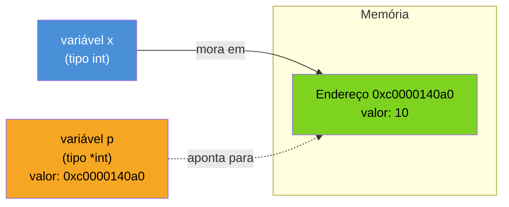
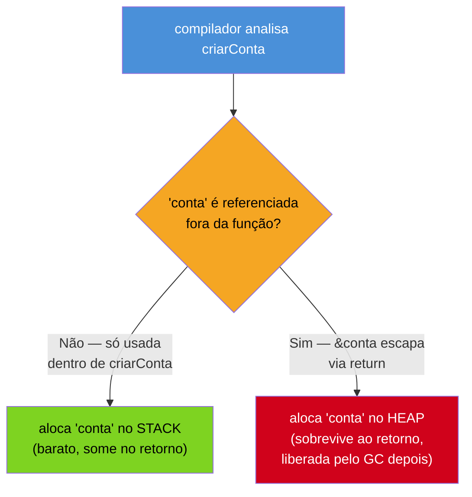

# Ponteiros e o modelo de memória

> [!abstract] TL;DR
> Toda chamada de função em Go copia seus argumentos — Go é **sempre pass-by-value**, sem exceção. Se uma função recebe um `int` ou uma `struct` por valor, ela recebe uma cópia; mudar a cópia nunca muda o original do chamador. Um **ponteiro** (`*T`) é o mecanismo explícito para escapar dessa regra: em vez de copiar o valor, você copia o *endereço* de memória onde o valor mora, e a função usa esse endereço para mutar o original de verdade. `&x` pega o endereço de `x`; `*p` desreferencia `p`, acessando o valor que está naquele endereço; o zero value de qualquer ponteiro é `nil`. Diferente de C, Go **não tem aritmética de ponteiro** — não existe `p++`, e por isso ponteiros em Go são muito mais seguros (e muito mais limitados) do que em C. E diferente da intuição de "isso deve vazar memória", o compilador de Go decide sozinho, via **escape analysis**, se um valor apontado vive na pilha (stack) ou no monte (heap) — você nunca precisa (nem pode) gerenciar isso manualmente.

## A função que devia mudar o valor, e não mudou

Imagine que você está portando uma rotina simples de Java para Go: dado um contador, você quer uma função que o incremente.

```java
// Java
static void incrementar(int contador) {
    contador = contador + 1;
}

int total = 10;
incrementar(total);
System.out.println(total); // 10 — Java também não muda aqui, primitivos são por valor
```

Em Java, isso já não funciona para tipos primitivos — `contador` dentro do método é uma cópia local de `total`. Mas se `total` fosse um objeto (uma lista, por exemplo), mutar um campo dele *dentro* do método afetaria o objeto original, porque Java passa a **referência ao objeto** por valor — a referência é copiada, mas aponta para o mesmo objeto na heap.

Você escreve o equivalente direto em Go, esperando o comportamento "objeto muta":

```go
func incrementar(contador int) {
    contador = contador + 1
}

total := 10
incrementar(total)
fmt.Println(total) // 10 — a função recebeu uma CÓPIA de total
```

Até aqui, nada surpreendente — `int` é primitivo em qualquer linguagem. O choque vem quando você tenta o mesmo com uma `struct`, esperando que ela se comporte como um "objeto" de Java ou Python:

```go
type ContaBancaria struct {
    Saldo float64
}

func depositar(conta ContaBancaria, valor float64) {
    conta.Saldo += valor // muda só a CÓPIA local de conta
}

minhaConta := ContaBancaria{Saldo: 100}
depositar(minhaConta, 50)
fmt.Println(minhaConta.Saldo) // 100 — nada mudou!
```

Isso surpreende de verdade quem vem de Python (onde tudo é referência a objeto) ou de Java (onde um objeto passado como parâmetro, mesmo que a referência seja copiada, ainda aponta para o mesmo objeto na heap — mutar um campo dele afeta o original). Em Go, `ContaBancaria` é um **valor** — uma `struct` não é um "objeto" com identidade própria, é um agregado de campos que se comporta exatamente como um `int` na hora de ser passado para uma função: copiado, por inteiro, campo a campo.

A pergunta que esta nota responde é: como você diz para uma função "mude o original, não uma cópia"? A resposta é o assunto inteiro daqui para frente — o ponteiro.

> [!info] O que esta nota assume
> Você já leu as notas 01 a 06 — sabe declarar variáveis, escrever funções com múltiplo retorno, e organizar código em pacotes e módulos. Ainda não vimos `struct` em profundidade (isso é o [[03-Dominios/Tecnologia/Go/02 - Tipos, structs e métodos/index|Galho 2]]) nem métodos com receiver — aqui, `struct` aparece só como "um valor composto que também é copiado por padrão", o suficiente para entender ponteiros. Slices, maps e channels aparecem no fim desta nota só como menção — a mecânica interna deles é o [[03-Dominios/Tecnologia/Go/05 - Coleções e dados/index|Galho 5]].

## O que é um ponteiro: endereço, não valor

Um ponteiro é uma variável cujo valor é o **endereço de memória** de outra variável — não o valor em si. A analogia mais direta: se uma variável comum é uma **casa** (um lugar na memória com um valor morando dentro), um ponteiro é o **endereço** dessa casa, escrito num pedaço de papel. Você pode carregar o papel com o endereço para qualquer lugar, passá-lo para outra função, guardá-lo numa outra variável — e quem tiver o papel sabe exatamente onde ir bater à porta e mudar o que está lá dentro. O papel não é a casa; mas com o papel em mãos, você alcança a casa de qualquer lugar.



Três operadores fazem todo o trabalho:

| Operador | Nome | O que faz |
|---|---|---|
| `*T` | tipo ponteiro | declara "um ponteiro para um valor do tipo `T`" |
| `&x` | endereço-de | devolve o endereço de `x` — um valor do tipo `*T` |
| `*p` | desreferência | acessa (lê ou escreve) o valor no endereço guardado em `p` |

```go
x := 10
p := &x        // p é *int, guarda o endereço de x
fmt.Println(p)  // algo como 0xc0000140a0 — o endereço, não 10
fmt.Println(*p) // 10 — desreferenciar p dá o valor que está naquele endereço

*p = 20        // escreve 20 no endereço que p aponta — muda x de verdade
fmt.Println(x)  // 20
```

Repare que `*` tem dois papéis diferentes dependendo de onde aparece — na **declaração de tipo** (`p := new(int)`... na verdade veja `var p *int`), `*int` significa "tipo ponteiro para `int`"; numa **expressão**, `*p` significa "desreferencie `p`". É a mesma sintaxe de C, e a fonte mais comum de confusão para quem está vendo isso pela primeira vez — o contexto (declaração vs. expressão) decide o que `*` está fazendo.

### O zero value de um ponteiro é `nil`

Um ponteiro declarado sem inicializar não aponta para lugar nenhum — seu zero value, como já visto na nota 02, é `nil`:

```go
var p *int
fmt.Println(p)       // <nil>
fmt.Println(p == nil) // true

// fmt.Println(*p)   // PANIC: runtime error: invalid memory address or nil pointer dereference
```

`nil` aqui não é "endereço zero válido" — é um valor sentinela que significa "este ponteiro não aponta para nada". Desreferenciar um ponteiro `nil` (`*p` quando `p == nil`) é um dos poucos jeitos de causar um `panic` em Go só de ler uma variável, e é a primeira armadilha desta nota, detalhada mais abaixo.

## Go é sempre pass-by-value — sem exceção

Esta é a regra mais importante da nota, e vale repetir sem meias-palavras: **toda chamada de função em Go copia os argumentos.** Não existe passagem "por referência" na sintaxe de Go — nenhuma anotação, nenhuma palavra-chave, nenhum modo alternativo de chamar uma função que evite a cópia. O que existe é a possibilidade de você copiar um **ponteiro** em vez de copiar o valor — e como um ponteiro é só um endereço (tipicamente 8 bytes numa máquina de 64 bits), copiá-lo é barato, e o que ele aponta pode ser mutado através dele.

```mermaid
flowchart TD
    subgraph SemPonteiro["Passagem por valor (sem ponteiro)"]
        A1["minhaConta.Saldo = 100"] --> A2["depositar(minhaConta, 50)"]
        A2 --> A3["parâmetro 'conta' é uma\nCÓPIA de minhaConta"]
        A3 --> A4["conta.Saldo += 50\nmuda só a cópia"]
        A4 --> A5["minhaConta.Saldo continua 100"]
    end

    subgraph ComPonteiro["Passagem de ponteiro"]
        B1["minhaConta.Saldo = 100"] --> B2["depositar(&minhaConta, 50)"]
        B2 --> B3["parâmetro 'conta' é uma\nCÓPIA do ENDEREÇO de minhaConta"]
        B3 --> B4["conta.Saldo += 50\ndesreferencia e muda o original"]
        B4 --> B5["minhaConta.Saldo vira 150"]
    end

    style A5 fill:#D0021B,color:#fff
    style B5 fill:#7ED321,color:#000
```



A versão corrigida da função `depositar`, agora recebendo um ponteiro:

```go
func depositar(conta *ContaBancaria, valor float64) {
    conta.Saldo += valor // desreferência automática — veja a próxima seção
}

minhaConta := ContaBancaria{Saldo: 100}
depositar(&minhaConta, 50)
fmt.Println(minhaConta.Saldo) // 150 — agora sim
```

`depositar` ainda recebe uma cópia — mas é uma cópia do **endereço** de `minhaConta`, não uma cópia da struct inteira. `conta` e `&minhaConta` guardam o mesmo endereço; `conta.Saldo += valor` escreve naquele endereço, e como é o mesmo endereço onde `minhaConta` mora, o efeito é visível para o chamador depois que a função retorna.

> [!question]- Isso não é a mesma coisa que "passagem por referência" de outras linguagens?
> É parecido no efeito, mas diferente no mecanismo — e a diferença importa. Em "passagem por referência" de verdade (C++ com `int&`, ou parâmetros `ref`/`out` de C#), o **parâmetro em si** é um alias da variável do chamador — não existe uma variável de ponteiro separada, o compilador reescreve todo acesso ao parâmetro para acessar a variável original diretamente. Em Go, o que você tem é passagem por valor de um **valor do tipo ponteiro** — `conta` é uma variável de verdade, com seu próprio endereço (o endereço onde o ponteiro em si está guardado), e o valor dela é o endereço de `minhaConta`. Você pode inclusive reatribuir `conta` para apontar para outra `ContaBancaria` dentro da função, sem que isso afete `minhaConta` nem `&minhaConta` no chamador. É "passagem por valor de um endereço", não "aliasing direto de variável" — sutil, mas é por isso que a comunidade Go insiste em dizer "Go é sempre pass-by-value" em vez de "Go tem passagem por referência para ponteiros".

### O contraste cross-stack completo

| Linguagem | O que é copiado ao passar um argumento | Ponteiro/referência explícito na sintaxe? |
|---|---|---|
| Go | Sempre o valor — se o valor é um ponteiro, copia-se o endereço | Sim (`*T`, `&`, `*p`) — opt-in explícito |
| Java | Primitivos: o valor. Objetos: a referência ao objeto (a referência em si é copiada) | Não existe sintaxe de ponteiro; toda referência de objeto é implícita |
| Python | Sempre uma referência ao objeto (não existe "valor primitivo" solto — até um `int` é objeto) | Não existe sintaxe de ponteiro; tudo é referência, sem opção de "copiar de verdade" sem `copy.deepcopy` |
| JavaScript | Primitivos: o valor. Objetos/arrays: a referência ao objeto | Não existe sintaxe de ponteiro |
| C | Sempre o valor — ponteiro é um valor como outro qualquer, mas com **aritmética** (`p++`, `p + 3`) | Sim, e mais poderoso (e mais perigoso) que Go |

O ponto que costuma confundir quem vem de Java ou Python: nessas linguagens, "objeto" e "referência" são a mesma coisa por padrão — você nunca opta explicitamente por passar por referência ou por valor, a linguagem decide por você com base no tipo. Em Go, a decisão é **sempre explícita e visível na assinatura da função**: `func f(c ContaBancaria)` copia a struct inteira; `func f(c *ContaBancaria)` copia só o endereço. Ler a assinatura já diz, sem ambiguidade, se a função pode mutar o argumento do chamador.

## Ponteiro para struct: o açúcar sintático `p.Campo`

Se `depositar` acima parece natural demais, é porque Go esconde um passo que C obriga você a escrever manualmente. Em C, acessar um campo através de um ponteiro para struct exige o operador `->`:

```c
/* C */
struct ContaBancaria *conta = &minhaConta;
conta->Saldo += valor;   /* -> obrigatório: (*conta).Saldo seria o longo */
```

Em Go, `p.Campo` funciona **tanto para uma struct quanto para um ponteiro para struct**, sem operador diferente — o compilador desreferencia automaticamente quando necessário:

```go
conta := &minhaConta   // conta é *ContaBancaria
conta.Saldo += valor   // açúcar para (*conta).Saldo += valor — Go faz a desreferência sozinho
```

`conta.Saldo` e `(*conta).Saldo` são exatamente equivalentes; a primeira forma é a que todo código Go idiomático usa, porque não há ambiguidade a evitar — o compilador sabe, pelo tipo de `conta`, se precisa desreferenciar ou não antes de acessar o campo. É uma das poucas concessões de "açúcar sintático" que Go faz, justamente porque `(*conta).Saldo` seria ruído visual sem ganho nenhum de clareza.

```go
type Ponto struct {
    X, Y int
}

func mover(p *Ponto, dx, dy int) {
    p.X += dx  // não precisa escrever (*p).X
    p.Y += dy
}

origem := Ponto{X: 0, Y: 0}
mover(&origem, 3, 4)
fmt.Println(origem) // {3 4}
```

## Construindo valores via ponteiro: `&T{}` e `new(T)`

Há dois jeitos idiomáticos de obter um ponteiro para um valor recém-criado, e eles não são exatamente equivalentes em uso — embora produzam resultados compatíveis para o caso simples.

### `&T{}` — o jeito idiomático

```go
conta := &ContaBancaria{Saldo: 100} // conta é *ContaBancaria
fmt.Println(conta.Saldo)            // 100
```

`&ContaBancaria{Saldo: 100}` cria um valor `ContaBancaria` (com o campo `Saldo` já preenchido) e imediatamente pega o endereço dele — numa única expressão. É de longe a forma mais comum no código Go real, sobretudo em construtores (`func NovaContaBancaria(saldo float64) *ContaBancaria { return &ContaBancaria{Saldo: saldo} }`).

### `new(T)` — aloca e devolve ponteiro para o zero value

```go
conta := new(ContaBancaria) // conta é *ContaBancaria, Saldo é 0 (zero value)
fmt.Println(conta.Saldo)     // 0
```

`new(T)` aloca memória para um valor do tipo `T`, zera essa memória (zero value), e devolve um `*T` apontando para ela. É equivalente a `&T{}` **apenas quando você não precisa inicializar nenhum campo** — `new(ContaBancaria)` e `&ContaBancaria{}` produzem o mesmo resultado, mas `&ContaBancaria{Saldo: 100}` não tem equivalente direto com `new`, porque `new` não aceita valores iniciais.

```go
// Equivalentes:
a := new(int)     // *int apontando para 0
b := &[]int{}[0]  // ninguém escreve assim — exemplo só para ilustrar, não é idiomático

// Mais realista:
c := new(int)
*c = 42
```

Na prática, `new` é raro em código Go idiomático fora de tipos primitivos avulsos (e mesmo aí, `var x int; p := &x` é mais comum) — a forma `&T{...}` domina para structs porque permite inicializar campos na mesma expressão que já cria o ponteiro.

> [!info] Cross-stack: `new` em Go vs. `new` em Java/C++
>
> | Linguagem | O que `new` faz |
> |---|---|
> | Go | Aloca memória zerada para o tipo, devolve um ponteiro (`*T`) — não chama construtor nenhum, porque Go não tem construtores |
> | Java | Aloca memória, **chama o construtor** da classe (`new ContaBancaria(100)`), devolve uma referência |
> | C++ | Aloca na heap, chama o construtor, devolve um ponteiro (`ContaBancaria* c = new ContaBancaria(100)`) — e, diferente de Go, você precisa lembrar de `delete` |
>
> A semelhança de nome engana: `new` em Go é uma função embutida muito mais simples — não existe a noção de "construtor" rodando junto, porque inicialização em Go é convenção (funções `NovaX`), não sintaxe de linguagem.

## Por que (e quando) usar ponteiro

Ponteiro em Go serve a dois motivos, e só dois — vale ter os dois nomeados com clareza, porque "usar ponteiro por via das dúvidas" é ruído, não idioma:

**1. Permitir que a função mute o valor original do chamador.** Já visto acima com `depositar`. Sem ponteiro, a função só enxerga uma cópia — qualquer mudança morre junto com o retorno da função.

**2. Evitar copiar uma struct grande a cada chamada.** Passar uma struct por valor copia **todos** os campos dela, recursivamente, toda vez que a função é chamada. Para uma struct pequena (dois ou três `int`s), isso é irrelevante — a cópia cabe num registrador de CPU e é mais barata que a indireção de um ponteiro. Para uma struct grande (muitos campos, ou campos que são arrays fixos), copiar a cada chamada tem custo real de CPU e memória:

```go
type Relatorio struct {
    Titulo      string
    Descricao   string
    Linhas      [1000]float64 // array fixo — 8000 bytes só nesse campo
    Metadados   map[string]string
}

// Ruim: copia ~8KB+ a cada chamada, mesmo que a função só leia
func processarPorValor(r Relatorio) { /* ... */ }

// Bom: copia só o endereço (8 bytes em 64 bits), qualquer que seja o tamanho de Relatorio
func processarPorPonteiro(r *Relatorio) { /* ... */ }
```

Repare que o segundo motivo vale **mesmo quando a função não precisa mutar nada** — passar `*Relatorio` só para leitura ainda evita a cópia cara. É por isso que boa parte do código Go real usa ponteiro para struct por padrão, mesmo em funções que só leem: a convenção prática (não regra da linguagem) costuma ser "structs pequenas e imutáveis, passe por valor; structs médias/grandes, ou que precisam ser mutadas, passe por ponteiro" — e, dentro de um mesmo tipo, ser consistente (não misturar `func (c Conta) Ler()` com `func (c *Conta) Escrever()` no mesmo tipo sem motivo).

> [!info] Fronteira: isso não é sobre métodos ainda
> Tudo até aqui trata de **funções comuns** recebendo `*T` como parâmetro. Quando o mesmo dilema (valor vs. ponteiro) aparece na declaração de um **método** — `func (c Conta) Ler()` vs. `func (c *Conta) Escrever()`, o chamado *receiver* — as regras ganham nuances próprias (consistência de conjunto de métodos, satisfação de interface, etc.) que são o assunto do [[03-Dominios/Tecnologia/Go/02 - Tipos, structs e métodos/index|Galho 2]]. Aqui você viu só o mecanismo puro do ponteiro; methods com receiver reaproveitam exatamente esse mecanismo, com regras adicionais por cima.

## Go não tem aritmética de ponteiro (e isso é proposital)

Em C, um ponteiro pode ser incrementado, somado a um inteiro, comparado por ordem — é assim que se percorre um array manualmente:

```c
/* C */
int arr[5] = {10, 20, 30, 40, 50};
int *p = arr;
p++;              /* agora aponta para arr[1] */
printf("%d\n", *p); /* 20 */
printf("%d\n", *(p + 2)); /* 40 — aritmética de ponteiro pura */
```

Em Go, isso simplesmente não compila:

```go
arr := [5]int{10, 20, 30, 40, 50}
p := &arr[0]
// p++              // ERRO DE COMPILAÇÃO: invalid operation: p++ (non-numeric type *int)
// p = p + 1         // ERRO DE COMPILAÇÃO: invalid operation: operator + not defined on p
```

Isso não é uma limitação acidental — é uma **decisão de segurança deliberada**. Aritmética de ponteiro é a origem de uma fração enorme dos bugs de memória mais graves de C/C++: acessar `arr[i]` com `i` fora dos limites, através de aritmética de ponteiro manual, não gera erro de compilação nem, na maioria dos casos, um crash imediato e óbvio — gera um acesso a memória que *não pertence* àquele array, silenciosamente, e o efeito só aparece muito depois, como corrupção de dados ou uma vulnerabilidade de segurança explorável (buffer overflow). Go elimina essa classe de bug inteira ao proibir a operação: um ponteiro em Go só pode apontar para onde ele já apontava, ou para onde `&` explicitamente mandou apontar — nunca para "um pouco mais adiante na memória", calculado à mão.

Isso não significa que Go não tenha jeito de percorrer memória contígua — é exatamente para isso que existem **slices**, com indexação segura (`arr[i]` com checagem de limites em tempo de execução) e iteração via `for range`, sem nenhuma necessidade de manipular endereços manualmente. O preço da segurança de Go é abrir mão de um punhado de otimizações de baixíssimo nível que a aritmética de ponteiro habilitava em C — na prática, um preço que a esmagadora maioria do código de aplicação nunca sente.

## Stack, heap e escape analysis (introdução)

Toda variável em Go precisa morar em algum lugar da memória enquanto o programa roda. Existem, essencialmente, dois lugares:

- **Stack (pilha):** memória de vida curta, organizada por função — cada chamada de função ganha seu próprio "quadro" (stack frame), e esse quadro inteiro é descartado, de uma vez, no instante em que a função retorna. Alocar e liberar na stack é essencialmente gratuito (é só mover um ponteiro de topo de pilha).
- **Heap (monte):** memória de vida mais longa, que sobrevive ao retorno da função que a criou. Alocar no heap é mais caro, e liberar exige que alguém (no caso de Go, o **garbage collector**) determine quando aquela memória não é mais referenciada por ninguém.

A pergunta natural, para quem vem de C, é: "se eu devolver um ponteiro para uma variável local, ela não devia sumir junto com o stack frame da função, deixando o ponteiro 'pendurado' apontando para lixo?"

```go
func criarConta(saldoInicial float64) *ContaBancaria {
    conta := ContaBancaria{Saldo: saldoInicial} // "variável local" — pareceria destinada ao stack
    return &conta                                // devolve o ENDEREÇO dessa variável local
}

minhaConta := criarConta(100)
fmt.Println(minhaConta.Saldo) // 100 — funciona perfeitamente, sem "dangling pointer"
```

Em C, escrever o equivalente literal (`return &conta;` onde `conta` é uma variável local não estática) é **comportamento indefinido** — o ponteiro devolvido aponta para uma região de stack que já foi reciclada para a próxima chamada de função, e o valor lá pode ter sido sobrescrito por qualquer coisa. É um dos erros clássicos de C, e compiladores modernos até avisam (`warning: address of stack memory associated with local variable returned`), mas o programa compila e pode até "parecer funcionar" às vezes — até não funcionar mais, de forma imprevisível.

Em Go, esse código é perfeitamente seguro, e a razão é o **escape analysis**: durante a compilação, o compilador analisa se uma variável é referenciada (via ponteiro) fora do escopo da função em que nasceu. Se for — como `conta` sendo devolvida via `&conta` — o compilador conclui que `conta` "escapa" da função, e a aloca no **heap** em vez do stack, desde o início. O stack frame de `criarConta` some quando a função retorna, mas `conta` nunca esteve ali — estava no heap, sobrevivendo normalmente, e o garbage collector vai liberá-la quando (e só quando) nenhum ponteiro mais apontar para ela.



O ponto central para reter desta nota: **você nunca escreve código para decidir stack ou heap** — não existe `malloc`/`free` em Go, não existe uma palavra-chave "aloque isso no heap". A decisão é inteiramente do compilador, automática, baseada em análise estática do fluxo do ponteiro. Isso é parte do que torna ponteiros em Go seguros por padrão: o mesmo padrão que seria um bug garantido em C ("retornar ponteiro para local") é simplesmente correto em Go, porque a linguagem foi desenhada para que a "intenção óbvia" do programador (devolver um ponteiro utilizável) sempre funcione.

> [!info] Isso é só o começo — o galho 17 aprofunda
> Escape analysis de verdade (como inspecionar as decisões do compilador com `go build -gcflags="-m"`, os casos em que uma alocação "escapa" por motivos não óbvios, como interfaces e closures afetam a análise) e o funcionamento do garbage collector (o algoritmo, as fases, como tunar `GOGC`) são o assunto do [[03-Dominios/Tecnologia/Go/17 - Runtime interno/index|Galho 17]]. O que você precisa reter aqui é só o modelo mental: heap vs. stack é decisão do compilador, não sua, e por isso "vazamento de stack" (o medo cross-stack de quem vem de C) não é uma preocupação real em Go.

## Slices, maps e channels: "reference-like", mas não ponteiros

Você já usou slices em exemplos de notas anteriores (`for _, n := range numeros`) sem precisar de `&` ou `*` — e é natural perguntar se eles são ponteiros disfarçados. Não são, tecnicamente: um slice é uma **struct pequena** (um ponteiro interno para o array subjacente, mais um comprimento e uma capacidade), e maps e channels são ponteiros internos para estruturas de dados mais complexas mantidas pelo runtime. O efeito prático é que passar um slice, map ou channel para uma função **não** copia todos os elementos — copia a struct pequena (ou o ponteiro interno), e por isso mutações no conteúdo (não na variável em si) são visíveis para o chamador, mesmo sem `&` explícito na assinatura:

```go
func dobrarValores(numeros []int) {
    for i := range numeros {
        numeros[i] *= 2 // muda o array subjacente — visível pro chamador, sem *
    }
}

valores := []int{1, 2, 3}
dobrarValores(valores)
fmt.Println(valores) // [2 4 6] — mudou, mesmo sem ponteiro explícito
```

Isso confunde exatamente quem acabou de aprender a regra "Go é sempre pass-by-value" — e a regra continua verdadeira: o que foi copiado é a struct interna do slice (ponteiro + tamanho + capacidade), não os elementos. É por isso que a comunidade Go descreve slices, maps e channels como "reference-like" (comportam-se como referência para o conteúdo) sem serem ponteiros na sintaxe. A mecânica interna completa — por que `append` às vezes muta o original e às vezes não, capacidade vs. comprimento, como maps e channels são implementados por baixo — é o assunto inteiro do [[03-Dominios/Tecnologia/Go/05 - Coleções e dados/index|Galho 5]]; aqui, a menção serve só para você não confundir "não precisei de `&`" com "isso não é pass-by-value".

## Na prática: função que não muta vs. função que muta

Um programa único que junta os fios da nota — cópia por valor, ponteiro para mutar, `&T{}`, `p.Campo`, e struct grande passada por ponteiro:

```go
package main

import "fmt"

type Pedido struct {
    ID         int
    Itens      [50]string // array fixo — struct "grande" de propósito
    Total      float64
    Finalizado bool
}

// Só lê — recebe ponteiro por performance (evita copiar os 50 itens), não por mutação
func resumoPedido(p *Pedido) string {
    return fmt.Sprintf("Pedido #%d — total: %.2f — finalizado: %v", p.ID, p.Total, p.Finalizado)
}

// Não muta — recebe por valor de propósito, só para comparar
func tentarFinalizarSemPonteiro(p Pedido) {
    p.Finalizado = true // muda só a cópia local
}

// Muta de verdade — recebe ponteiro
func finalizarPedido(p *Pedido) {
    p.Finalizado = true // p.Finalizado é açúcar para (*p).Finalizado
}

func main() {
    pedido := &Pedido{ID: 42, Total: 199.90}

    tentarFinalizarSemPonteiro(*pedido) // desreferencia: passa uma CÓPIA da struct
    fmt.Println(resumoPedido(pedido))   // Finalizado: false — a cópia não afetou o original

    finalizarPedido(pedido) // passa o ponteiro que já temos
    fmt.Println(resumoPedido(pedido)) // Finalizado: true — agora sim
}
```

Repare em `tentarFinalizarSemPonteiro(*pedido)`: `*pedido` desreferencia o ponteiro, produzindo uma cópia completa da struct de 50 itens só para essa chamada — um exemplo (proposital, para ilustrar) do desperdício que passar por valor pode custar numa struct grande, além de simplesmente não mutar o original.

## Armadilhas comuns

> [!warning] Desreferenciar um ponteiro `nil` é panic, não `null`-safe silencioso
> ```go
> var conta *ContaBancaria // nil — nenhum &ContaBancaria{} foi atribuído
> fmt.Println(conta.Saldo)  // panic: runtime error: invalid memory address or nil pointer dereference
> ```
> Diferente de linguagens com "null-safe navigation" embutida (`conta?.Saldo` em Kotlin/C#, que devolve `null` em vez de lançar), Go não tem operador de acesso seguro para ponteiro `nil` — `p.Campo` quando `p == nil` sempre gera panic. A defesa é checar explicitamente antes de desreferenciar (`if conta != nil { ... }`), o mesmo cuidado que `NullPointerException` exige em Java, só que sem stack trace de exceção — é um `panic` de runtime, que derruba o programa a menos que haja um `recover` (assunto do [[03-Dominios/Tecnologia/Go/04 - Erros como valor/index|Galho 4]]) capturando.

> [!warning] Achar que passar uma struct por valor muta o original, "porque em Python/Java funcionaria"
> É o erro exato que abriu esta nota — `depositar(conta ContaBancaria, ...)`, sem `*`, sempre trabalha sobre uma cópia, e nada que a função faça com `conta` é visível fora dela. O sintoma no código é sutil: a função *compila*, *roda*, não gera nenhum erro — só silenciosamente não produz o efeito esperado. Sempre que uma função precisa que o chamador veja a mudança, a assinatura precisa de `*T` explicitamente; não há "modo automático" nem inferência de intenção pela linguagem.

> [!warning] Retornar ponteiro para variável local não é "vazamento" — mas o medo é compreensível
> Quem vem de C carrega, com razão, um reflexo de alarme ao ver `return &variavelLocal`. Em Go esse reflexo está mal calibrado: como visto na seção de escape analysis, o compilador detecta esse padrão e move a variável para o heap automaticamente — não há dangling pointer, não há undefined behavior. O erro de raciocínio contrário também existe (menos comum, mas real): achar que "em Go tudo vai pro heap então ponteiro é sempre caro" — não é verdade, a maioria dos ponteiros em código Go real aponta para coisas que permanecem no stack, porque não escapam do escopo em que nasceram. A regra prática: confie no compilador, escreva o código que expressa a intenção certa, e só investigue onde as alocações realmente vão parar (`-gcflags="-m"`) quando performance for de fato um problema medido — assunto do galho 17.

> [!warning] Esperar aritmética de ponteiro vinda de C
> `p + 1`, `p++`, comparação de ordem entre ponteiros (`p1 < p2`) — nada disso existe em Go, e o compilador rejeita todas essas expressões com erro de tipo. Quem tenta "percorrer a memória manualmente" como em C está resolvendo o problema errado: em Go, a ferramenta certa para percorrer uma sequência contígua é um slice com índice (`arr[i]`) ou `for range` — nunca aritmética sobre o ponteiro em si. O único parentesco sintático entre C e Go aqui é `*` e `&`; a semântica de "ponteiro pode virar número e ser somado" foi deliberadamente cortada.

## Como explicar em inglês

> Go always passes arguments **by value** — every function call copies its arguments, full stop. A pointer (`*T`) is how you opt out of that: instead of copying the value, you copy its memory address, obtained with `&x`, and the function can then mutate the original through that address by writing `*p = newValue`. For structs, Go auto-dereferences field access — `p.Field` works whether `p` is a struct or a pointer to one, no `->` operator needed like in C. Unlike C, **Go has no pointer arithmetic** — no `p++`, no adding an integer to a pointer — a deliberate safety decision that eliminates an entire class of memory-corruption bugs. And unlike C, returning a pointer to a local variable is completely safe in Go: the compiler's **escape analysis** detects that the variable is referenced outside its function and allocates it on the heap instead of the stack, automatically — there's no manual stack/heap management, no `malloc`/`free`, and no dangling pointers.

| Termo PT | Termo EN |
|---|---|
| ponteiro | pointer |
| desreferenciar | to dereference |
| endereço de memória | memory address |
| passagem por valor | pass-by-value |
| passagem por referência | pass-by-reference |
| análise de escape | escape analysis |
| pilha (memória) | stack |
| monte / heap | heap |
| coletor de lixo | garbage collector |
| ponteiro pendurado | dangling pointer |
| aritmética de ponteiro | pointer arithmetic |

## O que vem a seguir

Com ponteiros e o modelo de memória entendidos — a peça que faltava para ler qualquer assinatura de função Go e saber, de cara, se ela pode mutar o que você passou — o galho 1 chega à sua última nota. A [[08 - Idiomático desde o início|nota 08]] amarra tudo que veio antes (variáveis, controle de fluxo, funções, pacotes, módulos, e agora ponteiros) num conjunto de convenções de estilo que separam código Go que "só compila" de código Go que um go-dev experiente reconheceria como idiomático — incluindo quando, na prática, escolher ponteiro ou valor numa assinatura de função.

## Fontes

- The Go Programming Language Specification — "Address operators": https://go.dev/ref/spec#Address_operators (acessado 2026-07-16)
- The Go Programming Language Specification — "Pointer types": https://go.dev/ref/spec#Pointer_types (acessado 2026-07-16)
- A Tour of Go — "Pointers": https://go.dev/tour/moretypes/1 (acessado 2026-07-16)
- Effective Go — "Pointers vs. Values": https://go.dev/doc/effective_go#pointers_vs_values (acessado 2026-07-16)
- Go FAQ — "How do I know whether a variable is allocated on the heap or the stack?": https://go.dev/doc/faq#stack_or_heap (acessado 2026-07-16)
- Go FAQ — "When are function parameters passed by value?": https://go.dev/doc/faq#pass_by_value (acessado 2026-07-16)
- The Go Blog — "Go Slices: usage and internals" (referência sobre slices como reference-like): https://go.dev/blog/slices-intro (acessado 2026-07-16)
- Go by Example — "Pointers": https://gobyexample.com/pointers (acessado 2026-07-16)
