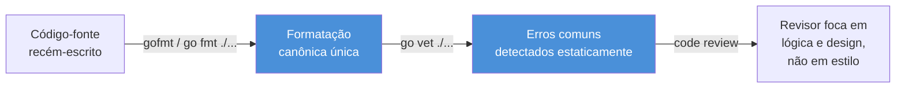

# Idiomático desde o início

> [!abstract] TL;DR
> Código Go idiomático não é sobre "boas práticas" genéricas — é sobre reconhecer que Go tem **um jeito canônico de fazer cada coisa**, imposto em parte por ferramenta (`gofmt`, `go vet`) e em parte por convenção comunitária forte (nomes curtos, getters sem `Get`, `-er` para interfaces de método único, `if err != nil` em vez de exceções). Quem chega de Java, Python ou Node tende a "traduzir" hábitos antigos — recriar getters/setters, empilhar interfaces "por garantia", ignorar `err` — e o resultado compila, funciona, mas soa **com sotaque**. Esta nota fecha o galho 1 mapeando esse sotaque e nomeando o idioma nativo, para os próximos galhos (tipos, interfaces, erros) já partirem do jeito certo.

## O código que compila, funciona e ainda assim incomoda

Imagine que você acabou de terminar seu primeiro pacote Go de verdade — não um `hello world`, mas algo com uma dúzia de arquivos, alguns tipos, algumas funções. Você manda revisar com um colega que escreve Go há anos. Ele roda, os testes passam, o binário compila sem erro nem aviso. E ainda assim, ele franze a testa e diz: "funciona, mas não é bem assim que a gente escreve Go por aqui."

Isso não é neurose de revisor chato. É um sinal real, e vale a pena entender de onde ele vem. Olhe este trecho:

```go
package pessoa

type PessoaStruct struct {
	nomeCompleto string
	idadeAtual   int
}

func (p *PessoaStruct) GetNomeCompleto() string {
	return p.nomeCompleto
}

func (p *PessoaStruct) SetNomeCompleto(nome string) {
	p.nomeCompleto = nome
}

func NovaPessoa(nome string, idade int) *PessoaStruct {
	pessoa := new(PessoaStruct)
	pessoa.nomeCompleto = nome
	pessoa.idadeAtual = idade
	return pessoa
}
```

Compila. Roda. Não tem nenhum erro de sintaxe, nenhum `go vet` reclamando. E, ainda assim, um revisor Go experiente vai apontar pelo menos quatro coisas: o sufixo `Struct` no nome do tipo (redundante — o pacote já deixa claro que é uma struct), o prefixo `Get` no getter (não é assim que Go nomeia acessores), o `Set` como setter automático sem necessidade (campo exportado resolveria na maioria dos casos), e `new(PessoaStruct)` onde um struct literal seria mais direto e mais idiomático. Nada disso é "errado" no sentido de quebrar o programa — é errado no sentido de **soar como Java traduzido, palavra por palavra, para a sintaxe do Go**. É esse "sotaque" que esta nota existe para destravar.

## `gofmt`: a lei que elimina o debate

A primeira e mais radical decisão idiomática do Go não é uma convenção — é uma ferramenta obrigatória de fato: **`gofmt`** (ou seu equivalente moderno via `go fmt ./...`, já visto na nota 06 desta trilha). A proposta é simples e incomum: existe **exatamente uma** forma canônica de formatar código Go — indentação com tabs, posição de chaves, espaçamento em torno de operadores, alinhamento de structs — e ela não é negociável, configurável ou discutível em code review.

Isso soa estranho para quem vem de ecossistemas onde formatação é assunto de `.eslintrc`, `.prettierrc` ou de convenção de time documentada em wiki (e frequentemente descumprida). Em Java, times debatem se a chave abre na mesma linha ou na linha seguinte; em Python, PEP 8 é guia, não lei — `black` existe justamente porque a comunidade sentiu falta de uma imposição única. Go pulou essa fase inteira: `gofmt` existe desde a primeira versão pública da linguagem, e a cultura da comunidade internalizou que **código não formatado por `gofmt` está, por definição, mal formatado** — não é questão de gosto.



A consequência prática, e é isso que faz `gofmt` ser mais que estética: **debates de estilo somem do code review**. Ninguém comenta "prefiro tabs" ou "essa chave deveria estar na linha de baixo", porque a ferramenta já decidiu isso antes do PR existir — a maioria dos editores roda `gofmt` automaticamente ao salvar. O tempo de revisão que sobra vai inteiro para lógica, nomes, design — o que de fato importa. Ferramentas de terceiros como `golangci-lint`, que agregam múltiplos linters incluindo checagens de estilo mais opinativas, entram no galho 20 desta trilha; aqui, `gofmt` e `go vet` são os dois guarda-corpos que já vêm de fábrica com qualquer instalação do Go, sem configuração.

> [!question]- Se `gofmt` decide tudo, por que ainda existem tantos "estilos" diferentes de código Go que eu vejo por aí?
> Porque `gofmt` só resolve **formatação mecânica** (espaçamento, indentação, alinhamento) — não decide nomes de variáveis, estrutura de pacotes, quando usar uma interface ou como organizar erros. Essas decisões continuam sendo do programador, e é justamente aí que entram as convenções que o resto desta nota cobre: nomenclatura, tratamento de erro, design de interface. `gofmt` elimina o ruído visual; o idioma Go — o resto desta nota — elimina o ruído de design.

`go vet` complementa `gofmt` numa camada diferente: em vez de formatação, ele analisa estaticamente o código em busca de construções que **compilam sem erro, mas quase certamente estão erradas**. O exemplo mais citado é uma chamada `Printf` com argumentos incompatíveis com a string de formatação:

```go
// Compila. go vet reclama: "Println arg nome is not a string type"
// (só se aplica em formas com verbo, mas o padrão vale para Printf/Sprintf/Errorf)
nome := 42
fmt.Printf("Nome: %s\n", nome) // %s espera string, recebeu int
```

Esse tipo de erro é fácil de deixar passar numa leitura rápida de código — a assinatura de `Printf` aceita `...any`, então o compilador não tem como recusar em tempo de compilação. `go vet` cobre exatamente essa lacuna: um segundo guarda-corpo, complementar a `gofmt`, que também vem de fábrica com qualquer instalação do Go e roda em segundos sobre um módulo inteiro (`go vet ./...`). Times sérios rodam os dois — `gofmt`/`go fmt` e `go vet` — como parte do pipeline de CI, antes mesmo de cogitar linters de terceiros.

## Convenções de nome: o dialeto oficial

Go tem regras de nomenclatura mais rígidas, e mais amarradas à semântica da linguagem, do que a maioria das linguagens que você já usou. Valem quatro delas de cabeça.

### MixedCaps, nunca snake_case

Go não usa `snake_case` em lugar nenhum do código-fonte — nem para variáveis, nem para funções, nem para nomes de arquivo dentro de um pacote (arquivos `.go` até podem ter hífen, mas identificadores dentro do código, não). A convenção é **MixedCaps** (também chamada de `camelCase`/`PascalCase`, mas a documentação oficial do Go prefere o termo "MixedCaps" para deixar claro que é sobre letras maiúsculas internas, não sobre casing em geral):

```go
// Não idiomático (sotaque de Python/Ruby)
var nome_completo string
func calcular_total_pedido(itens []Item) float64 { /* ... */ }

// Idiomático
var nomeCompleto string
func calcularTotalPedido(itens []Item) float64 { /* ... */ }
```

A regra tem uma segunda camada, com peso semântico real (não é só estilo): **a primeira letra decide visibilidade**. `NomeCompleto` (maiúscula) é **exportado** — visível para outros pacotes que importam o seu; `nomeCompleto` (minúscula) é **não exportado** — só visível dentro do próprio pacote. Isso já foi visto na nota 05 desta trilha (pacotes e visibilidade); o ponto novo aqui é que essa regra *é* a convenção de nome — não existe um `public`/`private` separado da capitalização, como em Java. O nome, por si só, comunica o contrato de acesso.

### Nomes curtos, sem notação húngara

Vindo de Java, é comum o hábito de nomes longos e descritivos (`customerRepository`, `orderProcessingService`) e, historicamente, de notação húngara (`strNome`, `iContador`, `bAtivo`, prefixando o tipo no nome). Go rejeita as duas coisas. A convenção da comunidade favorece nomes **curtos no escopo local** — quanto menor o escopo de uma variável, mais curto o nome pode (e deve) ser:

```go
// Não idiomático — nomes longos em escopo curto, notação húngara
func processarPedido(strNomeCliente string, iQuantidadeItens int) error {
	for iIndice := 0; iIndice < iQuantidadeItens; iIndice++ {
		// ...
	}
	return nil
}

// Idiomático — curto onde o contexto já deixa claro o que é
func processarPedido(nome string, qtd int) error {
	for i := 0; i < qtd; i++ {
		// ...
	}
	return nil
}
```

Um loop `for i := range itens` não precisa de um nome mais longo que `i` — o contexto (um `for`, iterando um slice de poucas linhas) já carrega todo o significado necessário. Nomes longos e descritivos ainda fazem sentido em escopo largo — uma função exportada, um tipo de pacote, uma variável global — onde o leitor não tem o contexto imediato de um bloco de dez linhas. A regra de ouro do Effective Go é: **o tamanho do nome deve ser proporcional à distância entre sua declaração e seu uso.**

### Sem "stutter": pacote e tipo não se repetem

"Gagueira de nome" (*name stutter*) é o erro de nomear um tipo repetindo o nome do pacote que o contém. O exemplo canônico, citado no próprio Go Code Review Comments, é a biblioteca padrão `net/http`:

```go
// Não idiomático — gagueira: "http.HTTPServer" repete "HTTP" duas vezes
package http

type HTTPServer struct { /* ... */ }
func NewHTTPServer() *HTTPServer { /* ... */ }

// Idiomático — o próprio pacote já diz "http"
package http

type Server struct { /* ... */ }
func NewServer() *Server { /* ... */ }
```

Quem consome o pacote de fora escreve `http.Server`, não `http.HTTPServer` — o nome do pacote já qualifica o tipo, então repetir dentro do tipo é redundância pura. Essa regra também empurra os nomes de pacote em si a serem **curtos, minúsculos, sem underscore e sem pluralização** (`http`, não `Http_Package` ou `httpUtils`) — o próprio ato de importar (`import "net/http"`, usar como `http.Get(...)`) já é a prova de fogo: se o nome do pacote fica estranho no ponto de uso, provavelmente está errado.

### Getters sem `Get`, interfaces terminadas em `-er`

Duas convenções que mais pegam quem vem de Java, e que merecem destaque separado — porque aparecem em quase todo código Go real.

**Getters não levam prefixo `Get`.** Em Java, `getNome()` é tão automático que vira reflexo. Em Go, se um tipo `Pessoa` tem um campo não exportado `nome` e precisa expor um acessor, o nome do método é só `Nome()` — sem `Get`:

```go
// Não idiomático (sotaque de Java)
func (p *Pessoa) GetNome() string {
	return p.nome
}

// Idiomático
func (p *Pessoa) Nome() string {
	return p.nome
}
```

A lógica, segundo o próprio Effective Go, é que Go já tem uma forma nativa e mais simples de expor um valor: **campos exportados diretamente** (`Nome string`, com N maiúscula), sem getter nenhum, quando não há lógica extra no acesso. Um método `Nome()` só se justifica quando existe alguma computação, validação, ou quando o campo interno precisa ficar privado por outro motivo (invariante a proteger, por exemplo). E quando existe um setter de verdade, o padrão é `SetNome(n string)` — o `Set` continua existindo, só o `Get` que some.

**Interfaces de método único terminam em `-er`.** É a convenção mais reconhecível da biblioteca padrão do Go: `Reader`, `Writer`, `Closer`, `Stringer`. A regra é mecânica — pega o verbo do único método da interface e agrega `-er`:

```go
type Reader interface {
	Read(p []byte) (n int, err error)
}

type Stringer interface {
	String() string
}
```

Essa convenção só é mencionada de leve aqui — o design de interfaces pequenas e a filosofia "accept interfaces, return structs" (próxima seção) são o assunto central do **galho 3** desta trilha, sobre tipos e interfaces em profundidade. O que importa reter agora é o reflexo de nomeação: se você criar uma interface com um método único chamado `Validate`, o nome idiomático da interface é `Validator`, não `IValidator` (prefixo `I` é convenção de C#/Java, não existe em Go) nem `ValidatorInterface`.

| Convenção Java/outras linguagens | Equivalente idiomático em Go |
|---|---|
| `snake_case` para variáveis | `MixedCaps` / `camelCase` |
| `IValidator` (prefixo de interface) | `Validator` (sem prefixo) |
| `getNome()` / `setNome()` | `Nome()` / `SetNome()` |
| `HTTPServer` dentro de `package http` | `Server` dentro de `package http` |
| Nomes longos e descritivos sempre | Nomes curtos em escopo curto, descritivos em escopo largo |
| Notação húngara (`strNome`, `iIdade`) | Sem notação húngara — o compilador já sabe o tipo |

Mais alguns exemplos reais de nomes de pacote da própria biblioteca padrão, para calibrar o "curto o suficiente": `fmt` (não `format` nem `formatting`), `os` (não `operatingsystem`), `net/http` (não `network/hypertext_transfer_protocol`), `sync` (não `synchronization`). O critério não é abreviar por abreviar — é que o nome, no ponto de uso (`fmt.Println`, `os.Open`, `http.Get`), já seja curto e claro o bastante para não precisar de alias.

## `if err != nil`: o idioma que aparece em toda função

Se você já leu qualquer trecho de código Go real, já viu este padrão dezenas de vezes:

```go
resultado, err := fazerAlgo()
if err != nil {
	return err
}
```

Isso não é boilerplate acidental — é a **decisão de design central** do tratamento de erro em Go. Ao contrário de Java (`try`/`catch`/`throws`), Python (`try`/`except`) ou JavaScript (`try`/`catch` + Promises rejeitadas), Go não tem exceções para fluxo de controle normal. Erros são **valores comuns**, retornados explicitamente como o último valor de uma função com múltiplos retornos, e checados imediatamente após a chamada — não capturados em algum bloco distante, várias camadas de call stack acima.

```go
// Idiomático — erro é checado no local, não escondido
arquivo, err := os.Open("config.yaml")
if err != nil {
	return fmt.Errorf("abrindo config: %w", err)
}
defer arquivo.Close()
```

Essa nota trata `if err != nil` como **cidadão de primeira classe do idioma Go** — algo que todo revisor espera ver depois de toda chamada que pode falhar — mas não aprofunda *como* construir, envolver (`%w`), comparar (`errors.Is`/`errors.As`) ou projetar hierarquias de erro: isso é o assunto inteiro do **galho 4** desta trilha. O que fica marcado aqui é o hábito: em Go, ignorar um erro é uma escolha visível e deliberada, nunca um acidente silencioso escondido atrás de uma exceção não capturada.

## "Accept interfaces, return structs" — o teaser

Outro provérbio recorrente em código Go maduro, que também só ganha corpo no **galho 3**: funções e construtores devem, sempre que possível, **aceitar parâmetros do tipo interface** (o mínimo de comportamento necessário) e **retornar tipos concretos** (`struct`s ou ponteiros para `struct`s), não interfaces.

```go
// Idiomático: aceita a interface mínima necessária (io.Reader),
// não um tipo concreto específico como *os.File
func ContarLinhas(r io.Reader) (int, error) {
	// ...
}

// Idiomático: retorna o tipo concreto *Servidor,
// não uma interface genérica ServidorInterface
func NovoServidor(porta int) *Servidor {
	return &Servidor{porta: porta}
}
```

A intuição, resumida em uma frase: quem **consome** a função decide de que interface ela precisa (flexibilidade máxima do lado de quem chama); quem **produz** o valor devolve algo concreto e completo (o consumidor decide depois se quer só uma fatia do comportamento via interface). Inverter isso — aceitar tipos concretos rígidos e devolver interfaces genéricas — é um padrão comum em quem vem de Java carregando o hábito de "programar para interfaces" ao pé da letra, e é exatamente o oposto do que o idioma Go recomenda.

Vale notar por que a inversão prejudica na prática, não só por convenção: uma função que **retorna** uma interface (`ServidorInterface`) esconde do chamador todos os métodos concretos extras que a implementação real possa ter — se amanhã você precisar de um método específico daquela implementação, não tem acesso, porque o tipo declarado é a interface, não a struct. Uma função que **aceita** um tipo concreto rígido (`*os.File`, por exemplo, em vez de `io.Reader`) força todo chamador a produzir exatamente aquele tipo, mesmo que só precisasse de um método (`Read`) — eliminando a possibilidade de passar um `bytes.Buffer`, uma `strings.Reader` de teste, ou qualquer outra fonte de bytes que implemente a mesma interface mínima. As duas inversões custam flexibilidade; "accept interfaces, return structs" é o ponto de equilíbrio que a biblioteca padrão do Go segue sistematicamente — é por isso que praticamente toda função de I/O da stdlib aceita `io.Reader`/`io.Writer`, não tipos concretos.

## Comentários e godoc: o nome do identificador primeiro

Go também tem convenção estrita para comentários de documentação — não é estilo livre como Javadoc ou docstrings de Python. A regra do `godoc` (a ferramenta, hoje incorporada ao `pkg.go.dev`, que gera documentação a partir do código-fonte) é mecânica: **um comentário de documentação de um identificador exportado começa com o próprio nome do identificador**, em frase completa:

```go
// Não idiomático — não começa com o nome do identificador
// Esta função calcula o total do pedido somando os itens.
func CalcularTotal(itens []Item) float64 { /* ... */ }

// Idiomático — godoc extrai e formata corretamente
// CalcularTotal soma o preço de todos os itens do pedido
// e retorna o total, sem aplicar descontos.
func CalcularTotal(itens []Item) float64 { /* ... */ }
```

O motivo não é estético: `godoc` (e ferramentas como `go doc` no terminal, ou o site `pkg.go.dev` que hospeda documentação de módulos públicos) usa essa convenção para **extrair automaticamente** a primeira frase como resumo do identificador em listagens e índices. Um comentário que não começa com o nome do que documenta gera documentação estranha ou incompleta nessas ferramentas — o comentário existe, mas não cumpre o papel de doc string porque quebra a convenção que a ferramenta espera.

A mesma regra vale para o próprio pacote, num comentário logo acima de `package nomedopacote`, convencionalmente colocado num arquivo `doc.go` quando o comentário é longo:

```go
// Package cliente implementa o repositório de clientes,
// incluindo busca, criação e atualização de cadastro.
package cliente
```

Rodar `go doc cliente` no terminal, ou visitar a página do módulo em `pkg.go.dev`, exibe exatamente esse texto como descrição do pacote — de novo, só funciona bem porque o comentário segue a convenção de nomear o próprio identificador (`Package cliente`, não "Este pacote implementa...") logo na primeira palavra.

## "Less is more": a filosofia por trás de tudo isso

Todas as convenções acima remontam a uma filosofia comum, que Rob Pike (um dos três criadores do Go, já apresentado na nota 01 desta trilha) resumiu em palestras e no próprio site oficial de **Go Proverbs** (`go-proverbs.github.io`, curado a partir de uma palestra de Pike na Gopherfest 2015). Alguns dos mais citados, e mais úteis como bússola para código idiomático:

- **"Clear is better than clever."** Um trecho de código esperto, que economiza três linhas à custa de dez minutos de leitura, perde para uma versão mais longa e óbvia. Go valoriza legibilidade acima de densidade — é por isso que a linguagem não tem operador ternário, por exemplo: um `if`/`else` explícito, ainda que mais verboso, é considerado mais claro.
- **"A little copying is better than a little dependency."** Duplicar três linhas de código simples é, muitas vezes, melhor do que importar um pacote inteiro (com sua árvore de dependências transitivas) só para reaproveitar uma função pequena.
- **"The bigger the interface, the weaker the abstraction."** Quanto mais métodos uma interface exige, menos reutilizável e menos "encaixável" ela é — reforça, de outro ângulo, por que interfaces de método único (`Reader`, `Writer`) são o padrão-ouro, e não a exceção.
- **"Errors are values."** Erros em Go não são um mecanismo especial de linguagem à parte — são valores comuns do tipo `error`, que podem ser armazenados, comparados, encadeados, como qualquer outro valor. Fundamenta o `if err != nil` já visto acima.

> [!question]- Esses provérbios são regra formal da linguagem, ou só cultura da comunidade?
> Cultura — nenhum deles está na especificação da linguagem (`go.dev/ref/spec`), e o compilador não impõe nenhum deles. Mas é uma cultura extremamente forte e consistente: a biblioteca padrão do Go, escrita pelos próprios criadores da linguagem, segue esses provérbios à risca, e a comunidade trata desvios como sinal de "código não idiomático" em toda revisão. Vale a mesma lógica de `gofmt`: não é lei da gramática, mas é lei social — seguida com o mesmo rigor.

Vale um exemplo concreto de "clear is better than clever", porque é o provérbio que mais frequentemente entra em atrito com hábitos de quem vem de linguagens que premiam concisão (Python em particular, com suas *list comprehensions* e expressões condicionais em uma linha):

```go
// "Esperto": uma linha, usando um mapa de função anônima como
// substituto de operador ternário — Go não tem ternário de propósito
resultado := map[bool]string{true: "aprovado", false: "reprovado"}[nota >= 7]

// Claro: mais linhas, mas qualquer pessoa lê e entende
// a intenção sem precisar decifrar a construção
var resultado string
if nota >= 7 {
	resultado = "aprovado"
} else {
	resultado = "reprovado"
}
```

A primeira versão é uma curiosidade sintática — funciona, e algum programador Go experiente até vai reconhecer o truque — mas exige uma parada mental extra que a segunda versão não exige. Esse é o tipo de troca que o idioma Go sistematicamente resolve a favor da clareza, mesmo pagando com mais linhas.

## Casos práticos: antes e depois

Quatro comparações lado a lado, cada uma isolando um erro comum de quem "traduz" de outra linguagem para Go.

**1. Getter Java-style vs. Go-style**

```go
// Antes (sotaque de Java)
type ContaBancaria struct {
	saldo float64
}
func (c *ContaBancaria) GetSaldo() float64 { return c.saldo }

// Depois (idiomático)
type ContaBancaria struct {
	saldo float64
}
func (c *ContaBancaria) Saldo() float64 { return c.saldo }
```

**2. Nome com stutter vs. limpo**

```go
// Antes — repete "cliente" duas vezes dentro de package cliente
package cliente
type ClienteRepositorio struct { /* ... */ }

// Depois
package cliente
type Repositorio struct { /* ... */ }
// consumido como: cliente.Repositorio
```

**3. Ignorar `err` vs. tratar**

```go
// Antes — erro descartado com _, falha silenciosa
dados, _ := os.ReadFile("dados.json")
processar(dados)

// Depois — erro checado, falha explícita e rastreável
dados, err := os.ReadFile("dados.json")
if err != nil {
	return fmt.Errorf("lendo dados.json: %w", err)
}
processar(dados)
```

**4. Interface prematura vs. struct concreta**

```go
// Antes — interface criada "por via das dúvidas", com um único
// implementador existente, sem necessidade real de abstração ainda
type PagamentoProcessador interface {
	Processar(valor float64) error
}
type ProcessadorPadrao struct{}
func (p *ProcessadorPadrao) Processar(valor float64) error { /* ... */ return nil }

// Depois — struct concreta direto; a interface nasce depois,
// no ponto de consumo, só quando um segundo caso de uso pedir
type Processador struct{}
func (p *Processador) Processar(valor float64) error { /* ... */ return nil }
```

## Armadilhas comuns

> [!warning] Recriar getters e setters de Java para todo campo
> O reflexo de "todo campo privado precisa de getter e setter" não se transfere para Go. Se não há lógica extra no acesso, o caminho idiomático é simplesmente exportar o campo (`Nome string`, maiúsculo) — sem par de métodos. Encher uma struct de `GetX`/`SetX` sem necessidade real é o sinal mais rápido, num code review Go, de que quem escreveu vem de outra linguagem e ainda não soltou o hábito.

> [!warning] Usar `panic` como se fosse `throw`/exceção
> `panic` existe em Go, mas seu uso idiomático é estreito: erros de programação genuinamente irrecuperáveis (índice fora dos limites, invariante interna quebrada) ou situações de inicialização onde não há como continuar (`panic` em `init()`, por exemplo). Não é o mecanismo para "algo deu errado, sobe pra quem chamou decidir" — isso é papel do valor `error` retornado e checado com `if err != nil`. Usar `panic`/`recover` como um `try`/`catch` disfarçado é um dos erros mais comuns, e mais mal vistos, de quem chega de Java ou Python.

> [!warning] Criar interfaces "por via das dúvidas", antes de precisar
> O instinto de "programar para interfaces" de Java tende a virar, em Go, uma interface para cada struct — mesmo com um único implementador e nenhum caso de uso real de troca de implementação. O idioma Go inverte essa ordem: comece com a struct concreta; extraia uma interface só quando o ponto de consumo (um teste que precisa de mock, uma segunda implementação real) efetivamente pedir. Interface prematura na definição, não no consumo, é abstração sem uso — mais código para manter, sem ganho real.

> [!warning] Ignorar `err` com `_` para "destravar" o código mais rápido
> `dados, _ := os.ReadFile(caminho)` compila sem nenhum aviso — o compilador do Go não obriga você a checar um erro, só obriga você a *declarar explicitamente* que está descartando (o `_` é essa declaração explícita). É tentador usar isso para não "poluir" um protótipo rápido, mas o hábito vaza para código real com facilidade, e cada `_` no lugar de `err` é um caminho de falha silenciosa: a função pode ter retornado um arquivo vazio, uma conexão que nunca abriu, um JSON malformado — e o programa segue adiante como se nada tivesse acontecido, até quebrar em um ponto bem mais distante e mais difícil de depurar do que o `if err != nil` teria custado.

## Erros de quem chega de outra linguagem: um resumo

Vale consolidar, num só lugar, os quatro hábitos que mais frequentemente denunciam código "traduzido" em vez de escrito nativamente em Go — cada um já visto em detalhe acima, mas úteis como checklist rápida antes de abrir um pull request:

1. **Getters e setters em excesso.** Todo campo privado ganhando um `GetX`/`SetX`, como reflexo automático de Java, em vez de expor o campo diretamente quando não há lógica extra.
2. **Over-engineering com interfaces prematuras.** Interface para cada struct, "porque pode precisar trocar a implementação um dia" — sem um segundo caso de uso real que justifique a abstração agora.
3. **Ignorar valores de `error`.** Descartar com `_` para não lidar com o retorno extra, tratando o segundo valor como um estorvo em vez do mecanismo central de tratamento de erro da linguagem.
4. **`panic` como fluxo de controle.** Usar `panic`/`recover` para sinalizar "algo deu errado, decida lá em cima" — papel que pertence ao valor `error`, não a uma exceção disfarçada.

Um quinto hábito, mais sutil e menos citado, também vale nomear: tentar recriar **hierarquias de "classes"** via composição forçada de structs — uma `Animal` struct, uma `Cachorro` struct "herdando" `Animal` via embutimento (*embedding*), tentando simular herança clássica de Java onde o problema pedia, na verdade, uma interface simples ou composição direta. Embedding existe em Go e é útil, mas é composição — reuso de campos e métodos — não herança polimórfica; tratá-lo como se fosse uma árvore de classes costuma produzir designs mais rígidos do que o necessário. Esse tópico específico (embedding, quando usar e quando evitar) é aprofundado no galho 2, junto com structs e métodos.

## Em entrevista

Uma pergunta comum em entrevistas para vagas Go de nível pleno/sênior é direta: **"o que você considera código Go idiomático, e como você garante isso num time?"** A resposta fraca cita só `gofmt`. A resposta forte nomeia a combinação de ferramenta e convenção — `gofmt` e `go vet` como guarda-corpos automáticos, e um conjunto de convenções sociais fortes (nomenclatura, getters sem `Get`, `-er` para interfaces, `if err != nil` no lugar de exceções) que não são impostas pelo compilador, mas são impostas pela cultura da comunidade e reforçadas em code review — e, idealmente, menciona `golangci-lint` como a camada que times adicionam por cima disso para automatizar boa parte da checagem de convenção (aprofundado no galho 20 desta trilha).

Outra pergunta recorrente, especialmente para quem lista "vindo de Java" ou "vindo de Python" no currículo: **"que hábito você teve que desaprender ao migrar para Go?"** É uma pergunta de autoconhecimento técnico, não de trivia — e a resposta forte não é "nenhum, Go é fácil". Nomear com honestidade um hábito real (getters automáticos, interfaces por garantia, tentar simular herança) e explicar *por que* o idioma Go resolve melhor sem aquele hábito demonstra que a fluência não veio só de sintaxe, mas de ter de fato internalizado o design da linguagem.

> [!question]- O entrevistador pergunta: "se `gofmt` e as convenções são só cultura, por que eu deveria segui-las à risca?"
> Porque o custo de não seguir não é estético — é de **velocidade de time**. Um código que soa "traduzido" de outra linguagem obriga cada revisor a fazer uma tradução mental extra antes de avaliar a lógica em si, e obriga quem mantém o código meses depois a reconciliar dois estilos diferentes convivendo no mesmo pacote. A convergência forte da comunidade Go em torno de um único idioma — reforçada por ferramentas de fábrica como `gofmt`/`go vet` e por linters de time como `golangci-lint` — existe exatamente para que qualquer desenvolvedor Go, em qualquer empresa, reconheça o padrão imediatamente ao abrir um arquivo novo. É a mesma aposta de design vista na nota 01 desta trilha (menos formas de fazer a mesma coisa, para times grandes lerem código uns dos outros sem atrito) — só que aplicada a hábitos de escrita, não à sintaxe da linguagem em si.

## Como explicar em inglês

> "Idiomatic Go isn't a style preference — it's enforced partly by tooling and partly by strong community convention. `gofmt` makes formatting non-negotiable, so code review never argues about braces or indentation. Naming follows MixedCaps, never snake_case, with short names in short scopes and no `Get` prefix on accessors — you write `Name()`, not `GetName()`. Single-method interfaces are named after the verb plus `-er`, like `Reader` or `Writer`. And error handling uses `if err != nil` as an explicit, first-class pattern instead of exceptions — errors are just values you check right where they happen, not something you throw and catch several layers away. Someone coming from Java or Python who skips these conventions ends up with code that compiles and runs, but reads like a translation rather than something written natively in Go."

| PT-BR | English |
|---|---|
| idiomático | idiomatic |
| gagueira de nome | name stutter |
| convenção de nomenclatura | naming convention |
| tratamento de erro | error handling |
| provérbios do Go | Go proverbs |
| notação húngara | Hungarian notation |
| interface de método único | single-method interface |
| campo exportado | exported field |
| formatação automática | automatic formatting |
| revisão de código | code review |
| abstração prematura | premature abstraction |
| valor de erro | error value |

## O que vem a seguir

Com esta nota, o **galho 1 — Fundamentos e sintaxe — se fecha**. Você já sabe por que o Go existe e como ele compila (nota 01), como declarar variáveis e o que são zero values (nota 02), como controlar fluxo (nota 03), como escrever e usar funções (nota 04), como organizar código em pacotes e controlar visibilidade (nota 05), como o toolchain e os módulos funcionam na prática (nota 06) — e agora, com esta nota, você sabe reconhecer e evitar o "sotaque" de outra linguagem, escrevendo Go que soa nativo desde a primeira linha.

O que ainda falta — e é para onde a trilha vai a seguir — é o que dá **corpo** a esse idioma: como Go modela dados e comportamento sem classes nem herança. É esse o assunto do **Galho 2 — Tipos, structs e métodos**, que começa exatamente de onde esta nota parou: `struct`s como a unidade de composição de dados do Go, e métodos com *receiver* como a forma do Go de anexar comportamento a um tipo — a base concreta sobre a qual interfaces (`-er`, `accept interfaces, return structs`) e tratamento de erro (`if err != nil` a fundo) vão ser construídos nos galhos seguintes.

## Fontes

- Documentação oficial — *Effective Go*: https://go.dev/doc/effective_go
- Go Proverbs (curado a partir da palestra de Rob Pike na Gopherfest 2015): https://go-proverbs.github.io/
- Go Blog — *Go Proverbs* (vídeo e contexto da palestra original de Rob Pike): https://go.dev/blog/proverbs
- Go Wiki — *Code Review Comments* (convenções de nomenclatura, getters, stutter, comentários): https://github.com/golang/go/wiki/CodeReviewComments
- Documentação oficial — *A Tour of Go*: https://go.dev/tour/welcome/1
- Documentação oficial — comando `go` (`go fmt`, `go vet`): https://pkg.go.dev/cmd/go
- Go Blog — *Godoc: documenting Go code* (convenção de comentário começando pelo nome do identificador): https://go.dev/blog/godoc

Consultado em 2026-07-16.
