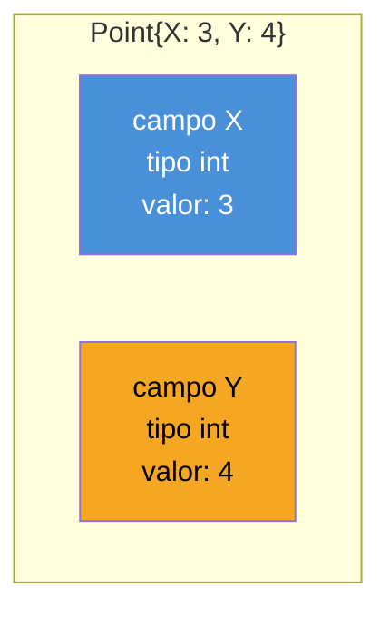
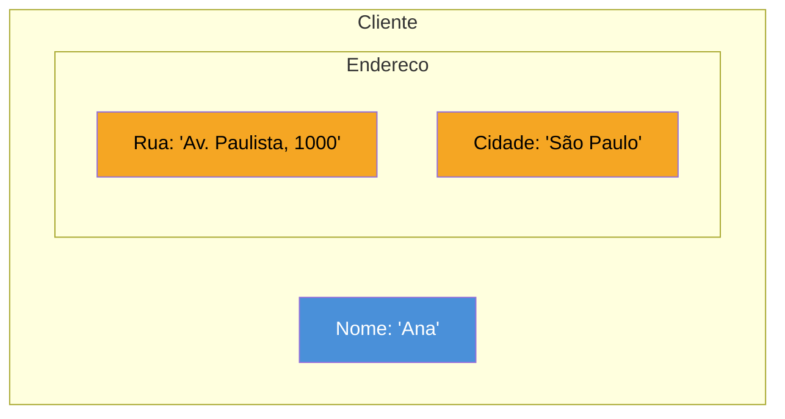

# Structs — definição e inicialização

> [!abstract] TL;DR
> Go não tem classes — `struct` é o mecanismo para agregar dados relacionados num único tipo composto: `type Point struct { X, Y int }` declara um novo tipo com dois campos. Uma **struct literal** pode ser escrita posicionalmente (`Point{3, 4}`) ou por nome de campo (`Point{X: 3, Y: 4}`) — a forma por nome é a idiomática, porque sobrevive a mudanças na struct sem quebrar silenciosamente. O **zero value** de uma struct não é `null`: é a struct inteira com cada campo no próprio zero value (`0` para `int`, `""` para `string`, e assim por diante) — uma struct sempre nasce em estado válido e utilizável. Structs são **comparáveis com `==`** quando todos os seus campos são comparáveis, campo a campo — sem `equals()`, sem override. E structs podem conter outras structs (aninhamento) ou existir sem nome próprio (structs anônimas), quando o tipo não precisa ser reutilizado em nenhum outro lugar.

## O problema: um objeto sem ter classes

Imagine modelar um ponto num plano cartesiano — dois números, `X` e `Y`, que sempre andam juntos. Em Java, isso pediria uma classe:

```java
// Java
class Point {
    int x;
    int y;
}
```

Em Python, também uma classe (ou um `dataclass`, que por baixo ainda é uma classe). A pergunta natural para quem chega em Go depois de anos nessas linguagens é: se Go não tem `class`, como você agrupa "dois números que pertencem juntos" num único tipo?

A resposta de Go é o **struct** — uma palavra que também existe em C, e que carrega ali o mesmo espírito: um tipo composto que agrega campos nomeados, sem herança, sem construtores, sem a cerimônia de uma classe. `type Point struct { X, Y int }` declara exatamente isso — um novo tipo chamado `Point`, com dois campos inteiros, `X` e `Y`:

```go
type Point struct {
    X, Y int
}
```

`X, Y int` é açúcar sintático para `X int` seguido de `Y int` — dois campos declarados na mesma linha porque compartilham o tipo, o mesmo padrão já visto na declaração de parâmetros de função no galho 1. Poderia ser escrito também campo a campo:

```go
type Point struct {
    X int
    Y int
}
```

As duas formas produzem exatamente o mesmo tipo. A convenção idiomática (usada pela própria biblioteca padrão, como em `image.Point`) prefere agrupar campos do mesmo tipo numa linha quando eles são conceitualmente relacionados, como `X, Y`.

## O que um struct é, de fato: memória com nomes

Um jeito útil de pensar numa struct: é um bloco contíguo de memória, dividido em compartimentos, cada um com um nome e um tipo. Não existe identidade escondida, não existe "objeto" com metadados extras — é literalmente os campos, um do lado do outro.



Isso não é só uma analogia — é literalmente como o compilador organiza a struct na memória: os campos ficam lado a lado, na ordem declarada (com possível *padding* para alinhamento, um detalhe de baixo nível que não importa aqui). Quando uma struct é copiada — porque, como visto na [[03-Dominios/Tecnologia/Go/01 - Fundamentos e sintaxe/07 - Ponteiros e o modelo de memória|nota 07 do galho 1]], Go é sempre pass-by-value — todo esse bloco é copiado, campo a campo. Um ponteiro para struct (`&Point{X: 3, Y: 4}`), que a nota de ponteiros já cobriu em profundidade, evita essa cópia; esta nota não repete esse mecanismo, só assume que ele existe.

## Struct literals: posicional vs. por nome

Criar um valor de um tipo struct usa a sintaxe de **struct literal** — o nome do tipo seguido de chaves com os valores dos campos. Existem duas formas, e a diferença entre elas é uma das primeiras decisões de estilo que todo Go dev enfrenta.

### Forma posicional

```go
p := Point{3, 4} // X = 3, Y = 4, na ordem em que os campos foram declarados
```

Os valores são atribuídos aos campos **na ordem exata da declaração da struct** — o primeiro valor vai para `X`, o segundo para `Y`, porque foi assim que `type Point struct { X, Y int }` declarou. É compacta, mas cega: nada no literal `Point{3, 4}` diz, à primeira vista, qual número é qual coordenada — quem lê precisa ir até a declaração da struct para confirmar a ordem dos campos.

### Forma por nome

```go
p := Point{X: 3, Y: 4} // explícito: X vale 3, Y vale 4
```

Cada campo é nomeado explicitamente. A ordem deixa de importar (`Point{Y: 4, X: 3}` produz o mesmo valor), e campos omitidos simplesmente recebem seu zero value:

```go
p := Point{X: 3} // Y não foi informado — fica 0 (zero value de int)
fmt.Println(p)    // {3 0}
```

> [!warning] Struct literal posicional quebra silenciosamente quando a struct ganha um campo novo
> ```go
> type Point struct {
>     X, Y int
> }
>
> p := Point{3, 4} // funciona: X=3, Y=4
>
> // Meses depois, alguém adiciona um campo à struct:
> type Point struct {
>     Label string
>     X, Y  int
> }
>
> p := Point{3, 4} // ERRO DE COMPILAÇÃO: too few values in struct literal
> ```
> Nesse caso específico o compilador ainda pega o erro (número de valores não bate). O cenário realmente perigoso é quando o número de campos continua o mesmo, mas a **ordem** muda, ou um campo do mesmo tipo é inserido no meio — aí `Point{3, 4}` continua compilando, só que atribuindo os valores aos campos errados, sem nenhum aviso do compilador. É exatamente por esse motivo que **structs literal por nome são a forma idiomática** em praticamente todo código Go de produção: `go vet` inclusive sinaliza literais posicionais não qualificados em structs de pacotes externos (`composites` check), como lembrete de que essa forma é frágil a mudanças na struct.

A regra prática, adotada quase universalmente: **use a forma posicional só para structs muito pequenas e estáveis** (como `Point{3, 4}`, onde `X, Y` dificilmente mudam de ordem) — e prefira a forma por nome para qualquer struct com três ou mais campos, ou qualquer struct que venha de outro pacote (onde você nem sempre conhece a ordem exata dos campos de cor).

## O zero value de uma struct: sempre válida, nunca `null`

Como toda variável Go, uma struct declarada sem inicialização explícita recebe seu **zero value** — e o zero value de uma struct é a própria struct, com **cada campo no zero value do seu próprio tipo**:

```go
type Point struct {
    X, Y int
}

var p Point
fmt.Println(p)       // {0 0}
fmt.Println(p.X, p.Y) // 0 0
```

Não existe `null`, não existe `NullPointerException` esperando para acontecer, não existe a necessidade de checar se `p` "foi inicializada" antes de usar. `p` já nasce um `Point` completo e utilizável — só que com valores zero em vez dos valores que você talvez quisesse. Isso é uma consequência direta do mesmo princípio de zero values já visto no galho 1 para tipos primitivos (`int` zera para `0`, `string` para `""`, `bool` para `false`): uma struct simplesmente aplica essa regra campo a campo, recursivamente.

```go
type Endereco struct {
    Rua    string
    Numero int
}

var e Endereco
fmt.Println(e) // {"" 0} — Rua é "" (zero value de string), Numero é 0
```

Esse comportamento tem uma consequência prática valiosa: **structs em Go são seguras para usar imediatamente após a declaração**, sem passo de inicialização obrigatório. O exemplo mais comum do dia a dia é `sync.Mutex` da biblioteca padrão — `var mu sync.Mutex` já produz um mutex pronto para uso, porque o zero value dele foi desenhado deliberadamente para ser um mutex destravado e funcional, sem chamada de "construtor" nenhuma.

## Acessando e atribuindo campos

Uma vez que uma struct existe (por literal ou por zero value), seus campos são acessados e atribuídos com a notação de ponto, `.`:

```go
p := Point{X: 3, Y: 4}

fmt.Println(p.X) // 3
p.X = 10          // atribuição direta ao campo
fmt.Println(p)    // {10 4}
```

`p.X = 10` só é possível porque `p` é uma variável comum (não uma constante) — a struct inteira é mutável campo a campo, exatamente como qualquer outra variável Go. Essa mesma sintaxe `p.Campo` funciona igual tanto para uma struct quanto para um ponteiro para struct (`*Point`), como a nota de ponteiros do galho 1 já mostrou — o compilador desreferencia automaticamente quando necessário, então nada muda na forma de escrever `p.X` só porque `p` é `*Point` em vez de `Point`.

## Structs aninhadas

Um campo de uma struct pode, ele mesmo, ser de outro tipo struct — é assim que Go modela hierarquias de dados sem precisar de herança:

```go
type Endereco struct {
    Rua    string
    Cidade string
}

type Cliente struct {
    Nome     string
    Endereco Endereco // campo cujo tipo é outra struct
}

c := Cliente{
    Nome: "Ana",
    Endereco: Endereco{
        Rua:    "Av. Paulista, 1000",
        Cidade: "São Paulo",
    },
}

fmt.Println(c.Endereco.Cidade) // São Paulo
c.Endereco.Rua = "Av. Faria Lima, 500" // acesso encadeado, atribuição direta
```



O acesso encadeado `c.Endereco.Cidade` funciona porque cada `.` desce um nível na estrutura: `c.Endereco` devolve o valor `Endereco` inteiro, e `.Cidade` acessa o campo dentro dele. Repare que isso é **aninhamento por composição de campo nomeado** — `Endereco` é só mais um campo de `Cliente`, chamado `Endereco`, do tipo `Endereco`. Isso é diferente de **embedding** (quando o campo é declarado sem nome, só com o tipo, e seus campos "sobem" para o tipo externo) — embedding é o mecanismo de composição mais idiomático de Go, e tem nota própria mais à frente neste galho; aqui, o campo nomeado é a forma mais simples e explícita de "uma struct dentro da outra".

Structs aninhadas podem ser inicializadas com struct literal aninhado, como no exemplo acima — e omitir o tipo do literal interno **não é permitido** fora de contextos específicos como slices e maps de structs (assunto de outro galho); dentro de um literal comum, o tipo do campo aninhado precisa ser repetido (`Endereco: Endereco{...}`).

## Structs anônimas: quando o tipo não precisa de nome

Nem toda struct precisa de um `type` próprio. Uma **struct anônima** declara a forma dos campos inline, sem batizar um novo tipo — útil para agrupar dados que só existem naquele ponto específico do código, sem intenção de reutilizar o tipo em nenhum outro lugar:

```go
pessoa := struct {
    Nome  string
    Idade int
}{
    Nome:  "Bia",
    Idade: 30,
}

fmt.Println(pessoa.Nome, pessoa.Idade) // Bia 30
```

A sintaxe é a definição da struct (`struct { Nome string; Idade int }`) seguida imediatamente pelo literal (`{Nome: "Bia", Idade: 30}`) — sem nome de tipo entre as duas partes, porque não há tipo nomeado. É comum ver structs anônimas em casos como o retorno de uma função auxiliar de teste, ou uma variável temporária que agrupa alguns valores relacionados só para passar adiante numa única chamada:

```go
resultado := struct {
    Total   float64
    Sucesso bool
}{Total: 199.90, Sucesso: true}

if resultado.Sucesso {
    fmt.Printf("Total: %.2f\n", resultado.Total)
}
```

A regra prática: se a forma de dados vai aparecer em mais de um lugar (assinatura de função, campo de outra struct, mais de uma variável), vale a pena batizá-la com `type` — um nome documenta a intenção e permite reutilização. Se é um agrupamento local, de uso único, a struct anônima evita poluir o pacote com um tipo que só existe para servir a um trecho isolado de código.

## Comparabilidade: `==` funciona campo a campo

Structs em Go são **comparáveis com `==` e `!=`** desde que todos os seus campos sejam, eles mesmos, comparáveis. A comparação verifica todos os campos, um a um — dois valores de struct são iguais se, e somente se, todos os campos correspondentes forem iguais:

```go
type Point struct {
    X, Y int
}

p1 := Point{X: 3, Y: 4}
p2 := Point{X: 3, Y: 4}
p3 := Point{X: 3, Y: 5}

fmt.Println(p1 == p2) // true — todos os campos batem
fmt.Println(p1 == p3) // false — Y difere
```

Não existe `equals()` para sobrescrever, não existe método algum envolvido — `==` sobre structs é uma operação embutida na linguagem, definida diretamente pela [especificação de Go](https://go.dev/ref/spec#Comparison_operators). Tipos como `int`, `string`, `bool`, arrays (de tamanho fixo) e outras structs comparáveis são comparáveis; **slices, maps e funções não são comparáveis** — e uma struct que contenha um campo desses tipos deixa de ser comparável por inteiro:

```go
type Carrinho struct {
    Cliente string
    Itens   []string // slice — não comparável
}

c1 := Carrinho{Cliente: "Ana", Itens: []string{"Livro"}}
c2 := Carrinho{Cliente: "Ana", Itens: []string{"Livro"}}

// fmt.Println(c1 == c2) // ERRO DE COMPILAÇÃO: invalid operation:
//                        // struct containing []string cannot be compared
```

> [!warning] Struct com campo não-comparável é erro de compilação, não erro de runtime
> Ao contrário de linguagens onde comparar objetos incompatíveis lança uma exceção em tempo de execução, tentar usar `==` numa struct que contém um slice, map ou função **nem compila** — o Go compiler recusa o programa inteiro antes de rodar uma única linha. É uma diferença de comportamento importante para quem vem de Java (`equals()` sempre roda, mesmo que devolva `false` de forma inesperada) ou Python (`==` entre tipos incompatíveis também roda, devolvendo `False` ou levantando exceção dependendo do caso): em Go, a incomparabilidade é detectada estaticamente, então o erro aparece cedo — na build, não numa chamada de produção em horário de pico.

Structs aninhadas seguem a mesma regra recursivamente: `Cliente == Cliente` compara também os campos de `Endereco` dentro dela, campo a campo, desde que `Endereco` também seja inteiramente comparável.

## Cópia de struct não é referência compartilhada

Vale reforçar um ponto que a nota de ponteiros do galho 1 já cobriu em detalhe, porque ele aparece o tempo todo ao trabalhar com structs: atribuir uma struct a outra variável, ou passá-la por valor para uma função, **copia todos os campos** — não cria dois nomes para o mesmo dado, como aconteceria com um objeto em Python ou Java.

```go
p1 := Point{X: 3, Y: 4}
p2 := p1        // copia TODOS os campos de p1 para p2
p2.X = 100

fmt.Println(p1) // {3 4} — p1 não mudou
fmt.Println(p2) // {100 4} — só p2 mudou
```

> [!warning] Confundir cópia de struct com "dois nomes para o mesmo objeto"
> `p2 := p1` em Go **nunca** cria uma segunda referência para os mesmos dados — sempre copia o valor inteiro, campo a campo. Quem vem de Python (onde `p2 = p1` deixa `p1` e `p2` apontando para o mesmíssimo objeto) tende a esperar que mudar `p2.X` também mude `p1.X` — e em Go isso simplesmente não acontece, porque não há objeto compartilhado nenhum, só duas cópias independentes. Quando o objetivo é de fato compartilhar o mesmo dado entre duas variáveis, a ferramenta certa é um ponteiro (`p2 := &p1`), não a atribuição direta — mecanismo já coberto na íntegra na nota de ponteiros do galho 1.

## O struct como "o que substitui a classe" em Go

Chegando ao fim desta nota, vale nomear explicitamente o que ficou implícito o tempo todo: em Go, o `struct` é o tipo que **agrega dados** — ele não tem, por si só, nenhuma noção de comportamento embutido. Não existe `class Point { void mover() {...} }`; `Point` é só `X` e `Y`. Comportamento associado a um tipo em Go vem de **métodos** — funções declaradas separadamente, com um *receiver* que as vincula a um tipo — e essa é exatamente a fronteira onde esta nota termina e a próxima começa.

| Vindo de... | "Classe" mapeia para... |
|---|---|
| Java / C# | `struct` (dados) + métodos com receiver (comportamento), sem herança |
| Python | `struct` cobre o papel de um `dataclass`; métodos completam o resto |
| JavaScript | `struct` é mais próximo de um objeto plain com forma fixa (não dinâmica) + funções vinculadas |

A diferença central para reter: uma classe em Java ou Python empacota dados **e** comportamento num único bloco sintático (`class`); Go separa deliberadamente os dois — o `struct` declara só a forma dos dados, e os métodos que operam sobre ela são declarados à parte, podendo inclusive estar em arquivos diferentes do mesmo pacote.

## Na prática: juntando as peças

```go
package main

import "fmt"

type Endereco struct {
    Rua    string
    Cidade string
}

type Cliente struct {
    Nome     string
    Idade    int
    Endereco Endereco
}

func main() {
    // Struct literal por nome — idiomático
    ana := Cliente{
        Nome:  "Ana",
        Idade: 28,
        Endereco: Endereco{
            Rua:    "Rua das Flores, 123",
            Cidade: "Curitiba",
        },
    }

    // Zero value — todo campo no seu próprio zero value
    var visitante Cliente
    fmt.Println(visitante) // { 0 { }}

    // Acesso e atribuição de campo, inclusive aninhado
    ana.Idade = 29
    ana.Endereco.Cidade = "Florianópolis"

    // Struct anônima local
    resumo := struct {
        Nome  string
        Idade int
    }{Nome: ana.Nome, Idade: ana.Idade}

    fmt.Printf("%s tem %d anos, mora em %s\n", resumo.Nome, resumo.Idade, ana.Endereco.Cidade)

    // Comparabilidade
    outraAna := Cliente{Nome: "Ana", Idade: 29, Endereco: Endereco{Rua: "Rua das Flores, 123", Cidade: "Florianópolis"}}
    fmt.Println(ana == outraAna) // true — todos os campos batem
}
```

`ana` é criada com literal por nome; `visitante` mostra o zero value completo; `ana.Endereco.Cidade` mostra acesso e atribuição encadeados numa struct aninhada; `resumo` é uma struct anônima local; e a comparação final mostra `==` funcionando campo a campo, recursivamente, através da struct aninhada `Endereco` embutida em `Cliente`.

## Armadilhas comuns

> [!warning] Struct literal posicional quebrando silenciosamente ao adicionar campo
> Já detalhado acima — reforçando porque é a armadilha mais comum do tópico: `Point{3, 4}` depende inteiramente da ordem de declaração dos campos. Adicionar, remover ou reordenar campos numa struct usada com literal posicional em algum outro lugar do código pode compilar sem erro e atribuir valores aos campos errados. Prefira sempre a forma por nome, exceto em structs minúsculas e estáveis.

> [!warning] Comparar structs com campo não-comparável (slice, map, função) — erro de compilação
> `Cliente{... , Itens: []string{...}} == outroCliente` não compila se `Itens` for `[]string`. O erro aparece na build (`invalid operation: ... cannot be compared`), não em runtime — o que é bom (pega cedo) mas surpreende quem espera que `==` "sempre funcione" como em Java (`equals` sempre roda) ou Python (`==` sempre roda). Para comparar structs com campos não-comparáveis, é preciso escrever a comparação campo a campo manualmente, ou usar `reflect.DeepEqual` (mais lento, e fora do escopo desta nota).

> [!warning] Confundir cópia de struct com referência compartilhada
> `p2 := p1` copia todos os campos; mudar `p2` nunca muda `p1`. Isso vale igualmente ao passar uma struct por valor para uma função, ou ao inserir uma struct (não um ponteiro) numa slice. Quando o objetivo é compartilhar e mutar o mesmo dado a partir de dois lugares, é necessário um ponteiro explícito — Go nunca faz esse compartilhamento implicitamente.

## Como explicar em inglês

> Go doesn't have classes — a **struct** is how you group related data into a single composite type: `type Point struct { X, Y int }` declares a new type with two fields. You create values with a **composite literal**, either positional (`Point{3, 4}`, relying on field declaration order — fragile once the struct changes) or, idiomatically, keyed by field name (`Point{X: 3, Y: 4}`, order-independent and safe against future field additions). A struct's **zero value** isn't `null` — it's the struct itself, with every field set to its own type's zero value, so a struct is always valid and usable the moment it's declared, with no separate initialization step. Structs are **comparable** with `==` when every field is itself comparable; a struct containing a slice, map, or function fails to compile if you try to compare it — the error surfaces at build time, not at runtime. Structs can nest (a field whose type is another struct) or be declared **anonymously** (`struct{...}{...}`, inline, with no named type) when the shape of the data is only needed locally. And critically: a struct only aggregates data — behavior comes from methods declared separately with a receiver, which is a deliberate split from how classes bundle data and behavior together in Java or Python.

| Termo PT | Termo EN |
|---|---|
| estrutura | struct |
| campo | field |
| literal composto / struct literal | composite literal / struct literal |
| valor zero | zero value |
| comparável | comparable |
| struct aninhada | nested struct |
| struct anônima | anonymous struct |
| agregar dados | aggregate data |

## O que vem a seguir

Com o struct estabelecido como a forma de agregar dados em Go — e a fronteira já traçada com métodos, embedding e struct tags, que ainda não foram abertos —, a próxima parada é entender **tipos nomeados** de forma mais ampla: `type Point struct {...}` é só um caso particular de uma ferramenta mais geral, `type NovoNome TipoBase`, que também funciona sobre `int`, `string` e qualquer outro tipo já existente. A [[02 - Tipos nomeados e definições de tipo]] mostra essa mecânica geral, o que ela habilita (métodos em tipos que não são structs) e onde ela se distingue de um simples "apelido" de tipo (`type Alias = TipoBase`).

## Fontes

- The Go Programming Language Specification — "Struct types": https://go.dev/ref/spec#Struct_types (acessado 2026-07-16)
- The Go Programming Language Specification — "Comparison operators": https://go.dev/ref/spec#Comparison_operators (acessado 2026-07-16)
- The Go Programming Language Specification — "Composite literals": https://go.dev/ref/spec#Composite_literals (acessado 2026-07-16)
- A Tour of Go — "Structs": https://go.dev/tour/moretypes/2 (acessado 2026-07-16)
- A Tour of Go — "Struct Fields": https://go.dev/tour/moretypes/3 (acessado 2026-07-16)
- Effective Go — "Composite Literals": https://go.dev/doc/effective_go#composite_literals (acessado 2026-07-16)
- Go by Example — "Structs": https://gobyexample.com/structs (acessado 2026-07-16)
