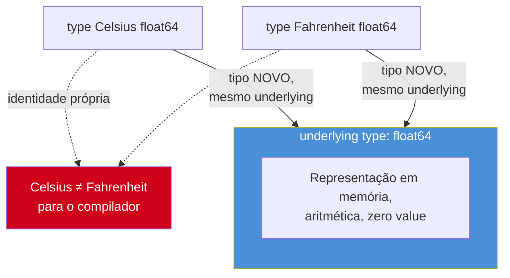
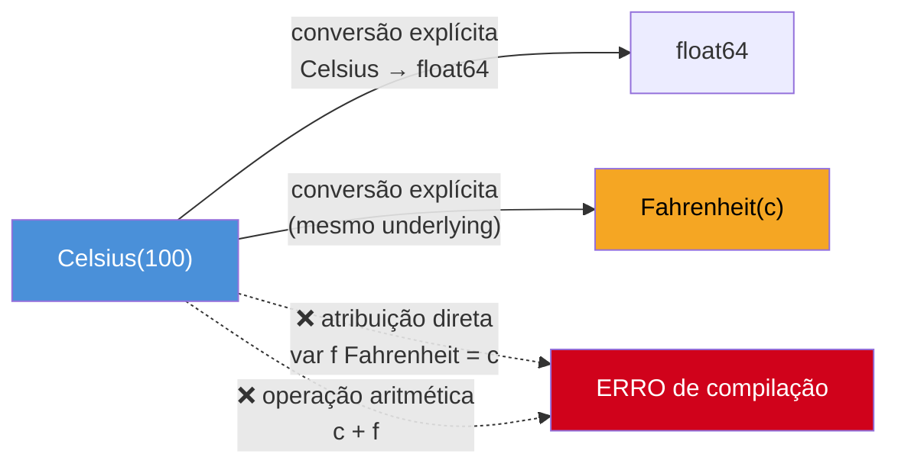

# Tipos nomeados e definições de tipo

> [!abstract] TL;DR
> `type Celsius float64` não cria um apelido para `float64` — cria um **tipo novo**, com o mesmo *underlying type* (`float64`) mas identidade própria: `Celsius` e `Fahrenheit`, mesmo sendo "os dois `float64` por baixo", **não se misturam** sem conversão explícita (`Celsius(f)`). Isso é diferente de um **type alias** (`type Byte = uint8`), que não cria tipo nenhum — só um segundo nome para o mesmo tipo, intercambiável em qualquer lugar. A distinção — definição cria tipo novo e exige conversão; alias é o mesmo tipo e não exige nada — é a ferramenta que Go usa para transformar "documentação de intenção" (`UserID int`) em regra verificada pelo compilador.

## O bug que o compilador barra

Um sistema de conversão de unidades, em Go, do jeito que pareceria natural escrever primeiro — tudo em `float64`, porque é "só um número":

```go
package main

import "fmt"

func alturaTotal(paredeMetros float64, telhadoPes float64) float64 {
	return paredeMetros + telhadoPes // ambos float64 — compila sem reclamar
}

func main() {
	altura := alturaTotal(2.5, 1.0) // 2.5 metros + 1.0 pé, somados como se fossem a mesma unidade
	fmt.Println(altura)             // 3.5 — número plausível, resultado errado
}
```

O compilador não tem nada a dizer aqui. `paredeMetros` e `telhadoPes` são os dois `float64`, a soma é uma operação `float64 + float64` perfeitamente legal, e `3.5` sai impresso com toda a confiança de um número correto. Só que `2.5` são metros e `1.0` é pé — a soma direta ignora completamente que um pé tem ~0.3048 metros. O bug não está numa fórmula errada; está em não existir, no próprio tipo `float64`, nenhuma marca de **qual grandeza** aquele número representa. Java e Python têm exatamente a mesma abertura: `double` e `float` são igualmente "burros" quanto a unidade.

Go oferece uma saída que essas linguagens não oferecem de graça: criar um tipo novo para cada grandeza, de modo que somar `Metros + Pes` diretamente vire **erro de compilação**, não um bug silencioso em produção. É esse mecanismo — tipos nomeados criados a partir de um `type` — que esta nota cobre.

## O que é uma definição de tipo

A nota anterior mostrou `type Ponto struct { X, Y int }` — uma **definição de tipo** aplicada a um struct. Mas a sintaxe `type Nome TipoExistente` não é exclusiva de structs: funciona sobre **qualquer tipo já existente** em Go — `float64`, `int`, `string`, um slice, um map, até uma função.

```go
type Celsius float64
```

Essa linha declara um **defined type** (tipo definido) chamado `Celsius`. Segundo a [especificação da linguagem](https://go.dev/ref/spec#Type_definitions), uma definição de tipo cria um **tipo novo**, distinto de qualquer outro tipo — inclusive distinto do tipo usado para defini-lo. `float64` aqui não é "o tipo de `Celsius`"; é o **underlying type** (tipo subjacente) de `Celsius` — o tipo que determina a representação em memória, o conjunto de operações aritméticas disponíveis (`+`, `-`, `*`, `/`, comparações) e o zero value (`0`, herdado de `float64`). Mas para o compilador, `Celsius` e `float64` são dois tipos diferentes, com uma relação de parentesco (mesmo underlying), não de identidade.



O nome "underlying type" não é acidente de vocabulário — é o termo que a própria especificação usa, e ele importa porque é **transitivo apenas até a base**: se você definir `type CelsiusPositivo Celsius`, o underlying type de `CelsiusPositivo` continua sendo `float64` (a especificação "acha" o tipo subjacente seguindo a cadeia de definições até chegar num tipo pré-declarado ou composto que não é ele mesmo um defined type derivado de outro nome).

## Por que criar um tipo nomeado

O ganho central é **segurança de tipo semântica**: o compilador passa a impedir, estruturalmente, que valores de grandezas diferentes se misturem por acidente — mesmo quando a representação binária é idêntica.

```go
package main

import "fmt"

type Celsius float64
type Fahrenheit float64

func celsiusParaFahrenheit(c Celsius) Fahrenheit {
	return Fahrenheit(c*9/5 + 32)
}

func main() {
	agua := Celsius(100)
	// var errado Fahrenheit = agua        // ERRO de compilação: cannot use agua (Celsius) as Fahrenheit
	fervura := celsiusParaFahrenheit(agua) // conversão explícita, dentro da função
	fmt.Println(fervura)                   // 212
}
```

A linha comentada não compila — e é exatamente esse erro, detectado em tempo de compilação, que o exemplo de `alturaTotal` no início desta nota não tinha como ter. `Celsius` e `Fahrenheit` têm o mesmo underlying type (`float64`), a mesma representação em memória, os mesmos zero values — e, ainda assim, o compilador os trata como tipos incompatíveis para atribuição direta ou operação aritmética cruzada. É a diferença entre "documentar numa mensagem de commit que aquele `float64` era pra ser Celsius" e "o compilador simplesmente não deixar você errar".

O mesmo padrão vale para tipos que não são "número com unidade" — identificadores que, em qualquer stack, costumam vazar como `int` ou `string` cru:

```go
type UserID int
type ProductID int

func buscarUsuario(id UserID) string {
	return fmt.Sprintf("usuário #%d", id)
}

func main() {
	var produto ProductID = 42
	// buscarUsuario(produto)  // ERRO: cannot use produto (ProductID) as UserID
	buscarUsuario(UserID(produto)) // compila — mas é claramente suspeito de propósito
}
```

`UserID` e `ProductID` são "os dois `int`" — em Java ou TypeScript sem *branded types*, passar um `productId` onde se esperava `userId` compila silenciosamente, porque ambos são `number`/`int`. Em Go, `buscarUsuario(produto)` **não compila**: o compilador exige uma conversão explícita, e o simples ato de escrever `UserID(produto)` já é um sinal visual, no código, de "espera aí, por que estou convertendo um ID de produto num ID de usuário?" — o tipo nomeado não impede o erro de lógica, mas torna impossível cometê-lo *acidentalmente*, sem pelo menos escrever a conversão à mão.

> [!question]- Isso não é só "int com um nome mais bonito"?
> Em tempo de execução, sim — `UserID` vira `int` puro no binário compilado, sem overhead de wrapper. Mas em tempo de **compilação**, é uma barreira real: o compilador rejeita atribuições e chamadas de função que misturem `UserID` com `ProductID` ou `int` cru sem conversão. É documentação de intenção que o compilador aplica como regra, não como comentário que ninguém lê.

## Conversão explícita: a ponte entre defined type e underlying type

Como `Celsius` e `float64` são tipos diferentes, mover um valor de um para o outro exige **conversão explícita** — a mesma sintaxe `T(valor)` já usada para conversão entre tipos numéricos básicos (nota 02 do Galho 1).

```go
var c Celsius = 37.0     // literal sem tipo — compilador infere Celsius, ok
f := float64(c)          // Celsius → underlying type: sempre permitido
c2 := Celsius(f)         // underlying type → Celsius: sempre permitido
c3 := Celsius(98.6)      // literal numérico → Celsius: ok, literais são "sem tipo"
```

A regra da especificação (seção [Conversions](https://go.dev/ref/spec#Conversions)) é: uma conversão entre um defined type e seu underlying type (em qualquer direção) é **sempre válida**, porque a representação em memória é idêntica — a conversão não faz nenhum trabalho em tempo de execução, é só uma reinterpretação do tipo estático. É diferente, por exemplo, de `int(3.9)` (que trunca de fato um `float64` para `int`) — aqui não há perda nem transformação de bits, só troca de rótulo de tipo.

O que **não** é permitido é usar dois defined types irmãos (`Celsius` e `Fahrenheit`) diretamente, sem conversão, em atribuição ou operação aritmética — mesmo que ambos tenham o mesmo underlying:

```go
c := Celsius(100)
f := Fahrenheit(c)          // compila: conversão explícita entre tipos de mesmo underlying
// var f2 Fahrenheit = c    // ERRO: cannot use c (Celsius) as Fahrenheit value in assignment
// soma := c + f            // ERRO: mismatched types Celsius and Fahrenheit
```

A conversão `Fahrenheit(c)` **compila** — a especificação permite conversão entre dois tipos que compartilham o mesmo underlying type, mesmo que não sejam o mesmo tipo. O que não compila é a **atribuição direta** (`var f2 Fahrenheit = c`) ou o uso em operação aritmética (`c + f`) sem conversão. A barreira de Go não é "nunca deixar `Celsius` virar `Fahrenheit`" — seria absurdo proibir a conversão entre as duas, já que a conversão *correta* de temperatura (`c*9/5+32`) é exatamente o que se quer fazer. A barreira é: **a conversão precisa ser um ato explícito e visível no código**, nunca implícita.



## Type alias: o mesmo tipo, outro nome

Go tem uma segunda sintaxe, quase idêntica na aparência, com semântica radicalmente diferente: o **type alias**, marcado pelo sinal de igual.

```go
type Byte = uint8   // alias: Byte E uint8 são o MESMO tipo
type Celsius float64 // definição: Celsius é um tipo NOVO
```

A diferença de um caractere (`=`) muda tudo. Segundo o [Go blog sobre type aliases](https://go.dev/blog/alias-names), um alias **não cria tipo nenhum** — `Byte` é literalmente outro nome para `uint8`, o mesmo tipo visto por dois identificadores. Não existe conversão a fazer entre eles porque não há dois tipos, há um só:

```go
var b Byte = 10
var u uint8 = b        // sem conversão nenhuma — são o mesmo tipo
var b2 Byte = u         // idem, funciona nos dois sentidos
fmt.Printf("%T\n", b)   // uint8 — o compilador nem reconhece "Byte" como nome distinto
```

`%T` imprime `uint8`, não `Byte` — porque não existe, em tempo de compilação ou execução, nenhuma entidade chamada "Byte" separada de `uint8`; é só um apelido léxico. Compare com o defined type:

```go
var c Celsius = 10
fmt.Printf("%T\n", c)   // main.Celsius — tipo distinto, com nome próprio
```

`Celsius` aparece no `%T` porque é, de fato, um tipo diferente — com identidade própria no sistema de tipos, ainda que a representação em memória seja idêntica a `float64`.

A própria biblioteca padrão de Go usa alias há décadas, mesmo antes da sintaxe `type X = Y` existir formalmente (adicionada na Go 1.9, 2017): `byte` é definido como alias de `uint8`, e `rune` como alias de `int32`. Isso não é coincidência de nomenclatura — é declarado explicitamente no [pacote `builtin`](https://pkg.go.dev/builtin):

```go
type byte = uint8   // definição real na stdlib
type rune = int32   // definição real na stdlib
```

É por isso que uma função que espera `[]byte` aceita perfeitamente uma fatia declarada como `[]uint8`, sem qualquer conversão — são o mesmo tipo sob dois nomes, e o compilador não vê diferença nenhuma entre eles.

| | `type Byte = uint8` (alias) | `type Celsius float64` (definição) |
|---|---|---|
| Cria tipo novo? | Não — mesmo tipo, dois nomes | Sim — tipo novo, com underlying `float64` |
| Intercambiável sem conversão? | Sim, em qualquer direção | Não — exige `T(valor)` |
| `%T` de um valor | Mostra o tipo original (`uint8`) | Mostra o nome do defined type (`main.Celsius`) |
| Uso típico | Renomear em migração de pacote; compatibilidade (`byte`/`rune`) | Segurança de tipo semântica; domínio de negócio |

> [!question]- Quando eu realmente uso alias, na prática, fora da stdlib?
> Principalmente em **migração de pacotes**: se um tipo `pacote_antigo.Config` precisa continuar funcionando enquanto o código é movido para `pacote_novo.Config`, um alias `type Config = pacote_novo.Config` em `pacote_antigo` faz o código legado continuar compilando sem duplicar a definição — porque, sendo o mesmo tipo, valores de um "lado" são aceitos onde o outro é esperado. Fora desse cenário de refatoração/compatibilidade, a esmagadora maioria do código de aplicação usa definição de tipo (`type X Y`), não alias — porque o ganho de segurança de tipo é justamente criar um tipo *novo*, e alias não faz isso.

## Tipos nomeados sobre slices, maps e funções

A sintaxe `type Nome TipoExistente` não se limita a tipos numéricos ou structs — funciona sobre qualquer tipo, incluindo compostos:

```go
type IntSlice []int

func (s IntSlice) Soma() int {
	total := 0
	for _, v := range s {
		total += v
	}
	return total
}

numeros := IntSlice{1, 2, 3, 4}
fmt.Println(numeros.Soma()) // 10
```

`IntSlice` tem o mesmo underlying type de `[]int` — mesma representação, mesmo comportamento de slice (`append`, indexação, `range` funcionam normalmente) — mas, sendo um tipo nomeado próprio, pode ter **métodos** declarados sobre ele. `[]int` puro não pode; `IntSlice` pode. Essa é justamente a motivação mais comum para nomear um tipo composto: dar a ele um lugar onde pendurar comportamento.

O mesmo vale para tipos função:

```go
type Handler func(int) int

func aplicar(h Handler, valor int) int {
	return h(valor)
}

dobro := Handler(func(x int) int { return x * 2 })
fmt.Println(aplicar(dobro, 21)) // 42
```

`Handler` nomeia uma assinatura de função inteira — útil para documentar, na assinatura de `aplicar`, exatamente que tipo de função é esperada, em vez de repetir `func(int) int` em todo lugar que o tipo aparece.

Maps seguem o mesmo padrão:

```go
type Estoque map[string]int

func (e Estoque) TemDisponivel(produto string) bool {
	quantidade, existe := e[produto]
	return existe && quantidade > 0
}

estoque := Estoque{"caneta": 10, "borracha": 0}
fmt.Println(estoque.TemDisponivel("caneta"))   // true
fmt.Println(estoque.TemDisponivel("borracha")) // false
```

`Estoque` é "só" um `map[string]int` por baixo — inicializa, indexa e itera exatamente como um map cru — mas, nomeado, vira um lugar legítimo para pendurar `TemDisponivel` como método, em vez de espalhar essa lógica como função solta que recebe o map como parâmetro.

> [!question]- Métodos em `IntSlice` funcionam em qualquer defined type, ou só em slices?
> Em qualquer defined type declarado **no mesmo pacote** — `Celsius`, `UserID`, `IntSlice`, `Handler`, todos podem receber métodos, exatamente como um `struct` nomeado pode (visto na nota 01). A regra de Go (detalhada na [[03 - Métodos|nota 03 — Métodos]]) é sobre o **tipo**, não sobre "ser struct": qualquer tipo definido no pacote pode ter métodos associados a ele, desde que o tipo em si — não um ponteiro genérico, não um tipo de outro pacote — seja declarado ali. Esta nota só planta a semente; a nota seguinte aprofunda receiver, method sets e quando usar receiver por valor vs por ponteiro.

## Na prática

Juntando definição de tipo, conversão explícita e alias num único trecho — um cadastro de sensores de temperatura que também precisa de um identificador seguro:

```go
package main

import "fmt"

type SensorID int      // definição: tipo novo, evita misturar com outros IDs int
type Celsius float64   // definição: tipo novo, evita misturar com Fahrenheit
type Grau = float64    // alias: só um nome mais descritivo pro mesmo float64, sem barreira

type Leitura struct {
	Sensor SensorID
	Temp   Celsius
}

func alerta(l Leitura, limite Celsius) bool {
	return l.Temp > limite
}

func main() {
	l := Leitura{Sensor: SensorID(7), Temp: Celsius(38.5)}

	var ajusteFino Grau = 0.5      // Grau é float64 puro — soma direta funciona
	limite := Celsius(38.0 + ajusteFino) // mas Grau → Celsius ainda exige conversão

	fmt.Println(alerta(l, limite)) // true
}
```

`SensorID` e `Celsius` são definições de tipo — cada uma cria uma barreira própria contra mistura acidental (um `SensorID` nunca é confundido com outro `int` qualquer no código; um `Celsius` nunca soma direto com algo que não seja `Celsius`). `Grau`, em contraste, é só um alias mais legível para `float64` — soma e opera livremente com qualquer outro `float64`, porque não é um tipo diferente, é o mesmo tipo com um nome mais expressivo no contexto de "ajuste fino de temperatura". A conversão `Celsius(38.0 + ajusteFino)` ainda é necessária porque `Celsius` (definição) e `Grau`/`float64` (o mesmo tipo, por trás do alias) continuam sendo tipos distintos aos olhos do compilador.

## Armadilhas comuns

> [!warning] Confundir alias com definição de tipo pela aparência da sintaxe
> `type A = B` (com `=`) é alias; `type A B` (sem `=`) é definição. Um caractere de diferença, semânticas opostas: alias é o mesmo tipo (zero conversão), definição é tipo novo (exige conversão). Ler `type X Y` rápido demais e assumir que funciona como alias é a fonte mais comum de confusão de quem vem de linguagens sem essa distinção (TypeScript tem `type X = Y`, que é sempre alias — não existe o equivalente de "definição" lá).

> [!warning] Achar que um defined type "herda" os métodos do underlying type
> `type IntSlice []int` **não** herda métodos que porventura existissem em `[]int` (slices nativos não têm métodos, mas o raciocínio geral vale para qualquer underlying com métodos, como será visto quando structs embutidos entrarem em cena). Um defined type começa com **zero métodos próprios**, mesmo compartilhando underlying type com algo que tenha comportamento. Métodos precisam ser declarados explicitamente sobre o novo tipo — nunca são copiados automaticamente do underlying.

> [!warning] Conversão que compila mas descarta a semântica que o tipo existia para proteger
> `UserID(produtoID)` **compila** sempre que os dois compartilham underlying type — o compilador barra atribuição direta, não conversão explícita. Isso significa que a segurança de tipo de Go aqui é **sintática, não semântica**: nada impede converter um `ProductID` para `UserID` por engano, só torna esse erro visível e deliberado no código (em vez de silencioso). Revisão de código ainda precisa notar uma conversão suspeita — o compilador não sabe que "ID de produto" e "ID de usuário" são conceitualmente incompatíveis, só sabe que são tipos Go diferentes.

## Em entrevista

Perguntas previsíveis sobre este tópico:

- **"Qual a diferença entre `type A B` e `type A = B` em Go?"** A primeira é uma **definição de tipo**: cria um tipo novo, `A`, cujo underlying type é `B` — exige conversão explícita para transitar entre eles. A segunda é um **type alias**: não cria tipo nenhum, `A` é só outro nome para `B`, intercambiável sem conversão em qualquer direção.
- **"O que é underlying type?"** É o tipo que determina a representação em memória, as operações disponíveis e o zero value de um defined type. `type Celsius float64` tem `float64` como underlying type — mesma representação, mas `Celsius` é um tipo distinto para o compilador.
- **"Por que criar `type UserID int` em vez de usar `int` direto?"** Para transformar documentação de intenção em regra verificada pelo compilador: `UserID` e `ProductID`, mesmo com o mesmo underlying, não são intercambiáveis sem conversão explícita — o que impede passar um ID de produto onde se espera um ID de usuário por acidente silencioso.
- **"Um defined type herda os métodos do underlying type?"** Não. `type IntSlice []int` começa com zero métodos próprios, mesmo que `[]int` tivesse comportamento associado (não tem, mas o princípio geral vale). Métodos precisam ser declarados explicitamente sobre o novo tipo.
- **"`byte` e `rune` são tipos de verdade em Go?"** Não são tipos próprios — são aliases da stdlib (`type byte = uint8`, `type rune = int32`), declarados no pacote `builtin`. `%T` de um `byte` imprime `uint8`, confirmando que não há tipo distinto ali.
- **"Uma conversão entre dois defined types com o mesmo underlying sempre compila?"** Sim, se os dois tiverem o mesmo underlying type — `Fahrenheit(c)` compila mesmo com `c` sendo `Celsius`. O que não compila é a atribuição direta ou operação aritmética sem essa conversão explícita.

## Como explicar em inglês

> Go's `type` keyword has two distinct forms with opposite semantics, and mixing them up is a common early mistake. `type Celsius float64` is a **type definition**: it creates a brand-new type whose **underlying type** is `float64` — same memory layout and arithmetic, but a *distinct* type for the compiler. Assigning a `Celsius` value where a `Fahrenheit` is expected fails to compile, even though both share the same underlying type; you need an explicit conversion, `Fahrenheit(c)`. Contrast that with `type Byte = uint8`, a **type alias** — marked by the `=` sign — which creates no new type at all; `Byte` and `uint8` are literally the same type under two names, freely interchangeable with zero conversion. The standard library itself relies on aliases: `byte` is an alias for `uint8`, and `rune` for `int32`. The practical payoff of type definitions is type safety: wrapping a raw `int` as `UserID` stops you from accidentally passing a `ProductID` where a user ID belongs — the compiler enforces intent that would otherwise live only in a variable name or a comment.

| Termo PT | Termo EN |
|---|---|
| definição de tipo | type definition |
| tipo subjacente | underlying type |
| apelido de tipo / alias de tipo | type alias |
| segurança de tipo | type safety |
| conversão de tipo | type conversion |
| tipo nomeado / tipo definido | named type / defined type |
| tipo composto | composite type |
| literal sem tipo | untyped constant / untyped literal |

## O que vem a seguir

Tipos nomeados existem, em grande parte, para servir de superfície onde pendurar comportamento — e é exatamente aí que a [[03 - Métodos|nota 03 — Métodos]] entra: como declarar um método sobre `Celsius`, `IntSlice` ou o `Ponto` da nota 01, a diferença entre receiver por valor e por ponteiro, e como Go monta o *method set* de cada tipo a partir disso.

## Fontes

- The Go Authors. *The Go Programming Language Specification — Type definitions*. go.dev. https://go.dev/ref/spec#Type_definitions (acessado em 2026-07-16)
- The Go Authors. *The Go Programming Language Specification — Type declarations*. go.dev. https://go.dev/ref/spec#Type_declarations (acessado em 2026-07-16)
- The Go Authors. *The Go Programming Language Specification — Conversions*. go.dev. https://go.dev/ref/spec#Conversions (acessado em 2026-07-16)
- The Go Blog. *Alias Names for Types*, Rob Pike. https://go.dev/blog/alias-names (acessado em 2026-07-16)
- The Go Authors. *Effective Go — Names*. go.dev. https://go.dev/doc/effective_go#names (acessado em 2026-07-16)
- Go standard library. *Package builtin* (definição de `byte` e `rune` como aliases). pkg.go.dev. https://pkg.go.dev/builtin (acessado em 2026-07-16)
