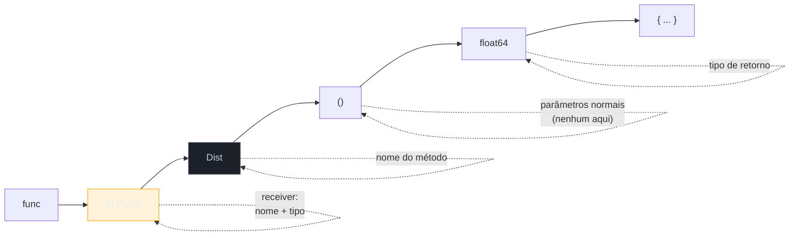
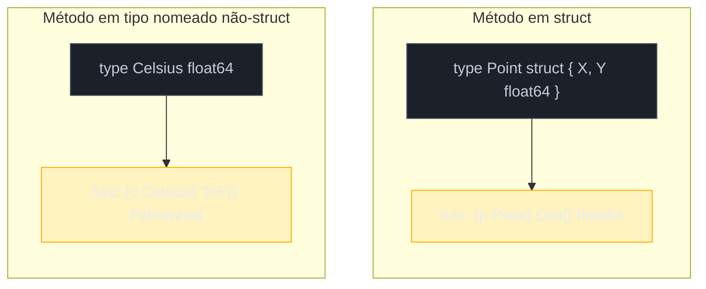

# Métodos

> [!abstract] TL;DR
> Um **método** em Go é uma função comum com um detalhe a mais na assinatura: um **receiver** — `func (p Point) Dist() float64 {...}` — que declara sobre qual valor o método age. `p.Dist()` chama esse método; por baixo, é indistinguível de passar `p` como primeiro argumento de uma função. A grande surpresa de quem vem de Java/Python/JS é que o receiver **não é implícito nem escondido** (como `this`/`self`): ele aparece na assinatura, com o nome que você escolher. E métodos não são exclusividade de struct — **qualquer tipo nomeado do mesmo pacote** pode ganhar métodos, inclusive `type Celsius float64`. A única restrição rígida: você só define métodos em tipos declarados **no seu próprio pacote** — sem monkey-patching de `int` nem de tipos importados.

## Onde mora o comportamento?

A nota anterior definiu `Point` como um struct — dois campos, `X` e `Y`, e nada mais:

```go
type Point struct {
    X, Y float64
}
```

Um struct em Go é só dados. Não há `class Point { ... métodos aqui ... }` — a declaração do tipo termina no `}` do struct. Então onde fica o comportamento? Se você quer calcular a distância de um `Point` até a origem, a saída mais óbvia — vindo de uma linguagem sem métodos livres, tipo C — é escrever uma função solta:

```go
func Dist(p Point) float64 {
    return math.Sqrt(p.X*p.X + p.Y*p.Y)
}

d := Dist(Point{X: 3, Y: 4}) // 5
```

Isso funciona, compila, e é código Go válido. Mas repare no que se perde: `Dist` não tem nenhuma ligação sintática com `Point` — é só mais uma função no pacote, competindo por nome com qualquer outra `Dist` que outro tipo queira ter. Se o pacote também tiver `type Vector struct{...}` e precisar de uma distância própria, você já não pode chamar a segunda função de `Dist` — precisa de `DistPoint` e `DistVector`, ou inventar outro esquema de nomes.

Go resolve isso com **métodos**: uma função ganha um **receiver** — um parâmetro extra, antes do nome, que amarra a função a um tipo específico:

```go
func (p Point) Dist() float64 {
    return math.Sqrt(p.X*p.X + p.Y*p.Y)
}

d := Point{X: 3, Y: 4}.Dist() // não compila direto — mas p.Dist() sim:
p := Point{X: 3, Y: 4}
d := p.Dist() // 5
```

`Dist` agora "pertence" a `Point`. Um `Vector` pode ter seu próprio `Dist` sem colisão de nome nenhuma, porque cada método vive no namespace do seu tipo, não no namespace do pacote inteiro. Isso é a resposta à pergunta de abertura: o comportamento não mora *dentro* do struct (a declaração do struct continua sendo só dados) — mora em funções **declaradas ao lado**, no mesmo pacote, amarradas ao tipo por meio do receiver.

A parte que costuma surpreender quem vem de Java, Python ou JavaScript não é a existência de métodos — é o quanto o mecanismo é **explícito**. Em Java, `this` aparece de graça dentro de qualquer método de instância, sem estar em lugar nenhum da assinatura. Em Python, ao menos `self` aparece na assinatura — mas como o primeiro parâmetro comum, sem sintaxe própria. Go faz uma terceira escolha: dá ao receiver uma **posição sintática dedicada**, entre `func` e o nome do método, separada da lista de parâmetros normais. Não é acidente de design — é a peça central deste capítulo.

## Anatomia de um método



A sintaxe completa é `func (receiver Tipo) NomeDoMétodo(parâmetros) retorno { corpo }`. Três peças que valem nomear com precisão, porque a terminologia aparece o tempo todo na documentação oficial e em qualquer discussão sobre Go:

- **Receiver** — `p Point`: um nome (`p`, escolhido por você) e um tipo (`Point`). É a cláusula entre parênteses logo após `func`, antes do nome do método.
- **Tipo receiver** (*receiver type*) — `Point`: o tipo ao qual o método fica associado. Segundo a [especificação da linguagem](https://go.dev/ref/spec#Method_declarations), o tipo receiver precisa ser um **tipo nomeado** definido no mesmo pacote do método — não pode ser um tipo ponteiro, nem um tipo de interface, nem um tipo declarado em outro pacote.
- **Conjunto de métodos** (*method set*) — o conjunto de todos os métodos associados a um tipo. `Point` tem um method set com `Dist` (e qualquer outro método que você declarar para `Point`); esse conceito volta a importar na [[03-Dominios/Tecnologia/Go/02 - Tipos, structs e métodos/05 - Composição por embedding|nota 05]], quando embedding entra em cena.

A declaração do método não precisa morar no mesmo arquivo `.go` que a declaração do tipo — só precisa estar no **mesmo pacote**. É comum, em pacotes grandes, separar `point.go` (com `type Point struct {...}`) de `point_methods.go` ou `point_dist.go` (com os métodos) — o compilador não se importa, resolve tudo pelo pacote, não pelo arquivo. O que importa de verdade — e volta na próxima seção — é o pacote onde o tipo receiver foi *declarado*.

> [!question]- O nome do receiver (`p`) importa, ou poderia ser qualquer coisa?
> Importa por convenção, não por regra do compilador. Assim como `self` em Python, `p` não é palavra reservada — qualquer identificador funciona (`this`, `receiver`, `x`). Mas o [Effective Go](https://go.dev/doc/effective_go#methods) recomenda algo bem diferente do hábito de outras linguagens: **abreviações curtas, derivadas do próprio tipo** — `p` para `Point`, `c` para `Celsius`, `s` para `Server` — repetidas de forma consistente em todos os métodos daquele tipo. Nada de `this` ou `self`: a comunidade Go trata esses nomes como estrangeirismos evitáveis. A convenção existe porque o receiver aparece em toda assinatura de método do tipo — um nome curto e consistente reduz ruído visual em bases de código grandes.

## Chamando um método

A chamada usa a sintaxe familiar de ponto, igual a qualquer linguagem orientada a objetos:

```go
p := Point{X: 3, Y: 4}
d := p.Dist() // 5

fmt.Println(d)
```

`p.Dist()` significa: "chame o método `Dist` do method set de `Point`, com `p` no papel do receiver". Não há `new`, não há instanciação de "objeto" no sentido de outras linguagens — `p` já é um valor `Point` comum, criado por um struct literal, e `Dist` é só mais uma função que esse valor sabe "invocar" por causa da associação declarada com `func (p Point)`.

## Método vs função: açúcar de organização

Tecnicamente, um método é uma função. O compilador Go, por baixo, trata `p.Dist()` de um jeito que se aproxima do que o Python faz com *bound methods*: o receiver é, na prática, o primeiro argumento — só que passado implicitamente pela sintaxe de ponto, em vez de aparecer explícito na chamada.

| | Função solta | Método |
|---|---|---|
| Declaração | `func Dist(p Point) float64` | `func (p Point) Dist() float64` |
| Chamada | `Dist(p)` | `p.Dist()` |
| Namespace | compartilha o namespace do pacote inteiro | vive no method set do tipo — sem colisão entre tipos |
| Descoberta via autocomplete | não — é só mais uma função do pacote | sim — `p.` lista só os métodos de `Point` |

A vantagem prática de método sobre função livre não é poder ("tudo que um método faz, uma função com o mesmo argumento também faz") — é **organização**: agrupar comportamento pelo tipo a que ele pertence, evitar colisão de nomes entre tipos diferentes, e ganhar autocomplete guiado por tipo em qualquer editor. É o mesmo argumento usado para justificar `@staticmethod` em Python (nota 01 de OO e Data Model, se você já passou por lá) — só que em Go **todo** método carrega essa mesma motivação organizacional, porque não existe a alternativa de "função de módulo solta que também é método", como no `@staticmethod`.

A equivalência não é só conceitual — dá para provar com código real, porque Go permite chamar qualquer método pelo nome do tipo, passando o receiver como primeiro argumento explícito (essa é, adiantando a seção seguinte, a *method expression*):

```go
p := Point{X: 3, Y: 4}

fmt.Println(p.Dist())       // chamada normal, via sintaxe de ponto
fmt.Println(Point.Dist(p))  // exatamente equivalente — receiver como argumento comum
```

As duas linhas produzem o mesmo `5`. `p.Dist()` é açúcar sintático para `Point.Dist(p)` — não uma analogia solta, mas algo que o próprio compilador aceita como sintaxe alternativa, ali para quem quiser ver o mecanismo sem disfarce.

> [!question]- Se é só açúcar, por que não usar sempre funções soltas e evitar a sintaxe extra?
> Porque métodos são o mecanismo pelo qual um tipo **satisfaz uma interface** em Go — assunto do Galho 3. Uma função solta `Dist(p Point) float64` nunca faz `Point` satisfazer uma interface `Distanciavel { Dist() float64 }`; só um método `func (p Point) Dist() float64` faz isso. Então, além da organização, métodos têm um papel estrutural: são a única forma de comportamento que participa do sistema de interfaces implícitas de Go.

## Métodos além de struct: qualquer tipo nomeado

Aqui está o ponto que mais engana quem assume, sem verificar, que método = feature de struct: em Go, **qualquer tipo nomeado (named type) declarado no seu pacote pode receber métodos** — não só structs. A nota anterior já introduziu tipos definidos como `type Celsius float64`: um novo tipo, com identidade própria, cujo *underlying type* é `float64`. Esse tipo pode ter métodos exatamente como `Point`:

```go
type Celsius float64
type Fahrenheit float64

func (c Celsius) ToF() Fahrenheit {
    return Fahrenheit(c*9/5 + 32)
}

boiling := Celsius(100)
fmt.Println(boiling.ToF()) // 212
```



`Celsius` não é um struct — é um `float64` com um nome próprio. Ainda assim, `func (c Celsius) ToF() Fahrenheit` é uma declaração de método perfeitamente válida, porque a única exigência da [especificação](https://go.dev/ref/spec#Method_declarations) é que o tipo receiver seja um **tipo nomeado definido no pacote atual** — não importa se o underlying type é um struct, um `float64`, um `[]string`, ou qualquer outro tipo que possa ser nomeado com `type`.

Esse padrão é comum em código Go idiomático: em vez de carregar um `float64` cru pelo programa inteiro e torcer para ninguém somar uma temperatura em Celsius com uma em Fahrenheit por engano, você nomeia os dois tipos separadamente — e cada um carrega os próprios métodos de conversão e formatação. O compilador então recusa `boiling + someFahrenheitValue` sem conversão explícita, porque `Celsius` e `Fahrenheit` são tipos distintos apesar de terem o mesmo underlying type — reforço direto do que a nota 02 já estabeleceu sobre tipos nomeados.

## A regra do próprio pacote

Go impõe um limite rígido sobre onde métodos podem ser declarados: segundo a especificação, "the receiver base type [...] must be defined in the same package as the method" — **o tipo receiver precisa estar definido no mesmo pacote do método**. Na prática, isso significa duas coisas que travam quem vem de linguagens mais permissivas:

1. **Você não pode adicionar método a um tipo embutido** como `int`, `string` ou `float64` diretamente — eles não têm "dono" de pacote que seja seu. `func (i int) Dobro() int { return i * 2 }` não compila: `cannot define new methods on non-local type int`.
2. **Você não pode adicionar método a um tipo de outro pacote** — nem mesmo um struct exportado de uma biblioteca que você importa. Se `time.Time` não tem o método que você queria, a saída não é "abrir a classe" de fora; é declarar um tipo novo no seu pacote (`type MeuHorario time.Time`, ou um struct que embeda `time.Time` — embedding é o assunto da [[03-Dominios/Tecnologia/Go/02 - Tipos, structs e métodos/05 - Composição por embedding|nota 05]]) e pendurar o método nesse tipo novo, local.

```go
// Não compila — int não é um tipo do seu pacote:
// func (i int) Dobro() int { return i * 2 }

// Solução: nomeie o tipo no seu próprio pacote primeiro
type Numero int

func (n Numero) Dobro() Numero {
    return n * 2
}
```

> [!warning] Sem monkey-patching, sem extension methods "de fora"
> Quem vem de Python ou JavaScript pode estar acostumado a *monkey-patching* — reabrir uma classe existente e enxertar um método novo em tempo de execução, inclusive em tipos embutidos ou de bibliotecas de terceiros. C# e Kotlin oferecem uma versão estaticamente tipada e mais disciplinada da mesma ideia, os *extension methods* (`fun String.shout() = this.uppercase() + "!"` em Kotlin), que parecem métodos de fato do tipo estendido sem alterar sua declaração original. Go **não tem equivalente para nenhum dos dois**. A regra "receiver precisa ser tipo local" é deliberada: qualquer método de qualquer tipo está sempre declarado no mesmo pacote desse tipo — nunca espalhado por arquivos de terceiros, nunca "enxertado" de fora. Ler `type Foo struct {...}` já diz, de forma completa e local, tudo que aquele pacote pode fazer com `Foo` — não há surpresa vinda de um `import` qualquer que decidiu estender o comportamento.

## Method value e method expression

Além da chamada direta `p.Dist()`, Go permite tratar um método como um **valor** de duas formas distintas — ambas úteis, e fáceis de confundir uma com a outra.

**Method value** — `p.Dist` (sem parênteses) produz uma função já vinculada ao receiver `p`, pronta para ser chamada sem argumento nenhum de receiver:

```go
p := Point{X: 3, Y: 4}
distDeP := p.Dist   // method value: func() float64, com p já embutido
fmt.Println(distDeP()) // 5
```

`distDeP` é uma variável do tipo `func() float64` — `p` já está "congelado" dentro dela, exatamente como um *bound method* em Python.

**Method expression** — `Point.Dist` (referenciando o método pelo **tipo**, não por um valor) produz uma função que recebe o receiver como **primeiro parâmetro explícito**:

```go
distGenerico := Point.Dist  // method expression: func(Point) float64
fmt.Println(distGenerico(p)) // 5 — p passado explicitamente
```

`distGenerico` é do tipo `func(Point) float64` — a versão "desaçucarada" que deixa explícito o que a sintaxe `p.Dist()` sempre fez implicitamente por baixo: passar o receiver como o primeiro argumento de uma função comum.

| | Sintaxe | Tipo resultante | Receiver |
|---|---|---|---|
| Chamada direta | `p.Dist()` | `float64` (já executado) | implícito, embutido na chamada |
| Method value | `p.Dist` | `func() float64` | já vinculado a `p` |
| Method expression | `Point.Dist` | `func(Point) float64` | explícito, primeiro parâmetro |

Method value é o mais comum na prática — aparece sempre que você passa um método como *callback* (`http.HandleFunc("/", server.handleIndex)`, por exemplo, onde `handleIndex` é um method value com o receiver `server` já embutido). Method expression é mais raro no dia a dia, mas aparece em código genérico que precisa tratar o receiver como qualquer outro parâmetro.

## Casos práticos

**1. Método em struct**, retomando `Point`:

```go
type Point struct {
    X, Y float64
}

func (p Point) Dist() float64 {
    return math.Sqrt(p.X*p.X + p.Y*p.Y)
}

func main() {
    origem := Point{X: 0, Y: 0}
    p := Point{X: 3, Y: 4}
    fmt.Println(p.Dist())      // 5
    fmt.Println(origem.Dist()) // 0
}
```

**2. Método em tipo nomeado não-struct**, `Celsius`:

```go
type Celsius float64
type Fahrenheit float64

func (c Celsius) ToF() Fahrenheit {
    return Fahrenheit(c*9/5 + 32)
}

func (c Celsius) String() string {
    return fmt.Sprintf("%.1f°C", float64(c))
}

func main() {
    agua := Celsius(100)
    fmt.Println(agua)        // 100.0°C — String() faz agua "saber se formatar"
    fmt.Println(agua.ToF())  // 212
}
```

(`String()` aqui não é coincidência de nome — é o método que satisfaz a interface `fmt.Stringer`, teaser de uma linha para o Galho 3: qualquer tipo com `String() string` no method set ganha formatação customizada de graça em `fmt.Println` e afins.)

**3. Method value guardado numa variável**, útil para passar comportamento como valor:

```go
type Contador struct {
    total int
}

func (c Contador) Valor() int {
    return c.total
}

func main() {
    c := Contador{total: 42}
    obterValor := c.Valor // method value: func() int, com c embutido

    fmt.Println(obterValor()) // 42

    // útil como callback, por exemplo:
    processar(obterValor)
}

func processar(f func() int) {
    fmt.Println("processando:", f())
}
```

**4. Method expression aplicado a uma coleção**, onde tratar o receiver como argumento comum resolve um problema real — aplicar o "mesmo método" a uma lista de valores sem escrever um laço manual para cada um:

```go
type Item struct {
    Nome  string
    Preco float64
}

func (i Item) Etiqueta() string {
    return fmt.Sprintf("%s: R$%.2f", i.Nome, i.Preco)
}

func mapear(itens []Item, f func(Item) string) []string {
    resultado := make([]string, len(itens))
    for idx, item := range itens {
        resultado[idx] = f(item)
    }
    return resultado
}

func main() {
    itens := []Item{
        {Nome: "Caneta", Preco: 2.5},
        {Nome: "Caderno", Preco: 15.0},
    }

    etiquetas := mapear(itens, Item.Etiqueta) // method expression passado como função comum
    fmt.Println(etiquetas) // [Caneta: R$2.50 Caderno: R$15.00]
}
```

`Item.Etiqueta` tem exatamente o tipo que `mapear` espera como segundo parâmetro — `func(Item) string` — porque uma method expression sempre expõe o receiver como primeiro argumento explícito. Sem esse recurso, seria preciso escrever um *wrapper* manual (`func(i Item) string { return i.Etiqueta() }`) só para encaixar a assinatura.

## Armadilhas comuns

> [!warning] Método em tipo de outro pacote não compila
> `func (t time.Time) Formatado() string {...}` no seu pacote produz `cannot define new methods on non-local type time.Time`. Não existe "reabrir" um tipo importado — a única saída é declarar um tipo novo no seu pacote (nomeado ou via embedding) e pendurar o método nesse tipo novo.

> [!warning] O receiver não é um "`this` disfarçado" — é um parâmetro nomeado por você
> Quem vem de Java tende a procurar, por reflexo, algo equivalente a `this.campo` implícito dentro do corpo do método. Em Go, não existe: se o receiver se chama `p`, você escreve `p.X`, nunca um `X` "flutuando" sem prefixo esperando ser resolvido como campo do receiver. Esquecer isso gera `undefined: X` — o compilador não vai adivinhar que você quis dizer `p.X`.

> [!warning] Method value NÃO significa que mutar dentro dele muda o original — depende do tipo do receiver
> `p.Dist` (method value) embute uma **cópia** de `p` se o receiver de `Dist` for `value receiver` (`func (p Point) ...`, como visto aqui). Qualquer alteração feita a `p` *dentro* do método não se propaga para a variável original — o método está operando sobre uma cópia. Se a intenção é que o método altere o valor original, o receiver precisa ser um **pointer receiver** (`func (p *Point) ...`), assunto completo da próxima nota — inclusive quando essa escolha importa por performance, e não só por mutabilidade.

## Teaser: métodos e interfaces

Uma linha de antecipação, sem entrar no mérito ainda: é exatamente o method set de um tipo — os métodos que ele declara — que decide, silenciosamente e sem `implements` nenhum, quais interfaces esse tipo **satisfaz**. Esse mecanismo (satisfação implícita de interface) é o assunto inteiro do Galho 3.

## Como explicar em inglês

> In Go, a method is a regular function with a **receiver** — an extra clause between `func` and the method name that binds the function to a named type: `func (p Point) Dist() float64`. Unlike Java's implicit `this` or even Python's `self` (which at least appears as a normal parameter), Go's receiver has its own dedicated syntax slot, and you choose its name yourself — there's no hidden binding to reverse-engineer. Methods aren't struct-only: **any named type declared in your package** can have methods, including a type like `type Celsius float64`. The one hard rule is that the receiver's base type must be defined in the same package as the method — Go has no monkey-patching and no extension methods; you can't attach a method to `int` or to a type from an imported package. Beyond a direct call, a method can be treated as a value two ways: a **method value** (`p.Dist`) binds the receiver in, producing a plain `func() float64`; a **method expression** (`Point.Dist`) leaves the receiver as an explicit first parameter, producing `func(Point) float64`. This note uses value receivers throughout; whether to use a value or pointer receiver — and when that choice actually matters — is the next topic.

| Termo PT | Termo EN |
|---|---|
| receptor / receiver | receiver |
| conjunto de métodos | method set |
| valor de método | method value |
| expressão de método | method expression |
| associar comportamento a um tipo | attach behavior to a type |
| tipo nomeado | named type |
| tipo receiver | receiver type |
| método vinculado | bound method |
| satisfazer uma interface | satisfy an interface |

## O que vem a seguir

Toda esta nota usou **value receiver** — `func (p Point) Dist()` — sem questionar a escolha. Mas existe uma segunda forma, `func (p *Point) Dist()`, com implicações reais sobre mutação e performance que qualquer dev Go precisa internalizar antes de escrever código de produção. A [[04 - Value vs pointer receiver|nota 04]] entra nessa escolha a fundo: quando um método precisa de pointer receiver para mutar o original, o custo de copiar structs grandes a cada chamada com value receiver, e a regra prática (quase sempre pointer receiver, com poucas exceções) que a comunidade Go convergiu.

## Veja também

- [[03-Dominios/Tecnologia/Go/02 - Tipos, structs e métodos/02 - Tipos nomeados e definições de tipo|02 — Tipos nomeados e tipos definidos]] — `type Celsius float64` e o conceito de underlying type retomado aqui
- [[03-Dominios/Tecnologia/Go/02 - Tipos, structs e métodos/04 - Value vs pointer receiver|04 — Value vs pointer receiver]] — próxima nota do galho
- [[03-Dominios/Tecnologia/Go/02 - Tipos, structs e métodos/05 - Composição por embedding|05 — Embedding e promoção de métodos]] — method set completo de um struct que embeda outro tipo
- [[03-Dominios/Tecnologia/Go/01 - Fundamentos e sintaxe/07 - Ponteiros e o modelo de memória|Galho 1, nota 07]] — `*`/`&`, pré-requisito para entender pointer receiver na próxima nota
- [[03-Dominios/Tecnologia/Python/OO e Data Model/01 - Classes — definição, atributos e métodos|Python, OO e Data Model, nota 01]] — `self` explícito, para quem quiser comparar o mecanismo de *binding* lado a lado
- [[03-Dominios/Tecnologia/Go/index|Trilha Go]]

## Fontes

- The Go Authors. *The Go Programming Language Specification — Method declarations*. go.dev. https://go.dev/ref/spec#Method_declarations (acessado em 2026-07-16)
- The Go Authors. *The Go Programming Language Specification — Method sets*. go.dev. https://go.dev/ref/spec#Method_sets (acessado em 2026-07-16)
- The Go Authors. *A Tour of Go — Methods*. go.dev. https://go.dev/tour/methods/1 (acessado em 2026-07-16)
- The Go Authors. *Effective Go — Methods*. go.dev. https://go.dev/doc/effective_go#methods (acessado em 2026-07-16)
- Go by Example. *Methods*. gobyexample.com. https://gobyexample.com/methods (acessado em 2026-07-16)
