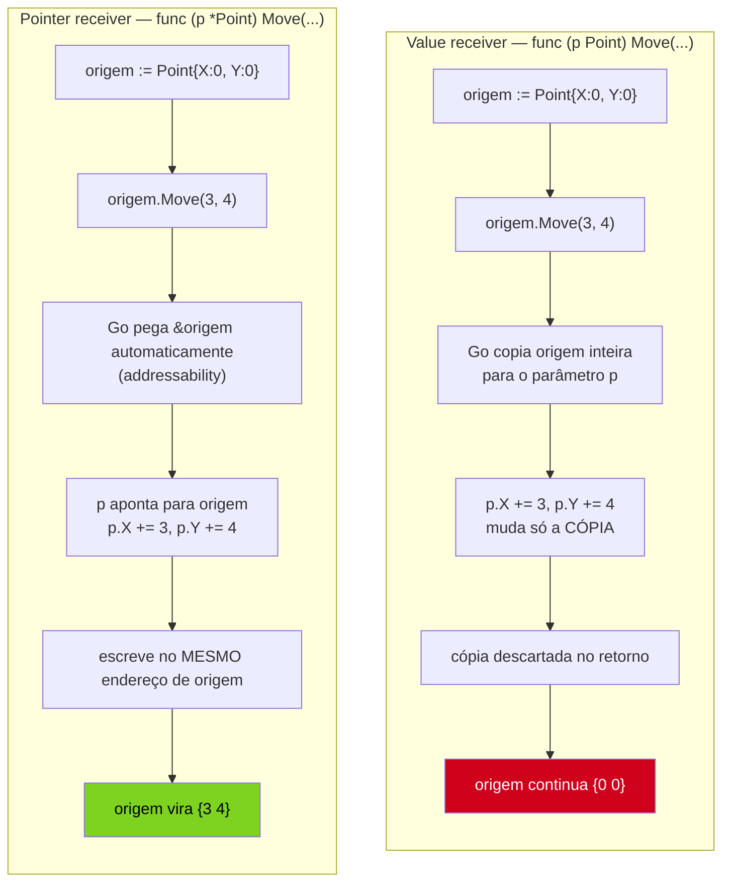
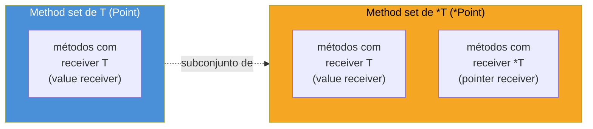

# Value vs pointer receiver

> [!abstract] TL;DR
> Um **value receiver** (`func (p Point) Move(dx, dy int)`) recebe uma **cópia** do valor — mutar campos dentro do método nunca afeta a variável original do chamador. Um **pointer receiver** (`func (p *Point) Move(dx, dy int)`) recebe o **endereço** do valor — mutações se propagam de verdade, e structs grandes deixam de ser copiadas a cada chamada. A regra prática: se algum método do tipo precisa mutar, ou se a struct é grande, **todos** os métodos daquele tipo usam pointer receiver, por consistência. Go ainda facilita a vida com **addressability**: chamar um método de pointer receiver sobre um valor endereçável (`p.Move()`) funciona sem escrever `(&p).Move()` — o compilador pega o endereço sozinho. Mas isso tem limite: valores não endereçáveis (como um item dentro de um `map`) quebram essa mágica, e é aí que o erro de compilação aparece.

## O método `Move` que não move nada

Retomando o `Point` da nota anterior, você escreve um método para deslocar o ponto:

```go
type Point struct {
    X, Y int
}

func (p Point) Move(dx, dy int) {
    p.X += dx
    p.Y += dy
}
```

Compila sem nenhum aviso. Você chama:

```go
origem := Point{X: 0, Y: 0}
origem.Move(3, 4)
fmt.Println(origem) // {0 0} — não moveu NADA
```

`origem` continua `{0 0}`. Nenhum erro, nenhum panic, nenhum warning — o programa simplesmente não fez o que o nome do método prometia. Quem já leu a [[03-Dominios/Tecnologia/Go/01 - Fundamentos e sintaxe/07 - Ponteiros e o modelo de memória|nota 07 do galho 1]] reconhece o padrão na hora: `Move` tem receiver `p Point` — sem `*` — então `p` dentro do método é uma cópia de `origem`, exatamente como um parâmetro comum de função recebido por valor. `p.X += dx` muda o campo `X` **da cópia**; a cópia desaparece quando `Move` retorna, e `origem` nunca soube que existiu.

Esse é o bug mais comum de quem escreve o primeiro punhado de métodos em Go: o compilador nunca reclama, porque `func (p Point) Move(...)` é uma declaração perfeitamente válida — só não é o que você queria. A correção é trocar o receiver de `Point` para `*Point`:

```go
func (p *Point) Move(dx, dy int) {
    p.X += dx
    p.Y += dy
}

origem := Point{X: 0, Y: 0}
origem.Move(3, 4)
fmt.Println(origem) // {3 4} — agora sim
```

Repare que a *chamada* `origem.Move(3, 4)` não mudou nada — nem `&origem`, nem parênteses extras. Só a *declaração* do método mudou, de `(p Point)` para `(p *Point)`. Essa assimetria — a chamada continua igual, mas o efeito muda radicalmente — é exatamente o que esta nota existe para desembaraçar.

> [!info] O que esta nota assume
> Você já leu a mecânica pura de ponteiros (`*`, `&`, desreferência, pass-by-value) na [[03-Dominios/Tecnologia/Go/01 - Fundamentos e sintaxe/07 - Ponteiros e o modelo de memória|nota 07 do galho 1]] e a anatomia de método (receiver, method set, method value/expression) na [[03-Dominios/Tecnologia/Go/02 - Tipos, structs e métodos/03 - Métodos|nota 03]]. Aqui, essas duas peças se encontram: o mesmo dilema valor-vs-ponteiro, agora aplicado especificamente à posição do receiver.

## O que muda entre os dois



O mecanismo por trás não é novo: é o mesmíssimo pass-by-value da nota de ponteiros, só que agora o "argumento" copiado é o receiver, não um parâmetro comum. `func (p Point) Move(...)` é, por baixo, indistinguível de `func Move(p Point, dx, dy int)` — a nota 03 já mostrou essa equivalência via *method expression* (`Point.Move(p, 3, 4)`). Trocar para `*Point` é trocar o tipo desse "primeiro parâmetro implícito" de `Point` para `*Point` — e tudo que já vale para ponteiros em funções comuns vale aqui, sem exceção nova.

## Quando usar cada um

Duas perguntas resolvem a escolha na maioria dos casos, e nenhuma delas é "gosto pessoal":

**1. O método precisa mutar o receiver?** Se sim, `*T` é obrigatório — não existe outro jeito de um método alterar o valor original do chamador. Um método `Move`, `SetNome`, `Adicionar`, `Fechar` — qualquer verbo que sugira efeito colateral no próprio valor — pede pointer receiver.

**2. A struct é grande, ou copiá-la é caro?** Mesmo métodos que só leem (`String()`, `Total()`, `Validar()`) se beneficiam de pointer receiver quando a struct tem muitos campos, arrays fixos, ou qualquer coisa cara de duplicar a cada chamada — exatamente o mesmo raciocínio de custo já visto para funções comuns na nota 07 do galho 1.

```go
type Pedido struct {
    ID         int
    Cliente    string
    Itens      [200]string // array fixo — caro de copiar
    Total      float64
}

// Ruim: mesmo só lendo, copia os 200 itens a cada chamada
func (p Pedido) Resumo() string {
    return fmt.Sprintf("Pedido #%d — R$%.2f", p.ID, p.Total)
}

// Bom: copia só o endereço, qualquer que seja o tamanho de Pedido
func (p *Pedido) Resumo() string {
    return fmt.Sprintf("Pedido #%d — R$%.2f", p.ID, p.Total)
}
```

Se a resposta às duas perguntas for "não" — struct pequena (dois ou três campos primitivos), e nenhum método precisa mutar — value receiver é uma escolha legítima, e às vezes até mais rápida: copiar um struct de 16 bytes cabe num registrador de CPU, e evita a indireção de seguir um ponteiro. Tipos como `time.Duration` ou pequenos value objects (`Point{X, Y int}` puramente geométrico, sem mutação) são candidatos naturais a value receiver.

| Situação | Receiver recomendado |
|---|---|
| Método precisa mutar campo(s) do receiver | `*T` — obrigatório |
| Struct grande (muitos campos, arrays fixos, slices internos grandes) | `*T` — evita copiar a cada chamada |
| Struct pequena (2-3 campos primitivos), só leitura, nenhum método do tipo muta | `T` — cópia é barata, sem indireção |
| Tipo já tem QUALQUER método com `*T` | `*T` em todos — regra de consistência (próxima seção) |
| Tipo representa valor imutável por design (ex.: `time.Duration`-like) | `T` — reforça a intenção de imutabilidade |

Na dúvida, a comunidade Go tende a errar para o lado de `*T`: a [Effective Go](https://go.dev/doc/effective_go#pointers_vs_values) reconhece que, "se não estiver claro, use pointer receiver" — o custo de uma indireção extra em structs pequenas raramente é mensurável, enquanto o custo de escolher `T` errado (bug silencioso de não-mutação, ou incompatibilidade de interface) é caro de rastrear depois.

## A regra de consistência: um tipo, um estilo de receiver

Aqui está a parte que não é intuitiva vindo de outras linguagens: a decisão não é *por método* — é **por tipo**. Se qualquer método de `Point` precisar de pointer receiver, a convenção da comunidade Go — reforçada pelo próprio [Go wiki de code review](https://github.com/golang/go/wiki/CodeReviewComments#receiver-type) — é que **todos** os métodos daquele tipo usem pointer receiver, mesmo os que só leem e não precisariam tecnicamente:

```go
type Point struct {
    X, Y int
}

// Move precisa mutar — exige pointer receiver
func (p *Point) Move(dx, dy int) {
    p.X += dx
    p.Y += dy
}

// Dist só lê — tecnicamente poderia ser value receiver,
// mas usa pointer receiver por CONSISTÊNCIA com Move
func (p *Point) Dist() float64 {
    return math.Sqrt(float64(p.X*p.X + p.Y*p.Y))
}
```

O motivo não é estético — é sobre **method set** (a próxima seção define o termo com precisão), e sobre o que acontece quando `Point` é usado através de uma interface. Misturar `func (p Point) Dist()` com `func (p *Point) Move(...)` no mesmo tipo produz um comportamento sutil e surpreendente: um valor `Point` (não `*Point`) satisfaz uma interface que exige só `Dist()`, mas **não** satisfaz uma que exige `Move()` — porque `Move` só está no method set de `*Point`, nunca no de `Point`. Um leitor do código, vendo `Point` implementar `Dist` com receiver de valor, pode assumir (errado) que `Point` também aceita `Move` do mesmo jeito. Consistência elimina essa armadilha antes que ela exista.

> [!info] Teaser — isso reaparece com força total no galho 3
> A frase "`Move` só está no method set de `*Point`" tem uma implicação grande: **`Point` e `*Point` satisfazem interfaces diferentes**. É possível que um valor `Point` não sirva onde uma interface pede, mesmo que `*Point` sirva perfeitamente. Esse mecanismo — e como ele frequentemente derruba código que "devia compilar" na primeira tentativa de quem está aprendendo Go — é assunto do [[03-Dominios/Tecnologia/Go/03 - Interfaces e composição/index|Galho 3]]. Aqui, guarde só a intuição: method set de `T` ⊂ method set de `*T`, nunca o contrário.

## Method sets: quem tem o quê

**Method set** de um tipo é o conjunto de métodos que ele "sabe chamar" via sintaxe de ponto. A regra da [especificação da linguagem](https://go.dev/ref/spec#Method_sets) é simples de enunciar e fácil de esquecer na prática:

- O method set de `T` contém **só** os métodos declarados com receiver `T` (value receiver).
- O method set de `*T` contém **os dois**: os métodos com receiver `T` e os métodos com receiver `*T`.



| Método declarado com | Está no method set de `T` | Está no method set de `*T` |
|---|---|---|
| `func (p Point) Dist() float64` | Sim | Sim |
| `func (p *Point) Move(dx, dy int)` | **Não** | Sim |

A tabela explica um erro de compilação clássico de quem tenta satisfazer uma interface com um tipo, e não com um ponteiro para o tipo:

```go
type Movivel interface {
    Move(dx, dy int)
}

type Point struct{ X, Y int }

func (p *Point) Move(dx, dy int) {
    p.X += dx
    p.Y += dy
}

func mover(m Movivel) {
    m.Move(1, 1)
}

func main() {
    p := Point{X: 0, Y: 0}
    // mover(p)   // ERRO: Point does not implement Movivel (Move has pointer receiver)
    mover(&p)     // OK — *Point implementa Movivel
}
```

`p` (do tipo `Point`) não satisfaz `Movivel`, porque `Move` só existe no method set de `*Point`. `&p` (do tipo `*Point`) satisfaz normalmente. Esse é exatamente o teaser da seção anterior, agora com código — e é o motivo pelo qual boa parte do código Go idiomático passa `*T` para funções que recebem interfaces, mesmo quando `T` "parece" suficiente.

## Addressability: por que `p.Move()` funciona sem `&`

Se `Move` exige pointer receiver, por que `origem.Move(3, 4)` compilou sem você escrever `(&origem).Move(3, 4)`? A resposta é **addressability** (endereçabilidade): quando você chama um método de pointer receiver através de um valor, e esse valor é **endereçável** — ou seja, existe uma variável nomeada da qual dá para tirar `&` — o compilador insere o `&` automaticamente, como açúcar sintático.

```go
origem := Point{X: 0, Y: 0}
origem.Move(3, 4) // açúcar para (&origem).Move(3, 4) — origem é endereçável
```

`origem` é uma variável local com nome e endereço próprio — endereçável por definição. O compilador reescreve a chamada por trás dos panos, exatamente como já faz com `p.Campo` para `(*p).Campo` no sentido contrário (visto na nota 07 do galho 1). É a mesma filosofia de "não force o programador a escrever ruído que o compilador já sabe inferir com segurança".

Mas nem todo valor é endereçável. Alguns exemplos onde a mágica **não** acontece:

```go
type Ponto struct{ X, Y int }
func (p *Ponto) Move(dx, dy int) { p.X += dx; p.Y += dy }

// Struct literal não tem endereço estável — não é endereçável
// Ponto{X: 1, Y: 1}.Move(1, 1) // ERRO: cannot call pointer method on Ponto{...}

// Item de um map NÃO é endereçável
mapa := map[string]Ponto{"a": {X: 0, Y: 0}}
// mapa["a"].Move(1, 1) // ERRO: cannot call pointer method on mapa["a"]

// Valor retornado por função também não é endereçável
func obterPonto() Ponto { return Ponto{X: 0, Y: 0} }
// obterPonto().Move(1, 1) // ERRO: cannot call pointer method on obterPonto()
```

O caso do `map` é o mais comum de aparecer em código real, e o mais confuso de diagnosticar na primeira vez — porque `mapa["a"].X` (leitura) funciona perfeitamente, e só `mapa["a"].Move(...)` (chamada de pointer method) quebra. A razão: o Go runtime não garante um endereço de memória estável para um valor dentro de um `map` — o map pode reorganizar seus buckets internamente a qualquer rehash, movendo os valores fisicamente na memória. Permitir `&mapa["a"]` criaria um ponteiro que poderia apontar para "lixo" depois do próximo `insert`. Por segurança, a linguagem simplesmente proíbe tirar o endereço de um item de map — e, por extensão, proíbe chamar métodos de pointer receiver sobre ele diretamente.

## Nil pointer receiver: válido, mas exige cuidado

Diferente de uma desreferência comum (`*p` com `p == nil`, que sempre gera panic), um **método** com pointer receiver pode ser chamado sobre um receiver `nil` sem panic imediato — desde que o corpo do método não desreferencie o receiver de forma que exija um valor real:

```go
type Lista struct {
    valor int
    prox  *Lista
}

func (l *Lista) Tamanho() int {
    if l == nil {
        return 0 // trata nil explicitamente, ANTES de acessar campos
    }
    return 1 + l.prox.Tamanho()
}

func main() {
    var l *Lista // nil
    fmt.Println(l.Tamanho()) // 0 — funciona, sem panic
}
```

`l.Tamanho()` com `l == nil` chama o método normalmente — Go só passa o valor `nil` como receiver, exatamente como passaria qualquer outro ponteiro. O panic só aconteceria se o corpo tentasse acessar `l.valor` sem checar `l == nil` primeiro. Esse padrão é comum em estruturas recursivas (listas ligadas, árvores) onde "nó vazio" é representado por `nil`, e cada método já sabe tratar esse caso como base da recursão — muito parecido com o idioma de listas em Lisp/Scheme, mas explícito via checagem, não implícito na linguagem.

> [!info] Cross-stack: `null` em Java não tem esse comportamento
> Em Java, `objetoNulo.metodo()` sempre lança `NullPointerException` antes mesmo de o corpo do método rodar — a JVM verifica a referência antes do dispatch. Em Go, o dispatch de método baseado em receiver `nil` **funciona normalmente**; o panic só ocorre se e quando o corpo do método desreferenciar um campo sem checar. É uma diferença real de semântica, não só de sintaxe: Go deixa você escrever métodos que tratam `nil` como um valor legítimo do domínio (como "lista vazia"), algo que Java não permite sem um objeto sentinela dedicado.

## Casos práticos

**1. Value receiver correto — leitura de struct pequena, sem mutação:**

```go
type Ponto struct{ X, Y int }

func (p Ponto) String() string {
    return fmt.Sprintf("(%d, %d)", p.X, p.Y)
}

p := Ponto{X: 3, Y: 4}
fmt.Println(p) // (3, 4) — value receiver é suficiente, Ponto é pequeno e não muta
```

**2. Pointer receiver por mutação — o `Move` corrigido, com verificação:**

```go
type Ponto struct{ X, Y int }

func (p *Ponto) Move(dx, dy int) {
    p.X += dx
    p.Y += dy
}

func main() {
    p := Ponto{X: 0, Y: 0}
    p.Move(3, 4)
    fmt.Println(p) // {3 4}
}
```

**3. Pointer receiver por performance — struct grande, mesmo sem mutação:**

```go
type Matriz struct {
    Dados [100][100]float64 // 80KB
}

// value receiver aqui copiaria 80KB a cada chamada
func (m *Matriz) Soma() float64 {
    var total float64
    for _, linha := range m.Dados {
        for _, v := range linha {
            total += v
        }
    }
    return total
}
```

**4. A regra de consistência aplicada — um tipo, um estilo:**

```go
type ContaBancaria struct {
    titular string
    saldo   float64
}

// Depositar muta — exige pointer receiver
func (c *ContaBancaria) Depositar(valor float64) {
    c.saldo += valor
}

// Saldo só lê, mas usa pointer receiver por CONSISTÊNCIA com Depositar
func (c *ContaBancaria) Saldo() float64 {
    return c.saldo
}

// Titular também segue o mesmo padrão
func (c *ContaBancaria) Titular() string {
    return c.titular
}
```

Repare que, com a regra de consistência aplicada, **toda** chamada em `ContaBancaria` passa a exigir um valor endereçável (ou já um `*ContaBancaria`) — o que reforça, na prática, por que construtores idiomáticos em Go quase sempre devolvem `*T` (`func NovaContaBancaria(titular string) *ContaBancaria { return &ContaBancaria{titular: titular} }`): o ponteiro já sai pronto para satisfazer qualquer método do tipo, sem depender de addressability em cada ponto de uso.

## Armadilhas comuns

> [!warning] Método "deveria mutar" mas usa value receiver — o bug some sem erro de compilação
> É o erro de abertura desta nota, e vale repetir a assinatura do sintoma: o código **compila**, **roda**, e simplesmente não produz o efeito esperado — sem panic, sem warning. Se um método tem nome de verbo de ação (`Adicionar`, `Remover`, `Atualizar`, `Fechar`, `Resetar`) e não usa pointer receiver, é sinal de alerta quase certo. A defesa é hábito, não ferramenta: ao escrever um método que altera um campo do receiver, pergunte "esse receiver é `*T`?" antes de rodar o código, não depois de debugar por que o estado não mudou.

> [!warning] Misturar value e pointer receiver no mesmo tipo
> Go **permite** compilar um tipo com `func (p Point) Dist() float64` e `func (p *Point) Move(dx, dy int)` juntos — não há erro de sintaxe nisso. O problema é semântico: o method set de `Point` (valor) e o de `*Point` (ponteiro) ficam diferentes, o que pode fazer `Point` satisfazer uma interface e `*Point` satisfazer outra maior, de forma que confunde quem lê o código sem checar cada assinatura com cuidado. `go vet` não pega isso por padrão; a defesa é convenção de equipe — decidir o receiver do tipo inteiro na primeira declaração de método, e manter todos os métodos seguintes.

> [!warning] Chamar pointer method sobre valor não endereçável — item de `map` é o caso clássico
> ```go
> type Contador struct{ n int }
> func (c *Contador) Inc() { c.n++ }
>
> contadores := map[string]Contador{"a": {n: 0}}
> // contadores["a"].Inc() // ERRO: cannot call pointer method on contadores["a"]
> ```
> O erro de compilação (`cannot call pointer method on ..., cannot take address of ...`) é direto, mas a solução não é óbvia na primeira vez: como `map[string]Contador` não permite tirar endereço do valor armazenado, a correção passa por usar `map[string]*Contador` (armazenar ponteiros, não valores), ou extrair o valor para uma variável local, mutar, e regravar de volta no map — nunca chamar o pointer method direto na expressão de indexação.

## Como explicar em inglês

> A **value receiver** — `func (p Point) Move(dx, dy int)` — receives a **copy** of the value; mutating fields inside the method never affects the caller's original. A **pointer receiver** — `func (p *Point) Move(dx, dy int)` — receives the value's address, so mutations propagate for real, and large structs stop being copied on every call. The community convention, backed by the Go wiki's code review guidelines, is **receiver consistency**: if any method of a type needs a pointer receiver, all methods of that type should use one, because mixing them produces different **method sets** for `T` and `*T` — `T`'s method set holds only value-receiver methods, while `*T`'s holds both. Go smooths over the syntax with **addressability**: calling a pointer-receiver method on an addressable value (`p.Move()`) auto-inserts the `&`, but this breaks for non-addressable values like a map entry (`m["k"].Move()` fails to compile), because Go can't guarantee a stable address inside a map's internal storage. A nil pointer receiver is valid too — the method call itself doesn't panic, only dereferencing an unchecked field inside it would.

| Termo PT | Termo EN |
|---|---|
| receptor por valor | value receiver |
| receptor por ponteiro | pointer receiver |
| conjunto de métodos | method set |
| endereçável | addressable |
| consistência do receptor | receiver consistency |
| receptor nulo | nil receiver |
| satisfazer uma interface | satisfy an interface |
| item de mapa | map entry |

## O que vem a seguir

Com value vs. pointer receiver resolvido — e o motivo pelo qual `Point` e `*Point` podem satisfazer conjuntos diferentes de interfaces já plantado como teaser — falta uma peça para fechar o galho: e se um struct pudesse "herdar" o method set de outro tipo sem herança de verdade? A [[05 - Composição por embedding|nota 05]] mostra **embedding**, o mecanismo de composição de Go que promove métodos (e campos) de um tipo interno para o tipo que o contém — e como a escolha de value vs. pointer receiver, vista aqui, se propaga através do embedding de formas que valem a pena antecipar.

## Veja também

- [[03-Dominios/Tecnologia/Go/02 - Tipos, structs e métodos/03 - Métodos|03 — Métodos]] — anatomia do receiver, method value e method expression
- [[03-Dominios/Tecnologia/Go/02 - Tipos, structs e métodos/05 - Composição por embedding|05 — Composição por embedding]] — próxima nota do galho
- [[03-Dominios/Tecnologia/Go/01 - Fundamentos e sintaxe/07 - Ponteiros e o modelo de memória|Galho 1, nota 07]] — mecânica pura de ponteiro, pré-requisito desta nota
- [[03-Dominios/Tecnologia/Go/03 - Interfaces e composição/index|Galho 3]] — satisfação de interface via method set, aprofundado
- [[03-Dominios/Tecnologia/Go/index|Trilha Go]]

## Fontes

- The Go Authors. *The Go Programming Language Specification — Method sets*. go.dev. https://go.dev/ref/spec#Method_sets (acessado em 2026-07-16)
- The Go Authors. *The Go Programming Language Specification — Address operators*. go.dev. https://go.dev/ref/spec#Address_operators (acessado em 2026-07-16)
- Go Wiki. *Code Review Comments — Receiver Type*. github.com. https://github.com/golang/go/wiki/CodeReviewComments#receiver-type (acessado em 2026-07-16)
- The Go Authors. *A Tour of Go — Pointer receivers*. go.dev. https://go.dev/tour/methods/4 (acessado em 2026-07-16)
- The Go Authors. *A Tour of Go — Methods and pointer indirection*. go.dev. https://go.dev/tour/methods/6 (acessado em 2026-07-16)
- The Go Authors. *Effective Go — Pointers vs. Values*. go.dev. https://go.dev/doc/effective_go#pointers_vs_values (acessado em 2026-07-16)
