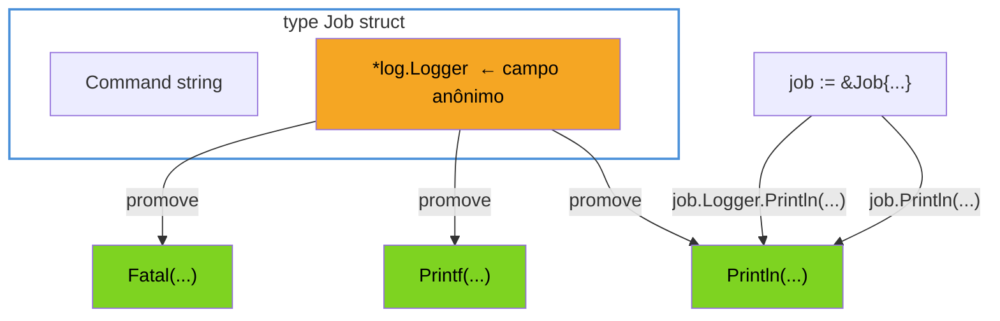
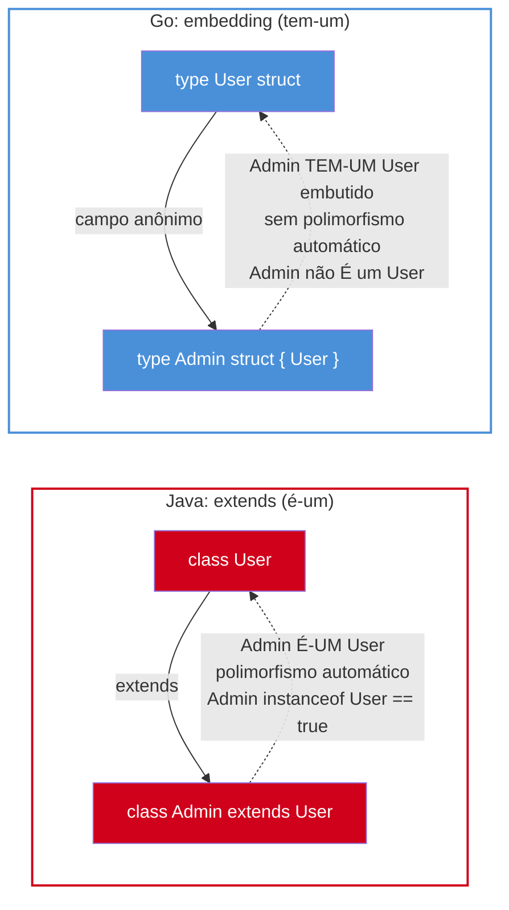
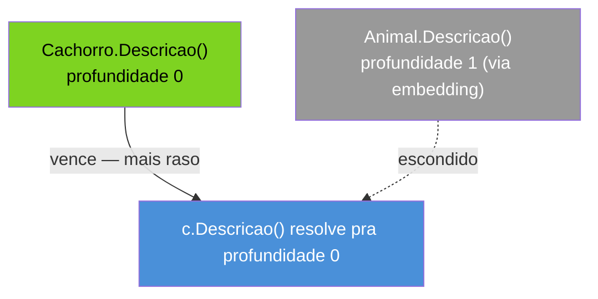
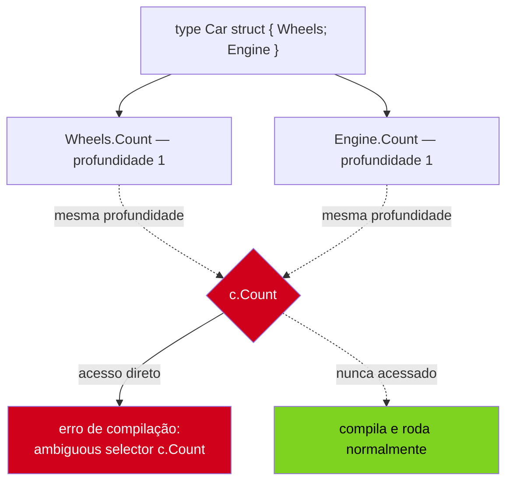

# Composição por embedding

> [!abstract] TL;DR
> Go não tem `extends`. Para reaproveitar campos e métodos de um tipo em outro, a ferramenta é o **campo anônimo** — declarar um tipo dentro de um struct sem lhe dar nome (`type Admin struct { User }`) — chamado de **embedding**. O compilador então **promove** os campos e métodos do tipo embedado para o tipo externo: `admin.Nome` e `admin.Salvar()` funcionam mesmo que `Admin` nunca tenha declarado `Nome` nem `Salvar` diretamente. Isso não é herança disfarçada — é **composição com açúcar sintático de acesso**: `Admin` **tem um** `User` embutido (não **é um** `User`), sem polimorfismo automático e sem reescrita de método que "sobrescreva" a versão do tipo externo em código que só conhece o tipo embedado. Quando dois campos ou métodos promovidos colidem em nome, Go não decide por você: se estiverem na mesma profundidade, o acesso ambíguo só vira **erro de compilação no momento em que você tenta usá-lo** — nunca antes, nunca por adivinhação de prioridade.

## O reflexo do `extends` que não existe

Você está desenhando um sistema de usuários e precisa de um tipo `Admin` que faz tudo que um `User` faz — tem nome, e-mail, sabe se autenticar — e mais um punhado de capacidades exclusivas, como banir outro usuário. Se você vem de Java, o reflexo é imediato: uma classe-base `User` com os campos e métodos comuns, e `class Admin extends User { ... }` herdando tudo de graça.

Go não tem essa palavra-chave. Não existe `class`, não existe `extends`, e — como as notas anteriores deste galho já estabeleceram — um `struct` é só dados; comportamento vem de métodos declarados ao lado, amarrados por um receiver. Sem herança, a saída ingênua é duplicar campos manualmente:

```go
type User struct {
    Nome  string
    Email string
}

func (u User) Autenticar(senha string) bool {
    // lógica de autenticação
    return true
}

type Admin struct {
    Nome  string // duplicado
    Email string // duplicado
    Nivel int
}

func (a Admin) Autenticar(senha string) bool {
    // lógica duplicada, ou reimplementada na mão
    return true
}
```

Isso compila e funciona — até o dia em que `User` ganha um campo novo (`UltimoLogin time.Time`), e alguém esquece de replicar em `Admin`. Ou até `Autenticar` precisar de uma correção de segurança, aplicada em `User` mas esquecida em `Admin`, porque as duas implementações divergiram silenciosamente. Duplicar por copy-paste é a versão Go do mesmo problema que herança tenta resolver em outras linguagens — só que sem nenhuma ferramenta de linguagem cuidando da sincronia.

Go resolve isso de um jeito estruturalmente diferente de `extends`: **embedding**.

## Anonymous field: embedding de verdade

Um **campo anônimo** é um campo de struct declarado só com o tipo, sem nome de campo em frente:

```go
type Admin struct {
    User  // campo anônimo — "embedding" de User dentro de Admin
    Nivel int
}
```

`User` aqui não é o nome de um campo escolhido por você — é o próprio tipo, funcionando como nome de campo ao mesmo tempo. Essa é a definição formal da [especificação da linguagem](https://go.dev/ref/spec#Struct_types): um campo declarado só com um nome de tipo (ou um ponteiro para um tipo nomeado) é um **campo embedado**, e o nome do campo é implicitamente o nome do tipo (sem o pacote, se o tipo vier de outro pacote, e sem o `*`, se for embedado por ponteiro).

O exemplo canônico do próprio [Effective Go](https://go.dev/doc/effective_go#embedding) embeda um **ponteiro** para um tipo da stdlib:

```go
type Job struct {
    Command string
    *log.Logger // embedding por ponteiro — o campo se chama "Logger"
}

func NovoJob(cmd string, logger *log.Logger) *Job {
    return &Job{Command: cmd, Logger: logger}
}
```

Repare: o campo se chama `Logger` (o nome do tipo, sem o `*` nem o pacote `log`), mesmo tendo sido declarado como `*log.Logger`. Isso já responde a uma dúvida comum de quem lê esse código pela primeira vez — não existe ambiguidade entre "o tipo" e "o nome do campo": são a mesma coisa, por definição.



## Promoção de campos e métodos

O efeito prático do embedding é a **promoção**: todo campo e todo método do tipo embedado fica acessível diretamente no tipo externo, como se pertencesse a ele — sem precisar navegar pelo nome do campo intermediário.

```go
job := &Job{Command: "backup", Logger: log.New(os.Stdout, "", 0)}

job.Println("iniciando backup")       // promovido — equivalente a job.Logger.Println(...)
job.Logger.Println("iniciando backup") // forma explícita — sempre funciona também
```

As duas chamadas fazem exatamente a mesma coisa. `job.Println` funciona porque o compilador, ao resolver `job.Println`, primeiro procura `Println` diretamente no method set de `Job` — não encontra — e então desce um nível, olhando os campos embedados; encontra `Println` no method set de `*log.Logger`, e resolve a chamada por ali. Esse mecanismo de busca em profundidade é o coração do embedding, e vale para campos exatamente como vale para métodos:

```go
type User struct {
    Nome  string
    Email string
}

func (u User) Autenticar(senha string) bool {
    return len(senha) >= 8
}

type Admin struct {
    User  // embedding — não "User User", nem "u User"
    Nivel int
}

func main() {
    a := Admin{
        User:  User{Nome: "Josenaldo", Email: "jose@example.com"},
        Nivel: 3,
    }

    fmt.Println(a.Nome)             // promovido de User — sem "a.User.Nome"
    fmt.Println(a.Autenticar("12345678")) // método promovido de User
}
```

`a.Nome` funciona sem passar por `a.User.Nome`, e `a.Autenticar(...)` funciona sem `a.User.Autenticar(...)` — exatamente o resultado que a versão duplicada da seção anterior tentava alcançar copiando código à mão. A diferença crucial: aqui não há duplicação nenhuma. Se `User` ganhar um campo `UltimoLogin`, `Admin` ganha `a.UltimoLogin` de graça, no mesmo instante, sem tocar em `Admin`.

> [!question]- O campo `User` embedado precisa de um nome pra ser inicializado no struct literal?
> Sim — no struct literal com chaves nomeadas (`Admin{User: User{...}, Nivel: 3}`), o nome do campo embedado é o nome do tipo, `User`, exatamente como qualquer campo nomeado normal. A "anonimidade" do campo embedado é só sobre não escolher um nome **diferente** do tipo — ele continua sendo um campo de verdade, com um nome (implícito, igual ao tipo), que aparece em struct literals, em `reflect`, e em serialização JSON (por padrão, achatado — assunto que volta na nota sobre `encoding/json` do galho de persistência).

## Embedding vs campo nomeado: duas formas de "tem-um"

Nem toda relação "tem-um" deveria virar embedding. Um **campo nomeado comum** também compõe um tipo dentro de outro — só que sem promoção automática:

```go
// Embedding: promove Nome, Email, Autenticar(...) automaticamente
type AdminComEmbedding struct {
    User
    Nivel int
}

// Campo nomeado: acesso sempre explícito, nada é promovido
type AdminComCampo struct {
    Dono  User // campo nomeado — "Dono", não o nome do tipo
    Nivel int
}

admin1 := AdminComEmbedding{User: User{Nome: "A"}, Nivel: 1}
admin2 := AdminComCampo{Dono: User{Nome: "B"}, Nivel: 1}

admin1.Nome        // funciona — promovido
admin2.Nome        // NÃO compila — precisa ser admin2.Dono.Nome
admin2.Dono.Nome   // forma correta com campo nomeado
```

| | Embedding (`User`) | Campo nomeado (`Dono User`) |
|---|---|---|
| Sintaxe de declaração | só o tipo, sem nome | tipo com nome escolhido |
| Acesso a campos/métodos | promovido — `admin.Nome` | explícito — `admin.Dono.Nome` |
| Comunica na leitura | "**é composto por** um User, e herda seu comportamento por composição" | "**tem um** User, guardado num papel específico" (dono, criador, revisor...) |
| Quando usar | tipo genérico reaproveitando comportamento inteiro (logger, contador, base comum) | quando o papel do campo precisa de um nome próprio, ou quando um struct tem **dois** campos do mesmo tipo |

A régua prática: se o tipo externo só teria **um** campo daquele tipo, e faz sentido tratar seus métodos como "parte da API" do tipo externo, embedding é a ferramenta certa. Se o struct precisa de **dois** campos do mesmo tipo (um `Pedido` com `Comprador User` e `Vendedor User`, por exemplo), embedding simplesmente não serve — só um dos dois poderia ser anônimo sem colidir de nome, então os dois viram campos nomeados por necessidade, não por escolha estética.

## Composição, não herança: o modelo mental correto

A tentação, depois de ver `a.Autenticar()` funcionar "de graça", é concluir que `Admin` "é um" `User` — a mesma relação que `extends` estabelece em Java. Essa leitura está errada de um jeito que gera bugs reais mais adiante, então vale fixar a diferença agora.



Três diferenças concretas separam embedding de herança de verdade:

1. **Não há polimorfismo por embedding sozinho.** Uma função `func Notificar(u User)` não aceita um `Admin` no lugar de `User` — não existe conversão implícita "de cima para baixo" nem "de baixo para cima" entre os dois tipos, porque não há relação de subtipagem nenhuma entre eles. `Admin` é um tipo próprio, independente, que por acaso tem um campo `User` embutido. O mecanismo de Go para "aceitar qualquer tipo que se comporte de um certo jeito" é **interface** — implícita, satisfeita por method set, assunto do Galho 3 — não embedding.
2. **`type Admin struct { User }` não sobrescreve nada em `User`.** Se `Admin` declarar seu próprio `Autenticar`, isso não "sobrescreve" o método de `User` no sentido de polimorfismo dinâmico — é só **shadowing** (próxima seção): código que só enxerga um valor do tipo `User` (não `Admin`) continua chamando o `Autenticar` de `User`, sempre, porque a resolução de qual método rodar é decidida em tempo de compilação pelo tipo estático da variável, nunca em runtime pelo tipo dinâmico como em Java/Python.
3. **A composição é literal, não conceitual.** `Admin` de fato **contém** um valor `User` inteiro, como um campo — `a.User` é acessível e é um `User` de verdade, com identidade própria, que você pode extrair, copiar, passar para outra função que espera um `User`. Não existe isso em herança clássica: uma instância de `Admin extends User` não tem "um `User` dentro de si" separável — ela **é** um único objeto, com os dois níveis fundidos.

> [!question]- Então como Go faz "polimorfismo" de fato, se não é por embedding?
> Por **interfaces implícitas** — o assunto central do Galho 3. Qualquer tipo cujo method set inclua os métodos exigidos por uma interface satisfaz essa interface automaticamente, sem declarar `implements` nem herdar de nada. Embedding e interfaces resolvem problemas diferentes que, em Java, a mesma palavra `extends`/`implements` costuma confundir: embedding é sobre **reaproveitar implementação** (like ter um logger pronto); interface é sobre **aceitar qualquer coisa que se comporte de um jeito**, independente de implementação. Um teaser rápido: um struct também pode embedar uma **interface**, não só outro struct — `type ServidorComLog struct { io.Writer }` — o que permite que o struct satisfaça qualquer interface que a interface embedada já satisfaz, e ainda sobrescrever métodos específicos por shadowing. Essa técnica (usada, por exemplo, em `http.ResponseWriter` decorators) é aprofundada no Galho 3, quando interfaces tiverem sido cobertas a fundo — aqui fica só o registro de que a peça existe.

## Shadowing: quando o campo/método externo esconde o embedado

Se `Admin` declarar um campo ou método com o **mesmo nome** de algo em `User`, a versão de `Admin` **esconde** (faz *shadow* de) a versão promovida de `User` — só para quem acessa via `Admin`. Isso não é erro, é o comportamento esperado, e é a ferramenta correta para "especializar" um comportamento herdado por composição:

```go
type Animal struct {
    Nome string
}

func (a Animal) Descricao() string {
    return "Animal: " + a.Nome
}

type Cachorro struct {
    Animal
}

// Cachorro declara SEU PRÓPRIO Descricao — esconde o de Animal
func (c Cachorro) Descricao() string {
    return "Cachorro: " + c.Nome + " (au au)"
}

func main() {
    c := Cachorro{Animal{Nome: "Rex"}}
    fmt.Println(c.Descricao())        // "Cachorro: Rex (au au)" — versão de Cachorro
    fmt.Println(c.Animal.Descricao()) // "Animal: Rex" — versão original, ainda acessível
}
```

A regra formal, descrita na seção de [seletores da especificação](https://go.dev/ref/spec#Selectors), é sobre **profundidade** (*depth*): para um valor `x` do tipo `T`, `x.f` denota o campo ou método `f` na **menor profundidade** dentro de `T` onde existe um `f`. Um campo/método declarado diretamente em `Cachorro` está na profundidade 0; um campo/método promovido de `Animal` (embedado uma vez) está na profundidade 1. Profundidade menor sempre vence — sem exceção, sem depender da ordem de declaração.



## Múltiplos embeds e o "diamond problem" adiado até o acesso

Um struct pode embedar **mais de um** tipo ao mesmo tempo:

```go
type Wheels struct {
    Count int
}

type Engine struct {
    Count int // coincidência de nome — Count aqui é "cilindros", não rodas
}

type Car struct {
    Wheels
    Engine
}
```

`Wheels` e `Engine` estão ambos na **mesma profundidade** dentro de `Car` (profundidade 1), e ambos têm um campo `Count`. A regra de menor profundidade da seção anterior só resolve empates entre profundidades **diferentes** — quando o empate é na **mesma** profundidade, não há vencedor automático:

```go
c := Car{Wheels{Count: 4}, Engine{Count: 6}}

fmt.Println(c.Wheels.Count) // 4 — sempre funciona, acesso explícito
fmt.Println(c.Engine.Count) // 6 — sempre funciona, acesso explícito
fmt.Println(c.Count)        // ERRO DE COMPILAÇÃO: ambiguous selector c.Count
```

Isso é exatamente o mecanismo que evita o clássico **diamond problem** de herança múltipla (o mesmo problema que levou C++ a `virtual inheritance` e Python à C3 linearization do MRO): Go simplesmente **não decide por você**. Declarar `Car{Wheels, Engine}` compila sem erro nenhum — a ambiguidade só vira erro no exato ponto em que o código tenta acessar `c.Count` sem desambiguar. Se o programa nunca acessar `c.Count` diretamente (só `c.Wheels.Count` e `c.Engine.Count`), o struct inteiro compila e roda normalmente, ambiguidade e tudo — porque a ambiguidade nunca chegou a ser *usada*.



> [!question]- Isso não é frágil — o código quebra silenciosamente se eu adicionar um novo embed depois?
> Não silenciosamente — quebra **na compilação**, e é isso que faz o design ser seguro apesar de parecer arriscado à primeira vista. Se `Car` só embeda `Wheels` hoje e `c.Count` compila e funciona (profundidade única, sem ambiguidade), adicionar `Engine` amanhã — se `Engine` também tiver `Count` na mesma profundidade — faz `c.Count` **parar de compilar** no mesmo instante, apontando exatamente a linha do conflito. Não existe cenário de "compila, mas resolve pro campo errado silenciosamente" — o compilador do Go recusa a ambiguidade sempre que ela é de fato exercida, o que elimina a categoria inteira de bug que o diamond problem causa em linguagens com herança múltipla e resolução implícita de prioridade.

## Teaser: embedding de interface em struct

Tudo que esta nota mostrou embeda **structs** (`User`, `*log.Logger`, `Wheels`, `Engine`). Go também permite embedar uma **interface** dentro de um struct — `type Wrapper struct { io.Reader }` — o que faz `Wrapper` "herdar" (por promoção, não por herança de verdade) qualquer método que a interface exige, satisfazendo automaticamente qualquer contrato que a interface embedada já satisfaça. Essa técnica é comum em decorators (um `io.Reader` que conta bytes lidos, por exemplo, embeda `io.Reader` e sobrescreve só `Read`) e em testes (structs de mock que embedam a interface real para satisfazer o contrato sem implementar todo método manualmente). O mecanismo por trás — interfaces implícitas e como o method set de uma interface se compara ao de um struct — é assunto completo do Galho 3; aqui fica só o registro de que embedding não se limita a structs.

## Casos práticos

**1. Embedar `*log.Logger` e chamar `.Println` direto**, o exemplo canônico do Effective Go:

```go
type Servidor struct {
    Nome string
    *log.Logger
}

func NovoServidor(nome string) *Servidor {
    return &Servidor{
        Nome:   nome,
        Logger: log.New(os.Stdout, "["+nome+"] ", log.LstdFlags),
    }
}

func main() {
    s := NovoServidor("api")
    s.Println("iniciado")        // promovido — sem "s.Logger.Println"
    s.Printf("porta: %d", 8080)  // idem
}
```

**2. `Admin` embedando `User`, promovendo campo e método:**

```go
type User struct {
    Nome string
}

func (u User) Saudacao() string {
    return "Olá, " + u.Nome
}

type Admin struct {
    User
    PodeGerenciar bool
}

func main() {
    a := Admin{User: User{Nome: "Ana"}, PodeGerenciar: true}
    fmt.Println(a.Saudacao()) // "Olá, Ana" — promovido, zero código repetido
}
```

**3. Shadowing resolvendo um método** especializado:

```go
type Forma struct{}

func (Forma) Area() float64 { return 0 }

type Quadrado struct {
    Forma
    Lado float64
}

// Quadrado esconde Forma.Area — profundidade 0 vence
func (q Quadrado) Area() float64 { return q.Lado * q.Lado }

func main() {
    q := Quadrado{Lado: 3}
    fmt.Println(q.Area()) // 9 — versão de Quadrado, não a de Forma (que sempre retorna 0)
}
```

**4. Ambiguidade entre dois embedados**, e como resolver explicitamente:

```go
type Motor struct{ Potencia int }
type Bateria struct{ Potencia int } // "potência" com sentido diferente — mAh

type Hibrido struct {
    Motor
    Bateria
}

func main() {
    h := Hibrido{Motor{Potencia: 150}, Bateria{Potencia: 5000}}

    // h.Potencia    // não compila: ambiguous selector h.Potencia
    fmt.Println(h.Motor.Potencia)   // 150 — sempre explícito, sempre funciona
    fmt.Println(h.Bateria.Potencia) // 5000
}
```

## Armadilhas comuns

> [!warning] Tratar embedding como herança de verdade — sem polimorfismo
> `func Processar(u User)` não aceita um `Admin`, mesmo que `Admin` embeda `User`. Não há conversão implícita entre os dois tipos, porque não existe relação de subtipagem — só um campo `User` dentro de `Admin`. Quem espera "passar um `Admin` onde se espera um `User`" (o reflexo natural de quem vem de `extends`) precisa passar `admin.User` explicitamente, ou repensar o design com uma interface satisfeita por ambos os tipos.

> [!warning] Shadowing silencioso mudando comportamento sem aviso
> Se `Admin` embeda `User` e alguém, meses depois, adiciona um método `Autenticar` em `Admin` (por exemplo, pra logar tentativas de admin separadamente), todo código que chamava `admin.Autenticar(...)` esperando a versão de `User` passa a rodar a versão nova de `Admin` — sem erro de compilação, sem aviso, porque profundidade 0 sempre vence silenciosamente. O compilador nunca avisa "você acabou de sombrear um método promovido" — é responsabilidade de quem lê o diff perceber a colisão de nomes.

> [!warning] Embedar por preguiça, expondo API que não deveria ser pública
> Embedar `sync.Mutex` num struct pra ganhar `Lock()`/`Unlock()` de graça é um padrão comum e legítimo na stdlib — mas embedar promove `Lock`/`Unlock` para a **API pública** do struct externo, mesmo que a intenção fosse só uso interno. Qualquer consumidor do pacote pode chamar `meuServico.Lock()` diretamente, contornando a lógica que o struct deveria encapsular. Quando o objetivo é reaproveitar implementação **sem** expô-la, um campo nomeado e não-exportado (`mu sync.Mutex`, minúsculo) é a escolha certa — embedding é para quando promover a API é exatamente o efeito desejado, não um acidente de conveniência.

## Como explicar em inglês

> Go has no `extends` keyword — code reuse across types is done through **struct embedding**: declaring a field with only a type name, no field name of its own (`type Admin struct { User }`), called an **anonymous field**. The compiler then **promotes** the embedded type's fields and methods up to the outer type, so `admin.Nome` and `admin.Autenticar()` work without ever being declared directly on `Admin`. This is composition, not inheritance: `Admin` **has-a** `User` embedded inside it, not **is-a** `User` — there's no implicit conversion between the two types and no automatic polymorphism from embedding alone (that's what interfaces are for, covered separately). If the outer type declares a field or method with the same name as something promoted from the embedded type, the outer one wins — this is **shadowing**, resolved by a strict depth rule: the shallowest match always wins, with zero ambiguity. When two embedded types sit at the *same* depth and share a name, Go doesn't pick a winner at all — the struct still compiles fine, and the **ambiguous selector** only becomes a compile error at the exact point the ambiguous name is actually accessed. This sidesteps the classic diamond problem entirely: no runtime resolution order to reason about, because the compiler simply refuses any access it can't resolve unambiguously.

| Termo PT | Termo EN |
|---|---|
| incorporação / embedding | embedding |
| campo anônimo | anonymous field |
| promoção de campo/método | field/method promotion |
| composição sobre herança | composition over inheritance |
| tem-um / é-um | has-a / is-a |
| sombreamento | shadowing |
| profundidade (do seletor) | depth (of the selector) |
| seletor ambíguo | ambiguous selector |
| conjunto de métodos | method set |

## O que vem a seguir

Esta nota fechou o modelo de reaproveitamento de comportamento em Go: embedding promove campos e métodos por composição, shadowing resolve por profundidade, e ambiguidade entre embeds no mesmo nível vira erro só quando exercida — nunca decidida por prioridade implícita. O que ainda falta é uma peça prática que toda essa maquinaria pressupõe silenciosamente: como **construir** um valor desses tipos de forma correta e idiomática, especialmente quando há campos embedados que também precisam de inicialização própria (como o `*log.Logger` do exemplo do `Servidor`, que não pode ficar `nil`). A [[06 - O idioma do construtor|nota 06 — O idioma do construtor]] cobre exatamente isso: a convenção `NewX(...)` que substitui construtores de classe, structs literais vs funções construtoras, e como inicializar campos embedados sem deixar ponteiros zerados por trás.

## Veja também

- [[03-Dominios/Tecnologia/Go/02 - Tipos, structs e métodos/01 - Structs — definição e inicialização|01 — Structs — definição e inicialização]] — struct literals, base para os exemplos desta nota
- [[03-Dominios/Tecnologia/Go/02 - Tipos, structs e métodos/03 - Métodos|03 — Métodos]] — method set, receiver, base conceitual para entender o que é "promovido"
- [[06 - O idioma do construtor|06 — O idioma do construtor]] — próxima nota do galho
- [[03-Dominios/Tecnologia/Go/01 - Fundamentos e sintaxe/07 - Ponteiros e o modelo de memória|Galho 1, nota 07]] — `*`/`&`, pré-requisito para embedding por ponteiro (`*log.Logger`)
- [[03-Dominios/Tecnologia/Python/OO e Data Model/09 - Composição vs herança|Python, OO e Data Model, nota 09]] — o mesmo debate composição vs herança, com mixins e `Protocol` como pano de fundo Python
- [[03-Dominios/Tecnologia/Go/index|Trilha Go]]

## Fontes

- The Go Authors. *The Go Programming Language Specification — Struct types*. go.dev. https://go.dev/ref/spec#Struct_types (acessado em 2026-07-16)
- The Go Authors. *The Go Programming Language Specification — Selectors*. go.dev. https://go.dev/ref/spec#Selectors (acessado em 2026-07-16) — regra formal de profundidade e seletor ambíguo.
- The Go Authors. *Effective Go — Embedding*. go.dev. https://go.dev/doc/effective_go#embedding (acessado em 2026-07-16) — exemplo canônico do `Job` embedando `*log.Logger`.
- The Go Authors. *A Tour of Go — Embedding*. go.dev. https://go.dev/tour/methods/1 (acessado em 2026-07-16)
- Donovan, A., Kernighan, B. *The Go Programming Language*. Addison-Wesley, 2015 — capítulo 6.7, "Composing Types by Struct Embedding".
- Go Wiki. *Ambiguous Selector*. github.com/golang/go/wiki. https://github.com/golang/go/wiki/CodeReviewComments (acessado em 2026-07-16) — convenções da comunidade sobre uso disciplinado de embedding.
