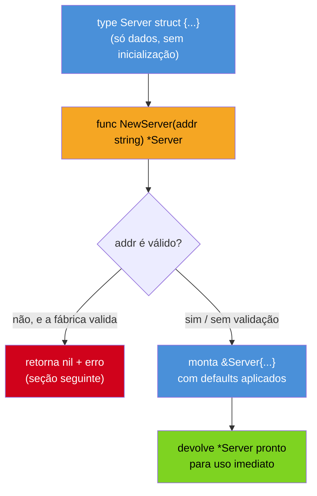
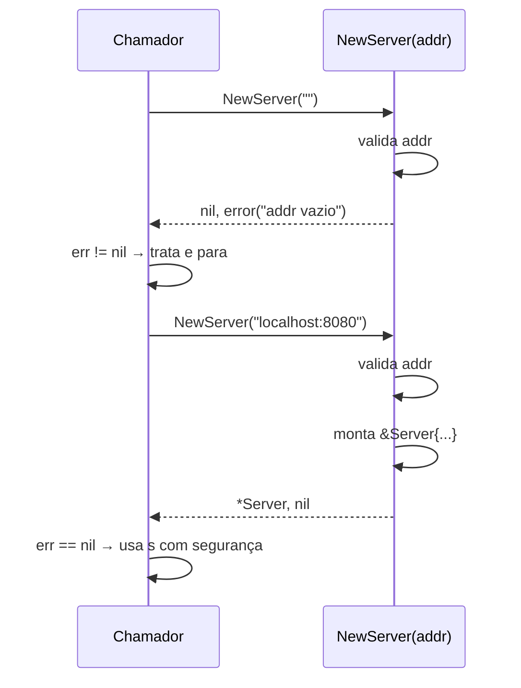

# O idioma do construtor

> [!abstract] TL;DR
> Go **não tem construtores** — nenhum `new` que executa código de inicialização, nenhum `__init__`. O idioma da comunidade é a **função-fábrica** `func NewServer(addr string) *Server { ... }`: uma função comum, com nome convencionado (`New` quando o pacote expõe um tipo principal, `NewT` quando expõe vários), que monta o valor e devolve — quase sempre — um **ponteiro**. Quando a construção pode falhar, a fábrica devolve `(*T, error)` em vez de entrar em pânico. O contraponto idiomático a "todo tipo precisa de construtor" é o **zero value útil**: desenhar o tipo para que `var t T` já nasça pronto para uso, dispensando fábrica — o padrão por trás de `sync.Mutex` e `bytes.Buffer`. Quando um tipo aceita configuração opcional, o padrão idiomático é **functional options** — fábricas variádicas que recebem funções configuradoras, como `NewServer(addr, WithTimeout(5*time.Second))`.

## Procurando o construtor que não existe

Você acabou de escrever `type Server struct { addr string; timeout time.Duration; conexoesAtivas int }` — um tipo com estado que precisa nascer configurado: o endereço vem de fora, o timeout tem um valor padrão sensato se ninguém especificar, e `conexoesAtivas` começa em zero e é incrementado depois. Em Java, o próximo passo seria óbvio:

```java
// Java
public class Server {
    private final String addr;
    private final Duration timeout;

    public Server(String addr, Duration timeout) {
        this.addr = addr;
        this.timeout = timeout != null ? timeout : Duration.ofSeconds(5);
    }
}
```

Um construtor: nome igual ao da classe, roda automaticamente quando `new Server(...)` é chamado, garante que nenhum `Server` existe fora desse caminho. Python resolve o mesmo problema com `__init__`, chamado automaticamente por `Server(...)`. As duas linguagens têm, gravado na sintaxe da própria declaração de classe, um lugar reservado para "código que roda toda vez que uma instância nasce".

Você procura o equivalente em Go — e não encontra. Não há `func (s Server) Server(...)`, não há palavra-chave `constructor`, não há hook de inicialização amarrado à declaração do `type`. `struct` declara só os campos, como a [[03-Dominios/Tecnologia/Go/02 - Tipos, structs e métodos/01 - Structs — definição e inicialização|nota 01]] já mostrou — e um `struct` literal, por si só, não executa nenhum código: `Server{addr: "localhost:8080"}` apenas copia valores para os campos nomeados, sem passar por lugar nenhum que você controle.

```go
type Server struct {
    addr    string
    timeout time.Duration
}

s := Server{addr: "localhost:8080"} // timeout fica no zero value: time.Duration(0)
```

Nada valida `addr`, nada aplica o timeout padrão de 5 segundos, e nada impede que alguém, em outro arquivo do mesmo pacote, crie um `Server{}` totalmente vazio. Se `addr` vazio for um estado inválido para o resto do programa, esse `Server{}` é uma bomba-relógio: compila, existe, e só explode quando algum método tentar usar `addr` e encontrar uma string vazia.

Então como um tipo em Go garante que só nascem instâncias válidas, sem uma palavra-chave de construtor para amarrar essa garantia? A resposta não está na sintaxe da linguagem — está numa **convenção** que todo o ecossistema Go segue com uma consistência quase de regra de compilador, embora nenhuma ferramenta a imponha.

## A função-fábrica: uma função comum, um nome convencionado

O idioma é simples de descrever e reconhecer: uma **função comum**, exportada, cujo único trabalho é montar um valor do tipo, aplicar defaults e validações, e devolvê-lo pronto para uso.

```go
func NewServer(addr string) *Server {
    return &Server{
        addr:    addr,
        timeout: 5 * time.Second,
    }
}

s := NewServer("localhost:8080")
```

`NewServer` não é mágico — é uma função como qualquer outra, definida no mesmo pacote de `Server` (normalmente logo acima ou abaixo da declaração do `type`, no mesmo arquivo `.go`). O compilador não sabe que ela é "o construtor de `Server`"; quem sabe disso é a comunidade Go inteira, porque `NewXxx` é a convenção documentada no [Effective Go](https://go.dev/doc/effective_go#allocation_new) e seguida sem exceção relevante em toda a biblioteca padrão — `bufio.NewReader`, `http.NewRequest`, `context.WithTimeout` (variante do mesmo espírito, sem o prefixo `New` porque devolve algo derivado de um valor existente, não um valor novo do zero).



O que essa função ganha, que o `struct` literal cru não tinha: um **lugar único** para aplicar defaults (`timeout: 5 * time.Second` sempre que o chamador não decidir diferente — a próxima nota mostra como tornar isso configurável), validar entradas antes de devolver um valor, e mudar a implementação interna de `Server` no futuro sem quebrar quem já chama `NewServer`. Nada disso é imposto pelo compilador — é imposto pela convenção de que ninguém, dentro do pacote que expõe `Server`, deveria montar um `Server{}` literal fora de `NewServer` quando essa função existe. Campos não exportados (minúsculos, como `addr` e `timeout` aqui) já ajudam a reforçar isso: código de **fora** do pacote não consegue nem escrever um struct literal com esses campos — só `NewServer` tem acesso a eles, porque mora no mesmo pacote.

> [!question]- Se é só uma função comum, o que impede alguém de ignorá-la e escrever `Server{}` direto?
> Nada, tecnicamente — nem existe uma palavra-chave para bloquear isso, ao contrário de `private constructor` em Java. A defesa de Go é estrutural, não sintática: se todos os campos relevantes de `Server` forem não exportados (letra minúscula), código de **outro pacote** simplesmente não consegue escrever `pacote.Server{addr: "..."}` — só o próprio pacote tem acesso aos nomes dos campos para preencher um struct literal. Dentro do mesmo pacote, a barreira vira convenção de equipe e code review; é comum times reforçarem isso com um linter (`revive`/`golangci-lint`, com uma regra customizada) recusando struct literals fora do arquivo do construtor. Não é hermético como um construtor privado, mas cobre o caso que mais importa: consumidores externos do pacote.

## Convenção de nomes: `New` vs `NewT`

A convenção documentada pelo [Go wiki (CodeReviewComments)](https://go.dev/wiki/CodeReviewComments#initialisms) e reforçada pelo próprio [Effective Go](https://go.dev/doc/effective_go#allocation_new) segue uma regra simples: o nome carrega a informação que, em Java, viria de graça do nome da classe — mas aqui precisa ser escrito, porque `New` sozinho não diz para qual tipo.

| Situação do pacote | Nome da fábrica | Exemplo real |
|---|---|---|
| Pacote expõe **um** tipo principal, óbvio pelo nome do pacote | `New` (sem sufixo) | `bufio.NewReader` — errado; correto seria `list.New()` do pacote `container/list`, que expõe só `List` |
| Pacote expõe **vários** tipos igualmente relevantes | `NewT`, um por tipo | `bufio.NewReader(r)`, `bufio.NewWriter(w)`, `bufio.NewScanner(r)` — todos no mesmo pacote `bufio` |
| Tipo interno ao próprio pacote que também o consome | `newT` (minúsculo, não exportado) | fábrica auxiliar usada só dentro do pacote, nunca por quem importa |

`container/list` ilustra o primeiro caso: o pacote existe só para expor `List`, então a fábrica é `list.New()` — sem repetir o nome do tipo, porque já está implícito no nome do pacote (`list.New()` lido em voz alta já diz "novo `list.List`"). `bufio` ilustra o segundo caso: o pacote expõe `Reader`, `Writer` e `Scanner` como cidadãos de primeira classe, então cada um ganha sua fábrica com o tipo no nome — `NewReader`, `NewWriter`, `NewScanner` — porque `bufio.New()` sozinho seria ambíguo.

```go
// Pacote com um tipo principal — fábrica é só New
package cache

type Cache struct{ /* ... */ }

func New(capacidade int) *Cache { /* ... */ }

// uso: cache.New(100)
```

```go
// Pacote com múltiplos tipos — fábrica leva o nome do tipo
package parser

type Lexer struct{ /* ... */ }
type Parser struct{ /* ... */ }

func NewLexer(fonte string) *Lexer { /* ... */ }
func NewParser(l *Lexer) *Parser   { /* ... */ }
```

A regra não é imposta por ferramenta nenhuma — é convenção pura, mas violada raramente o suficiente para funcionar como um contrato tácito: qualquer dev Go, ao ver `NewFoo`, já sabe, sem ler documentação, que essa função devolve um `*Foo` (ou `Foo`) pronto para uso.

## Valor ou ponteiro: o que a fábrica devolve

A [[03-Dominios/Tecnologia/Go/02 - Tipos, structs e métodos/04 - Value vs pointer receiver|nota 04, Value vs pointer receiver]] já cobriu a escolha entre `func (s Server) M()` e `func (s *Server) M()` para métodos — a mesma decisão de fundo se aplica à fábrica: `NewServer` devolve `*Server` ou `Server`?

A convenção segue diretamente da decisão de receiver que o tipo já adotou: se `Server` tem métodos com pointer receiver (o caso comum para tipos com estado mutável, como um servidor com conexões ativas), a fábrica **precisa** devolver `*Server` — devolver `Server` por valor forçaria o chamador a tirar o endereço manualmente (`s := Server{...}; svr := &s`) antes de poder chamar qualquer método com pointer receiver de forma útil, e ainda arriscaria cópias acidentais do struct em algum ponto do caminho.

```go
func NewServer(addr string) *Server { // ponteiro: Server tem métodos com pointer receiver
    return &Server{addr: addr, timeout: 5 * time.Second}
}
```

Tipos pequenos, imutáveis, "tipo valor" por natureza — um `Point{X, Y float64}`, uma `Money{Centavos int64}` — costumam preferir devolver por **valor**, seguindo o mesmo raciocínio de custo/semântica da nota 04: copiar dois `float64` é mais barato que uma indireção de ponteiro, e não há estado mutável para proteger de cópia acidental.

```go
func NewPoint(x, y float64) Point { // valor: Point é pequeno e imutável por convenção
    return Point{X: x, Y: y}
}
```

| | Fábrica devolve valor | Fábrica devolve ponteiro |
|---|---|---|
| Quando | Tipo pequeno, imutável, sem métodos com pointer receiver | Tipo com estado mutável, métodos com pointer receiver, ou struct grande |
| Exemplo real | `time.Duration` (tipo simples, não struct) | `bufio.NewReader` → `*bufio.Reader` |
| Custo por chamada | Cópia do struct (barata se pequeno) | Uma alocação (pode ir para a heap — [[03-Dominios/Tecnologia/Go/01 - Fundamentos e sintaxe/07 - Ponteiros e o modelo de memória\|nota 07 do galho 1]] cobre escape analysis) |
| Identidade compartilhada entre cópias | Não — cada valor é independente | Sim — todo mundo que recebe o ponteiro vê o mesmo `Server` |

## Validação na construção: `(*T, error)`

Nem toda construção pode dar certo sempre. `NewServer("")` — endereço vazio — é um estado que talvez devesse ser recusado na fábrica, em vez de propagado para todo o resto do programa como um `*Server` inválido esperando para quebrar algo mais adiante. Go não tem exceções para sinalizar isso (assunto pleno do Galho 4, Erros como valor) — a fábrica sinaliza falha devolvendo um segundo valor: `error`.

```go
func NewServer(addr string) (*Server, error) {
    if addr == "" {
        return nil, errors.New("addr não pode ser vazio")
    }
    return &Server{addr: addr, timeout: 5 * time.Second}, nil
}

s, err := NewServer("localhost:8080")
if err != nil {
    log.Fatal(err)
}
```

Repare no padrão de retorno em caso de erro: `return nil, errors.New(...)` — o primeiro valor é o **zero value do ponteiro** (`nil`), nunca um `*Server` parcialmente construído. É a mesma disciplina que qualquer função Go que devolve `(T, error)` segue: quando `error != nil`, o valor de retorno principal não deveria ser confiável nem usado — o chamador checa `err` primeiro, sempre, antes de tocar em `s`.



A escolha entre uma fábrica que sempre funciona (`func NewServer(addr string) *Server`) e uma que pode falhar (`func NewServer(addr string) (*Server, error)`) depende exclusivamente de existir ou não uma condição real de invalidade a checar. Quando não há nada para validar — todo `addr string` é aceitável, mesmo vazio, e o comportamento errado só aparecerá mais tarde, ao tentar conectar — a versão sem `error` é preferível: assinaturas mais simples, sem forçar todo chamador a lidar com um `if err != nil` que nunca dispara de verdade.

> [!question]- Por que não usar `panic` para "erro de construção", como uma exceção faria em Java?
> Porque `panic` em Go é reservado para erros de **programação** — invariantes que nunca deveriam ser violadas se o código estiver correto (índice fora dos limites, `nil` desreferenciado por engano) — não para condições esperadas do mundo real, como "o usuário passou um endereço vazio". Endereço vazio é um input previsível, tratável, que o chamador pode querer recuperar (pedir de novo, usar um default, logar e seguir) — exatamente o tipo de situação que `error` como valor de retorno foi desenhado para representar, ao contrário de uma exceção que interrompe o fluxo normal. O Galho 4 (Erros como valor) formaliza essa distinção inteira; aqui vale reter só a regra prática: fábrica que pode receber input inválido do mundo real devolve `error` — não entra em pânico.

## O princípio do zero value útil

A pergunta de abertura desta nota — "como garantir que um objeto nasce válido sem construtor?" — tem uma segunda resposta, ortogonal à fábrica: **desenhar o tipo para que ele não precise de fábrica nenhuma**. Se o zero value de um struct — todos os campos no próprio zero value, como a nota 01 já cobriu — já é um estado válido e funcional, não existe "problema de construção" para resolver: `var t T` (ou simplesmente declarar um campo `T` dentro de outro struct, sem inicializá-lo) já entrega um valor pronto para uso.

O exemplo canônico da própria biblioteca padrão é `sync.Mutex`:

```go
type Contador struct {
    mu    sync.Mutex // zero value já é um mutex destravado, pronto para Lock()
    valor int
}

var c Contador // nenhum construtor chamado — e já funciona
c.mu.Lock()
c.valor++
c.mu.Unlock()
```

Não existe `sync.NewMutex()` na biblioteca padrão — e a ausência é deliberada. Um `sync.Mutex{}` no zero value já está destravado e pronto para `Lock()`; não há nenhum estado interno que precise de inicialização externa. O mesmo vale para `bytes.Buffer`: `var b bytes.Buffer; b.WriteString("olá")` funciona sem `bytes.NewBuffer(...)`, porque o zero value de `Buffer` já é um buffer vazio, perfeitamente utilizável — `bytes.NewBuffer` existe só para o caso específico de já ter um `[]byte` pronto para envolver, não porque o zero value seja inválido.

```mermaid
flowchart LR
    subgraph Util["Zero value útil"]
        direction TB
        A1["var mu sync.Mutex"] --> A2["mu já destravado\npronto para Lock()"]
    end
    subgraph Obrigatorio["Construtor obrigatório"]
        direction TB
        B1["var s Server"] --> B2["addr = \"\", timeout = 0\nestado inválido"]
        B3["s := NewServer(addr)"] --> B4["addr preenchido, timeout = 5s\nestado válido"]
    end

    style A1 fill:#4A90D9,color:#fff
    style A2 fill:#7ED321,color:#000
    style B1 fill:#4A90D9,color:#fff
    style B2 fill:#D0021B,color:#fff
    style B3 fill:#F5A623,color:#000
    style B4 fill:#7ED321,color:#000
```

O contraste vale nomear com precisão: `Server`, como desenhado nesta nota, **não** tem zero value útil — `var s Server` deixa `addr == ""` e `timeout == 0`, ambos estados que o resto do programa provavelmente trata como inválidos. Isso não é um erro de design automaticamente — alguns tipos genuinamente precisam de input externo (um endereço não pode ter um default sensato) — mas é uma decisão consciente que vale revisitar: sempre que um campo puder ficar bem no zero value (um contador que começa em `0`, uma lista que começa `nil` e funciona com `append` mesmo assim — Go permite `append(nil, x)`), prefira deixá-lo lá em vez de forçar todo chamador a passar pela fábrica só para um campo que já nasceria certo sozinho.

A [documentação oficial do pacote `sync`](https://pkg.go.dev/sync#Mutex) formaliza essa ideia com uma frase que vale memorizar: "the zero value for a Mutex is an unlocked mutex" — o design do tipo é feito **de propósito** para que o zero value seja o estado inicial correto, e não um acidente de que "aconteceu de funcionar".

> [!question]- Como desenhar um tipo para que o zero value seja útil?
> A receita não tem mágica: evite campos que precisem de um valor diferente de `0`/`""`/`nil`/`false` para funcionar. Um slice/map/ponteiro no zero value é `nil`, e Go permite operações seguras sobre `nil` em vários casos — `len(nil slice)` é `0`, `append(nil, x)` aloca sozinho, iterar um `map` `nil` com `range` não quebra (só escrever nele quebra, com `panic: assignment to entry in nil map`). Se o tipo só usa esses padrões "seguros no nil", o zero value já funciona. Quando um campo genuinamente precisa de um valor não-zero para o tipo fazer sentido (como `addr` em `Server`), o zero value útil não é viável — e a fábrica com validação, vista acima, é a ferramenta certa.

## Múltiplos construtores: `NewFromX`, `NewWithY`

Go não tem sobrecarga de função — duas funções não podem ter o mesmo nome com assinaturas diferentes, ao contrário de Java, onde `Server(String addr)` e `Server(String addr, Duration timeout)` coexistem como *overloads* do mesmo construtor. Quando um tipo precisa nascer de fontes ou formas diferentes, o idioma Go é simplesmente **nomear cada fábrica de um jeito distinto**, descrevendo a origem ou variação no próprio nome:

```go
func NewServer(addr string) (*Server, error) {
    return newServerComTimeout(addr, 5*time.Second)
}

func NewServerFromEnv() (*Server, error) {
    addr := os.Getenv("SERVER_ADDR")
    return NewServer(addr)
}

func NewServerWithTimeout(addr string, timeout time.Duration) (*Server, error) {
    return newServerComTimeout(addr, timeout)
}

func newServerComTimeout(addr string, timeout time.Duration) (*Server, error) {
    if addr == "" {
        return nil, errors.New("addr não pode ser vazio")
    }
    return &Server{addr: addr, timeout: timeout}, nil
}
```

O padrão que aparece aqui — várias fábricas exportadas convergindo para uma fábrica interna não exportada (`newServerComTimeout`, minúscula) que faz o trabalho real — é comum o bastante para valer nomear: evita duplicar a lógica de validação em cada variante, mantendo um único lugar de verdade. `NewServerFromEnv` é o exemplo mais comum na prática: ler configuração de variável de ambiente, arquivo, ou flag de linha de comando, e delegar para a fábrica principal depois de resolver a origem do dado.

## Uma introdução a functional options

Quando o número de parâmetros **opcionais** cresce — timeout, TLS, tamanho de buffer, número máximo de conexões — nem `NewServerWithTimeout` nem uma explosão de `NewServerWithTimeoutAndTLS`/`NewServerWithTLSAndBuffer` escalam bem: o número de combinações cresce rápido, e a maioria dos chamadores só quer mudar **um** parâmetro, mantendo os outros no default.

O padrão idiomático que a comunidade Go convergiu para esse problema — descrito e popularizado por [Rob Pike em "Self-referential functions and the design of options"](https://commandcenter.blogspot.com/2014/01/self-referential-functions-and-design.html) e detalhado por [Dave Cheney em "Functional options for friendly APIs"](https://dave.cheney.net/2014/10/17/functional-options-for-friendly-apis) — é **functional options**: a fábrica aceita um número variável de funções configuradoras, cada uma mutando o `Server` sendo construído.

```go
type Server struct {
    addr    string
    timeout time.Duration
    tls     bool
}

type Option func(*Server)

func WithTimeout(d time.Duration) Option {
    return func(s *Server) { s.timeout = d }
}

func WithTLS() Option {
    return func(s *Server) { s.tls = true }
}

func NewServer(addr string, opts ...Option) *Server {
    s := &Server{
        addr:    addr,
        timeout: 5 * time.Second, // default, sobrescrito se WithTimeout vier em opts
    }
    for _, opt := range opts {
        opt(s)
    }
    return s
}
```

```go
s1 := NewServer("localhost:8080")                                    // defaults puros
s2 := NewServer("localhost:8080", WithTimeout(30*time.Second))        // só timeout mudou
s3 := NewServer("localhost:8080", WithTimeout(10*time.Second), WithTLS()) // dois opcionais
```

Cada `WithX` é uma função que **devolve** uma função — `Option` é `func(*Server)`, e `WithTimeout(30*time.Second)` devolve exatamente isso: uma closure que, quando aplicada a um `*Server`, seta `s.timeout`. `NewServer` aplica cada `Option` recebida, em ordem, sobre o `Server` já montado com os defaults. O resultado prático: qualquer combinação de opcionais funciona com uma única assinatura de fábrica, sem explosão combinatória de nomes, e novas opções podem ser adicionadas depois sem quebrar chamadas existentes — a maior vantagem sobre uma struct de configuração posicional.

Esta nota mostra só o mecanismo central — o padrão completo (opções com validação própria, opções que retornam `error`, composição de opções, e quando **não** vale a pena usar functional options em vez de uma struct de config simples) é o assunto de galhos futuros: o Galho 14 (Microservices e arquitetura) e o Galho 20 (Go idiomático) aprofundam esse padrão no contexto de APIs de biblioteca e injeção de dependência.

## Casos práticos

**1. Fábrica simples, sem validação — quando não há estado inválido possível:**

```go
type Logger struct {
    prefixo string
}

func NewLogger(prefixo string) *Logger {
    return &Logger{prefixo: prefixo}
}

func (l *Logger) Info(msg string) {
    fmt.Printf("[%s] %s\n", l.prefixo, msg)
}

log := NewLogger("api")
log.Info("servidor iniciado") // [api] servidor iniciado
```

**2. Fábrica com validação, devolvendo `(*T, error)`:**

```go
type ContaBancaria struct {
    titular string
    saldo   float64
}

func NewContaBancaria(titular string, saldoInicial float64) (*ContaBancaria, error) {
    if titular == "" {
        return nil, errors.New("titular não pode ser vazio")
    }
    if saldoInicial < 0 {
        return nil, fmt.Errorf("saldo inicial inválido: %.2f", saldoInicial)
    }
    return &ContaBancaria{titular: titular, saldo: saldoInicial}, nil
}

conta, err := NewContaBancaria("Ana", 100.0)
if err != nil {
    log.Fatal(err)
}
```

**3. Tipo com zero value útil — sem fábrica nenhuma:**

```go
type Fila struct {
    itens []int // zero value: nil — mas append(nil, x) funciona
}

func (f *Fila) Enfileirar(x int) {
    f.itens = append(f.itens, x)
}

func (f *Fila) Desenfileirar() (int, bool) {
    if len(f.itens) == 0 {
        return 0, false
    }
    x := f.itens[0]
    f.itens = f.itens[1:]
    return x, true
}

var f Fila // nenhuma fábrica — zero value já funciona
f.Enfileirar(1)
f.Enfileirar(2)
x, ok := f.Desenfileirar() // 1, true
```

**4. Mini functional options, combinando fábrica + defaults + opcionais:**

```go
type ClienteHTTP struct {
    timeout    time.Duration
    tentativas int
}

type ClienteOption func(*ClienteHTTP)

func ComTimeout(d time.Duration) ClienteOption {
    return func(c *ClienteHTTP) { c.timeout = d }
}

func ComTentativas(n int) ClienteOption {
    return func(c *ClienteHTTP) { c.tentativas = n }
}

func NewClienteHTTP(opts ...ClienteOption) *ClienteHTTP {
    c := &ClienteHTTP{timeout: 3 * time.Second, tentativas: 1}
    for _, opt := range opts {
        opt(c)
    }
    return c
}

cliente := NewClienteHTTP(ComTimeout(10*time.Second), ComTentativas(3))
```

## Armadilhas comuns

> [!warning] Tipo sem zero value útil, mas sem fábrica que force o uso correto
> Se `Server` exige `addr` não vazio para funcionar, mas nada impede `var s Server` (ou `Server{}`) de compilar e ser usado normalmente, o compilador nunca vai pegar esse bug — só vai aparecer em runtime, possivelmente longe do ponto onde o `Server` foi criado errado. A defesa não é sintática (Go não tem "campo obrigatório"); é de design: mantenha os campos críticos não exportados, documente que `NewServer` é o único caminho suportado, e — se o time quiser reforço automático — considere um linter customizado que recusa struct literals do tipo fora do arquivo da fábrica.

> [!warning] Fábrica devolvendo valor quando o tipo pede ponteiro
> Se `Server` tem (ou vai ganhar) métodos com pointer receiver, uma fábrica `func NewServer(addr string) Server` (valor, sem `*`) obriga todo chamador a tirar o próprio endereço (`s := NewServer(addr); svr := &s`) antes de poder usar esses métodos de forma útil — e abre espaço para cópias acidentais do struct se alguém passar `s` (não `&s`) para uma função em algum ponto do caminho, silenciosamente perdendo mutações. A regra prática: decida a semântica de ponteiro-vs-valor do tipo **primeiro** (nota 04), e faça a fábrica devolver exatamente o que os métodos esperam como receiver.

> [!warning] Over-engineering com functional options onde uma struct de config bastava
> Functional options resolvem um problema específico — muitos parâmetros **opcionais**, adicionados ao longo do tempo, numa API **pública** consumida por código que você não controla. Se o tipo é interno ao seu próprio módulo, com dois ou três campos de configuração que raramente mudam, uma struct de config simples é mais legível e mais fácil de testar:
>
> ```go
> type ServerConfig struct {
>     Addr    string
>     Timeout time.Duration
>     TLS     bool
> }
>
> func NewServer(cfg ServerConfig) *Server { /* ... */ }
> ```
>
> `NewServer(ServerConfig{Addr: addr, Timeout: 10 * time.Second})` é tão legível quanto a versão com options, sem a indireção de closures e sem o custo de aprendizado de `type Option func(*Server)` para quem só quer ler o código uma vez. Reserve functional options para quando a lista de opções realmente crescer com o tempo e for consumida por terceiros — não como reflexo automático de "isso parece Go idiomático".

## Como explicar em inglês

> Go has no constructors — no `new` keyword that runs initialization code, and nothing like Java's constructor-named-after-the-class or Python's `__init__`. The idiom the community converged on is the **factory function**, conventionally named `New` (when the package exposes one main type) or `NewT` (when it exposes several) — `func NewServer(addr string) *Server`. The factory returns a pointer when the type has pointer-receiver methods or carries mutable state, and a value when the type is small and naturally value-like. When construction can fail on real-world input, the factory returns `(*T, error)` instead of panicking — panic is reserved for programmer errors, not expected failure conditions like an empty address. The idiomatic counterpoint to "every type needs a constructor" is the **usable zero value**: designing a type so its zero value — `var t T`, no factory called — is already a valid, ready-to-use state, the pattern behind `sync.Mutex` and `bytes.Buffer`. When a type accepts many optional settings, the idiomatic constructor is the **functional options** pattern: a variadic factory that takes configuring functions, like `NewServer(addr, WithTimeout(5*time.Second))` — each option a closure that mutates the value being built. None of this is enforced by the compiler; it's convention, reinforced by unexported fields and by the consistency of the standard library itself.

| Termo PT | Termo EN |
|---|---|
| função-fábrica | factory function |
| construtor | constructor |
| valor zero / zero value útil | usable zero value |
| inicialização | initialization |
| opções funcionais | functional options |
| campo não exportado | unexported field |
| fábrica com validação | validating constructor |
| defaults sensatos | sensible defaults |

## O que vem a seguir

Esta nota fechou o ciclo de "como um valor nasce" em Go: struct literal cru, fábrica `NewXxx`, zero value útil, e a introdução a functional options. Falta uma peça que aparece o tempo todo em bibliotecas Go de produção, especialmente as que fazem (de)serialização — JSON, YAML, bancos de dados: como um campo de struct carrega **metadados extras**, lidos em runtime por outra parte do programa, sem tocar no comportamento do tipo em si. A [[07 - Struct tags e reflection básica|nota 07]] entra nesse mecanismo: a sintaxe de struct tags (`` `json:"nome"` ``), como bibliotecas as leem via `reflect`, e por que esse é o único lugar em Go onde metadados de campo viram comportamento em runtime.

## Veja também

- [[03-Dominios/Tecnologia/Go/02 - Tipos, structs e métodos/01 - Structs — definição e inicialização|01 — Structs: definição e inicialização]] — struct literal e zero value de struct, retomados aqui
- [[03-Dominios/Tecnologia/Go/02 - Tipos, structs e métodos/04 - Value vs pointer receiver|04 — Value vs pointer receiver]] — a decisão que determina se a fábrica devolve valor ou ponteiro
- [[03-Dominios/Tecnologia/Go/02 - Tipos, structs e métodos/07 - Struct tags e reflection básica|07 — Struct tags e reflection básica]] — próxima nota do galho
- [[03-Dominios/Tecnologia/Python/OO e Data Model/01 - Classes — definição, atributos e métodos|Python, OO e Data Model, nota 01]] — `__init__` e o contraste direto com a ausência de construtor em Go
- [[03-Dominios/Tecnologia/Go/index|Trilha Go]]

## Fontes

- The Go Authors. *Effective Go — Allocation with new, Composite literals*. go.dev. https://go.dev/doc/effective_go#allocation_new (acessado em 2026-07-16)
- The Go Authors. *Go Wiki — Code Review Comments: initialisms and naming*. go.dev. https://go.dev/wiki/CodeReviewComments (acessado em 2026-07-16)
- The Go Authors. *sync package — Mutex*. pkg.go.dev. https://pkg.go.dev/sync#Mutex (acessado em 2026-07-16)
- Pike, R. *Self-referential functions and the design of options*. commandcenter.blogspot.com, 2014. https://commandcenter.blogspot.com/2014/01/self-referential-functions-and-design.html (acessado em 2026-07-16)
- Cheney, D. *Functional options for friendly APIs*. dave.cheney.net, 2014. https://dave.cheney.net/2014/10/17/functional-options-for-friendly-apis (acessado em 2026-07-16)
- The Go Authors. *bytes package — Buffer*. pkg.go.dev. https://pkg.go.dev/bytes#Buffer (acessado em 2026-07-16)
