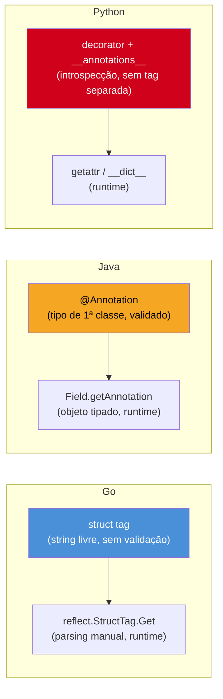

# Struct tags e reflection básica

> [!abstract] TL;DR
> Uma **struct tag** é uma string literal, entre crases, colada depois do tipo de um campo — `Nome string \`json:"name,omitempty"\`` — que o compilador Go trata como puro metadado: não valida a sintaxe, não checa se alguém vai lê-la, não faz nada com ela em tempo de compilação. Quem dá sentido à tag é **código de biblioteca rodando em tempo de execução**, usando o pacote `reflect` para inspecionar o tipo do struct, campo por campo, e ler a tag com `field.Tag.Get("json")`. `encoding/json` é o consumidor canônico: `Marshal`/`Unmarshal` leem a tag `json` de cada campo para decidir o nome da chave, se o campo deve ser omitido quando vazio (`omitempty`), ou se deve ser ignorado (`-`). `reflect` é a porta de entrada de Go para **reflection** — inspecionar tipos e valores que só se sabe em runtime — mas é uma ferramenta de último recurso: lenta, sem checagem de tipo em tempo de compilação, e regida pelo provérbio de Rob Pike "clear is better than clever... reflection is never clear."

## De onde vem a mágica do `encoding/json`

Um struct comum, exportado, com um método `String()` — nada que a [[03-Dominios/Tecnologia/Go/02 - Tipos, structs e métodos/03 - Métodos|nota 03]] não tenha coberto:

```go
type Usuario struct {
    Nome     string
    Email    string
    Idade    int
    senha    string // não exportado
}
```

Alguém serializa esse struct para JSON:

```go
u := Usuario{Nome: "Ana", Email: "ana@example.com", Idade: 30, senha: "segredo"}
b, _ := json.Marshal(u)
fmt.Println(string(b))
// {"Nome":"Ana","Email":"ana@example.com","Idade":30}
```

Repare em dois comportamentos que já pedem explicação: o campo `senha` — minúsculo, não exportado — simplesmente **não aparece** no JSON. E as chaves saem com a mesma capitalização dos campos Go (`"Nome"`, não `"nome"`), o que não é o que a maioria das APIs JSON espera. Agora alguém ajusta o struct assim:

```go
type Usuario struct {
    Nome  string `json:"name"`
    Email string `json:"email,omitempty"`
    Idade int    `json:"age"`
    senha string
}
```

```go
b, _ := json.Marshal(u)
// {"name":"Ana","email":"ana@example.com","age":30}
```

As chaves mudaram para `name`, `email`, `age` — exatamente as strings dentro das crases depois de `json:`. Se `Email` estivesse vazio, a chave `"email"` sumiria do JSON inteiro, por causa de `omitempty`. Nada nisso é sintaxe especial do Go: o compilador vê `json:"name"` como uma **string comum**, do mesmo jeito que veria `"qualquer coisa"` — não sabe o que `json:` significa, não valida se existe um campo chamado assim em algum lugar, não faz absolutamente nada com ela por conta própria.

Então de onde vem o comportamento? A resposta tem duas partes que esta nota separa com cuidado: **(1)** o que é, mecanicamente, uma struct tag — só sintaxe e convenção, sem mágica nenhuma; e **(2)** como `encoding/json` — e qualquer outra biblioteca — consegue *ler* essa string em tempo de execução, usando `reflect`, o pacote que dá a Go a capacidade de **reflection**: inspecionar a forma de um valor (seus campos, seus tipos, suas tags) sem saber de antemão, em tempo de compilação, qual é esse valor.

## O que é uma struct tag

### Sintaxe: uma string, um formato convencionado

Uma struct tag é literalmente o campo `Tag` de `reflect.StructField` — uma string associada a um campo do struct, delimitada por crases (`` ` ``), posicionada imediatamente depois do tipo do campo:

```go
type Produto struct {
    ID    int     `json:"id" db:"product_id"`
    Nome  string  `json:"name,omitempty" db:"product_name"`
    Preco float64 `json:"price" validate:"gt=0"`
}
```

O conteúdo entre as crases segue uma convenção — não uma regra imposta pelo compilador — descrita na documentação do pacote `reflect`: uma sequência de pares `chave:"valor"`, separados por espaço. Cada `chave` é um identificador (`json`, `db`, `validate`, ou qualquer nome que uma biblioteca escolha), e `"valor"` é uma string entre aspas duplas, opcionalmente com sub-partes separadas por vírgula (`"name,omitempty"` — o nome do campo e uma opção). Múltiplas tags no mesmo campo, como `ID` acima, coexistem na mesma string, cada biblioteca lendo só a chave que lhe interessa.

```mermaid
flowchart LR
    A["campo do struct\nNome string"] --> B["tag literal\n`json:\"name,omitempty\" db:\"product_name\"`"]
    B --> C["reflect.TypeOf(x)\n.Field(i).Tag"]
    C --> D["Tag.Get(\"json\")\n→ \"name,omitempty\""]
    C --> E["Tag.Get(\"db\")\n→ \"product_name\""]
    D --> F["encoding/json decide:\nchave = \"name\", omite se vazio"]
    E --> G["biblioteca de ORM decide:\ncoluna = \"product_name\""]

    style A fill:#4A90D9,color:#fff
    style B fill:#F5A623,color:#000
    style C fill:#4A90D9,color:#fff
    style D fill:#4A90D9,color:#fff
    style E fill:#4A90D9,color:#fff
    style F fill:#D0021B,color:#fff
    style G fill:#D0021B,color:#fff
```

O ponto central deste diagrama, e desta nota inteira: **a tag por si só não faz nada.** É uma string parada no metadado do tipo. O comportamento observável — chave JSON diferente, coluna de banco diferente — só existe porque *alguma biblioteca, em algum lugar, escreveu código que lê essa string e reage a ela.* Sem essa leitura, `json:"name,omitempty"` é indistinguível, para o Go runtime, de qualquer outro comentário-string sem sentido.

> [!question]- O compilador valida o formato da tag de algum jeito?
> Muito pouco. O `go vet` (rodado automaticamente por `go build` desde o Go 1.10 para um subconjunto de checagens) sabe reconhecer o formato de tags conhecidas como `json` e sinaliza alguns erros óbvios — por exemplo, uma tag que não seria reconhecida como `chave:"valor"` bem formado. Mas isso é uma checagem de *estilo*, não de compilação: `vet` não impede o build de terminar, só avisa. Tags com chave desconhecida (`minhaTagInventada:"x"`), erro de digitação (`jsno:"name"`), ou valor sem sentido para a biblioteca que a lê passam batido — o assunto da primeira armadilha, adiante.

### `Field(i).Tag` é `reflect.StructTag`, não `map[string]string`

Um detalhe de implementação que vale registrar antes de ir para reflection: o tipo de `Tag` não é um mapa pronto — é `reflect.StructTag`, definido como `type StructTag string`, com um método `Get(key string) string` que faz o **parsing da string na hora**, toda vez que é chamado. Não existe um dicionário pré-computado guardado em algum lugar; cada chamada a `.Get("json")` percorre a string da tag procurando a chave pedida.

```go
tag := reflect.StructTag(`json:"name,omitempty" db:"product_name"`)
fmt.Println(tag.Get("json")) // name,omitempty
fmt.Println(tag.Get("db"))   // product_name
fmt.Println(tag.Get("xml"))  // "" — chave ausente, string vazia, sem erro
```

Chave ausente devolve string vazia, silenciosamente — não há `ok bool` de retorno em `Get`. Quem precisa distinguir "chave ausente" de "chave presente com valor vazio" usa `Lookup`, que devolve exatamente esse segundo valor:

```go
valor, ok := tag.Lookup("xml")
fmt.Println(valor, ok) // "" false
```

## O que é reflection, na medida que esta nota cobre

### A pergunta que reflection responde

Em código Go comum — o que as seis notas anteriores deste galho cobriram — os tipos são conhecidos **em tempo de compilação**: quando você escreve `p.Nome`, o compilador já sabe, olhando a declaração de `Produto`, que `Nome` existe e é `string`. **Reflection** é o mecanismo que permite ao próprio programa, **em tempo de execução**, fazer perguntas sobre um valor cujo tipo concreto ele não conhecia ao ser compilado — tipicamente porque esse valor chegou como `interface{}` (ou `any`, seu apelido desde o Go 1.18) vindo de fora: um parâmetro genérico de uma função de biblioteca, um valor decodificado de JSON, um argumento passado para uma função de serialização qualquer.

O artigo canônico do Go blog, ["The Laws of Reflection"](https://go.dev/blog/laws-of-reflection) de Rob Pike, resume o pacote `reflect` em duas funções de entrada e três leis. As duas funções:

```go
p := Produto{ID: 1, Nome: "Caneta", Preco: 2.5}

t := reflect.TypeOf(p)   // reflect.Type  — descreve o TIPO de p
v := reflect.ValueOf(p)  // reflect.Value — encapsula o VALOR de p

fmt.Println(t)           // main.Produto
fmt.Println(t.Kind())    // struct
fmt.Println(v)           // {1 Caneta 2.5}
```

`reflect.TypeOf` devolve um `reflect.Type` — a descrição estrutural do tipo (nome, campos, métodos, se é struct/slice/ponteiro/etc.). `reflect.ValueOf` devolve um `reflect.Value` — um invólucro em torno do valor concreto, que permite ler (e, com cuidado, escrever) os campos. As duas viagens partem do mesmo lugar: uma variável do tipo `any`, que por trás das cenas guarda um par (tipo concreto, valor concreto) — o mesmo par que a [[03-Dominios/Tecnologia/Go/01 - Fundamentos e sintaxe/index|Galho 1]] já tratou implicitamente sempre que uma `interface{}` guardava algo.

### `Kind()` vs `Type()` — categoria estrutural vs identidade nomeada

Uma confusão comum de quem lê `reflect` pela primeira vez: `Type` e `Kind` parecem a mesma coisa, mas respondem perguntas diferentes. `Type` é a identidade completa do tipo — inclusive o nome que você deu a ele (`main.Produto`, `main.CodigoPostal`). `Kind` é a **categoria estrutural subjacente** — o que aquele tipo *é*, embaixo de qualquer nome: `struct`, `int`, `string`, `slice`, `ptr`, `map`, e por aí vai. É exatamente a distinção entre "tipo nomeado" e "tipo subjacente" que a [[03-Dominios/Tecnologia/Go/02 - Tipos, structs e métodos/02 - Tipos nomeados e definições de tipo|nota 02]] já cobriu — `Kind()` é essa mesma pergunta, feita em runtime.

```go
type CodigoPostal string

var cp CodigoPostal = "01310-100"
t := reflect.TypeOf(cp)

fmt.Println(t.Name())  // CodigoPostal
fmt.Println(t.Kind())  // string — o Kind ignora o nome, olha só a estrutura
```

Dois tipos nomeados diferentes (`CodigoPostal`, `Telefone`) podem ter o mesmo `Kind()` (`string`) e `Type()` completamente distintos. Código que faz `switch t.Kind()` está perguntando "isso se comporta como o quê, estruturalmente" — a pergunta certa, quase sempre, para decidir *como* percorrer ou serializar um valor desconhecido.

| Pergunta | Método | Exemplo de retorno |
|---|---|---|
| "Qual o nome que o desenvolvedor deu a este tipo?" | `Type.Name()` | `"Produto"`, `"CodigoPostal"`, `""` (tipos anônimos não têm nome) |
| "Qual o pacote+nome completo?" | `Type.String()` | `"main.Produto"` |
| "Estruturalmente, o que este tipo é?" | `Type.Kind()` | `struct`, `string`, `int`, `slice`, `ptr`, `map`, `interface` |
| "Quantos campos tem, se for struct?" | `Type.NumField()` | `4` |

É exatamente essa distinção que `encoding/json` usa internamente antes de decidir *como* percorrer um valor: primeiro checa `Kind()` — se é `struct`, itera campos e lê tags; se é `slice`, itera elementos; se é `map`, itera chaves — o nome específico do tipo (`Type.Name()`) não importa para essa decisão, só a categoria estrutural.

```mermaid
flowchart TB
    A["any recebido em runtime\n(tipo concreto desconhecido em compile-time)"] --> B["reflect.TypeOf(x)\nreflect.Type"]
    A --> C["reflect.ValueOf(x)\nreflect.Value"]
    B --> D["Name() → \"Produto\"\n(identidade nomeada)"]
    B --> E["Kind() → struct\n(categoria estrutural)"]
    B --> F["NumField(), Field(i)\n(percorrer campos)"]
    F --> G["Field(i).Tag.Get(\"json\")\n(ler a struct tag)"]
    C --> H["Field(i).Interface()\n(ler o valor do campo)"]

    style A fill:#4A90D9,color:#fff
    style B fill:#F5A623,color:#000
    style C fill:#F5A623,color:#000
    style G fill:#D0021B,color:#fff
```

### Percorrendo campos e lendo tags manualmente

Juntando as duas peças — `TypeOf` para navegar a estrutura, `Tag.Get` para ler o metadado —, dá para reimplementar, em miniatura, o primeiro passo do que `encoding/json` faz internamente:

```go
package main

import (
    "fmt"
    "reflect"
)

type Produto struct {
    ID    int     `json:"id"`
    Nome  string  `json:"name,omitempty"`
    Preco float64 `json:"price"`
    peso  float64 // não exportado — reflect enxerga, mas não lê nem grava
}

func main() {
    p := Produto{ID: 1, Nome: "Caneta", Preco: 2.5, peso: 0.02}
    t := reflect.TypeOf(p)
    v := reflect.ValueOf(p)

    for i := 0; i < t.NumField(); i++ {
        campo := t.Field(i)
        valor := v.Field(i)
        tagJSON := campo.Tag.Get("json")
        fmt.Printf("campo=%-6s tag=%-16q valor=%v\n", campo.Name, tagJSON, valor)
    }
}
```

Saída:

```
campo=ID     tag="id"             valor=1
campo=Nome   tag="name,omitempty" valor=Caneta
campo=Preco  tag="price"          valor=2.5
campo=peso   tag=""               valor=0.02
```

`NumField()` devolve quantos campos o struct tem; `Field(i)` — em `Type` e em `Value` separadamente — devolve, respectivamente, o metadado do campo `i` (`StructField`, com `.Name`, `.Type`, `.Tag`) e o valor do campo `i` (`Value`, de onde se extrai o valor concreto). O campo não exportado `peso` aparece na iteração — `reflect` **enxerga** campos não exportados, porque eles fazem parte da estrutura do tipo — mas `campo.Tag.Get("json")` devolve string vazia (sem tag escrita) e, mais importante, tentar **ler o valor** de um campo não exportado via `.Interface()` causaria panic (`v.Field(i).Interface()` falharia para `peso`) — outra manifestação da mesma regra de exportação que a [[03-Dominios/Tecnologia/Go/01 - Fundamentos e sintaxe/index|Galho 1]] já estabeleceu para maiúscula/minúscula: reflection não é uma brecha para contornar encapsulamento de pacote.

> [!question]- Por que `encoding/json` ignora campos não exportados, então, se `reflect` consegue "ver" eles?
> Porque ver a *existência* do campo (nome, tipo, tag) via `Type` é permitido mesmo para campos não exportados — é metadado estrutural, não dado sensível. Mas *ler o valor* via `Value.Interface()` de um campo não exportado dispara panic, exatamente para preservar o encapsulamento do pacote. `encoding/json` (e toda biblioteca que segue a mesma convenção) checa `campo.PkgPath == ""` — vazio significa exportado — antes de tentar ler o valor, e simplesmente pula o campo quando `PkgPath` não é vazio. É por isso que `senha string` (minúsculo) nunca aparece em nenhum JSON gerado por `Marshal`, tag ou não: o próprio `encoding/json` filtra os campos não exportados antes de sequer olhar a tag.

### `reflect.Value` também escreve — com uma condição

Os exemplos até aqui só *leem* valores via `reflect`. O pacote também permite **escrever** — é assim que `json.Unmarshal` consegue preencher os campos de um struct a partir de um `[]byte` de JSON — mas só sob uma condição que vale registrar, mesmo em nível introdutório: um `reflect.Value` só é gravável (`CanSet() == true`) quando foi obtido a partir de um **ponteiro**, via `reflect.ValueOf(&p).Elem()`, não de um valor direto.

```go
p := Produto{}
v := reflect.ValueOf(p) // valor direto — cópia, não gravável
fmt.Println(v.Field(1).CanSet()) // false

vp := reflect.ValueOf(&p).Elem() // ponteiro desreferenciado — gravável
fmt.Println(vp.Field(1).CanSet()) // true
vp.Field(1).SetString("Lápis")
fmt.Println(p.Nome) // Lápis
```

A razão é a mesma que explica por que `func alterar(p Produto)` não muda o `Produto` do chamador, já vista na [[03-Dominios/Tecnologia/Go/02 - Tipos, structs e métodos/04 - Value vs pointer receiver|nota 04]]: `reflect.ValueOf(p)` recebe uma **cópia** do struct — gravar nela não afetaria o original de qualquer forma, então `reflect` nem permite tentar. `.Elem()` sobre o `Value` de um ponteiro devolve o `Value` do struct **apontado**, esse sim endereçável e gravável. É exatamente esse caminho — `reflect.ValueOf(ptr).Elem()`, depois `Field(i).Set(...)` campo a campo — que `json.Unmarshal` percorre internamente para preencher um `*Produto` a partir do JSON recebido, casando cada chave do documento com o campo cuja tag `json` bate com aquele nome.

```go
dados := []byte(`{"id":2,"name":"Borracha","price":1.2}`)

var p Produto
if err := json.Unmarshal(dados, &p); err != nil {
    log.Fatal(err)
}
fmt.Printf("%+v\n", p) // {ID:2 Nome:Borracha Preco:1.2 peso:0}
```

`Unmarshal` exige um ponteiro (`&p`, não `p`) exatamente por essa restrição de gravação — passar um valor direto (`json.Unmarshal(dados, p)`) compila (a assinatura recebe `any`), mas devolve `json: Unmarshal(non-pointer main.Produto)` em tempo de execução, porque o `Value` resultante nunca seria gravável. Esse detalhe de `Set`/`CanSet`/`Elem` é o começo de uma API bem mais ampla do pacote `reflect` — que cobre `reflect.New`, `reflect.MakeSlice`, `reflect.Call` para invocar métodos dinamicamente, e mais — mas fica fora do escopo desta nota, cujo objetivo é o mínimo necessário para entender como uma struct tag chega a influenciar o comportamento de uma biblioteca, não um tutorial completo de `reflect`.

## Na prática: `omitempty` e uma tag customizada

Com o mecanismo exposto, vale ver `encoding/json` de fato aplicando a regra em dois casos comuns.

### `omitempty` em ação

```go
type Pedido struct {
    Cliente     string   `json:"cliente"`
    Observacao  string   `json:"observacao,omitempty"`
    Desconto    float64  `json:"desconto,omitempty"`
    Itens       []string `json:"itens,omitempty"`
}

p1 := Pedido{Cliente: "Beto", Itens: []string{"caneta"}}
b1, _ := json.Marshal(p1)
fmt.Println(string(b1))
// {"cliente":"Beto","itens":["caneta"]}
```

`Observacao` (`""`) e `Desconto` (`0`) somem do JSON — `omitempty` omite o campo quando seu valor é o **zero value do tipo** (string vazia, número zero, slice/map/ponteiro `nil`, `false` para bool). Repare que `Itens`, com um elemento, aparece normalmente; um slice vazio (`[]string{}`, não `nil`) também seria omitido, porque `len(s) == 0` conta como "vazio" para efeito de `omitempty`, independente de a slice ser `nil` ou apenas vazia.

> [!warning] `omitempty` não sabe distinguir "zero de verdade" de "não informado"
> Um `Desconto float64 \`json:"desconto,omitempty"\`` que vale exatamente `0` — porque o cliente não teve desconto, um valor de negócio legítimo — desaparece do JSON exatamente como se o campo nunca tivesse sido preenchido. Para o consumidor da API, "campo ausente" e "desconto zero" ficam indistinguíveis. Quando essa distinção importa (formulário parcial, PATCH semântico, "o cliente não respondeu" vs "o cliente respondeu zero"), o padrão idiomático é trocar o campo por um ponteiro (`*float64`) ou por um tipo `sql.NullFloat64`-like — `nil` significa "ausente", `&valor` significa "presente, mesmo que zero". Essa técnica é aprofundada no [[03-Dominios/Tecnologia/Go/11 - Persistência/index|Galho 11]], que trata JSON/serialização a fundo; aqui fica registrado só como o limite direto de `omitempty`.

### `json:"-"` — excluindo um campo explicitamente

Além de renomear a chave e omitir valores zero, a tag `json` reconhece um terceiro valor especial: `-` sozinho, que exclui o campo do JSON **incondicionalmente**, mesmo que ele tenha um valor não-zero.

```go
type Usuario struct {
    Nome  string `json:"name"`
    Senha string `json:"-"`
}

u := Usuario{Nome: "Ana", Senha: "hash-da-senha"}
b, _ := json.Marshal(u)
fmt.Println(string(b))
// {"name":"Ana"}
```

Diferença importante em relação a simplesmente deixar o campo não exportado (`senha string`, minúsculo): `Senha` continua **exportado** — outros pacotes ainda enxergam e usam `u.Senha` normalmente em código Go — só a serialização JSON especificamente que o ignora. É a ferramenta certa quando o campo precisa existir e ser acessível dentro do programa (uma senha em memória, um campo de controle interno), mas nunca deveria vazar para uma resposta HTTP ou um log estruturado. Vale notar que `json:"-,"` (com vírgula depois do traço) é diferente: isso define o **nome literal do campo como `"-"`** no JSON, em vez de excluí-lo — um dos detalhes de sintaxe onde ler a documentação de `encoding/json` compensa mais do que adivinhar.

### Lendo uma tag customizada, do jeito de baixo nível

Nem toda biblioteca de terceiros é `encoding/json`. Uma tag pode existir só para o código da própria aplicação ler:

```go
type Config struct {
    Porta    int    `env:"APP_PORT" default:"8080"`
    Debug    bool   `env:"APP_DEBUG" default:"false"`
}

func valorDefault(campo reflect.StructField) string {
    return campo.Tag.Get("default")
}

t := reflect.TypeOf(Config{})
for i := 0; i < t.NumField(); i++ {
    f := t.Field(i)
    fmt.Printf("%s: env=%s default=%s\n", f.Name, f.Tag.Get("env"), valorDefault(f))
}
// Porta: env=APP_PORT default=8080
// Debug: env=APP_DEBUG default=false
```

Isso é, em miniatura, o mecanismo por trás de bibliotecas populares de configuração via variável de ambiente (como `caarlos0/env` ou `kelseyhightower/envconfig`): a tag `env` é só uma string; a biblioteca é quem varre o struct via `reflect`, lê `os.Getenv(campo.Tag.Get("env"))`, e usa `default` como fallback quando a variável não existe. Nenhuma dessas chaves (`env`, `default`) é especial para o Go — são inventadas pela biblioteca, do mesmo jeito que `json` e `db` são inventadas por `encoding/json` e por bibliotecas de ORM, respectivamente.

### O mesmo mecanismo, generalizado: um "listador de colunas" de brinquedo

Para deixar claro que não existe nada de especial em `json` ou `env` como chaves — são só as mais populares —, vale ver o mesmo padrão aplicado a uma tag `db`, do jeito que uma biblioteca de ORM leria antes de montar uma query. Sem tocar em SQL de verdade (isso é assunto do galho 11), só o passo de "ler a tag e listar colunas":

```go
type Cliente struct {
    ID    int    `db:"cliente_id"`
    Nome  string `db:"nome_completo"`
    Email string `db:"email"`
}

func colunas(x any) []string {
    t := reflect.TypeOf(x)
    var nomes []string
    for i := 0; i < t.NumField(); i++ {
        if col := t.Field(i).Tag.Get("db"); col != "" {
            nomes = append(nomes, col)
        }
    }
    return nomes
}

fmt.Println(colunas(Cliente{}))
// [cliente_id nome_completo email]
```

`colunas` não sabe nada sobre `Cliente` especificamente — funciona para **qualquer** struct que tenha campos com tag `db`, porque toda a decisão de "quais campos existem" e "qual coluna cada um mapeia" vem da inspeção via `reflect`, não de código escrito à mão para `Cliente`. É exatamente esse tipo de função — genérica, dirigida por tag, sem conhecer o tipo concreto de antemão — que caracteriza o uso legítimo de reflection: o autor de `colunas` não controla, e não pode prever, todos os structs que vão passar por ela.

## Quando NÃO usar reflection

`reflect` é sedutor porque resolve, de fato, o problema de "código genérico que funciona para qualquer struct" — mas paga um preço real, e o próprio Go blog nomeia esse preço explicitamente.

> [!warning] "Reflection is never clear" — o provérbio de Rob Pike
> Entre os [Go Proverbs](https://go-proverbs.github.io/) coletados por Rob Pike está: *"Clear is better than clever. Reflection is never clear."* Não é retórica vazia — reflection troca checagem de tipo em tempo de compilação por checagem em tempo de execução (erros que o compilador pegaria viram panics de runtime, ou pior, comportamento silenciosamente errado), é significativamente mais lento que acesso direto a campo (o próprio pacote `reflect` documenta esse custo — cada `Field(i)`, cada `.Tag.Get(...)`, cada `.Interface()` envolve indireção e, frequentemente, alocação), e o código fica mais difícil de ler: `v.Field(i).Interface().(string)` exige mentalmente "desfazer" duas camadas de abstração para entender o que uma linha faz, contra `p.Nome` que é autoexplicativo.

A própria documentação do pacote `reflect` é direta sobre o custo: reflection usa `interface{}` internamente para carregar valores de tipo desconhecido, o que significa alocação extra e indireção que o compilador não consegue otimizar do mesmo jeito que otimiza um acesso de campo direto — `p.Nome` vira uma instrução de acesso a memória previsível; `v.Field(i).Interface().(string)` passa por uma cadeia de chamadas de método, verificações de tipo em runtime, e, dependendo do caso, alocação no heap. Para uma função chamada uma vez por request numa API HTTP, essa diferença raramente importa. Para um hot path chamado milhões de vezes por segundo — um parser de log, um pipeline de processamento de eventos —, ela importa, e é exatamente aí que bibliotecas especializadas trocam reflection por geração de código (`go generate` rodando em build-time, produzindo funções `MarshalJSON`/`UnmarshalJSON` escritas especificamente para cada tipo, sem `reflect` nenhum no caminho de execução).

Os sinais concretos de que reflection é a ferramenta errada para o problema em mãos:

- **O struct é conhecido em tempo de compilação.** Se você está escrevendo `func processarProduto(p Produto)`, não existe motivo para percorrer `p` via `reflect` — `p.Nome`, `p.Preco` são mais rápidos, mais seguros, e mais legíveis. Reflection só se justifica quando o tipo concreto genuinamente não é conhecido até o runtime — o caso de uma biblioteca de serialização que precisa funcionar para *qualquer* struct que o usuário definir.
- **Performance importa no caminho quente.** Serializar milhões de registros por segundo com `encoding/json` baseado em reflection é mensuravelmente mais lento que gerar código de serialização especializado por tipo — é exatamente por isso que bibliotecas como `easyjson` e `ffjson` existem: geram código Go específico por struct em build-time (via `go generate`), eliminando a reflection do caminho de execução. Esse tipo de geração de código é fora do escopo desta nota.
- **Um `interface`/`Protocol`-like resolveria o mesmo problema.** Se o objetivo real é "várias implementações compartilham um comportamento comum", uma interface — o assunto do próximo galho — resolve isso em tempo de compilação, com checagem de tipo real e sem o custo de reflection. Reflection deveria ser reservado para quando **não existe** um contrato conhecido de antemão, só um monte de tipos de formato desconhecido chegando de fora.

## Armadilhas comuns

> [!warning] Erro de digitação na tag é silencioso
> `json:"nmae"` em vez de `json:"name"` compila normalmente, roda normalmente, e produz um JSON com a chave `"nmae"` — sem warning, sem erro, sem `go vet` reclamando necessariamente (dependendo da checagem específica). O bug só aparece quando algum consumidor da API espera `"name"` e não encontra. Como a tag é só uma string, não existe verificação estrutural de "esse nome de chave bate com alguma convenção conhecida" — a defesa prática é usar `go vet` regularmente (ele pega alguns casos, como tags malformadas) e, principalmente, testes que serializam uma instância de exemplo e comparam com o JSON esperado.

> [!warning] Tag mal formatada quebra o parsing silenciosamente para aquela chave
> O formato `chave:"valor"` espera aspas duplas ao redor do valor e espaço entre pares — `json:"name" db:"product_name"` funciona; `json:'name'` (aspas simples) ou `json:name` (sem aspas) não seguem o formato que `StructTag.Get` sabe parsear, e o resultado é `Get("json")` devolver string vazia, como se a chave não existisse — de novo, sem erro, sem panic. `go vet` frequentemente pega esse caso específico (aspas erradas) por checar o formato de tags conhecidas, mas não é garantia universal para toda chave customizada.

> [!warning] Reflection onde acesso direto ao campo resolveria com menos código e mais segurança
> Um padrão comum em código de quem descobriu `reflect` recentemente: escrever uma função genérica via reflection para um caso onde só existe um ou dois tipos concretos envolvidos — por exemplo, `func nomeDoCampo(x any, campo string) string` usando `reflect` para algo que, no fim, é sempre chamado com um único tipo `Produto`. Nesse caso, uma função comum `func (p Produto) Nome() string { return p.nome }` (ou simplesmente acessar `p.Nome` direto) resolve com menos código, checagem de tipo em compile-time, e sem o custo de performance. O mesmo instinto de parcimônia que a [[03-Dominios/Tecnologia/Python/OO e Data Model/08 - Metaclasses — introdução|nota sobre metaclasses em Python]] recomenda para metaprogramação se aplica aqui: reflection é ferramenta de autor de biblioteca (`encoding/json`, ORMs, frameworks de validação), não de código de aplicação comum.

## Contraste cross-stack: annotations e decorators fazem o mesmo papel

Quem chega de Java ou Python já viu esse padrão — "metadado declarativo no código, lido por uma biblioteca em runtime/build-time" — com sintaxe dedicada de linguagem, em vez de uma string solta:

- **Java** tem **annotations** (`@JsonProperty("name")`, `@Column(name = "product_name")`) — sintaxe de primeira classe, verificada estruturalmente pelo compilador (uma annotation inexistente não compila), e lida por bibliotecas via **Java Reflection API** (`Field.getAnnotation(JsonProperty.class)`) do mesmo jeito conceitual que `reflect.StructField.Tag.Get` — só que Jackson/Hibernate leem objetos de annotation tipados, não uma string crua para fazer parsing manual.
- **Python** não tem uma feature de metadado dedicada equivalente — o padrão mais próximo são **decorators de classe/atributo** (`@dataclass`, já coberto em [[03-Dominios/Tecnologia/Python/OO e Data Model/05 - Dataclasses|Dataclasses]]) combinados com `getattr`/introspecção via `__dict__`/`__annotations__` em runtime — Pydantic, por exemplo, lê `__annotations__` (as anotações de tipo do corpo da classe) de forma parecida ao que `reflect.TypeOf(x).NumField()` faz em Go, sem uma "tag" separada — a informação de tipo *é* o metadado.

A diferença mais marcante entre os três: Go **não valida a tag em compile-time de jeito nenhum** — é uma string qualquer, com um formato convencionado mas não imposto pelo compilador. Java valida a *existência* da annotation (embora não necessariamente seu conteúdo semântico) porque annotations são um tipo de primeira classe na linguagem. Python fica no meio: não valida nada em compile-time (a linguagem não tem essa fase separada da forma que Go/Java têm), mas ao menos usa a mesma sintaxe de anotação de tipo para tudo, sem uma segunda string paralela como a struct tag do Go.



## Em entrevista

Perguntas previsíveis sobre este tópico:

- **"O que é uma struct tag em Go?"** Uma string literal, entre crases, anexada a um campo de struct depois do tipo — convenção de pares `chave:"valor"` separados por espaço. O compilador não valida nem interpreta o conteúdo; é puro metadado, só ganha significado quando código de biblioteca a lê em runtime via `reflect`.
- **"Como o `encoding/json` sabe o nome da chave JSON de cada campo?"** Lendo a tag `json` de cada campo via `reflect.Type.Field(i).Tag.Get("json")`, em tempo de execução, antes de serializar. Sem tag, usa o nome do campo Go como está. Campos não exportados são sempre ignorados, tag ou não.
- **"O que é reflection em Go, resumidamente?"** A capacidade de inspecionar — e, com `Elem()`/`Set`, também modificar — o tipo e o valor de algo cujo tipo concreto só é conhecido em tempo de execução, geralmente porque chegou como `any`. As duas portas de entrada são `reflect.TypeOf` (estrutura do tipo) e `reflect.ValueOf` (o valor em si).
- **"Qual a diferença entre `Kind()` e `Type()`/`Name()`?"** `Type`/`Name()` é a identidade nomeada do tipo (`"Produto"`, `"CodigoPostal"`); `Kind()` é a categoria estrutural subjacente (`struct`, `string`, `int`). Dois tipos nomeados diferentes podem compartilhar o mesmo `Kind()`.
- **"Quando você usaria reflection em código de aplicação?"** Raramente — é ferramenta de autor de biblioteca (serialização, ORM, validação, configuração), não de código de domínio comum, onde o tipo já é conhecido em compile-time e acesso direto ao campo é mais rápido, mais seguro e mais legível. O provérbio de Rob Pike — "reflection is never clear" — resume o consenso da comunidade Go sobre isso.
- **"Por que `json.Unmarshal` exige um ponteiro?"** Porque `reflect.Value` só é gravável (`CanSet() == true`) quando obtido a partir de `reflect.ValueOf(ptr).Elem()` — um `Value` construído sobre um valor direto é uma cópia, e escrever nela não afetaria o struct original, então `reflect` nem permite tentar. Passar um valor sem ponteiro para `Unmarshal` compila mas falha em runtime.

## Como explicar em inglês

> A **struct tag** in Go is a backtick-delimited string literal attached to a struct field — `Name string \`json:"name,omitempty"\`` — following a loose `key:"value"` convention, space-separated when a field carries more than one. The compiler treats it as an opaque string: it does not validate the tag's content, and it does nothing with it on its own. The tag only becomes meaningful when library code reads it at **runtime** via the `reflect` package — Go's mechanism for **reflection**, inspecting a value's type and structure when the concrete type isn't known at compile time (typically because it arrived as an `any`). `reflect.TypeOf`/`reflect.ValueOf` walk a struct's fields, and `field.Tag.Get("json")` parses the tag string for a specific key. `encoding/json` is the textbook consumer: it reads the `json` tag on each field to decide the output key name, whether to omit the field when it's the zero value (`omitempty`), and whether to skip it entirely (`-`) — unexported fields are always skipped, tag or not. Reflection trades compile-time type safety for runtime flexibility, at a real performance cost, which is why Rob Pike's proverb — "reflection is never clear" — is the honest framing: it's a tool for library authors (serializers, ORMs, config loaders) solving "generic code over unknown structs," not something application code should reach for when the concrete type is already known. The nearest cross-language cousins are Java annotations (`@JsonProperty`, read via the Java Reflection API — but validated as a first-class language construct, unlike Go's untyped string) and Python decorators combined with `__annotations__` introspection (`@dataclass`, Pydantic) — same declarative-metadata-read-at-runtime shape, different levels of compile-time guarantee.

| Termo PT | Termo EN |
|---|---|
| etiqueta de struct | struct tag |
| reflexão | reflection |
| inspeção em tempo de execução | runtime inspection |
| metadados | metadata |
| serialização/desserialização | marshalling/unmarshalling |
| campo não exportado | unexported field |
| tipo em tempo de compilação | compile-time type |
| valor zero | zero value |
| geração de código | code generation |

## O que vem a seguir

Struct tags e reflection fecham o arco de "o que Go oferece nativamente para descrever e inspecionar a forma de um tipo" — mas até aqui cada nota tratou uma ferramenta isolada (struct, método, embedding, construtor, tag). A última nota deste galho, [[08 - Design de tipos idiomático]], junta essas peças numa pergunta de design: dado tudo que este galho cobriu, como decidir a forma de um tipo Go — quando usar valor vs ponteiro, quando embedding é composição de verdade vs atalho perigoso, quando um construtor é necessário vs zero value útil, e onde struct tags entram nessa decisão — fechando o galho com um checklist prático em vez de mais uma ferramenta nova.

## Veja também

- [[03-Dominios/Tecnologia/Go/02 - Tipos, structs e métodos/01 - Structs — definição e inicialização|01 — Structs: definição e inicialização]] — a sintaxe de campo que a tag se anexa
- [[03-Dominios/Tecnologia/Go/02 - Tipos, structs e métodos/02 - Tipos nomeados e definições de tipo|02 — Tipos nomeados e definições de tipo]] — a distinção nome vs estrutura que `Type` vs `Kind` espelha em runtime
- [[08 - Design de tipos idiomático|08 — Design de tipos idiomático]] — capstone do galho, próxima nota
- [[03-Dominios/Tecnologia/Python/OO e Data Model/08 - Metaclasses — introdução|Metaclasses — introdução]] — o mesmo instinto de parcimônia ("reconhecer, não abusar") aplicado à metaprogramação em Python
- [[03-Dominios/Tecnologia/Python/OO e Data Model/05 - Dataclasses|Dataclasses]] — o paralelo Python mais próximo de "metadado declarativo lido por biblioteca"
- [[03-Dominios/Tecnologia/Go/index|Trilha Go]]

## Fontes

- Go Team. *Package reflect*. pkg.go.dev. https://pkg.go.dev/reflect (acessado em 2026-07-16)
- Go Team. *Package encoding/json*. pkg.go.dev. https://pkg.go.dev/encoding/json (acessado em 2026-07-16)
- Pike, R. *The Laws of Reflection*. The Go Blog. https://go.dev/blog/laws-of-reflection (acessado em 2026-07-16)
- Go Team. *The Go Programming Language Specification — Struct types*. go.dev/ref/spec. https://go.dev/ref/spec#Struct_types (acessado em 2026-07-16)
- Pike, R. et al. *Go Proverbs*. go-proverbs.github.io. https://go-proverbs.github.io/ (acessado em 2026-07-16)
- Go Team. *Effective Go*. go.dev. https://go.dev/doc/effective_go (acessado em 2026-07-16)
