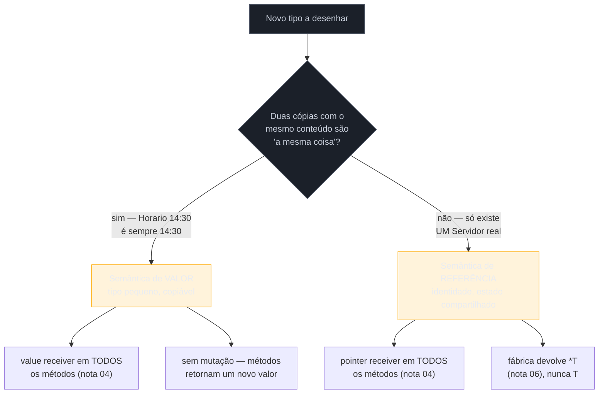
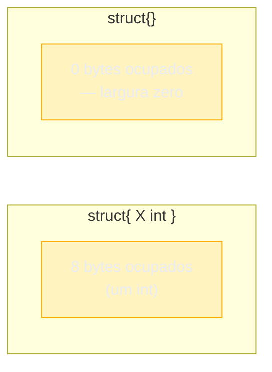

# Design de tipos idiomático

> [!abstract] TL;DR
> Desenhar um tipo idiomático em Go é decidir, antes de escrever o primeiro campo, **duas perguntas amarradas**: esse tipo tem identidade própria (deve ser sempre um só, compartilhado por referência) ou é só um saco de dados pequeno e copiável (deve viajar por valor)? E essa resposta precisa estar **consistente** com a escolha de receiver da [[03-Dominios/Tecnologia/Go/02 - Tipos, structs e métodos/04 - Value vs pointer receiver|nota 04]] — um tipo com semântica de referência (`Server`, com conexões ativas e estado mutável) usa pointer receiver em tudo; um tipo com semântica de valor (`time.Time`, `Money`) usa value receiver em tudo e nunca deveria mutar em lugar. Por cima dessa decisão central, mais três ferramentas fecham o design: fazer o **zero value útil** sempre que possível (aprofundando o provérbio já visto na nota 06), impor **imutabilidade por convenção** via campos não exportados (Go não tem `const`/`final` de campo), e usar `struct{}` — o tipo de largura **zero bytes** — como marcador em `map[string]struct{}` (conjunto) ou `chan struct{}` (sinal, teaser de canais). Esta é a última nota do Galho 2: ela amarra structs, tipos nomeados, métodos, receivers, embedding, construtores e tags num único critério de design, e prepara a ponte para o Galho 3, onde esse mesmo comportamento vira contrato desacoplado do tipo concreto — interfaces.

## Dois tipos que parecem gêmeos, mas não são

Você está modelando duas coisas no mesmo pacote de um sistema de agendamento: um `Horario`, representando um instante fixo do calendário, e um `Servidor`, representando o processo que atende requisições de agendamento. Os dois começam parecidos — dois structs simples, cada um com alguns campos:

```go
type Horario struct {
    hora, minuto int
}

type Servidor struct {
    endereco        string
    conexoesAtivas  int
}
```

Structurally, são quase idênticos: dois inteiros aqui, uma string e um inteiro ali. Mas eles deveriam se comportar de formas **opostas** no resto do programa. Um `Horario` de `14:30` é só um valor — comparar dois `Horario`s com `==` deveria funcionar, copiar um `Horario` para outra variável deveria criar um segundo `14:30` totalmente independente, e não faz sentido nenhum "mutar" um horário existente (você não *altera* as 14:30 para virarem 15:00 — você cria um *novo* horário de 15:00). Já um `Servidor` é outra história: só deveria existir **um** `Servidor` rodando numa determinada porta, `conexoesAtivas` precisa subir e descer conforme conexões chegam e saem, e se duas partes do código tiverem "cópias" independentes do mesmo `Servidor`, elas vão discordar sobre quantas conexões estão ativas — um bug de identidade, não de aritmética.

Se você escrever os métodos de `Horario` e `Servidor` sem parar para pensar nessa diferença, o resultado mais provável é um dos dois copiando o comportamento errado do outro — e o efeito colateral só aparece bem mais tarde, quando alguém descobre que incrementar `conexoesAtivas` num lugar não afeta o contador que o resto do programa está lendo, ou que comparar dois `*Horario` com `==` está comparando ponteiros, não os horários em si. Esta nota nomeia a decisão que precisa vir **antes** de qualquer método: qual das duas semânticas esse tipo representa.

## Value semantics vs reference semantics

**Semântica de valor** (*value semantics*) é a promessa de que uma variável do tipo se comporta como um número: copiar cria um valor totalmente independente, comparar com `==` compara conteúdo, e "mudar" significa produzir um novo valor, nunca mutar o existente. **Semântica de referência** (*reference semantics*) é o oposto: o que importa não é o conteúdo copiado, é a **identidade** — existe um só `Servidor` de verdade, e qualquer código que "tem" um `Servidor` na verdade tem um caminho até o mesmo objeto, compartilhado.



Go não tem uma palavra-chave para declarar "este tipo é de valor" ou "este tipo é de referência" — ao contrário de C++, que distingue explicitamente `value class` de `reference class` em bibliotecas mais formais, ou de Kotlin, que tem `data class` para reforçar semântica de valor. Em Go, essa decisão é **inteiramente convencional**, e se manifesta através de uma escolha concreta que você já domina desde a nota 04: **a consistência do receiver**. Um tipo com semântica de valor usa value receiver em absolutamente todos os métodos — nenhuma exceção, mesmo que um método específico "só quisesse" mutar internamente por conveniência. Um tipo com semântica de referência usa pointer receiver em todos os métodos, e a fábrica (nota 06) devolve `*T`, nunca `T`.

O exemplo canônico de tipo com semântica de valor na própria biblioteca padrão é `time.Time`: representa um instante fixo, é comparável com `.Equal()` (não `==`, por uma razão sutil de fuso horário — mas o espírito é comparação de conteúdo), e nenhum método de `time.Time` muta o receiver — `t.Add(1 * time.Hour)` não altera `t`, devolve um **novo** `time.Time`.

```go
t := time.Date(2026, 7, 16, 14, 30, 0, 0, time.UTC)
t2 := t.Add(1 * time.Hour)

fmt.Println(t)  // 2026-07-16 14:30:00 +0000 UTC — t não mudou
fmt.Println(t2) // 2026-07-16 15:30:00 +0000 UTC — t2 é um valor novo
```

Isso não é acidente de implementação — é a API de `time.Time` reforçando, de propósito, que horários são valores imutáveis. Todo método de transformação (`Add`, `AddDate`, `Truncate`, `Round`) segue o mesmo padrão: recebe `time.Time` por valor, devolve `time.Time` por valor, nunca muta nada.

## O `Server` que precisa ser sempre o mesmo `Server`

No lado oposto, um tipo com semântica de referência deliberada:

```go
type Servidor struct {
    endereco       string
    conexoesAtivas int
    mu             sync.Mutex
}

func NovoServidor(endereco string) *Servidor {
    return &Servidor{endereco: endereco}
}

func (s *Servidor) ConexaoAbriu() {
    s.mu.Lock()
    defer s.mu.Unlock()
    s.conexoesAtivas++
}

func (s *Servidor) ConexaoFechou() {
    s.mu.Lock()
    defer s.mu.Unlock()
    s.conexoesAtivas--
}

func (s *Servidor) ConexoesAtivas() int {
    s.mu.Lock()
    defer s.mu.Unlock()
    return s.conexoesAtivas
}
```

Toda a superfície pública de `Servidor` é pointer receiver — incluindo `ConexoesAtivas()`, que só lê, mas segue a regra de consistência da nota 04 porque `Servidor` é, por design, um tipo de referência. `NovoServidor` devolve `*Servidor`, nunca `Servidor` — se devolvesse por valor, cada parte do código que "recebesse" um `Servidor` teria sua própria cópia de `conexoesAtivas`, e incrementar numa cópia nunca apareceria na outra. É exatamente o bug de "identidade duplicada por acidente" que a abertura desta nota descreveu.

O ponto que costuma escapar de quem vem de Java ou Python: nessas linguagens, **todo objeto definido por classe é, por padrão, referência** — uma variável Java sempre guarda uma referência ao objeto, nunca o objeto embutido diretamente (com exceção dos tipos primitivos). Em Go, essa escolha é **explícita e por tipo**: você decide, para cada `struct`, se ele se comporta como referência (`*T` circulando, pointer receiver) ou como valor (`T` circulando, value receiver, cópias completas a cada atribuição). Não existe um "padrão automático" — o comportamento que Java entrega de graça, em Go, é uma decisão de design que você precisa tomar e manter consistente.

## Tipos pequenos vs grandes: o custo real de copiar

A decisão valor-vs-referência tem uma segunda dimensão, ortogonal à identidade: **tamanho**. Um tipo pequeno (alguns inteiros, uma ou duas strings curtas) é barato de copiar — a cópia inteira cabe em poucos registradores de CPU, e a alternativa (ponteiro) troca essa cópia barata por uma indireção e, potencialmente, uma alocação na heap. Um tipo grande (arrays fixos, muitos campos, slices internos volumosos) inverte essa conta: copiar o struct inteiro a cada chamada de método ou passagem de parâmetro fica caro, e um ponteiro — sempre do tamanho de uma palavra de máquina, 8 bytes em arquiteturas de 64 bits — vira sempre mais barato de mover.

```go
type PontoPequeno struct {
    X, Y int // 16 bytes — cabe num par de registradores
}

type ImagemGrande struct {
    Pixels [1920 * 1080]byte // ~2MB — NUNCA deveria circular por valor
}
```

Passar um `PontoPequeno` por valor para uma função, ou usá-lo como value receiver, custa praticamente nada — o compilador frequentemente evita até tocar a memória, mantendo os dois inteiros em registrador. Passar `ImagemGrande` por valor copia ~2MB a cada chamada — um desastre de performance silencioso, porque o código **compila e roda** normalmente, só fica lento sem nenhum erro apontando a causa.

> [!info] Isso não é o critério principal, é o segundo
> Tamanho decide *quando a semântica de valor fica cara demais*, mas não decide *se* um tipo deveria ser valor ou referência em primeiro lugar — essa é sempre a pergunta de identidade da seção anterior. Um `Servidor` pequeno (só `endereco string`, sem mutex nem contador) ainda deveria usar pointer receiver, porque a razão é identidade, não tamanho. Já um tipo grande, mas genuinamente de valor (uma matriz 4×4 usada em cálculos gráficos, por exemplo), tipicamente usa pointer receiver **mesmo sendo conceitualmente um valor** — só pelo custo de cópia, não porque tenha ganhado identidade. Os dois critérios empurram na mesma direção na maioria dos casos reais, mas vale saber que são perguntas diferentes.

## Fazer o zero value útil: o princípio, aprofundado

A [[03-Dominios/Tecnologia/Go/02 - Tipos, structs e métodos/06 - O idioma do construtor|nota 06]] já introduziu o zero value útil como contraponto ao idioma do construtor — `sync.Mutex{}` já nasce destravado, `bytes.Buffer{}` já nasce vazio e utilizável. Como fecho do galho, vale nomear o **critério de design** por trás disso, não só o exemplo: um tipo tem zero value útil quando **nenhum dos seus campos precisa de um valor diferente do próprio zero para o tipo fazer sentido**.

```go
// Zero value ÚTIL — nenhum campo exige valor não-zero
type ContadorSeguro struct {
    mu    sync.Mutex // zero value: destravado
    valor int        // zero value: 0, exatamente o esperado de um contador novo
}

var c ContadorSeguro // pronto para uso, sem fábrica
c.mu.Lock()
c.valor++
c.mu.Unlock()

// Zero value INÚTIL — addr vazia não é um endereço válido de rede
type Servidor struct {
    endereco string // zero value "" é inválido no domínio
}
```

O teste prático, aplicável a qualquer tipo novo antes de escrever a fábrica: percorra cada campo e pergunte "o zero value **dele** já é um estado válido no meu domínio?". Um `[]byte` no zero value é `nil`, mas `append(nil, x)` funciona — então um buffer que só usa `append` tem zero value útil de graça. Um `map` no zero value também é `nil`, e **ler** de um `map` `nil` não quebra (`m["chave"]` devolve o zero value do tipo do valor) — mas **escrever** quebra com panic, então um tipo cujo comportamento depende de escrever num map interno **não** tem zero value útil automaticamente, a menos que a fábrica (ou o primeiro método chamado) inicialize o map antes do primeiro uso.

Zero value útil não é só conveniência — é uma forma de **reduzir a superfície de erro** do tipo inteiro: se `var t T` já é válido, elimina-se de vez a classe de bug "esqueci de chamar `NewT()` antes de usar" — um bug que o compilador Go nunca vai pegar, porque `T{}` compila normalmente independente de ser um estado útil ou não.

## Imutabilidade por convenção: sem `const`, sem `final`, só campo não exportado

Java tem `final` para campos, Kotlin tem `val`, JavaScript moderno tem `Object.freeze` — mecanismos, em graus variados, para o compilador (ou runtime) impedir que um campo mude depois de inicializado. Go **não tem nenhum equivalente para campos de struct**: a palavra-chave `const` em Go só se aplica a valores conhecidos em tempo de compilação (números, strings, booleanos — nunca `struct`s, `slice`s ou `map`s), então `const p Point = Point{1, 2}` simplesmente não compila.

A ferramenta que Go oferece, em vez disso, é a mesma que já resolve visibilidade desde o Galho 1: **campo não exportado + acesso só por método**.

```go
type Money struct {
    centavos int64 // não exportado — código fora do pacote não pode escrever direto
}

func NewMoney(centavos int64) Money {
    return Money{centavos: centavos}
}

func (m Money) Centavos() int64 {
    return m.centavos
}

// Sem SetCentavos — Money é imutável por convenção: uma vez criado, não muda
func (m Money) Somar(outro Money) Money {
    return Money{centavos: m.centavos + outro.centavos} // devolve um NOVO Money
}
```

`Money` é imutável por três decisões que se reforçam: o campo `centavos` é não exportado, então nenhum código externo consegue escrever nele diretamente; não existe nenhum método `SetCentavos` nem qualquer outro que mute o receiver; e `Somar` — a única operação que "modifica" um valor — devolve um `Money` **novo**, exatamente como `time.Time.Add`. Repare que isso só funciona *dentro* do próprio pacote de `Money` com disciplina: nada no compilador impede alguém, escrevendo código no **mesmo** pacote, de acessar `m.centavos` diretamente e reatribuir — a barreira é só contra código de fora. Imutabilidade em Go é sempre um contrato social reforçado por visibilidade de pacote, nunca uma garantia do compilador como `final` entrega em Java.

> [!question]- Isso não é frágil? Qualquer um no mesmo pacote pode quebrar a regra
> É frágil no sentido estrito — sim, tecnicamente alguém no mesmo pacote pode escrever `m.centavos = 999` diretamente. Mas na prática, isso raramente acontece: convenção de equipe, code review, e o próprio hábito de nunca declarar um `Somar` que muta em vez de devolver quebram esse risco antes de virar bug real. É a mesma filosofia "consenting adults" que Python aplica a atributos `_privados` — a linguagem não trava a porta com cadeado, ela conta com o programador não forçar a fechadura. Go aposta na mesma coisa: visibilidade de pacote, não imposição em tempo de compilação de campo individual.

## `struct{}` vazio: o tipo de largura zero

Toda a discussão até aqui foi sobre *como* um tipo se comporta. Esta seção fecha com um caso especial de *tamanho*: `struct{}`, o struct sem nenhum campo, ocupa **zero bytes** de memória — é o único tipo em Go garantido pela especificação a ter largura zero.



Isso soa como curiosidade acadêmica até você ver o uso mais comum: **`struct{}` como o valor de um `map` usado só como conjunto (set)**. Go não tem um tipo `set` nativo — o idioma da comunidade é `map[T]bool` ou `map[T]struct{}`, e a segunda forma é a mais correta semanticamente, porque comunica com precisão que **o valor não importa, só a existência da chave importa**:

```go
// map[string]bool — funciona, mas o bool é ambíguo:
// "false" significa "não está no conjunto" ou "está, mas marcado como falso"?
visitados := map[string]bool{}
visitados["nodo-A"] = true
if visitados["nodo-B"] { /* nunca entra — mas isso é indistinguível de "marcado false" */ }

// map[string]struct{} — a intenção é inequívoca: só a chave importa
visitados := map[string]struct{}{}
visitados["nodo-A"] = struct{}{}
if _, ok := visitados["nodo-B"]; ok {
    // "nodo-B" está no conjunto
}
```

A diferença não é só estética — é memória real: um `map[string]bool` com um milhão de chaves gasta um byte por entrada só para armazenar um `true` que ninguém vai ler como informação (só a chave é consultada). Um `map[string]struct{}` com o mesmo milhão de chaves gasta **zero bytes adicionais** por valor, porque `struct{}` não ocupa espaço algum — o mapa guarda só as chaves e um marcador de presença de largura zero.

O segundo uso comum de `struct{}` — só mencionado aqui como teaser, aprofundado no bloco 2 desta trilha sobre concorrência — é `chan struct{}` como **canal de sinal**: quando o propósito de um canal não é transportar dado nenhum, só avisar "isto aconteceu", `chan struct{}` comunica essa intenção de forma tão precisa quanto `map[string]struct{}` comunica "isto é um conjunto":

```go
concluido := make(chan struct{})

go func() {
    // ... trabalho ...
    close(concluido) // sinaliza sem transportar nenhum valor
}()

<-concluido // bloqueia até o sinal chegar — o valor recebido não importa, só o evento
```

Este uso de canal só é citado aqui de passagem — a mecânica completa de `chan`, `select`, goroutines e padrões de sincronização é assunto do bloco 2 da trilha Go, bem à frente. O que fica marcado agora é o princípio comum aos dois casos: sempre que um tipo existe só para **marcar presença ou ocorrência**, sem carregar dado nenhum, `struct{}` é o tipo mais honesto e mais barato que Go oferece — mais honesto que `bool` (que sugere um valor que pode ser verdadeiro ou falso, quando na verdade só existência importa) e mais barato que qualquer outro tipo não-vazio.

## Tipo nomeado vs struct vs primitivo puro

O Galho 2 já cobriu tipos nomeados (nota 02) e structs (nota 01) separadamente — o design de tipo idiomático exige saber **quando usar qual**, e quando nenhum dos dois é necessário.

| Situação | Ferramenta idiomática | Exemplo |
|---|---|---|
| Um único valor primitivo, mas com semântica própria (não deveria misturar com um `int` qualquer) | Tipo nomeado sobre primitivo | `type CentavosBRL int64` |
| Vários campos relacionados, agrupados como uma unidade | `struct` | `type Endereco struct { Rua, Cidade string }` |
| Um valor solto, sem relação com outros dados, sem necessidade de método próprio | Primitivo puro, sem tipo novo | `var idade int` |
| Conjunto fechado de valores válidos (enum-like) | Tipo nomeado + `const`/`iota` | `type Status int; const (Ativo Status = iota; Inativo)` |

O critério que decide entre a primeira e a terceira linha é exatamente o mesmo já visto na nota 02: um tipo nomeado vale a pena quando ele **evita confusão semântica** (somar `CentavosBRL` com `CentavosUSD` deveria ser um erro de compilação, não um bug de runtime) ou quando ganha **métodos próprios** que fazem sentido só para aquele domínio. Criar `type Nome string` só porque "parece mais descritivo", sem nenhum método nem checagem de tipo cruzado evitada, é ritual sem ganho — o mesmo tipo de over-engineering que a nota 01 do Galho 1 já advertiu contra interfaces prematuras.

## Tipos comparáveis como chave de map

Uma última peça de design que amarra semântica de valor com uso prático: Go só aceita como **chave de `map`** tipos que sejam **comparáveis** — ou seja, tipos para os quais `==` está definido e sempre termina (nunca entra em loop nem panica). `struct`s são comparáveis desde que **todos** os seus campos também sejam comparáveis; `slice`s, `map`s e `func`s nunca são comparáveis, e portanto nunca podem ser chave de `map` nem tipo de outro `map`, diretamente.

```go
type Coordenada struct {
    X, Y int // int é comparável — Coordenada também é
}

visitas := map[Coordenada]int{}
visitas[Coordenada{X: 3, Y: 4}]++
visitas[Coordenada{X: 3, Y: 4}]++
fmt.Println(visitas[Coordenada{X: 3, Y: 4}]) // 2 — mesma struct, mesma chave

type Rota struct {
    Pontos []Coordenada // slice — NÃO comparável
}

// mapa := map[Rota]string{} // ERRO: invalid map key type Rota (comparing uncomparable type)
```

`Coordenada` funciona como chave porque os dois campos (`int`) são comparáveis — comparar duas `Coordenada`s vira, por baixo, comparar `X` e depois `Y`, campo a campo. `Rota` **não** funciona, porque `[]Coordenada` é um slice, e slices nunca são comparáveis (a razão de fundo é a mesma da nota 07 do Galho 1: um slice é um cabeçalho apontando pra um array, e Go não define — de propósito — o que "dois slices iguais" significaria de forma inequívoca: mesmo conteúdo? mesmo array subjacente? mesma capacidade?).

Isso conecta diretamente com a decisão valor-vs-referência da abertura desta nota: **um tipo com semântica de valor genuína — pequeno, com campos primitivos, sem ponteiros nem slices internos — é quase sempre um bom candidato a chave de `map`**, porque a comparação campo a campo tem exatamente o significado que semântica de valor promete: duas cópias com o mesmo conteúdo são "a mesma coisa". Um tipo com semântica de referência (`Servidor`, com `sync.Mutex` embutido) nem compila como chave — `sync.Mutex` contém campos não comparáveis por design, e mesmo que compilasse, comparar dois `Servidor`es por conteúdo não faria sentido: a pergunta certa seria "é o *mesmo* servidor?", que é comparação de identidade (ponteiro), não de conteúdo.

## Casos práticos

**1. `Money`, semântica de valor, imutável, comparável — candidato natural a chave de map:**

```go
type Money struct {
    centavos int64
    moeda    string
}

func NewMoney(centavos int64, moeda string) Money {
    return Money{centavos: centavos, moeda: moeda}
}

func (m Money) Centavos() int64 { return m.centavos }
func (m Money) Moeda() string   { return m.moeda }

func (m Money) Somar(outro Money) (Money, error) {
    if m.moeda != outro.moeda {
        return Money{}, fmt.Errorf("moedas incompatíveis: %s vs %s", m.moeda, outro.moeda)
    }
    return Money{centavos: m.centavos + outro.centavos, moeda: m.moeda}, nil
}

precoA := NewMoney(1050, "BRL")
precoB := NewMoney(200, "BRL")
total, _ := precoA.Somar(precoB)
fmt.Println(total.Centavos()) // 1250 — precoA e precoB continuam intactos
```

**2. `Servidor`, semântica de referência, mutável, identidade única:**

```go
type Servidor struct {
    endereco       string
    conexoesAtivas int
    mu             sync.Mutex
}

func NovoServidor(endereco string) *Servidor {
    return &Servidor{endereco: endereco}
}

func (s *Servidor) ConexaoAbriu() {
    s.mu.Lock()
    defer s.mu.Unlock()
    s.conexoesAtivas++
}
```

**3. `map[string]struct{}` como set, num caso real — deduplicar tags:**

```go
func TagsUnicas(tags []string) []string {
    vistas := make(map[string]struct{}, len(tags))
    var resultado []string
    for _, t := range tags {
        if _, ok := vistas[t]; ok {
            continue
        }
        vistas[t] = struct{}{}
        resultado = append(resultado, t)
    }
    return resultado
}

TagsUnicas([]string{"go", "backend", "go", "api"}) // ["go", "backend", "api"]
```

**4. Imutabilidade por convenção, sem setters, revisitando `ContaBancaria`:**

```go
type ContaBancaria struct {
    titular string // não exportado — só leitura via método
    saldo   float64
}

func (c ContaBancaria) Titular() string { return c.titular }
func (c ContaBancaria) Saldo() float64  { return c.saldo }

// Depositar não muta — devolve uma NOVA ContaBancaria, reforçando semântica de valor
func (c ContaBancaria) Depositar(valor float64) ContaBancaria {
    return ContaBancaria{titular: c.titular, saldo: c.saldo + valor}
}
```

Repare que este `ContaBancaria` é diferente do que a nota 04 mostrou — lá, `ContaBancaria` tinha semântica de **referência** (pointer receiver, `Depositar` mutava o saldo real, porque representava uma conta real única no banco). Aqui, é uma versão hipotética com semântica de **valor** (útil, por exemplo, como um "snapshot" imutável de saldo, não a conta viva). A mesma struct, dependendo da decisão de design, pode legitimamente ir para qualquer um dos dois lados — o que não pode acontecer é misturar as duas dentro do mesmo tipo.

## Armadilhas comuns

> [!warning] Struct grande circulando por valor — cópias caras e silenciosas
> Um tipo com dezenas de campos, ou com um array/slice interno volumoso, usado com value receiver ou passado por valor em funções, custa uma cópia completa a cada chamada — sem nenhum erro, sem nenhum aviso do compilador, só um programa mais lento do que deveria ser. `go vet` não pega isso por padrão (embora `golangci-lint`, com o linter `gocritic`, tenha uma regra específica — `hugeParam` — para sinalizar parâmetros grandes demais passados por valor). A defesa é hábito de design: qualquer struct que passe de um punhado de campos primitivos, ou que contenha um array fixo, deveria usar pointer receiver e ponteiro nas assinaturas de função, mesmo que nenhum método precise mutar.

> [!warning] Expor campos que deveriam ser imutáveis
> Declarar `Centavos int64` (maiúsculo, exportado) numa struct como `Money`, em vez de `centavos int64` (não exportado) com um método `Centavos()`, parece economizar uma linha — mas elimina de vez a garantia de imutabilidade: qualquer código de fora do pacote pode escrever `preco.Centavos = -999` diretamente, sem passar por nenhuma validação nem pelo caminho pensado de `Somar`. Como visto acima, Go não tem `final`/`const` de campo — a única defesa é não exportar o campo em primeiro lugar. Exportar por padrão, e só depois "consertar" para não exportado quando um bug aparecer, é a ordem errada — comece não exportado, exporte só quando um consumidor real de outro pacote precisar.

> [!warning] `map[string]bool` onde `map[string]struct{}` comunica a intenção melhor
> Usar `bool` como valor de um "conjunto" funciona — mas carrega uma ambiguidade que `struct{}` elimina: `mapa["x"] = false` e "x não está no mapa" retornam o mesmo zero value (`false`) numa leitura direta (`mapa["x"]`), forçando quem lê o código a sempre usar a forma de dois retornos (`_, ok := mapa["x"]`) para não confundir os dois casos — e é fácil esquecer isso numa leitura rápida, produzindo um bug sutil de "achei que tinha marcado false, mas na verdade nunca inseri a chave". `map[string]struct{}` não tem essa armadilha: a única forma de checar é `_, ok := mapa["x"]`, porque não existe um "valor falso" plausível para confundir com ausência — e, de brinde, ocupa menos memória.

## Em entrevista

Uma pergunta recorrente em entrevistas para vagas Go de nível pleno/sênior, especialmente quando o candidato lista experiência prévia em Java ou C#: **"como você decide se um tipo deveria ser usado por valor ou por ponteiro em Go?"** A resposta fraca cita só "depende do tamanho". A resposta forte nomeia as duas perguntas amarradas desta nota, na ordem certa: primeiro identidade (esse tipo representa um "algo" único e compartilhado, ou um valor descartável e copiável?), depois custo de cópia (mesmo sendo conceitualmente um valor, ele é grande o bastante para que a cópia doa?) — e fecha citando a consequência prática, a consistência de receiver: a decisão vale para o tipo inteiro, nunca método a método.

Outra pergunta comum, mais específica: **"por que `time.Time` não tem um método `SetHour` ou similar?"** É uma pergunta sobre reconhecer semântica de valor na própria biblioteca padrão — a resposta forte explica que `time.Time` foi desenhado deliberadamente como valor imutável: qualquer "mudança" (`Add`, `Truncate`, `Round`) devolve um novo `time.Time`, nunca muta o receiver, porque um instante de tempo não é algo que "se altera" — é um valor que se substitui por outro. Candidatos que respondem só "porque `time.Time` usa value receiver" acertam a mecânica, mas perdem o porquê de design por trás da escolha.

Uma terceira pergunta, mais prática de código: **"quando você usaria `map[string]struct{}` em vez de `map[string]bool`?"** A resposta forte não para em "quando quero um set" — nomeia a ambiguidade real que `bool` introduz (não dá para distinguir "chave ausente" de "chave presente com valor `false`" numa leitura direta do mapa, só com a forma de dois retornos) e o ganho de memória de um tipo de largura zero, sem inflar a resposta com detalhe de implementação do runtime que a pergunta não pediu.

> [!question]- O entrevistador insiste: "mas na prática, isso importa? Cópia de struct pequeno não é 'rápido o bastante' de qualquer forma?"
> Na maioria dos casos, sim — copiar um struct de dois ou três `int`s é imperceptível, e otimizar prematuramente por esse motivo seria trocar clareza por um ganho que ninguém vai medir. O ponto da pergunta não é "sempre otimize para performance" — é "a decisão de valor-vs-referência é sobre **correção semântica primeiro**, custo depois". Um `Servidor` usado por valor não é um problema de performance: é um bug de identidade (dois "servidores" que deveriam ser o mesmo, divergindo silenciosamente). O critério de tamanho só decide entre duas opções que já são **ambas corretas** semanticamente — nunca deveria ser usado para justificar semântica de referência num tipo que é, por natureza, um valor.

## Como explicar em inglês

> "Idiomatic type design in Go starts with one question: does this type have identity — should every copy refer to the same underlying thing — or is it just a small, copyable bag of data? That answer has to be consistent with the receiver choice covered earlier: a **reference semantics** type, like a `Server` tracking active connections, uses pointer receivers everywhere and its constructor always returns `*T`. A **value semantics** type, like `time.Time` or a `Money` type, uses value receivers everywhere, never mutates in place, and returns a new value from any transformation. On top of that, good Go design makes the **zero value useful** whenever possible — `var t T` should already be safe to use — and enforces **immutability by convention**, since Go has no `const`/`final` for struct fields: you keep fields unexported and expose only accessor methods, no setters. And when a type exists purely to mark presence, not to carry data, the empty `struct{}` — the only Go type guaranteed to occupy zero bytes — is the idiomatic choice: `map[string]struct{}` as a set, `chan struct{}` as a signal. Comparable, small, immutable value types also make natural map keys, since Go's `==` compares them field by field with exactly the meaning value semantics promises."

| PT-BR | English |
|---|---|
| semântica de valor | value semantics |
| semântica de referência | reference semantics |
| imutabilidade | immutability |
| struct vazio / de largura zero | empty struct / zero-width struct |
| chave de mapa | map key |
| tipo comparável | comparable type |
| campo não exportado | unexported field |
| zero value útil | usable zero value |
| conjunto (set) | set |
| canal de sinal | signal channel |

## O que vem a seguir

Com esta nota, o **Galho 2 — Tipos, structs e métodos — se fecha**. Você já domina como agregar dados em `struct`s e dar semântica própria a primitivos com tipos nomeados (notas 01-02), como anexar comportamento via métodos e escolher entre value e pointer receiver (notas 03-04), como compor tipos por embedding em vez de herança (nota 05), como nascer instâncias válidas com o idioma do construtor e o zero value útil (nota 06), como carregar metadados de campo com struct tags (nota 07) — e, com esta nota, como amarrar tudo isso num critério consciente de design: identidade vs valor, tamanho, imutabilidade e o papel do `struct{}` vazio.

O que falta é dar nome ao **comportamento em si**, desacoplado do tipo concreto que o implementa. Até aqui, todo método pertenceu a um `struct` específico — `Servidor.ConexaoAbriu()`, `Money.Somar()`. O **Galho 3 — Interfaces e composição** parte exatamente daqui: como Go descreve "o que um tipo faz" sem amarrar esse contrato a "de que struct ele é", e por que — retomando o teaser já plantado na nota 04 (method set de `T` vs `*T`) — a decisão de receiver feita aqui neste galho determina, de forma direta, quais interfaces cada tipo consegue satisfazer. O provérbio de Rob Pike que fecha essa ponte, e que a nota de fecho do Galho 1 já citou de passagem: **"the bigger the interface, the weaker the abstraction"** — quanto mais uma interface exige, menos ela se encaixa em qualquer lugar; o Galho 3 mostra por que interfaces pequenas, descobertas no ponto de consumo, são o padrão-ouro do design Go.

## Veja também

- [[03-Dominios/Tecnologia/Go/02 - Tipos, structs e métodos/04 - Value vs pointer receiver|04 — Value vs pointer receiver]] — a consistência de receiver que esta nota amarra à semântica de valor/referência
- [[03-Dominios/Tecnologia/Go/02 - Tipos, structs e métodos/06 - O idioma do construtor|06 — O idioma do construtor]] — zero value útil, introduzido ali e aprofundado aqui como princípio de design
- [[03-Dominios/Tecnologia/Go/02 - Tipos, structs e métodos/01 - Structs — definição e inicialização|01 — Structs: definição e inicialização]] — comparabilidade de struct, retomada na seção de chave de map
- [[03-Dominios/Tecnologia/Go/01 - Fundamentos e sintaxe/08 - Idiomático desde o início|Galho 1, nota 08 — Idiomático desde o início]] — "accept interfaces, return structs" e os Go Proverbs, retomados na ponte final
- [[03-Dominios/Tecnologia/Go/03 - Interfaces e composição/index|Galho 3 — Interfaces e polimorfismo]] — próximo galho da trilha
- [[03-Dominios/Tecnologia/Go/index|Trilha Go]]

## Fontes

- The Go Authors. *Effective Go — Pointers vs. Values*. go.dev. https://go.dev/doc/effective_go#pointers_vs_values (acessado em 2026-07-16)
- The Go Authors. *The Go Programming Language Specification — Comparison operators*. go.dev. https://go.dev/ref/spec#Comparison_operators (acessado em 2026-07-16)
- The Go Authors. *The Go Programming Language Specification — Struct types*. go.dev. https://go.dev/ref/spec#Struct_types (acessado em 2026-07-16)
- Go Wiki. *Code Review Comments — Receiver Type*. github.com. https://github.com/golang/go/wiki/CodeReviewComments#receiver-type (acessado em 2026-07-16)
- Go Proverbs (curado a partir da palestra de Rob Pike na Gopherfest 2015): https://go-proverbs.github.io/
- Cheney, D. *The empty struct*. dave.cheney.net, 2014. https://dave.cheney.net/2014/03/25/the-empty-struct (acessado em 2026-07-16)
- The Go Authors. *time package — Time*. pkg.go.dev. https://pkg.go.dev/time#Time (acessado em 2026-07-16)
- The Go Authors. *sync package — Mutex*. pkg.go.dev. https://pkg.go.dev/sync#Mutex (acessado em 2026-07-16)

Consultado em 2026-07-16.
