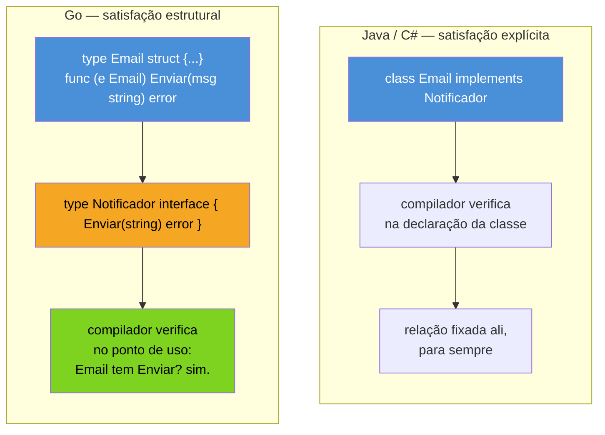

# Interfaces implícitas e satisfação estrutural

> [!abstract] TL;DR
> Uma **interface** em Go é só um conjunto de métodos — `type Notificador interface { Notificar(msg string) error }`. A parte que rompe com Java, C# ou TypeScript orientado a classes: **nenhum tipo declara que implementa uma interface**. Não existe `implements`, `: Notificador`, nem qualquer palavra-chave de intenção. Um tipo satisfaz uma interface **automaticamente**, só por ter no seu method set todos os métodos que a interface exige — o compilador verifica isso na hora do uso, não na hora da declaração do tipo. Esse mecanismo se chama **satisfação estrutural** (também "duck typing estático", porque é verificado em compile-time, ao contrário do duck typing dinâmico do Python). A consequência prática: você pode escrever uma interface **depois** do tipo que vai satisfazê-la, em outro pacote, sem tocar no código original — e um mesmo tipo satisfaz quantas interfaces existirem, de graça, contanto que os métodos batam.

## O problema que motiva interfaces

Imagine que você está escrevendo um sistema de notificações. Já tem dois tipos, cada um com seu jeito de mandar mensagem:

```go
type Email struct {
    Destinatario string
}

func (e Email) Enviar(msg string) error {
    fmt.Printf("Email para %s: %s\n", e.Destinatario, msg)
    return nil
}

type SMS struct {
    Numero string
}

func (s SMS) Enviar(msg string) error {
    fmt.Printf("SMS para %s: %s\n", s.Numero, msg)
    return nil
}
```

Agora você quer uma função `Alertar` que recebe "qualquer coisa que sabe enviar mensagem" e dispara o alerta, sem se importar se é `Email`, `SMS`, ou um `Webhook` que você ainda nem escreveu. Em Go sem interfaces, a única saída seria sobrecarregar `Alertar` para cada tipo — e Go nem tem sobrecarga de função. É exatamente o buraco que interface preenche: uma forma de dizer "aceito qualquer valor que tenha este método", sem enumerar os tipos concretos.

```go
type Notificador interface {
    Enviar(msg string) error
}

func Alertar(n Notificador, msg string) error {
    return n.Enviar("ALERTA: " + msg)
}
```

`Notificador` não é um tipo com dados — é uma **exigência de comportamento**: "qualquer valor que tenha um método `Enviar(string) error`". E aqui está o detalhe que separa Go do resto: `Email` e `SMS` já satisfazem `Notificador` no código acima, mesmo tendo sido declarados **antes** dela existir, sem uma linha a mais em nenhum dos dois.

```go
func main() {
    e := Email{Destinatario: "ana@example.com"}
    s := SMS{Numero: "+55 11 99999-0000"}

    Alertar(e, "servidor caiu")  // Email satisfaz Notificador
    Alertar(s, "servidor caiu")  // SMS também satisfaz — sem relação entre os dois tipos
}
```

## Satisfação implícita: o que o compilador realmente verifica

Em Java, C# ou TypeScript com classes, a relação tipo-interface é **declarada explicitamente**: `class Email implements Notificador`. O compilador então checa se `Email` cumpre o contrato — mas a *intenção* de implementar já estava escrita, fixa, no momento da declaração da classe. Se `Notificador` não existisse quando `Email` foi escrita, seria preciso voltar e editar `Email` para acrescentar o `implements`.

Go inverte essa ordem. Não existe cláusula de intenção nenhuma. O compilador, no ponto de **uso** — ao passar `e` para `Alertar(n Notificador, ...)` — pergunta uma coisa só: "o method set de `Email` contém todos os métodos que `Notificador` exige?". Se sim, compila. Se não, erro de compilação ali, no ponto de uso, não na declaração do tipo.



A verificação em si — "o tipo concreto tem os métodos certos, com a assinatura certa?" — é estática e acontece em tempo de compilação, exatamente como em Java. O que muda é **onde mora a declaração de intenção**: em nenhum lugar. Por isso o termo mais preciso não é "sem tipagem" nem "tipagem fraca" — é **duck typing estático**: "se anda como pato e grasna como pato, é um pato" (o teste clássico de duck typing), mas aqui o "teste" roda no `go build`, não em tempo de execução como faria em Python.

## Só o method set decide

A regra completa, sem exceção: um tipo `T` satisfaz uma interface `I` se, e somente se, o method set de `T` contém **todos** os métodos declarados por `I`, com nome, parâmetros e retorno idênticos. Nada além disso importa — não o nome do tipo, não onde ele foi declarado, não se `T` "parece" relacionado a `I` de alguma forma semântica.

```go
type Logger interface {
    Log(msg string)
}

type ArquivoDeTexto struct {
    Caminho string
}

func (a ArquivoDeTexto) Log(msg string) {
    fmt.Println(a.Caminho + ": " + msg)
}
```

`ArquivoDeTexto` satisfaz `Logger` — apesar de nada em `ArquivoDeTexto` sugerir "isto é um logger" pelo nome. Isso é uma faca de dois gumes: por um lado, dá liberdade total (dois pacotes que nunca se conhecem podem "encaixar" um no outro, contanto que os métodos batam); por outro, significa que satisfação de interface pode acontecer **sem querer**, se por acaso um tipo tiver um método com a assinatura certa por coincidência. Na prática isso raramente é um problema real — assinaturas coincidentes por acaso, com semântica incompatível, são raras — mas vale ter em mente que o compilador não julga *intenção*, só forma.

> [!warning] Assinatura precisa bater EXATAMENTE — nome, tipos e ordem dos parâmetros, tipo de retorno
> `func (e Email) Enviar(msg string) error` satisfaz `Enviar(msg string) error`. Mas `func (e Email) Enviar(msg string, prioridade int) error` (parâmetro a mais) ou `func (e Email) Enviar(msg string)` (sem retorno) **não satisfazem** — são métodos diferentes aos olhos do compilador, mesmo com o mesmo nome. Go não tem sobrecarga nem parâmetros opcionais, então não existe "quase bate": ou bate exatamente, ou o tipo não implementa a interface, ponto.

## Verificando satisfação em tempo de compilação, de propósito

Como não existe `implements`, é possível declarar um tipo achando que ele satisfaz uma interface — e só descobrir o erro quando alguém tentar usá-lo daquele jeito, potencialmente longe do arquivo original. Para pegar esse erro cedo, a comunidade Go usa uma asserção de tipo em uma variável descartada, checada em tempo de compilação:

```go
type Notificador interface {
    Enviar(msg string) error
}

type Email struct {
    Destinatario string
}

func (e Email) Enviar(msg string) error {
    fmt.Printf("Email para %s: %s\n", e.Destinatario, msg)
    return nil
}

// Força o compilador a checar, aqui e agora, que Email satisfaz Notificador.
// Não aloca nada em runtime — é só uma checagem de tipo em compile-time.
var _ Notificador = Email{}
```

Se algum método de `Email` for renomeado ou tiver a assinatura alterada por engano, essa linha para de compilar imediatamente, no arquivo onde `Email` é declarado — em vez de um erro confuso aparecendo bem depois, em outro pacote, no ponto onde `Email` é passada para uma função que espera `Notificador`. É um padrão idiomático, não uma feature de linguagem separada: só uma atribuição comum que o compilador tem que verificar de qualquer forma.

## Casos práticos

**1. Múltiplas interfaces, um tipo concreto, sem repetir nada:**

```go
type Notificador interface {
    Enviar(msg string) error
}

type Auditavel interface {
    RegistroDeEnvio() string
}

type Email struct {
    Destinatario string
    ultimoEnvio  string
}

func (e *Email) Enviar(msg string) error {
    e.ultimoEnvio = msg
    fmt.Printf("Email para %s: %s\n", e.Destinatario, msg)
    return nil
}

func (e Email) RegistroDeEnvio() string {
    return "último envio: " + e.ultimoEnvio
}

func main() {
    e := &Email{Destinatario: "ana@example.com"}

    var n Notificador = e // satisfaz Notificador
    var a Auditavel = e   // e satisfaz Auditavel — mesmo tipo, sem declarar nada disso

    n.Enviar("prazo amanhã")
    fmt.Println(a.RegistroDeEnvio())
}
```

Nenhuma linha em `Email` menciona `Notificador` ou `Auditavel`. Os dois "encaixam" só porque os métodos existem no method set de `*Email`.

**2. Interface satisfeita por um tipo de outro pacote — inclusive um que você não escreveu.** Este é o caso onde satisfação implícita realmente ganha da alternativa explícita: `os.File` (do pacote padrão `os`) tem um método `Write([]byte) (int, error)`. Você pode declarar sua própria interface, no seu pacote, e `*os.File` vai satisfazê-la automaticamente, sem que o time do Go tenha previsto sua interface:

```go
type Escritor interface {
    Write(p []byte) (n int, err error)
}

func GravarLog(w Escritor, linha string) {
    w.Write([]byte(linha + "\n"))
}

func main() {
    arq, _ := os.Create("saida.log")
    defer arq.Close()

    GravarLog(arq, "aplicação iniciada") // *os.File satisfaz Escritor sem saber que ela existe
}
```

(Essa `Escritor` é, de propósito, quase idêntica a `io.Writer` da biblioteca padrão — a próxima nota do galho explora por que interfaces pequenas assim, com um método só, são o estilo dominante em Go.)

## Vindo de outras linguagens

| Linguagem | Como um tipo "vira" um tipo de interface |
|---|---|
| Java / C# | Declaração explícita: `class Email implements Notificador` (ou `: INotificador`). Fixado na hora da classe. |
| TypeScript (com `interface`) | Também estrutural, como Go — `class Email implements Notificador` é opcional; TS já aceita satisfação por formato mesmo sem a cláusula. É a linguagem mainstream mais próxima do modelo de Go. |
| Python | Duck typing **dinâmico**: nada é checado até o método ser chamado em runtime; `AttributeError` se faltar. Go faz a mesma ideia, mas verificada estaticamente, em compile-time. |
| Go | Estrutural e estática: sem cláusula de intenção, checagem em compile-time no ponto de uso. |

A comparação mais útil é com TypeScript: quem já usou `interface` estrutural lá (sem `implements` obrigatório) já tem a intuição certa para Go. Quem vem só de Java/C#, o reflexo de procurar "onde está o `implements`" é o primeiro hábito a desarmar.

## Como explicar em inglês

> In Go, an interface is just a set of method signatures — `type Notificador interface { Enviar(msg string) error }`. The defining trait, compared to Java, C#, or class-based OOP in general, is that satisfaction is **implicit**: there's no `implements` keyword, no declared intent anywhere. A type satisfies an interface automatically as soon as its method set contains every method the interface requires, with matching signatures — checked by the compiler at the point of use, not at the type's declaration. This is often called **structural typing** or **static duck typing**: structural because only the shape (the methods) matters, not any declared relationship; static because, unlike Python's duck typing, the check happens at compile time, not when the method is actually called. A common idiom to catch mismatches early is a compile-time assertion like `var _ Notificador = Email{}`, which fails to compile immediately if `Email` stops satisfying the interface.

| Termo PT | Termo EN |
|---|---|
| satisfação estrutural | structural typing |
| satisfação implícita | implicit satisfaction |
| duck typing estático | static duck typing |
| conjunto de métodos | method set |
| assinatura de método | method signature |
| asserção de satisfação em compile-time | compile-time satisfaction assertion |
| tipo concreto | concrete type |

## O que vem a seguir

Toda interface até aqui teve um método fixo e conhecido — `Notificador` exige exatamente `Enviar`. Mas existe uma interface especial, no limite oposto: `interface{}` (ou seu apelido moderno `any`), que não exige **nenhum** método — e por isso qualquer valor de qualquer tipo a satisfaz automaticamente. A [[02 - O empty interface e any|próxima nota]] entra nesse caso extremo: o que ele serve para fazer, o preço que se paga (perda de garantias em compile-time) e por que Go moderno prefere generics na maioria dos lugares onde `any` era usado antes.

## Veja também

- [[02 - O empty interface e any|02 — O empty interface e any]] — próxima nota do galho
- [[03 - Type assertions e type switch|03 — Type assertions e type switch]] — como recuperar o tipo concreto por trás de um valor de interface
- [[05 - Interfaces pequenas — io.Reader e io.Writer|05 — Interfaces pequenas — io.Reader e io.Writer]] — a `Escritor` desta nota é quase `io.Writer` de propósito
- [[03-Dominios/Tecnologia/Go/02 - Tipos, structs e métodos/03 - Métodos|Galho 2, nota 03 — Métodos]] — method set, pré-requisito direto desta nota
- [[03-Dominios/Tecnologia/Go/index|Trilha Go]]

## Fontes

- The Go Authors. *The Go Programming Language Specification — Interface types*. go.dev. https://go.dev/ref/spec#Interface_types (acessado em 2026-07-18)
- The Go Authors. *A Tour of Go — Interfaces*. go.dev. https://go.dev/tour/methods/9 (acessado em 2026-07-18)
- The Go Authors. *A Tour of Go — Interfaces are implemented implicitly*. go.dev. https://go.dev/tour/methods/10 (acessado em 2026-07-18)
- The Go Authors. *Effective Go — Interfaces*. go.dev. https://go.dev/doc/effective_go#interfaces (acessado em 2026-07-18)
- Go by Example. *Interfaces*. gobyexample.com. https://gobyexample.com/interfaces (acessado em 2026-07-18)
