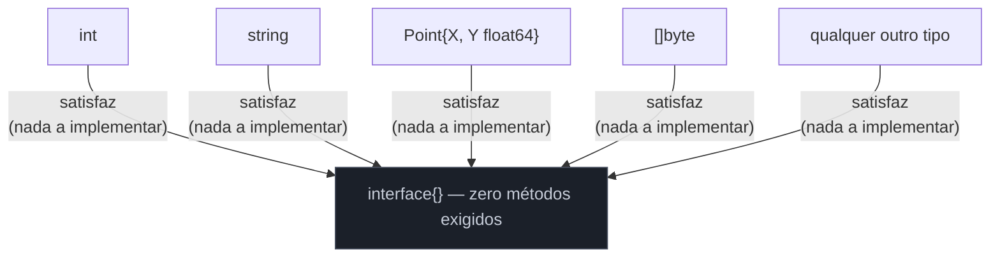

# O empty interface e any

> [!abstract] TL;DR
> `interface{}` é a interface sem nenhum método — e uma interface sem método é satisfeita por **qualquer valor**, de qualquer tipo, porque "implementar zero métodos" é trivialmente verdade para tudo. Desde o Go 1.18, `any` é só um **alias** de `interface{}` — mesmo tipo, nome mais legível. `func Println(a ...any)` do pacote `fmt` e `json.Unmarshal(data, &v)` com `v any` são os dois lugares onde você mais encontra esse padrão no dia a dia. O preço de aceitar qualquer coisa é abrir mão da checagem de tipo em tempo de compilação: o compilador para de te proteger, e o programa só descobre um tipo errado em runtime — geralmente com um `panic`. `any` é ferramenta de fronteira (I/O genérico, serialização, `fmt`), não hábito de design — usá-lo como saída fácil para "não quero pensar no tipo" é abrir mão do que faz Go, Go.

## O problema: uma função que aceita qualquer coisa

Pense em `fmt.Println`. Ele imprime um `int`, uma `string`, um `struct`, um `[]byte`, um mapa — literalmente qualquer valor que você jogar nele:

```go
fmt.Println(42)
fmt.Println("olá")
fmt.Println(Point{X: 3, Y: 4})
fmt.Println([]int{1, 2, 3})
```

Como você escreveria a assinatura dessa função? Em Java ou C#, você teria overloads — `println(int)`, `println(String)`, `println(Object)` — e o compilador escolheria o mais específico. Em Python ou JavaScript, você nem precisaria declarar tipo nenhum: parâmetros já aceitam qualquer coisa por padrão.

Go não tem overloads, e é uma linguagem estaticamente tipada — todo parâmetro *precisa* de um tipo declarado. Então como uma função assinada estaticamente aceita literalmente qualquer valor? A resposta está no que significa não exigir método nenhum.

## O mecanismo: zero métodos, satisfação garantida

A [[01 - Interfaces implícitas e satisfação estrutural|nota anterior]] já estabeleceu a regra: um tipo satisfaz uma interface se seu method set contém todos os métodos que a interface declara. Agora leve essa regra ao limite — o que acontece quando a interface declara **zero** métodos?

```go
type Vazia interface{}
```

Todo tipo, sem exceção, "contém" o conjunto vazio de métodos exigidos — porque não há nada para faltar. `int` satisfaz `Vazia`. `string` satisfaz `Vazia`. Qualquer struct, qualquer slice, qualquer outro tipo de interface — todos satisfazem `Vazia`, automaticamente, sem escrever uma linha de código a mais. Não é um caso especial do compilador: é a mesma regra de satisfação estrutural de sempre, só que aplicada a um conjunto de exigências vazio.



`interface{}` é literalmente a sintaxe para "interface sem corpo" — abre e fecha chave sem nada dentro. Uma variável desse tipo pode guardar qualquer valor, porque a única exigência para guardar ali é "ser um tipo Go válido" — e todo tipo é.

> [!info] `any` — alias desde o Go 1.18
> A partir do Go 1.18 (a mesma versão que trouxe generics), o pacote universo do Go passou a declarar `type any = interface{}` — um **alias de tipo** (`=`, não uma definição nova). `any` e `interface{}` são, para o compilador, exatamente o mesmo tipo — intercambiáveis em qualquer lugar, sem conversão. A recomendação oficial é usar `any` daqui pra frente: é mais curto, mais legível, e comunica a intenção ("aceita qualquer coisa") sem o ruído visual de chaves vazias. Código legado ou bibliotecas mais antigas ainda mostram `interface{}` — são a mesma coisa, e você vai continuar vendo os dois nomes.

```go
var x any = 42
x = "agora sou uma string"
x = Point{X: 1, Y: 2}
// qualquer atribuição acima compila — any aceita qualquer valor
```

## Onde `any` aparece de verdade

Não é um tipo que você declara em variáveis do dia a dia — ele aparece em três lugares recorrentes, todos com o mesmo tema: **fronteiras onde o tipo concreto não pode ser conhecido em tempo de compilação**.

**1. `fmt.Println` e a família `fmt`** — a assinatura real é `func Println(a ...any) (n int, err error)`. É por isso que `fmt.Println` aceita qualquer combinação de argumentos de qualquer tipo: cada `a[i]` é um `any`, e por baixo `fmt` usa reflection (pacote `reflect`) para descobrir o tipo real de cada valor em runtime e decidir como formatá-lo.

**2. `encoding/json` com estrutura desconhecida** — quando você não sabe de antemão o formato do JSON que vai receber (ou ele varia), `json.Unmarshal` decodifica para `any`, que vira um dos tipos concretos do encoding: `map[string]any` para objetos, `[]any` para arrays, `float64` para números, `string`, `bool`, ou `nil`:

```go
var dados any
err := json.Unmarshal([]byte(`{"nome": "Ana", "idade": 30}`), &dados)
if err != nil {
    log.Fatal(err)
}

m := dados.(map[string]any) // type assertion — assunto da próxima nota
fmt.Println(m["nome"])      // Ana
```

**3. Containers genéricos pré-1.18** — antes de generics existirem, era comum ver `map[string]any` ou `[]any` como "solução" para guardar valores heterogêneos numa coleção — um cache, uma configuração, um `context.Value`. Desde o Go 1.18, generics (um galho futuro desta trilha) resolvem boa parte desses casos com segurança de tipo real; `any` continua reservado para quando o tipo genuinamente varia em runtime (como no JSON acima), não para evitar escrever o tipo certo.

```go
config := map[string]any{
    "porta":    8080,
    "host":     "localhost",
    "debug":    true,
}
```

## O preço: segurança de tipo em troca de flexibilidade

Aqui está o ponto que separa uso disciplinado de `any` de abuso: o compilador Go existe, em boa parte, para pegar erros de tipo *antes* do programa rodar. `any` desliga essa proteção — porque, do ponto de vista do compilador, uma variável `any` pode ser literalmente qualquer coisa, então ele não tem base nenhuma para reclamar de nada que você fizer com ela sem antes recuperar o tipo concreto.

```go
func Somar(a, b int) int {
    return a + b
}

func SomarAny(a, b any) any {
    // a + b não compila aqui — o compilador não sabe
    // se a e b suportam operador +
    return nil // placeholder — teria que fazer type assertion primeiro
}
```

`SomarAny` nem compila com `a + b` direto: o compilador se recusa a assumir que dois valores `any` suportam soma, porque nada garante isso. Você seria forçado a fazer *type assertion* (assunto completo da [[03 - Type assertions e type switch|próxima nota]]) antes de operar sobre o valor — e se a assertion estiver errada, o programa **panica em runtime**, não falha em tempo de compilação:

```go
func Descricao(v any) string {
    n := v.(int) // type assertion sem checagem — panica se v não for int
    return fmt.Sprintf("número: %d", n)
}

Descricao(42)      // "número: 42" — funciona
Descricao("texto") // panic: interface conversion: interface {} is string, not int
```

Compare com a versão tipada, onde esse erro é impossível de existir em produção porque o compilador barra antes:

```go
func Descricao(n int) string {
    return fmt.Sprintf("número: %d", n)
}

Descricao(42)
Descricao("texto") // erro de COMPILAÇÃO — nunca chega a rodar
```

Essa é a troca real: `any` move a checagem de "tempo de compilação, sempre" para "tempo de execução, se você lembrar de checar". É exatamente o tipo de bug que o sistema de tipos de Go foi desenhado para eliminar — e `any`, usado sem cuidado, reabre a porta.

> [!warning] `any` não é "genéricos de graça"
> Antes do Go 1.18, era tentador usar `any` para simular funções genéricas — uma `Filtrar(items []any, pred func(any) bool) []any` que "funciona para qualquer tipo". O problema é que ela perde toda a informação de tipo: quem chama recebe `[]any` de volta e precisa fazer type assertion em cada elemento pra usar de verdade, e nada impede de passar um slice com tipos misturados por engano. Generics (Go 1.18+) resolvem o mesmo problema com tipo preservado de ponta a ponta e checagem em tempo de compilação — são a ferramenta certa para "mesma lógica, tipos diferentes". `any` fica reservado para quando o tipo *de fato* não é conhecido em tempo de compilação, como JSON de formato variável — não para preguiça de declarar o tipo certo.

> [!warning] `any` em struct público é uma promessa de API vaga
> `type Evento struct { Dados any }` empurra pro consumidor da sua API a responsabilidade de adivinhar (ou documentar em algum lugar fora do código) que tipo `Dados` de fato assume. Prefira um tipo concreto, uma interface pequena e nomeada com os métodos que você realmente precisa (assunto da [[05 - Interfaces pequenas — io.Reader e io.Writer|nota 05]]), ou — se a variação é genuína e limitada a poucos tipos conhecidos — uma union manual via type switch. `any` numa API pública é, com frequência, sinal de design que adiou uma decisão que deveria ter sido tomada.

## Vindo de outras linguagens

| Linguagem | Equivalente mais próximo | Diferença chave |
|---|---|---|
| Java | `Object` | `Object` é a raiz da hierarquia de classes — todo tipo referência já "é um" `Object` por herança. `any` em Go não é herança nenhuma: é satisfação de uma interface com zero métodos, e tipos primitivos como `int` participam sem boxing especial de linguagem. |
| Python | tipagem dinâmica padrão | Em Python, toda variável já aceita qualquer valor por padrão — não existe opt-in. Em Go, `any` é a exceção explícita: você escolhe abrir mão da tipagem estática só onde declarar `any`, o resto do programa continua estaticamente checado. |
| TypeScript | `any` (mesmo nome, espírito parecido) | O paralelo é direto: `any` em TS também desliga a checagem do compilador para aquele valor. A diferença é que TS tem `unknown`, mais seguro (força uma checagem antes de qualquer uso) — Go não tem um `unknown` separado; a disciplina de checar antes de usar fica inteiramente por sua conta. |

## Como explicar em inglês

> `interface{}` is the interface with zero required methods — and since satisfying zero methods is trivially true for every type, `interface{}` accepts any value at all. Since Go 1.18, `any` is a plain type alias for `interface{}` — same underlying type, more readable name; use `any` in new code. It shows up mainly at boundaries where the concrete type genuinely isn't known at compile time: `fmt.Println(a ...any)`, or `encoding/json` decoding into `any` when the JSON shape varies. The trade-off is real: assigning to `any` turns off the compiler's type checking for that value, pushing type errors from compile time to runtime, typically surfacing as a panic from a failed type assertion. Since generics arrived in 1.18, `any` is no longer a substitute for "write once, work for any type" — that's what generics are for. Reach for `any` only when the type truly varies at runtime, not as a shortcut to avoid declaring the real type.

| Termo PT | Termo EN |
|---|---|
| interface vazia | empty interface |
| alias de tipo | type alias |
| conjunto de métodos | method set |
| satisfação estrutural | structural satisfaction |
| segurança de tipo | type safety |
| verificação em tempo de compilação | compile-time checking |
| assertion de tipo | type assertion |
| panic em runtime | runtime panic |

## O que vem a seguir

`any` guarda qualquer valor, mas para *fazer* algo com esse valor — somar, chamar um método específico, formatar de um jeito particular — você precisa primeiro recuperar o tipo concreto escondido dentro dele. A [[03 - Type assertions e type switch|próxima nota]] mostra exatamente como: a sintaxe `v.(Tipo)` para verificar e extrair um tipo específico, a forma segura com dois retornos (`v, ok := x.(Tipo)`) que evita panic, e o `switch` especial que testa vários tipos de uma vez — o complemento natural de tudo que esta nota abriu mão de checar.

## Veja também

- [[01 - Interfaces implícitas e satisfação estrutural]] — a regra de satisfação estrutural que, levada ao limite de zero métodos, produz o empty interface
- [[03 - Type assertions e type switch]] — como recuperar o tipo concreto de um valor `any`
- [[05 - Interfaces pequenas — io.Reader e io.Writer]] — a alternativa disciplinada a `any`: interfaces pequenas e nomeadas
- [[03-Dominios/Tecnologia/Go/index|Trilha Go]]

## Fontes

- The Go Authors. *The Go Programming Language Specification — Interface types*. go.dev. https://go.dev/ref/spec#Interface_types (acessado em 2026-07-18)
- The Go Authors. *Go 1.18 Release Notes — any*. go.dev. https://go.dev/doc/go1.18#any (acessado em 2026-07-18)
- The Go Authors. *A Tour of Go — Interfaces*. go.dev. https://go.dev/tour/methods/9 (acessado em 2026-07-18)
- The Go Authors. *Package json — Unmarshal*. pkg.go.dev. https://pkg.go.dev/encoding/json#Unmarshal (acessado em 2026-07-18)
- The Go Authors. *Package fmt*. pkg.go.dev. https://pkg.go.dev/fmt (acessado em 2026-07-18)
- Go by Example. *Interfaces*. gobyexample.com. https://gobyexample.com/interfaces (acessado em 2026-07-18)
