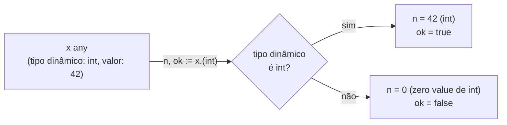
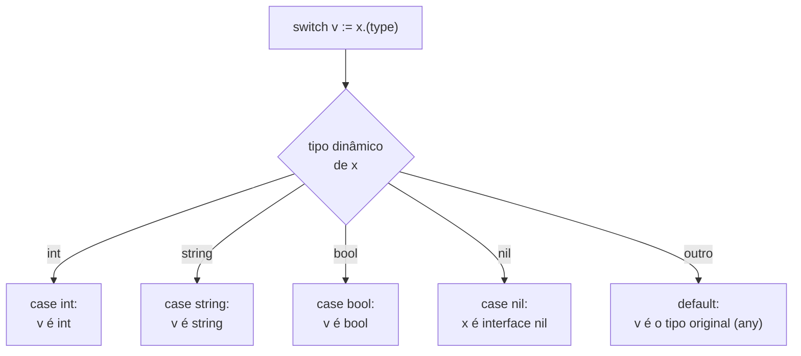

# Type assertions e type switch

> [!abstract] TL;DR
> Uma variável de interface guarda dois pedaços de informação por baixo: um **tipo concreto** e um **valor**. `x.(T)` é a **type assertion** — a pergunta "o valor dinâmico guardado em `x` é do tipo `T`?" — que devolve esse valor concreto de volta, já com o tipo `T` em vez do tipo de interface genérico. Na forma de um resultado só, `v := x.(T)`, uma resposta errada **entra em pânico**; na forma comma-ok, `v, ok := x.(T)`, uma resposta errada só zera `ok` para `false`, sem quebrar o programa. Quando é preciso testar vários tipos possíveis em sequência, `switch v := x.(type) { case A: ... case B: ... }` é a forma idiomática — um `switch` especial que já embute a checagem e a atribuição, sem repetir `x.(T)` caso a caso. Ambos os mecanismos existem para uma única finalidade: recuperar o tipo concreto que está escondido atrás de uma interface, seja `any` (nota 02) ou uma interface menor e mais específica.

## O problema: a interface esconde o tipo, mas o valor continua lá

A nota anterior mostrou que `any` aceita qualquer valor — mas guardar um valor dentro de `any` não faz o tipo concreto desaparecer. Ele só fica temporariamente inacessível pela API da interface:

```go
func processar(x any) {
    fmt.Println(x) // funciona pra qualquer x, mas não dá pra somar, indexar, chamar método específico
}
```

Dentro de `processar`, `x` é uma variável do tipo `any`. Se o valor real passado foi `42` (um `int`), você não pode escrever `x + 1` — o compilador só enxerga a interface `any`, que não promete nenhuma operação aritmética. É a mesma situação de receber uma carta lacrada: você sabe que tem conteúdo lá dentro, mas a interface (o envelope) não deixa ler o que é sem abrir.

Go guarda, dentro de toda variável de interface não-nil, um par `(tipo dinâmico, valor dinâmico)`. `any` é só o caso em que esse par pode ser qualquer coisa. **Type assertion** é a operação de abrir o envelope e perguntar: "esse conteúdo é do tipo que eu espero?" — e, se for, devolvê-lo já com esse tipo concreto, pronto para usar normalmente.



## A forma de um resultado só: risco de pânico

A forma mais direta de type assertion devolve só o valor:

```go
var x any = "olá"

s := x.(string) // ok — x guarda um string
fmt.Println(s, len(s))
```

`x.(string)` afirma, sem rede de segurança, que o tipo dinâmico de `x` é `string`. Se a afirmação estiver certa, `s` recebe o valor já como `string` — pode chamar `len(s)`, fazer `s + "!"`, tudo que um `string` normal permite. Mas se a afirmação estiver **errada**:

```go
var x any = "olá"

n := x.(int) // panic: interface conversion: interface {} is string, not int
```

O programa entra em pânico e, sem `recover`, encerra com um stack trace. Essa forma só é segura quando você tem **certeza absoluta** do tipo — normalmente porque acabou de colocar o valor lá você mesmo, ou porque um contrato externo (um protocolo, um formato de arquivo) garante o tipo. Fora desses casos, ela é uma arma carregada apontada para o próprio pé.

## A forma comma-ok: a versão segura

Trocar `s := x.(T)` por `s, ok := x.(T)` muda o comportamento por completo: em vez de panicar quando a afirmação falha, `ok` simplesmente vira `false`, e a variável recebe o **zero value** do tipo `T`.

```go
var x any = "olá"

s, ok := x.(string)
fmt.Println(s, ok) // olá true

n, ok := x.(int)
fmt.Println(n, ok) // 0 false — sem panic, n é o zero value de int
```

É exatamente o mesmo padrão de `v, ok := mapa[chave]` para mapas, ou `n, err := strconv.Atoi(s)` para conversões que podem falhar: Go prefere expor a possibilidade de erro como um segundo valor de retorno explícito, em vez de exceções escondidas no fluxo de controle. Sempre que o tipo dinâmico não é conhecido com certeza — a resposta veio de JSON decodificado, de um `map[string]any`, de uma função de terceiros — a forma comma-ok é a escolha padrão:

```go
func extrairNome(dados map[string]any) string {
    if nome, ok := dados["nome"].(string); ok {
        return nome
    }
    return "desconhecido"
}
```

> [!warning] `x.(T)` sem comma-ok em código que recebe dado externo é bug esperando pra acontecer
> A forma de resultado único é tentadora porque é mais curta de escrever — mas qualquer entrada não controlada por você (JSON, argumentos de função pública, resultado de parsing) pode, um dia, não bater com o tipo esperado. Nesses casos, `x.(T)` sem `ok` transforma um dado malformado em um `panic` de produção. A regra prática: use a forma de um resultado só apenas quando a falha da asserção seria, ela mesma, sinal de um bug no seu próprio código — não uma condição de dado externo esperável.

## Type switch: testando vários tipos em sequência

Quando é preciso decidir entre três, quatro, cinco tipos possíveis, encadear `if _, ok := x.(A); ok { ... } else if _, ok := x.(B); ok { ... }` fica repetitivo rápido. Go tem uma forma de `switch` dedicada a isso — o **type switch**:

```go
func descrever(x any) string {
    switch v := x.(type) {
    case int:
        return fmt.Sprintf("int: %d", v)
    case string:
        return fmt.Sprintf("string: %q", v)
    case bool:
        return fmt.Sprintf("bool: %t", v)
    case nil:
        return "nil"
    default:
        return fmt.Sprintf("tipo não tratado: %T", v)
    }
}
```

A sintaxe `switch v := x.(type)` é reconhecida pelo compilador como uma construção especial — `.(type)` só é válido literalmente dentro da cláusula de um `switch`, nunca fora dela. Em cada `case`, `v` já vem com o tipo daquele `case` específico: dentro de `case int:`, `v` é `int`; dentro de `case string:`, `v` é `string`. Não é preciso repetir `x.(int)` dentro do corpo — o `switch` já fez a conversão para você.



Repare no `case nil:` — testar se a própria interface é `nil` (nenhum valor foi guardado nela) é um `case` válido e diferente de qualquer tipo concreto. E note o `default`: se nenhum `case` bater, `v` continua com o tipo original de `x` (aqui, `any`) — é o único ramo em que `v` não vem "promovido" a um tipo mais específico.

> [!info] Um `case` pode listar vários tipos juntos
> `case int, int64, float64:` é válido — mas quando um `case` lista mais de um tipo, `v` dentro dele mantém o tipo original da expressão (`any`, no exemplo acima), porque o compilador não tem como saber qual dos tipos listados bateu. Só `case`s com um único tipo promovem `v` para aquele tipo exato.

## Recuperando o tipo concreto por baixo de uma interface menor

Tudo até aqui usou `any` como ponto de partida, mas type assertion e type switch funcionam sobre **qualquer** valor de interface — inclusive interfaces pequenas e específicas, não só `any`. É o caso mais comum na prática: uma função recebe um parâmetro de interface pequena (nota 05 do galho entra nisso a fundo) e, dentro dela, verifica se o valor concreto também satisfaz uma interface *extra*, mais rica:

```go
type Notificador interface {
    Notificar(msg string) error
}

type NotificadorComPrioridade interface {
    Notificador
    NotificarComPrioridade(msg string, prioridade int) error
}

func enviar(n Notificador, msg string) error {
    if np, ok := n.(NotificadorComPrioridade); ok {
        return np.NotificarComPrioridade(msg, 5)
    }
    return n.Notificar(msg)
}
```

`n` chega como `Notificador` — a função só promete usar o método `Notificar`. Mas `n.(NotificadorComPrioridade)` pergunta: "o tipo concreto por trás de `n` também satisfaz essa interface mais rica?" Se satisfizer, `enviar` aproveita o recurso extra; se não, cai no caminho padrão. Esse é exatamente o mecanismo por trás de interfaces opcionais na biblioteca padrão — `io.Copy`, por exemplo, faz uma asserção parecida internamente para verificar se a fonte satisfaz `io.WriterTo` antes de recorrer ao caminho genérico de cópia byte a byte.

## Casos práticos

**1. Decodificando JSON genérico** — `encoding/json` decodifica em `map[string]any` quando a estrutura não é conhecida de antemão, e números sempre viram `float64`:

```go
package main

import (
    "encoding/json"
    "fmt"
)

func main() {
    var dados map[string]any
    raw := []byte(`{"nome": "Ana", "idade": 30, "ativo": true}`)
    json.Unmarshal(raw, &dados)

    for chave, valor := range dados {
        switch v := valor.(type) {
        case string:
            fmt.Printf("%s: string %q\n", chave, v)
        case float64: // json.Unmarshal sempre usa float64 para números
            fmt.Printf("%s: número %.0f\n", chave, v)
        case bool:
            fmt.Printf("%s: bool %t\n", chave, v)
        default:
            fmt.Printf("%s: tipo inesperado %T\n", chave, v)
        }
    }
}
```

**2. Comma-ok evitando pânico numa cadeia de conversões:**

```go
func idadeComoInt(dados map[string]any) (int, bool) {
    v, ok := dados["idade"].(float64)
    if !ok {
        return 0, false
    }
    return int(v), true
}
```

**3. Type switch tratando o zero-value nulo de erros customizados** (útil ao inspecionar erros — a fundo no galho 4, mas o mecanismo de assertion é o mesmo):

```go
type ErroValidacao struct {
    Campo string
}

func (e *ErroValidacao) Error() string {
    return fmt.Sprintf("campo inválido: %s", e.Campo)
}

func tratar(err error) {
    switch e := err.(type) {
    case *ErroValidacao:
        fmt.Println("corrija o campo:", e.Campo)
    case nil:
        fmt.Println("sem erro")
    default:
        fmt.Println("erro genérico:", e)
    }
}
```

## Armadilhas comuns

> [!warning] `x.(T)` sem `ok` em código que não controla a entrada é panic esperando a hora certa
> Já dito acima, mas vale reforçar como armadilha isolada: em handlers HTTP, parsers, e qualquer fronteira que recebe `any` de fora do seu controle direto, a forma de resultado único transforma dado malformado em crash. Prefira sempre comma-ok nessas fronteiras.

> [!warning] `nil` dentro de uma interface não-nil não bate com `case nil:`
> Uma interface só é `== nil` quando **tanto** o tipo dinâmico **quanto** o valor dinâmico são nil. Se você guarda um ponteiro nil de tipo concreto dentro de uma interface (`var p *MeuTipo; var i any = p`), `i` não é `nil` — tem tipo dinâmico `*MeuTipo` e valor nil. Um type switch com `case nil:` não vai capturar esse caso; ele cai no `case *MeuTipo:`, se existir, com `v` sendo um ponteiro nil. Essa armadilha específica — o *typed-nil* — é grande o bastante para merecer nota própria: [[07 - O nil interface e o typed-nil]].

> [!warning] Type switch não substitui interface bem desenhada
> Encadear `case A: ... case B: ... case C: ...` para decidir o comportamento por tipo concreto é código válido, mas é um cheiro quando a lista de `case`s cresce e se repete em vários lugares do programa. Nesses casos, o problema geralmente é uma interface faltando — cada tipo deveria ter seu próprio método, e o `switch` deveria desaparecer, substituído por polimorfismo comum via method set. Type switch brilha quando os tipos possíveis são poucos, fixos, e vêm de fora do seu controle (parsing, decodificação) — não como substituto geral de interfaces bem desenhadas.

## Vindo de outra stack

| Linguagem | Mecanismo equivalente | Diferença chave |
|---|---|---|
| Java | `instanceof` + cast, ou `switch` com *pattern matching* (Java 21+) | Java lança `ClassCastException` num cast direto sem checagem prévia; Go tem a forma comma-ok embutida na mesma sintaxe, sem precisar de dois passos |
| Python | `isinstance(x, T)` | Python não "converte" o valor — o objeto já carrega seu próprio tipo; não há zero value envolvido em caso de falha |
| TypeScript | *type guards* (`typeof`, `instanceof`, *user-defined type guards*) | TypeScript apaga tipos em tempo de execução (checagem só em compile-time); Go carrega o tipo dinâmico de fato em runtime, então a asserção é uma checagem real, não só uma dica pro compilador |

## Como explicar em inglês

> A **type assertion**, `x.(T)`, asks whether the dynamic type stored inside an interface value `x` is `T`, and if so, hands back the underlying value with that concrete type. The single-result form panics on a mismatch — `interface conversion: interface {} is string, not int` — so it's only safe when you're certain of the type. The two-result **comma-ok** form, `v, ok := x.(T)`, is the safe default: on a mismatch, `ok` is simply `false` and `v` gets `T`'s zero value, no panic. When there are several possible types to branch on, a **type switch** — `switch v := x.(type) { case int: ... case string: ... }` — is the idiomatic form: each single-type `case` already gives you `v` promoted to that type, no repeated assertions needed. Both mechanisms exist for the same purpose: recovering the concrete type hiding behind an interface value, whether that interface is `any` or a small, purpose-built one.

| Termo PT | Termo EN |
|---|---|
| asserção de tipo | type assertion |
| forma comma-ok | comma-ok form / two-result form |
| switch de tipo | type switch |
| tipo dinâmico | dynamic type |
| valor dinâmico | dynamic value |
| zero value | zero value |
| entrar em pânico | to panic |
| interface nula / nil | nil interface |
| ponteiro nulo tipado | typed nil |

## O que vem a seguir

Type assertion e type switch resolvem o problema de *recuperar* um tipo concreto quando você já tem uma interface genérica em mãos — mas a pergunta anterior, mais importante no design de uma API, é: **por que a função aceitou uma interface genérica em primeiro lugar?** A [[04 - Accept interfaces, return structs|nota 04]] entra na convenção idiomática que evita, na maioria dos casos, a necessidade de fazer qualquer asserção: funções que aceitam a interface mais pequena que precisam e devolvem o tipo concreto mais específico que têm — deixando type assertion como ferramenta de exceção, não de rotina.

## Veja também

- [[01 - Interfaces implícitas e satisfação estrutural]] — satisfação implícita, base para entender o que uma type assertion está checando
- [[02 - O empty interface e any]] — `any`, o caso mais comum de onde type assertions partem
- [[04 - Accept interfaces, return structs]] — próxima nota do galho
- [[07 - O nil interface e o typed-nil]] — a armadilha do ponteiro nil tipado, aprofundada
- [[03-Dominios/Tecnologia/Go/index|Trilha Go]]

## Fontes

- The Go Authors. *A Tour of Go — Type assertions*. go.dev. https://go.dev/tour/methods/15 (acessado em 2026-07-18)
- The Go Authors. *A Tour of Go — Type switches*. go.dev. https://go.dev/tour/methods/16 (acessado em 2026-07-18)
- The Go Authors. *The Go Programming Language Specification — Type assertions*. go.dev. https://go.dev/ref/spec#Type_assertions (acessado em 2026-07-18)
- The Go Authors. *The Go Programming Language Specification — Type switches*. go.dev. https://go.dev/ref/spec#Type_switches (acessado em 2026-07-18)
- Go by Example. *Type Assertions*. gobyexample.com. https://gobyexample.com/interfaces (acessado em 2026-07-18)
- Go by Example. *Type Switches*. gobyexample.com. https://gobyexample.com/switch (acessado em 2026-07-18)
