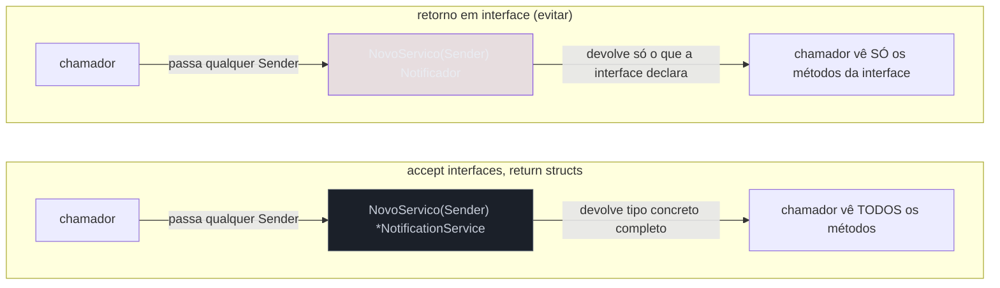
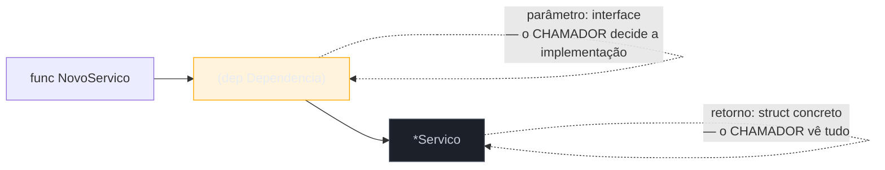

# Accept interfaces, return structs

> [!abstract] TL;DR
> Um idioma central de Go, quase um mantra: **funções recebem interfaces como parâmetro, mas retornam tipos concretos** (structs, ponteiros para struct). Receber interface dá ao *chamador* liberdade de passar qualquer implementação — real, fake, mock — sem que a função precise saber qual. Retornar interface faz o oposto: esconde do *chamador* o que ele recebeu, tira a chance de ele usar campos e métodos extras do tipo concreto, e — pior — obriga quem escreve a função a decidir de antemão toda operação que o consumidor algum dia vai precisar. A assinatura idiomática é `func NovoServico(dep Dependencia) *Servico`: parâmetro genérico, retorno específico. A regra tem exceções documentadas (erros, iteradores, `io.Reader` de volta) — mas o padrão default é este, e ele é a base de por que Go favorece interfaces pequenas.

## O cenário que expõe o problema

Imagine que você está escrevendo um serviço de notificação. Ele precisa enviar mensagens — por enquanto, por e-mail. Escreve isso, sem pensar muito em abstração:

```go
type EmailSender struct {
    smtpHost string
}

func (e *EmailSender) Send(destino, msg string) error {
    // ... conecta no SMTP e envia
    return nil
}

type NotificationService struct {
    sender *EmailSender
}

func NovoServico(host string) *NotificationService {
    return &NotificationService{sender: &EmailSender{smtpHost: host}}
}

func (n *NotificationService) Notificar(destino, msg string) error {
    return n.sender.Send(destino, msg)
}
```

Funciona. Mas seis meses depois alguém pede notificação por SMS também. `NotificationService.sender` está amarrado a `*EmailSender` — trocar ou adicionar um segundo canal significa reescrever o struct, o construtor, e todo teste que hoje monta um `NotificationService` real batendo num SMTP de verdade (ou mockado com muito esforço, porque `*EmailSender` é um tipo concreto, sem ponto de substituição).

O problema não é o `EmailSender` em si — é que `NotificationService` **depende do tipo concreto**, não de "algo que sabe enviar mensagem". A correção é pequena, mas muda a forma como a API inteira se comporta:

```go
type Sender interface {
    Send(destino, msg string) error
}

type NotificationService struct {
    sender Sender
}

func NovoServico(sender Sender) *NotificationService {
    return &NotificationService{sender: sender}
}
```

`NovoServico` agora **aceita uma interface** — qualquer coisa com `Send(string, string) error` serve, seja `*EmailSender`, um futuro `*SMSSender`, ou um `MockSender` de teste que só grava chamadas numa slice. E `NovoServico` continua **retornando um tipo concreto**, `*NotificationService` — não `interface{ Notificar(...) error }`. Essa combinação — parâmetro abstrato, retorno concreto — é o idioma que dá nome a esta nota.

## Por que não simetria? Retornar interface parece "mais consistente"

A tentação de quem vem de linguagens com programação por contrato mais formal (Java com suas interfaces explícitas, C# com suas *abstractions*) é achar que, se aceitar interface é bom, retornar interface deveria ser igualmente bom — simetria arquitetural. Go rejeita essa simetria, e a razão fica clara olhando o que o chamador perde:

```go
func NovoServico(sender Sender) Notificador { // retorno interface — o que evitar
    return &NotificationService{sender: sender}
}
```

Se `NovoServico` devolve `Notificador` (uma interface), o chamador só enxerga os métodos que `Notificador` declarou — nada mais. Se `*NotificationService` mais tarde ganhar um método `Historico() []string` para inspecionar notificações já enviadas, ninguém que recebeu o valor como `Notificador` consegue chamá-lo sem um type assertion manual (`svc.(*NotificationService)`) — e essa conversão é exatamente o tipo de código frágil que a nota anterior avisou para tratar com cautela. A interface no retorno virou uma **parede** entre o chamador e a implementação real, sem necessidade nenhuma: o chamador não pediu essa parede, foi imposta.



Há um segundo custo, mais sutil: retornar interface obriga quem *escreve* a função a **adivinhar de antemão** toda operação que qualquer consumidor futuro vai precisar, e cravar isso na interface de retorno. Se a previsão falhar — e ela falha, porque requisitos mudam — a correção exige alterar a assinatura pública da interface, o que é uma mudança *breaking* para todo mundo que já depende dela. Retornar o struct concreto adia essa decisão: o consumidor pega o tipo completo e decide sozinho, no seu próprio código, que subconjunto de comportamento ele quer tratar como abstrato (declarando a própria interface local — assunto da [[03-Dominios/Tecnologia/Go/03 - Interfaces e composição/08 - Design idiomático de interfaces|nota 08]]).

> [!question]- Retornar interface é sempre errado, então?
> Não — é o *default*, não uma lei física. Casos legítimos existem: uma função que constrói um `io.Reader` a partir de fontes diferentes (`strings.NewReader` retorna `*strings.Reader`, mas outras funções da stdlib retornam `io.Reader` puro quando o tipo concreto varia de verdade e não tem por que existir publicamente); construtores de erro (`errors.New` retorna `error`, uma interface, porque não há tipo concreto útil para o chamador enxergar); e iteradores no estilo `range-over-func` do Go 1.23. A regra prática do [Go wiki](https://go.dev/wiki/CodeReviewComments#interfaces): retorne interface quando o **tipo concreto realmente pode variar por decisão de quem escreve a função**, e o chamador nunca deveria depender de qual variante voltou — não como economia de digitação ou "boa prática" genérica.

## Anatomia da assinatura idiomática



A leitura de uma assinatura como `func NovoServico(dep Dependencia) *Servico` já entrega, sem olhar o corpo, o contrato inteiro: "esta função aceita qualquer coisa que satisfaça `Dependencia`, e devolve um `*Servico` de verdade, com todos os seus métodos disponíveis". Compare com a assinatura equivalente em Java, onde a convenção do "programe para interfaces" empurra para o outro lado:

```java
// Java — convenção comum: retorno também em interface
public interface Notificador {
    void notificar(String destino, String msg);
}

public Notificador criarServico(Sender sender) {
    return new NotificationServiceImpl(sender);
}
```

Em Java, esconder o tipo concreto de retorno atrás de uma interface é reforçado por padrões como *Factory* e por frameworks de DI que injetam por tipo de interface. Go não tem esse reforço cultural — a comunidade converge para o oposto, e a razão de fundo é a mesma que motivou interfaces implícitas na [[03-Dominios/Tecnologia/Go/03 - Interfaces e composição/01 - Interfaces implícitas e satisfação estrutural|nota 01]]: em Go, quem **consome** um valor é quem decide quanta abstração precisa, não quem o produz.

## Casos práticos

**1. Construtor que aceita `io.Writer`, retorna struct concreto** — o padrão mais comum na stdlib e em código idiomático:

```go
package logger

import (
    "fmt"
    "io"
)

type Logger struct {
    saida  io.Writer
    prefix string
}

// Aceita io.Writer (interface) — qualquer destino serve:
// os.Stdout, um *bytes.Buffer em teste, um arquivo, uma conexão de rede.
func NovoLogger(saida io.Writer, prefix string) *Logger {
    return &Logger{saida: saida, prefix: prefix}
}

func (l *Logger) Info(msg string) {
    fmt.Fprintf(l.saida, "[%s] INFO: %s\n", l.prefix, msg)
}
```

Testar isso não exige mock nenhum de biblioteca externa — `bytes.Buffer` já satisfaz `io.Writer`:

```go
func TestLoggerInfo(t *testing.T) {
    var buf bytes.Buffer
    log := NovoLogger(&buf, "app")

    log.Info("iniciado")

    if !strings.Contains(buf.String(), "iniciado") {
        t.Errorf("esperava mensagem no buffer, got %q", buf.String())
    }
}
```

**2. Dependência trocável via interface pequena, retorno concreto com método extra**, retomando o `NotificationService`:

```go
type Sender interface {
    Send(destino, msg string) error
}

type NotificationService struct {
    sender    Sender
    enviados  int
}

func NovoServico(sender Sender) *NotificationService {
    return &NotificationService{sender: sender}
}

func (n *NotificationService) Notificar(destino, msg string) error {
    if err := n.sender.Send(destino, msg); err != nil {
        return fmt.Errorf("notificar %s: %w", destino, err)
    }
    n.enviados++
    return nil
}

// Método que só existe no tipo concreto — inacessível se NovoServico
// tivesse retornado uma interface no lugar de *NotificationService.
func (n *NotificationService) TotalEnviados() int {
    return n.enviados
}
```

Quem chama `NovoServico` recebe `*NotificationService` de verdade — `TotalEnviados()` está ali, sem type assertion, porque o retorno nunca escondeu o tipo:

```go
svc := NovoServico(&EmailSender{smtpHost: "smtp.exemplo.com"})
svc.Notificar("ana@exemplo.com", "bem-vinda")
svc.Notificar("bob@exemplo.com", "bem-vindo")
fmt.Println(svc.TotalEnviados()) // 2
```

**3. Fake de teste satisfazendo a mesma interface**, sem framework de mock nenhum:

```go
type SenderFake struct {
    Chamadas []string
}

func (s *SenderFake) Send(destino, msg string) error {
    s.Chamadas = append(s.Chamadas, destino+": "+msg)
    return nil
}

func TestNotificar(t *testing.T) {
    fake := &SenderFake{}
    svc := NovoServico(fake) // mesmo construtor, dependência trocada

    svc.Notificar("carla@exemplo.com", "oi")

    if len(fake.Chamadas) != 1 {
        t.Fatalf("esperava 1 chamada, got %d", len(fake.Chamadas))
    }
}
```

Nada disso precisaria de biblioteca de mocking, geração de código, ou anotação — `SenderFake` satisfaz `Sender` estruturalmente (assunto da [[03-Dominios/Tecnologia/Go/03 - Interfaces e composição/01 - Interfaces implícitas e satisfação estrutural|nota 01]]), e o construtor idiomático `func NovoServico(sender Sender) *NotificationService` já foi projetado, desde o parâmetro, para aceitar essa troca.

> [!info] `slices` e `maps` (Go 1.21+) seguem o mesmo idioma
> Funções como `slices.Sort` recebem `[]E` (um slice concreto, não uma interface — slices não são interface) e funções que aceitam algo iterável tendem a pedir `func(E) bool` ou tipos concretos específicos, não uma interface genérica de "coleção". A regra "accept interfaces" não significa "toda entrada deveria ser interface" — significa: use interface **onde variação de implementação é o ponto real**, como em `io.Writer`. Onde não há variação a abstrair, tipo concreto é mais simples e mais rápido (sem indireção de interface, sem alocação em heap por causa de conversão).

## Armadilhas comuns

> [!warning] Interface enorme no parâmetro anula o benefício
> `func NovoServico(dep DependenciaComVinteMetodos) *Servico` não dá liberdade real ao chamador — poucas implementações vão satisfazer vinte métodos por acidente, e cada fake de teste precisa implementar todos, mesmo os que o `Servico` nunca chama. O idioma "accept interfaces" rende o máximo quando combinado com **interfaces pequenas**, ideal 1-3 métodos — assunto direto da [[03-Dominios/Tecnologia/Go/03 - Interfaces e composição/05 - Interfaces pequenas — io.Reader e io.Writer|próxima nota]].

> [!warning] Retornar interface "para não vazar detalhe de implementação" costuma vazar mais, não menos
> A intuição de esconder o tipo concreto por retorno de interface, achando que isso é "encapsulamento", tem o efeito oposto do pretendido: força o pacote a manter uma interface pública sincronizada com tudo que o consumidor pode precisar, e qualquer método novo no tipo concreto fica inacessível até alguém lembrar de adicioná-lo à interface de retorno também. Retornar o struct (ou `*struct`) é, paradoxalmente, menos acoplamento a manter — o pacote consumidor decide sozinho, com sua própria interface local, o que quer tratar como abstrato.

> [!warning] Não confundir "aceitar interface" com "aceitar `interface{}`/`any`"
> `func Processar(v any)` não é o idioma desta nota — é o oposto: perde toda informação de tipo em troca de flexibilidade máxima, e devolve o problema para type assertions dentro da função (assunto da [[03-Dominios/Tecnologia/Go/03 - Interfaces e composição/02 - O empty interface e any|nota 02]]). O idioma "accept interfaces" pede uma interface **com método(s) definidos** — `Sender`, `io.Writer`, `fmt.Stringer` — não o empty interface disfarçado de flexibilidade.

## Vindo de outras linguagens

| Linguagem | Convenção comum | Diferença do idioma Go |
|---|---|---|
| Java | "Program to an interface, not an implementation" — geralmente aplicado a parâmetro **e** retorno | Go aplica só ao parâmetro; retorno idiomático é o tipo concreto |
| C# | Interfaces em toda camada de serviço + DI container resolvendo por tipo de interface | Go não tem DI container padrão; a "injeção" é passar o valor concreto direto no construtor |
| Python | Duck typing dispensa interface explícita em qualquer direção — nem parâmetro nem retorno costumam declarar um "contrato" formal | Go formaliza a interface no parâmetro (compilador verifica), mas mantém o retorno concreto — meio-termo entre disciplina estática e flexibilidade |
| TypeScript | `interface`/`type` costumam anotar tanto entrada quanto saída de funções em código de biblioteca | Go evita anotar a saída com abstração, salvo os casos documentados (erro, `io.Reader` variável) |

## Como explicar em inglês

> Go's idiom is "accept interfaces, return structs": function parameters should be interfaces — giving the caller freedom to pass any implementation, including test fakes — while return values should be concrete types, usually a pointer to struct. Returning an interface hides the concrete type's full method set from the caller and forces the author to predict every operation a future consumer might need, baking that guess into a public contract that's expensive to change later. The convention is a default, not an absolute: functions like `errors.New` legitimately return an interface (`error`) because the concrete type genuinely varies and callers never need to see it. Applied consistently, this idiom is what makes small, locally-declared interfaces — rather than large upfront service interfaces — the natural unit of abstraction in Go.

| Termo PT | Termo EN |
|---|---|
| aceitar interfaces, retornar structs | accept interfaces, return structs |
| tipo concreto | concrete type |
| interface de retorno | return interface |
| esconder o tipo concreto | hide the concrete type |
| fake de teste | test fake / test double |
| acoplamento | coupling |
| contrato público | public contract |

## O que vem a seguir

Este idioma só funde bem quando a interface aceita como parâmetro é **pequena** — o exemplo usou `Sender` com um único método e `io.Writer`, também com um único método, de propósito. A [[05 - Interfaces pequenas — io.Reader e io.Writer|próxima nota]] mergulha nas duas interfaces mais reutilizadas da stdlib, `io.Reader` e `io.Writer`, para mostrar por que "menor é melhor" não é só estética — é o que torna qualquer tipo, de qualquer pacote, imediatamente compatível com toda a árvore de composição de I/O da linguagem.

## Veja também

- [[01 - Interfaces implícitas e satisfação estrutural]] — por que um `SenderFake` sem `implements` já satisfaz `Sender`
- [[02 - O empty interface e any]] — o contraste com `any`, que este idioma explicitamente evita como parâmetro
- [[05 - Interfaces pequenas — io.Reader e io.Writer]] — próxima nota do galho
- [[08 - Design idiomático de interfaces]] — quando e como o consumidor declara sua própria interface local
- [[03-Dominios/Tecnologia/Go/index|Trilha Go]]

## Fontes

- The Go Authors. *Go Code Review Comments — Interfaces*. go.dev/wiki. https://go.dev/wiki/CodeReviewComments#interfaces (acessado em 2026-07-18)
- The Go Authors. *Effective Go — Interfaces and other types*. go.dev. https://go.dev/doc/effective_go#interfaces_and_types (acessado em 2026-07-18)
- The Go Authors. *Package io*. pkg.go.dev. https://pkg.go.dev/io (acessado em 2026-07-18)
- The Go Blog. *Errors are values*. go.dev/blog. https://go.dev/blog/errors-are-values (acessado em 2026-07-18)
- Go by Example. *Interfaces*. gobyexample.com. https://gobyexample.com/interfaces (acessado em 2026-07-18)
