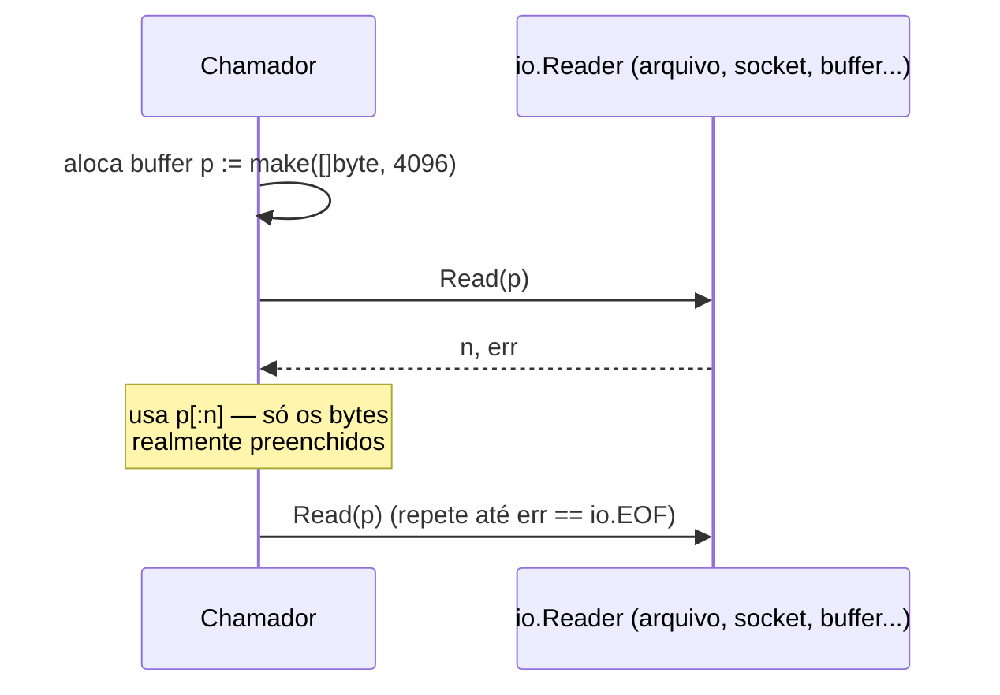
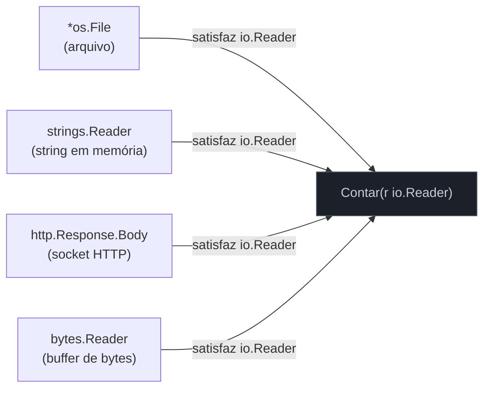

# Interfaces pequenas — io.Reader e io.Writer

> [!abstract] TL;DR
> A biblioteca padrão de Go inteira gira em torno de duas interfaces de **um método cada**: `io.Reader` (`Read(p []byte) (n int, err error)`) e `io.Writer` (`Write(p []byte) (n int, err error)`). Qualquer coisa que lê ou escreve bytes — arquivo, socket TCP, buffer em memória, corpo de requisição HTTP, `stdin`/`stdout`, um `gzip.Writer` — implementa uma dessas duas. É esse tamanho mínimo que permite compor peças que nunca foram desenhadas juntas: um `io.Reader` de arquivo passa direto para `gzip.NewReader`, que passa direto para `json.NewDecoder`, sem nenhuma delas saber da existência das outras. A frase que resume a filosofia, do próprio Rob Pike: **"the bigger the interface, the weaker the abstraction"** — quanto mais métodos uma interface exige, menos coisas conseguem satisfazê-la, e menos ela serve como ponto de encaixe universal.

## O problema que uma interface grande cria

Imagine que você está desenhando uma função que processa dados vindos de "algum lugar" — pode ser um arquivo, pode ser a resposta de uma chamada HTTP, pode ser um teste passando dados fake. Em várias linguagens, o instinto é modelar isso com uma interface rica: `DataSource` com `Open()`, `Read()`, `Close()`, `Seek()`, `Size()`, `Name()` — tudo que "uma fonte de dados" plausivelmente poderia precisar.

O problema aparece na hora de *implementar* essa interface para algo que só sabe fazer uma parte disso. Um socket de rede não tem `Seek` — dados de um stream TCP não voltam atrás. Um buffer em memória não tem `Name`. Para satisfazer `DataSource`, cada um desses tipos precisa de métodos stub que não fazem sentido — `Seek` que retorna erro sempre, `Name` que devolve string vazia — só para preencher a assinatura. A interface virou um contrato que **quase ninguém consegue cumprir de verdade**, e as poucas implementações completas ficam artificialmente infladas.

Go foi na direção oposta desde o design da biblioteca padrão. Em vez de uma interface `DataSource` monolítica, existem várias interfaces de um método, e cada tipo implementa exatamente as que ele consegue cumprir honestamente:

```go
type Reader interface {
    Read(p []byte) (n int, err error)
}

type Writer interface {
    Write(p []byte) (n int, err error)
}

type Closer interface {
    Close() error
}

type Seeker interface {
    Seek(offset int64, whence int) (int64, error)
}
```

Essas quatro — definidas em `io` — são o vocabulário mínimo de "coisas que movem bytes". Um socket TCP satisfaz `Reader`, `Writer` e `Closer`, mas não `Seeker` — e isso é honesto, porque sockets de fato não fazem seek. Um `*os.File` satisfaz as quatro, porque arquivos permitem tudo isso. Um `strings.Reader` (buffer de string em memória) satisfaz `Reader` e `Seeker`, mas não `Writer`, porque é somente-leitura por natureza. Nenhum desses tipos precisa de método stub nenhum — cada um declara, via satisfação implícita (retomando a [[01 - Interfaces implícitas e satisfação estrutural|nota 01]]), exatamente o que sabe fazer.

## Read e Write: a assinatura que resiste a testes

A assinatura de `Read` parece estranha na primeira leitura — por que não `Read() []byte`, devolvendo os bytes lidos direto?

```go
Read(p []byte) (n int, err error)
```

O chamador passa um buffer `p` já alocado, e `Read` **preenche esse buffer**, devolvendo quantos bytes escreveu nele (`n`) e um erro, se houver. A vantagem é controle de alocação: quem chama decide o tamanho do buffer — 4KB, 64KB, o tamanho que fizer sentido para o caso de uso — em vez de forçar `Read` a alocar um `[]byte` novo a cada chamada. Para ler um arquivo de 2GB, isso é a diferença entre processar em pedaços de tamanho fixo e tentar alocar 2GB de uma vez.

`Write` espelha exatamente essa forma:

```go
Write(p []byte) (n int, err error)
```

Aqui `p` já contém os bytes a escrever; `Write` devolve quantos de fato conseguiu escrever (`n`) e um erro se `n < len(p)`. A [documentação oficial](https://pkg.go.dev/io#Writer) é explícita sobre essa regra: implementações "devem retornar um erro não-nil se retornarem `n < len(p)`" — não é permitido escrever menos da metade do buffer e devolver erro nulo como se estivesse tudo bem.



Repare que nem `Reader` nem `Writer` mencionam de onde os bytes vêm ou para onde vão. É exatamente essa ausência de detalhe que os torna universais — a interface não sabe, e não precisa saber, se do outro lado tem um arquivo, uma conexão de rede, um buffer de teste ou `/dev/null`.

## Por que interfaces pequenas compõem melhor

A cultura de interfaces mínimas não é só estética — ela viabiliza um estilo de composição que interfaces grandes tornam impraticável. A ideia central: uma função que só precisa **ler** bytes deveria pedir um `io.Reader`, não um `*os.File` — porque `io.Reader` é satisfeito por qualquer coisa que produz bytes, enquanto `*os.File` amarra o chamador a um arquivo real do disco.

```go
func Contar(r io.Reader) (int, error) {
    total := 0
    buf := make([]byte, 4096)
    for {
        n, err := r.Read(buf)
        total += n
        if err == io.EOF {
            return total, nil
        }
        if err != nil {
            return total, err
        }
    }
}
```

Essa função `Contar` funciona, sem alteração nenhuma, para:

```go
f, _ := os.Open("dados.txt")
Contar(f) // arquivo real

Contar(strings.NewReader("olá mundo")) // string em memória, útil em teste

resp, _ := http.Get("https://exemplo.com/dados")
Contar(resp.Body) // corpo de resposta HTTP

Contar(bytes.NewReader(dadosComprimidos)) // buffer de bytes
```

Nenhuma dessas quatro chamadas exigiu adaptar `Contar`. Isso é a definição prática de "a interface pequena compõe melhor": porque o contrato é mínimo, o **conjunto de coisas que o satisfazem** é enorme — e qualquer uma delas encaixa no mesmo ponto de entrada. Se `Contar` tivesse pedido `*os.File` diretamente, testar com uma string exigiria escrever um arquivo temporário em disco a cada teste — lento, e desnecessário.

O mesmo raciocínio se aplica em cadeia. `gzip.NewReader` recebe um `io.Reader` e devolve outro `io.Reader` — descomprimindo os bytes conforme são lidos. `json.NewDecoder` recebe um `io.Reader` e decodifica JSON dele. Nenhuma dessas funções foi escrita pensando na outra, mas todas encaixam porque falam o mesmo protocolo mínimo:

```go
resp, _ := http.Get("https://exemplo.com/dados.json.gz")
defer resp.Body.Close()

gz, _ := gzip.NewReader(resp.Body) // io.Reader → io.Reader
defer gz.Close()

var dados MeuStruct
json.NewDecoder(gz).Decode(&dados) // io.Reader → struct
```

Três pacotes da biblioteca padrão (`net/http`, `compress/gzip`, `encoding/json`) — nenhum importa os outros dois, nenhum sabe da existência dos outros — compostos em três linhas, só porque todos falam `io.Reader`. É essa a composição de que "the bigger the interface, the weaker the abstraction" fala: se `gzip.NewReader` exigisse um tipo concreto de `net/http`, essa cadeia simplesmente não existiria.



## A frase de Rob Pike, e por que ela é literal

A citação que dá nome a esta cultura — "the bigger the interface, the weaker the abstraction" — é de [Rob Pike, no talk "Go Proverbs" (GopherFest 2015)](https://www.youtube.com/watch?v=PAAkCSZUG1c). Não é retórica: é uma consequência direta de como a satisfação implícita funciona.

Uma interface de 1 método tem um universo enorme de tipos que a satisfazem — qualquer coisa que consiga produzir ou consumir bytes de alguma forma. Uma interface de 6 métodos reduz drasticamente esse universo: só tipos que implementam *todos os 6* satisfazem. Cada método adicional é uma cláusula `E` a mais no contrato — e cada `E` elimina candidatos. Levado ao extremo, uma interface com métodos suficientes acaba tendo exatamente **um** implementador de fato útil — nesse ponto, a interface parou de abstrair coisa nenhuma; virou um nome alternativo pra um tipo concreto específico, sem nenhum dos benefícios de polimorfismo que motivaram criá-la.

> [!question]- Isso significa que interfaces grandes são sempre erro de design?
> Não — significa que o **custo** de cada método adicional precisa se justificar. Existem interfaces legítimas maiores, como `sort.Interface` (`Len`, `Less`, `Swap` — 3 métodos) ou `http.Handler` combinado com middlewares que exigem mais. O ponto do provérbio não é "toda interface deve ter 1 método", é: **antes de adicionar um método a uma interface, pergunte se ele é essencial ao contrato ou se pode virar uma interface separada**, composta por embedding quando necessário. `io.ReadWriter` — que combina `Reader` e `Writer` — existe exatamente para isso: quando um caso de uso genuinamente precisa dos dois papéis, compõe duas interfaces pequenas em vez de nascer grande. Embedding de interfaces é o assunto completo da [[06 - Interface embedding|próxima nota]].

## io.Closer e o padrão de composição da stdlib

Um quarto membro completa o quarteto fundamental de `io`: `io.Closer`, com um único método, `Close() error`. Ele libera recursos — fecha o file descriptor, encerra a conexão de socket, libera o buffer. A convenção idiomática em Go é: **se um tipo implementa `Closer`, o chamador é responsável por chamar `Close()`**, tipicamente via `defer` logo após adquirir o recurso:

```go
f, err := os.Open("dados.txt")
if err != nil {
    return err
}
defer f.Close() // garante liberação mesmo se o resto da função retornar erro no meio

// ... usa f como io.Reader normalmente
```

A biblioteca padrão combina esses quatro papéis (`Reader`, `Writer`, `Closer`, `Seeker`) via embedding em interfaces compostas quando um tipo precisa de mais de um: `io.ReadWriter`, `io.ReadCloser`, `io.WriteCloser`, `io.ReadWriteCloser`. `*os.File` satisfaz todas — arquivo é leitura, escrita, fechamento e seek — mas cada função da stdlib pede exatamente o subconjunto que precisa. `http.Response.Body` é do tipo `io.ReadCloser` — dá para ler e precisa ser fechado, mas não dá para escrever nem fazer seek nele, e a assinatura da interface reflete isso com exatidão.

## Casos práticos

**1. Testando sem I/O real**, o benefício mais imediato de aceitar `io.Reader`/`io.Writer` em vez de tipos concretos:

```go
func Processar(w io.Writer, entrada string) error {
    _, err := fmt.Fprintf(w, "processado: %s\n", entrada)
    return err
}

func TestProcessar(t *testing.T) {
    var buf bytes.Buffer // bytes.Buffer satisfaz io.Writer
    err := Processar(&buf, "dados de teste")
    if err != nil {
        t.Fatal(err)
    }
    if buf.String() != "processado: dados de teste\n" {
        t.Errorf("saída inesperada: %q", buf.String())
    }
}
```

Nenhum arquivo temporário, nenhum mock elaborado — `bytes.Buffer` é um `io.Writer` de verdade, em memória, criado e destruído a cada teste.

**2. `io.Copy`, a função utilitária que só existe porque `Reader`/`Writer` são universais:**

```go
resp, err := http.Get("https://exemplo.com/arquivo.zip")
if err != nil {
    log.Fatal(err)
}
defer resp.Body.Close()

f, err := os.Create("arquivo.zip")
if err != nil {
    log.Fatal(err)
}
defer f.Close()

n, err := io.Copy(f, resp.Body) // io.Writer, io.Reader — quaisquer que sejam
if err != nil {
    log.Fatal(err)
}
fmt.Printf("%d bytes copiados\n", n)
```

`io.Copy(dst io.Writer, src io.Reader)` não sabe nem precisa saber que `dst` é um arquivo e `src` é um corpo de resposta HTTP — funcionaria idêntico se fossem dois buffers em memória, ou um socket e um arquivo, em qualquer combinação.

**3. Implementando `io.Writer` customizado**, para plugar seu próprio tipo em qualquer função que já aceita a interface — aqui, um "writer" que conta bytes sem escrever de fato em lugar nenhum:

```go
type ContadorDeBytes struct {
    Total int64
}

func (c *ContadorDeBytes) Write(p []byte) (int, error) {
    c.Total += int64(len(p))
    return len(p), nil
}

func main() {
    var c ContadorDeBytes
    fmt.Fprintf(&c, "linha 1\n")
    fmt.Fprintf(&c, "linha 2 um pouco maior\n")
    fmt.Println(c.Total) // soma dos bytes escritos, sem nenhum I/O real
}
```

`fmt.Fprintf` pede um `io.Writer` — ela nunca soube, e não precisa saber, que `&c` não escreve em lugar nenhum. Basta satisfazer a assinatura.

> [!info] `errors.Is`/`io.EOF` — comparação de erro sentinela
> `io.EOF` é um erro **sentinela** (`var EOF = errors.New("EOF")`) que sinaliza fim de leitura, não uma falha real. A forma idiomática de checar é `err == io.EOF` ou, em código mais recente que precisa lidar com erros encapsulados (`fmt.Errorf("...: %w", io.EOF)`), `errors.Is(err, io.EOF)` — API estável desde Go 1.13. Tratamento de erros a fundo (erros sentinela, `errors.Is`/`errors.As`, wrapping) é assunto completo do Galho 4; aqui, o suficiente é saber que `io.EOF` marca "acabou de ler", não "algo deu errado".

## Armadilhas comuns

> [!warning] Ignorar `n` e assumir que `Read` sempre preenche o buffer inteiro
> `Read` pode devolver `n < len(p)` mesmo sem erro — é comportamento permitido pela interface, não bug. Código que assume `n == len(p)` sempre e ignora o valor de retorno perde dados silenciosamente. Trate `Read` como "leu pelo menos 1 byte, ou 0 com erro" — nunca como "encheu o buffer inteiro, garantido".

> [!warning] Aceitar `*bytes.Buffer` ou `*os.File` no parâmetro, quando `io.Reader`/`io.Writer` bastaria
> Declarar `func Processar(f *os.File)` em vez de `func Processar(r io.Reader)` amarra a função a arquivos reais para sempre — testar exige criar arquivo temporário, e a função nunca aceita um buffer de teste ou uma resposta HTTP. Esta é exatamente a regra da [[04 - Accept interfaces, return structs|nota 04]]: aceite a interface mais estreita que a função genuinamente precisa.

> [!warning] Esquecer de checar erro em `Write` porque "escrever quase nunca falha"
> Escrever em memória (`bytes.Buffer`) quase nunca falha, mas `io.Writer` também é satisfeito por sockets de rede e arquivos em disco cheio — onde `Write` falha com frequência real. Código que ignora o `error` de `Write` porque testou só com `bytes.Buffer` quebra silenciosamente em produção contra um `io.Writer` diferente.

## Lente cross-stack

| Vindo de... | Equivalente aproximado | Diferença chave |
|---|---|---|
| Java | `InputStream`/`OutputStream` | Também minimalistas por design, mas Java tem uma hierarquia de classes abstratas (`FilterInputStream` etc.) em cima; Go não tem classe nenhuma, só a interface de 1 método e composição livre por satisfação implícita |
| Python | Protocolo informal "arquivo-like" (`.read()`, `.write()`) | Python não tem interface nomeada — qualquer objeto com `.read(n)` "funciona" por *duck typing* dinâmico; Go formaliza o mesmo contrato como tipo verificável em tempo de compilação |
| Node.js | `Readable`/`Writable` streams | Streams do Node carregam bem mais estado (modo pausado/fluindo, backpressure via eventos); `io.Reader`/`Writer` são deliberadamente sem estado de controle de fluxo — mais próximos de um protocolo puro de bytes |

## Como explicar em inglês

> Go's standard library is built around two one-method interfaces: `io.Reader` (`Read(p []byte) (n int, err error)`) and `io.Writer` (`Write(p []byte) (n int, err error)`). Anything that moves bytes — a file, a TCP socket, an in-memory buffer, an HTTP response body — implements one or both, with zero coupling between the packages that define them. That minimalism is deliberate, captured in Rob Pike's proverb: "the bigger the interface, the weaker the abstraction." Every extra method on an interface shrinks the set of types that can satisfy it; a one-method interface has the largest possible set of implementers, which is exactly why `gzip.NewReader`, `json.NewDecoder`, and `io.Copy` compose freely across packages that never imported each other. When a type needs more than one role, Go composes small interfaces via embedding — `io.ReadCloser`, `io.ReadWriteCloser` — rather than starting from a large interface and stubbing out the parts a given implementation can't honor.

| Termo PT | Termo EN |
|---|---|
| interface pequena / mínima | small / minimal interface |
| leitor / escritor | reader / writer |
| buffer preenchido pelo chamador | caller-supplied buffer |
| erro sentinela | sentinel error |
| composição de interfaces | interface composition |
| liberar recurso | release a resource |
| universo de implementadores | set of implementers |

## O que vem a seguir

`io.ReadWriter`, `io.ReadCloser`, `io.ReadWriteCloser` — todos esses nomes compostos apareceram aqui de passagem, mas a mecânica exata de como uma interface "inclui" outra dentro de si, e como isso se relaciona (ou não) com embedding de structs da nota 05 do Galho 2, ainda não foi explicada. A [[06 - Interface embedding|próxima nota]] entra nesse mecanismo: como declarar uma interface que exige o conjunto de métodos de outra, sem repetir assinatura nenhuma.

## Veja também

- [[01 - Interfaces implícitas e satisfação estrutural|01 — Interfaces implícitas e satisfação estrutural]] — o mecanismo de satisfação implícita que faz `*os.File` "virar" `io.Reader` sem declaração nenhuma
- [[04 - Accept interfaces, return structs|04 — Accept interfaces, return structs]] — a regra de design que esta nota aplica na prática ao aceitar `io.Reader` em vez de tipos concretos
- [[06 - Interface embedding|06 — Interface embedding]] — próxima nota do galho, como `io.ReadWriter` é composta a partir de `Reader` e `Writer`
- [[03-Dominios/Tecnologia/Go/index|Trilha Go]]

## Fontes

- The Go Authors. *Package io*. pkg.go.dev. https://pkg.go.dev/io (acessado em 2026-07-18)
- The Go Authors. *Effective Go — Interfaces*. go.dev. https://go.dev/doc/effective_go#interfaces (acessado em 2026-07-18)
- Rob Pike. *Go Proverbs* (GopherFest, 2015). https://go-proverbs.github.io/ (acessado em 2026-07-18)
- Go by Example. *Interfaces*. gobyexample.com. https://gobyexample.com/interfaces (acessado em 2026-07-18)
- The Go Authors. *A Tour of Go — Errors* (io.EOF e padrão sentinela). go.dev. https://go.dev/tour/methods/21 (acessado em 2026-07-18)
