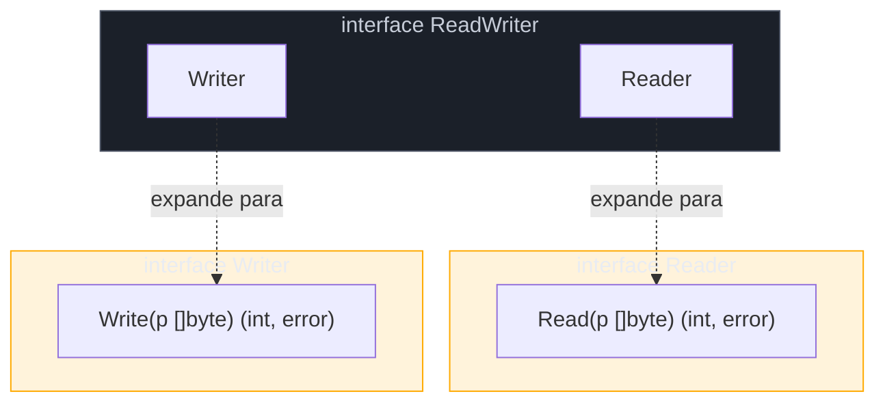
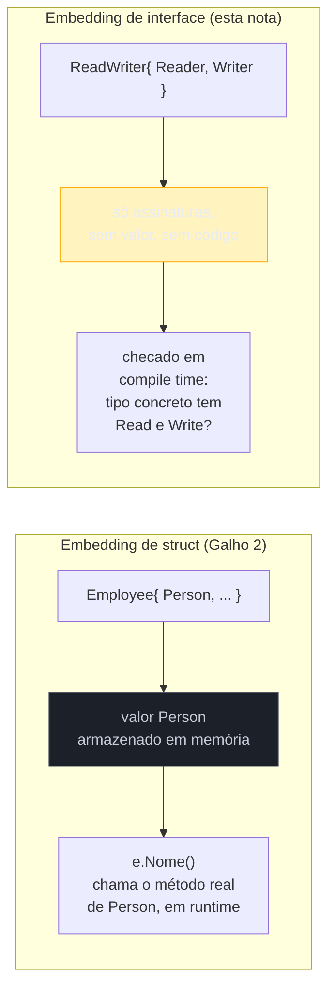

# Interface embedding

> [!abstract] TL;DR
> Uma interface Go pode **embutir outra interface** dentro de si — `type ReadWriter interface { Reader; Writer }` — e o resultado é uma interface nova cujo method set é a **união** dos method sets embutidos. Não há herança, não há `extends`: é o mesmo texto literal de `Reader` e `Writer` colado dentro de `ReadWriter`, resolvido em tempo de compilação. `io.ReadWriter` do próprio pacote padrão é exatamente isso — `Reader` (`Read`) + `Writer` (`Write`). Quem satisfaz `ReadWriter` precisa ter os dois métodos; não existe satisfação parcial. É a mesma palavra-chave `embedding` do galho anterior, mas operando sobre **contratos** (o que um tipo promete fazer) em vez de sobre **dados** (campos e métodos concretos que um tipo carrega) — a diferença entre as duas formas é o assunto central desta nota.

## O problema: cinco interfaces, cada combinação um nome novo

O pacote `io` da standard library define `Reader` e `Writer` como interfaces de um método só — a nota anterior já cobriu essa filosofia de "interfaces pequenas". Mas código real raramente lida só com "algo que lê" ou só com "algo que escreve" — um arquivo aberto, uma conexão de rede, um buffer em memória tipicamente fazem as duas coisas ao mesmo tempo.

A saída ingênua seria declarar uma interface nova, do zero, repetindo as assinaturas:

```go
type ReadWriter interface {
    Read(p []byte) (n int, err error)
    Write(p []byte) (n int, err error)
}
```

Funciona — mas cheira mal por dois motivos. Primeiro, é repetição textual pura: as duas assinaturas já existem, escritas com cuidado, em `Reader` e `Writer`; copiar de novo é abrir espaço para um typo divergir a assinatura sem ninguém notar. Segundo, e mais importante: essa `ReadWriter` "solta" não declara relação nenhuma com `Reader` nem com `Writer` para quem lê o código. Um leitor não consegue, só de olhar a declaração, confirmar que "todo `ReadWriter` também é um `Reader`" — precisa comparar as assinaturas linha a linha.

Go resolve isso deixando você **embutir uma interface dentro de outra**, listando o nome do tipo sem campo associado — a mesma sintaxe de embedding de struct, mas aplicada a contratos:

```go
type Reader interface {
    Read(p []byte) (n int, err error)
}

type Writer interface {
    Write(p []byte) (n int, err error)
}

type ReadWriter interface {
    Reader
    Writer
}
```

`ReadWriter` agora declara, no próprio código-fonte, que é a soma de `Reader` e `Writer` — não uma coincidência de assinaturas iguais. É exatamente assim que o pacote `io` real declara [`io.ReadWriter`](https://pkg.go.dev/io#ReadWriter): três linhas, sem repetir uma assinatura sequer.

## O mecanismo: união de method sets, resolvida em compilação



O compilador trata `ReadWriter` como se as assinaturas de `Reader` e `Writer` estivessem coladas ali dentro, literalmente. Não existe um mecanismo de despacho, vtable ou resolução em tempo de execução — a [especificação da linguagem](https://go.dev/ref/spec#Interface_types) descreve isso como o method set da interface embutida sendo **incluído** no method set da interface que embute. O efeito prático: satisfazer `ReadWriter` exige, ao mesmo tempo, ter `Read(p []byte) (int, error)` **e** `Write(p []byte) (int, error)` no method set do tipo concreto — a satisfação estrutural da [[01 - Interfaces implícitas e satisfação estrutural]] continua valendo, só que agora o contrato a bater é a união de duas listas em vez de uma.

Um tipo qualquer que já implementava `Reader` e `Writer` separadamente satisfaz `ReadWriter` automaticamente, sem precisar de declaração nova nenhuma — de novo, sem `implements`:

```go
type Buffer struct {
    dados []byte
    pos   int
}

func (b *Buffer) Read(p []byte) (int, error) {
    n := copy(p, b.dados[b.pos:])
    b.pos += n
    if n == 0 {
        return 0, io.EOF
    }
    return n, nil
}

func (b *Buffer) Write(p []byte) (int, error) {
    b.dados = append(b.dados, p...)
    return len(p), nil
}

func main() {
    var rw io.ReadWriter = &Buffer{}
    rw.Write([]byte("olá"))

    saida := make([]byte, 10)
    n, _ := rw.Read(saida)
    fmt.Println(string(saida[:n])) // olá
}
```

`*Buffer` nunca menciona `io.ReadWriter` em lugar nenhum do código — só declara `Read` e `Write`. A atribuição `var rw io.ReadWriter = &Buffer{}` compila porque o method set de `*Buffer` cobre a união exigida por `ReadWriter`. Se `Write` fosse removido, o erro de compilação apontaria exatamente isso: `*Buffer does not implement io.ReadWriter (missing method Write)`.

## Sem satisfação parcial

Vale reforçar o ponto que mais gera bug de leitura apressada: embutir `Reader` e `Writer` dentro de `ReadWriter` **não** cria uma interface que aceita "algo que só lê, ou só escreve, ou os dois". Cria uma interface que exige os dois métodos, sempre. Um tipo com só `Read` não satisfaz `io.ReadWriter` — só satisfaz `io.Reader`. A união de method sets é uma **exigência somada**, não uma opção "ou/ou".

Isso contrasta com um instinto comum de quem vem de linguagens com union types estruturais (TypeScript, por exemplo, onde `A | B` significa "um dos dois"): em Go, empilhar interfaces dentro de outra interface sempre produz **interseção de requisitos**, nunca união de possibilidades. O nome "union de method sets" se refere a somar os *métodos exigidos*, não a "ou uma coisa ou outra".

## Composição real do pacote `io`: além de `ReadWriter`

O padrão se repete em várias combinações no próprio pacote `io`, e vale ver mais de um exemplo para internalizar que não é truque isolado do `ReadWriter`:

```go
type Closer interface {
    Close() error
}

// io.ReadWriteCloser: três interfaces de um método, uma composta de três
type ReadWriteCloser interface {
    Reader
    Writer
    Closer
}

// io.ReadCloser: só duas
type ReadCloser interface {
    Reader
    Closer
}
```

[`io.ReadWriteCloser`](https://pkg.go.dev/io#ReadWriteCloser) é exatamente esse trio — e é o tipo que descreve, por exemplo, um `*os.File` aberto para leitura e escrita: o arquivo satisfaz `Read`, `Write` e `Close` por conta própria, sem nunca ter ouvido falar de `io.ReadWriteCloser` como nome.

> [!info] `net.Conn` é o exemplo mais citado de composição real
> A interface [`net.Conn`](https://pkg.go.dev/net#Conn), que representa uma conexão de rede genérica (TCP, Unix socket, etc.), embute exatamente esse padrão junto com métodos próprios de deadline e endereço — prova de que o padrão não é acadêmico, é a espinha dorsal de como I/O é modelado em toda a standard library.

## Contraste: embedding de interface vs embedding de struct

O galho anterior mostrou embedding de struct — um `Employee` embutindo `Person`, ganhando os campos e métodos de `Person` **promovidos** para seu próprio method set, com um valor concreto de `Person` de fato armazenado dentro de `Employee` em memória. Interface embedding parece a mesma sintaxe (o nome do tipo sem rótulo de campo), mas o que acontece por baixo é bem diferente:

| | Embedding de struct | Embedding de interface |
|---|---|---|
| O que existe | Um **valor** concreto do tipo embutido, armazenado como campo anônimo | Nenhum valor — só a **lista de assinaturas** copiada para dentro do contrato |
| Em tempo de execução | Ocupa memória; métodos promovidos chamam o valor real armazenado | Não existe em runtime — pura checagem do compilador |
| O que "ganha" o tipo que embute | Campos e métodos **implementados**, prontos pra usar | Assinaturas **exigidas** — quem quiser satisfazer a interface ainda tem que escrever a implementação |
| Analogia | "Tenho um `Person` dentro de mim e uso o comportamento dele" | "Prometo tudo que `Reader` promete, mais tudo que `Writer` promete" |
| Resolvido quando | Chamada de método, em runtime (busca no struct embutido) | Verificação de satisfação, em tempo de **compilação** |

A confusão mais comum: achar que `type ReadWriter interface { Reader; Writer }` está "herdando comportamento" de `Reader`, no sentido de ganhar código executável pronto — não está. `Reader` é só uma interface; não tem corpo de método nenhum para herdar. O que `ReadWriter` ganha é a **obrigação** de exigir `Read`, não uma implementação de `Read`. Quem fornece a implementação de verdade é sempre o tipo concreto (`*Buffer`, `*os.File`, o que for) — a interface embutida só amplia a lista de exigências que esse tipo concreto precisa cumprir.



## Casos práticos

**1. Definindo uma interface composta do zero, para um domínio próprio** — um sistema de cache que precisa, ao mesmo tempo, ler e invalidar entradas:

```go
type Reader interface {
    Get(chave string) (valor string, ok bool)
}

type Invalidator interface {
    Invalidar(chave string)
}

// CacheCompleto exige as duas capacidades — sem repetir assinatura
type CacheCompleto interface {
    Reader
    Invalidator
}

type CacheMemoria struct {
    dados map[string]string
}

func (c *CacheMemoria) Get(chave string) (string, bool) {
    v, ok := c.dados[chave]
    return v, ok
}

func (c *CacheMemoria) Invalidar(chave string) {
    delete(c.dados, chave)
}

func usar(c CacheCompleto) {
    if v, ok := c.Get("usuario:42"); ok {
        fmt.Println("achou:", v)
    }
    c.Invalidar("usuario:42")
}
```

**2. Misturando interface embutida com método próprio** — a interface composta não precisa se limitar às assinaturas herdadas; pode somar métodos novos, lado a lado:

```go
type Fechavel interface {
    Close() error
}

// RecursoGerenciado soma Close() (herdado) + Nome() (próprio)
type RecursoGerenciado interface {
    Fechavel
    Nome() string
}

type Conexao struct {
    id string
}

func (c *Conexao) Close() error { fmt.Println("fechando", c.id); return nil }
func (c *Conexao) Nome() string { return c.id }

func encerrar(r RecursoGerenciado) {
    fmt.Println("encerrando:", r.Nome())
    r.Close()
}
```

**3. `io.ReadWriter` em ação**, aceitando qualquer tipo que satisfaça a composição — inclusive `*bytes.Buffer` da standard library, sem ninguém ter escrito uma linha de adaptação:

```go
func copiarTexto(rw io.ReadWriter, texto string) (string, error) {
    if _, err := rw.Write([]byte(texto)); err != nil {
        return "", err
    }
    saida := make([]byte, len(texto))
    n, err := rw.Read(saida)
    if err != nil {
        return "", err
    }
    return string(saida[:n]), nil
}

func main() {
    var buf bytes.Buffer // *bytes.Buffer satisfaz io.ReadWriter
    resultado, _ := copiarTexto(&buf, "compondo interfaces")
    fmt.Println(resultado) // compondo interfaces
}
```

## Verificando a composição em tempo de compilação

Como a satisfação de `ReadWriter` (ou de qualquer interface composta) só é checada no ponto onde um valor é de fato atribuído a uma variável desse tipo, é fácil quebrar a implementação de `*Buffer` — remover `Write` por engano, por exemplo — e só descobrir o erro de compilação bem longe dali, no primeiro lugar do código que tentar usar `*Buffer` como `io.ReadWriter`. Para pacotes que expõem tipos pensados para satisfazer uma interface composta, o idioma comum é declarar essa checagem explicitamente, perto da declaração do tipo:

```go
type Buffer struct {
    dados []byte
    pos   int
}

// Assevera, em tempo de compilação, que *Buffer satisfaz io.ReadWriter —
// sem custo em runtime, sem alocar nada: _ descarta o valor produzido.
var _ io.ReadWriter = (*Buffer)(nil)

func (b *Buffer) Read(p []byte) (int, error)  { /* ... */ return 0, nil }
func (b *Buffer) Write(p []byte) (int, error) { /* ... */ return 0, nil }
```

`(*Buffer)(nil)` cria um ponteiro nulo do tipo `*Buffer` — não aloca nada, só serve como valor de tipo certo para o compilador conferir. `var _ io.ReadWriter = ...` atribui esse valor a uma variável descartada (`_`), forçando a checagem de satisfação **no exato lugar onde o tipo é declarado**, em vez de deixar o erro emergir, confuso, em algum `main.go` distante. Se alguém remover `Write` de `*Buffer` depois, o erro de compilação aponta direto para essa linha — não para o ponto de uso. É o padrão que a própria standard library usa para garantir que tipos como `*bytes.Buffer` continuem satisfazendo `io.ReadWriter` conforme o código evolui.

## Armadilhas comuns

> [!warning] Métodos com a mesma assinatura em interfaces embutidas diferentes: sem conflito
> Se duas interfaces embutidas declaram o **mesmo método com a mesma assinatura**, não há erro — a união simplesmente colapsa a assinatura repetida numa exigência só. Mas se duas interfaces embutidas declaram o mesmo nome de método com **assinaturas diferentes** (`Fechar() error` numa, `Fechar()` sem retorno na outra), o compilador rejeita a composição com um erro de método duplicado e incompatível — a interface resultante não pode existir. Isso raramente acontece por acidente com interfaces bem desenhadas, mas é um sinal de alerta ao compor interfaces de origens diferentes (duas bibliotecas de terceiros, por exemplo).

> [!warning] Interface grande via embedding ainda é interface grande
> Embutir facilita *escrever* `io.ReadWriteCloser`, mas não cancela o conselho de "prefira interfaces pequenas" da [[05 - Interfaces pequenas — io.Reader e io.Writer|nota 05]]. Se uma função só precisa ler, aceite `io.Reader` — não `io.ReadWriteCloser` só porque o tipo concreto que você tem em mãos satisfaz a versão maior. Embedding resolve o problema de *declarar* contratos compostos sem repetição; não é convite para pedir mais do que a função realmente usa.

> [!warning] Não confundir com embedding de struct dentro de interface
> Você não pode embutir um **struct** dentro de uma interface (`type Foo interface { MeuStruct }` não compila) — só outra **interface**. A palavra `embedding` é a mesma nos dois contextos do vault, mas os operandos válidos são disjuntos: dentro de `struct { }` você embute tipos concretos (structs, tipos nomeados, ponteiros); dentro de `interface { }` você só embute outras interfaces.

## Lente cross-stack

| Vindo de... | O equivalente mais próximo | A diferença que morde |
|---|---|---|
| Java | `interface ReadWriter extends Reader, Writer` | Sintaticamente quase idêntico — mas Java também suporta *default methods* dentro da interface (código real, não só assinatura); Go nunca tem corpo de método em interface, embutida ou não. |
| TypeScript | `interface ReadWriter extends Reader, Writer {}` ou `type RW = Reader & Writer` | Mesma ideia de interseção de contrato — TS até chama isso de *intersection type* com `&`, nome que descreve bem o que Go também faz, apesar do vocabulário "embedding" ser diferente. |
| Python | `Protocol` com múltipla herança de `Protocol`s (`class ReadWriter(Reader, Writer, Protocol): ...`) | Python via `typing.Protocol` chega ao mesmo lugar estruturalmente, mas com checagem só em ferramentas de type-checking (mypy) — Go garante isso no próprio `go build`. |

## Como explicar em inglês

> Go lets an interface **embed** another interface — `type ReadWriter interface { Reader; Writer }` — and the resulting interface's method set is the **union** of the embedded ones. This is resolved entirely at compile time: there's no runtime dispatch, no inherited implementation, just the embedded interfaces' method signatures spliced into the composing interface's own declaration. `io.ReadWriter` in the standard library is exactly `Reader` (`Read`) plus `Writer` (`Write`); a concrete type satisfies it only by implementing both methods — there's no partial satisfaction. It's easy to conflate this with struct embedding from the previous chapter, but the two are structurally different: struct embedding stores an actual value and promotes its already-implemented methods at runtime; interface embedding stores nothing — it only widens the list of method signatures a concrete type must provide. The implementation itself always comes from the concrete type, never from the embedded interface, because interfaces never carry a method body.

| Termo PT | Termo EN |
|---|---|
| embedding de interface | interface embedding |
| interface composta | composed / embedded interface |
| união de method sets | union of method sets |
| satisfação parcial | partial satisfaction |
| tipo concreto | concrete type |
| exigência de método | method requirement |
| checagem em tempo de compilação | compile-time check |

## O que vem a seguir

Toda interface até aqui pressupôs um valor concreto, real, guardado dentro dela — `*Buffer`, `*os.File`, algo que existe. Mas o próprio *tipo* `interface` em Go tem um valor zero: `nil`. E esse `nil` esconde uma das pegadinhas mais citadas da linguagem, porque uma interface pode estar "não-nil" mesmo carregando um ponteiro nulo por dentro. A [[07 - O nil interface e o typed-nil|nota 07]] disseca exatamente esse comportamento — por que `if err != nil` às vezes mente, e como uma interface é internamente um par (tipo, valor) que explica o paradoxo.

## Veja também

- [[01 - Interfaces implícitas e satisfação estrutural]] — a base da satisfação estrutural que continua valendo quando o contrato é uma união de method sets
- [[05 - Interfaces pequenas — io.Reader e io.Writer]] — `Reader` e `Writer` que esta nota compõe em `ReadWriter`
- [[07 - O nil interface e o typed-nil]] — próxima nota do galho
- [[08 - Design idiomático de interfaces]] — quando compor interfaces é a escolha certa, e quando é over-engineering
- [[03-Dominios/Tecnologia/Go/index|Trilha Go]]

## Fontes

- The Go Authors. *The Go Programming Language Specification — Interface types*. go.dev. https://go.dev/ref/spec#Interface_types (acessado em 2026-07-18)
- The Go Authors. *Package io*. pkg.go.dev. https://pkg.go.dev/io (acessado em 2026-07-18)
- The Go Authors. *Package net — type Conn*. pkg.go.dev. https://pkg.go.dev/net#Conn (acessado em 2026-07-18)
- The Go Authors. *Effective Go — Interfaces and other types*. go.dev. https://go.dev/doc/effective_go#interfaces_and_other_types (acessado em 2026-07-18)
- The Go Authors. *A Tour of Go — Interfaces*. go.dev. https://go.dev/tour/methods/9 (acessado em 2026-07-18)
