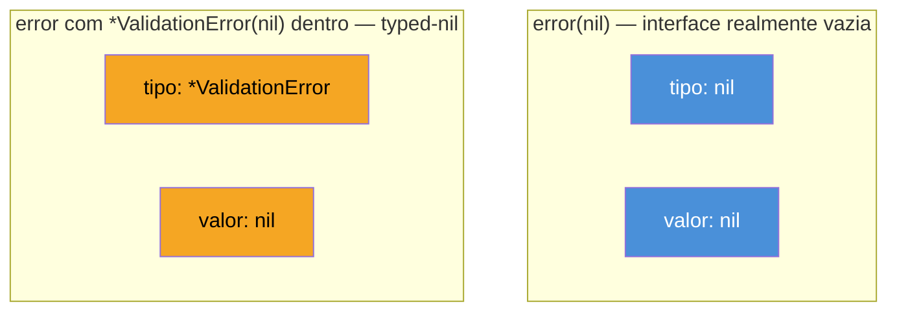
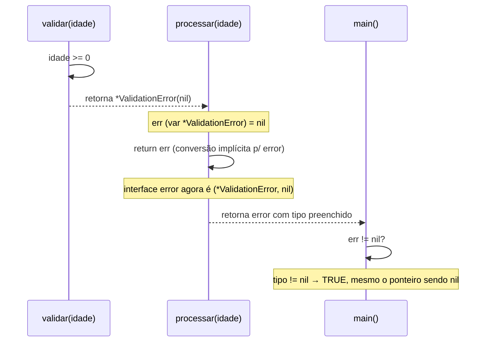

# O nil interface e o typed-nil

> [!abstract] TL;DR
> Uma interface em Go não é um ponteiro disfarçado — é um **par**: `(tipo, valor)`. Uma interface só é `== nil` quando **as duas metades** estão vazias. O gotcha clássico: uma função retorna `*MeuErro` como `error`, o ponteiro concreto é `nil`, mas a interface retornada carrega `(tipo=*MeuErro, valor=nil)` — e isso **não é** `nil` para quem compara `err != nil`. O resultado é um `if err != nil` que entra no branch de erro segurando um erro que, "por dentro", não tem nada. A defesa é disciplinada: nunca declare `var err *MeuErro` e devolva esse ponteiro direto como `error`; retorne `nil` literal quando não houver erro, e se precisar checar um ponteiro concreto embrulhado numa interface, faça a checagem **antes** de embrulhar.

## O bug que passa no code review

Imagine uma função que valida um objeto e devolve um erro customizado só quando a validação falha:

```go
type ValidationError struct {
    Campo string
}

func (e *ValidationError) Error() string {
    return fmt.Sprintf("campo inválido: %s", e.Campo)
}

func validar(idade int) *ValidationError {
    if idade < 0 {
        return &ValidationError{Campo: "idade"}
    }
    return nil // nenhum erro
}
```

Até aqui, nada de estranho — `validar` retorna `*ValidationError`, e `nil` é um ponteiro válido do tipo certo. Agora alguém decide que essa função devia satisfazer a interface `error` padrão, porque é isso que o resto do código espera:

```go
func processar(idade int) error {
    err := validar(idade)
    return err // *ValidationError sendo convertido implicitamente para error
}

func main() {
    err := processar(30) // idade válida, validar() devolveu nil
    if err != nil {
        fmt.Println("deu erro:", err) // ⚠️ isso IMPRIME, mesmo sem erro nenhum
    } else {
        fmt.Println("tudo certo")
    }
}
```

Rode esse código e o `if err != nil` é verdadeiro — mesmo a idade sendo válida e `validar` tendo devolvido `nil`. Não é bug de lógica na validação. É a conversão de `*ValidationError(nil)` para `error` acontecendo em `return err` dentro de `processar`, e essa conversão produz uma interface que **não é** `nil`.

Isso não é peculiaridade rara — é, segundo o próprio [Go FAQ](https://go.dev/doc/faq#nil_error), "provavelmente o erro mais comum que devs Go cometem, especialmente os que estão começando". E é pergunta clássica de entrevista técnica em Go justamente porque separa quem só decorou sintaxe de quem entende o modelo de memória por trás das interfaces.

## O mecanismo: interface é um par (tipo, valor)

A nota 01 deste galho já estabeleceu que uma interface guarda o que satisfaz a assinatura, não um tipo fixo. O detalhe que falta agora é *como* ela guarda isso — e é aí que mora o bug.

Internamente, um valor de interface não-vazia é representado por duas palavras de memória: um ponteiro para informação de **tipo** (que tipo concreto está guardado ali) e um ponteiro (ou valor) para os **dados** em si.



A comparação `err != nil` verifica **as duas metades** do par. `error(nil)` — a interface nunca atribuída, ou explicitamente atribuída ao literal `nil` — tem tipo `nil` e valor `nil`: essa sim é `== nil`. Mas quando `processar` faz `return err` com `err` do tipo `*ValidationError` e valor `nil`, o compilador converte esse ponteiro *typed* para a interface `error`, preenchendo a metade do tipo com `*ValidationError` — mesmo o ponteiro em si sendo `nil`. O par resultante é `(*ValidationError, nil)`, e um par onde a metade do tipo não é `nil` **nunca** é igual a `nil`, não importa o que a metade do valor contenha.



Essa é a definição precisa do **typed-nil**: um valor concreto `nil` (ponteiro, slice, map, channel, função — qualquer tipo cujo zero value seja `nil`) que, ao ser atribuído a uma variável de interface, produz uma interface não-nil porque a metade do tipo ficou preenchida.

> [!question]- Por que Go não trata isso como um caso especial e simplesmente considera a interface `nil` quando o valor de dentro é `nil`?
> Porque isso quebraria a regra geral e criaria uma exceção ad-hoc justamente para o tipo mais comum de erro programável em Go: ponteiros. A especificação da linguagem define `nil` de interface como "both value and type are unset" — sem meio-termo. Se o compilador "olhasse dentro" do valor para decidir, a comparação `==` deixaria de ser O(1) e determinística por representação de bits, e passaria a exigir reflection em toda comparação de interface — inviável em runtime. A [FAQ oficial](https://go.dev/doc/faq#nil_error) é direta sobre isso: o comportamento é intencional e consistente com o resto da linguagem, mesmo sendo contraintuitivo na primeira vez.

## Onde isso aparece na prática

O padrão mais comum é exatamente o do exemplo de abertura: uma função que devolve um tipo de erro customizado como `*T`, mas cuja assinatura declara o tipo de retorno como a interface `error`.

```go
type MyError struct {
    Code int
}

func (e *MyError) Error() string {
    return fmt.Sprintf("erro código %d", e.Code)
}

func doSomething(falha bool) error {
    var err *MyError // zero value: nil
    if falha {
        err = &MyError{Code: 500}
    }
    return err // ⚠️ mesmo quando err (*MyError) é nil, o retorno não é nil
}
```

`doSomething(false)` retorna uma interface `error` com tipo `*MyError` e valor `nil` — não `nil` de verdade. Qualquer `if err != nil` no chamador vai por água abaixo.

> [!warning] `fmt.Println(err)` num typed-nil não ajuda a debugar — e pode até panicar
> Imprimir um typed-nil chama `Error()` no ponteiro `nil` por baixo dos panos. Se `Error()` só faz `fmt.Sprintf(...)` sobre campos que não dependem do receiver, funciona (Go permite chamar método com receiver ponteiro `nil`, desde que o corpo não desreferencie o ponteiro). Mas se `Error()` acessa `e.Code` num receiver `nil`, o programa **panica** com nil pointer dereference — dentro do código de tratamento de erro, o pior lugar possível para uma falha nova aparecer.

Outra variação do mesmo problema: guardar um ponteiro `nil` em qualquer interface, não só `error` — `io.Reader`, `fmt.Stringer`, qualquer uma. O mecanismo é idêntico; `error` só é onde a maioria dos devs Go tropeça primeiro, porque `if err != nil` é o idioma mais repetido da linguagem.

## Como evitar

A defesa central é uma regra de disciplina, não de sintaxe nova: **nunca deixe uma variável de tipo ponteiro concreto vazar direto para uma variável de retorno de tipo interface**. Duas táticas cobrem a esmagadora maioria dos casos.

**1. Retorne o literal `nil`, nunca a variável ponteiro, no caminho de sucesso:**

```go
func doSomething(falha bool) error {
    if falha {
        return &MyError{Code: 500} // interface com tipo+valor preenchidos — correto
    }
    return nil // interface literalmente vazia — correto
}
```

Aqui não existe conversão implícita de uma variável `*MyError` que poderia ser `nil`: o `return nil` no caminho feliz é o literal `nil` da linguagem, sem tipo nenhum embutido. `err != nil` volta a funcionar como esperado.

**2. Se você precisa checar um ponteiro concreto antes de embrulhar numa interface**, faça a checagem explicitamente:

```go
func chamarAPIExterna() (*http.Response, error) {
    resp, err := algumaLibExterna()
    if err != nil {
        return nil, err
    }
    // resp é garantido não-nil aqui — devolvido como *http.Response, não como interface
    return resp, nil
}
```

O padrão idiomático em Go é justamente esse: funções devolvem o tipo concreto (`*T`) quando o chamador precisa dele, e só devolvem `error` como interface — nunca misturam as duas coisas na mesma variável de retorno.

> [!info] `errors.Is` e `errors.As` (Go 1.13+) não resolvem o typed-nil
> `errors.Is(err, nil)` tem o mesmo problema que `err == nil` — ainda compara o par completo. O pacote [`errors`](https://pkg.go.dev/errors) resolve *unwrapping* de cadeias de erro (`fmt.Errorf("...: %w", err)`), um problema diferente e complementar; não existe função de biblioteca padrão que "desembrulhe" um typed-nil e diga "esse ponteiro de dentro é nil, então trate como se a interface fosse nil". A prevenção acontece na construção do erro, não na checagem.

## Detectando um typed-nil em runtime, quando você não controla a origem

Às vezes você não controla a função que produz o erro — está lidando com uma biblioteca de terceiros, ou com código legado que você está arqueologando (o ofício deste vault) e não pode reescrever de imediato. Nesses casos, existe uma forma de *detectar* um typed-nil depois do fato, usando o pacote [`reflect`](https://pkg.go.dev/reflect):

```go
func ehTypedNil(i interface{}) bool {
    if i == nil {
        return false // já é nil de verdade, nem entra no caso typed-nil
    }
    v := reflect.ValueOf(i)
    switch v.Kind() {
    case reflect.Ptr, reflect.Map, reflect.Slice, reflect.Chan, reflect.Func:
        return v.IsNil()
    default:
        return false
    }
}
```

`reflect.ValueOf(i)` "abre" a interface e expõe as duas metades do par — é literalmente o mecanismo que a comparação `==` se recusa a fazer por padrão. `v.IsNil()` então pergunta pela metade do **valor**, ignorando a metade do tipo. Rodando contra o exemplo de abertura:

```go
var err error = mayFail() // *CustomError(nil) embrulhado em error
fmt.Println(err == nil)      // false — comparação direta engana
fmt.Println(ehTypedNil(err)) // true — reflection revela o valor nil por dentro
```

> [!warning] `reflect` aqui é ferramenta de diagnóstico, não de produção
> Espalhar `ehTypedNil` pelo código de produção é tratar o sintoma, não a causa — e reflection tem custo de performance real em hot paths. A função acima serve para **debugar** um typed-nil suspeito (num teste, num REPL, numa investigação de bug em código legado) ou para uma biblioteca genérica de baixo nível que realmente precisa lidar com entradas de qualquer natureza (é essencialmente o que `errors.Is`/`errors.As` fazem internamente, com mais nuance). Em código de aplicação normal, a correção certa continua sendo a disciplina da seção anterior: nunca deixar o typed-nil se formar.

## Um caso relacionado: comparar duas interfaces, não só uma interface com `nil`

O mesmo par `(tipo, valor)` também governa `==` entre duas variáveis de interface — não só a comparação com `nil`. Duas interfaces são iguais quando **os dois tipos dinâmicos são idênticos e os dois valores dinâmicos são iguais** (segundo a definição de igualdade de `==` para aquele tipo). Isso produz uma segunda armadilha, prima do typed-nil:

```go
var a error = &MyError{Code: 500}
var b error = &MyError{Code: 500}

fmt.Println(a == b) // false — mesmo tipo, mas ponteiros diferentes apontam pra structs distintas
```

`a` e `b` têm o mesmo tipo dinâmico (`*MyError`), mas cada `&MyError{...}` aloca um endereço novo — comparar ponteiros compara endereços, não conteúdo. Isso não é o típico bug de entrevista sobre typed-nil, mas nasce do mesmo modelo mental: **interface `==` sempre delega para a igualdade do tipo dinâmico**, seja esse tipo comparável por valor (structs pequenos, tipos primitivos) ou por identidade (ponteiros). Vale a menção porque, uma vez que você entende o par `(tipo, valor)`, os dois comportamentos — o do `nil` e o da comparação entre valores — deixam de parecer casos especiais e viram consequência natural da mesma regra.

## O gotcha da entrevista: linters não pegam sozinhos

Vale nomear por que esse bug sobrevive a code review com frequência incômoda: o compilador Go **não recusa** a conversão de `*T(nil)` para uma interface — é uma conversão implícita perfeitamente legal, coberta pela regra de que qualquer tipo que satisfaz uma interface pode ser atribuído a uma variável dessa interface, incluindo quando o valor concreto é `nil`. `go vet` também não sinaliza isso por padrão, porque não há erro de tipo: o programa compila, roda, e só se comporta de forma "errada" do ponto de vista de quem espera `err == nil` significar "sem erro".

A pergunta de entrevista mais comum sobre isso pede pra você prever a saída deste programa:

```go
type CustomError struct{}

func (*CustomError) Error() string { return "custom error" }

func mayFail() *CustomError {
    return nil
}

func main() {
    var err error = mayFail()
    fmt.Println(err == nil) // false — pegadinha
}
```

Quem não conhece o mecanismo aposta em `true` (o ponteiro é `nil`, então "não devia ter erro"). A resposta correta é `false`, e explicar *por quê* — o par `(tipo, valor)`, a conversão implícita em `var err error = mayFail()` — é o que separa uma resposta decorada de uma resposta que demonstra entendimento do modelo de memória de interface em Go.

## Vindo de outras linguagens

| Linguagem | Comportamento equivalente |
|---|---|
| Java | `null` é um valor único, sem "tipo embutido" — comparar `obj == null` sempre reflete a ausência real de referência. Não há equivalente direto ao typed-nil; o mais próximo conceitualmente é `Optional.empty()` vs `Optional.of(null)`, que a maioria das bases proíbe por convenção. |
| Python | `None` também é singleton único — `is None` nunca mente. Erros em Python usam exceções, não valores de retorno, então o problema simplesmente não existe na forma como aparece em Go. |
| C++ | Mais próximo do problema real: um `std::any` ou `std::variant` guardando um ponteiro `nullptr` tipado tem a mesma dualidade tipo/valor — mas é padrão bem menos comum no dia a dia do que `error` em Go. |

A causa raiz em Go não é falta de cuidado da linguagem — é uma decisão de design consistente (interface como par tipo+valor) que abre espaço para esse gotcha específico quando `error` é o tipo de retorno mais usado da linguagem inteira.

## Como explicar em inglês

> A Go interface value is a **pair** — `(type, value)` — not a bare pointer. The interface equals `nil` only when *both* halves are unset. The classic gotcha: a function returns a concrete pointer type (say, `*MyError`) through an `error`-typed return, and even when that pointer is `nil`, the interface it gets wrapped into carries a non-nil type descriptor — so `err != nil` evaluates `true` even though there's "nothing" inside. This is called a **typed-nil**. The fix is discipline, not new syntax: return the bare `nil` literal on the success path, and never let a variable of concrete pointer type flow directly into an interface-typed return value. It's a favorite interview question precisely because it separates memorized syntax from real understanding of how Go represents interface values at runtime.

| Termo PT | Termo EN |
|---|---|
| interface vazia (nil) | nil interface |
| ponteiro nil tipado | typed-nil |
| par tipo-valor | type-value pair |
| conversão implícita | implicit conversion |
| descritor de tipo | type descriptor |
| desreferenciar | dereference |
| caminho de sucesso | success path / happy path |

## O que vem a seguir

Entender o typed-nil é pré-requisito pra uma pergunta maior: dado que interfaces têm esse comportamento sutil, como projetar interfaces em Go de um jeito que minimize esse tipo de armadilha para quem consome sua API? A [[08 - Design idiomático de interfaces|nota 08]] fecha o galho consolidando os princípios de design vistos até aqui — interfaces pequenas, aceitar interface/retornar struct, embedding — numa visão de conjunto sobre o que faz uma interface Go idiomática.

## Veja também

- [[01 - Interfaces implícitas e satisfação estrutural|01 — Interfaces implícitas e satisfação estrutural]] — base do modelo de satisfação por method set retomado aqui
- [[03 - Type assertions e type switch|03 — Type assertions e type switch]] — outra fonte comum de panics envolvendo interface e tipo concreto
- [[04 - Accept interfaces, return structs|04 — Accept interfaces, return structs]] — por que devolver o tipo concreto (não a interface) evita boa parte deste gotcha
- [[08 - Design idiomático de interfaces|08 — Design idiomático de interfaces]] — próxima nota do galho
- [[03-Dominios/Tecnologia/Go/index|Trilha Go]]

## Fontes

- The Go Authors. *Go FAQ — Why is my nil error value not equal to nil?*. go.dev. https://go.dev/doc/faq#nil_error (acessado em 2026-07-18)
- The Go Authors. *The Go Programming Language Specification — Interface types*. go.dev. https://go.dev/ref/spec#Interface_types (acessado em 2026-07-18)
- The Go Blog. *Go Slices: usage and internals* (contexto sobre representação interna de tipos compostos, aplicável ao raciocínio de interface). go.dev. https://go.dev/blog/slices-intro (acessado em 2026-07-18)
- pkg.go.dev. *Package errors*. pkg.go.dev. https://pkg.go.dev/errors (acessado em 2026-07-18)
- The Go Authors. *A Tour of Go — Interfaces*. go.dev. https://go.dev/tour/methods/9 (acessado em 2026-07-18)
