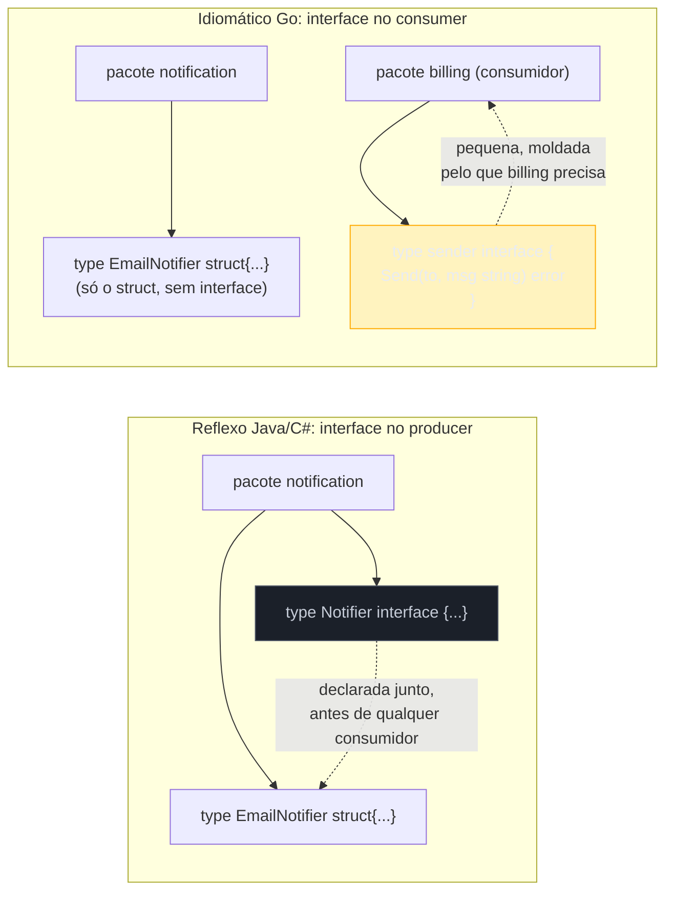

# Design idiomático de interfaces

> [!abstract] TL;DR
> A pergunta certa nunca é "que interface esse tipo deveria implementar?" — é "que interface o *consumidor* precisa para fazer seu trabalho?". Em Go idiomático, **interfaces se declaram do lado de quem consome, não de quem produz** — o inverso do reflexo de quem vem de Java/C#, onde a interface nasce junto do `class` que a implementa. Declarar interface antes de existir um segundo consumidor real é *interface pollution*: abstração paga com juros (indireção, dificuldade de navegar, `interface{}` disfarçado de design) sem comprovar necessidade. A pergunta de corte é sempre "quem precisa dessa abstração, e para quê?" — se a resposta é "ninguém ainda", a interface espera. Uma exceção sistemática: interfaces criadas deliberadamente como *seams* de teste, para trocar uma dependência real por um fake em testes — esse é o único caso em que "declarar antes de precisar" é o próprio ponto.

## O reflexo errado: interface junto do struct

Imagine que você está migrando um serviço de notificações de Java para Go. Em Java, o hábito é automático: toda `class` de responsabilidade não-trivial ganha uma `interface` companheira, quase por reflexo — `NotificationService` e `NotificationServiceImpl`, lado a lado, ainda que só exista uma implementação real hoje e provavelmente só vai existir uma amanhã.

Traduzido ingenuamente para Go, isso vira:

```go
// producer.go — pacote notification

type Notifier interface {
    Send(to string, msg string) error
}

type EmailNotifier struct {
    smtpHost string
}

func (e *EmailNotifier) Send(to string, msg string) error {
    // ... envia e-mail de verdade
    return nil
}
```

Compila, funciona, parece "bem projetado" — tem uma interface! Mas pare e pergunte: **quem usa `Notifier`, e por quê precisa da interface em vez do tipo concreto `*EmailNotifier`?** Se a resposta for "ninguém ainda, é só boa prática", você acabou de pagar um custo real — mais um nome para navegar, mais um nível de indireção no editor, mais uma pergunta ("quantas implementações existem?") que todo leitor precisa responder — sem nenhum benefício comprovado. Go tem um nome pejorativo específico para isso: **interface pollution**.

O ponto não é que interfaces sejam ruins. É que, em Go, a decisão de *onde* declarar uma interface muda tudo — e o lugar errado é ao lado do tipo que a implementa.

## Accept interfaces, declare no consumer

A [[04 - Accept interfaces, return structs|nota 04]] já estabeleceu a metade "aceite interfaces" da regra clássica de Rob Pike. Esta nota completa a outra metade, mais sutil: **quem declara a interface não é quem a implementa — é quem a consome**.



Reescrevendo o exemplo: o pacote `notification` expõe só o tipo concreto. Nenhuma interface.

```go
// notification/email.go

package notification

type EmailNotifier struct {
    smtpHost string
}

func NewEmailNotifier(host string) *EmailNotifier {
    return &EmailNotifier{smtpHost: host}
}

func (e *EmailNotifier) Send(to string, msg string) error {
    // ... envia e-mail de verdade
    return nil
}
```

Quem precisa abstrair "algo que envia notificação" é o pacote `billing`, que dispara um aviso de cobrança e não quer depender do detalhe "é e-mail" — quer poder trocar por SMS amanhã, e quer testar sem enviar e-mail de verdade hoje. Então é o `billing` que declara a interface, pequena, com exatamente o que ele usa:

```go
// billing/invoice.go

package billing

type sender interface {
    Send(to string, msg string) error
}

type InvoiceService struct {
    notifier sender
}

func NewInvoiceService(n sender) *InvoiceService {
    return &InvoiceService{notifier: n}
}

func (s *InvoiceService) NotifyOverdue(email string) error {
    return s.notifier.Send(email, "sua fatura está em atraso")
}
```

`*notification.EmailNotifier` satisfaz `billing.sender` **sem saber que `billing.sender` existe** — satisfação estrutural implícita, tema da [[01 - Interfaces implícitas e satisfação estrutural|nota 01]] do início deste galho, agora aplicada como princípio de design e não só como mecanismo de linguagem. Repare também que `sender` começa com letra minúscula: não exportada, porque só o próprio pacote `billing` precisa dela. Isso é o padrão descrito no [Go Proverb](https://go-proverbs.github.io/) de Rob Pike — "The bigger the interface, the weaker the abstraction" — levado à prática: a interface nasce exatamente do tamanho do que o consumidor usa, nem um método a mais.

> [!question]- Mas e se dois consumidores diferentes precisarem da "mesma" interface?
> Nada impede que dois pacotes declarem, cada um, sua própria interface pequena com a mesma assinatura — inclusive é comum acontecer sem coordenação nenhuma, porque `Send(to, msg string) error` é uma forma óbvia de expressar "algo que manda mensagem". Go não exige (nem incentiva) um "único ponto de verdade" para toda interface possível. Se as duas interfaces convergirem naturalmente e viverem em pacotes vizinhos com propósito compartilhado, aí sim considere extrair uma interface comum — mas isso é decisão de refactor a posteriori, guiada por duplicação real observada, não de design antecipado.

## Por que isso é o oposto do hábito de Java/C#/Node

A tabela abaixo não é sobre qual abordagem é "melhor" em abstrato — é sobre onde cada ecossistema historicamente colocou a decisão de abstrair.

| | Java / C# (tradicional) | Node/TypeScript (comum) | Go idiomático |
|---|---|---|---|
| Quem declara a interface | O producer, junto da implementação | Frequentemente ninguém — duck typing dispensa | O consumer, no ponto de uso |
| Quando é declarada | Antes da primeira implementação, "por prática" | Raramente formal | Quando um segundo caso de uso real aparece (ou para teste) |
| Tamanho típico | Espelha a classe inteira (`UserServiceImpl`) | N/A | Mínimo — só os métodos usados |
| Motivação declarada | "Programar contra interface, não implementação" | Estruturação leve, tipos inferidos | Desacoplar o consumidor de um detalhe de implementação específico |

Em Java, a interface é quase um artefato ritual — `List` e `ArrayList`, `Repository` e `RepositoryImpl` — porque o compilador e as convenções do ecossistema (Spring, injeção de dependência por interface) recompensam esse par desde o primeiro dia. Em Go, sem esse ritual e sem satisfação explícita (`implements`), a interface só ganha o direito de existir quando resolve um problema que já apareceu: múltiplas implementações reais, ou necessidade de dublê de teste. Effective Go registra essa filosofia de forma direta: "Interfaces in Go provide a way to specify the behavior of an object [...] Bigger interfaces [...] are less general" — e a comunidade Go leu isso, ao longo dos anos, como um convite a manter interfaces pequenas e tardias, não grandes e antecipadas.

## Quando NÃO usar interface

A pergunta mais produtiva antes de escrever `interface` não é "isso poderia ser abstrato?" — quase tudo poderia. É: **existe hoje, de fato, mais de uma implementação real, ou uma necessidade concreta de dublê de teste?** Se a resposta for não para as duas, o tipo concreto é a escolha certa — e trocar por interface depois, quando a necessidade aparecer, custa uma refatoração pequena e localizada (Go não tem cerimônia de "implements" para desfazer).

Sinais de que você está prestes a criar interface sem necessidade:

- **Uma implementação, sem plano concreto de uma segunda.** "Pode ser que a gente precise trocar por Postgres depois" não é plano concreto — é especulação. YAGNI (*You Aren't Gonna Need It*) se aplica a interfaces com a mesma força que se aplica a qualquer outra abstração prematura.
- **A interface espelha 100% dos métodos exportados do struct.** Isso normalmente significa que ela não está desacoplando nada — está só duplicando a lista de métodos com um nome a mais para manter sincronizado.
- **Ninguém fora do pacote usa a interface para fazer *mock*/*fake*.** Se o motivo declarado é "testabilidade" mas os testes do próprio pacote usam o tipo concreto direto, a interface não está cumprindo o papel que justificaria sua existência.

```go
// Sinal de interface pollution: uma implementação, interface espelhando
// 100% dos métodos, ninguém mais no repositório referencia a interface.

type UserRepository interface {
    FindByID(id string) (*User, error)
    Save(u *User) error
    Delete(id string) error
}

type postgresUserRepository struct {
    db *sql.DB
}

func (r *postgresUserRepository) FindByID(id string) (*User, error) { /* ... */ return nil, nil }
func (r *postgresUserRepository) Save(u *User) error                { /* ... */ return nil }
func (r *postgresUserRepository) Delete(id string) error            { /* ... */ return nil }
```

Se só `postgresUserRepository` existe, e o único lugar que usa `UserRepository` é o próprio `main.go` fazendo `var repo UserRepository = &postgresUserRepository{...}`, a interface não compra nada — `*postgresUserRepository` direto seria mais simples de navegar, sem perder nada. A situação muda no instante em que aparece um segundo consumidor real com motivo genuíno de trocar a implementação — e, principalmente, no instante em que aparece um teste que precisa de um fake no lugar do banco de dados de verdade. Esse segundo caso é comum o bastante, e importante o bastante, para merecer seção própria.

> [!warning] "Pode precisar no futuro" não é motivo — é adivinhação
> A justificativa mais comum para interface prematura é hipotética: "e se um dia trocarmos de Postgres para MongoDB?". Go aposta que esse dia, se chegar, custa pouco para resolver *quando chegar* — porque a satisfação de interface é implícita e retroativa. Você não precisa prever a interface hoje para poder introduzi-la amanhã sem tocar no tipo concreto original. Pagar o custo de indireção agora, para um cenário que talvez nunca aconteça, é o oposto de YAGNI.

## Interfaces como contrato de teste

Existe uma categoria inteira de interface que foge da regra "espere até ter duas implementações" — e é a mais comum de todas em código Go de produção: a interface criada **deliberadamente para permitir um fake em teste**, mesmo que só exista uma implementação real. Aqui o "segundo consumidor" que justifica a interface não é outro serviço de produção — é o próprio teste.

```go
package billing

type sender interface {
    Send(to string, msg string) error
}

type InvoiceService struct {
    notifier sender
}

func (s *InvoiceService) NotifyOverdue(email string) error {
    if email == "" {
        return errors.New("billing: email vazio")
    }
    return s.notifier.Send(email, "sua fatura está em atraso")
}
```

No pacote de teste, um fake local — sem framework de mock nenhum, só um struct comum que satisfaz a interface:

```go
package billing

import "testing"

type fakeSender struct {
    called bool
    to, msg string
    err error
}

func (f *fakeSender) Send(to string, msg string) error {
    f.called = true
    f.to, f.msg = to, msg
    return f.err
}

func TestInvoiceService_NotifyOverdue(t *testing.T) {
    fake := &fakeSender{}
    svc := &InvoiceService{notifier: fake}

    if err := svc.NotifyOverdue("cliente@example.com"); err != nil {
        t.Fatalf("erro inesperado: %v", err)
    }
    if !fake.called {
        t.Error("esperava que Send fosse chamado")
    }
    if fake.to != "cliente@example.com" {
        t.Errorf("to = %q, esperado %q", fake.to, "cliente@example.com")
    }
}
```

`InvoiceService.NotifyOverdue` roda em milissegundos, sem SMTP de verdade, sem rede, sem flakiness — porque `notifier sender` é uma **seam** (costura, ponto de corte) por onde o teste troca a dependência real por um dublê controlado. Esse padrão — pequena interface local existindo primariamente para permitir teste isolado — é comum o bastante em Go para ter nome próprio na comunidade: *dependency injection via interface*, sem framework de DI nenhum, só o compilador de tipos estruturais fazendo o trabalho.

Isso não contradiz "não crie interface sem necessidade" — é a prova de que a necessidade estava lá o tempo todo, só que sob a forma "meu teste precisa desacoplar isso" em vez de "outra implementação de produção precisa existir". A diferença entre essa interface e a `UserRepository` da seção anterior não é sintática — é que aqui existe, de fato, um segundo consumidor concreto (`TestInvoiceService_NotifyOverdue`) usando a interface para algo real.

> [!info] Teaser — testes em profundidade
> Esta nota só toca a superfície de "interface como seam de teste" — o suficiente para você reconhecer o padrão quando ele aparecer em código real. O Galho 15 (Testes) entra a fundo em table-driven tests, `testing.T`, subtests, `httptest`, e nas convenções específicas de como Go estrutura testes sem depender de framework de asserção externo. O ponto a reter aqui é só este: em Go, "torná-lo testável" quase sempre significa "declarar uma interface pequena no consumer", não "instalar uma biblioteca de mocking".

## Armadilhas comuns

> [!warning] Interface exportada de um pacote-biblioteca é compromisso público
> Diferente de uma interface não-exportada dentro do seu próprio módulo — fácil de apagar se ninguém mais usar — uma interface exportada num pacote que outros módulos importam vira parte da API pública. Adicionar um método a essa interface depois quebra qualquer implementação externa que já a satisfazia. Prefira manter interfaces exportadas de biblioteca pequenas e estáveis desde o início, ou documente claramente que ela pode crescer (como faz `io.Reader`, que nunca cresce, versus interfaces maiores explicitamente marcadas como sujeitas a evolução).

> [!warning] "Interface para tudo" empurra você de volta para `interface{}`/`any`
> Uma armadilha sutil: times que criam interface para toda struct, cedo demais, acabam com tantos parâmetros de interface por toda parte que a tentação seguinte é usar `any` (a [[02 - O empty interface e any|nota 02]] deste galho) só para não precisar decidir o contrato exato. Isso é o oposto do que interfaces pequenas e tardias deveriam produzir: tipagem mais fraca, não mais forte. Se você se pega adicionando `any` para "resolver" atrito de interface, é sinal de que alguma interface no caminho está no tamanho errado — grande demais, ou criada cedo demais para saber seu tamanho certo.

> [!warning] Confundir "interface no consumer" com "toda função precisa de parâmetro de interface"
> A regra não é "sempre aceite `interface` como parâmetro" — é "aceite interface quando o consumidor realmente se beneficia de trocar a implementação (produção ou teste)". Uma função que só é chamada com um tipo concreto, sem plano de segunda implementação e sem teste que precise de fake, ganha nada com um parâmetro `interface` — só perde: chamadas indiretas custam uma alocação extra em certos casos e, mais importante, obscurecem qual tipo concreto realmente circula ali. Vá do concreto para o abstrato quando a necessidade aparecer, não o contrário.

## Como explicar em inglês

> In idiomatic Go, interfaces belong to the **consumer**, not the producer — the opposite of the Java/C# habit of pairing every class with a same-named interface up front. A package that implements behavior (`EmailNotifier`) exposes only the concrete type; a package that *consumes* that behavior declares a small, often unexported interface shaped exactly by what it calls (`sender { Send(...) error }`). Declaring an interface before a second real consumer exists — production or test — is called **interface pollution**: it adds indirection and navigation cost without proven benefit, violating YAGNI. The one deliberate exception is interfaces created specifically as **test seams**: even with a single production implementation, a small interface lets a test swap in a hand-written fake instead of hitting a real dependency, and that's reason enough on its own. The design smell to watch for is an interface that mirrors 100% of a struct's exported methods with no second consumer in sight — that's usually a sign the abstraction should wait.

| Termo PT | Termo EN |
|---|---|
| poluição de interface | interface pollution |
| declarar no consumidor | declare in the consumer |
| costura de teste | test seam |
| dublê / fake | test double / fake |
| abstração prematura | premature abstraction |
| você não vai precisar disso | YAGNI (You Aren't Gonna Need It) |
| espelhar métodos | mirror methods |
| injeção de dependência via interface | dependency injection via interface |

## O que vem a seguir

Este galho fechou o ciclo de interfaces: satisfação implícita, `any`, type assertions, o princípio "accept interfaces, return structs", `io.Reader`/`io.Writer` como exemplo canônico de interface pequena, embedding de interface, o cuidado com nil interface vs typed-nil, e agora o design idiomático — onde e quando declarar. Mas há um tipo de interface que este galho deliberadamente não tocou: `error`. Toda função Go que pode falhar retorna um `error` — uma interface de um método só, tão onipresente que merece um galho inteiro. O **Galho 4 — Erros como valor** entra em como Go trata falha como retorno explícito em vez de exceção, `errors.Is`/`errors.As`, wrapping com `%w`, e os padrões idiomáticos de propagar e enriquecer erros ao longo de uma cadeia de chamadas.

## Veja também

- [[01 - Interfaces implícitas e satisfação estrutural|01 — Interfaces implícitas e satisfação estrutural]] — a satisfação estrutural que torna possível declarar a interface longe da implementação
- [[04 - Accept interfaces, return structs|04 — Accept interfaces, return structs]] — a metade "aceite interfaces" da regra que esta nota completa com "declare no consumer"
- [[05 - Interfaces pequenas — io.Reader e io.Writer|05 — Interfaces pequenas — io.Reader e io.Writer]] — o exemplo canônico de interface mínima moldada pelo consumidor
- [[02 - O empty interface e any|02 — O empty interface e any]] — a armadilha de recorrer a `any` quando uma interface pequena estaria certa
- [[03-Dominios/Tecnologia/Go/index|Trilha Go]]

## Fontes

- Pike, Rob et al. *Go Proverbs*. go-proverbs.github.io. https://go-proverbs.github.io/ (acessado em 2026-07-18)
- The Go Authors. *Effective Go — Interfaces and other types*. go.dev. https://go.dev/doc/effective_go#interfaces_and_types (acessado em 2026-07-18)
- The Go Authors. *The Go Programming Language Specification — Interface types*. go.dev. https://go.dev/ref/spec#Interface_types (acessado em 2026-07-18)
- The Go Authors. *Testing package documentation*. pkg.go.dev. https://pkg.go.dev/testing (acessado em 2026-07-18)
- Go by Example. *Interfaces*. gobyexample.com. https://gobyexample.com/interfaces (acessado em 2026-07-18)
