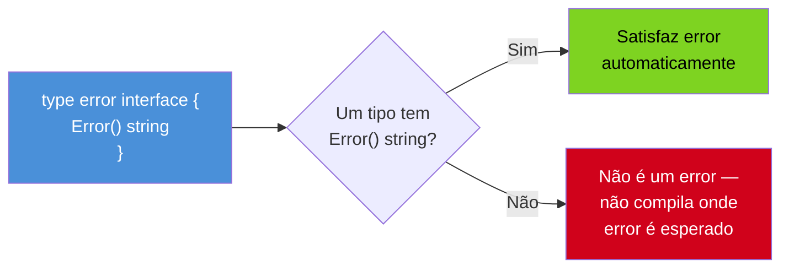
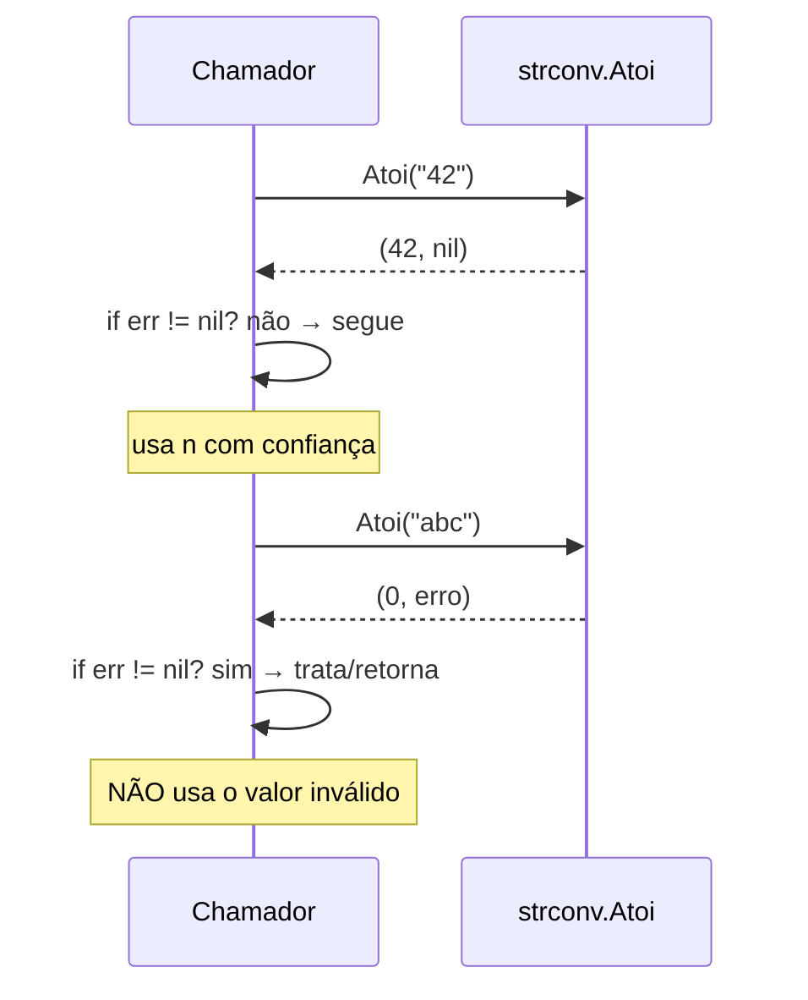

# Erros são valores — o tipo error

> [!abstract] TL;DR
> Em Go, um erro é só um **valor** — nada de `try`/`catch`, nada de fluxo de controle escondido. `error` é uma interface de um único método, `Error() string`; qualquer tipo que implemente esse método já "é" um erro (satisfação implícita, como qualquer interface em Go). Funções que podem falhar retornam **dois valores**: `(resultado, erro)`. O chamador checa o erro na hora — `if err != nil { return err }` — porque a falha está bem ali, no valor de retorno, não escondida numa exceção que pode atravessar dez chamadas de função sem ninguém perceber. É verboso comparado a `try`/`catch`? Sim. Mas o custo comprado é visibilidade total: todo ponto onde algo pode dar errado aparece explícito no código, sem exceção invisível te pegando de surpresa três camadas de chamada depois.

## O problema que "erro como exceção" cria

Imagine que você está lendo um arquivo de configuração em Java:

```java
Config config = loadConfig("app.yaml");
int timeout = config.getTimeout();
```

Duas linhas, aparência inocente. Mas quantos pontos de falha existem escondidos aí? `loadConfig` pode lançar `FileNotFoundException`, `IOException`, `YAMLParseException`. `getTimeout` pode lançar `NullPointerException` se `config` ficou de alguma forma inconsistente, ou `NumberFormatException` se o parsing interno falhou silenciosamente antes. Olhando só para essas duas linhas, você não sabe: elas podem lançar zero, uma ou cinco exceções diferentes, e a assinatura de `loadConfig` não denuncia nenhuma delas a menos que sejam *checked exceptions* — e mesmo aí, é fácil um desenvolvedor decidir "ah, vou envolver isso num `RuntimeException` e seguir em frente".

O problema não é que exceções sejam más ideias — é que elas criam um **caminho de controle invisível**. Uma função pode "retornar" de duas formas completamente diferentes (valor normal, ou uma exceção subindo a pilha de chamadas), e nada na assinatura da função avisa qual delas vai acontecer. JavaScript e Python têm a mesma característica: `throw`/`raise` interrompe o fluxo normal e sobe até encontrar um `catch`/`except`, potencialmente muitas funções acima de onde o erro nasceu.

Go faz uma aposta oposta. Em Go, a mesma operação fica assim:

```go
config, err := loadConfig("app.yaml")
if err != nil {
    return err
}
timeout := config.Timeout
```

Nada de invisível. `loadConfig` **declara na própria assinatura** que pode falhar — `func loadConfig(path string) (Config, error)` — e o chamador é obrigado, pela forma como a linguagem funciona, a decidir o que fazer com esse segundo valor de retorno. Não existe um `catch` distante capturando isso três chamadas acima sem você saber. O erro está ali, no mesmo lugar onde qualquer outro valor de retorno estaria.

## O tipo `error`: uma interface de um método só

A peça central desse design é surpreendentemente pequena. `error` é uma interface embutida na linguagem, declarada assim no pacote `builtin`:

```go
type error interface {
    Error() string
}
```

Um método. `Error() string`. Isso é tudo. Se você já passou pelo Galho 3 desta trilha, reconhece o padrão: em Go, um tipo satisfaz uma interface **implicitamente**, sem `implements` nenhum — basta ter os métodos certos no method set. `error` não é exceção a essa regra. Qualquer tipo que tenha um método `Error() string` já pode ser usado onde um `error` é esperado — nenhuma declaração explícita de "este tipo é um erro" é necessária.



A forma mais comum de criar um valor `error` é usando o pacote `errors` da biblioteca padrão, que fornece um tipo interno já pronto:

```go
package main

import (
    "errors"
    "fmt"
)

func dividir(a, b float64) (float64, error) {
    if b == 0 {
        return 0, errors.New("divisão por zero")
    }
    return a / b, nil
}

func main() {
    resultado, err := dividir(10, 0)
    if err != nil {
        fmt.Println("erro:", err)
        return
    }
    fmt.Println("resultado:", resultado)
}
```

`errors.New("divisão por zero")` devolve um valor que implementa `error` — por baixo, uma struct simples do pacote `errors` que guarda a string e implementa `Error() string` retornando ela. Quando você imprime `err` com `fmt.Println`, o `fmt` chama `Error()` automaticamente, porque qualquer tipo com esse método também satisfaz a interface `fmt.Stringer`-like que o `fmt` sabe reconhecer.

> [!question]- Por que a interface tem exatamente um método, e não mais?
> Quanto menor a interface, mais fácil satisfazê-la — esse é um princípio recorrente em Go (interfaces pequenas, como `io.Reader` com um único `Read`). Se `error` exigisse `Error() string` **e** `Code() int` **e** `Stack() []Frame`, qualquer tipo simples de erro — como uma string envolvida — teria que implementar tudo isso só para participar do sistema. Com um método só, é trivial: qualquer struct, qualquer tipo nomeado, até um `type MeuErro string` pode virar um `error` legítimo bastando implementar `Error() string`. A riqueza adicional (código, causa, stack) vem depois, por composição — assunto das próximas notas do galho, não desta interface mínima.

## O idioma `(T, error)` e o `if err != nil`

A convenção universal em Go — não é regra do compilador, é convenção seguida quase religiosamente pela comunidade e pela biblioteca padrão inteira — é que qualquer função que possa falhar retorna **dois valores**: o resultado e um `error`. Por convenção, o `error` vem **por último**.

```go
func Atoi(s string) (int, error)
func Open(name string) (*File, error)
func ReadFile(name string) ([]byte, error)
```

E o chamador segue um padrão igualmente universal: checar imediatamente, antes de usar o resultado.

```go
n, err := strconv.Atoi("42")
if err != nil {
    // tratar o erro AQUI, antes de qualquer coisa
    return err
}
// a partir daqui, n é confiável
fmt.Println(n * 2)
```



Repare que quando `Atoi("abc")` falha, ele não retorna "nada" no primeiro valor — retorna o **zero value** do tipo (`0`, para `int`). É por isso que a ordem do `if err != nil` importa tanto: o valor de resultado nunca é confiável até você ter checado o erro primeiro. Usar `n` antes de checar `err` é o erro mais comum de quem está aprendendo Go — o compilador não impede, porque `n` é um `int` perfeitamente válido do ponto de vista de tipos; só que semanticamente é lixo.

Esse padrão — checar, e se deu erro, devolver o erro pra cima imediatamente — é tão onipresente que ganhou apelido na comunidade: "if err != nil, return err" é praticamente um mantra, repetido inúmeras vezes por função em qualquer base de código Go real:

```go
func processarArquivo(caminho string) error {
    dados, err := os.ReadFile(caminho)
    if err != nil {
        return err
    }

    var config Config
    err = json.Unmarshal(dados, &config)
    if err != nil {
        return err
    }

    err = validar(config)
    if err != nil {
        return err
    }

    return nil
}
```

Quatro `if err != nil` seguidos, cada um guardando a porta de uma operação que pode falhar. Isso é o oposto do bloco `try { ... } catch (Exception e) { ... }` de uma linguagem com exceções, onde uma única captura no fim cobre qualquer falha que aconteça em qualquer das três operações. Go troca a concisão desse `try` único por **granularidade**: cada chamada tem seu próprio ponto de decisão, e você pode reagir diferente a cada falha específica se quiser (o que fica mais evidente na [[03 - Error wrapping e a cadeia de erros|nota 03]] e na [[06 - Estratégias de tratamento de erro|nota 06]]).

> [!info] `errors.New` vs `fmt.Errorf` — mesma ideia, formatação embutida
> Quando o texto do erro precisa de interpolação, `fmt.Errorf` é o caminho mais comum, produzindo um `error` a partir de uma string formatada — equivalente a `errors.New(fmt.Sprintf(...))`, mas em uma chamada só: `fmt.Errorf("arquivo %s não encontrado", caminho)`. A [[02 - Criando e comparando erros|próxima nota]] cobre isso em detalhe, incluindo o verbo `%w` (Go 1.13+) que também serve para *wrapping* — tema da nota 03.

## `error` é só uma interface — trate como qualquer outro valor

O ponto central desta nota, reforçado: `error` não tem tratamento especial na linguagem além de ser o tipo convencional para retorno de falha. Você pode guardá-lo numa variável, passá-lo como argumento, colocá-lo numa slice, comparar com `==`, e ele se comporta como qualquer outro valor de interface em Go — porque é exatamente isso que ele é.

```go
var meuErro error // zero value de uma interface é nil

fmt.Println(meuErro == nil) // true

meuErro = errors.New("algo quebrou")
fmt.Println(meuErro == nil) // false

errosAcumulados := []error{}
errosAcumulados = append(errosAcumulados, meuErro)
```

Não há palavra-chave `throw`, não há `raise`, não há bloco especial de sintaxe reservado para erros. Isso é deliberado — os autores de Go explicam essa escolha diretamente no post *Errors are values*, do blog oficial: tratar erro como qualquer outro valor significa que toda a expressividade da linguagem (funções de ordem superior, composição, structs, slices) já está disponível para trabalhar com erros, sem precisar de um sistema de exceções paralelo com suas próprias regras.

> [!warning] `if err != nil` esquecido é o bug silencioso mais comum em Go
> Como não há mecanismo de fluxo forçado — nada obriga você a checar um `error` retornado — é perfeitamente possível ignorar o segundo valor de retorno e seguir em frente com um resultado inválido:
> ```go
> dados, _ := os.ReadFile("config.yaml") // erro descartado com _
> // se o arquivo não existir, dados é nil — uso adiante quebra silenciosamente
> ```
> O compilador não reclama — descartar um valor de retorno com `_` é sintaxe válida. Ferramentas como `go vet` e linters (`errcheck`, incluído no `golangci-lint`) existem justamente para pegar esse padrão antes que vire bug em produção. Diferente de uma exceção não capturada, que pelo menos derruba o programa com stack trace, um erro ignorado em Go tende a se manifestar como comportamento incorreto silencioso — mais difícil de rastrear, não mais fácil.

> [!warning] Nil de `error` concreto dentro de uma interface não é `nil` de interface
> Uma armadilha clássica, mais avançada, que vale plantar aqui como aviso (volta com detalhe na [[04 - Erros customizados|nota 04]]): se você retorna um ponteiro nulo de um tipo concreto (`var p *MeuErro = nil`) como `error`, o valor de interface resultante **não é `nil`** — porque uma interface carrega tipo + valor, e o tipo (`*MeuErro`) está preenchido mesmo que o valor esteja nulo. `if err != nil` pode surpreender retornando `true` para um erro que "parece" nulo. A lição prática por agora: prefira retornar `nil` literal quando não há erro, não uma variável de tipo concreto que pode estar nula.

## Vindo de outras linguagens

| Vindo de... | Em Go é assim |
|---|---|
| Java `try/catch`, checked exceptions | Sem exceções para erros esperados; `(T, error)` no retorno, checagem explícita a cada chamada |
| Python `raise`/`except` | Mesmo espírito: falha é valor de retorno, não interrupção de fluxo |
| JavaScript `throw`/`try/catch`, Promise rejection | Sem equivalente de `throw` para fluxo normal; `error` é só mais um retorno |
| Rust `Result<T, E>` | Bem próximo em espírito — a diferença é que Go usa dois valores de retorno soltos, não um tipo `Result` genérico envolvendo os dois |

A comparação com Rust é a mais honesta: `Result<T, E>` e `(T, error)` resolvem o mesmo problema — tornar a falha visível no tipo de retorno — com mecânicas de linguagem diferentes. Rust empacota os dois numa única variante enum, forçando (via *pattern matching* exaustivo) que você lide com o `Err`. Go deixa os dois soltos como valores de retorno independentes e confia na convenção `if err != nil` para o mesmo efeito — sem forçar nada no nível do compilador, o que é exatamente por que ferramentas como `errcheck` existem para preencher essa lacuna.

## Como explicar em inglês

> In Go, errors are ordinary values, not a separate control-flow mechanism like exceptions. The `error` type is a one-method interface — `Error() string` — and any type implementing that method satisfies it implicitly, with no `implements` keyword. Functions that can fail return two values by convention, `(result, error)`, with the error last; callers check it immediately with the idiomatic `if err != nil { return err }` pattern, right where the call happens, instead of relying on a distant `catch` block that might be several stack frames away. This trades the conciseness of `try`/`catch` for total visibility: every fallible call is explicit in the code, and the compiler won't stop you from ignoring an error — that's what tools like `go vet` and `errcheck` are for.

| Termo PT | Termo EN |
|---|---|
| erro como valor | error as a value |
| interface de erro | error interface |
| checagem de erro | error check |
| descartar o erro | discard the error / swallow the error |
| valor zero | zero value |
| ponto de falha | failure point |
| retorno múltiplo | multiple return values |

## O que vem a seguir

Esta nota estabeleceu o mecanismo básico — `error` é uma interface, `errors.New` cria instâncias, `if err != nil` é o idioma de checagem. Mas o texto de um erro criado com `errors.New("divisão por zero")` é fixo: e se você precisar comparar erros entre si, identificar *qual* erro específico aconteceu (não só "algum erro aconteceu"), ou criar erros sentinela reutilizáveis como o `io.EOF` da biblioteca padrão? A [[02 - Criando e comparando erros|próxima nota]] cobre exatamente isso: `errors.New` vs `fmt.Errorf`, erros sentinela, e por que comparar erros com `==` funciona até certo ponto — e onde para de funcionar.

## Veja também

- [[02 - Criando e comparando erros|02 — Criando e comparando erros]] — próxima nota do galho
- [[03 - Error wrapping e a cadeia de erros|03 — Error wrapping e a cadeia de erros]] — `%w`, `errors.Is`/`errors.As`, a cadeia de causas
- [[03-Dominios/Tecnologia/Go/index|Trilha Go]]

## Fontes

- The Go Authors. *Effective Go — Errors*. go.dev. https://go.dev/doc/effective_go#errors (acessado em 2026-07-18)
- Rob Pike. *Errors are values*. The Go Blog, go.dev. https://go.dev/blog/errors-are-values (acessado em 2026-07-18)
- The Go Authors. *A Tour of Go — Errors*. go.dev. https://go.dev/tour/methods/19 (acessado em 2026-07-18)
- Go by Example. *Errors*. gobyexample.com. https://gobyexample.com/errors (acessado em 2026-07-18)
- pkg.go.dev. *Package errors*. https://pkg.go.dev/errors (acessado em 2026-07-18)
