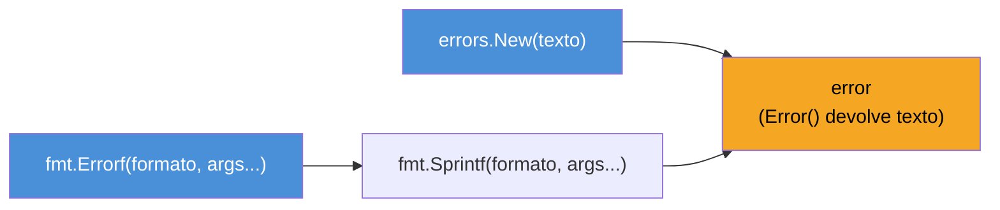
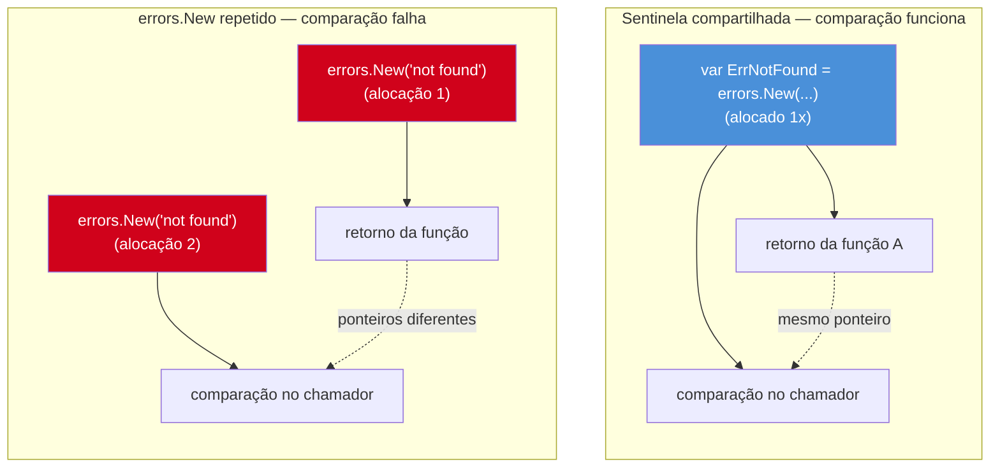

# Criando e comparando erros

> [!abstract] TL;DR
> Go tem duas formas primitivas de criar um `error`: `errors.New("mensagem")`, para um erro simples de string fixa, e `fmt.Errorf("formato %v", arg)`, para embutir valores na mensagem. Uma prática consagrada é declarar erros conhecidos como **variáveis de pacote** — os chamados *sentinel errors*, tipo `var ErrNotFound = errors.New("not found")` — para que o chamador possa comparar o erro recebido com `==` (ou `errors.Is`, adiantando a próxima nota) em vez de fazer *string matching* frágil. Mas essa comparação por igualdade tem um limite duro: `errors.New("not found")` chamado duas vezes produz **dois valores diferentes**, mesmo com a mesma mensagem — porque cada chamada aloca um `*errorString` novo, e ponteiros diferentes nunca são `==`. Comparar por igualdade só funciona quando as duas pontas — quem cria e quem compara — referenciam a **mesma variável**.

## O problema: "deu erro", mas qual erro?

A nota anterior estabeleceu que `error` é uma interface com um único método, `Error() string`. Isso resolve "como devolver que algo deu errado" — mas não resolve um problema mais específico: como o **código chamador** decide o que fazer diante de erros diferentes?

Imagine uma função que busca um usuário num mapa em memória:

```go
func BuscarUsuario(id int) (Usuario, error) {
    u, ok := usuarios[id]
    if !ok {
        return Usuario{}, fmt.Errorf("usuário %d não encontrado", id)
    }
    return u, nil
}
```

Funciona para logar o erro. Mas suponha que o chamador precise reagir de forma diferente conforme o motivo: se o usuário não existe, criar um registro novo; se a conexão com o banco caiu, tentar de novo. Com a implementação acima, a única informação disponível para decidir é a **string** da mensagem — e comparar strings pra tomar decisão de fluxo é exatamente o tipo de acoplamento frágil que qualquer linguagem tenta evitar. Mudar o texto de `"não encontrado"` para `"nao encontrado"` (tirando o acento num commit de limpeza) quebraria silenciosamente qualquer `if strings.Contains(err.Error(), "não encontrado")` espalhado pela base de código.

Quem vem de Java ou Python resolveria isso com **tipos de exceção**: `catch UsuarioNaoEncontradoException` versus `catch ConexaoException`. Go não tem exceções — mas tem uma saída igualmente estrutural, só que baseada em **valores comparáveis**, não em hierarquia de tipos. É o assunto desta nota.

## `errors.New`: o erro mais simples possível

O pacote `errors` da standard library expõe uma função com uma assinatura mínima:

```go
func New(text string) error
```

Ela devolve um `error` cuja implementação interna é um struct de um campo só (`*errorString`, não exportado), cujo `Error()` devolve exatamente a string passada:

```go
err := errors.New("conexão recusada")
fmt.Println(err)         // conexão recusada
fmt.Println(err.Error()) // conexão recusada
```

`errors.New` é a ferramenta certa quando a mensagem é **fixa** — não depende de nenhum valor da chamada. Se você precisa embutir um `id`, um `nome de arquivo`, um `código HTTP` na mensagem, `errors.New` obriga a concatenar strings manualmente (`errors.New("usuário " + strconv.Itoa(id) + " não encontrado")`), o que é estranho de escrever e de ler.

## `fmt.Errorf`: `errors.New` com formatação

`fmt.Errorf` resolve exatamente essa lacuna: mesma ideia de `errors.New`, mas com os verbos de formatação de `fmt.Sprintf` disponíveis:

```go
func Errorf(format string, a ...any) error
```

```go
id := 42
err := fmt.Errorf("usuário %d não encontrado", id)
fmt.Println(err) // usuário 42 não encontrado
```

Por baixo, `fmt.Errorf` é equivalente a `errors.New(fmt.Sprintf(...))` — a única diferença de comportamento (fora a formatação) é o verbo especial `%w`, que faz *error wrapping* e embrulha outro erro dentro do novo, preservando a cadeia causal. Esse verbo é o assunto inteiro da próxima nota do galho; aqui, tratamos `fmt.Errorf` só como o irmão formatado de `errors.New`.



> [!info] `any` no lugar de `interface{}`
> A assinatura `func Errorf(format string, a ...any) error` usa `any`, o apelido para `interface{}` introduzido no Go 1.18 junto com generics. Semanticamente idêntico a `interface{}` — só mais curto de ler. Aparece em qualquer assinatura moderna da standard library que aceite "qualquer tipo".

## Sentinel errors: erros que viram identidade

`errors.New` e `fmt.Errorf`, sozinhos, resolvem "criar um erro" — mas não resolvem "comparar erros" de forma robusta. A saída consagrada na comunidade Go é declarar erros conhecidos como **variáveis exportadas de pacote**, chamadas de *sentinel errors* — o termo vem de "valor sentinela", um valor específico usado como marcador reconhecível, não de "segurança":

```go
package repo

import "errors"

var ErrNotFound = errors.New("registro não encontrado")
var ErrConflito = errors.New("registro já existe")

func BuscarUsuario(id int) (Usuario, error) {
    u, ok := usuarios[id]
    if !ok {
        return Usuario{}, ErrNotFound
    }
    return u, nil
}
```

Agora o chamador não precisa fazer *string matching* — compara o erro devolvido com a variável sentinela, usando `==`, exatamente como compararia dois ponteiros ou dois inteiros:

```go
u, err := repo.BuscarUsuario(99)
if err == repo.ErrNotFound {
    fmt.Println("criar usuário novo")
} else if err != nil {
    fmt.Println("erro inesperado:", err)
}
```

Isso funciona porque `BuscarUsuario` devolve **o mesmo valor** `ErrNotFound` que o pacote declarou — não uma string igual, o mesmo valor de `error` guardado numa variável compartilhada. `err == repo.ErrNotFound` é uma comparação de interface: Go compara o par (tipo dinâmico, valor dinâmico) guardado em cada lado, e como os dois lados apontam pro mesmo `*errorString` alocado uma única vez no `var ErrNotFound = errors.New(...)`, a igualdade é verdadeira.

A convenção de nomenclatura da standard library — seguida por praticamente todo código Go idiomático — é prefixar sentinelas com `Err`: `sql.ErrNoRows`, `io.EOF` (exceção histórica ao prefixo, mas mesma ideia), `os.ErrNotExist`. Ver `Err` no início do nome de uma variável exportada é, por convenção, um sinal de que ela é uma sentinela pensada para comparação.

> [!question]- Por que não usar apenas constantes de string e comparar `err.Error() == "not found"`?
> Porque isso reintroduz exatamente o acoplamento frágil que a seção de abertura descreveu: qualquer mudança de texto (tradução, correção ortográfica, adição de contexto na mensagem) quebra a comparação silenciosamente, sem erro de compilação. Comparar contra uma variável sentinela é checado como qualquer outra comparação de valor em Go — o compilador garante que os dois lados são do mesmo tipo (`error`), e a comparação é por **identidade do valor alocado**, não por conteúdo textual. Trocar a mensagem de `ErrNotFound` não quebra nenhum `if err == ErrNotFound` existente, porque a variável continua sendo a mesma, só o texto que ela carrega muda.

## O limite: `errors.New` não é idempotente

Aqui mora a armadilha central desta nota, e é ela que explica por que sentinelas precisam ser **variáveis compartilhadas**, não recriadas a cada chamada:

```go
err1 := errors.New("not found")
err2 := errors.New("not found")

fmt.Println(err1 == err2) // false!
```

`err1` e `err2` têm exatamente a mesma mensagem — mas são valores diferentes. Cada chamada a `errors.New` aloca um `*errorString` novo em memória; comparar dois valores de interface `error` cujo tipo dinâmico é ponteiro (`*errorString`) compara os **endereços**, não o conteúdo apontado. `err1` e `err2` apontam para dois structs distintos, ainda que com o mesmo campo `s string`.



Isso significa que **qualquer função que crie um erro novo a cada chamada** — inclusive com `fmt.Errorf`, que sofre do mesmo problema — produz um valor incomparável por identidade com qualquer outro erro, mesmo textualmente idêntico. A única forma de comparação por `==` funcionar de verdade é as duas pontas (produtor e consumidor) referenciarem **a mesma variável declarada uma única vez**, tipicamente no nível de pacote.

> [!warning] `fmt.Errorf` para o mesmo propósito de sentinela não funciona
> `return fmt.Errorf("não encontrado")` dentro de uma função, chamado em execuções diferentes, produz erros diferentes a cada chamada — pela mesma razão do exemplo acima. Se a intenção é permitir que o chamador identifique "foi esse motivo específico", declare uma sentinela (`var ErrNotFound = errors.New(...)`) e devolva **essa variável**, nunca uma chamada nova de `errors.New`/`fmt.Errorf` com o mesmo texto.

## Casos práticos

**1. API de pacote com múltiplas sentinelas**, o padrão mais comum em código de produção:

```go
package cache

import "errors"

var (
    ErrChaveNaoExiste = errors.New("cache: chave não existe")
    ErrCacheCheio     = errors.New("cache: capacidade máxima atingida")
)

type Cache struct {
    dados    map[string]string
    limite   int
}

func (c *Cache) Get(chave string) (string, error) {
    v, ok := c.dados[chave]
    if !ok {
        return "", ErrChaveNaoExiste
    }
    return v, nil
}

func (c *Cache) Set(chave, valor string) error {
    if len(c.dados) >= c.limite {
        return ErrCacheCheio
    }
    c.dados[chave] = valor
    return nil
}
```

O chamador reage a cada sentinela de forma diferente sem depender de texto nenhum:

```go
if err := cache.Set("k", "v"); err != nil {
    switch err {
    case ErrCacheCheio:
        evictAntigo()
    default:
        log.Fatal(err)
    }
}
```

**2. `fmt.Errorf` para contexto que varia por chamada**, quando não faz sentido sentinela (a mensagem depende do input, e não há um "tipo de erro" fixo pra comparar depois):

```go
func ValidarIdade(idade int) error {
    if idade < 0 || idade > 150 {
        return fmt.Errorf("idade inválida: %d (esperado entre 0 e 150)", idade)
    }
    return nil
}
```

Aqui o chamador tipicamente só loga ou exibe o erro — não compara por identidade, porque não há um "motivo categorizável" reutilizável, é validação pontual de um valor específico.

**3. Combinando os dois** — sentinela para o tipo de falha, `fmt.Errorf` para adicionar contexto por cima (sem ainda usar `%w`, que é wrapping de verdade — aqui é só concatenar a mensagem da sentinela dentro de uma nova):

```go
var ErrSaldoInsuficiente = errors.New("saldo insuficiente")

func Sacar(conta *Conta, valor float64) error {
    if conta.Saldo < valor {
        return fmt.Errorf("saque de %.2f: %v", valor, ErrSaldoInsuficiente)
    }
    conta.Saldo -= valor
    return nil
}
```

> [!warning] `fmt.Errorf("%v", ErrSentinela)` quebra a comparação por `==`
> No exemplo acima, o erro devolvido por `Sacar` **não é mais** `ErrSaldoInsuficiente` — é um erro novo, cuja mensagem só *contém* o texto da sentinela. `err == ErrSaldoInsuficiente` no chamador dará `false`, porque `%v` embutiu a mensagem como texto, não preservou a identidade do valor. Se a intenção é acrescentar contexto **e** manter a sentinela comparável (com `errors.Is`, não `==`), o verbo certo é `%w`, não `%v` — assunto da nota seguinte deste galho.

## Armadilhas comuns

> [!warning] Comparar erros gerados dinamicamente com `==` é uma falsa segurança
> `err == errors.New("not found")` no meio de um `if` **nunca** dá `true`, porque o lado direito aloca uma sentinela nova a cada avaliação. É um erro fácil de não notar em revisão de código, porque compila sem aviso nenhum e o `if` simplesmente nunca entra no ramo esperado — falha silenciosa, não pane.

> [!warning] Sentinela não exportada não é comparável fora do pacote
> `var errInterno = errors.New(...)` (minúsculo) só pode ser referenciada dentro do próprio pacote. Se o chamador de outro pacote precisa distinguir esse erro, a sentinela precisa ser exportada (`ErrAlgumaCoisa`, maiúsculo) — do contrário, o consumidor externo só enxerga um `error` opaco, sem forma de comparar.

> [!warning] Mutar o texto de uma mensagem de erro em runtime não é possível (nem deveria ser)
> `errorString` guarda a mensagem como campo não exportado, imutável após a criação. Isso é proposital: um `error` é tratado como valor imutável em Go, igual qualquer outro valor — se a mensagem precisa variar por contexto, crie um erro novo (`fmt.Errorf`) em vez de tentar alterar um existente.

## Vindo de outras linguagens

| Linguagem | Mecanismo equivalente | Diferença chave em Go |
|---|---|---|
| Java | `throw new UsuarioNaoEncontradoException()` — hierarquia de classes de exceção | Sem hierarquia de tipos; comparação é por **identidade de valor** (`==` contra uma variável), não por `catch (TipoX e)` |
| Python | `raise ValueError("not found")` — captura por tipo com `except ValueError` | Go não distingue "tipos de erro" nativamente com `errors.New`; a distinção vem de **qual variável** foi devolvida, não de qual classe foi instanciada |
| Node/JS | `throw new Error("not found")`, às vezes com subclasses customizadas (`class NotFoundError extends Error`) | Sentinela em Go é mais parecida com comparar contra uma constante (`===` de referência) do que com `instanceof` |

A diferença mais profunda não é sintática — é filosófica. Linguagens com exceção tipada usam o **tipo** da exceção como o dado que carrega "qual erro é esse". Go usa o **valor** — uma variável específica, comparável — para o mesmo papel. É o mesmo espírito de "menos mecanismo, mais explícito" que já apareceu em métodos e receivers nos galhos anteriores.

## Como explicar em inglês

> Go gives you two primitive ways to create an `error`: `errors.New("message")` for a fixed string, and `fmt.Errorf("format %v", arg)` when you need to interpolate values. The idiomatic pattern for letting callers distinguish *why* something failed — without string matching — is the **sentinel error**: a package-level variable like `var ErrNotFound = errors.New("not found")`, conventionally prefixed with `Err`. Callers compare against it directly (`err == ErrNotFound`) instead of inspecting the message text. The catch is that `errors.New` is not idempotent — calling it twice with the same text produces two distinct values, because each call allocates a new `*errorString`, and pointer equality fails even though the text matches. Equality comparison only works when both sides reference the exact same variable, which is precisely why sentinels are declared once, at package scope, rather than constructed fresh inside a function.

| Termo PT | Termo EN |
|---|---|
| erro sentinela | sentinel error |
| valor sentinela | sentinel value |
| comparação por igualdade | equality comparison |
| comparação por identidade | identity comparison |
| erro embrulhado / encadeamento de erros | error wrapping / error chain |
| correspondência de string (frágil) | string matching (brittle) |
| variável de pacote | package-level variable |

## O que vem a seguir

Sentinelas resolvem a comparação direta — mas e quando o erro precisa carregar **contexto adicional** (o `id` que falhou, a operação que estava rodando) sem perder a capacidade de o chamador ainda reconhecer "isso é um `ErrNotFound`, só que com detalhe a mais"? É exatamente o problema que o verbo `%w` de `fmt.Errorf` resolve, junto com `errors.Is` e `errors.Unwrap` — a [[03 - Error wrapping e a cadeia de erros|nota 03]] trata do *error wrapping*: como embrulhar um erro dentro de outro sem perder a cadeia causal, e por que `errors.Is` é a ferramenta certa para comparar erros embrulhados, onde `==` já não alcança.

## Veja também

- [[01 - Erros são valores — o tipo error|01 — Erros são valores — o tipo error]] — a interface `error` e por que Go trata erro como valor de retorno, não exceção
- [[03 - Error wrapping e a cadeia de erros|03 — Error wrapping e a cadeia de erros]] — próxima nota: `%w`, `errors.Is`, `errors.Unwrap`
- [[04 - Erros customizados|04 — Erros customizados]] — quando uma sentinela de string não basta e o erro precisa carregar dados estruturados
- [[03-Dominios/Tecnologia/Go/index|Trilha Go]]

## Fontes

- The Go Authors. *Package errors*. pkg.go.dev. https://pkg.go.dev/errors (acessado em 2026-07-18)
- The Go Authors. *Package fmt — Errorf*. pkg.go.dev. https://pkg.go.dev/fmt#Errorf (acessado em 2026-07-18)
- The Go Authors. *Error handling and Go*. go.dev/blog. https://go.dev/blog/error-handling-and-go (acessado em 2026-07-18)
- Go by Example. *Errors*. gobyexample.com. https://gobyexample.com/errors (acessado em 2026-07-18)
- The Go Authors. *Effective Go — Errors*. go.dev. https://go.dev/doc/effective_go#errors (acessado em 2026-07-18)
