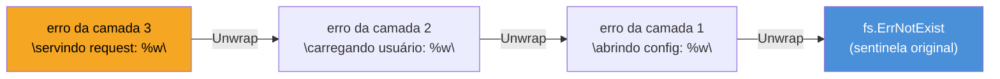
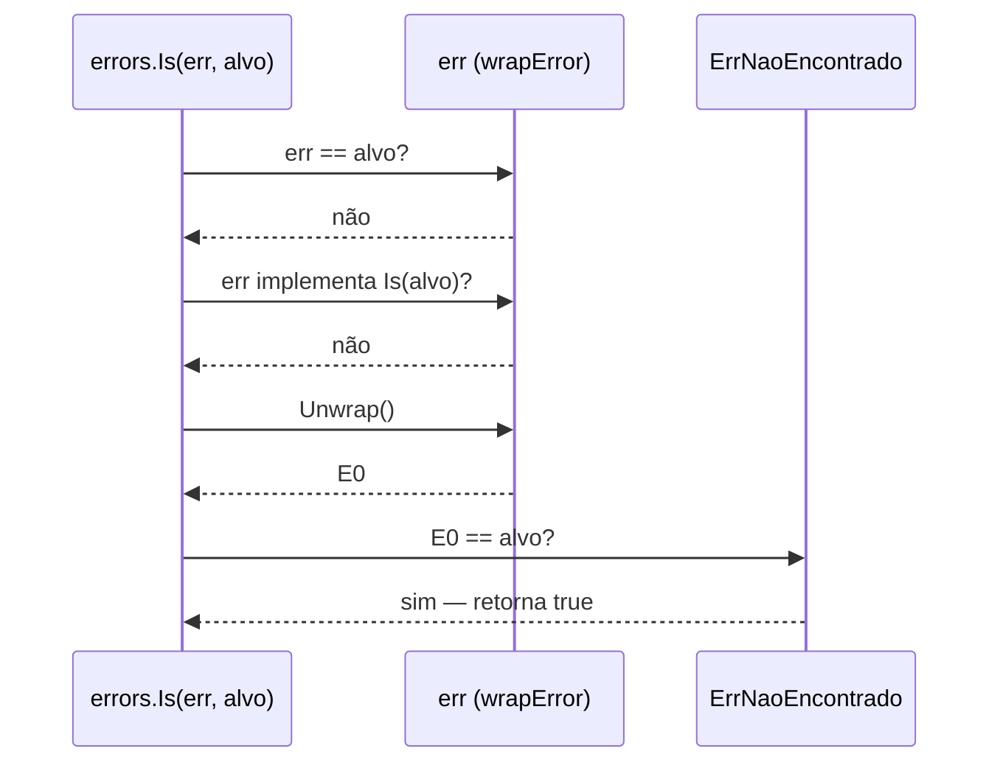

# Error wrapping e a cadeia de erros

> [!abstract] TL;DR
> `fmt.Errorf("abrindo config: %w", err)` embrulha um erro dentro de outro sem destruir o original — o `%w` (em vez de `%v` ou `%s`) grava `err` como **causa** recuperável do novo erro. Quem recebe o erro embrulhado só vê a mensagem concatenada, mas pode perguntar "esse erro, em algum ponto da cadeia, é `X`?" com `errors.Is`, ou "algum erro da cadeia tem o *tipo* `T`?" com `errors.As` — ambos andam a cadeia inteira seguindo o método `Unwrap() error` que `%w` gera implicitamente. O resultado: cada camada do seu código adiciona contexto ("abrindo config", "carregando usuário", "validando request") sem apagar a causa raiz, e código de decisão em qualquer camada continua enxergando o erro sentinela ou o tipo customizado lá no fundo, intacto.

## O problema que wrapping resolve

Imagina três camadas de código: uma função lê um arquivo de configuração, outra carrega o usuário a partir dele, uma terceira serve a request. Se `os.Open` falhar porque o arquivo não existe, `os` já devolve um erro cuja causa raiz é `fs.ErrNotExist` (nota 02 mostrou esse sentinela). Sem wrapping, a forma ingênua de propagar o erro é assim:

```go
func carregarConfig(caminho string) (*Config, error) {
    f, err := os.Open(caminho)
    if err != nil {
        return nil, fmt.Errorf("erro ao abrir config: %v", err) // %v — problema aqui
    }
    defer f.Close()
    // ...
    return cfg, nil
}
```

Isso compila, roda, e produz uma mensagem legível: `erro ao abrir config: open config.yaml: no such file or directory`. Mas repare no que se perdeu. `%v` formata `err` como **texto** e descarta o valor — o `error` original vira uma string colada dentro de outra string. Quem chama `carregarConfig` e quer decidir "se o problema foi arquivo ausente, crio um config padrão; qualquer outro erro, aborto" não tem mais como perguntar isso ao erro retornado. `errors.Is(err, fs.ErrNotExist)` sempre dá `false`, porque não existe mais nenhum `fs.ErrNotExist` de verdade na cadeia — só a *representação textual* dele, presa dentro de uma string maior. A única saída ficaria fazer `strings.Contains(err.Error(), "no such file")` — comparação de string, frágil, que quebra no dia em que alguém mudar a mensagem ou rodar o programa num locale diferente.

O problema de fundo: **contexto e causa competem pelo mesmo canal** (o texto da mensagem) quando você usa `%v`. Cada camada que adiciona uma frase de contexto ("abrindo config", "carregando usuário") empurra a causa original mais para dentro de uma string opaca, até ela virar irreconhecível para código — mesmo continuando perfeitamente legível para humano.

## `%w`: wrapping sem perder a causa

Go 1.13 resolveu isso com um verbo novo de formatação e duas funções no pacote `errors`. A mudança na função anterior é de um caractere:

```go
func carregarConfig(caminho string) (*Config, error) {
    f, err := os.Open(caminho)
    if err != nil {
        return nil, fmt.Errorf("erro ao abrir config: %w", err) // %w — a causa sobrevive
    }
    defer f.Close()
    return cfg, nil
}
```

> [!info] `%w` — Go 1.13+
> O verbo `%w` em `fmt.Errorf` foi introduzido em Go 1.13 (2019), junto com `errors.Is`, `errors.As` e `errors.Unwrap`. Antes disso, a única opção era `%v`, que sempre descartava a estrutura do erro original.

`%w` faz duas coisas ao mesmo tempo: formata `err` dentro da mensagem (exatamente como `%v` faria — a saída textual de `Error()` não muda) **e** faz o erro retornado implementar um método `Unwrap() error` que devolve `err` de volta, intacto, sem passar por `Error()`. A mensagem continua igual para quem só lê texto; mas agora existe um caminho programático de volta até a causa.



Cada `%w` acrescenta um elo. A cadeia inteira — do erro mais externo até o sentinela raiz — fica navegável em uma direção só: de fora para dentro, uma chamada de `Unwrap()` por vez. É exatamente o mesmo tipo de encadeamento de `caused by` que Java expõe com `Throwable.getCause()` ou Python com `raise ... from err` — só que em Go a cadeia é opt-in por verbo de formatação, não automática por `raise`/`throw`.

> [!question]- O erro embrulhado precisa ser sempre o último `%w` na string?
> Não precisa ser o último argumento posicionalmente — mas até Go 1.20 só era permitido **um** `%w` por chamada de `fmt.Errorf`. A partir do Go 1.20, `fmt.Errorf` aceita **múltiplos** `%w` na mesma chamada, produzindo um erro que embrulha vários erros ao mesmo tempo (útil para agregar falhas de operações paralelas, por exemplo `fmt.Errorf("%w e %w", err1, err2)`). Nesse caso o `Unwrap()` implícito muda de assinatura — vira `Unwrap() []error` em vez de `Unwrap() error` — e tanto `errors.Is` quanto `errors.As` já sabem percorrer essa forma em árvore.

## `Unwrap`: o contrato por trás do `%w`

`Unwrap` não é mágica exclusiva do `fmt.Errorf` — é só um método com uma assinatura combinada, que qualquer tipo de erro pode implementar manualmente:

```go
type errComContexto struct {
    msg   string
    causa error
}

func (e *errComContexto) Error() string {
    return e.msg + ": " + e.causa.Error()
}

func (e *errComContexto) Unwrap() error {
    return e.causa
}
```

Isso é, quase literalmente, o que `fmt.Errorf("...: %w", err)` gera para você por baixo dos panos, quando usado com um único `%w` — um tipo interno (não exportado) que guarda a mensagem formatada e o erro original, e expõe `Unwrap() error` devolvendo esse original. Saber disso importa por dois motivos práticos: primeiro, porque significa que **você pode construir sua próprio erro encadeável** sem depender de `fmt.Errorf`, algo que a próxima nota deste galho explora a fundo com erros customizados. Segundo, porque explica por que `errors.Is` e `errors.As` funcionam com qualquer erro que respeite esse contrato — não só com os que vêm de `%w`.

```go
var _ error = (*errComContexto)(nil) // errComContexto satisfaz error

err := &errComContexto{msg: "abrindo config", causa: fs.ErrNotExist}
fmt.Println(err)                 // abrindo config: file does not exist
fmt.Println(errors.Unwrap(err))  // file does not exist (o fs.ErrNotExist puro)
```

`errors.Unwrap(err)` é a função de pacote que chama `err.Unwrap()` se o erro implementar essa interface (chamada informalmente de `interface { Unwrap() error }`), ou devolve `nil` se não implementar. Você raramente chama `errors.Unwrap` diretamente em código de produção — ela é o passo elementar que `errors.Is` e `errors.As` repetem em loop.

## `errors.Is`: "esse erro, em algum ponto da cadeia, é este sentinela?"

A nota 02 já apresentou erros sentinela (`var ErrNotFound = errors.New("not found")`) e o problema de compará-los com `==` depois de wrapping. `errors.Is` resolve exatamente isso: percorre a cadeia inteira chamando `Unwrap()` repetidamente, comparando cada elo com o alvo.

```go
var ErrNaoEncontrado = errors.New("recurso não encontrado")

func buscar(id string) (*Recurso, error) {
    r, err := repositorio.Buscar(id)
    if err != nil {
        return nil, fmt.Errorf("buscando recurso %s: %w", id, err)
    }
    return r, nil
}

func main() {
    _, err := buscar("42")
    if errors.Is(err, ErrNaoEncontrado) {
        fmt.Println("recurso ausente — tratando como caso esperado")
        return
    }
    if err != nil {
        log.Fatal(err) // qualquer outro erro é inesperado
    }
}
```

Mesmo que `err` retornado por `buscar` seja um `*fmt.wrapError` cuja mensagem é `"buscando recurso 42: recurso não encontrado"`, `errors.Is(err, ErrNaoEncontrado)` dá `true` — porque a função desce a cadeia até achar exatamente o valor `ErrNaoEncontrado` em algum `Unwrap()`.



Por padrão, `errors.Is` compara com `==`. Mas um tipo de erro pode customizar essa comparação implementando `Is(target error) bool` — útil quando "ser igual" precisa de mais nuance que identidade de ponteiro (por exemplo, erros de rede que carregam um código de status e devem "ser iguais" se o código bater, mesmo sendo instâncias diferentes). `errors.Is` verifica esse método antes de cair na comparação padrão, em cada elo da cadeia.

## `errors.As`: "algum erro da cadeia tem este tipo?"

`errors.Is` responde "é este valor específico?". `errors.As` responde uma pergunta diferente: "existe, em algum ponto da cadeia, um erro deste **tipo**? Se sim, me dá ele, já convertido, para eu acessar os campos dele." É o equivalente, em erros, ao `catch (MinhaExcecaoCustomizada e)` de Java — só que sem hierarquia de classes, porque Go não tem herança.

```go
type ErroValidacao struct {
    Campo string
    Motivo string
}

func (e *ErroValidacao) Error() string {
    return fmt.Sprintf("campo %q inválido: %s", e.Campo, e.Motivo)
}

func validar(nome string) error {
    if nome == "" {
        return &ErroValidacao{Campo: "nome", Motivo: "não pode ser vazio"}
    }
    return nil
}

func processar(nome string) error {
    if err := validar(nome); err != nil {
        return fmt.Errorf("processando requisição: %w", err)
    }
    return nil
}

func main() {
    err := processar("")

    var errVal *ErroValidacao
    if errors.As(err, &errVal) {
        fmt.Println("campo problemático:", errVal.Campo) // nome
        fmt.Println("motivo:", errVal.Motivo)             // não pode ser vazio
        return
    }
    if err != nil {
        log.Fatal(err)
    }
}
```

Dois detalhes de assinatura que travam quem usa `errors.As` pela primeira vez:

1. **O segundo argumento é um ponteiro para o tipo que você quer**, não o tipo em si — `&errVal`, onde `errVal` já foi declarado com o tipo alvo (`var errVal *ErroValidacao`). `errors.As` preenche esse ponteiro se achar um match na cadeia.
2. **O tipo precisa satisfazer `error`** — no exemplo, `*ErroValidacao` (ponteiro), porque `Error()` foi declarado com receiver `*ErroValidacao`. Passar `var errVal ErroValidacao` (sem o `*`) e `&errVal` não bate com o tipo real armazenado na cadeia, e `errors.As` sempre devolve `false`.

`errors.As` percorre a cadeia do mesmo jeito que `errors.Is` — chamando `Unwrap()` repetidamente — só que em vez de comparar valores, compara **tipos** com uma verificação equivalente a *type assertion* (`err.(type)`) em cada elo, parando no primeiro que bate.

> [!warning] `errors.As` com tipo não-ponteiro que implementa `error` por valor
> Se seu tipo de erro tem `Error()` com receiver por valor (`func (e ErroValidacao) Error() string`), o valor armazenado na cadeia é `ErroValidacao` (não `*ErroValidacao`), e o `target` passado para `errors.As` precisa ser `*ErroValidacao` mesmo assim — `errors.As` sempre espera um ponteiro para o tipo alvo, seja esse tipo um ponteiro ou não. Confundir "ponteiro para o tipo de erro" com "tipo de erro que é ponteiro" é a fonte mais comum de `errors.As` retornando `false` silenciosamente sem panic algum.

## Preservando contexto sem perder a causa: o padrão completo

Juntando as três peças — `%w` na hora de propagar, `errors.Is` para sentinelas, `errors.As` para tipos — o padrão idiomático de propagação de erro em Go fica assim, em código que atravessa várias camadas:

```go
package main

import (
    "errors"
    "fmt"
    "io/fs"
    "log"
    "os"
)

func abrirConfig(caminho string) (*os.File, error) {
    f, err := os.Open(caminho)
    if err != nil {
        return nil, fmt.Errorf("abrindo config %s: %w", caminho, err)
    }
    return f, nil
}

func carregarApp(caminho string) error {
    _, err := abrirConfig(caminho)
    if err != nil {
        return fmt.Errorf("carregando app: %w", err)
    }
    return nil
}

func main() {
    err := carregarApp("config.yaml")
    if err == nil {
        return
    }

    fmt.Println(err) // carregando app: abrindo config config.yaml: open config.yaml: no such file or directory

    switch {
    case errors.Is(err, fs.ErrNotExist):
        fmt.Println("→ arquivo ausente: criando config padrão")
    case errors.Is(err, fs.ErrPermission):
        fmt.Println("→ sem permissão: abortando com instrução ao usuário")
    default:
        log.Fatal("erro inesperado:", err)
    }
}
```

Cada camada (`abrirConfig`, `carregarApp`) só sabe do que aconteceu **na própria camada** — não precisa conhecer `fs.ErrNotExist` nem propagar esse conhecimento manualmente. E ainda assim, `main`, três níveis acima, consegue perguntar diretamente ao sentinela do pacote `io/fs`, porque `%w` preservou a cadeia inteira intacta. Isso é o que "preservar contexto sem perder a causa" significa na prática: a mensagem cresce a cada camada (bom para logs e debug humano), e a estrutura sobrevive intacta (bom para decisão programática).

## Agregando várias falhas: `errors.Join` e `%w` múltiplo

Até aqui, cada erro na cadeia tinha exatamente um `Unwrap()` — uma linha reta. Mas às vezes uma operação dispara várias sub-operações independentes (validar vários campos de um formulário, fechar vários recursos num `defer`) e você quer relatar **todas** as falhas, não só a primeira. Go 1.20 endereçou isso com `errors.Join` e com suporte a múltiplos `%w` na mesma `fmt.Errorf`:

```go
func validarFormulario(nome, email string) error {
    var erros []error
    if nome == "" {
        erros = append(erros, &ErroValidacao{Campo: "nome", Motivo: "vazio"})
    }
    if email == "" {
        erros = append(erros, &ErroValidacao{Campo: "email", Motivo: "vazio"})
    }
    return errors.Join(erros...) // nil se erros estiver vazio
}

func main() {
    err := validarFormulario("", "")
    fmt.Println(err)
    // campo "nome" inválido: vazio
    // campo "email" inválido: vazio

    var errVal *ErroValidacao
    if errors.As(err, &errVal) {
        fmt.Println("primeiro campo com problema:", errVal.Campo) // nome
    }
}
```

`errors.Join(erros...)` devolve um único `error` cujo `Unwrap() []error` (não `Unwrap() error` — a forma em árvore) expõe todos os erros originais. `errors.Is` e `errors.As` percorrem essa árvore inteira, não só um caminho: `errors.As` acima acha o primeiro `*ErroValidacao` que bate, seguindo a ordem em que os erros foram unidos. `errors.Join` existe desde Go 1.20 — a mesma versão que liberou múltiplos `%w` em `fmt.Errorf("%w e %w", err1, err2)`, ambos usando a mesma extensão de `Unwrap` para `[]error`.

> [!info] `errors.Join` e múltiplos `%w` — Go 1.20+
> Antes do Go 1.20, `Unwrap() error` só permitia uma cadeia linear — no máximo uma causa por erro. `errors.Join` e o suporte a múltiplos `%w` introduziram `Unwrap() []error`, e `errors.Is`/`errors.As` foram atualizados para tratar ambas as formas de forma transparente — código que já usava essas duas funções não precisou mudar para ganhar suporte a árvores de erro.

> [!warning] Misturar `%v` e `%w` na mesma cadeia quebra o elo naquele ponto
> Se qualquer camada intermediária usar `%v` em vez de `%w`, a cadeia se rompe ali — `errors.Is`/`errors.As` não conseguem atravessar aquele elo, porque não existe `Unwrap()` produzido por `%v`. O erro final continua com mensagem legível (o texto está todo lá), mas vira opaco para código a partir daquele ponto. É um bug silencioso: compila, roda, os logs parecem corretos — só a lógica de decisão que depende de `errors.Is`/`errors.As` some sem aviso.

> [!warning] `err.Error()` contendo a palavra certa não é o mesmo que `errors.Is` dar `true`
> É tentador "confirmar visualmente" que o wrapping funcionou só olhando a mensagem impressa — mas mensagem concatenada por `%w` e por `%v` fica **idêntica** ao olho humano. A única forma de garantir que a cadeia está navegável é testar com `errors.Is`/`errors.As` de verdade (ou revisar o código à procura de `%v` onde devia haver `%w`), nunca inspecionar a string.

## Lente cross-stack

| Vindo de | Em Go, isso é |
|---|---|
| Java `throw new AppException("contexto", causaOriginal)` + `getCause()` | `fmt.Errorf("contexto: %w", causaOriginal)` + `errors.Unwrap`/cadeia percorrida por `errors.Is`/`errors.As` |
| Python `raise NovoErro("contexto") from erroOriginal` + `__cause__` | mesmo papel — `%w` é o `from` explícito de Go, sem sintaxe própria de `raise` |
| JavaScript `new Error("contexto", { cause: erroOriginal })` (`Error.cause`, ES2022) | equivalente direto — ambos guardam a causa como campo navegável, não só concatenada na mensagem |
| `instanceof MinhaExcecao` / `except MeuErro as e` | `errors.As(err, &alvo)` — sem hierarquia de classes, comparando pelo tipo concreto armazenado na cadeia |

A diferença estrutural que sobrevive à comparação: nas outras linguagens, a cadeia de causas é automática e embutida no mecanismo de exceção (`cause`, `__cause__`, `getCause()` sempre existem se você usar `raise ... from` ou o construtor certo). Em Go, a cadeia **só existe se você a construir** — trocar `%w` por `%v` uma única vez, em qualquer camada, já é suficiente para quebrá-la sem erro de compilação nem aviso em tempo de execução.

## Como explicar em inglês

> `fmt.Errorf` with the `%w` verb wraps an error while preserving it as a programmatically recoverable **cause**, instead of just flattening it into the message text the way `%v` does. Wrapping generates an implicit `Unwrap() error` method, so `errors.Is` can walk the whole chain asking "is this — anywhere in the chain — this specific sentinel value?", and `errors.As` can walk it asking "is there an error of this concrete type anywhere in the chain?", filling in a pointer to it if so. The pattern that falls out of this is layered error handling: each layer adds its own context string via `%w` without erasing the root cause, so code several layers up can still branch on a sentinel like `fs.ErrNotExist` or unwrap a custom error type to read its fields — as long as every layer in between used `%w` and not `%v`. Swap even one `%w` for `%v` anywhere in the chain and it silently breaks from that point on: the printed message still reads fine, but `errors.Is`/`errors.As` can no longer see past that link.

| Termo PT | Termo EN |
|---|---|
| embrulhar / envolver um erro | wrap an error |
| cadeia de erros | error chain |
| erro sentinela | sentinel error |
| desembrulhar | unwrap |
| causa raiz | root cause |
| percorrer a cadeia | walk the chain |
| quebrar o elo | break the link |

## O que vem a seguir

`errors.As` desta nota já usou um erro customizado (`ErroValidacao`) para mostrar como acessar campos específicos depois de encontrar o tipo certo na cadeia — mas só de raspão, focado no mecanismo de busca. A [[04 - Erros customizados|nota 04]] entra a fundo em como *desenhar* esses tipos: quando vale a pena ir além de `errors.New`, como estruturar campos que carregam contexto estruturado (não só texto), e o método `Is`/`As` customizado que alguns tipos de erro implementam para controlar sua própria comparação.

## Veja também

- [[01 - Erros são valores — o tipo error|01 — Erros são valores — o tipo error]] — a interface `error` e por que erro é só um valor como outro qualquer
- [[02 - Criando e comparando erros|02 — Criando e comparando erros]] — erros sentinela e o problema de comparação com `==` que o wrapping precisa contornar
- [[04 - Erros customizados|04 — Erros customizados]] — próxima nota do galho
- [[03-Dominios/Tecnologia/Go/index|Trilha Go]]

## Fontes

- The Go Authors. *Working with Errors in Go 1.13*. go.dev/blog. https://go.dev/blog/go1.13-errors (acessado em 2026-07-18)
- The Go Authors. *Package errors*. pkg.go.dev. https://pkg.go.dev/errors (acessado em 2026-07-18)
- The Go Authors. *Package fmt*. pkg.go.dev. https://pkg.go.dev/fmt (acessado em 2026-07-18)
- The Go Authors. *Go 1.20 Release Notes — Wrapping multiple errors*. go.dev. https://go.dev/doc/go1.20#errors (acessado em 2026-07-18)
- Go by Example. *Errors*. gobyexample.com. https://gobyexample.com/errors (acessado em 2026-07-18)

