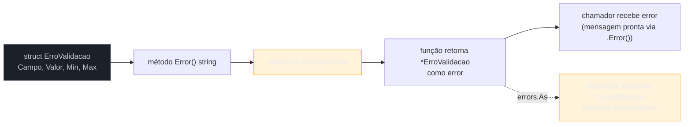
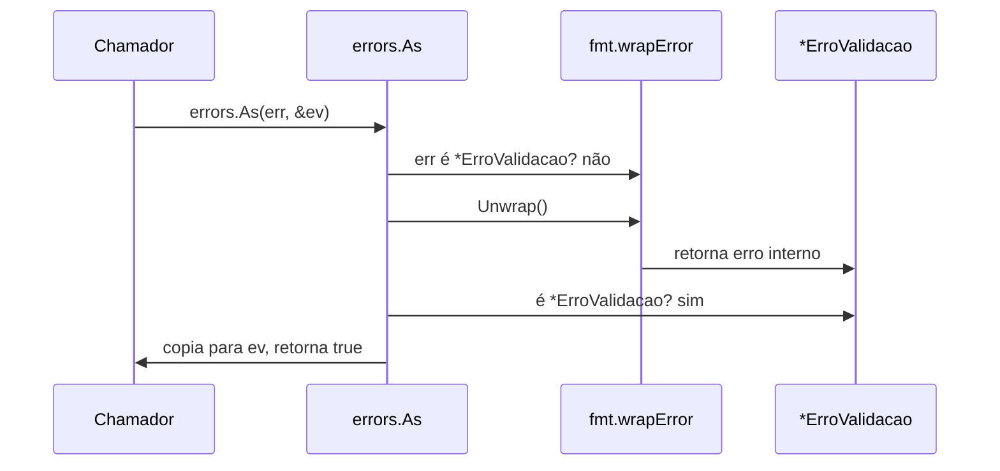

# Erros customizados

> [!abstract] TL;DR
> Um erro em Go não precisa ser só uma string envolta em `errors.New` — pode ser um **struct que implementa a interface `error`**, carregando dados estruturados (código, campo inválido, valor recebido) que o chamador consegue extrair de volta. A conexão entre "criar meu próprio tipo de erro" e "recuperar esse tipo depois" é `errors.As`: ele percorre a cadeia de wrapping (nota 03) procurando um erro que caiba no tipo de destino, e — se achar — copia o valor para dentro, dando acesso aos campos extras. Vale a pena criar um tipo customizado quando o chamador precisa **agir diferente** dependendo do que deu errado (não só logar a mensagem); se a única coisa que importa é "deu erro, pare", uma sentinela (nota 02) já resolve.

## O problema: a mensagem de erro não dá para programar em cima dela

Imagine uma função de validação que recebe um formulário de cadastro:

```go
func ValidarIdade(idade int) error {
    if idade < 0 {
        return fmt.Errorf("idade inválida: %d", idade)
    }
    if idade > 150 {
        return fmt.Errorf("idade inválida: %d", idade)
    }
    return nil
}
```

O chamador recebe um `error` e, na prática, só pode fazer uma coisa útil com ele: imprimir a mensagem. Ele não sabe, sem fazer *parsing* de string (frágil, feio, e quebra a primeira vez que alguém mudar o texto), **qual foi o campo problemático** nem **qual valor foi recebido**. Se a interface gráfica precisa destacar o campo `idade` em vermelho e mostrar "150 está fora do intervalo permitido (0–150)", ela precisaria extrair esses dados de dentro de uma string formatada — algo do tipo `strings.Contains(err.Error(), "idade")`, que quebra no primeiro `i18n` ou na primeira reformulação da mensagem.

O problema de fundo: `fmt.Errorf` produz um erro que só sabe fazer uma coisa — se descrever como texto. Ele não carrega **estrutura**. E é exatamente aí que um tipo de erro customizado entra: em vez de empacotar os dados relevantes dentro de uma frase, você os guarda em **campos de struct**, e usa a formatação de texto só como a *representação final* desses dados — não como o único lugar onde eles existem.

## O mecanismo: um struct que implementa `error`

A [[01 - Erros são valores — o tipo error|nota 01]] já estabeleceu que `error` é só uma interface com um método:

```go
type error interface {
    Error() string
}
```

Qualquer tipo que tenha um método `Error() string` satisfaz essa interface — inclusive um struct seu, com quantos campos você quiser além do texto da mensagem:

```go
type ErroValidacao struct {
    Campo string
    Valor int
    Min   int
    Max   int
}

func (e *ErroValidacao) Error() string {
    return fmt.Sprintf("campo %q inválido: valor %d fora do intervalo [%d, %d]",
        e.Campo, e.Valor, e.Min, e.Max)
}
```



`ErroValidacao` agora tem duas vidas simultâneas: para quem só quer imprimir, `err.Error()` (chamado implicitamente por `fmt.Println(err)`, por exemplo) devolve uma frase pronta. Para quem quer **decidir algo** com base no erro — destacar o campo `Campo`, comparar `Valor` com `Max` de novo, montar uma resposta JSON estruturada — os campos estão ali, acessíveis, sem nenhum parsing de string.

> [!info] Pointer receiver é a convenção padrão para erros customizados
> Repare que o método está em `func (e *ErroValidacao) Error() string`, com **pointer receiver** — não `func (e ErroValidacao)`. A convenção da comunidade Go, seguida por `os.PathError`, `strconv.NumError` e praticamente todo tipo de erro na standard library, é retornar `&ErroValidacao{...}` (um ponteiro) em vez do valor. Isso importa por dois motivos: evita copiar o struct inteiro a cada `return`, e — crucial para `errors.Is` — garante que comparações de identidade funcionem de forma previsível quando o mesmo erro circula por várias camadas. Se o método estivesse em value receiver, tanto `ErroValidacao` quanto `*ErroValidacao` satisfariam a interface `error` de formas sutilmente diferentes (method set — ver [[03-Dominios/Tecnologia/Go/02 - Tipos, structs e métodos/04 - Value vs pointer receiver|Galho 2, nota 04]]), fonte comum de confusão.

Agora a função de validação retorna esse tipo em vez de uma string genérica:

```go
func ValidarIdade(idade int) error {
    if idade < 0 || idade > 150 {
        return &ErroValidacao{Campo: "idade", Valor: idade, Min: 0, Max: 150}
    }
    return nil
}
```

## Recuperando o tipo customizado: `errors.As`

Criar o tipo é metade da história. A outra metade é: como o chamador, recebendo um `error` genérico, descobre que na verdade é um `*ErroValidacao` e acessa `Campo`, `Valor`, `Min`, `Max`?

A resposta ingênua — uma type assertion direta — até funciona em código simples:

```go
err := ValidarIdade(200)
if ev, ok := err.(*ErroValidacao); ok {
    fmt.Println("campo com problema:", ev.Campo)
}
```

Mas ela quebra silenciosamente no instante em que `err` passa por **wrapping** (nota 03) — por exemplo, se uma camada intermediária faz `fmt.Errorf("cadastro falhou: %w", err)`. Nesse caso, `err.(*ErroValidacao)` falha, porque o `error` concreto na mão do chamador agora é um `*fmt.wrapError`, não um `*ErroValidacao` — mesmo que o `*ErroValidacao` original ainda exista, embrulhado lá dentro.

`errors.As` resolve isso: ele **percorre a cadeia de `Unwrap()`** inteira, camada por camada, procurando um erro cujo tipo dinâmico seja atribuível ao ponteiro de destino — e, ao achar, copia o valor para dentro do destino:

```go
err := ValidarIdade(200)
err = fmt.Errorf("cadastro falhou: %w", err) // embrulhado

var ev *ErroValidacao
if errors.As(err, &ev) {
    fmt.Println("campo:", ev.Campo, "valor:", ev.Valor) // idade 200
}
```



`errors.As(err, &ev)` recebe dois argumentos: o erro a inspecionar e um **ponteiro** para uma variável do tipo que você quer extrair (`&ev`, onde `ev` é `*ErroValidacao`). Se a chamada retorna `true`, `ev` foi preenchido — o erro concreto encontrado na cadeia foi copiado para dentro dele. Se retorna `false`, nenhum erro daquele tipo existe em nenhum ponto da cadeia, e `ev` continua `nil`.

> [!warning] O segundo argumento de `errors.As` precisa ser um ponteiro para um tipo que implementa `error`
> É um erro comum passar `ev` em vez de `&ev` — `errors.As(err, ev)` em vez de `errors.As(err, &ev)`. Isso não compila silenciosamente errado: `errors.As` faz *panic* em tempo de execução se o segundo argumento não for um ponteiro não-nulo para um tipo que satisfaz `error`. A mensagem de panic (`errors.As: target must be a non-nil pointer`) é clara, mas só aparece quando a linha roda — vale grifar o padrão `var x *TipoDeErro; errors.As(err, &x)` como reflexo automático.

## Quando vale criar um tipo customizado (e quando não vale)

Nem todo erro merece um struct próprio. A régua prática:

- **Sentinela (`errors.New`, nota 02)** — quando o chamador só precisa saber **se** um erro específico aconteceu, sem dado extra. `sql.ErrNoRows`, `io.EOF` — a resposta do chamador é sempre "trate esse caso especial", nunca "me diga o valor que causou o problema".
- **Tipo customizado (struct com `Error()`)** — quando o chamador precisa **dados** além de "aconteceu": qual campo, qual valor recebido, qual código HTTP corresponde, quantas tentativas já foram feitas. Se a resposta certa ao erro varia de acordo com informação que só o produtor do erro tinha, essa informação precisa viajar dentro do erro — e uma sentinela não carrega payload nenhum.

Um exemplo mais rico, comum em APIs que precisam devolver um código de erro estruturado (sem entrar em como isso vira resposta HTTP — assunto de um galho mais à frente na trilha):

```go
type ErroAPI struct {
    Codigo   string // ex.: "RECURSO_NAO_ENCONTRADO"
    Mensagem string
    Causa    error // erro original, para wrapping — ver próxima seção
}

func (e *ErroAPI) Error() string {
    if e.Causa != nil {
        return fmt.Sprintf("[%s] %s: %v", e.Codigo, e.Mensagem, e.Causa)
    }
    return fmt.Sprintf("[%s] %s", e.Codigo, e.Mensagem)
}
```

Aqui `Codigo` é o dado que uma camada superior consegue mapear para um comportamento — por exemplo, decidir se tenta de novo, se aborta, ou qual mensagem mostrar ao usuário final — sem nunca precisar interpretar texto livre.

## Carregando a causa: erro customizado que também encadeia

Um tipo de erro customizado pode, ao mesmo tempo, participar da cadeia de wrapping da nota 03 — basta implementar `Unwrap() error` devolvendo o erro interno:

```go
type ErroAPI struct {
    Codigo   string
    Mensagem string
    Causa    error
}

func (e *ErroAPI) Error() string {
    return fmt.Sprintf("[%s] %s", e.Codigo, e.Mensagem)
}

func (e *ErroAPI) Unwrap() error {
    return e.Causa // habilita errors.Is / errors.As a continuar descendo a cadeia
}
```

Com `Unwrap()` implementado, `ErroAPI` não é um beco sem saída: se `Causa` guarda, por exemplo, um erro de banco de dados, `errors.Is(err, sql.ErrNoRows)` continua funcionando através do `*ErroAPI`, exatamente como funcionaria através de um `fmt.Errorf("...: %w", ...)`. Isso combina os dois mundos — dados estruturados próprios (`Codigo`, `Mensagem`) **e** participação na cadeia de causas (nota 03) — sem precisar escolher um ou outro.

```go
func BuscarUsuario(id int) (*Usuario, error) {
    u, err := db.Query(id)
    if err != nil {
        return nil, &ErroAPI{
            Codigo:   "FALHA_BUSCA",
            Mensagem: "não foi possível buscar o usuário",
            Causa:    err, // preserva sql.ErrNoRows, se for o caso
        }
    }
    return u, nil
}

// no chamador:
_, err := BuscarUsuario(42)
if errors.Is(err, sql.ErrNoRows) {
    fmt.Println("usuário não existe")
}

var errAPI *ErroAPI
if errors.As(err, &errAPI) {
    fmt.Println("código:", errAPI.Codigo)
}
```

## Casos práticos

**1. Erro de validação com múltiplos campos**, retomando `ErroValidacao` num fluxo completo:

```go
package main

import (
    "errors"
    "fmt"
)

type ErroValidacao struct {
    Campo string
    Valor int
    Min   int
    Max   int
}

func (e *ErroValidacao) Error() string {
    return fmt.Sprintf("campo %q inválido: valor %d fora do intervalo [%d, %d]",
        e.Campo, e.Valor, e.Min, e.Max)
}

func ValidarIdade(idade int) error {
    if idade < 0 || idade > 150 {
        return &ErroValidacao{Campo: "idade", Valor: idade, Min: 0, Max: 150}
    }
    return nil
}

func main() {
    err := ValidarIdade(200)

    var ev *ErroValidacao
    if errors.As(err, &ev) {
        fmt.Printf("corrija o campo %s: recebido %d, esperado entre %d e %d\n",
            ev.Campo, ev.Valor, ev.Min, ev.Max)
    }
}
```

**2. Tipo de erro com código, comparável por igualdade estrutural** — quando os campos do erro são simples o bastante para permitir `==` direto (sem `errors.As`), porque `ErroAPI` aqui não tem ponteiro nem slice como campo:

```go
type ErroAPI struct {
    Codigo   string
    Mensagem string
}

func (e ErroAPI) Error() string {
    return fmt.Sprintf("[%s] %s", e.Codigo, e.Mensagem)
}

func BuscarConfig(chave string) (string, error) {
    valor, existe := configs[chave]
    if !existe {
        return "", ErroAPI{Codigo: "CONFIG_AUSENTE", Mensagem: "chave não configurada: " + chave}
    }
    return valor, nil
}

func main() {
    _, err := BuscarConfig("timeout")

    var eAPI ErroAPI
    if errors.As(err, &eAPI) && eAPI.Codigo == "CONFIG_AUSENTE" {
        fmt.Println("use um valor padrão")
    }
}
```

> [!info] `errors.As` funciona com value receiver também — a diferença é o que você passa como destino
> No exemplo acima, `ErroAPI` implementa `Error()` com **value receiver**, e a função retorna `ErroAPI{...}` (valor, não ponteiro). `errors.As` continua funcionando, mas o destino precisa casar: `var eAPI ErroAPI; errors.As(err, &eAPI)` — não `var eAPI *ErroAPI`. A convenção da standard library (pointer receiver + retorno de ponteiro, como na seção anterior) evita essa ambiguidade e é a escolha recomendada por padrão; a versão com value receiver aqui serve para deixar explícito que a interface `error` não exige ponteiro — só é a prática dominante.

**3. Erro customizado que encadeia uma causa de I/O**, unindo `Unwrap` com `errors.Is`:

```go
package main

import (
    "errors"
    "fmt"
    "os"
)

type ErroConfig struct {
    Arquivo string
    Causa   error
}

func (e *ErroConfig) Error() string {
    return fmt.Sprintf("falha ao carregar config de %s: %v", e.Arquivo, e.Causa)
}

func (e *ErroConfig) Unwrap() error {
    return e.Causa
}

func CarregarConfig(caminho string) error {
    _, err := os.ReadFile(caminho)
    if err != nil {
        return &ErroConfig{Arquivo: caminho, Causa: err}
    }
    return nil
}

func main() {
    err := CarregarConfig("config.yaml")

    if errors.Is(err, os.ErrNotExist) {
        fmt.Println("arquivo de config não existe — usando defaults")
    }

    var ec *ErroConfig
    if errors.As(err, &ec) {
        fmt.Println("arquivo problemático:", ec.Arquivo)
    }
}
```

## Armadilhas comuns

> [!warning] Comparar erro customizado com `==` quebra se ele tiver campos incomparáveis
> Se `ErroValidacao` tivesse um campo `[]string` ou `map[string]int`, `err1 == err2` nem compilaria (`invalid operation: comparing incomparable type`). É outro motivo para preferir ponteiro (`*ErroValidacao`) como convenção: comparar dois ponteiros é sempre válido — compara identidade, não conteúdo — e `errors.Is`/`errors.As` são o mecanismo certo para comparar por tipo ou por sentinela, não `==` direto entre valores de erro estruturado.

> [!warning] Esquecer de implementar `Unwrap()` quebra a cadeia silenciosamente
> Um tipo customizado que guarda uma `Causa error` só participa de `errors.Is`/`errors.As` **através** dessa causa se implementar `Unwrap() error`. Sem esse método, o erro interno fica "preso" dentro do struct — visível para quem sabe o nome do campo, invisível para qualquer código genérico que use `errors.Is`. É um bug fácil de não notar em teste manual (a mensagem de erro continua parecendo certa) e só aparece quando alguém tenta `errors.Is(err, sql.ErrNoRows)` em produção e recebe `false` sem entender por quê.

> [!warning] Exportar o tipo, mas não necessariamente todos os campos
> Se `ErroValidacao` vai ser usado por código de outro pacote (via `errors.As`), o **tipo** precisa ser exportado (`ErroValidacao`, maiúsculo) — senão nenhum pacote externo consegue declarar `var ev *pacote.errovalidacao` para passar a `errors.As`. Os campos individuais podem ou não ser exportados, dependendo de que dado o chamador realmente precisa ler; campos internos de contabilidade (um contador de retries, por exemplo) podem ficar minúsculos e privados.

## Vindo de outras linguagens

| Linguagem | Como se faz "erro com dados extras" |
|---|---|
| Java | Subclasse de `Exception` com campos e construtor próprios (`class ValidationException extends Exception { int campo; }`); captura por tipo via `catch (ValidationException e)` |
| Python | Subclasse de `Exception` com `__init__` guardando atributos; captura por tipo via `except ValidationError as e` |
| Node/JS | Subclasse de `Error` com propriedades extras (`class ValidationError extends Error { constructor(campo) {...} }`); checagem via `instanceof` |
| Go | Struct que implementa `Error() string`; "captura por tipo" é `errors.As(err, &destino)`, que também atravessa wrapping — hierarquia de herança não existe, mas `Unwrap()` cumpre papel parecido para causas encadeadas |

A diferença mais importante não é sintática — é que, em Go, esse "erro customizado" nunca interrompe o fluxo de controle sozinho. Ele é só um valor de retorno como outro qualquer; a interrupção de fluxo (quando existe) fica reservada para `panic`, assunto da [[05 - panic e recover|próxima nota]].

## Como explicar em inglês

> A custom error type in Go is just a struct that implements the `error` interface — a method `Error() string` — with extra fields carrying whatever structured data the caller actually needs: which field failed, what value was received, an application-specific error code. The convention, followed throughout the standard library (`*os.PathError`, `*strconv.NumError`), is a pointer receiver and returning a pointer, which keeps equality checks predictable and avoids copying the struct on every return. Recovering the concrete type from a generic `error` — even one that's been wrapped several layers deep — is `errors.As(err, &target)`: it walks the `Unwrap()` chain looking for an error assignable to the target's type, and copies it in if found. Reach for a custom type when the caller needs to *act* on data the error carries, not just log a message; if the only question is "did this specific thing happen," a sentinel error is enough and a custom type is overkill.

| Termo PT | Termo EN |
|---|---|
| erro customizado / erro estruturado | custom error type |
| interface de erro | error interface |
| campo do erro | error field |
| desembrulhar / desencapsular | unwrap |
| encadear a causa | chain the cause |
| tipo atribuível | assignable type |
| comparação por identidade | identity comparison |

## O que vem a seguir

Até aqui, todo erro discutido nesta trilha — sentinela, wrapped, customizado — é um **valor de retorno comum**, que o chamador escolhe tratar ou propagar. Existe uma segunda ferramenta em Go para situações excepcionais de verdade, que interrompe o fluxo normal de execução em vez de retornar um valor: `panic`, com seu par de contenção `recover`. A [[05 - panic e recover|próxima nota]] entra nesse mecanismo — e em por que ele é reservado para um punhado bem menor de casos do que `error` cobre.

## Veja também

- [[01 - Erros são valores — o tipo error|01 — Erros são valores — o tipo error]] — a interface `error` que todo tipo customizado implementa
- [[02 - Criando e comparando erros|02 — Criando e comparando erros]] — sentinelas via `errors.New`, a alternativa mais simples a um tipo customizado
- [[03 - Error wrapping e a cadeia de erros|03 — Error wrapping e a cadeia de erros]] — `%w`, `Unwrap()` e `errors.Is`/`errors.As`, mecanismo que este texto depende diretamente
- [[05 - panic e recover|05 — panic e recover]] — próxima nota do galho
- [[03-Dominios/Tecnologia/Go/02 - Tipos, structs e métodos/04 - Value vs pointer receiver|Galho 2, nota 04 — Value vs pointer receiver]] — por que erros customizados usam pointer receiver por convenção
- [[03-Dominios/Tecnologia/Go/index|Trilha Go]]

## Fontes

- The Go Authors. *Working with Errors in Go 1.13*. go.dev/blog. https://go.dev/blog/go1.13-errors (acessado em 2026-07-18)
- The Go Authors. *Package errors*. pkg.go.dev. https://pkg.go.dev/errors (acessado em 2026-07-18)
- The Go Authors. *Effective Go — Errors*. go.dev. https://go.dev/doc/effective_go#errors (acessado em 2026-07-18)
- Go by Example. *Errors*. gobyexample.com. https://gobyexample.com/errors (acessado em 2026-07-18)
- The Go Authors. *The Go Programming Language Specification — Method declarations*. go.dev. https://go.dev/ref/spec#Method_declarations (acessado em 2026-07-18)

