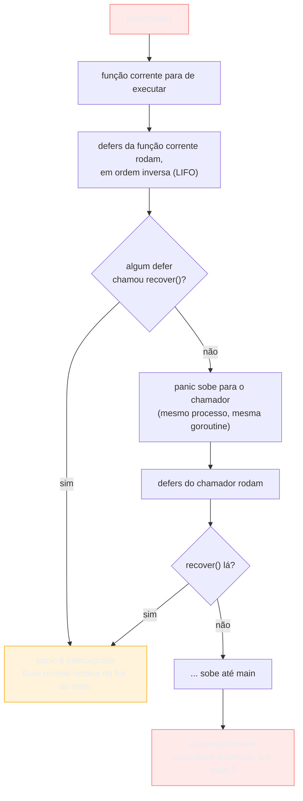

# panic e recover

> [!abstract] TL;DR
> `panic` interrompe o fluxo normal do programa: a função corrente para, `defer`s empilhados começam a rodar em ordem inversa, e o desenrolar (*unwinding*) sobe pela pilha de chamadas até o `main` — se ninguém intervier, o processo morre com stack trace. `recover()`, chamado **dentro de um `defer`**, é a única forma de interceptar esse desenrolar e devolver a goroutine ao fluxo normal. A tentação de usar `panic`/`recover` como um `try/catch` disfarçado é o erro mais comum de quem chega de Java, Python ou JS — em Go, `error` já é o mecanismo de controle de fluxo para falhas esperadas; `panic` é reservado para o que o programa não sabe, e não deveria tentar, continuar executando. Os poucos usos legítimos de `recover`: bibliotecas que isolam pânico de terceiros (parsers), servidores que não podem deixar uma goroutine travada derrubar o processo inteiro, e `init()`/testes que preferem abortar cedo e alto.

## O cenário: quando `error` não é suficiente

Até aqui, o galho tratou toda falha como um valor — `error` retornado, checado com `if err != nil`, decidido pelo chamador. Isso cobre o caso comum: arquivo não existe, conexão caiu, input inválido. São falhas **esperadas** — o programa sabe que podem acontecer e decide o que fazer.

Mas existe uma segunda categoria de falha, mais rara e mais grave: o programa descobre que uma invariante que ele mesmo garantiu foi violada. Um índice fora dos limites de um slice. Uma divisão por zero num cálculo que "não deveria" chegar a zero. Um `nil` desreferenciado onde a lógica do próprio código garantia que não seria `nil`. Nesses casos, não é o *dado de entrada* que está errado — é o **próprio programa** que tem um bug, e continuar executando a partir dali é mais perigoso do que parar.

Go já reage a boa parte disso sozinho, sem você escrever `panic` em lugar nenhum:

```go
s := []int{1, 2, 3}
fmt.Println(s[5]) // panic: runtime error: index out of range [5] with length 3
```

Esse `panic` não veio de código seu — veio do runtime, que detectou a violação e decidiu que continuar seria pior do que parar. É o mesmo mecanismo que você pode disparar manualmente com a função embutida `panic()`, e é o mesmo mecanismo que `recover()` pode interceptar.

## O que acontece quando panic dispara



O ponto central: **`panic` não é uma exceção que "voa" para qualquer `catch` mais próximo** — ele sobe função por função, executando cada `defer` pendente naquele nível antes de continuar subindo. Se nenhum `defer`, em nenhum nível da pilha daquela goroutine, chamar `recover()`, o processo inteiro termina — não só a goroutine que entrou em pânico. Isso é diferente de exceções em Java/Python, onde uma exceção não tratada numa thread secundária normalmente não derruba o processo todo; em Go, um `panic` não recuperado em **qualquer** goroutine mata o programa inteiro, goroutine principal incluída.

## `defer` + `recover`: o único par que funciona

`recover()` só tem efeito quando chamado **diretamente dentro de uma função adiada com `defer`**. Chamado em qualquer outro contexto — direto no corpo da função, ou dentro de uma função que o `defer` apenas invoca indiretamente — `recover()` retorna `nil` e não faz nada.

```go
func seguro() (err error) {
    defer func() {
        if r := recover(); r != nil {
            err = fmt.Errorf("recuperado de panic: %v", r)
        }
    }()

    panic("algo deu muito errado")
}

func main() {
    err := seguro()
    fmt.Println(err) // recuperado de panic: algo deu muito errado
}
```

Repare na estrutura, porque é sempre a mesma:

1. `defer func() { ... }()` — uma closure anônima, adiada, executada mesmo que a função entre em pânico.
2. Dentro dela, `if r := recover(); r != nil` — `recover()` retorna o valor passado a `panic()` (aqui, a string), ou `nil` se não havia pânico em andamento.
3. O `defer` pode modificar o **named return** (`err`) da função — é assim que o pânico vira um `error` normal para quem chamou `seguro()`. Sem named return, o `recover` ainda impede a morte do processo, mas não tem como comunicar o que aconteceu de volta ao chamador.

> [!warning] `recover()` fora de `defer` não faz nada
> `recover()` chamado direto no corpo da função (sem estar dentro de um `defer`) sempre retorna `nil`, mesmo durante um pânico ativo. É um erro sutil de quem tenta "adiantar" a checagem — o compilador não avisa, o código simplesmente não recupera o pânico e o processo morre do mesmo jeito.

> [!warning] `recover()` só enxerga pânico da própria goroutine
> Um `defer`/`recover` numa goroutine não intercepta `panic` disparado em *outra* goroutine — cada goroutine tem sua própria pilha de defers. Uma goroutine lançada com `go f()` que entra em pânico sem seu próprio `recover()` interno derruba o processo inteiro, mesmo que a goroutine que a lançou tenha `recover` em algum lugar. Servidores que processam requisições em goroutines separadas (como o padrão `net/http`) recuperam pânico **dentro de cada goroutine de requisição**, nunca de fora.

## `panic` NÃO é controle de fluxo

Este é o ponto que mais precisa ficar internalizado antes de escrever qualquer linha de Go em produção: **`panic`/`recover` não é o `try`/`catch` de Go**. `error` já preenche esse papel — para toda falha que o chamador pode razoavelmente prever e decidir tratar (arquivo ausente, timeout, validação), a convenção idiomática é sempre retornar `error`, nunca disparar `panic`.

```go
// Não idiomático — usa panic para uma falha absolutamente esperada
func Dividir(a, b float64) float64 {
    if b == 0 {
        panic("divisão por zero")
    }
    return a / b
}

// Idiomático — divisão por zero é um caso previsível, vira error
func Dividir(a, b float64) (float64, error) {
    if b == 0 {
        return 0, errors.New("divisão por zero")
    }
    return a / b, nil
}
```

A diferença não é estilística. `error` obriga o chamador a decidir explicitamente o que fazer (`if err != nil`) — o compilador não deixa o valor de retorno ser ignorado silenciosamente sem pelo menos aparecer no código. `panic`, ao contrário, propaga silenciosamente por qualquer número de frames até alguém — talvez ninguém — decidir capturá-lo. Usar `panic` para "divisão por zero" transforma uma falha de negócio trivial numa bomba-relógio que qualquer código no meio do caminho pode deixar explodir o processo inteiro.

> [!warning] Biblioteca que faz panic em vez de retornar error quebra a composabilidade
> Se uma função de biblioteca faz `panic` para sinalizar "argumento inválido" em vez de retornar `error`, todo chamador é forçado a decidir entre (a) confiar cegamente que o argumento está sempre certo, ou (b) envolver a chamada num `recover` manual só para tratar um caso que deveria ter sido um `if err != nil` comum. A [documentação oficial](https://go.dev/blog/defer-panic-and-recover) é explícita: pânico deve ser reservado para erros realmente excepcionais — bugs de programação, estados internos inconsistentes — não para o fluxo normal de erros de uma API.

## Os poucos casos legítimos

Existem situações em que `panic`/`recover` é, de fato, a ferramenta certa — todas elas compartilham a característica de tratar uma condição **verdadeiramente irrecuperável no ponto onde ocorre**, ou de isolar pânico alheio para não derrubar um processo maior.

**1. Bug de programação, não falha esperada.** Uma pré-condição da própria função foi violada — algo que só acontece se o código chamador estiver errado, não se o mundo externo estiver errado:

```go
func NovoServidor(porta int) *Servidor {
    if porta <= 0 || porta > 65535 {
        panic(fmt.Sprintf("porta inválida: %d", porta))
    }
    return &Servidor{porta: porta}
}
```

Aqui, `porta` vem de uma constante ou configuração do próprio código — não de input de usuário. Se ela está errada, é um bug que precisa ser corrigido no código, não uma condição de runtime que o chamador deveria tratar com `if err != nil`.

**2. Isolar pânico de código de terceiros — o padrão mais comum na prática.** Um parser recursivo, por exemplo, evita propagar `panic` por dezenas de frames de recursão convertendo-o num `error` só no ponto de entrada público:

```go
func Parse(input string) (resultado string, err error) {
    defer func() {
        if r := recover(); r != nil {
            err = fmt.Errorf("parse falhou: %v", r)
        }
    }()

    return parseInterno(input), nil // pode disparar panic() internamente
}
```

`parseInterno` (e as funções que ela chama) usam `panic` livremente como atalho interno de controle — é mais simples do que propagar `error` por várias camadas de recursão — mas a fronteira pública `Parse` sempre devolve um `error` normal. Esse é exatamente o padrão usado no pacote `encoding/json` da biblioteca padrão internamente. O detalhe crucial: o `panic` nunca escapa da fronteira do pacote — de fora, `Parse` parece uma função comum que retorna `error`.

**3. Servidor que não pode deixar uma requisição travar o processo inteiro.** É por isso que servidores HTTP recuperam pânico por requisição — um bug numa rota não deveria derrubar todas as outras:

```go
func recuperarPanico(next http.HandlerFunc) http.HandlerFunc {
    return func(w http.ResponseWriter, r *http.Request) {
        defer func() {
            if rec := recover(); rec != nil {
                slog.Error("panic recuperado", "erro", rec, "path", r.URL.Path)
                http.Error(w, "erro interno", http.StatusInternalServerError)
            }
        }()
        next(w, r)
    }
}
```

> [!info] `log/slog` é da standard library desde Go 1.21
> O exemplo acima usa `slog.Error` — logging estruturado nativo, sem dependência externa, disponível desde Go 1.21. Antes disso, era comum recorrer a `log.Printf` sem estrutura ou a bibliotecas de terceiros como `zap`/`zerolog`.

O `net/http` da standard library já faz algo parecido internamente para cada goroutine de conexão — mas só protege contra o processo inteiro morrer; ele registra o pânico e fecha aquela conexão. Middlewares como o acima existem para ter controle sobre o que acontece depois (log estruturado, resposta HTTP específica).

**4. `init()` e testes que preferem falhar cedo e alto.** Um `panic` num `init()` — código executado antes de `main`, onde ainda não há chamador para checar um `error` de retorno — é aceitável quando a alternativa é o programa continuar rodando num estado que não faz sentido:

```go
func init() {
    if _, err := os.Stat(caminhoConfigObrigatorio); err != nil {
        panic("config obrigatório ausente: " + caminhoConfigObrigatorio)
    }
}
```

`init()` não tem como retornar `error` — não tem assinatura para isso. Se a ausência do arquivo torna o programa inteiro inválido antes mesmo de começar, `panic` é a única ferramenta disponível para abortar ali.

## Armadilhas comuns

> [!warning] `recover()` engole o pânico silenciosamente se você não relançar o que não sabe tratar
> Um `defer`/`recover` genérico demais pode capturar um pânico que você não esperava e não sabe tratar corretamente — mascarando um bug real como se fosse um erro tratável. Se o `recover` não reconhece o tipo/formato do valor recuperado, o padrão seguro é relançar: `panic(r)` de novo, dentro do próprio `defer`, deixando o pânico continuar subindo para quem realmente sabe lidar com ele.

> [!warning] `panic(err)` perde a distinção sintática de `error`
> Passar um `error` para `panic` (`panic(err)`) funciona — `recover()` devolve o valor original, que pode ser type-asserted de volta para `error` — mas mistura dois canais que o design de Go mantém propositalmente separados. Prefira `panic(fmt.Sprintf(...))` ou um tipo de erro dedicado só quando o pânico é mesmo a ferramenta certa (casos acima); para o resto, retorne `error` e não chegue perto de `panic`.

> [!warning] Goroutine sem recover próprio derruba o processo mesmo com recover em outro lugar
> Como mencionado acima, mas vale repetir por ser a causa mais comum de "por que meu servidor caiu inteiro por causa de uma requisição": `go func() { ... }()` sem `defer`/`recover` *dentro* dela é uma bomba — se algo panicar ali, nenhum `recover` de fora daquela goroutine intercepta.

## Vindo de Java, Python ou Node

| Conceito | Java/Python/Node | Go |
|---|---|---|
| Falha esperada (validação, I/O) | Exception/`throw` + `try/catch` | `error` como valor de retorno |
| Falha irrecuperável (bug, invariante quebrada) | `RuntimeException`/`AssertionError` não capturada | `panic` |
| Interceptar e continuar | `catch (Exception e)` em qualquer ponto da pilha | `recover()` só dentro de `defer`, um nível por vez |
| Erro não tratado numa thread/goroutine | Normalmente só mata aquela thread | Mata o **processo inteiro**, goroutine principal incluída |
| Uso idiomático de exceção/panic | Ampla — exceptions viram controle de fluxo comum em muito código Java/Python | Estreito — reservado a bugs e isolamento, não a fluxo normal |

A diferença mais perigosa para quem migra: código Java que usa `try/catch` como controle de fluxo comum ("captura, loga, segue o baile") não tem equivalente idiomático direto em Go via `panic`/`recover`. O equivalente correto quase sempre é `error` + `if err != nil`.

## Como explicar em inglês

> `panic` unwinds the call stack of the current goroutine: the running function stops, its deferred calls run in reverse order, and control moves up to the caller — repeating until either a deferred `recover()` intercepts it or the stack is exhausted, at which point the whole process crashes with a stack trace. `recover()` only has effect when called directly inside a deferred function; called anywhere else, it's a no-op that returns `nil`. The rule that trips up developers from Java, Python, or Node: Go doesn't treat `panic`/`recover` as `try`/`catch`. `error` is already the idiomatic channel for expected failures — validation, missing files, timeouts. `panic` is reserved for programmer bugs and truly unrecoverable states: a violated invariant, a nil pointer that "shouldn't" be nil. The handful of legitimate uses are isolating third-party panics at a package boundary (turning them into an `error` before they escape), per-request recovery in servers so one bad request doesn't crash the whole process, and failing loudly in `init()` when there's no error-return path available.

| Termo PT | Termo EN |
|---|---|
| pânico | panic |
| recuperar (o pânico) | recover |
| desenrolar da pilha | stack unwinding |
| adiado / função adiada | deferred / deferred function |
| falha irrecuperável | unrecoverable failure |
| isolar pânico | contain a panic |
| relançar o pânico | re-panic |
| falhar cedo e alto | fail fast and loud |

## O que vem a seguir

Esta nota tratou `panic`/`recover` como mecanismo isolado — o que ele faz, quando usar, quando não usar. Mas na prática, um projeto real precisa decidir uma **estratégia** coerente combinando `error`, wrapping, sentinel errors, erros customizados e — raramente — `panic`, aplicada de forma consistente em toda a base de código. A [[06 - Estratégias de tratamento de erro|nota 06]] junta as peças dos últimos cinco capítulos numa política prática: quando envolver com contexto, quando parar de propagar e tratar, quando logar, quando abortar.

## Veja também

- [[01 - Erros são valores — o tipo error|01 — Erros são valores — o tipo error]] — o canal padrão para falhas esperadas, em contraste direto com panic
- [[03 - Error wrapping e a cadeia de erros|03 — Error wrapping e a cadeia de erros]] — como propagar error com contexto, a alternativa idiomática a panic
- [[04 - Erros customizados|04 — Erros customizados]] — tipos de erro ricos, outra ferramenta que evita a tentação de usar panic
- [[06 - Estratégias de tratamento de erro|06 — Estratégias de tratamento de erro]] — próxima nota, como combinar tudo numa política coeren­te
- [[03-Dominios/Tecnologia/Go/index|Trilha Go]]

## Fontes

- Kincaid, Andrew. *Defer, Panic, and Recover*. The Go Blog, go.dev. https://go.dev/blog/defer-panic-and-recover (acessado em 2026-07-18)
- The Go Authors. *The Go Programming Language Specification — Handling panics*. go.dev. https://go.dev/ref/spec#Handling_panics (acessado em 2026-07-18)
- The Go Authors. *Effective Go — Panic*. go.dev. https://go.dev/doc/effective_go#panic (acessado em 2026-07-18)
- The Go Authors. *Effective Go — Recover*. go.dev. https://go.dev/doc/effective_go#recover (acessado em 2026-07-18)
- Go by Example. *Panic*. gobyexample.com. https://gobyexample.com/panic (acessado em 2026-07-18)
- pkg.go.dev. *log/slog package documentation*. pkg.go.dev. https://pkg.go.dev/log/slog (acessado em 2026-07-18)
