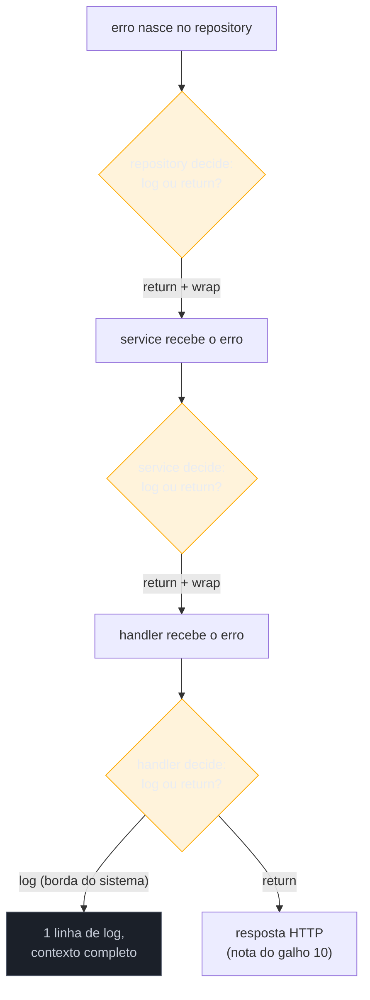
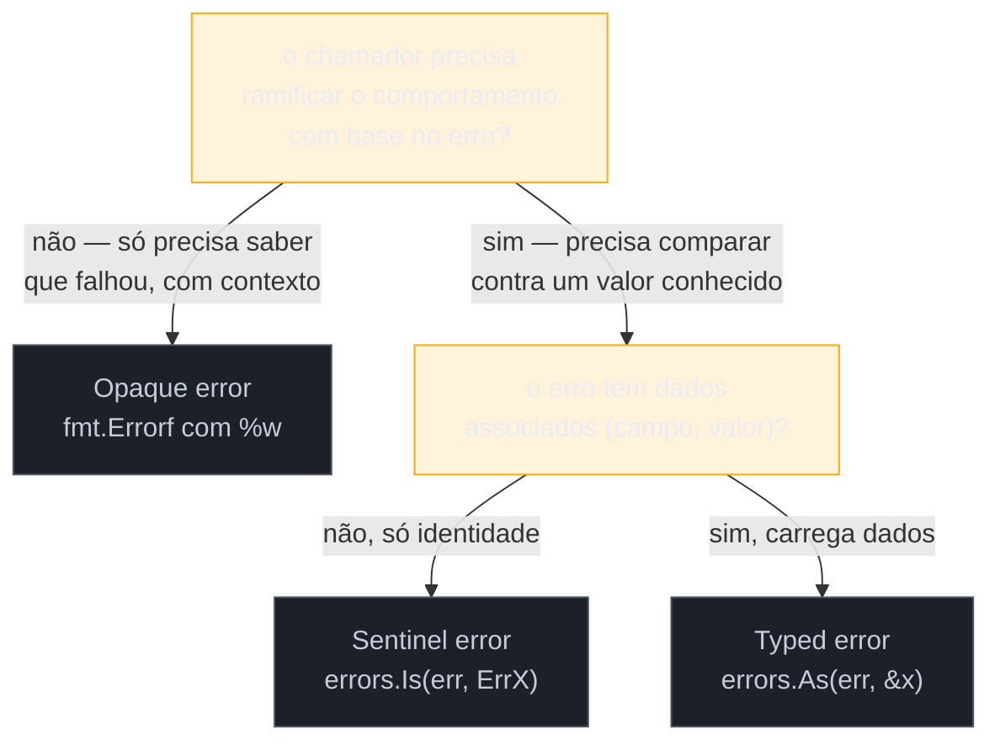

# Estratégias de tratamento de erro

> [!abstract] TL;DR
> As quatro notas anteriores deram as peças — `error`, sentinelas, wrapping, tipos customizados. Esta nota dá a **disciplina** de uso: trate um erro **uma única vez** (log OU return, nunca os dois — a temida *log-and-return duplication*), envelope com contexto **enquanto sobe** a pilha de chamadas (não no ponto onde nasceu), e escolha entre sentinel, typed e opaque error olhando pra uma pergunta só: *o chamador precisa decidir algo com base neste erro, ou só precisa saber que algo deu errado?* A decisão de "onde tratar" também tem endereço: nas bordas do sistema (handler HTTP, `main`, worker de fila) — nunca no meio da pilha de domínio.

## O log poluído

Um serviço de pedidos, três camadas de chamada: `handler` chama `service`, `service` chama `repository`. O `repository` falha ao buscar um pedido no banco:

```go
func (r *Repository) FindOrder(id string) (*Order, error) {
    row := r.db.QueryRow("SELECT * FROM orders WHERE id = ?", id)
    var o Order
    if err := row.Scan(&o.ID, &o.Total); err != nil {
        log.Printf("erro ao buscar pedido %s: %v", id, err) // trata #1
        return nil, err
    }
    return &o, nil
}

func (s *Service) GetOrder(id string) (*Order, error) {
    o, err := s.repo.FindOrder(id)
    if err != nil {
        log.Printf("erro no service ao buscar pedido: %v", err) // trata #2
        return nil, err
    }
    return o, nil
}

func (h *Handler) GetOrderHandler(w http.ResponseWriter, r *http.Request) {
    id := r.URL.Query().Get("id")
    o, err := h.service.GetOrder(id)
    if err != nil {
        log.Printf("erro no handler: %v", err) // trata #3
        http.Error(w, "erro interno", 500)
        return
    }
    json.NewEncoder(w).Encode(o)
}
```

Rode isso em produção e um único pedido inexistente vira **três linhas de log** — a mesma falha, contada três vezes, em três níveis de detalhe diferentes, sem que nenhuma delas sozinha conte a história inteira. Quem lê o log de manhã não sabe se são três incidentes ou um só. Some volume de tráfego real e esse padrão vira ruído puro: o log deixa de ser instrumento de diagnóstico e vira arquivo que ninguém mais lê de verdade.

O problema não é logar. É logar **e** propagar o mesmo erro — cada camada faz as duas coisas, quando deveria fazer só uma.

## A regra: handle once

A formulação mais citada da comunidade Go vem de Dave Cheney, num post que virou referência obrigatória sobre o assunto: um erro deve ser **tratado uma única vez**. Tratar significa uma de duas coisas, nunca as duas ao mesmo tempo:

- **Logar** — você decidiu que este é o fim da linha para este erro. Ele vira uma entrada de log e o programa segue (ou não).
- **Retornar** (possivelmente envelopado) — você decidiu que quem chamou você está em posição melhor pra decidir o que fazer, então repassa a decisão pra cima.



Repare que cada camada intermediária (`repository`, `service`) só faz uma metade da escolha: **return**, nunca log. Só a última camada — a borda — decide logar. O resultado é uma única entrada de log por falha, e essa entrada carrega o contexto acumulado de toda a subida, porque cada `return` envelopou um pouco:

```go
func (r *Repository) FindOrder(id string) (*Order, error) {
    row := r.db.QueryRow("SELECT * FROM orders WHERE id = ?", id)
    var o Order
    if err := row.Scan(&o.ID, &o.Total); err != nil {
        return nil, fmt.Errorf("buscar pedido %s no banco: %w", id, err)
    }
    return &o, nil
}

func (s *Service) GetOrder(id string) (*Order, error) {
    o, err := s.repo.FindOrder(id)
    if err != nil {
        return nil, fmt.Errorf("service.GetOrder: %w", err)
    }
    return o, nil
}

func (h *Handler) GetOrderHandler(w http.ResponseWriter, r *http.Request) {
    id := r.URL.Query().Get("id")
    o, err := h.service.GetOrder(id)
    if err != nil {
        log.Printf("GetOrderHandler falhou: %v", err) // ÚNICO log, contexto completo
        http.Error(w, "erro interno", http.StatusInternalServerError)
        return
    }
    json.NewEncoder(w).Encode(o)
}
```

Uma linha no log: `GetOrderHandler falhou: service.GetOrder: buscar pedido 42 no banco: sql: no rows in result set`. A cadeia inteira, numa entrada só, produzida pelo `%w` que a [[03 - Error wrapping e a cadeia de erros|nota 03]] já explicou em detalhe. Cheney resume o princípio numa frase que vale decorar: *"only handle an error once — handling means inspecting the error and making a decision"*. Logar e retornar ao mesmo tempo não é "tratar duas vezes com cuidado extra" — é tratar mal, duas vezes.

> [!warning] "Handle once" não é "não envelope"
> É tentador ler a regra como "só a última camada mexe no erro". Errado: cada camada intermediária **deve** envelopar com `%w` antes de retornar — é assim que o contexto chega até a borda. O que cada camada intermediária não deve fazer é *logar* também. Envelopar é parte do "return"; não é uma terceira ação proibida.

## Envelopar subindo, não descendo

A ordem importa: contexto se adiciona **na subida**, uma camada de cada vez, nunca tentando adivinhar lá embaixo o que vai interessar lá em cima. O `repository` não sabe (e não deveria saber) que existe um HTTP handler chamando ele através do `service` — então ele envelopa só com o que sabe: "estava buscando este pedido, neste banco". O `service` acrescenta a própria camada de contexto: "estava executando GetOrder". Cada `fmt.Errorf("%w", ...)` é uma etiqueta grudada no pacote conforme ele sobe, não uma tentativa de prever o destino final.

```go
// repository sabe sobre banco de dados — não sobre HTTP nem sobre o domínio "pedido do cliente X"
return nil, fmt.Errorf("buscar pedido %s no banco: %w", id, err)

// service sabe sobre a operação de negócio — não sobre banco nem sobre HTTP
return nil, fmt.Errorf("GetOrder: %w", err)

// handler sabe sobre a requisição HTTP — decide o que expor ao cliente
// (mapear pra status code é assunto do galho 10)
```

Essa disciplina resolve um problema clássico de debugging: erro genérico demais pra saber onde a falha aconteceu. `sql: no rows in result set` sozinho não diz nada — pode ter vindo de qualquer uma das dezenas de queries do sistema. A cadeia completa (`GetOrderHandler falhou: service.GetOrder: buscar pedido 42 no banco: sql: no rows in result set`) localiza a falha com precisão cirúrgica, sem precisar de stack trace nem de debugger anexado.

> [!question]- Envelopar em toda camada não deixa a mensagem gigante e redundante?
> Em cadeias muito profundas, sim — mensagens de 5-6 níveis de `%w` ficam verbosas. A prática comum é envelopar com contexto **relevante e específico** (um ID, uma operação, nunca "erro aqui" genérico) e confiar que `errors.Is`/`errors.As` (nota 02) resolvem a inspeção programática, deixando a mensagem textual como *documentação legível para humano*, não como mecanismo de controle de fluxo. Se a cadeia ficar longa demais para leitura, é sinal de que a pilha de chamadas tem camadas demais — problema de arquitetura, não de tratamento de erro.

## Sentinel, typed, opaque: qual usar, e onde decidir

As três notas anteriores do galho já ensinaram *como* declarar cada estilo — sentinela (`var ErrNotFound = errors.New(...)`), typed error (`type ValidationError struct{...}`) e a ideia implícita de erro opaco (só a mensagem, sem identidade programática). O que falta é o critério de **quando usar cada um**, e essa escolha se resume a uma pergunta sobre o **chamador**:

> O código que vai chamar esta função precisa **decidir algo diferente** dependendo de qual erro voltou?



- **Opaque** — a esmagadora maioria dos erros no meio de uma pilha de chamadas. `fmt.Errorf("ler config: %w", err)` — o chamador não vai fazer nada diferente dependendo do conteúdo exato; só precisa saber que a operação falhou, com contexto suficiente pra logar ou reportar. É o caso default; use os outros dois só quando tiver motivo concreto.
- **Sentinel** — quando existe um número pequeno e fixo de condições nomeáveis que o chamador precisa distinguir, sem dados extras associados. `sql.ErrNoRows`, `io.EOF`, o `ErrEstoqueInsuficiente` da nota 02: o chamador faz `if errors.Is(err, ErrEstoqueInsuficiente) { ... }` e ramifica.
- **Typed** — quando o chamador precisa não só saber *que tipo* de erro aconteceu, mas também **extrair dados** dele. `ValidationError{Field: "email", Msg: "formato inválido"}` da nota 04: o chamador faz `errors.As(err, &ve)` e depois lê `ve.Field` pra, por exemplo, destacar o campo errado num formulário.

A regra prática de ouro, ecoando o que Rob Pike já apontava desde os primeiros dias de Go (retomado por Dave Cheney em "Don't just check errors, handle them gracefully"): **exportar erro como valor comparável (sentinel/typed) é compromisso de API**. Uma vez que `ErrNotFound` está exportado, qualquer código externo pode passar a depender dele com `errors.Is` — e você não pode mais mudar a implementação interna sem quebrar contrato. Erro opaco não tem esse custo: você pode reescrever a mensagem, trocar a causa raiz, sem quebrar ninguém, porque ninguém deveria estar comparando contra o texto.

> [!warning] Comparar mensagem de erro com string é a armadilha mais comum de todas
> `if err.Error() == "not found" { ... }` ou `strings.Contains(err.Error(), "not found")` parecem funcionar em teste local e quebram silenciosamente no primeiro `fmt.Errorf` que muda uma palavra da mensagem, ou no primeiro wrapping que a envolve num prefixo. Mensagem de erro é para **humano ler**, não para código comparar — esse é o motivo de existir sentinel e typed error em primeiro lugar. Se você se pegar comparando `.Error()` com string, é sinal de que falta um sentinel ou um typed error ali.

## Onde decidir: a borda, não o meio

A pergunta "handle once: log ou return?" tem uma resposta padrão por camada, e ela segue a arquitetura em camadas que qualquer serviço Go de porte médio já tem:

| Camada | Decisão típica | Por quê |
|---|---|---|
| Repository / infra | `return` (envelopado) | não sabe o que fazer com a falha — só sabe onde ela aconteceu |
| Service / domínio | `return` (envelopado), às vezes converte pra sentinel/typed | conhece as regras de negócio, mas não sabe se é HTTP, CLI ou worker de fila chamando |
| Handler HTTP / `main` / worker | `log` **e** decide a resposta final | é a borda — não existe mais ninguém acima pra delegar a decisão |

Essa tabela é uma instância direta do princípio geral que Dave Cheney chama de tratar erros nas **bordas do sistema**: o meio da pilha só propaga com contexto; a borda é onde o erro vira uma ação observável — log estruturado, resposta HTTP, exit code, retry de mensagem de fila. Duas fronteiras deste galho valem nomear aqui, sem entrar no mérito: erros de cancelamento/timeout vindos de `context` (`context.Canceled`, `context.DeadlineExceeded`) têm regras próprias de tratamento — assunto do galho 9 — e a conversão de erro de domínio pra status HTTP e corpo de resposta é o assunto inteiro do galho 10. Aqui a régua é só "log ou return", não "que status HTTP usar".

> [!info] `log/slog` (Go 1.21+) facilita "logar uma vez, com contexto estruturado"
> A partir do Go 1.21, o pacote padrão `log/slog` permite anexar o erro como campo estruturado em vez de interpolar tudo numa string: `slog.Error("GetOrderHandler falhou", "err", err, "order_id", id)`. Isso reforça a disciplina de handle-once: o log na borda vira um evento estruturado e pesquisável (por `order_id`, por tipo de erro) em vez de uma linha de texto livre — sem mudar nada do raciocínio sobre onde tratar.

## Casos práticos

**1. Convertendo erro opaco em sentinel só na fronteira que precisa decidir** — o `repository` não sabe de regra de negócio, mas o `service` sabe que "não encontrado" merece tratamento especial:

```go
var ErrOrderNotFound = errors.New("pedido não encontrado")

func (r *Repository) FindOrder(id string) (*Order, error) {
    row := r.db.QueryRow("SELECT * FROM orders WHERE id = ?", id)
    var o Order
    if err := row.Scan(&o.ID, &o.Total); err != nil {
        return nil, fmt.Errorf("buscar pedido %s: %w", id, err) // opaco, envelopado
    }
    return &o, nil
}

func (s *Service) GetOrder(id string) (*Order, error) {
    o, err := s.repo.FindOrder(id)
    if err != nil {
        if errors.Is(err, sql.ErrNoRows) {
            return nil, fmt.Errorf("%w: id %s", ErrOrderNotFound, id) // vira sentinel aqui
        }
        return nil, fmt.Errorf("GetOrder: %w", err)
    }
    return o, nil
}

func (h *Handler) GetOrderHandler(w http.ResponseWriter, r *http.Request) {
    id := r.URL.Query().Get("id")
    o, err := h.service.GetOrder(id)
    switch {
    case errors.Is(err, ErrOrderNotFound):
        http.Error(w, "pedido não encontrado", http.StatusNotFound)
    case err != nil:
        slog.Error("GetOrderHandler falhou", "err", err, "order_id", id)
        http.Error(w, "erro interno", http.StatusInternalServerError)
    default:
        json.NewEncoder(w).Encode(o)
    }
}
```

O `service` é o lugar certo pra essa conversão porque é ele quem conhece a semântica de domínio ("não encontrado" é esperado, não excepcional); o `repository` só conhece SQL, e o `handler` só decide o que fazer com a decisão já tomada.

**2. Worker de fila — a borda também pode ser um loop, não só um handler HTTP:**

```go
func (w *Worker) processMessage(msg Message) {
    if err := w.handle(msg); err != nil {
        var ve *ValidationError
        switch {
        case errors.As(err, &ve):
            slog.Warn("mensagem inválida, descartando", "field", ve.Field, "msg_id", msg.ID)
            msg.Ack() // erro de dado do cliente: não adianta reprocessar
        default:
            slog.Error("falha ao processar mensagem, reenfileirando", "err", err, "msg_id", msg.ID)
            msg.Nack() // erro possivelmente transitório: tenta de novo
        }
        return
    }
    msg.Ack()
}
```

Aqui o `errors.As` faz o trabalho de decisão que justifica ter um typed error em primeiro lugar: `ValidationError` carrega `Field`, então o log fica específico sem precisar fazer parsing de string; e a ramificação (`Ack` vs `Nack`) é exatamente o tipo de decisão que só a borda deveria tomar.

## Armadilhas comuns

> [!warning] `if err != nil { log.Println(err); return err }` é a armadilha mais comum do galho inteiro
> Aparece em quase todo tutorial de Go copiado sem pensar, e é exatamente o padrão que "handle once" proíbe. Se você se pegar escrevendo log e return juntos numa função que não é a borda do sistema, pare e pergunte: "quem vai consumir este log?" Se a resposta é "ninguém, porque o erro vai ser logado de novo lá em cima", apague o `log`.

> [!warning] Sentinel/typed exportado demais vira dívida de API
> Exportar `ErrX` ou `TipoDeErro` de um pacote é prometer que o formato daquele erro é estável — igual a exportar um campo de struct. Antes de exportar, pergunte se algum chamador de fato precisa ramificar com base nele; se não, deixe opaco e sem exportar. É fácil promover erro interno pra sentinel exportado depois que aparece necessidade real; o caminho inverso (des-exportar algo que já tem consumidor externo) quebra contrato.

> [!warning] Logar dentro de um `for` que repassa erro de item em item
> Processar uma lista e logar cada erro individualmente dentro do loop, e *depois* também retornar um erro agregado pro chamador, reproduz a mesma duplicação em miniatura — só que multiplicada pelo tamanho da lista. Ou o loop trata cada erro (loga e segue pro próximo item) ou acumula os erros e devolve pro chamador decidir — não as duas coisas.

## Vindo de outras linguagens

| Linguagem | Padrão comum | Diferença em Go |
|---|---|---|
| Java | `catch (Exception e) { log.error(e); throw e; }` — log-and-rethrow é quase reflexo, porque exceções carregam stack trace de graça | Go não tem stack trace automático; o contexto vem do `%w` explícito em cada camada — então log-and-return duplica *conteúdo*, não só esforço |
| Python | `except Exception as e: logger.exception(e); raise` — mesmo padrão de log-and-reraise, popular em frameworks web | mesma lógica de "handle once" se aplica, mas em Python o hábito de log-and-reraise é mais tolerado porque o traceback agregado ainda ajuda; em Go, sem traceback, a duplicação de log é puro ruído |
| Node.js / JS | middleware de erro no Express loga uma vez na borda — é, coincidentemente, o padrão que esta nota recomenda | é o cenário mais parecido: a convenção de "error middleware só na borda" do Express é quase um espelho do handle-once de Go, só que Go formaliza isso sem framework nenhum |

## Como explicar em inglês

> The core discipline for Go error handling is **handle once**: an error should either be logged (you've decided this is the end of the line) or returned, possibly wrapped with `%w` for context — never both. Wrapping happens on the way *up* the call stack, one layer of context at a time; the repository adds "what I was doing," the service adds its own layer, and only the boundary — an HTTP handler, `main`, a queue worker — actually logs, because it's the last place with no one left to delegate the decision to. Choosing between a sentinel error, a typed error, and a plain opaque `fmt.Errorf` wrap comes down to one question: does the caller need to branch on this error? If not, keep it opaque — it's cheaper to maintain and doesn't become an API commitment. If yes, use `errors.Is` against a sentinel for simple identity checks, or `errors.As` against a typed error when the caller needs to extract data from the failure.

| Termo PT | Termo EN |
|---|---|
| tratar uma única vez | handle once |
| duplicação de log-e-return | log-and-return duplication |
| envelopar na subida | wrap on the way up |
| borda do sistema | system boundary / edge |
| erro opaco | opaque error |
| compromisso de API | API commitment |
| log estruturado | structured logging |

## O que vem a seguir

Esta nota deu a disciplina de *onde* e *como* tratar — mas ainda dentro do modelo de erro-como-valor que o Go abraça desde a primeira nota do galho. A [[07 - Erros vs exceções|próxima nota]] recua um passo e compara esse modelo, de frente, com o modelo de exceções de Java/Python/JS: por que Go recusou `try/catch`, o que se ganha (fluxo de controle explícito, sem "erro invisível" pulando frames) e o que se perde (verbosidade do `if err != nil` repetido) — a base conceitual para entender por que `panic`/`recover` (nota 05) existe mas é deliberadamente raro em código idiomático.

## Veja também

- [[01 - Erros são valores — o tipo error|01 — Erros são valores — o tipo error]] — base do modelo `error` que esta nota assume
- [[02 - Criando e comparando erros|02 — Criando e comparando erros]] — sentinelas e `errors.Is`, retomados na seção de decisão
- [[03 - Error wrapping e a cadeia de erros|03 — Error wrapping e a cadeia de erros]] — o `%w` que sustenta a disciplina de "envelopar na subida"
- [[04 - Erros customizados|04 — Erros customizados]] — typed errors e `errors.As`, retomados na seção de decisão
- [[05 - panic e recover|05 — panic e recover]] — o mecanismo que esta disciplina deliberadamente evita usar
- [[07 - Erros vs exceções|07 — Erros vs exceções]] — próxima nota do galho
- [[03-Dominios/Tecnologia/Go/index|Trilha Go]]

## Fontes

- Cheney, Dave. *Don't just check errors, handle them gracefully*. dave.cheney.net. https://dave.cheney.net/2016/04/27/dont-just-check-errors-handle-them-gracefully (acessado em 2026-07-18)
- Cheney, Dave. *Errors and exceptions, redux*. dave.cheney.net. https://dave.cheney.net/2016/04/26/errors-and-exceptions-redux (acessado em 2026-07-18)
- The Go Authors. *Working with Errors in Go 1.13*. go.dev/blog. https://go.dev/blog/go1.13-errors (acessado em 2026-07-18)
- The Go Authors. *log/slog package documentation*. pkg.go.dev. https://pkg.go.dev/log/slog (acessado em 2026-07-18)
- The Go Authors. *Effective Go — Errors*. go.dev. https://go.dev/doc/effective_go#errors (acessado em 2026-07-18)
